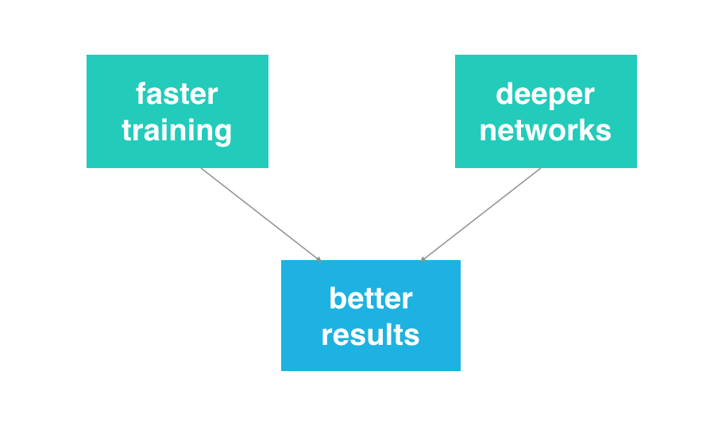
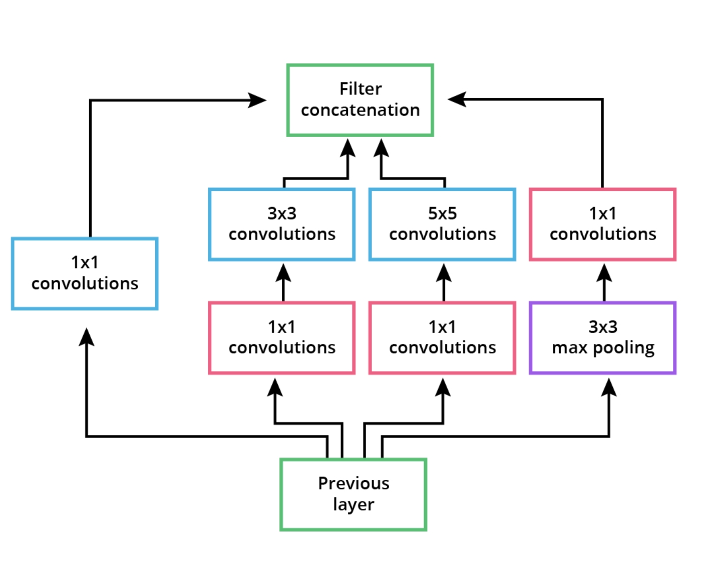
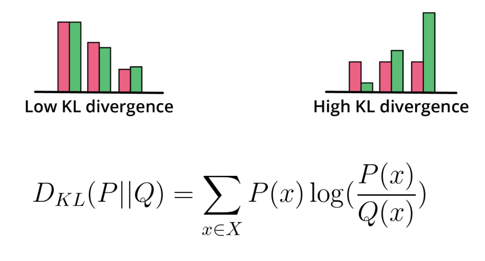

# C-2: Training a Deep Convolutional GANs

1. Deep Convolutional GAN Architecture
    - DCGAN Discriminator Design
    - DCGAN Generator Design
    - Architectural Innovations and Constraints
2. Batch Normalization in GANs
    - Fundamentals of Batch Normalization
    - Internal Covariate Shift
    - Mathematical Implementation
    - Benefits for GAN Training
3. GAN Training Strategies and Optimization
    - Hyperparameter Selection
    - Two Times Update Rule (TTUR)
    - Training Challenges and Solutions
    - Stability Techniques
4. Evaluating GAN Performance
    - Inception Score
    - Fréchet Inception Distance (FID)
    - Comparing Evaluation Metrics
    - Implementation Considerations
5. Advanced GAN Applications
    - Semi-Supervised Learning with GANs
    - Additional GAN Implementations

#### Deep Convolutional GAN Architecture

Imagine trying to forge a masterpiece painting. You'd need both an artist (the forger) and an art expert (the
authenticator) engaged in a constant back-and-forth. Deep Convolutional GANs (DCGANs) work in a similar way, but they're
specifically designed to handle images through specialized neural network architectures.

DCGANs represent a significant leap forward from the original GAN framework by incorporating convolutional neural
networks—the gold standard for image processing—into both the generator and discriminator components. This architectural
choice is motivated by a simple insight: if we want to generate convincing images, we should use networks that
inherently understand spatial relationships.

<div align="center">
<p>

</p>
<p>figure: DCGAN Architecture Overview</p>
</div>

Let's explore how these networks are structured and why they work so well for image generation.

##### DCGAN Discriminator Design

The discriminator in a DCGAN serves as our "art expert," evaluating whether images are real or generated. But unlike a
standard neural network that treats inputs as flat vectors, the DCGAN discriminator maintains the spatial structure of
images throughout its processing pipeline.

<div align="center">
<p>

</p>
<p>figure: DCGAN Discriminator Structure</p>
</div>

At its core, the DCGAN discriminator is a convolutional neural network that progressively processes an image through
several key stages:

1. **Input Processing**: The discriminator begins with a raw image (such as a 32×32×3 color image). Unlike many CNNs
   that might normalize or preprocess this input, the DCGAN deliberately avoids batch normalization at this initial
   stage to preserve the original distribution of pixel values.

2. **Feature Extraction Through Downsampling**: As the image moves through the network, the discriminator uses strided
   convolutions to simultaneously extract features and reduce spatial dimensions. Think of this as the expert focusing
   on increasingly abstract patterns:

    - First layer might detect edges and simple textures
    - Middle layers identify more complex patterns and shapes
    - Deeper layers recognize higher-level image structures

3. **Architectural Pattern**: Each convolutional layer follows a specific sequence:

    - Apply convolutional filters (typically 3×3 or 5×5) with a stride of 2
    - This stride effectively halves the spatial dimensions with each layer
    - As spatial dimensions decrease, the network increases the number of feature channels
    - For example: 32×32×3 → 16×16×64 → 8×8×128 → 4×4×256

    This creates a pyramid-like structure that gradually condenses spatial information while extracting richer features.

4. **Activation Strategy**: After each convolution (except the final output), the discriminator applies Leaky ReLU
   activation with a small slope coefficient (typically 0.2) for negative values. This choice is crucial because:

    - Unlike standard ReLU that completely blocks negative signals with a hard zero
    - Leaky ReLU allows a small gradient for negative values (like a slight whisper rather than complete silence)
    - This prevents "dying ReLU" problems where neurons might stop learning entirely
    - It helps maintain a more balanced learning dynamic between generator and discriminator

5. **Normalization Approach**: Batch normalization is applied after each convolutional layer (except the first) to
   stabilize training. This process:

    - Normalizes the activations to have zero mean and unit variance
    - Reduces internal covariate shift (keeping the distribution of activations more consistent)
    - Allows higher learning rates and makes training more stable
    - Helps the network learn more effectively regardless of initialization

6. **Final Classification**: After the series of convolutional layers:

    - The final feature maps are flattened into a one-dimensional vector
    - This vector passes through a fully connected layer to produce a single value
    - A sigmoid activation function squeezes this value between 0 and 1
    - This final output represents the probability that the input image is real

One distinctive feature of the DCGAN discriminator is the absence of pooling layers. Traditional CNNs often use max or
average pooling to reduce dimensions, but DCGANs rely entirely on strided convolutions. This design choice means that
instead of using fixed downsampling operations, the network learns how to best condense spatial information while
preserving important features.

The discriminator essentially functions as a sophisticated authenticity detector that progressively develops an
understanding of what makes an image look real, from low-level texture patterns to higher-level structural coherence.

##### DCGAN Generator Design

The generator in a DCGAN acts as our "forger," creating images that aim to fool the discriminator. It performs the
reverse operation of the discriminator, transforming a simple random noise vector into a structured, detailed image.

<div align="center">
<p>

</p>
<p>figure: DCGAN Generator Architecture</p>
</div>

The generator's architecture creates a pathway from abstract representations to concrete visual details:

1. **Input Foundation**: The generator begins with a random noise vector (typically 100 dimensions) sampled from a
   normal or uniform distribution. This vector serves as the creative "seed" from which an image will emerge.

2. **Initial Projection**: The first challenge is transforming this simple vector into the beginnings of an image
   structure:

    - The random vector passes through a fully connected layer
    - This layer expands the vector to a small but deep feature map (e.g., 4×4×512)
    - This tiny feature map contains the condensed "plan" for the entire image

3. **Progressive Upsampling**: From this compact starting point, the generator gradually builds the image through a
   series of transposed convolution operations (sometimes called deconvolutions):

    - Each transposed convolution doubles the spatial dimensions
    - The feature depth (channels) decreases as the spatial dimensions increase
    - For example: 4×4×512 → 8×8×256 → 16×16×128 → 32×32×3

    You can think of this as starting with a rough sketch and gradually adding increasingly fine details.

4. **Transposed Convolutions**: These specialized layers perform upsampling by essentially reversing the convolution
   process:

    - They transform each input value into a larger output pattern
    - Mathematically, they can be viewed as inserting zeros between input values and performing a standard convolution
    - The stride of 2 doubles the resolution at each stage
    - Unlike simple interpolation, these operations learn how to best expand the image

5. **Activation Functions**: The generator uses different activations at different stages:

    - ReLU activations in all hidden layers, which help create sparse, distinctive features
    - Tanh activation in the final output layer, which constrains the generated image values to the range [-1, 1]

6. **Normalization Strategy**: Like the discriminator, the generator uses batch normalization after each transposed
   convolutional layer (except the final output layer) to:

    - Stabilize training by normalizing feature distributions
    - Prevent mode collapse by ensuring diverse activations
    - Improve gradient flow through the deep architecture

The generator's architecture embodies a "coarse-to-fine" approach to image creation. It first establishes the broad
structure and general composition of the image before progressively adding finer details as the resolution increases.
This mimics how an artist might start with a rough sketch before adding increasingly detailed elements.

A fascinating aspect of the generator is that it never directly sees real training data. Instead, it must learn what
makes an image look realistic solely through the feedback it receives from the discriminator. This creates a unique
learning dynamic where the generator develops an implicit understanding of visual patterns without ever being directly
shown examples.

The final tanh activation is particularly important as it constrains the output to the same normalized range (-1 to 1)
as the preprocessed training images, ensuring that the discriminator evaluates both real and generated images on an
equal footing.

##### Architectural Innovations and Constraints

The DCGAN architecture introduced several breakthrough design principles that dramatically improved GAN stability and
performance. These innovations transformed GANs from interesting but finicky research curiosities into practical tools
for high-quality image generation.

**Key Architectural Innovations:**

1. **Elimination of Fully Connected Layers**: DCGANs remove fully connected layers throughout most of the network
   (except the generator's input and discriminator's output). This design choice:

    - Reduces parameter count, making the network more efficient
    - Preserves spatial information throughout the network pipeline
    - Forces the network to learn meaningful spatial hierarchies
    - Improves gradient flow during backpropagation

    Think of this as requiring the networks to "think visually" throughout the entire process rather than flattening
    images into abstract representations.

2. **Strided Convolutions for Downsampling**: Rather than using pooling operations that simply take the maximum or
   average value in a region, DCGANs use strided convolutions for downsampling. This means:

    - The network learns its own optimal way to reduce dimensions
    - All downsampling operations are learnable rather than fixed
    - The network can preserve the most important spatial information

    This is like having a smart compression algorithm that learns what details matter rather than blindly compressing
    everything.

3. **Transposed Convolutions for Upsampling**: The generator uses transposed convolutions rather than simple upsampling
   followed by convolution. This approach:

    - Creates learnable upsampling operations
    - Produces smoother and more coherent spatial expansions
    - Gives the network flexibility in how it increases resolution

    Instead of just enlarging a small image like stretching a photo (which would look blurry), the network learns how to
    intelligently fill in details when increasing size.

4. **Strategic Batch Normalization Placement**: Batch normalization is applied to most layers, with two specific
   exceptions:

    - Not used on the discriminator's input layer to preserve the original image statistics
    - Not used on the generator's output layer to maintain the output range

    This carefully designed normalization strategy helps stabilize training while preserving essential information at
    the input and output stages.

5. **Specialized Activation Functions**: DCGANs employ different activation functions for specific purposes:

    - Leaky ReLU in the discriminator prevents the "dying neuron" problem
    - Standard ReLU in the generator encourages sparse, meaningful feature representations
    - Tanh in the generator's output normalizes the final image values

**Design Constraints and Principles:**

1. **Balanced Network Capacity**: The discriminator and generator maintain relatively balanced learning capacity. If
   either network becomes too powerful, the delicate adversarial learning process breaks down.

2. **Consistent Feature Map Progression**: Both networks follow a structured pattern of spatial dimension changes and
   feature channel adjustments:

    - Each layer transition either doubles or halves spatial dimensions
    - Feature channels increase as spatial dimensions decrease (and vice versa)

    This creates a symmetrical pyramid-like structure that methodically transforms between image space and latent space.

3. **Architectural Symmetry**: The generator and discriminator mirror each other structurally. The generator expands
   from a vector to an image, while the discriminator condenses an image back toward a single value.

4. **No Pooling Layers**: The deliberate avoidance of pooling layers ensures that the network learns its own optimal
   spatial hierarchies rather than using fixed downsampling operations.

5. **Single Sigmoid Output**: The discriminator outputs a single probability value through a sigmoid activation,
   providing a simple real/fake judgment.

**Implementation Details:**

1. **Filter Size Standardization**: DCGANs typically use small, uniform filter sizes (3×3 or 5×5) throughout the
   network.
2. **Progressive Resolution Changes**: Each layer transition changes resolution by a factor of 2, creating a smooth
   progression of spatial dimensions.
3. **Channel Depth Scaling**: As spatial dimensions decrease, channel depth increases proportionally. This maintains a
   relatively consistent information capacity at each layer.
4. **Weight Initialization**: Network weights are typically initialized from a normal distribution with mean 0 and
   standard deviation 0.02, which empirically improves training stability.
5. **Optimization Parameters**: DCGANs often use specific optimizer settings, such as Adam with a learning rate of
   0.0002 and a momentum parameter β₁ of 0.5 (rather than the default 0.9).

These architectural innovations created a template that many subsequent GAN variants have built upon. The DCGAN
architecture established a solid foundation of design principles that made GANs practical for high-quality image
generation and opened the door for more advanced architectures like Progressive GANs, StyleGAN, and others that have
pushed the boundaries of what's possible in computer-generated imagery.

#### Batch Normalization in GANs

Batch normalization represents one of the most significant innovations for training deep neural networks, and it plays
an especially crucial role in making GANs trainable. Let's explore why this technique is so important and how it works.

<div align="center">
<p>

</p>
<p>figure: Batch Normalization Step 1</p>
</div>

##### Fundamentals of Batch Normalization

At its heart, batch normalization addresses a fundamental challenge in training deep neural networks: the constantly
shifting distribution of inputs that each layer receives during training. This shifting creates a moving target problem
that makes learning difficult.

Imagine you're trying to learn to catch a ball, but the weight and size of the ball keep changing unpredictably every
few seconds. You'd struggle to develop a consistent technique! Neural networks face a similar challenge when the
statistical distribution of inputs to each layer keeps shifting as training progresses.

When we train neural networks, we typically normalize the initial inputs to have zero mean and unit variance—scaling
them to a consistent, well-behaved range. This normalization helps the network learn more efficiently. Batch
normalization extends this concept by applying a similar normalization at every layer in the network.

The key insight is beautifully simple yet powerful: normalize the outputs of each layer before they become inputs to the
next layer. This ensures that each layer receives inputs with a relatively consistent statistical distribution
throughout training, regardless of how parameters in previous layers are changing.

Think of each layer in a neural network as a specialized worker in an assembly line. Batch normalization is like having
quality control stations between workers, ensuring that regardless of what the previous worker does, each person always
receives materials within a standardized range they know how to handle.

For GANs specifically, this normalization becomes doubly important because we have two networks (generator and
discriminator) simultaneously learning and adjusting their parameters. Without batch normalization, this complex dynamic
often becomes unstable, with one network overwhelming the other or both networks failing to converge.

<div align="center">
<p>

</p>
<p>figure: Complete Batch Normalization Process</p>
</div>

Batch normalization operates by taking a mini-batch of data (hence the name) and performing several statistical
operations:

1. Calculate the mean and variance of the activations across the batch for each feature
2. Normalize the activations using these statistics
3. Scale and shift the normalized values using learnable parameters

This process allows each layer to learn more independently, without being overly sensitive to the specific distributions
produced by previous layers. It's like giving each layer a fresh start with well-behaved inputs, creating more stable
learning conditions throughout the network.

##### Internal Covariate Shift

"Internal covariate shift" is the technical term for the problem that batch normalization addresses. While it sounds
complex, the concept is intuitive when we break it down.

In machine learning, "covariate shift" traditionally refers to a change in the distribution of inputs between training
and testing phases. "Internal covariate shift" extends this concept to what happens inside a neural network during
training.

Let's visualize this: imagine a deep neural network as a series of interconnected layers. During training, as the
parameters of each layer update, the distribution of outputs from that layer also changes. This means the next layer
suddenly receives inputs with a different statistical distribution than what it saw previously.

This shifting creates a cascading effect throughout the network. It's as if the ground is constantly moving under each
layer's feet. When the first layer updates its weights, it changes the distribution of its outputs, which affects the
second layer, which affects the third layer, and so on.

This internal covariate shift causes several problems:

1. **Slower convergence**: Each layer must continuously adapt to the shifting input distributions, making learning
   inefficient
2. **Lower learning rates**: To prevent instability with shifting distributions, we're forced to use smaller learning
   rates
3. **Initialization sensitivity**: Networks become highly dependent on good initial weight values
4. **Training difficulty**: Very deep networks become incredibly challenging to train

In GANs, this problem is amplified because both the generator and discriminator are deep networks that simultaneously
update their parameters in an adversarial relationship. The discriminator tries to distinguish between real and fake
images, while the generator tries to produce images that fool the discriminator. Without stabilization, this creates a
doubly chaotic environment where both networks are causing internal covariate shift for themselves while also changing
the inputs that the other network receives.

For example, when the generator improves and creates more realistic images, this changes what "fake" examples look like
for the discriminator. Similarly, as the discriminator becomes better at spotting subtle flaws, the generator receives
different feedback signals. It's like playing a game where the rules keep changing!

Batch normalization directly addresses internal covariate shift by ensuring that regardless of how the parameters of
earlier layers change, each layer receives inputs with a relatively consistent statistical distribution. This
consistency dramatically improves the training dynamics, especially in the complex adversarial setting of GANs.

##### Mathematical Implementation

Let's walk through the mathematical implementation of batch normalization, breaking down each step to understand both
what's happening and why.

For any layer in our network, batch normalization processes a mini-batch of activations through a sequence of
operations:

**Step 1: Calculate the batch mean**

First, we compute the average value across the batch for each feature:

$$\mu_B = \frac{1}{m} \sum_{i=1}^{m} x_i$$

Where:

- $x_i$ represents the activation value for a particular feature in one example
- $m$ is the batch size (the number of examples we're processing together)
- $\mu_B$ is the resulting mean for this feature across the batch

This gives us the "center" of our data distribution for this feature in the current batch.

**Step 2: Calculate the batch variance**

Next, we measure how spread out the values are by calculating the variance:

$$\sigma_B^2 = \frac{1}{m} \sum_{i=1}^{m} (x_i - \mu_B)^2$$

This formula measures the average squared difference between each value and the mean. Larger variances indicate more
spread-out distributions, while smaller variances indicate values clustered closer to the mean.

**Step 3: Normalize the activations**

Now we use these statistics to normalize each activation value:

$$\hat{x}_i = \frac{x_i - \mu_B}{\sqrt{\sigma_B^2 + \epsilon}}$$

Where:

- $\epsilon$ is a small constant (typically 10^-5) added to prevent division by zero
- $\hat{x}_i$ is the normalized activation

This transformation shifts and scales our distribution so it has approximately zero mean and unit variance. It's like
standardizing test scores so they follow a consistent scale, regardless of how easy or difficult the original test was.

The $\epsilon$ term serves two purposes: it prevents numerical instability when the variance is very small, and it
slightly increases the apparent variance. This slight variance increase is statistically sound because we're using a
batch to estimate the statistics of the entire dataset, and sample variances tend to underestimate population variances.

**Step 4: Scale and shift (learnable parameters)**

The final step introduces two learnable parameters that allow the network to undo the normalization if needed:

$$y_i = \gamma \hat{x}_i + \beta$$

Where:

- $\gamma$ is a scaling factor (learnable)
- $\beta$ is a shifting factor (learnable)
- $y_i$ is the final output of the batch normalization operation

These parameters are crucial because sometimes the raw, unnormalized values actually contain useful information for the
task. By learning appropriate values for $\gamma$ and $\beta$, the network can decide how much normalization is
beneficial for each feature.

If the network determines normalization isn't helpful for a particular feature, it can learn to set $\gamma$ to the
standard deviation of the original data and $\beta$ to the original mean, effectively recovering the input distribution.

**Training vs. Inference**

An important detail: during training, we use statistics calculated from the current mini-batch. But during inference
(when we're using the model to make predictions), we typically process examples one at a time or in batches of different
sizes.

To handle this, batch normalization tracks running estimates of the mean and variance during training:

$$\mu_{running} = \text{momentum} \times \mu_{running} + (1 - \text{momentum}) \times \mu_B$$
$$\sigma^2_{running} = \text{momentum} \times \sigma^2_{running} + (1 - \text{momentum}) \times \sigma_B^2$$

Where momentum is typically set to 0.9 or 0.99, creating an exponential moving average of the batch statistics.

During inference, these running statistics are used instead of calculating new batch statistics, ensuring consistent
behavior regardless of batch size.

**Implementation in GANs**

In GAN architectures, batch normalization is applied with two important exceptions:

1. It is not applied to the generator's output layer, as this would constrain the distribution of the generated images
2. It is not applied to the discriminator's input layer, as this would discard valuable information about the real data
   distribution

For both networks, batch normalization is typically applied after the linear or convolutional operation but before the
activation function:

```
Layer → Batch Normalization → Activation → Next Layer
```

This order ensures that the activation function receives normalized inputs, which helps prevent saturation in functions
like sigmoid or tanh and improves the effectiveness of ReLU variants.

##### Benefits for GAN Training

Batch normalization provides numerous benefits that are particularly valuable for GAN training, addressing many of the
challenges that previously made GANs notoriously difficult to train.

**1. Training Stability**

Perhaps the most critical benefit for GANs is improved training stability. Without batch normalization, GAN training
often suffers from:

- The discriminator becoming too powerful too quickly, providing minimal useful gradient information to the generator
- Mode collapse, where the generator produces only a limited variety of outputs
- Oscillation between different failure modes rather than convergence

Batch normalization stabilizes training by:

- Preventing extreme activation values that can cause gradient problems
- Ensuring more consistent learning signals between the networks
- Moderating the pace at which either network can dominate the training process

This stability is like adding training wheels to a bicycle—it makes the learning process more balanced and predictable,
allowing GANs to train for longer periods and reach better solutions.

**2. Faster Convergence**

While each iteration might take slightly longer due to the additional computations, batch normalization typically leads
to faster overall convergence:

- It reduces internal covariate shift, allowing each layer to learn more effectively
- It enables the use of higher learning rates without instability
- It makes the optimization landscape smoother and easier to navigate

For GANs, this faster convergence means we can achieve better results with fewer training iterations, making it
practical to train on larger datasets or at higher resolutions.

**3. Reduced Sensitivity to Initialization**

Before batch normalization, GAN training outcomes were highly dependent on weight initialization, with slight variations
leading to dramatically different results. Batch normalization reduces this sensitivity by:

- Normalizing activations regardless of the initial weight values
- Preventing extreme activation values early in training
- Providing more consistent gradients across different initialization schemes

This reduced sensitivity makes GANs more reliable and reproducible, which is essential for practical applications.

**4. Preventing Mode Collapse**

Mode collapse—where the generator produces only a limited subset of possible outputs—is a common failure mode in GANs.
Batch normalization helps prevent this by:

- Ensuring more diverse activations throughout the network
- Normalizing features that might otherwise dominate and cause the generator to fixate
- Maintaining healthier gradient flow that encourages exploration of the full data distribution

By preventing mode collapse, batch normalization helps ensure that GANs produce diverse and representative outputs
rather than a small set of "safe" examples.

**5. Enabling Deeper Architectures**

Batch normalization makes it practical to train deeper network architectures:

- It helps gradients flow more effectively through many layers
- It prevents the vanishing and exploding gradient problems that often plague deep networks
- It reduces the compounding effect of problematic activations through deep sequences of layers

Deeper architectures generally have more capacity to model complex data distributions, allowing GANs to generate more
detailed and realistic outputs.

**6. Compatibility with Various Activation Functions**

Batch normalization makes a wider range of activation functions viable in deep networks:

- It prevents saturation in sigmoid and tanh functions
- It helps address the "dying ReLU" problem by normalizing inputs to the ReLU function
- It works well with Leaky ReLU, commonly used in discriminators

This flexibility allows GAN designers to choose activation functions based on their properties rather than being
constrained by training stability concerns.

**7. Mild Regularization Effect**

Batch normalization provides a form of regularization because:

- The normalization statistics vary slightly between mini-batches, adding a form of noise
- This stochasticity helps prevent overfitting to particular input patterns
- It encourages the network to be robust to small variations in feature distributions

For GANs, this regularization effect helps the discriminator avoid becoming too specialized to particular examples,
maintaining its ability to provide useful feedback throughout training.

**8. Balance Between Networks**

Successful GAN training requires maintaining a delicate balance between the generator and discriminator. Batch
normalization helps maintain this balance by:

- Preventing either network from becoming overwhelmingly strong
- Providing more consistent gradient information between networks
- Ensuring that improvements in one network don't destabilize the other

This balanced adversarial relationship is essential for the progressive improvement of both networks throughout
training.

In practice, these benefits combine to transform GAN training from a notoriously unstable process into a more
predictable and effective one. While batch normalization doesn't solve all the challenges of GAN training, it addresses
many of the fundamental issues that previously limited GAN performance and applicability, making it an essential
component of most modern GAN architectures.

#### GAN Training Strategies and Optimization

Training GANs effectively requires more than just the right architecture—it demands carefully calibrated optimization
strategies to navigate the complex adversarial learning process. Let's explore the key approaches that transform GAN
training from an unstable art into a more reliable science.

##### Hyperparameter Selection

The choice of hyperparameters dramatically affects GAN training outcomes. Unlike many neural networks where default
values often work reasonably well, GANs require thoughtful tuning to achieve stability and quality results. The delicate
adversarial balance can easily be disrupted by poor hyperparameter choices.

**Learning Rates**

Learning rates control how quickly model parameters update in response to calculated gradients. For GANs, proper
learning rate selection is particularly nuanced:

Most successful GAN implementations use smaller learning rates than typical neural networks, generally between 0.0001
and 0.0005. These conservative values prevent the rapid oscillations that can derail GAN training. When learning rates
are too high, we often observe:

- The discriminator becoming too powerful too quickly, leaving the generator with minimal useful feedback
- Large parameter updates that cause overshooting and instability
- Loss values that oscillate wildly without converging toward any meaningful solution

Interestingly, many experienced practitioners use different learning rates for the generator and discriminator. The
discriminator often benefits from a slightly higher learning rate than the generator (for example, 0.0004 for the
discriminator versus 0.0002 for the generator). This small asymmetry helps maintain the balance between networks,
preventing the discriminator from overwhelming the generator during early training.

Think of the learning rate difference as giving a slight head start to a race between two runners of different
abilities. By giving one runner (the discriminator) a small advantage, we can ensure a more competitive and productive
race overall.

**Optimizer Selection**

The choice of optimizer significantly impacts GAN training dynamics:

Adam optimizer has become nearly universal for GAN training because it combines the benefits of adaptive learning rates
with momentum. However, the standard Adam parameters are typically modified for GANs:

- Beta1 (the exponential decay rate for the first moment estimates) is usually reduced from the default 0.9 to 0.5
- Beta2 (the exponential decay rate for the second moment estimates) is typically kept at the default 0.999
- Weight decay of around 1e-5 is often added as a form of regularization

This modified Adam configuration helps control the rapid changes in gradient direction that are common in adversarial
training. The lower Beta1 value makes the optimizer less dependent on the momentum of previous updates, allowing it to
adapt more quickly to the changing dynamics of the adversarial game.

It's like making a vehicle more responsive to sudden course corrections—essential when navigating the unpredictable
terrain of GAN training.

**Batch Size**

The batch size used during training affects both gradient quality and batch normalization statistics:

- Larger batch sizes (64-128) provide more stable gradient estimates and consistent batch normalization
- Smaller batch sizes introduce more noise, which can sometimes help prevent mode collapse
- Very large batch sizes can lead to overfitting and less generalizable models

Most successful GAN implementations use batch sizes between 32 and 128, with 64 being a common starting point. The ideal
batch size often depends on the specific dataset and architecture.

The batch size choice represents a tradeoff between stability and exploration—larger batches provide more reliable
updates but might make it harder for the generator to explore diverse outputs.

**Latent Space Dimensionality**

The dimensionality of the latent space (the random input vector to the generator) influences the generator's capacity
and output diversity:

- Too few dimensions (less than 32) may constrain the generator's ability to represent complex data distributions
- Too many dimensions (more than 512) can make the space too sparse, complicating the learning process
- Most implementations use between 100-200 dimensions as a good balance

The distribution from which the latent vectors are sampled also matters. Standard normal distributions (mean 0,
variance 1) are most common, but uniform distributions in the range [-1, 1] are also successfully used in some
architectures.

You can think of the latent space as the generator's "vocabulary"—too limited, and it can't express complex ideas; too
vast, and it struggles to form coherent expressions.

**Architectural Parameters**

Beyond basic hyperparameters, several architectural decisions significantly impact GAN performance:

- Number of layers: Deeper models have more capacity but are harder to train
- Feature map counts: More feature maps increase capacity but require more computation
- Kernel sizes: 3×3 or 5×5 kernels are standard for convolutional layers
- Leaky ReLU slope: The negative slope coefficient (alpha) is typically set to 0.2

Starting with the architectural guidelines established by the DCGAN paper provides a solid foundation, with
modifications based on the specific requirements of the dataset and generation task.

**Initialization Strategies**

How network weights are initialized can significantly impact early training dynamics:

- Normal distribution with mean 0 and standard deviation 0.02 is common for GAN weights
- Xavier/Glorot initialization can work well for deeper architectures
- Orthogonal initialization sometimes improves stability

Proper initialization prevents extreme activations in the early phases of training, giving both networks a fair starting
point in their adversarial relationship.

Finding optimal hyperparameters for a specific GAN implementation typically requires systematic experimentation.
Starting with conservative defaults (low learning rates, standard batch sizes, DCGAN-like architecture) and then
carefully adjusting one parameter at a time based on observed behavior is a sound approach. Monitoring both loss values
and the quality of generated samples provides complementary information about training progress.

##### Two Times Update Rule (TTUR)

The Two Times Update Rule (TTUR) addresses one of the fundamental challenges of GAN training: maintaining the proper
balance between generator and discriminator. In standard GAN training, both networks update their parameters once per
batch, but this approach often leads to instability or suboptimal results.

TTUR modifies this standard procedure by allowing the discriminator and generator to update at different rates or with
different learning rates. This seemingly simple modification profoundly affects training dynamics and convergence.

**The Core Principle**

The fundamental insight behind TTUR is that the discriminator and generator face inherently different learning tasks
with varying difficulty:

- The discriminator solves a relatively simpler classification problem: distinguishing real from fake images
- The generator tackles a more complex generation problem: creating images that match the real data distribution

Because of this asymmetry, using identical update schedules for both networks often leads to an imbalance where the
discriminator learns too quickly, becoming too powerful before the generator has a chance to improve. This imbalance
results in vanishing gradients for the generator, as the discriminator becomes confident in its classifications and
provides minimal useful feedback.

Imagine teaching a novice chess player by having them play against a grandmaster who uses every advantage—the novice
would lose quickly and learn very little. TTUR is like handicapping the better player to ensure a more productive
learning experience for both.

TTUR addresses this imbalance through two main approaches:

**1. Different Update Frequencies**

One implementation of TTUR involves updating the discriminator multiple times for each generator update:

```python
for each batch:
    # Update discriminator n times (often n=2-5)
    for i in range(n):
        train_discriminator_on_batch()

    # Update generator once
    train_generator_on_batch()
```

This approach gives the discriminator more opportunities to learn from each batch, helping it maintain a slight
advantage over the generator. This advantage is crucial because:

- If the discriminator is too weak, it provides poor feedback to the generator
- If the discriminator is too strong, it overwhelms the generator and provides vanishing gradients
- The ideal balance is a discriminator that maintains a small edge, providing useful learning signals to the generator

The optimal value of n (the number of discriminator updates per generator update) varies depending on the dataset and
architecture. Values between 2 and 5 are common, with some implementations dynamically adjusting n based on the relative
performance of the two networks.

**2. Different Learning Rates**

An alternative or complementary approach is to use different learning rates for the two networks:

```python
# Example learning rates
discriminator_optimizer = Adam(learning_rate=0.0004, beta1=0.5)
generator_optimizer = Adam(learning_rate=0.0001, beta1=0.5)
```

With this approach, the discriminator's higher learning rate allows it to adapt more quickly to changes in the
generator's output. Again, this maintains a slight advantage for the discriminator without allowing it to completely
overwhelm the generator.

**Theoretical Justification**

The TTUR approach is not merely an empirical hack but has theoretical grounding. Research has shown that using different
learning rates for the generator and discriminator can help GAN training converge to a Nash equilibrium more reliably.

The Fréchet Inception Distance (FID) paper, which also introduced TTUR, demonstrated that this approach leads to better
convergence properties and more stable training. Mathematically, different learning rates modify the dynamics of the
gradient descent process in the two-player game, helping to find a more stable path toward equilibrium.

**Practical Implementation Considerations**

When implementing TTUR, several practical considerations help maximize its effectiveness:

- Monitor both networks' losses to ensure neither becomes too dominant
- If the discriminator loss consistently approaches zero, reduce its update frequency or learning rate
- If the generator seems unable to improve, increase its update frequency or learning rate
- Consider a dynamic approach where the update ratio changes based on loss metrics

TTUR works particularly well when combined with other GAN stabilization techniques like batch normalization, spectral
normalization, or label smoothing.

**Variants and Extensions**

Several variants of TTUR have been proposed and used successfully:

- **Adaptive TTUR**: Dynamically adjusts the update ratio based on the relative performance of the networks
- **Progressive TTUR**: Changes the update ratio over the course of training, often starting with more discriminator
  updates and gradually equalizing
- **Loss-based TTUR**: Ties update decisions to specific thresholds in the loss functions

While TTUR doesn't solve all GAN training challenges, it addresses a fundamental imbalance in the learning process and
has become a standard technique in many successful GAN implementations. Combined with appropriate architecture and other
optimization strategies, it significantly improves the likelihood of successful GAN convergence.

##### Training Challenges and Solutions

GAN training presents unique challenges not found in other deep learning approaches. Understanding these challenges and
their corresponding solutions is essential for successful implementation. Let's explore the major hurdles and effective
strategies to overcome them.

**Challenge 1: Vanishing Gradients**

When the discriminator becomes too effective too quickly, it can identify generated samples with high confidence. This
results in gradients that are nearly zero, providing minimal useful feedback to the generator.

**Solutions:**

- **Alternative Loss Functions**: The original GAN formulation uses a minimax loss function that can lead to vanishing
  gradients. The non-saturating generator loss (maximizing log D(G(z)) instead of minimizing log(1-D(G(z)))) provides
  stronger gradients when the discriminator confidently rejects generated samples.
- **Wasserstein Loss**: The Wasserstein GAN (WGAN) formulation replaces the standard loss with a distance metric that
  provides more consistent gradients throughout training. Instead of predicting probability, the discriminator (now
  called a critic) estimates the Wasserstein distance between real and generated distributions.
- **Gradient Penalty**: Adding a gradient penalty term (as in WGAN-GP) helps maintain useful gradient information even
  when the discriminator becomes confident. It penalizes the discriminator for having gradients with norms far from 1,
  enforcing a Lipschitz constraint.

The non-saturating loss can be implemented with a simple modification to the generator's objective:

```python
# Standard GAN loss (can vanish when D is confident)
g_loss = -torch.mean(torch.log(1 - d_fake))

# Non-saturating loss (stronger gradients)
g_loss = -torch.mean(torch.log(d_fake))
```

This modification is like changing a game from "avoid being caught" to "actively try to deceive"—a subtle but important
shift in objective that provides better learning signals.

**Challenge 2: Mode Collapse**

Mode collapse occurs when the generator produces only a limited subset of possible outputs, ignoring the diversity
present in the training data. For example, when generating digits, the generator might only produce convincing examples
of a few digits rather than all ten.

**Solutions:**

- **Minibatch Discrimination**: Adding a layer to the discriminator that compares samples within a minibatch, allowing
  it to detect lack of diversity. This explicitly penalizes the generator for producing too many similar samples.
- **Unrolled GANs**: Unrolling the discriminator updates to provide the generator with more information about how the
  discriminator will respond to its changes. This helps the generator avoid strategies that lead to temporary success
  but longer-term failure.
- **Experience Replay**: Maintaining a buffer of previously generated samples and occasionally training the
  discriminator on these older samples to prevent cycling behavior. This helps the discriminator remember previous
  generator strategies.

Example of minibatch discrimination concept:

```python
# Conceptual implementation
def minibatch_features(samples):
    # Compute distances between all pairs of samples in the batch
    differences = samples.unsqueeze(0) - samples.unsqueeze(1)
    distances = torch.exp(-torch.sum(torch.abs(differences), dim=2))
    return torch.sum(distances, dim=1)
```

Mode collapse is like a student who memorizes just enough answers to pass a test rather than understanding the
underlying concepts. These solutions help ensure the generator learns the full distribution rather than finding
shortcuts.

**Challenge 3: Training Instability and Non-Convergence**

GAN training often exhibits oscillatory behavior rather than smooth convergence, with performance sometimes degrading
after initially promising results.

**Solutions:**

- **Gradient Clipping**: Limiting the magnitude of gradients to prevent extreme parameter updates that can destabilize
  training.
- **Spectral Normalization**: Constraining the spectral norm of the weight matrices to ensure that the discriminator is
  a Lipschitz function. This prevents the discriminator from becoming too confident or making extreme judgments based on
  small input changes.
- **Progressive Growing**: Starting with low-resolution images and gradually increasing resolution during training,
  establishing stable low-frequency structures before adding details. This approach, pioneered by Progressive GANs,
  makes it easier to learn the data distribution incrementally.
- **Two Timescale Update Rule (TTUR)**: Using different learning rates or update frequencies for the generator and
  discriminator to maintain balance between the networks.

Implementation of gradient clipping:

```python
# Apply gradient clipping during optimization
torch.nn.utils.clip_grad_norm_(model.parameters(), max_norm=1.0)
```

Training instability in GANs is like trying to balance on a seesaw while your partner is also adjusting their
position—these techniques help create a more predictable and controllable learning dynamic.

**Challenge 4: Evaluation Difficulty**

Unlike supervised learning with clear metrics, evaluating GAN performance is challenging because loss values often don't
correlate well with sample quality.

**Solutions:**

- **Inception Score (IS)**: Measures both the quality and diversity of generated samples using a pre-trained classifier.
  It captures whether generated images look like clear, recognizable objects (quality) and whether the generator
  produces a diverse range of outputs (diversity).
- **Fréchet Inception Distance (FID)**: Compares the statistics of generated and real samples in feature space,
  providing a more robust measure of similarity between the generated and real data distributions.
- **Visual Inspection**: Regular qualitative evaluation of generated samples by human observers remains important, as
  automated metrics don't always capture perceptual quality.
- **Mode Coverage Metrics**: Custom metrics to evaluate how well the generator covers all modes in the data
  distribution, particularly important for multimodal datasets.

Evaluation challenges in GANs are like judging a translation without knowing the original language—we need multiple
complementary measures to assess different aspects of quality.

**Challenge 5: Hyperparameter Sensitivity**

GAN performance can vary dramatically based on architectural choices, learning rates, and other hyperparameters.

**Solutions:**

- **Standardized Architectures**: Starting with proven architectures like DCGAN and modifying incrementally reduces the
  search space and provides a reliable foundation.
- **Learning Rate Schedulers**: Gradually reducing learning rates during training can stabilize later stages when the
  networks are approaching equilibrium.
- **Hyperparameter Search**: Systematic exploration of hyperparameter space, often focusing on learning rates and batch
  sizes first, helps identify optimal configurations.
- **Curriculum Learning**: Starting with easier generation tasks and progressively increasing difficulty allows the
  networks to build competence gradually.

Learning rate scheduling example:

```python
# Create a learning rate scheduler that reduces by factor of 0.1 every 100 epochs
scheduler = torch.optim.lr_scheduler.StepLR(optimizer, step_size=100, gamma=0.1)
```

Hyperparameter sensitivity in GANs is like trying to adjust a complex audio equalizer—small changes can have outsized
effects, and finding the right settings requires careful tuning.

**Challenge 6: Balancing Generator and Discriminator Strength**

Maintaining the right balance between generator and discriminator capabilities is crucial but difficult.

**Solutions:**

- **Adaptive Update Ratios**: Dynamically adjusting how frequently each network updates based on their relative
  performance helps maintain balance throughout training.
- **Asymmetric Architectures**: Giving slightly different capacities to the generator and discriminator can help
  compensate for the inherent difference in task difficulty.
- **Soft Labels**: Using labels like 0.9 instead of 1.0 for real samples prevents the discriminator from becoming too
  confident and provides softer gradients.
- **One-sided Label Smoothing**: Smoothing only the real labels while keeping fake labels at 0 prevents the
  discriminator from assigning high confidence to areas without data.

Implementation of label smoothing:

```python
# Instead of training with hard labels
real_labels = torch.ones(batch_size, 1)
fake_labels = torch.zeros(batch_size, 1)

# Use smoothed labels
real_labels = torch.ones(batch_size, 1) * 0.9
fake_labels = torch.zeros(batch_size, 1)
```

Balancing generator and discriminator strength is like coordinating two dancers—they need to challenge each other while
remaining in sync for the performance to succeed.

**Challenge 7: Memorization vs. Generalization**

The discriminator may memorize training examples rather than learning the underlying distribution, limiting the
generator's ability to generalize.

**Solutions:**

- **Feature Matching**: Training the generator to match statistics of intermediate discriminator features rather than
  directly maximizing the final output helps focus on meaningful representations.
- **Consistency Regularization**: Ensuring the discriminator gives similar outputs for slightly perturbed inputs
  promotes learning robust features rather than memorizing specific examples.
- **Regularization Techniques**: Adding weight decay, dropout, or other regularization to the discriminator prevents
  overfitting to training examples.

Example of feature matching concept:

```python
# Extract intermediate features from the discriminator
real_features = discriminator.extract_features(real_images)
fake_features = discriminator.extract_features(fake_images)

# Add feature matching loss (mean squared error between feature statistics)
feature_matching_loss = torch.mean((real_features.mean(0) - fake_features.mean(0))**2)
```

The memorization challenge is similar to learning a language by memorizing phrases versus understanding grammar
rules—these techniques push the networks toward learning underlying patterns rather than specific examples.

By systematically addressing these challenges with appropriate solutions, GAN training can be significantly stabilized,
leading to higher quality outputs and more reliable convergence. The field continues to evolve with new techniques and
refinements, but these foundational approaches provide a solid framework for successful GAN implementation.

##### Stability Techniques

Achieving stable GAN training is crucial for producing high-quality results consistently. Various techniques have been
developed specifically to enhance stability during the adversarial training process. These methods address different
aspects of instability and can be combined for cumulative benefits.

**Normalization Techniques**

Normalization methods help control the distribution of activations and gradients throughout the network, preventing
extreme values that can destabilize training.

1. **Batch Normalization**: Beyond its benefits for addressing internal covariate shift, batch normalization directly
   contributes to stability by preventing extreme activations. In GANs, it's applied with specific considerations:

    - Omitted from the generator's output layer to preserve the flexibility of the output distribution
    - Omitted from the discriminator's input layer to maintain the original statistics of real and generated data
    - Often used with a lower momentum parameter (e.g., 0.8 instead of 0.9) to better handle the non-stationary nature
      of GAN training

    Batch normalization acts like a thermostat in each layer, maintaining a comfortable temperature range regardless of
    what's happening elsewhere in the network.

2. **Layer Normalization**: An alternative to batch normalization that normalizes across the feature dimension rather
   than the batch dimension:

    - Less dependent on batch size, making it useful for small batches
    - Can be more stable when batch statistics vary significantly
    - Particularly useful when batch size constraints exist

    Layer normalization is like having individual thermostats for each example rather than one thermostat for the whole
    batch.

3. **Spectral Normalization**: A powerful technique that constrains the spectral norm (maximum singular value) of each
   weight matrix in the discriminator:

    - Enforces Lipschitz continuity, which is theoretically important for Wasserstein GANs
    - Prevents the discriminator from making extreme changes to its output based on small input changes
    - Implementation involves dividing each weight matrix by its largest singular value

    Example implementation:

    ```python
    def spectral_norm(weight, n_iterations=1):
        # Calculate maximum singular value using power iteration method
        u = torch.randn(1, weight.shape[0])
        for _ in range(n_iterations):
            v = torch.matmul(u, weight)
            v = v / v.norm()
            u = torch.matmul(v, weight.transpose(0, 1))
            u = u / u.norm()
        sigma = torch.matmul(torch.matmul(u, weight), v.transpose(0, 1))
        # Normalize weight by dividing with the spectral norm
        return weight / sigma
    ```

    Spectral normalization is like adding shock absorbers to the discriminator, ensuring it responds smoothly rather
    than abruptly to different inputs.

**Loss Function Modifications**

Standard GAN loss functions can contribute to instability. Several modifications address these issues:

1. **Non-saturating Generator Loss**: Replaces the original minimax loss with a formulation that provides stronger
   gradients:

    ```python
    # Original (saturating) loss
    g_loss = -torch.mean(torch.log(1 - d_fake))
   
    # Non-saturating alternative
    g_loss = -torch.mean(torch.log(d_fake))
    ```

    This change ensures the generator receives meaningful gradients even when the discriminator confidently rejects its
    outputs, like changing a negative incentive ("avoid punishment") to a positive one ("seek reward").

2. **Wasserstein Loss**: Replaces the Jensen-Shannon divergence implicit in the original GAN with the Wasserstein
   distance:

    ```python
    # Discriminator loss
    d_loss = -torch.mean(d_real) + torch.mean(d_fake)
   
    # Generator loss
    g_loss = -torch.mean(d_fake)
    ```

    The Wasserstein formulation provides more stable gradients throughout training and a more meaningful loss curve.
    It's like measuring the actual distance between two mountains rather than just checking if one is taller than the
    other.

3. **Hinge Loss**: A margin-based loss function that has shown good stability properties:

    ```python
    # Discriminator loss
    d_loss_real = torch.mean(torch.relu(1.0 - d_real))
    d_loss_fake = torch.mean(torch.relu(1.0 + d_fake))
    d_loss = d_loss_real + d_loss_fake
    
    # Generator loss
    g_loss = -torch.mean(d_fake)
    ```

    The hinge loss encourages a margin between real and fake samples, helping the discriminator provide more consistent
    feedback—like creating a buffer zone between territories rather than just a line in the sand.

**Regularization Approaches**

Various regularization techniques help prevent overfitting and improve stability:

1. **Gradient Penalty**: Adds a penalty term to the discriminator loss that enforces a constraint on the gradient norm:

    ```python
    # Sample points between real and fake data
    alpha = torch.rand(batch_size, 1, 1, 1)
    interpolates = alpha * real_data + (1 - alpha) * fake_data
    interpolates.requires_grad_(True)

    # Calculate gradients of discriminator output with respect to interpolates
    d_interpolates = discriminator(interpolates)
    gradients = torch.autograd.grad(outputs=d_interpolates, inputs=interpolates,
                                  grad_outputs=torch.ones_like(d_interpolates),
                                  create_graph=True)[0]

    # Calculate gradient penalty
    gradient_penalty = ((gradients.norm(2, dim=1) - 1) ** 2).mean()

    # Add to discriminator loss
    d_loss = d_loss + lambda_gp * gradient_penalty
    ```

    The gradient penalty encourages the discriminator to be a 1-Lipschitz function, stabilizing Wasserstein GAN
    training. It's like installing guardrails on a winding mountain road to prevent cars from veering off the path.

2. **R1 Regularization**: A simpler alternative to gradient penalty that penalizes the gradient magnitude only at real
   data points:

    ```python
    # Calculate gradients at real data points
    real_data.requires_grad_(True)
    d_real = discriminator(real_data)
    gradients = torch.autograd.grad(outputs=d_real, inputs=real_data,
                                  grad_outputs=torch.ones_like(d_real),
                                  create_graph=True)[0]
   
    # R1 penalty
    r1_penalty = 0.5 * torch.mean(gradients.pow(2).sum(dim=[1, 2, 3]))
   
    # Add to discriminator loss
    d_loss = d_loss + lambda_r1 * r1_penalty
    ```

    This approach is computationally more efficient than gradient penalty while still providing stability benefits. It
    focuses on keeping the discriminator well-behaved around real data points.

3. **Label Smoothing**: Prevents the discriminator from becoming too confident by softening the target labels:

    ```python
    # Instead of hard labels
    real_labels = 0.9 * torch.ones(batch_size, 1)  # Instead of 1.0
    fake_labels = 0.0 * torch.ones(batch_size, 1)  # Keep at 0
    ```

    One-sided label smoothing (only smoothing real labels) helps prevent the discriminator from assigning high
    confidence to regions without data. It's like teaching a judge to be appropriately cautious rather than
    overconfident in their assessments.

**Architectural Stability Techniques**

Certain architectural choices contribute significantly to training stability:

1. **Progressive Growing**: Trains the GAN by starting with low-resolution images and gradually adding layers to
   increase resolution:

    ```
    # Training stages
    # Stage 1: Train 4×4 resolution
    # Stage 2: Add layers for 8×8 and train
    # Stage 3: Add layers for 16×16 and train
    # And so on...
    ```

    This approach establishes stable low-frequency structures before adding high-frequency details, significantly
    improving training stability for high-resolution generation. It's like learning to paint by starting with broad
    shapes before adding fine details.

2. **Minibatch Standard Deviation**: Adds a layer to the discriminator that promotes diversity by measuring the standard
   deviation across the batch:

    ```python
    def minibatch_std_layer(x):
        # Calculate standard deviation for each feature across the batch
        std = torch.std(x, dim=0, keepdim=True)
        # Average over all features and replicate across batch
        mean_std = torch.mean(std).expand(x.size(0), 1, x.size(2), x.size(3))
        # Concatenate as an additional feature map
        return torch.cat([x, mean_std], dim=1)
    ```

    This technique helps prevent mode collapse by giving the discriminator information about sample diversity. It's like
    giving a restaurant critic the ability to notice when a chef keeps serving variations of the same dish.

3. **Residual Connections**: Adding residual connections to both networks improves gradient flow:

    ```python
    class ResidualBlock(nn.Module):
        def forward(self, x):
            return x + self.conv_block(x)
    ```

    These connections help maintain information flow through deep networks, stabilizing training particularly in later
    stages. They act like shortcut paths that allow information to bypass potential bottlenecks.

**Training Process Modifications**

The training procedure itself can be modified to enhance stability:

1. **Experience Replay**: Maintains a buffer of previously generated samples and occasionally trains the discriminator
   on them:

    ```python
    # Store previously generated samples
    replay_buffer.append(fake_samples.detach())
   
    # Occasionally use samples from buffer for training
    if random.random() < replay_probability:
        fake_samples = random.choice(replay_buffer)
    ```

    This prevents the discriminator from forgetting previous generator behaviors, reducing oscillatory training
    dynamics. It's like learning from history to avoid repeating past mistakes.

2. **Consistency Regularization**: Ensures that the discriminator gives similar outputs for slightly perturbed inputs:

    ```python
    # Create augmented version of real samples
    augmented_real = augment(real_samples)

    # Penalize different discriminator outputs
    consistency_loss = ((discriminator(real_samples) - discriminator(augmented_real)) ** 2).mean()
    d_loss = d_loss + lambda_cr * consistency_loss
    ```

    This encourages the discriminator to learn meaningful features rather than superficial patterns. It's like teaching
    someone to recognize a cat regardless of whether it's photographed from slightly different angles.

3. **Adaptive Discriminator Augmentation (ADA)**: Dynamically adjusts the strength of augmentations applied to
   discriminator inputs based on training progress:

    ```python
    # Calculate discriminator overfitting measure
    r_t = discriminator_real_accuracy  # How often D correctly classifies real data
   
    # Adjust augmentation probability based on r_t
    p_aug = p_aug + (r_t - target) * step_size
    ```

    This technique prevents the discriminator from memorizing training data, especially useful when training data is
    limited. It's like automatically adjusting the difficulty of a test based on how well students are performing.

By combining these stability techniques appropriately for a given dataset and architecture, GAN training can be
transformed from a notoriously difficult process into a more reliable and productive one. While not all techniques need
to be applied simultaneously, understanding their purpose and interactions allows practitioners to select the most
suitable approaches for their specific GAN implementation challenges.

These techniques address different aspects of GAN training instability, from gradient flow and network capacity to
learning dynamics and regularization. By systematically applying these methods, researchers and practitioners can
achieve more consistent results and push the boundaries of what GANs can generate.

#### Evaluating GAN Performance

Evaluating generative models presents unique challenges compared to discriminative models. With a classifier, we can
simply check if predictions match ground truth labels. But how do we measure if generated images are "good"? What does
"good" even mean in this context? Should we prioritize photorealism, diversity, or faithfulness to the training
distribution? These questions make GAN evaluation particularly challenging.

Let's explore the metrics and methods that researchers have developed to bring rigor and objectivity to the evaluation
of generative models.

<div align="center">
<p>

</p>
<p>figure: Inception Model Architecture</p>
</div>

##### Inception Score

The Inception Score (IS) represents one of the first widely adopted quantitative metrics for evaluating GAN performance.
Introduced in 2016, this metric attempts to capture two essential qualities that good generative models should possess:
image quality and diversity.

The underlying intuition of the Inception Score is beautifully straightforward: high-quality generated images should be
clearly recognizable as specific objects, while a good generator should produce a diverse range of different objects
across its outputs. But how do we measure these properties objectively?

Here's where the Inception neural network comes into play. The Inception model is a deep convolutional neural network
pre-trained on ImageNet, capable of classifying images into 1,000 different object categories. The Inception Score
cleverly leverages this pre-trained network to evaluate generated images.

When we pass a generated image through the Inception model, it produces a probability distribution over the 1,000
classes. This distribution tells us how confidently the model classifies the image into each category. For a
high-quality, clear image of a dog, the distribution might have a high probability for "Labrador" and low probabilities
for everything else. For a blurry, unrealistic image, the probabilities might be more evenly distributed across many
categories, indicating uncertainty.

<div align="center">
<p>

</p>
<p>figure: Inception Score Calculation</p>
</div>

The Inception Score formalizes these intuitions through two key components:

1. **Quality Assessment**: For each generated image, we want the conditional class distribution p(y|x) to have low
   entropy – meaning the Inception model confidently assigns the image to specific classes rather than being uncertain.
   High-quality, realistic images should look clearly like particular objects.
2. **Diversity Measurement**: Across all generated images, we want the marginal class distribution p(y) = (1/N) ∑
   p(y|x_i) to have high entropy – meaning the generator produces a variety of different objects rather than focusing on
   just a few classes. This captures the diversity aspect.

The Inception Score combines these two desirable properties using the Kullback-Leibler (KL) divergence, which measures
the difference between two probability distributions:

$$IS = \exp(E_x[KL(p(y|x) || p(y))])$$

Where E_x denotes the expected value over all generated images x. The exponential is applied to make the score more
interpretable, with higher values indicating better performance.

When the generator produces diverse, high-quality images, each image will have a confident classification (low entropy
p(y|x)), but different images will be classified as different things (high entropy p(y)). This creates a large KL
divergence between p(y|x) and p(y), resulting in a high Inception Score.

<div align="center">
<p>

</p>
<p>figure: Kullback-Leibler Divergence</p>
</div>

To compute the Inception Score in practice:

1. Generate a large batch of images (typically 50,000) using your GAN
2. Process these images through the pre-trained Inception v3 model
3. For each image, obtain the conditional probability distribution p(y|x)
4. Calculate the marginal distribution p(y) by averaging all the conditional distributions
5. Compute the KL divergence between each p(y|x) and p(y)
6. Take the average of these KL divergences and apply the exponential function

The Inception Score ranges from 1 to the number of classes (1,000 for ImageNet). A perfect score would theoretically
occur if each generated image is classified with 100% confidence into a specific class, and the generator produces an
exactly equal number of images for each of the 1,000 classes. In practice, real-world datasets like CIFAR-10 achieve
scores around 11.24, while state-of-the-art GANs on the same dataset might achieve scores around 8-9.

While the Inception Score provided a valuable step forward in quantitative GAN evaluation, it has several limitations:

1. It relies on a classifier trained on ImageNet, so it may not be appropriate for domains far from ImageNet categories
   (e.g., medical images or textures)
2. It doesn't directly compare generated images to the training data, meaning a GAN could achieve a high score without
   actually matching the target distribution
3. It can be insensitive to certain types of mode collapse where the generator produces diverse but unrealistic samples
4. The score can be susceptible to adversarial examples and model artifacts that trick the Inception network

Despite these limitations, the Inception Score remains a valuable tool in the evaluation toolkit, especially when
combined with other metrics and qualitative assessment. It provides a single number that correlates reasonably well with
human judgment and allows for comparison between different GAN models trained on the same dataset.

##### Fréchet Inception Distance (FID)

The Fréchet Inception Distance (FID) represents a significant advancement over the Inception Score, addressing many of
its limitations. Introduced in 2017, FID has become the de facto standard metric for evaluating GAN performance because
it directly compares the statistical properties of generated images with real images from the target distribution.

While the Inception Score only evaluates the generated images in isolation, FID explicitly measures how similar the
distribution of generated images is to the distribution of real images. This approach aligns more directly with the
fundamental goal of generative modeling: to learn and sample from the true data distribution.

The calculation of FID begins similarly to the Inception Score by using a pre-trained Inception v3 model, but with an
important difference. Instead of using the final classification layer (which would force images into specific ImageNet
categories), FID uses the activations from an intermediate layer (typically the "pool_3" layer) as feature
representations of the images.

<div align="center">
<p>

</p>
<p>figure: Fréchet Inception Distance</p>
</div>

This 2048-dimensional feature vector from the Inception model provides a rich, high-level representation of image
content without forcing it into specific object categories. This approach works better for evaluating images that might
not contain ImageNet objects, such as textures, abstract patterns, or domain-specific imagery like medical scans.

The FID calculation then proceeds as follows:

1. Pass a large batch of real images from your training dataset through the Inception v3 model and extract the
   2048-dimensional feature vectors
2. Pass an equally sized batch of images generated by your GAN through the same model and extract their feature vectors
3. Model both sets of features as multivariate Gaussian distributions by calculating their means and covariance matrices
4. Compute the Fréchet distance (also known as the Wasserstein-2 distance) between these two multivariate Gaussian
   distributions

The mathematical formula for FID is:

$$FID = ||μ_r - μ_g||^2 + \text{Tr}(Σ_r + Σ_g - 2(Σ_r Σ_g)^{1/2})$$

Where:

- $μ_r$ and $μ_g$ are the mean feature vectors for real and generated images, respectively
- $Σ_r$ and $Σ_g$ are the covariance matrices for real and generated images
- Tr denotes the trace operator (sum of the diagonal elements of a matrix)
- $(Σ_r Σ_g)^{1/2}$ represents the matrix square root of the product of the covariance matrices

This formula comes from the analytical expression for the Fréchet distance between two multivariate Gaussian
distributions. The first term measures how different the average features are between real and generated images, while
the second term captures differences in the variability and correlation structure of features.

You can think of this like comparing two different terrain maps: the mean vectors represent the average elevation of
each map, while the covariance matrices capture how elevations vary and correlate across different regions. FID measures
how similar these terrain maps are in both their average properties and their patterns of variation.

The interpretation of FID is straightforward: lower values indicate more similar distributions, with 0 being the
theoretical perfect score (achieved when the generated and real distributions are identical). In practice:

- FID scores around 1-5 typically indicate excellent quality generation
- Scores between 5-30 represent good to moderate quality
- Scores above 50 often indicate significant quality issues

Several key properties make FID particularly valuable:

1. **Direct Comparison to Real Data**: By comparing with real images, FID measures how well the generator matches the
   target distribution, not just whether it produces visually appealing images.
2. **Sensitivity to Mode Collapse**: If a GAN suffers from mode collapse (generating only a limited subset of possible
   outputs), both the mean and covariance terms in FID will reflect this lack of diversity, resulting in a higher score.
3. **Feature-Based Comparison**: By comparing image distributions in feature space rather than pixel space, FID captures
   perceptually relevant differences while being less sensitive to minor pixel-level variations that humans might not
   notice.
4. **Robustness to Dataset Size**: FID can be calculated reliably with fewer images than the Inception Score, though
   larger sample sizes (10,000+ images) still provide more stable results.

When implementing FID in practice, several considerations are important:

- Consistent preprocessing: The same preprocessing (resizing, normalization) must be applied to both real and generated
  images.
- Sample size: At least 10,000 images are recommended for stable FID calculation, though 50,000 is often used in
  research papers.
- Computational complexity: Computing the covariance matrices and their matrix square root can be computationally
  intensive for 2048-dimensional feature vectors.

For these reasons, efficient implementations typically use GPU acceleration and mathematical optimizations when
calculating the matrix square root.

The FID has become the standard evaluation metric for GANs because it correlates well with human perception of image
quality and provides a more comprehensive assessment than previous metrics. It has been used to evaluate progress in GAN
research and is reported in most contemporary GAN papers, allowing for meaningful comparisons between different
approaches.

##### Comparing Evaluation Metrics

Evaluating generative models like GANs presents unique challenges compared to discriminative models. Unlike
classification tasks with clear right or wrong answers, the quality of generated images is inherently subjective and
multidimensional. Different evaluation metrics capture different aspects of generative performance, each with its own
strengths and limitations. Understanding these differences helps researchers select appropriate metrics for their
specific goals and interpret results meaningfully.

**Inception Score (IS) vs. Fréchet Inception Distance (FID)**

The Inception Score and FID are the two most widely used metrics, but they assess different aspects of generation
quality:

1. **What They Measure**:

    - IS measures the quality and diversity of generated images in isolation
    - FID directly compares the statistical similarity between generated and real image distributions

    Imagine a student creating artwork. IS is like evaluating whether each piece looks like a recognizable subject and
    whether the student creates different subjects across all pieces. FID is like comparing the student's portfolio
    directly against a master artist's portfolio to see how similar they are in style, technique, and subject matter.

2. **Sensitivity to Different Issues**:

    - IS is less sensitive to mode collapse as long as the generated images are of high quality
    - FID explicitly captures distribution matching and is very sensitive to mode collapse

    If a GAN learns to generate perfect cats but no dogs from a dataset containing both, IS might still give it a high
    score (the cats look great!), while FID would penalize it for missing an entire mode of the distribution.

3. **Reference Data**:

    - IS doesn't require real data for comparison (only generated samples)
    - FID requires a representative set of real images as a reference

    This makes IS suitable when you don't have access to the original training data, but FID generally provides a more
    comprehensive evaluation when both are available.

4. **Correlation with Human Judgment**:

    - FID generally correlates better with human perception of quality
    - IS can sometimes rate unrealistic images highly if they happen to produce confident classifications

    Think of FID as more aligned with how humans evaluate image quality—we naturally compare generated images against
    our mental model of what real images look like.

5. **Computational Requirements**:

    - IS is computationally lighter as it only processes generated images
    - FID requires processing both real and generated sets and computing matrix operations on covariance matrices

For most modern GAN evaluations, FID has become the preferred metric because of its stronger correlation with human
judgment and sensitivity to mode collapse. However, IS is still reported in many papers for historical comparability
with earlier work.

**Other Quantitative Metrics**

Beyond IS and FID, several other metrics offer complementary insights:

1. **Kernel Inception Distance (KID)**:

    - Similar to FID but uses a kernel-based statistical test instead of assuming Gaussian distributions
    - More computationally efficient for smaller sample sizes
    - Less prone to bias with limited samples

    KID can be thought of as a non-parametric version of FID that doesn't make assumptions about the shape of the
    feature distributions.

2. **Precision and Recall**:

    - Precision: Measures how many generated samples fall within the manifold of real data
    - Recall: Measures how much of the real data manifold is covered by generated samples
    - These provide a more nuanced view of the quality-diversity tradeoff

    Precision and recall decompose evaluation into two separate concerns: "Are the generated images realistic?"
    (precision) and "Does the generator cover the full diversity of the real data?" (recall).

3. **Sliced Wasserstein Distance (SWD)**:

    - Projects high-dimensional distributions onto random 1D lines and computes multiple 1D Wasserstein distances
    - Less computationally intensive than FID for very high-dimensional data
    - Used in Progressive GAN to evaluate image quality at different scales

    SWD takes a clever approach to the curse of dimensionality by evaluating multiple simpler 1D problems instead of one
    complex high-dimensional problem.

4. **Maximum Mean Discrepancy (MMD)**:

    - A kernel-based method measuring the distance between distributions in a reproducing kernel Hilbert space
    - Can detect subtle differences between distributions
    - Choice of kernel significantly impacts performance

    MMD provides another way to compare distributions without making parametric assumptions, using the theory of kernel
    methods to implicitly compare features in a high-dimensional space.

**Task-Specific Metrics**

For specialized generation tasks, domain-specific metrics often provide more relevant evaluations:

1. **Face Generation**:

    - Face verification rate: How often generated faces are recognized as human faces by face detection systems
    - Identity preservation: For conditional face generation, how well identity features are maintained across
      transformations
    - Face quality assessment metrics that evaluate specific facial characteristics

    These metrics target the particular challenges of generating realistic human faces, which have their own specific
    quality criteria due to human sensitivity to facial features.

2. **Image-to-Image Translation**:

    - Structural Similarity Index (SSIM): Measures preservation of structural information
    - LPIPS (Learned Perceptual Image Patch Similarity): Uses neural network features to measure perceptual differences
    - Task-specific performance metrics, like segmentation accuracy for translated medical images

    For translation tasks, it's important to evaluate both how realistic the output looks and how well it preserves the
    important structural content from the input.

3. **Text Generation**:

    - BLEU, ROUGE, or METEOR scores for text quality when GANs are applied to text generation
    - Perplexity measures for language model quality
    - Human evaluation of coherence and relevance

    Text generation has its own established evaluation metrics adapted from natural language processing research.

**Hybrid Approaches**

Some of the most effective evaluation strategies combine multiple metrics:

1. **Combined FID and IS**:

    - Reports both metrics to capture different aspects of performance
    - Allows detection of cases where models optimize for one metric at the expense of the other
    - Provides a more complete picture of generation quality and diversity

    This approach acknowledges that no single metric captures all aspects of generative quality.

2. **Multi-scale Evaluation**:

    - Calculates FID at different image resolutions
    - Reveals whether a model performs well at capturing both global structure and fine details
    - Helps diagnose whether issues are related to high-frequency details or overall composition

    Just as humans evaluate images at different levels of detail, multi-scale evaluation assesses quality across
    different spatial frequencies.

3. **Feature Space Evaluation**:

    - Measures distances in multiple feature spaces (early, middle, and late layers of networks)
    - Provides insight into different levels of visual hierarchy from textures to objects
    - Helps identify at which level of abstraction generated images differ from real ones

    This approach recognizes that perceptual similarity operates at multiple levels, from low-level textures to
    high-level semantic content.

**Human Evaluation**

Despite advances in quantitative metrics, human evaluation remains crucial:

1. **Side-by-Side Comparisons**:

    - Human raters choose between images from different models
    - Provides direct comparison but can be influenced by subtle biases
    - Effective for determining relative quality between models

    This approach directly leverages human perceptual judgment, which remains the ultimate standard for visual quality.

2. **Absolute Quality Ratings**:

    - Human raters score images on scales (e.g., 1-10 for realism)
    - Allows absolute quality assessment but suffers from subjective interpretation of scales
    - Useful for tracking improvements over time with consistent rater guidelines

    Absolute ratings provide a more direct measure of perceived quality but require careful standardization.

3. **Turing Tests**:

    - Humans try to distinguish real from generated images
    - Provides a clear benchmark for generation quality at the frontier of capability
    - Directly measures the fundamental goal of generative modeling: creating samples indistinguishable from real data

    The ultimate test of a generative model is whether humans can tell its outputs from real examples.

4. **Task-Based Evaluation**:

    - Using generated images for downstream tasks (e.g., training classifiers)
    - Measures functional quality rather than just perceptual quality
    - Assesses whether generated images capture the meaningful properties needed for practical applications

    This approach evaluates whether generated images are not just visually convincing but functionally useful for
    real-world applications.

When comparing different evaluation approaches, it's important to recognize their complementary nature. Quantitative
metrics like FID provide objective, reproducible measurements that enable systematic comparison across research papers.
Human evaluations capture nuanced perceptual judgments that automated metrics might miss. The most comprehensive
evaluation strategies employ multiple metrics alongside targeted human studies to build a complete picture of generative
model performance.

In practice, the research community has increasingly standardized around FID as the primary metric, supplemented by
task-specific metrics and human evaluations for more detailed analysis. This convergence has facilitated more meaningful
comparisons across different GAN architectures and training approaches, accelerating progress in the field.

##### Implementation Considerations

Implementing GAN evaluation metrics correctly is crucial for obtaining meaningful results that allow fair comparisons
between models. Several practical considerations affect the implementation and interpretation of these metrics, and
careful attention to these details is essential for reproducible research.

**Sample Size Requirements**

The number of images used for evaluation significantly impacts the reliability of metrics:

1. **For Inception Score (IS)**:

    - Typically 50,000 generated images are used in research papers
    - Using fewer images (e.g., 5,000) leads to higher variance in scores
    - For reliable comparisons, multiple calculations with different randomly generated sets are recommended, reporting
      mean and standard deviation

    Think of this like polling accuracy—larger sample sizes provide more reliable estimates of the true score. With too
    few samples, you might get lucky (or unlucky) with a particularly good (or bad) batch of generated images.

2. **For Fréchet Inception Distance (FID)**:

    - Requires both real and generated images
    - Minimum recommended sample size is 10,000 images for each set
    - Using fewer samples can introduce bias toward better (lower) scores
    - A consistent number of images should be used when comparing different models

    Studies have shown that FID calculations with too few samples can lead to misleadingly optimistic scores. For
    example, calculating FID with 1,000 samples might give a score of 20, while using 50,000 samples might reveal the
    true score is closer to 30.

A practical approach is to use the largest feasible sample size given computational constraints, with a minimum of
10,000 images for both real and generated sets. When comparing with previous work, it's important to match the sample
size used in those studies or acknowledge the potential bias introduced by different sample sizes.

**Feature Extraction Consistency**

Both IS and FID rely on feature extraction from pre-trained networks, and subtle implementation differences can
significantly affect absolute score values:

1. **Inception Model Version**:

    - Different implementations use different versions of Inception (v1, v3)
    - The specific pre-trained weights affect absolute score values
    - For example, TensorFlow's Inception v3 gives different scores than PyTorch's implementation

    This is similar to measuring temperature with different thermometers—the absolute readings might differ even when
    measuring the same thing, making direct comparisons problematic.

2. **Feature Layer Selection**:

    - For FID, features are typically extracted from the "pool_3" layer of Inception v3
    - Some implementations use different layers or even different base networks
    - Changing the feature extraction layer changes the absolute values of scores

    Different layers capture different levels of abstraction in images. Lower layers represent more detailed texture
    information, while higher layers capture more semantic content. The choice of layer affects what aspects of image
    quality the metric emphasizes.

3. **Preprocessing Pipeline**:

    - Images must be preprocessed consistently (resizing, normalization)
    - Inception expects images in a specific value range (typically [-1, 1] or [0, 1] depending on implementation)
    - Different interpolation methods for resizing can affect results

    These seemingly minor implementation details can lead to significant differences in reported scores, making it
    difficult to compare results across different research papers unless the exact same implementation is used.

To ensure reproducibility, evaluation code should explicitly document:

- The exact model version and weights used
- The layer from which features are extracted
- All preprocessing steps applied to images

Ideally, researchers should use established implementations with clear documentation, allowing others to reproduce and
compare results fairly.

**Computational Optimizations**

Calculating these metrics efficiently, especially FID, requires several optimizations:

1. **Batched Processing**:

    - Processing images in batches reduces memory requirements
    - Typical batch sizes range from 32 to 128 depending on GPU memory
    - This allows evaluation of large datasets on hardware with limited memory

    Without batching, evaluating 50,000 images might require more GPU memory than is available on most hardware.

2. **Matrix Operations**:

    - The matrix square root in FID calculation is computationally expensive
    - Efficient implementations use SVD (Singular Value Decomposition) for this calculation
    - GPU acceleration of linear algebra operations significantly speeds up computation

    A naive implementation of the matrix square root can be prohibitively slow for the 2048×2048 covariance matrices
    typically used in FID calculations.

Example optimization for the matrix square root in FID calculation:

```python
def matrix_sqrt(x):
    """Calculate matrix square root using SVD for stability."""
    U, s, V = np.linalg.svd(x)
    return U @ np.diag(np.sqrt(s)) @ V
```

1. **Parallel Computation**:

    - Feature extraction can be parallelized across multiple GPUs
    - When evaluating multiple models, calculations can be distributed
    - This can significantly reduce the time required for comprehensive evaluations

    With proper parallelization, evaluating many models on large datasets becomes feasible within reasonable timeframes.

**Standard Implementation Packages**

Several standard implementations have emerged to ensure consistency:

1. **Official Implementations**:

    - The original FID paper provided a TensorFlow implementation
    - These serve as reference implementations but may not be optimized
    - They establish the "canonical" version of the metric

2. **Community Standards**:

    - Libraries like `torch-fidelity` for PyTorch
    - `tensorflow-gan` for TensorFlow
    - These packages implement optimized versions of various metrics

    These packages have been carefully designed to match the original implementations while providing better performance
    and easier integration with modern frameworks.

3. **Integrated Evaluation Frameworks**:

    - Frameworks like PyTorch Lightning include built-in GAN metrics
    - Ensure consistent evaluation during training
    - Simplify the process of tracking metrics throughout the training process

Using these standard implementations helps ensure comparability across research papers and reduces implementation
errors. When comparing with previous work, it's often worth re-evaluating baseline models with the same implementation
to ensure fair comparison.

**Reporting Practices**

How metrics are reported significantly affects their interpretability:

1. **Context and Baselines**:

    - Always report FID/IS for real data as a reference point
    - Include scores for existing models using the same evaluation protocol
    - Report scores on standard datasets (CIFAR-10, ImageNet) when possible for comparison

    Without these reference points, absolute metric values are difficult to interpret. For example, knowing that your
    model achieves an FID of 15 is more meaningful when you also know that the state-of-the-art is 10 and a basic model
    achieves 30.

2. **Distribution Information**:

    - Report both mean and standard deviation across multiple runs
    - Include confidence intervals when practical
    - Describe the distribution of generated samples used (e.g., truncation level for latent vectors)

    This information helps readers understand the reliability and robustness of the reported scores, not just their
    absolute values.

3. **Full Evaluation Specification**:

    - Document the exact evaluation protocol including:
        - Number of generated and real samples
        - Preprocessing details
        - Model versions and implementations
        - Random seed information

    Complete documentation allows others to reproduce your results and make fair comparisons with their own models.

4. **Multiple Metrics**:

    - Report complementary metrics (e.g., both FID and IS)
    - Include task-specific metrics when relevant
    - Complement with qualitative examples showing representative samples

    No single metric captures all aspects of generative quality, so a more comprehensive evaluation provides a fuller
    picture of model performance.

**Common Pitfalls and Errors**

Several issues commonly affect metric implementation:

1. **Dataset Leakage**:

    - Using training data for both GAN training and FID calculation
    - Proper practice: use a held-out validation set for FID calculation

    If you evaluate on the same data used for training, you might reward memorization rather than generalization.

2. **Cherry-Picking**:

    - Selecting the best score from multiple runs
    - Proper practice: report average performance across runs with different seeds

    Cherry-picking creates an overly optimistic view of model performance and doesn't reflect the reliability of the
    approach.

3. **Inconsistent Comparison**:

    - Comparing FID scores calculated with different implementations
    - Proper practice: re-evaluate baseline models with the same implementation

    As discussed earlier, implementation details can significantly affect absolute scores, making direct comparisons
    misleading.

4. **Resolution Mismatch**:

    - Evaluating at different resolutions than training
    - Proper practice: maintain consistent resolution throughout training and evaluation

    Image resolution affects feature distributions, so changing resolution between training and evaluation can distort
    metric values.

To address these issues, many research communities have developed standardized evaluation protocols. For example, GANs
trained on FFHQ face dataset typically report FID scores at multiple resolutions (256×256, 1024×1024) using specified
implementation details.

By attending to these implementation considerations, researchers can ensure that their evaluation results are
meaningful, reproducible, and comparable with existing work. This careful approach to evaluation has been crucial for
tracking genuine progress in GAN research amid the rapid development of new architectures and training techniques.

Remember that metrics are tools for comparison and improvement, not absolute measures of quality. Even the best metrics
are proxies for what we really care about: the ability to generate high-quality, diverse, and useful images for various
applications. The ultimate test remains human perception and the practical utility of generated outputs in real-world
applications.

#### Advanced GAN Applications

As GAN technology has matured, researchers have applied these powerful generative models to an increasingly diverse
range of problems beyond simple image generation. These advanced applications leverage the unique capabilities of GANs
to solve challenging problems in machine learning and computer vision, demonstrating their versatility and potential
impact across multiple domains.

##### Semi-Supervised Learning with GANs

Semi-supervised learning represents a particularly elegant application of GANs that addresses a common challenge in
machine learning: the scarcity of labeled data. In many real-world scenarios, collecting raw data is relatively easy,
but obtaining accurate labels for this data is expensive, time-consuming, and often requires scarce expert knowledge.

Traditional supervised learning requires every training example to have a corresponding label. This creates a
significant bottleneck when dealing with domains like medical imaging, where expert radiologists must spend valuable
time annotating images, or specialized scientific fields where only a handful of experts can provide reliable
annotations.

Semi-supervised learning offers a middle ground by allowing models to learn from both labeled and unlabeled data
simultaneously. The core idea is to extract useful information from the abundant unlabeled data to enhance the learning
that would be possible with just the limited labeled examples.

<div align="center">
<p>

</p>
<p>figure: Semi-Supervised Learning Process</p>
</div>

GANs provide a particularly powerful framework for semi-supervised learning through a clever extension of the
discriminator's role. In standard GAN training, the discriminator learns a binary classification task: determining
whether an input image is real (from the training data) or fake (generated by the generator). For semi-supervised
learning, we expand this binary concept into a multi-class classification task.

Here's how it works conceptually: If we're classifying images into K different classes (for example, digits 0-9 for the
MNIST dataset), we modify the discriminator to output K+1 classes:

- Classes 1 to K represent the actual categories in our dataset (e.g., digits 0-9)
- Class K+1 represents a new "fake" category for generated images

This seemingly simple modification creates a powerful learning dynamic. The discriminator must now learn features that
are not only useful for distinguishing real from fake images but also for distinguishing between different real classes.
This encourages the network to learn more meaningful and structured representations of the data.

Imagine a museum security guard who needs to both verify if paintings are authentic (real vs. fake) and identify which
artist created each authentic painting (classification among real classes). This dual task forces the guard to develop a
deeper understanding of artistic styles and techniques than if they were only checking for forgeries.

The training process involves several components working together:

1. **Supervised Component**: For the small set of labeled examples, we train the discriminator using standard supervised
   learning techniques, minimizing the cross-entropy loss for the K class classifications.
2. **Unsupervised Component (GAN)**: The discriminator must identify generated images as belonging to the fake class
   (K+1), while the generator attempts to create images that the discriminator classifies as one of the real classes (1
   to K).
3. **Feature Learning from Unlabeled Data**: When presented with unlabeled real examples, the discriminator should
   classify them as one of the K real classes (not the fake class). This pushes the model to learn meaningful features
   even from unlabeled examples.

The detailed training procedure typically follows these steps:

1. Sample a batch of labeled examples, unlabeled examples, and generate fake examples using the current generator
2. For labeled examples, compute the supervised classification loss
3. For unlabeled examples, compute the unsupervised loss (they should be classified as any real class, not the fake
   class)
4. For generated examples, compute the adversarial loss (they should be classified as fake by the discriminator)
5. Update the discriminator by minimizing the combined loss
6. Update the generator by maximizing the probability that the discriminator classifies its outputs as real classes

What makes this approach remarkable is its efficiency in leveraging limited labeled data. In practice, GAN-based
semi-supervised learning has shown exceptional results with surprisingly small amounts of labeled data. For example, on
the MNIST dataset:

- Using only 100 labeled examples (out of 60,000 total) and treating the rest as unlabeled
- GAN-based semi-supervised learning can achieve error rates below 1%
- This compares to error rates of 10-20% when using only the 100 labeled examples in a purely supervised manner

To understand why this works so well, consider several key factors:

1. **Complementary Learning Signals**: The discriminator receives feedback from both classification accuracy on labeled
   data and its ability to distinguish real from generated examples. These diverse learning signals reinforce each
   other.
2. **Feature Extraction from Unlabeled Data**: The adversarial training process forces the discriminator to learn
   meaningful feature representations even from unlabeled examples. It must understand the underlying structure of the
   data to differentiate real from generated samples.
3. **Data Augmentation Effect**: The generator effectively creates additional training examples that help the
   discriminator learn decision boundaries between classes. As the generator improves, these examples become
   increasingly useful for refining the discriminator's understanding.
4. **Regularization Through Adversarial Training**: The adversarial component helps prevent overfitting to the small
   labeled dataset by ensuring the features generalize well to distinguishing real from fake examples.

Recent advancements have further improved GAN-based semi-supervised learning:

1. **Feature Matching**: Rather than directly maximizing the discriminator's confusion, the generator can be trained to
   match statistical properties of intermediate features in the discriminator, leading to more stable training.
2. **Virtual Adversarial Training**: Combining GANs with adversarial perturbations that encourage local smoothness in
   the classifier's decisions, making the model more robust.
3. **Consistency Regularization**: Ensuring that the discriminator gives similar outputs for slightly modified versions
   of the same input, which helps improve generalization.
4. **Label Propagation**: Using the discriminator's confident predictions on unlabeled data as "pseudo-labels" for
   further training, gradually expanding the effective labeled dataset.

Implementing GAN-based semi-supervised learning requires careful balancing of the different loss components and
appropriate architecture design. The discriminator needs sufficient capacity to perform both the classification task and
the real/fake distinction effectively. Batch normalization and dropout are important for preventing overfitting to the
small labeled dataset.

This approach represents one of the most practical and immediately applicable uses of GANs beyond image generation. It
demonstrates how adversarial training can extract useful information from unlabeled data to enhance supervised learning
tasks. As labeled data remains a bottleneck in many machine learning applications, GAN-based semi-supervised learning
offers a valuable tool for maximizing the utility of limited labeled datasets by leveraging the much larger pools of
unlabeled data that are often readily available.

##### Additional GAN Implementations

The basic GAN framework has spawned numerous specialized implementations that address specific challenges or target
particular application domains. These advanced variants build on the core adversarial training principle while
introducing architectural innovations and training modifications that extend GAN capabilities in remarkable ways.

**Image-to-Image Translation**

Image-to-image translation represents one of the most successful extensions of GANs, allowing transformation between
different visual domains while preserving content structure. Several notable implementations have emerged:

1. **Pix2Pix**: This conditional GAN framework performs supervised image-to-image translation, requiring paired examples
   of corresponding images in the source and target domains. It has been successfully applied to translate between:

    - Sketches to photos
    - Daytime to nighttime scenes
    - Aerial photos to maps
    - Black and white photos to color

    The key innovation in Pix2Pix is the combination of an adversarial loss with a pixel-wise reconstruction loss (L1
    loss), which ensures the translated image maintains structural correspondence with the input image.

    Think of Pix2Pix as a translator who not only knows both languages but also maintains the exact meaning and
    structure of the original message in the translation.

2. **CycleGAN**: Taking image translation a step further, CycleGAN enables unpaired translation between domains without
   requiring matched image pairs. This breakthrough allows translation between domains where paired data would be
   impossible to obtain (e.g., photos to Van Gogh paintings). CycleGAN achieves this through cycle consistency:

    - A photo translated to a painting should be translatable back to the original photo
    - This cycle-consistency constraint prevents the network from making arbitrary changes that aren't related to the
      domain translation

    CycleGAN solves the problem of translating between languages when you don't have direct translations but can verify
    correctness by translating back to the original language and checking if the meaning is preserved.

3. **UNIT and MUNIT**: These models establish shared latent spaces between domains, allowing more controlled
   translations. MUNIT (Multimodal Unsupervised Image-to-Image Translation) specifically separates content and style,
   enabling one input image to be translated into multiple outputs with different styles.

    These approaches are like understanding that a sentence has both content (what is being said) and style (how it's
    being said), allowing you to preserve the content while varying the style in multiple ways.

These image translation frameworks have found applications ranging from artistic style transfer to data augmentation for
autonomous vehicles (generating nighttime or rainy conditions from daytime imagery) to medical imaging (translating
between different imaging modalities like MRI and CT).

**Super-Resolution GANs**

Super-resolution aims to enhance the quality and resolution of low-resolution images, a task where GANs have
demonstrated remarkable capability:

1. **SRGAN (Super-Resolution GAN)**: The first GAN-based approach to super-resolution introduced perceptual loss
   functions based on high-level features extracted from pre-trained networks, rather than just pixel-wise differences.
   This allows SRGAN to generate more photorealistic textures that might not match the ground truth exactly but look
   more natural to human observers.
2. **ESRGAN (Enhanced SRGAN)**: Building on SRGAN, this improved architecture introduces a Residual-in-Residual Dense
   Block design that enhances detail recovery and removes artifacts. ESRGAN consistently produces more visually pleasing
   results with better texture rendering.

Super-resolution GANs have practical applications in:

- Enhancing surveillance footage to identify details
- Restoring old or degraded photos
- Improving medical imaging resolution for better diagnosis
- Upscaling video content for higher-resolution displays

The key insight behind these approaches is focusing on perceptual quality rather than pixel-perfect reconstruction.
Traditional methods optimized for metrics like PSNR (Peak Signal-to-Noise Ratio) often produce blurry results, while
GAN-based methods create more realistic textures by learning what real high-resolution images look like.

**Text-to-Image Synthesis**

Perhaps one of the most fascinating GAN applications is generating images directly from textual descriptions:

1. **StackGAN**: This pioneering approach uses a two-stage process where the first stage generates a low-resolution
   image with basic shapes and colors based on text, and the second stage refines this into a higher-resolution image
   with more details.
2. **AttnGAN**: Incorporating attention mechanisms, AttnGAN generates more detailed images by focusing on different
   words in the description when creating different parts of the image. This allows for better alignment between
   specific text phrases and corresponding image regions.
3. **DALL-E and DALL-E 2**: While technically not pure GANs (they use transformer-based diffusion models), these systems
   represent the state of the art in text-to-image synthesis. They can generate remarkably accurate visualizations of
   complex, novel text descriptions never seen during training.

These systems demonstrate the potential for intuitive human-AI interfaces where users can describe what they want to see
rather than needing to create it manually. Applications range from creative tools for artists and designers to
accessibility tools that help visualize concepts for people with different learning styles.

**3D Object Generation**

Extending GANs to three-dimensional space has opened new possibilities for creating 3D content:

1. **3D-GAN**: This approach generates 3D objects represented as voxel grids (3D pixels). Using 3D convolutions, the
   network learns to create coherent 3D shapes from random noise vectors.
2. **PointGAN**: Rather than using voxels, this implementation generates point clouds, which can represent 3D shapes
   more efficiently for certain applications.
3. **NeRF (Neural Radiance Fields)**: While not strictly a GAN, this neural rendering approach has been combined with
   GANs to generate novel 3D scenes with consistent appearance from different viewpoints.

These 3D generation techniques have applications in:

- Virtual and augmented reality content creation
- Video game asset development
- Architectural visualization
- Product design and prototyping

The ability to generate 3D models from simple inputs could dramatically accelerate content creation workflows that
currently require extensive manual modeling.

**Video Generation and Prediction**

Extending GANs to the temporal dimension allows for video generation and prediction:

1. **VideoGAN**: This approach separates static background and dynamic foreground, allowing it to model simple video
   sequences like waves or cloud movement.
2. **MoCoGAN**: By decomposing motion and content, this model can generate videos with consistent identity but varying
   actions. For example, it can generate videos of the same person performing different facial expressions.
3. **Vid2Vid**: Similar to image-to-image translation but for video, this framework can translate semantic segmentation
   maps to photorealistic video or perform face reenactment.

Video GANs enable applications like:

- Weather visualization and prediction
- Human motion synthesis for animation
- Video style transfer
- Simulation for training autonomous systems

The temporal dimension adds significant complexity, but recent advances have made impressive progress in generating
coherent motion sequences.

**Domain Adaptation**

GANs have proven particularly effective for domain adaptation, where knowledge learned in one domain is transferred to
another:

1. **DANN (Domain-Adversarial Neural Networks)**: These use adversarial training to learn domain-invariant features,
   allowing models trained on one domain to work well on another.
2. **CyCADA (Cycle-Consistent Adversarial Domain Adaptation)**: Combines cycle consistency with domain adaptation to
   ensure translated images retain the relevant content while adapting to the target domain's style.

These approaches help address the domain shift problem in machine learning, where models trained on one dataset often
perform poorly on related but visually different datasets, such as:

- Synthetic to real-world image classification
- Cross-modality medical imaging
- Adapting vision systems to different weather or lighting conditions

Domain adaptation through GANs helps bridge the gap between controlled training environments and the messier real world
where models must ultimately operate.

**Data Augmentation and Privacy**

Two particularly important practical applications of GANs involve data enhancement and privacy:

1. **Data Augmentation GANs**: These generate synthetic training examples to expand limited datasets, helping improve
   the performance of downstream models. This is especially valuable in domains like medical imaging where data is
   scarce.
2. **Differential Privacy GANs**: By incorporating differential privacy guarantees into GAN training, these models can
   generate synthetic data that preserves statistical properties of sensitive datasets without risking privacy breaches
   of individuals in the original data.

These approaches help address critical challenges in machine learning deployment:

- Limited training data in specialized domains
- Privacy regulations that restrict data sharing
- Need for diverse training examples to improve model robustness

The ability to generate realistic but private synthetic data could enable collaboration and model development in highly
regulated fields like healthcare.

**Artistic and Creative Applications**

Beyond purely technical applications, GANs have revolutionized computational creativity:

1. **StyleGAN**: This architecture separates high-level attributes from stochastic variation, enabling unprecedented
   control over generated images. It has been used for photorealistic face generation and artistic manipulation.
2. **Creative Adversarial Networks**: These extend GANs to generate art that doesn't follow established styles,
   encouraging novelty while maintaining recognizability as art.
3. **GauGAN (SPADE)**: This semantic image synthesis model allows users to create photorealistic landscapes from simple
   segmentation maps, effectively turning rough sketches into detailed scenes.

These creative applications have implications for:

- Digital art creation and new media
- Design ideation and concept visualization
- Interactive entertainment and gaming
- Educational visualizations

The boundary between human and machine creativity continues to blur as these systems enable new forms of creative
expression and collaboration.

The remarkable diversity of these advanced GAN implementations demonstrates the flexibility and power of the adversarial
training concept. Each variant builds on the fundamental GAN framework while introducing specialized architectures, loss
functions, or training procedures tailored to specific problems. As research continues, we can expect even more
sophisticated GAN applications that further bridge the gap between human imagination and computational generation
capabilities.

The rapid evolution of GANs illustrates how a relatively simple core idea—two networks competing in an adversarial
game—can spark an explosion of innovation when applied to different domains with thoughtful modifications. Each new GAN
variant not only solves specific technical challenges but often reveals new insights about the nature of the data being
modeled, making GANs both powerful tools and valuable research instruments for understanding complex data distributions.

From generating photorealistic images to enhancing scientific discovery to enabling new creative possibilities, GANs
have transformed our understanding of what's possible with generative modeling. As these techniques continue to mature
and integrate with other approaches like transformers and diffusion models, we can expect further breakthroughs that
expand the boundaries of artificial intelligence and its applications across numerous fields.
