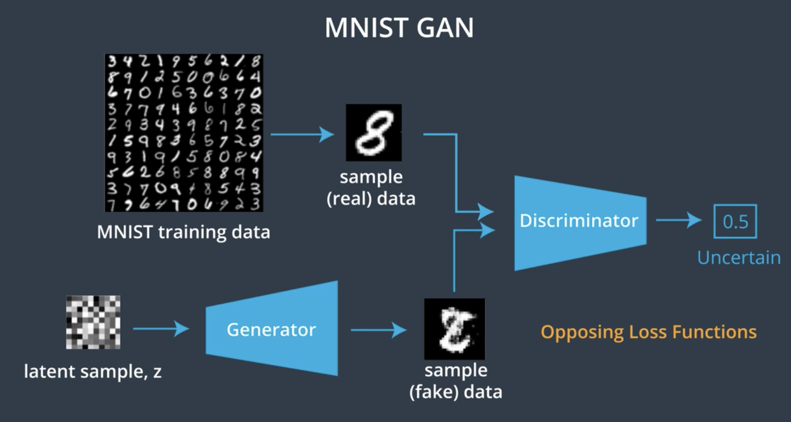

# Building Generative Adversarial Networks

<br>
<br>

# C-2: Generative Adversarial Networks

<br>
<br>

1. Fundamentals of Generative Adversarial Networks
    - GAN Architecture and Core Concepts
    - Applications of GANs
    - Challenges in GAN Training
    - The Generator-Discriminator Dynamic
2. Game Theory and GANs
    - Minimax Game Framework
    - Equilibrium Concepts
    - Value Function Mechanics
    - Comparison with Traditional ML Optimization
3. GAN Training Techniques
    - Activation Functions and Their Roles
    - Architecture Design Choices
    - Loss Functions and Optimization
    - Label Smoothing and Training Stability
4. Scaling GANs with Convolutional Neural Networks
    - DCGAN Architecture
    - Batch Normalization
    - Transitioning Between Feature Map Sizes
5. Case Study: MNIST GAN Implementation
    - Generator and Discriminator Design
    - Training Workflow
    - Adversarial Learning Process

#### Fundamentals of Generative Adversarial Networks

##### GAN Architecture and Core Concepts

Generative Adversarial Networks (GANs) represent one of the most innovative approaches to generative modeling in machine
learning. Introduced by Ian Goodfellow and colleagues in 2014, GANs have revolutionized how we create synthetic data
across multiple domains.

At their core, GANs consist of two neural networks engaged in an adversarial process:

1. **Generator Network (G)**: This network creates synthetic data by transforming random noise (from a latent space)
   into outputs that resemble a target distribution. The generator never sees the actual data directly but learns to
   produce convincing samples through feedback from the discriminator.
2. **Discriminator Network (D)**: This network functions as a binary classifier, learning to distinguish between real
   data samples from the training set and fake samples produced by the generator. The discriminator outputs a
   probability value indicating how likely it believes an input is real rather than generated.

The adversarial process works through a continuous feedback loop:

- The generator takes random noise vectors as input and produces synthetic samples
- The discriminator evaluates both real samples from the training data and fake samples from the generator
- The generator improves by learning to create more convincing fakes that can fool the discriminator
- The discriminator improves by getting better at detecting subtle differences between real and generated samples

This process can be formalized mathematically as a minimax game with the following value function:

$$\min_G \max_D V(D, G) = \mathbb{E}*{x \sim p*{data}(x)}[\log D(x)] + \mathbb{E}_{z \sim p_z(z)}[\log(1 - D(G(z)))]$$

Where:

- $p_{data}(x)$ is the distribution of real data
- $p_z(z)$ is the prior distribution of the latent space (typically Gaussian noise)
- $D(x)$ is the discriminator's estimate of the probability that $x$ is real
- $G(z)$ is the generator's output when given noise $z$

The theoretical ideal convergence point occurs when the generator creates samples indistinguishable from real data,
causing the discriminator to output 0.5 for all inputs (essentially random guessing).

##### Applications of GANs

GANs have found remarkable applications across numerous domains due to their ability to generate high-quality synthetic
data:

1. **Image Generation**: Creating realistic images from scratch, allowing for applications in art, design, and content
   creation. This includes photorealistic face generation, scene creation, and artistic style generation.
2. **Image-to-Image Translation**: Converting images from one domain to another while preserving structural content.
   Examples include:
    - Converting sketches to photorealistic images
    - Transforming daytime scenes to nighttime
    - Changing seasons in landscape photographs
    - Colorizing black and white images
3. **Super-Resolution**: Enhancing low-resolution images to higher resolution versions with realistic details that
   weren't present in the original.
4. **Data Augmentation**: Generating additional training samples to improve other machine learning models, particularly
   useful in domains where real data is scarce or expensive to collect.
5. **Text-to-Image Synthesis**: Creating images based on textual descriptions, bridging the gap between natural language
   and visual content.
6. **Video Generation and Manipulation**: Extending GAN concepts to temporal data, allowing for video synthesis and
   modification.
7. **"Deep Fakes"**: Synthesizing realistic videos or images of people saying or doing things they never actually did
   (raising significant ethical considerations).
8. **Domain Adaptation**: Transferring knowledge from one domain to another where labeled data might be lacking.
9. **Privacy Preservation**: Creating synthetic data that maintains statistical properties of sensitive datasets without
   exposing real individuals' information.
10. **Medicine and Healthcare**: Generating synthetic medical images for training, research, or data sharing while
    preserving patient privacy.

##### Challenges in GAN Training

Despite their powerful capabilities, GANs are notoriously difficult to train effectively. Key challenges include:

1. **Training Instability**: The adversarial nature creates a dynamic optimization landscape that can lead to
   oscillations rather than convergence. Small changes in either network can dramatically affect the training
   trajectory.
2. **Mode Collapse**: A phenomenon where the generator produces only a limited variety of outputs, failing to capture
   the full diversity of the target distribution. This occurs when the generator finds a few outputs that reliably fool
   the discriminator and exploits them repeatedly.
3. **Vanishing Gradients**: When the discriminator becomes too effective too quickly, it can provide near-zero gradients
   to the generator, stalling the learning process.
4. **Balance Between Networks**: Finding the right training schedule between the generator and discriminator is crucial.
   If one network becomes significantly stronger than the other, the weaker network may never recover, leading to failed
   training.
5. **Evaluation Difficulty**: Unlike many machine learning models, GANs lack a single clear metric for evaluation.
   Determining whether a GAN is performing well often requires subjective human assessment or complex composite metrics.
6. **Computational Intensity**: Training effective GANs typically requires substantial computational resources and time,
   especially for high-resolution or complex data generation.
7. **Hyperparameter Sensitivity**: GAN performance can vary dramatically based on architectural choices, learning rates,
   and other hyperparameters.
8. **Non-convergence**: The minimax game doesn't always lead to a stable equilibrium, sometimes resulting in cyclical
   behavior rather than convergence.

Mathematical analysis shows that the GAN optimization problem involves finding the saddle point of a high-dimensional,
continuous, and non-convex function—a fundamentally challenging scenario in optimization theory.

##### The Generator-Discriminator Dynamic

The relationship between the generator and discriminator creates a fascinating dynamic that drives the learning process:

**The Generator's Perspective**:

1. Initially produces random, unrealistic outputs from noise
2. Receives feedback through the discriminator's classifications
3. Adjusts parameters to increase the probability of fooling the discriminator
4. Gradually learns the underlying structure and patterns of the target data distribution
5. Never directly sees real data but learns through the discriminator's feedback

**The Discriminator's Perspective**:

1. Initially cannot differentiate between real and fake samples
2. Improves by learning the characteristics of real data and the flaws in generated data
3. Provides increasingly refined feedback to guide the generator
4. Becomes more discerning as training progresses
5. In ideal training, eventually reaches a point where it cannot reliably distinguish real from fake (accuracy around
   50%)

The training process resembles a counterfeiter (generator) versus detective (discriminator) scenario, where:

- The counterfeiter gets better at producing convincing fakes
- The detective gets better at spotting forgeries
- Both continuously improve through this competition
- Success for the counterfeiter means creating forgeries the detective cannot identify

Unlike traditional supervised learning paradigms where the goal is straightforward optimization, GANs create a
self-improving system through competition. This adversarial framework represents one of the most elegant applications of
game theory to machine learning, allowing for the emergence of complex generative capabilities without direct imitation
of training examples.

In the ideal scenario, the system reaches a Nash equilibrium where neither network can unilaterally improve its
performance—a point representing the generator successfully modeling the true data distribution.

#### Game Theory and GANs

##### Minimax Game Framework

Generative Adversarial Networks fundamentally operate as a two-player minimax game from game theory, creating a dynamic
that drives both networks to improve through competition. This game-theoretic approach represents a significant
departure from traditional machine learning optimization.

In this framework, the generator and discriminator engage in a zero-sum game where one player's gain exactly equals the
other player's loss. The generator aims to minimize the game's value function, while the discriminator tries to maximize
it—hence the term "minimax."

The formal representation of this game is given by the value function:

$$\min_G \max_D V(D, G) = \mathbb{E}*{x \sim p*{data}(x)}[\log D(x)] + \mathbb{E}_{z \sim p_z(z)}[\log(1 - D(G(z)))]$$

Breaking down this equation:

- The first term represents the discriminator's ability to correctly identify real data samples
- The second term represents the discriminator's ability to correctly identify fake samples from the generator
- The generator wants to minimize this function (make the discriminator perform poorly)
- The discriminator wants to maximize this function (classify correctly)

This can be understood as two opposing objectives:

1. The discriminator maximizes the probability of correctly classifying both real and generated samples
2. The generator minimizes the probability of the discriminator correctly classifying generated samples

The game dynamic creates a powerful learning mechanism where:

- If the generator produces unrealistic samples, the discriminator easily identifies them
- This forces the generator to improve its outputs
- As the generator improves, the discriminator must develop more sophisticated detection methods
- This continuous competition drives both networks toward better performance

Unlike a simple competition with a winner and loser, this adversarial relationship creates a cooperative
result—increasingly realistic data generation—through the competitive process.

##### Equilibrium Concepts

The theoretical optimal point in GAN training is reaching what game theory calls a Nash equilibrium—specifically, a
saddle point in the value function landscape. At this equilibrium:

- The generator produces samples indistinguishable from real data
- The discriminator achieves only 50% accuracy (equivalent to random guessing)
- Neither network can unilaterally improve its performance

This equilibrium represents the generator perfectly modeling the true data distribution, where:

$$p_g = p_{data}$$

For a given discriminator strategy, the optimal generator strategy is to produce data matching the true distribution.
For a given generator strategy, the optimal discriminator outputs:

$$D^*(x) = \frac{p_{data}(x)}{p_{data}(x) + p_g(x)}$$

When the generator perfectly models the true distribution, this becomes:

$$D^*(x) = \frac{p_{data}(x)}{p_{data}(x) + p_{data}(x)} = \frac{1}{2}$$

The saddle point has important mathematical properties:

- It is simultaneously a local minimum for the generator's cost
- And a local maximum for the discriminator's cost
- With respect to each player's parameters

Reaching this equilibrium in practice is challenging because:

1. The parameter space is high-dimensional
2. The value function is non-convex
3. Training involves alternating optimization rather than simultaneous updates
4. The dynamics can lead to oscillation or mode collapse rather than convergence

GAN training rarely reaches a perfect equilibrium in practice, but the closer it gets to this theoretical point, the
better the generated samples become at reflecting the target distribution.

##### Value Function Mechanics

The GAN value function operates differently from traditional loss functions in several key ways. Understanding its
mechanics illuminates how GANs learn:

1. **Dual Optimization Objectives**: Unlike standard neural networks with a single optimization goal, GANs involve two
   interlinked but opposing objectives:
    - Discriminator: Maximize correct classification (real vs. fake)
    - Generator: Maximize discriminator errors on generated samples
2. **Gradient Flow Through Both Networks**: The generator receives learning signals indirectly through the
   discriminator. When the generator produces an image:
    - It passes through the discriminator for evaluation
    - Gradients flow backward through the discriminator
    - Then back through the generator
    - This creates a complex gradient landscape
3. **Alternative Value Functions**: The original GAN formulation can suffer from vanishing gradients when the
   discriminator becomes too confident. Various alternative value functions have been proposed:
    - The Wasserstein GAN uses a different metric (Earth Mover's distance)
    - Least Squares GAN replaces the log-loss with squared error
    - WGAN-GP adds a gradient penalty term
    - Hinge loss formulations
4. **Non-Saturating Loss**: In practice, rather than minimizing $\log(1-D(G(z)))$, generators often maximize
   $\log(D(G(z)))$ to prevent vanishing gradients early in training:
    - Original (saturating) loss: $\min_G \mathbb{E}_z[\log(1-D(G(z)))]$
    - Non-saturating alternative: $\max_G \mathbb{E}_z[\log(D(G(z)))]$
5. **Adversarial Feedback Loop**: The value function creates a feedback loop where:
    - Generator improvement forces discriminator improvement
    - Discriminator improvement guides generator improvement
    - This continuous push-pull drives learning

The mechanics of this value function represent a form of implicit learning where the generator never directly sees the
target distribution but instead learns through the discriminator's feedback—a fundamentally different approach to
modeling data distributions compared to explicit maximum likelihood methods.

##### Comparison with Traditional ML Optimization

The GAN optimization approach differs fundamentally from traditional machine learning paradigms in several important
ways:

**Traditional ML Optimization:**

1. Single objective function to minimize
2. Clear optimization target (e.g., minimize error, maximize likelihood)
3. Stable optimization landscape
4. Convergence often guaranteed with appropriate learning rates
5. Progress measured by direct metrics (accuracy, precision, recall)
6. Model parameters optimized independently of other models

**GAN Optimization:**

1. Two competing objective functions
2. Indirect optimization target (reach Nash equilibrium)
3. Dynamically changing optimization landscape (as both networks evolve)
4. Convergence not guaranteed and often oscillatory
5. Progress difficult to measure objectively
6. Each model's parameters depend on the other model's current state

This comparison reveals why GAN training is more challenging:

In traditional supervised learning, we might minimize a cross-entropy loss:
$$L = -\sum_i y_i \log(\hat{y}_i) + (1-y_i)\log(1-\hat{y}_i)$$

The gradient always points toward a clear global objective. Models improve monotonically as they approach this
objective, making it easy to determine if progress is being made.

In contrast, GAN training involves a complex game dynamic:

- The discriminator improves, changing the generator's objective
- The generator improves, changing the discriminator's objective
- This creates a moving target for both networks

Consider these mathematical perspectives:

1. **Optimization View**: Traditional ML seeks a minimum in a fixed landscape
2. **Game Theory View**: GANs seek equilibrium in a landscape that changes with each move

The GAN approach also shows conceptual differences:

- Traditional generative models often use maximum likelihood estimation
- GANs use an adversarial process to implicitly approximate the data distribution
- This allows GANs to learn complex distributions without explicit density estimation

This game-theoretic foundation gives GANs their unique power but also introduces their characteristic training
difficulties. While traditional ML optimization is like climbing down a fixed mountain to find the lowest point, GAN
optimization is more like two climbers affecting each other's mountains as they move—a fundamentally more complex
scenario that requires specialized training techniques.

#### GAN Training Techniques

##### Activation Functions and Their Roles

Activation functions play crucial roles in GAN architecture, with each function serving specific purposes in different
parts of the network. The right choice of activation functions significantly impacts training stability and the quality
of generated outputs.

**Hyperbolic Tangent (tanh)**

The hyperbolic tangent function is mathematically defined as:

$$\tanh(x) = \frac{e^x - e^{-x}}{e^x + e^{-x}}$$

In GANs, tanh is commonly used as the output activation function for the generator for several important reasons:

- It bounds outputs between -1 and 1, making it ideal when training data is normalized to this range
- Its zero-centered nature helps with gradient flow during backpropagation
- The symmetric output range works well for image generation where pixel values can be naturally mapped from [-1,1] to
  [0,255]

When using tanh as the generator's output activation, training data should be scaled to the [-1,1] range for
consistency. This normalization ensures that the generator's targets match the function's output range.

**Leaky ReLU**

The Leaky ReLU function is defined as:

$$f(x) = \begin{cases} x & \text{if } x > 0 \ \alpha x & \text{if } x \leq 0 \end{cases}$$

Where α is typically a small value like 0.01 or 0.2.

Leaky ReLU plays a vital role in GAN training because:

- It prevents "dying ReLU" problem where neurons can get stuck during training
- It allows small negative values to pass through, maintaining gradient flow even for negative inputs
- This property is especially important for generators, which need to learn features in both positive and negative
  spaces
- It helps ensure that gradients can flow through the entire architecture

In practice, Leaky ReLU is often used in both the generator and discriminator hidden layers, significantly improving
training stability compared to regular ReLU.

**Sigmoid**

The sigmoid function is defined as:

$$\sigma(x) = \frac{1}{1 + e^{-x}}$$

In GANs, sigmoid serves a specific purpose:

- It's commonly used as the final activation of the discriminator
- It converts raw logits into probability values between 0 and 1
- This allows the discriminator to output the probability that an input is real rather than generated
- The output can be interpreted as: 0 = definitely fake, 1 = definitely real, 0.5 = uncertain

When implementing the discriminator, it's important to use the sigmoid only at the final layer, while using Leaky ReLU
for hidden layers to maintain healthy gradient flow.

The combination of these activation functions—tanh for generator output, Leaky ReLU for hidden layers, and sigmoid for
discriminator output—creates a balanced architecture that supports stable training and high-quality generation.

##### Architecture Design Choices

Effective GAN architecture design balances model complexity, training stability, and generation quality. Several key
design principles have emerged from research and practice:

**Fully Connected Architecture**

For simple generation tasks, fully connected architectures can be effective when:

- The data doesn't have spatial structure requiring convolution
- No sequential dependencies require recurrent connections
- Both networks maintain at least one hidden layer for sufficient capacity

However, fully connected architectures quickly become impractical for generating complex data like images of moderate to
high resolution due to parameter explosion.

**Convolutional Architecture (DCGAN)**

For scaling GANs to handle larger images, convolutional architectures become essential:

- **Generator**: Uses transposed convolutions (sometimes called deconvolutions) to upsample from latent space to full
  image
    - Starts with small, deep feature maps
    - Progressively increases spatial dimensions while decreasing depth
    - Follows the pattern: latent vector → dense layer → reshape → series of transposed convolutions
- **Discriminator**: Uses standard convolutions, mirroring a traditional CNN classifier
    - Starts with wide, shallow feature maps (the input image)
    - Progressively decreases spatial dimensions while increasing depth
    - Follows the pattern: image → series of convolutions → flatten → dense layer(s) → single output

This complementary structure allows both networks to effectively process image data at different resolutions.

**Batch Normalization**

Batch normalization is crucial for stable GAN training and is typically applied:

- After most layers except:
    - The output layer of the generator (to preserve the output distribution)
    - The input layer of the discriminator (to preserve input statistics)

Batch normalization helps by:

- Stabilizing training by normalizing activations
- Reducing internal covariate shift
- Allowing higher learning rates
- Helping gradients flow through the deep network

The standard practice is to calculate batch statistics during training and use running averages during inference.

**Skip Connections**

For more advanced GANs, skip connections (similar to those in ResNet or U-Net) can:

- Improve gradient flow
- Allow the preservation of fine details
- Help maintain global structure in generated outputs

**Network Depth and Width**

The capacity of GAN networks should be balanced:

- Too shallow networks lack modeling capacity
- Too deep networks may face training difficulties
- Generally, the discriminator should have slightly more capacity than the generator to prevent mode collapse
- Too powerful a discriminator can lead to vanishing gradients for the generator

This balancing act is essential—the networks should be evenly matched for optimal training dynamics.

##### Loss Functions and Optimization

Choosing appropriate loss functions and optimization strategies is crucial for successful GAN training. Several
approaches have proven effective in practice:

**Standard GAN Loss**

The original GAN formulation uses a minimax loss:

$$\min_G \max_D V(D, G) = \mathbb{E}*{x \sim p*{data}}[\log D(x)] + \mathbb{E}_{z \sim p_z}[\log(1 - D(G(z)))]$$

In practice, this is implemented as two separate loss functions:

1. **Discriminator Loss**:
   $$L_D = -\mathbb{E}*{x \sim p*{data}}[\log D(x)] - \mathbb{E}_{z \sim p_z}[\log(1 - D(G(z)))]$$
2. **Generator Loss** (non-saturating version): $$L_G = -\mathbb{E}_{z \sim p_z}[\log D(G(z))]$$

The non-saturating generator loss is preferred over the original minimax formulation because it provides stronger
gradients when the discriminator confidently rejects generator samples.

**Alternative Loss Functions**

Several alternative loss functions address various GAN training challenges:

- **Wasserstein GAN (WGAN)** uses the Wasserstein distance:
  $$L_D = \mathbb{E}*{x \sim p*{data}}[D(x)] - \mathbb{E}*{z \sim p_z}[D(G(z))]$$
  $$L_G = -\mathbb{E}*{z \sim p_z}[D(G(z))]$$

    WGAN requires weight clipping or gradient penalty to enforce Lipschitz constraints.

- **Least Squares GAN (LSGAN)** replaces the log loss with squared error:
  $$L_D = \frac{1}{2}\mathbb{E}*{x \sim p*{data}}[(D(x) - 1)^2] + \frac{1}{2}\mathbb{E}*{z \sim p_z}[D(G(z))^2]$$
  $$L_G = \frac{1}{2}\mathbb{E}*{z \sim p_z}[(D(G(z)) - 1)^2]$$

- **Hinge Loss GAN**:
  $$L_D = -\mathbb{E}*{x \sim p*{data}}[\min(0, -1 + D(x))] - \mathbb{E}*{z \sim p_z}[\min(0, -1 - D(G(z)))]$$
  $$L_G = -\mathbb{E}*{z \sim p_z}[D(G(z))]$$

**Optimization Algorithms**

Adam optimizer is the standard choice for GAN training because:

- It adapts learning rates individually for each parameter
- It combines the benefits of both RMSProp and momentum
- It helps navigate the complex loss landscapes of GANs

Typical hyperparameters for Adam in GANs:

- Learning rates between 0.0001 and 0.0005 (discriminator rate often slightly higher)
- Beta1 = 0.5 (instead of the default 0.9)
- Beta2 = 0.999 (default value)

**Training Schedule**

The training schedule affects stability significantly:

1. Alternative training approach:
    - Train the discriminator for k steps (often k=1-5)
    - Then train the generator for one step
    - Repeat this pattern throughout training
2. Balance discriminator/generator updates based on performance:
    - If discriminator loss << generator loss, train generator more
    - If generator easily fools discriminator, train discriminator more
3. Use separate learning rates:
    - Typically discriminator LR ≥ generator LR
    - This helps maintain balance between the networks

In practice, finding the right optimization strategy often requires experimentation for specific datasets and
architectures.

##### Label Smoothing and Training Stability

Achieving stable GAN training remains challenging, but several techniques have proven effective in practice:

**Label Smoothing**

Label smoothing modifies the target values for the discriminator to prevent overconfidence:

- Instead of using hard targets (0 for fake, 1 for real), use:
    - 0.9 or 0.7 for real samples (instead of 1.0)
    - 0.1 or 0.3 for fake samples (instead of 0.0)

This technique:

- Prevents the discriminator from becoming too confident
- Provides softer gradients to the generator
- Reduces vulnerability to adversarial examples
- Helps avoid situations where the discriminator provides near-zero gradients

Implementation in the loss function:

```python
# Traditional binary cross-entropy with label smoothing
real_labels = torch.ones(batch_size, 1) * 0.9  # Smooth from 1.0 to 0.9
fake_labels = torch.zeros(batch_size, 1) * 0.1  # Smooth from 0.0 to 0.1
```

**Instance Noise**

Adding small amounts of noise to both real and generated samples:

- Makes the discriminator's task harder
- Smooths the distribution and decision boundaries
- Gradually reduce the noise level as training progresses

**One-sided Label Smoothing**

Some research suggests only smoothing the real labels while keeping fake labels at 0:

- Prevents the discriminator from assigning high confidence to regions without data
- Leaves the generator's learning signal unaltered

**Logit-based Loss Calculation**

Computing loss using raw logits (pre-sigmoid outputs) rather than probabilities:

- Improves numerical stability
- Prevents extreme values that can cause gradient issues
- Implemented using `tf.nn.sigmoid_cross_entropy_with_logits` or similar functions

**Feature Matching**

Instead of having the generator directly maximize discriminator confusion:

- Train the generator to match the statistics of real data features in an intermediate layer of the discriminator
- This gives the generator a more stable training signal

**Historical Averaging**

Add a term to the cost function that penalizes parameter values that deviate from their historical average:

- Helps prevent oscillations
- Encourages convergence to an equilibrium

**Experience Replay**

Keep a buffer of previously generated samples:

- Occasionally train the discriminator on these older samples
- Prevents the generator from exploiting the discriminator by cycling through the same patterns

**Progressive Growing**

Start with low-resolution images and progressively increase resolution:

- Begin training at 4×4 or 8×8 resolution
- Gradually add layers to both networks to increase resolution
- Stabilizes training by establishing low-frequency structures before details

These stability techniques, especially label smoothing and proper loss function implementation, have become standard
practice in GAN training. When combined with appropriate architecture choices and optimization strategies, they
significantly improve the likelihood of successful GAN convergence.

#### Scaling GANs with Convolutional Neural Networks

##### DCGAN Architecture

Deep Convolutional Generative Adversarial Networks (DCGANs) represent a crucial advancement in GAN architecture that
enabled the generation of higher-quality and higher-resolution images. Introduced in 2015, DCGANs brought convolutional
neural network principles to the GAN framework, dramatically improving stability and quality.

The DCGAN architecture incorporates several key design principles that have become standard practices in image-based
GANs:

For the generator:

1. **Upsampling Pathway**: The generator transforms a low-dimensional noise vector into a full-sized image through a
   series of upsampling operations.

2. **Transposed Convolutions**: Instead of using standard convolutions, the generator employs transposed convolutions
   (sometimes called deconvolutions) to increase spatial dimensions. This operation can be expressed mathematically as:

    $$Y_{out} = Y_{in} * f_{transpose}$$

    Where $Y_{in}$ is the input feature map, $f_{transpose}$ is the transposed convolution filter, and $Y_{out}$ is the
    upsampled output.

3. **Dimensionality Expansion**: The generator starts with a dense layer connected to the random noise input, which is
   then reshaped into a small 3D feature map (e.g., 4×4×512). Each subsequent layer increases spatial dimensions while
   decreasing channel depth.

4. **No Fully Connected Layers**: Apart from the initial projection and reshaping from the latent vector, DCGAN
   generators avoid fully connected layers, instead relying entirely on convolutional operations for all
   transformations.

For the discriminator:

1. **Downsampling Pathway**: The discriminator follows a traditional CNN classifier structure, progressively reducing
   spatial dimensions while increasing feature depth.
2. **Strided Convolutions**: Instead of using pooling layers, DCGANs use strided convolutions for downsampling, which
   allows the network to learn its own spatial downsampling.
3. **Feature Extraction**: The discriminator acts as a feature extractor, learning increasingly abstract representations
   of the input images before making a final real/fake decision.

The complete DCGAN architecture follows this general pattern:

**Generator:**

1. Dense layer from latent vector (e.g., 100 dimensions) to small spatial representation
2. Reshape to initial feature map (e.g., 4×4×512)
3. Series of transposed convolution layers, each doubling spatial dimensions:
    - 4×4×512 → 8×8×256 → 16×16×128 → 32×32×64 → 64×64×3 (RGB image)
4. Activation functions: ReLU or Leaky ReLU in hidden layers, tanh at output layer

**Discriminator:**

1. Input image (e.g., 64×64×3)
2. Series of strided convolution layers, each halving spatial dimensions:
    - 64×64×3 → 32×32×64 → 16×16×128 → 8×8×256 → 4×4×512
3. Flatten final feature map
4. Dense layer to single output
5. Activation functions: Leaky ReLU in hidden layers, sigmoid at output

This architectural pattern creates a symmetry between the generator and discriminator, where the discriminator
essentially reverses the transformations performed by the generator, creating a balance that facilitates stable
training.

The DCGAN architecture introduced several guidelines that significantly improved GAN training:

- Replace pooling with strided convolutions (discriminator) and transposed convolutions (generator)
- Use batch normalization in both networks (except specific layers)
- Remove fully connected hidden layers
- Use ReLU activation in the generator for all layers except the output
- Use Leaky ReLU activation in the discriminator for all layers

These guidelines transformed GANs from interesting but unstable research concepts into practical tools for image
generation, establishing a foundation for subsequent GAN architectures like Progressive GANs, StyleGAN, and many others.

##### Batch Normalization

Batch normalization plays a critical role in stabilizing GAN training by controlling the distribution of activations
throughout both networks. Without batch normalization, GANs often suffer from training instability, mode collapse, and
vanishing gradients.

The mathematical operation of batch normalization can be defined as:

$$BN(x) = \gamma \frac{x - \mu_B}{\sqrt{\sigma_B^2 + \epsilon}} + \beta$$

Where:

- $x$ is the input to the batch normalization layer
- $\mu_B$ is the mini-batch mean
- $\sigma_B^2$ is the mini-batch variance
- $\gamma$ and $\beta$ are learnable parameters (scale and shift)
- $\epsilon$ is a small constant added for numerical stability

In the context of GANs, batch normalization provides several crucial benefits:

1. **Reduces Internal Covariate Shift**: As the generator and discriminator continuously update during adversarial
   training, the distribution of inputs to each layer changes drastically. Batch normalization helps stabilize these
   distributions, allowing higher learning rates and faster convergence.
2. **Prevents Mode Collapse**: By normalizing activations, batch normalization helps prevent situations where the
   generator gets stuck producing a limited variety of outputs (mode collapse). This encourages the generator to explore
   more of the target distribution.
3. **Improves Gradient Flow**: Normalization prevents activations from becoming too large or too small, which helps
   mitigate vanishing and exploding gradient problems that are particularly problematic in adversarial training.
4. **Adds Beneficial Noise**: The stochasticity introduced by using mini-batch statistics rather than population
   statistics adds a form of regularization that can prevent overfitting and improve generalization.

The strategic placement of batch normalization in GAN architectures is important:

**In the Generator:**

- Apply batch normalization after each convolutional or transposed convolutional layer
- Exception: Do NOT apply batch normalization to the output layer of the generator, as this would constrain the output
  distribution

**In the Discriminator:**

- Apply batch normalization after each convolutional layer
- Exception: Do NOT apply batch normalization to the input layer of the discriminator, as this would discard valuable
  information about the true data distribution

During inference (when generating new samples), the running mean and variance accumulated during training are used
instead of batch statistics. This ensures consistent output regardless of batch size, even when generating single
images.

Implementation details that improve batch normalization effectiveness in GANs include:

1. **Momentum Parameters**: Using lower momentum values (e.g., 0.8 instead of the default 0.99) for updating running
   statistics can help with the non-stationary nature of GAN training.
2. **Virtual Batch Normalization**: For some applications, computing normalization statistics from a fixed reference
   batch and the current batch can provide more stability.
3. **Conditional Batch Normalization**: In conditional GANs, where generation is guided by class labels or other
   conditions, the batch normalization parameters can be made conditional on the input class, allowing for more flexible
   control of the generation process.

The careful application of batch normalization transformed GAN training from a notoriously difficult optimization
problem to a more tractable one, enabling the generation of higher quality and more diverse images than was previously
possible.

##### Transitioning Between Feature Map Sizes

Effective management of feature map transitions is crucial for generating high-quality images with GANs. The process of
transforming a low-dimensional latent vector into a high-dimensional image (or vice versa for the discriminator)
requires careful handling of feature map sizes and depths.

The key transitions in GAN architectures involve:

1. **Spatial Dimension Changes**: Progressively increasing spatial dimensions in the generator and decreasing them in
   the discriminator.
2. **Channel Depth Changes**: Progressively decreasing feature channels in the generator and increasing them in the
   discriminator.

These transitions follow complementary patterns in the generator and discriminator:

**Generator Transition Pattern**:

- Starts with deep, narrow feature maps (e.g., 4×4×512)
- Each layer increases spatial dimensions while decreasing depth
- Ends with shallow, wide feature maps (e.g., 64×64×3 for RGB images)

**Discriminator Transition Pattern**:

- Starts with shallow, wide feature maps (the input image)
- Each layer decreases spatial dimensions while increasing depth
- Ends with deep, narrow feature maps before the final classification

For upsampling in the generator, three main techniques are commonly used:

1. **Transposed Convolution** (Deconvolution): Learns to increase spatial dimensions through a trainable upsampling
   operation. Mathematically, it can be viewed as the gradient of a convolution operation with respect to its input.
   However, it can produce checkerboard artifacts if filter size and stride are not carefully chosen.

2. **Nearest Neighbor or Bilinear Upsampling + Convolution**: First increases spatial dimensions using a fixed
   upsampling method, then applies a standard convolution. This approach often reduces artifacts compared to transposed
   convolutions:

    ```python
    Upsample(2×) → Conv2D(3×3, stride=1)
    ```

3. **Pixel Shuffle** (Sub-pixel Convolution): Reorganizes feature channels into spatial dimensions, offering efficiency
   benefits:

    ```python
    Conv2D(channels=r²×out_channels) → PixelShuffle(r)
    ```

    Where r is the upsampling factor.

For downsampling in the discriminator, common techniques include:

1. **Strided Convolution**: Uses a stride greater than 1 to reduce spatial dimensions while learning appropriate
   features:

    ```python
    Conv2D(3×3, stride=2)
    ```

2. **Average Pooling + Convolution**: First reduces spatial dimensions with pooling, then applies convolution:

    ```python
    AvgPool(2×2) → Conv2D(3×3, stride=1)
    ```

The most effective GAN architectures carefully manage these transitions to maintain consistent feature representation
quality throughout the network. Some advanced techniques for handling these transitions include:

1. **Progressive Growing**: Instead of training the full-resolution network from the beginning, progressively grow both
   networks by adding layers that handle higher resolutions:

    - Start with 4×4 resolution
    - Once stable, add layers for 8×8
    - Continue adding layers up to target resolution
    - This approach establishes structure before details, leading to more stable training

2. **Skip Connections**: Add connections between corresponding layers in the generator to help preserve information
   across the upsampling process:

    ```python
    Output = Conv(Input) + Upsample(Previous_Layer)
    ```

3. **Residual Blocks**: Use residual connections within convolutional blocks to improve gradient flow:

    ```python
    Output = Input + Conv(Conv(Input))
    ```

4. **Attention Mechanisms**: Add self-attention layers at critical transitions to help the network focus on relevant
   features across spatial locations, particularly useful for ensuring global coherence in larger images.

The symmetry between generator and discriminator transitions creates a balanced adversarial game where:

- The generator learns to create increasingly realistic details at each resolution
- The discriminator learns to detect artifacts at each resolution
- This balanced competition drives both networks to improve

By carefully designing these transitions, modern GANs can generate increasingly high-resolution images while maintaining
coherent structure, realistic textures, and global consistency—capabilities that were impossible with earlier GAN
architectures that lacked these sophisticated transition mechanisms.

#### Case Study: MNIST GAN Implementation

##### Generator and Discriminator Design

The MNIST dataset, with its 28×28 grayscale handwritten digits, serves as an excellent starting point for understanding
GAN implementation. Let's examine how we would design a GAN specifically for generating MNIST-like digits.

The generator and discriminator for an MNIST GAN need to be carefully balanced, with architectures appropriate for the
relatively simple nature of handwritten digits while still providing enough capacity to learn the distribution
effectively.

**Generator Architecture**

For the MNIST generator, we start with a random noise vector (typically 100 dimensions) and transform it into a 28×28
grayscale image. The architecture follows a pattern of progressively increasing spatial dimensions while decreasing
feature depth:

1. **Input Layer**: Random noise vector z (e.g., 100 dimensions) sampled from a normal or uniform distribution
2. **Dense Projection**: The noise vector is projected and reshaped into a small spatial representation
    - Dense layer: 100 → 7×7×128 (6,272 units)
    - Reshape to 7×7×128 feature map
3. **First Upsampling Block**:
    - Transposed convolution: 7×7×128 → 14×14×64
    - Kernel size: 5×5, stride: 2
    - Batch normalization
    - ReLU activation
4. **Second Upsampling Block**:
    - Transposed convolution: 14×14×64 → 28×28×1
    - Kernel size: 5×5, stride: 2
    - Tanh activation (final output layer)

This architecture effectively quadruples the spatial dimensions from 7×7 to 28×28 through two upsampling steps. The tanh
activation in the final layer ensures outputs are normalized between -1 and 1, matching the preprocessing applied to the
real MNIST images.

The generator's parameters are carefully chosen based on the nature of handwritten digits:

- The initial 7×7 feature map is large enough to capture basic digit structure
- Two upsampling steps are sufficient for the modest resolution of MNIST
- The channel depths (128→64→1) provide adequate capacity while preventing overfitting

**Discriminator Architecture**

The discriminator performs the inverse transformation, converting a 28×28 grayscale image into a single probability
output:

1. **Input Layer**: 28×28×1 grayscale image
2. **First Downsampling Block**:
    - Convolution: 28×28×1 → 14×14×64
    - Kernel size: 5×5, stride: 2
    - Leaky ReLU activation (alpha = 0.2)
    - No batch normalization on first layer (preserves input distribution)
3. **Second Downsampling Block**:
    - Convolution: 14×14×64 → 7×7×128
    - Kernel size: 5×5, stride: 2
    - Batch normalization
    - Leaky ReLU activation (alpha = 0.2)
4. **Output Block**:
    - Flatten: 7×7×128 → 6,272
    - Dense layer: 6,272 → 1
    - Sigmoid activation (final probability output)

The discriminator mirrors the generator's architecture but in reverse, halving spatial dimensions at each step while
doubling feature depth. This symmetry creates a balanced adversarial relationship between the two networks.

Several design choices are specific to the MNIST case study:

1. **Modest Network Size**: Since MNIST is a relatively simple dataset, both networks are kept deliberately small
   compared to GANs for more complex images. This prevents overfitting while still providing enough capacity to learn
   the distribution.
2. **Convolutional Structure**: Even though MNIST could potentially be handled with fully connected networks, the
   convolutional approach provides better parameter efficiency and spatial understanding.
3. **Appropriate Depth**: The network depth (2 main blocks each) is sufficient for the low-resolution, grayscale nature
   of MNIST digits, allowing efficient training without excessive complexity.

This balanced architecture creates an adversarial game specifically tailored to handwritten digit generation, with the
generator learning to create increasingly convincing digits while the discriminator learns to distinguish them from real
MNIST samples.

##### Training Workflow

The training workflow for an MNIST GAN involves a carefully orchestrated process that balances the learning of both
networks. This workflow demonstrates the fundamental GAN training principles in a concrete implementation.

**Data Preparation**

Before training begins, the MNIST dataset must be properly prepared:

1. **Loading the Dataset**: The MNIST dataset contains 60,000 training images of handwritten digits (0-9)

2. **Preprocessing**:

    - Reshape images to 28×28×1 (adding channel dimension)

    - Normalize pixel values from [0,255] to [-1,1] to match the generator's tanh output range:

        ```python
        X_train = (X_train.astype('float32') - 127.5) / 127.5
        ```

    - Shuffle data to ensure random batching

**Training Loop Structure**

The GAN training follows an alternating optimization pattern:

1. **Batch Preparation**:
    - Select a random mini-batch of real MNIST images
    - Generate random noise vectors for the same batch size
    - Use the generator to create fake images from the noise
2. **Discriminator Training Step**:
    - Freeze generator weights (set trainable=False)
    - Train discriminator on both real and fake images:
        - Real images with target labels of 0.9 (label smoothing)
        - Fake images with target labels of 0
    - Compute and apply gradients for discriminator
3. **Generator Training Step**:
    - Freeze discriminator weights (set trainable=False)
    - Generate new fake images from random noise
    - Train generator with target labels of 1 (trying to fool discriminator)
    - Compute and apply gradients for generator
4. **Repeat** for multiple epochs until convergence or a set number of iterations

This alternating training process creates the adversarial dynamic that drives GAN learning. Here's a more detailed look
at each component:

**Discriminator Training**

For each batch, the discriminator is trained to distinguish between real and fake digits:

```python
# Select a random batch of real images
idx = np.random.randint(0, X_train.shape[0], batch_size)
real_images = X_train[idx]

# Generate a batch of fake images
noise = np.random.normal(0, 1, (batch_size, latent_dim))
fake_images = generator.predict(noise)

# Train discriminator
# Label smoothing: use 0.9 instead of 1 for real images
d_loss_real = discriminator.train_on_batch(real_images, 0.9 * np.ones((batch_size, 1)))
d_loss_fake = discriminator.train_on_batch(fake_images, np.zeros((batch_size, 1)))
d_loss = 0.5 * np.add(d_loss_real, d_loss_fake)
```

**Generator Training**

After updating the discriminator, the generator is trained to fool the discriminator:

```
# Generate new noise for generator training
noise = np.random.normal(0, 1, (batch_size, latent_dim))

# Train generator to fool discriminator
# Target is 1 (discriminator should think these are real)
g_loss = combined_model.train_on_batch(noise, np.ones((batch_size, 1)))
```

Note that the generator is trained through a combined model where the discriminator's weights are frozen, so that only
the generator is updated during this step.

**Monitoring and Evaluation**

Throughout training, several metrics and samples are monitored to track progress:

1. **Loss Tracking**:
    - Discriminator loss on real images
    - Discriminator loss on fake images
    - Generator loss
2. **Sample Generation**:
    - Periodically generate and save sample digits from fixed noise vectors
    - This allows visual inspection of generator improvement over time
3. **Model Checkpointing**:
    - Save model weights at regular intervals
    - Keep the best models based on a chosen metric

The training progression typically shows:

- Early stages: Blurry, barely recognizable digit-like shapes
- Middle stages: Clearer digit structures but with artifacts
- Later stages: Sharp, well-formed digits resembling real MNIST samples

This training workflow exemplifies the basic GAN training pattern used even in more complex implementations, with the
MNIST example providing a clear illustration of the fundamental principles at work.

##### Adversarial Learning Process

The adversarial learning process in an MNIST GAN creates a fascinating dynamic where two networks push each other to
improve, ultimately learning to generate convincing handwritten digits. Let's examine this process in detail to
understand how the networks evolve throughout training.

**The Game Dynamic**

The GAN training process for MNIST can be visualized as a two-player game:

1. **The Counterfeiter (Generator)**:
    - Starts with no knowledge of what digits look like
    - Creates random patterns that barely resemble digits
    - Gradually learns what features make convincing digits
    - Refines its output based on the discriminator's feedback
2. **The Detective (Discriminator)**:
    - Learns what real MNIST digits look like
    - Develops increasingly sophisticated methods to spot fakes
    - Identifies telltale signs of generated digits
    - Provides indirect feedback to the generator

This competitive process drives both networks to improve their respective skills—the generator creates more realistic
digits, while the discriminator becomes more discerning.

**Learning Progression Stages**

The MNIST GAN typically progresses through several distinct phases during training:

**Stage 1: Initial Chaos (Epochs 1-5)**

- Generator produces random noise with no digit-like structure
- Discriminator quickly learns to distinguish random noise from real digits
- Generator gradients are large but unfocused
- Outputs look like static or random patterns

**Stage 2: Emerging Structure (Epochs 5-15)**

- Generator begins producing blob-like shapes resembling digits
- Basic digit structures emerge but with many artifacts
- Discriminator identifies obvious flaws (unnatural curves, inconsistent stroke width)
- Generator learns fundamental properties of digits (closed loops for 0/8, straight lines for 1/7)

**Stage 3: Refinement (Epochs 15-30)**

- Generator creates recognizable digits with moderate quality
- Strokes become more consistent and natural
- Some digits (like 1 and 7) may appear more convincing than others
- Discriminator focuses on subtle details (stroke endings, proportions)

**Stage 4: Fine Details (Epochs 30+)**

- Generator produces convincing digits that closely resemble real MNIST examples
- Subtle properties like stroke width variation and curvature become realistic
- Discriminator struggles to find reliable differences
- Generator may begin exploring the diversity of the MNIST distribution

Throughout this progression, we can observe several key phenomena:

**Mode Coverage**

Initially, the generator might focus on producing just a few digit classes that fool the discriminator most easily
(often called "mode collapse"). As training progresses, it should learn to generate all ten digits with appropriate
variety.

To visualize this progression, we can generate a grid of sample digits at different training stages:

- Early epochs: Limited diversity, perhaps favoring simpler digits like 1
- Middle epochs: More digit classes appearing, but uneven quality
- Later epochs: Full coverage of all digit classes with similar quality

**Detail Evolution**

The level of detail in generated digits evolves throughout training:

1. First, basic shapes and outlines emerge
2. Then, consistent stroke width and connectivity develop
3. Finally, subtle variations in pressure and style appear

**Equilibrium Approach**

The training process ideally approaches a state where:

- The discriminator outputs approximately 0.5 for both real and generated digits
- The generator produces samples that are indistinguishable from real MNIST digits
- The distribution of generated digits matches the distribution of real digits

In practice, perfect equilibrium is rarely achieved, and the networks often show oscillatory behavior where:

- The discriminator finds a new pattern to detect fakes
- The generator adapts to eliminate that pattern
- The discriminator finds a different distinguishing feature
- And so on in a continuous cycle

**Practical Observations in MNIST GAN Training**

Several phenomena are commonly observed when training an MNIST GAN:

1. **Different Digit Difficulty**: Some digits (like 1) are mastered earlier than others (like 8), reflecting their
   inherent complexity.
2. **Generator Exploration**: The generator sometimes produces interesting digit variations not present in the original
   dataset, demonstrating its ability to interpolate within the learned distribution.
3. **Discriminator Adaptation**: The discriminator gradually shifts from focusing on obvious structural problems to
   increasingly subtle details as the generator improves.
4. **Training Dynamics**: The relationship between generator and discriminator losses often shows a cyclical pattern
   rather than steady convergence, reflecting the ongoing adversarial competition.

The MNIST GAN case study provides a clear window into the adversarial learning process that drives all GANs. By
observing this process on a simple, well-understood dataset, we can gain insights into the dynamics that make GANs both
powerful and challenging to train—insights that apply to more complex GAN applications as well.

---

Generative Adversarial Networks (GANs) are a class of machine learning systems introduced by Ian Goodfellow and his
colleagues in 2014. They consist of two neural networks that work against each other in an adversarial process:

1. Generator: Creates synthetic data (like images) by trying to fool the discriminator
2. Discriminator: Attempts to distinguish between real and generated data

The process works like this:

- The generator creates fake samples
- The discriminator evaluates both real and fake samples
- Both networks improve through this competition - the generator gets better at creating realistic data, while the
  discriminator gets better at detecting fakes

GANs have found numerous applications:

- Creating realistic images, videos, and audio
- Data augmentation for training other AI models
- Converting sketches to photorealistic images
- Style transfer between images
- Creating synthetic data for training when real data is limited

Some challenges with GANs include:

- Training instability
- Mode collapse (generator produces limited varieties)
- Difficulty measuring performance
- Computational intensity

Despite these challenges, GANs have become fundamental to many AI applications, particularly in computer vision and
content generation. They've led to technologies like deepfakes and AI art generators. Applications of GANs include:

- Image generation
- Image to image translation
- "Deep fakes"

#### Image Generation

Fully Visible Belief Networks – where the model generates an image one pixel at a time. This is also called an
Autoregressive Model.

Generative Adversarial Networks (GANs) – where the model generates an entire image in parallel using a differentiable
function

GANs used a combination of neural networks to accomplish the task of image generation called Generator Network. It takes
random input through a differentiable function to transform and reshape it to have a recognizable structure. The output
is a realistic image. Unlike training a supervised learning model, when training a generator model, there is no
classification/label to associate with each image. It creates additional images based on a probability distribution.
Discriminator Network – is a regular neural net classifier that learns to guide the generator network by outputting the
probability that the input is real. Fake images are 0 and real images are 1. The generator network is forced to produce
more realistic images to "fool" the discriminator network.

##### Quiz Question

| Network       | Description                                    | Explanation                                                                                                                                                 |
| ------------- | ---------------------------------------------- | ----------------------------------------------------------------------------------------------------------------------------------------------------------- |
| Generator     | Takes random noise as input.                   | The Generator starts with random noise (latent space) as its input. This is the first step in the GAN process.                                              |
| Generator     | Transforms noise into a realistic image.       | The Generator's job is to convert the random noise into synthetic data (like images) that looks real. It learns to create increasingly convincing fakes.    |
| Discriminator | Learns to classify real and fake images.       | The Discriminator is trained to distinguish between real images from the training set and fake images created by the Generator.                             |
| Discriminator | Outputs the probability that an input is real. | The Discriminator produces a probability score (typically between 0 and 1) indicating how likely it thinks the input is a real rather than generated image. |

The pairing works because:

- The Generator has two connected functions: taking noise input and transforming it into realistic output
- The Discriminator has two connected functions: learning to classify images and outputting probability scores
- Together they form an adversarial relationship where:
    - The Generator tries to create better fakes
    - The Discriminator tries to get better at detecting fakes
    - This competition drives both networks to improve

These matches highlight the core mechanics of how GANs work as a two-player adversarial game.

#### Games and Equilibria

In GANs, adversarial means that two networks, the generator and the discriminator, compete with each other for improved
image generation. This "competition" between the networks is based on Game Theory. Game Theory is a form of applied
mathematics used to model cooperation and conflict between rational agents in any situation

Most ML models are based on optimization and follow the general pattern of

- Determine model parameters
- Have a cost function of these parameters
- Minimize the cost

GANs are different because there are two players, the generator and the discriminator, and each player has its own cost.
The "game" is therefore defined by a value function.

- The generator wants to minimize the value function.
- The discriminator wants to maximize the value function.

The saddle point is when equilibrium is reached, a point in the parameters of both players that is simultaneously a
local minimum for each player's costs with respect to that player's parameters. A key learning problem for GANs is
finding the equilibrium of a game involving cost functions that are:

1. High dimensional
2. Continuous
3. Non-convex

Let me break down each statement and explain whether it's true or false:

1. Statement: "Training a GAN is equivalent to playing a game where both networks are competing with each other."

- Answer: TRUE
- Explanation: This is an accurate description of GANs. The generator and discriminator are indeed in a minimax
  game/competition where the generator tries to create convincing fakes while the discriminator tries to detect them.
  This adversarial relationship is fundamental to how GANs work. Training GAN is very challenging because of their
  unstable nature! Thankfully, researchers came up with a lot of different techniques to make GAN training easier!

2. Statement: "When training a GAN, after some time, the equilibrium is always reached."

- Answer: FALSE
- Explanation: GANs don't always reach equilibrium. They can suffer from various training issues like mode collapse,
  vanishing gradients, or failure to converge. Reaching equilibrium is not guaranteed and is actually one of the
  challenging aspects of training GANs.

3. Statement: "Game Theory is a subfield of deep learning invented to describe GANs training."

- Answer: FALSE
- Explanation: This is incorrect. Game theory is a much older field of mathematics and economics that existed long
  before deep learning or GANs. It wasn't invented for GANs - rather, GAN training was described using existing game
  theory concepts.

4. Statement: "The GAN equilibrium is reached when the discriminator loss reaches 0"

- Answer: FALSE
- Explanation: This is incorrect. The ideal GAN equilibrium is reached when the discriminator's output is 0.5 (
  indicating 50% uncertainty between real and fake), not when the loss is 0. A discriminator loss of 0 would actually
  indicate a failing GAN where the discriminator has become too powerful.

#### GANs Through Game Theory

#### The Players and Their Objectives

1. **Generator (G)**

- Role: Creates fake data from random noise
- Goal: Minimize the value function
- Strategy: Tries to fool the discriminator by producing increasingly realistic data

2. **Discriminator (D)**

- Role: Classifies data as real or fake
- Goal: Maximize the value function
- Strategy: Tries to correctly distinguish between real and generated data

#### The Game Dynamics

##### Value Function Mechanics

- G and D are playing a minimax game
- Think of it like a counterfeiter (G) vs detective (D) game:
    - G tries to create better counterfeits
    - D tries to get better at detecting counterfeits

##### Equilibrium Concept

- Saddle point: The theoretical optimal point where:
    - G creates such realistic data that
    - D can only achieve 50% accuracy (like random guessing)

#### Training Challenges

The game is complex because the value function is:

1. **High dimensional**: Many parameters to optimize
2. **Continuous**: Not discrete choices but continuous adjustments
3. **Non-convex**: Multiple local optima exist

Unlike traditional ML models that just minimize one cost function, GANs must balance two competing objectives, making
equilibrium hard to achieve in practice.

#### Key Difference from Traditional ML

Traditional ML:

- Single cost function
- Simple minimization
- Clear optimization path

GANs:

- Two competing costs
- Minimax optimization
- Complex equilibrium search

This game theoretic framework helps explain both the power and the training difficulties of GANs.

#### Tips for Training GANs

Fully Connected Architecture can be used for simple tasks that meet the following criteria:

- No convolution
- No recurrence
- The generator and discriminator have a least one hidden layer

Leaky ReLU helps to make sure that the gradient can flow through the entire architecture and is a popular choice for
hidden layer activation functions. The Hyperbolic Tangent activation function is a popular output choice for the
generator and means data should be scaled to the interval from -1 to +1. A Sigmoid Unit is used to enforce the
constraint that the output of the discriminator is a probability.

One of the design choices from the DCGAN architecture is Adam, an optimization algorithm. A common error is that people
forget to use a numerically stable version of cross-entropy, where the loss is computed using the logits. Logits is the
values produced by the discriminator right before the sigmoid. A simple trick is to multiply the 0 or 1 labels by a
number a bit less than 1. This is a GANs-specific label smoothing strategy similar to that used to regularize normal
classifiers. For the generator loss, minimize cross-entropy with the labels flipped.

#### Scaling GANs

Convolutional Neural Networks (CNN) are needed to scale GANs to work on larger images. Scaling GANs relies on an
understanding of:

- Classifier Convolutional Net – starting with a tall and wide feature map and moving to very short and narrow feature
  maps
- Generator Net – starting with short and narrow feature maps and moving to a wide and tall image
- Batch Normalization – on potentially every layer except the output layer of the generator and the input layer of the
  discriminator

##### **Question 1**: Match each activation with its corresponding property

Q1 Matches:

- Hyperbolic tangent → output bounded between -1 and 1
- Leaky ReLU → helps the generator learn
- Sigmoid → output bounded between 0 and 1

Explanation:

- Hyperbolic tangent (tanh) squashes inputs to range [-1,1], making it useful for outputs that need both positive and
  negative values
- Leaky ReLU prevents "dying ReLU" problem common in generators by allowing small negative values to pass through
- Sigmoid squashes inputs to range [0,1], making it useful for probability outputs

Let me explain these three activation functions in detail:

1. **Hyperbolic Tangent (tanh)**

- Mathematical form: $$\tanh(x) = \frac{e^x - e^{-x}}{e^x + e^{-x}}$$
- Properties:
    - Output range: [-1, 1]
    - Zero-centered: Outputs are symmetric around 0
    - S-shaped curve (similar to sigmoid but centered at 0)
- Use cases:
    - Hidden layers in neural networks
    - When outputs need to be normalized between -1 and 1
    - Common in GANs' generator output layer

2. **Leaky ReLU**

- Mathematical form: $$f(x) = \begin{cases} x & \text{if } x > 0 \\ \alpha x & \text{if } x \leq 0 \end{cases}$$ (where
  $\alpha$ is a small constant, typically 0.01)
- Properties:
    - Allows small negative values (doesn't completely zero them out)
    - Prevents "dying ReLU" problem where neurons can get stuck
    - Has a non-zero gradient for negative inputs
- Benefits for Generator:
    - Helps maintain gradient flow
    - Prevents dead neurons
    - Allows better learning of features in negative space

3. **Sigmoid**

- Mathematical form: $$\sigma(x) = \frac{1}{1 + e^{-x}}$$
- Properties:
    - Output range: [0, 1]
    - S-shaped curve
    - Often used for binary classification
    - Outputs can be interpreted as probabilities
- Use cases:
    - Final layer in binary classification
    - Discriminator output in GANs
    - When output needs to be interpreted as probability

Comparison:

```textmate
Function        | Output Range | Gradient Properties
----------------|--------------|--------------------
tanh            | [-1, 1]     | Can saturate at extremes
Leaky ReLU      | (-∞, ∞)     | Small gradient for negative values
Sigmoid         | [0, 1]      | Can saturate at extremes
```

##### **Question 2**: Which of the following statements are true? (Multiple correct choices)

Answers (All true):

1. "The binary cross entropy (BCE) loss can be used to train both the generator and the discriminator."
2. "Label smoothing consists in multiplying the labels by a float smaller than 1."
3. "When training the generator, the BCE loss is used with flipped labels (fake = 1, real = 0)"
4. "The BCE loss is only one of the possible loss functions to train a GAN. Many other options exist."

Explanation:

- BCE loss is versatile and can be used for both networks in a GAN
- Label smoothing helps prevent overconfident predictions by making target values less extreme (e.g., 0.9 instead of
  1.0)
- Generator training uses flipped labels to maximize the probability of discriminator being wrong
- While BCE is common, other loss functions like Wasserstein loss or least squares loss can also be used for GANs

#### MNIST GAN

The steps for building a GAN to generate new images can be summarized as follows:

1. Create a classifier by training on dataset images
2. Create an adversarial training using a discriminator and generator

    - The discriminator acts as a simple classifier distinguishing between real and fake images
    - The generator acts as an adversary with the goal of tricking the discriminator into tagging generated images as "
      real"

3. Define generator and discriminator networks with opposing goals and loss functions

4. **Data Sources**:

- Top Path: MNIST training data (real handwritten digits)
    - Shows a grid of handwritten numbers
    - A sample '8' is extracted as real data
- Bottom Path: Latent sample (z)
    - Random noise input
    - Shown as a pixelated grid

2. **Generator Network**:

- Takes the latent sample (random noise) as input
- Transforms noise into a fake digit image
- In the example, tries to generate an '8'
- Output looks similar to but not exactly like real MNIST digits

3. **Discriminator Network**:

- Receives two types of inputs:
    - Real samples from MNIST dataset
    - Fake samples from Generator
- Outputs a value around 0.5 when uncertain
- Goal: Distinguish real from fake images

4. **Opposing Loss Functions**:

- Generator's goal:
    - Make fake images that fool the discriminator
    - Wants discriminator to output 0.5 (uncertain)
- Discriminator's goal:
    - Correctly classify real vs fake
    - Output 1 for real images
    - Output 0 for fake images

5. **Training Process**:

- Generator improves at creating realistic digits
- Discriminator improves at detection
- Success is reached when discriminator outputs 0.5 (can't tell difference)
- Both networks have opposing objectives, creating an adversarial game

This creates a feedback loop where both networks continually improve until the generated images become indistinguishable
from real MNIST digits.

<br>

<div align="center">
<p>

</p>
<p>figure: GAN Training Workflow</p>
</div>
<br>

#### Game Setup: Generator vs Discriminator

1. **Training Data (MNIST)**:

- Discriminator learns from real handwritten digits (ground truth)
- Used as reference point for what "real" data looks like
- In image: Grid of actual MNIST digits with sample "8"

2. **The Game Dynamic**:

**Player 1: Generator (G)**

- Strategy: Create fake digits from random noise (latent space z)
- Objective: Fool D by generating images that look like real MNIST digits
- Learning Process:
    - Gets better at mimicking real digit characteristics
    - Adapts based on how well it fools D
    - Success = D cannot distinguish its output from real digits

**Player 2: Discriminator (D)**

- Strategy: Classify images as real or fake
- Objective: Correctly identify both:
    - Real digits from MNIST dataset
    - Fake digits from Generator
- Learning Process:
    - Gets better at spotting subtle differences
    - Updates its detection based on G's improvements
    - Success = Accurate classification of both real and fake

**The Adversarial Game**:

1. G generates fake digit (from noise)
2. D receives both real MNIST digits and G's fakes
3. D tries to distinguish them
4. G improves based on D's success
5. D improves based on G's deception
6. Equilibrium reached when D outputs 0.5 (complete uncertainty)

This creates an arms race where:

- As G gets better at faking, D must get better at detecting
- As D gets better at detecting, G must get better at faking
- Both continuously improve through competition

Let me clarify how each network uses training data:

**Discriminator (D)**:

- ✅ Uses training data directly
- Learns from two sources:
    1. Real MNIST digits (training data)
    2. Fake digits from generator
- Needs training data to learn what "real" looks like
- Uses this knowledge to distinguish fake from real

**Generator (G)**:

- ❌ Does NOT use training data directly
- Only receives:
    1. Random noise (latent space z) as input
    2. Feedback from discriminator's decisions
- Never sees actual MNIST digits
- Learns indirectly through D's feedback
- Improves based on how well it fools D

This is a key aspect of GANs:

- G learns to generate realistic data without ever seeing real data
- G only knows if its outputs are "good" or "bad" based on D's feedback
- D acts as a teacher for G through the adversarial process
- Training data is only used by D to learn what "real" looks like

The training data informs D's standards, which then indirectly guides G's learning through their adversarial
relationship.

**Generator (G)**:

- Does use training data INDIRECTLY through the learning process
- Not by seeing it directly, but through:
    1. Network architecture designed for the specific type of data (e.g., images of cats)
    2. Loss function based on discriminator's feedback
    3. Backpropagation that updates G's parameters

**Example with Cat GAN**:

1. Training Process:

    - D learns from real cat images what cats look like
    - D provides feedback to G about how "cat-like" its outputs are
    - G's parameters get updated to better match the distribution of real cat data
    - The whole network is structured to generate cat-like images

2. Network Design:
    - G's architecture is specifically designed for the target domain (cats)
    - Layer structure matches the complexity of cat images
    - Output dimensions match cat image dimensions

So you're correct:

- G does need domain-specific knowledge
- This comes from:
    - Network architecture
    - Training process
    - Indirect learning through D's feedback
- While G doesn't directly see training data, the entire system is trained on it

It's more accurate to say G learns the distribution of the training data rather than directly copying it.

Let me break this down into a question and answer format:

**Question**: Match each component of a GAN with its function.

**Answer**:

1. Latent vector → Random noise vector fed through the generator
2. Generator → Turns noise into realistic images
3. Discriminator → Classifies real from fake images
4. Real images → Distribution the generator is trying to replicate
5. Binary Cross Entropy → Loss function used to evaluate the discriminator's performance

GANs are made of two networks, the generator and the discriminator. The generator generates realistic images from random
noise and tries to fool the discriminator, whose job is to separate real from fake images.

**Explanation**:

Each component serves a specific purpose in the GAN architecture:

1. **Latent vector**

- Input noise that seeds the generation process
- Random values that get transformed into meaningful data

2. **Generator**

- Neural network that transforms random noise
- Learns to create realistic images from random input

3. **Discriminator**

- Acts as a binary classifier
- Learns to distinguish between real and generated images

4. **Real images**

- Training data that represents the target distribution
- What the generator is trying to learn to replicate

5. **Binary Cross Entropy**

- Loss function that guides training
- Measures how well discriminator distinguishes real from fake
- Helps both networks improve through training

These components work together in an adversarial process to generate realistic data.
