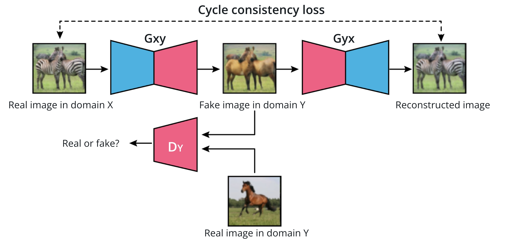
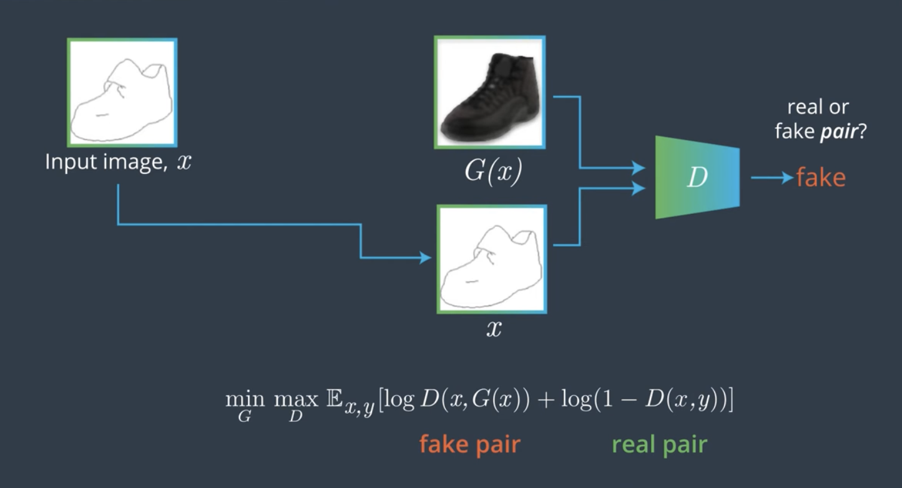

# C-3: Image to Image Translation

1. Fundamentals of Image-to-Image Translation
    - Definition and Applications
    - Objective Functions and Loss Formulations
    - Latent Space Representation and Manipulation
    - Paired vs. Unpaired Translation Approaches
2. Pix2Pix Architecture
    - Generator Design (U-Net Structure)
    - Discriminator Design (PatchGAN)
    - Loss Function Components
    - Training Methodology and Requirements
3. CycleGAN Framework
    - Unpaired Data Translation Challenge
    - Cycle Consistency Concept
    - Architecture Differences from Pix2Pix
    - Implementation Considerations
4. Applications and Limitations
    - Domain Adaptation Use Cases
    - Synthetic Data Generation
    - Failure Modes and Challenges
    - Practical Deployment Considerations

#### Fundamentals of Image-to-Image Translation

##### Definition and Applications

Image-to-image translation is like teaching a computer to be an artistic interpreter between visual languages. At its
core, this technique transforms an input image from one domain into a corresponding output image in another domain while
preserving the essential structure and content of the original.

Think of it as a sophisticated photo editor that doesn't just apply superficial filters but actually understands what
it's looking at. Unlike basic image generation which creates images from random noise, image translation starts with an
existing image and transforms it in a meaningful way.

What makes this approach so powerful is that the network learns to understand the underlying structure of both domains.
It's not just changing colors or textures randomly—it's learning the relationship between visual worlds. For example,
when converting a daytime scene to nighttime, it doesn't just darken everything uniformly; it knows to turn on street
lamps, add stars to the sky, and illuminate windows.

<div align="center">

<p>figure: CycleGAN Architecture</p>
</div>

This technology has found applications across numerous fields:

In computer vision and graphics, it enables transformations like:

- Converting rough sketches into photorealistic images (imagine sketching a handbag and seeing it instantly rendered as
  a real product)
- Transforming summer landscapes to winter scenes (adding snow, changing foliage)
- Colorizing black and white photographs with realistic colors
- Generating detailed images from simple semantic maps (like turning a labeled layout into a realistic room)

Medical imaging has embraced this technology for:

- Cross-modality synthesis (converting MRI scans to CT scans without additional radiation exposure)
- Enhancing low-quality scans to improve diagnostic capability
- Generating synthetic training data for rare conditions
- Highlighting specific anatomical features for better visualization

For autonomous vehicles and robotics, these techniques provide:

- Simulations of different weather or lighting conditions for safer training
- Conversion of simplified maps to realistic scene representations
- Translation between synthetic training environments and real-world imagery
- Enhanced visualization in poor visibility conditions like fog or darkness

Artistic applications include:

- Style transfer between different artistic genres (making your photos look like they were painted by Van Gogh)
- Converting simple sketches to detailed artwork
- Aging or de-aging photographs of people or buildings
- Creating photorealistic imagery from simple drawings

What distinguishes image-to-image translation from other generative tasks is its commitment to preserving the underlying
structure of the input. When transforming a cat photo to look like a painting, the cat remains in the same position with
the same general features—only the rendering style changes. This preservation of content while changing style makes
these systems particularly valuable for applications where maintaining the core information is essential.

##### Objective Functions and Loss Formulations

The success of image-to-image translation systems depends critically on their objective functions—the mathematical
formulations that guide what the network learns. These functions act as the "compass" that directs the learning process
toward creating high-quality transformations.

To understand these loss functions, let's break them down into their components:

**Adversarial Loss**

At the heart of GAN-based translation is the adversarial loss, which creates the fundamental game between generator and
discriminator:

$$\mathcal{L}_{adv}(G, D, X, Y) = \mathbb{E}_{y \sim p_{data}(y)}[\log D(y)] + \mathbb{E}_{x \sim p*{data}(x)}[\log(1 - D(G(x)))]$$

Where:

- $G$ is the generator that transforms images from domain X to domain Y
- $D$ is the discriminator that tries to distinguish real Y images from generated ones
- $x$ and $y$ are samples from domains X and Y respectively

Think of this as a counterfeiter (generator) trying to create fake currency that can fool an expert inspector
(discriminator). The counterfeiter gets better by learning from the inspector's feedback, while the inspector gets
better at spotting fakes. This competitive process drives both to improve.

However, the adversarial loss alone isn't enough. It only ensures the output looks realistic in the target domain—it
doesn't guarantee the content matches the input. This would be like our counterfeiter creating legitimate-looking bills
with completely wrong serial numbers!

**Pixel-wise Loss (L1/L2)**

To maintain content correspondence, pixel-wise losses measure direct differences between the generated image and a
target:

$$\mathcal{L}_{L1}(G) = \mathbb{E}_{x,y}[||y - G(x)||_1]$$

The L1 loss (absolute differences) is often preferred over L2 (squared differences) because it produces less blurry
results. Imagine comparing two photos pixel by pixel and measuring how different they are—that's what this loss does.

This loss is like giving our counterfeiter the exact template to follow, ensuring they don't change the essential
details. It can only be used in paired translation scenarios where we have corresponding target images.

**Cycle Consistency Loss**

For unpaired translation, where direct pixel comparison isn't possible, cycle consistency loss ensures that translations
are reversible:

$$\mathcal{L}_{cyc}(G, F) = \mathbb{E}_{x}[||F(G(x)) - x||_1] + \mathbb{E}_{y}[||G(F(y)) - y||_1]$$

Where:

- $G$ translates from domain X to domain Y
- $F$ translates from domain Y back to domain X

This is like ensuring that if you translate a sentence from English to Spanish and then back to English, you get
approximately the same sentence. If the translation loses important information, it won't be able to return to the
original.

**Identity Loss**

To further preserve color and structure, especially when the input already has some properties of the target domain,
identity loss is sometimes used:

$$\mathcal{L}*{identity}(G, F) = \mathbb{E}*{y}[||G(y) - y||*1] + \mathbb{E}*{x}[||F(x) - x||_1]$$

This encourages the generator to act as an identity function when given an image already in its output domain. Think of
it as training a Spanish-to-English translator to recognize when the input is already in English and leave it unchanged.

**Perceptual Loss**

Moving beyond simple pixel comparisons, perceptual losses measure differences in feature representations extracted by a
pre-trained network (often VGG):

$$\mathcal{L}*{perceptual}(G) = \mathbb{E}*{x,y}[||\phi(y) - \phi(G(x))||_2^2]$$

Where $\phi$ represents feature extraction from a pre-trained network. This is like comparing images not just based on
how they look pixel by pixel, but on higher-level features like textures, shapes, and objects.

**Combined Objective**

These losses are typically combined with weighting coefficients:

$$\mathcal{L}*{total} = \lambda*{adv}\mathcal{L}*{adv} + \lambda*{pixel}\mathcal{L}*{pixel} + \lambda*{cyc}\mathcal{L}*{cyc} + \lambda*{identity}\mathcal{L}*{identity} + \lambda*{perceptual}\mathcal{L}_{perceptual}$$

The relative weights ($\lambda$ values) act as knobs that control the balance between different aspects of the
translation. Increasing the weight of pixel loss will make outputs match targets more closely pixel-by-pixel but might
sacrifice some of the realism that the adversarial loss encourages.

Each component addresses specific aspects of the translation problem—realism, content preservation, style transfer—and
their balanced combination guides the networks toward producing translations that are both realistic and faithful to the
input content.

##### Latent Space Representation and Manipulation

The concept of latent space is fundamental to understanding how image-to-image translation works at a deeper level.
Think of "latent" as "hidden" or "underlying"—it's the abstract representation of images that the network learns to work
with.

Imagine compressing a photograph not just by reducing its file size, but by extracting its essence—the fundamental
features that make it what it is. This compressed, abstract form is what we call the latent representation. It's as if
the network learned to describe images using a specialized, compact language of its own invention.

In the context of image translation, these latent representations provide a bridge between different visual domains. Let
me explain how this works:

**Encoder-Decoder Architecture**

Many image translation models use an encoder-decoder structure:

- The encoder compresses an input image into a latent representation (like creating an abstract blueprint)
- The decoder reconstructs an image from this latent representation (like building from the blueprint)

This creates a bottleneck where the image must be compressed into a lower-dimensional latent code. During this
compression, the network is forced to learn which aspects of the image are most important to retain. It's like forcing
someone to describe a painting using only 20 words—they'll have to focus on the most essential elements.

In architectures like U-Net (used in Pix2Pix), skip connections help preserve spatial details that might otherwise be
lost in the latent bottleneck. These act like additional notes attached to our blueprint, providing extra details that
complement the compressed representation.

**Domain-Invariant and Domain-Specific Features**

Advanced image translation models often decompose latent representations into:

- Content features that should remain the same across domains (the "what")
- Style features that are specific to each domain (the "how")

Think of it like separating the plot of a story from its language style. The plot (content) remains the same whether
told as a novel, a screenplay, or a comic book, while the style changes with each format.

By separating these aspects in latent space, networks can perform more controlled translations. In methods like MUNIT
(Multimodal Unsupervised Image-to-Image Translation), images are encoded into:

- A content code capturing domain-invariant properties
- A style code capturing domain-specific properties

This separation allows for more flexible translations. You could take the content code from a photo of a dog and combine
it with the style code extracted from Van Gogh paintings to create a dog portrait in Van Gogh's style.

**Latent Space Arithmetic**

One of the most fascinating aspects of latent space is that it often supports meaningful vector arithmetic:

- Adding or subtracting vectors in latent space can add or remove specific attributes
- Interpolating between points creates smooth transitions between different images
- Linear operations in latent space often correspond to semantically meaningful image transformations

For example, in face generation models, you might find that moving in a particular direction in latent space
consistently adds glasses to faces, while moving in another direction changes the apparent age. In image translation,
this property allows for operations like style blending, where the style of a translation can be gradually adjusted by
interpolating between different points in the style latent space.

**Consistency in Latent Space**

For unpaired translation methods like CycleGANs, consistency in latent space is crucial. When an image is translated to
another domain and back again, the original and reconstructed images should have similar latent representations.

Imagine translating a sentence from English to Japanese and back to English. The final English sentence might not use
exactly the same words as the original, but it should capture the same meaning. Similarly, cycle consistency ensures
that even if pixel values change during translation, the essential content and structure are preserved.

**Disentanglement and Controlled Manipulation**

The most sophisticated image translation systems aim to disentangle different attributes in latent space, creating
representations where specific dimensions correspond to interpretable visual features.

This disentanglement allows for more controlled editing and translation:

- Modifying specific dimensions can change targeted aspects of an image (like changing only the lighting)
- Transferring only certain dimensions between domains allows for partial style transfer
- Constraining modifications to specific regions of latent space can prevent unwanted changes

Understanding latent space is like having a map of the territory between visual domains. By operating in this abstract
feature space rather than directly on pixels, translation models can capture and transform the essential qualities of
images while maintaining their fundamental structure and content.

##### Paired vs. Unpaired Translation Approaches

Image-to-image translation approaches can be broadly divided into paired and unpaired methods, each with distinct
characteristics and applications. Understanding the difference between these approaches is crucial for choosing the
right technique for a specific translation task.

**Paired Translation**

Paired translation, exemplified by models like Pix2Pix, requires datasets where each input image has a corresponding
target image in the desired domain. Think of these as "before and after" pairs showing the same content in two different
styles.

Imagine a photography teacher showing students pairs of photos—the original snapshot and the professionally edited
version. The student learns to edit by seeing many examples of how specific images should look after editing. This is
analogous to how paired translation works.

The key characteristics of paired translation include:

1. **Supervised Learning**: The model receives direct supervision about what the correct translation should look like.
   For each input, it knows exactly what output it should produce. This is like having an answer key while learning.
2. **Direct Loss Calculation**: Because corresponding targets exist, the model can directly compare its output against
   the ground truth target image. This provides a clear learning signal—the model knows precisely how far off its
   translation is from the ideal result.
3. **Deterministic Mapping**: Paired approaches typically learn a more specific mapping from input to output, producing
   translations that closely match the paired examples seen during training.
4. **Higher Fidelity**: With explicit targets to guide the learning process, paired methods often achieve higher
   accuracy in matching specific transformation characteristics.

The primary limitation of paired translation is the requirement for paired data, which is:

- Expensive and time-consuming to collect
- Impossible to obtain for many domains (e.g., photos to Van Gogh paintings—Van Gogh never saw a digital photograph!)
- Limited in quantity, potentially restricting the model's generalization ability

Paired translation is ideal for applications like:

- Semantic map to photo generation (where maps can be created from photos)
- Sketch to photo conversion (where sketches can be traced from photos)
- Day to night transformation (where the same scene can be photographed at different times)
- Medical cross-modality synthesis (where the same patient can be scanned with different imaging techniques)

**Unpaired Translation**

Unpaired translation, represented by frameworks like CycleGAN, removes the requirement for corresponding image pairs.
Instead, it works with two separate collections of images from different domains.

This is like a language student learning translation by immersing themselves in books written in two different
languages, without having direct translations between them. Over time, they learn the patterns and correspondences
between the languages without having sentence-by-sentence translations.

The defining features of unpaired translation include:

1. **Unsupervised Learning**: The model must learn the relationship between domains without explicit examples of correct
   translations. It's discovering the mapping on its own.
2. **Cycle Consistency**: In the absence of direct targets, cycle consistency becomes crucial—translating an image to
   another domain and back again should recover the original image. This is like checking if a translation makes sense
   by translating it back to the original language.
3. **Adversarial Guidance**: With no direct pixel comparisons possible, the realism of translations is primarily guided
   by adversarial losses that ensure outputs match the general "style" of the target domain.
4. **Multiple Possible Outputs**: Unpaired methods often allow for greater diversity in potential translations, as
   there's no single "correct" output defined by the training data.

The advantages of unpaired translation include:

- No need for paired data collection, dramatically expanding applicable domains
- Ability to learn from larger, more diverse datasets
- Potential for more creative and varied translations

However, unpaired approaches face challenges like:

- Less precise control over specific translation details
- Potential for content distortion when cycle consistency isn't perfectly maintained
- More complex training dynamics due to multiple interacting networks

Unpaired translation excels in scenarios such as:

- Style transfer between artistic genres
- Animal-to-animal transformations (e.g., horses to zebras)
- Season transfer in landscapes (summer to winter)
- Photo-to-painting conversion
- Any application where collecting paired examples is impractical

**Hybrid and Advanced Approaches**

Recent research has explored approaches that bridge the gap between purely paired and unpaired methods:

1. **Few-Shot Translation**: Using a small number of paired examples to guide an otherwise unpaired training process.
   This is like having a few pages of a translated book to help guide your learning of a new language.
2. **Semi-Supervised Translation**: Leveraging both paired and unpaired data, where the paired examples provide direct
   supervision while the unpaired data helps improve generalization.
3. **Contrastive Learning**: Using techniques that pull semantically similar content closer in feature space while
   pushing dissimilar content apart, providing a form of supervision without explicit pixel-wise pairing.
4. **Reference-Guided Translation**: Allowing users to provide reference images that guide specific aspects of the
   translation, combining the flexibility of unpaired methods with more user control.

The choice between paired and unpaired approaches ultimately depends on:

- Data availability and collection feasibility
- Required precision and control over translation outcomes
- Acceptable level of content distortion
- Need for diversity in generated outputs

While paired translation generally produces more accurate results when suitable data is available, unpaired translation
has opened up image-to-image translation to a vastly wider range of applications by removing the paired data
requirement. Each approach represents a different balance of trade-offs between translation accuracy, data requirements,
and application flexibility.

#### Pix2Pix Architecture

##### Generator Design (U-Net Structure)

The generator in the Pix2Pix framework uses a specialized architecture called U-Net, which represents a significant
advancement over standard encoder-decoder networks. What makes this architecture particularly brilliant is how it
maintains detailed spatial information throughout the translation process.

Imagine trying to translate a street map into a satellite photo. You need to preserve the exact layout of streets and
buildings while completely changing their visual appearance. This is the challenge the U-Net architecture addresses.

<div align="center">

<p>figure: Pix2Pix Network Structure</p>
</div>

At its core, the U-Net consists of two primary pathways that form a U-shape (hence the name):

1. A contracting path (encoder) that captures context and abstract features
2. An expanding path (decoder) that reconstructs and transforms the image

The encoder follows a classic convolutional neural network pattern, progressively reducing spatial dimensions while
increasing feature depth. Each step in this downward journey consists of:

1. A convolutional layer with a stride of 2 (which halves the image size)
2. Batch normalization to stabilize training
3. Leaky ReLU activation to prevent "dying ReLU" problems

This process continues through multiple levels, creating a hierarchical representation of the input image. For example,
in a typical implementation:

- Input: 256×256×3 (original image)
- First encoding layer: 128×128×64
- Second encoding layer: 64×64×128
- Third encoding layer: 32×32×256
- Fourth encoding layer: 16×16×512
- Fifth encoding layer: 8×8×512
- Bottleneck: 4×4×512

Think of this as progressively zooming out from the image. At each step, the network sees less detail but more context.
At the bottleneck, the network has compressed the image into a high-dimensional feature representation—like distilling
the image's essence into a concentrated form.

The decoder then reverses this process, progressively increasing spatial dimensions while decreasing feature depth. Each
step in the upward journey consists of:

1. A transposed convolutional layer (sometimes called a deconvolution) with a stride of 2
2. Batch normalization
3. Regular ReLU activation
4. Dropout during training (typically 50%) to prevent overfitting

Now, here's where the magic happens. The most distinctive feature of the U-Net architecture is the skip connections that
bridge the encoder and decoder. These connections are like information highways that allow spatial details to bypass the
bottleneck.

Each layer in the decoder receives not just the output from the layer below it but also the feature maps from the
corresponding encoder layer. For example, when the decoder reaches the 64×64 resolution level, it receives both the
upsampled features from its previous layer and the original 64×64 features directly from the encoder.

These skip connections serve several crucial purposes:

1. They provide direct paths for gradients during backpropagation, helping the network train more effectively.
2. They preserve fine spatial details that would otherwise be lost during compression.
3. They allow the network to focus on learning the transformation rather than having to remember spatial structures.
4. They enable the translation of local patterns while maintaining global coherence.

To understand why this matters, imagine trying to colorize a black and white photo of a cityscape. The bottleneck might
preserve the general layout of buildings, but fine details like windows or architectural ornaments might get lost. The
skip connections ensure these details remain available for the colorization process.

The final layer typically uses a Tanh activation function, producing values between -1 and 1 to match the normalized
range of the training images.

The U-Net design is particularly well-suited for image translation because it solves the seemingly contradictory
requirement of dramatically changing appearance while precisely preserving structure. The encoder captures the content,
the decoder reconstructs it in the new domain, and the skip connections ensure that no important spatial details are
lost along the way.

##### Discriminator Design (PatchGAN)

The Pix2Pix framework features an innovative discriminator called PatchGAN, which represents a fundamental shift in how
GANs evaluate image quality. Instead of making a single real/fake decision for an entire image, PatchGAN makes multiple
assessments across the image, focusing on the quality of local patches.

Traditional GAN discriminators output a single number—essentially saying "this entire image is real" or "this entire
image is fake." PatchGAN instead outputs a matrix of predictions, where each element represents the reality assessment
of a particular patch in the input image.

To understand why this is powerful, consider the challenge of translating a sketch to a photorealistic image. Different
regions of the image might require different types of transformations—skin textures for faces, fabric patterns for
clothing, reflective properties for metals. A single global judgment doesn't provide enough specific feedback to guide
these diverse local transformations.

The PatchGAN architecture consists of a series of convolutional layers that progressively reduce spatial dimensions
while increasing feature depth. For example, a typical PatchGAN discriminator might reduce a 256×256 input image to a
30×30 output grid.

Each value in this output grid corresponds to the discriminator's judgment about a specific receptive field in the
input—typically around 70×70 pixels. You can think of the discriminator as sliding a 70×70 window across the image and
making a series of local assessments rather than one global assessment.

The detailed structure includes:

1. Input layer that receives either:
    - A concatenated pair of input and real target images (for real examples)
    - A concatenated pair of input and generated output images (for fake examples)
2. A series of convolutional layers with:
    - Stride of 2 for initial layers to downsample
    - No pooling layers (they would discard spatial information)
    - Leaky ReLU activations (typically with a slope of 0.2)
    - Increasing channel depths (e.g., 64, 128, 256, 512)
    - Batch normalization for stable training

This patch-based approach offers several significant advantages:

1. **Efficiency**: The fully convolutional design requires fewer parameters than a discriminator that processes the
   entire image at once.
2. **Focus on textures and patterns**: By operating at the patch level, the discriminator becomes particularly sensitive
   to local textures and details. This is like having an art critic who examines every brushstroke rather than just
   glancing at the whole painting.
3. **Shift invariance**: The convolutional nature makes it apply the same criteria consistently across the entire image.
4. **Detailed feedback**: The patch-wise predictions provide the generator with specific feedback about which regions
   need improvement, rather than a single vague signal.
5. **Flexibility**: The PatchGAN can be applied to images of different sizes without structural changes.

The size of the patches that the discriminator evaluates is an important design choice. Larger patches allow the
discriminator to consider more context but require more parameters. Smaller patches focus exclusively on texture quality
but might miss medium-scale structures.

In practice, the PatchGAN discriminator receives pairs of images—either real pairs from the training data or pairs
consisting of an input image and its corresponding generated output. For real pairs, the discriminator learns to output
high values (close to 1) across its prediction grid. For generated pairs, it learns to output low values (close to 0).

This teaches the discriminator to distinguish between real and generated image pairs based on the local characteristics
of the translations. Meanwhile, the generator learns to fool the discriminator by creating locally realistic textures
and patterns across the entire image.

The PatchGAN approach aligns perfectly with the U-Net generator. While the U-Net with its skip connections ensures that
the global structure and correspondence between input and output are maintained, the PatchGAN discriminator pushes the
generator to produce locally realistic textures and details that match the target domain.

This division of responsibilities—global structure preservation from the generator architecture and local realism from
the discriminator—creates a powerful synergy that enables high-quality translations.

##### Loss Function Components

The Pix2Pix framework employs a carefully designed combination of loss functions that work together to guide the
training process toward high-quality image translations. This hybrid loss formulation is like a sophisticated guidance
system that addresses different aspects of the translation quality simultaneously.

The total loss function combines two primary components:

1. **Adversarial Loss**: Ensures the generated images appear realistic
2. **L1 Loss**: Ensures the generated images align closely with the ground truth targets

Let's examine each component in detail:

**Adversarial Loss**

The adversarial loss follows the standard GAN formulation, creating the game-theoretic dynamic between generator and
discriminator:

$$\mathcal{L}*{GAN}(G, D) = \mathbb{E}*{x,y}[\log D(x, y)] + \mathbb{E}_{x}[\log(1 - D(x, G(x)))]$$

Where:

- $x$ is the input image
- $y$ is the real target image
- $G(x)$ is the generated output
- $D(x, y)$ is the discriminator's assessment of the input-output pair

An important distinction in Pix2Pix is that the discriminator sees both the input image and either the real target or
generated output (concatenated along the channel dimension). This makes the discriminator conditional—it doesn't just
evaluate whether an image looks realistic in isolation but whether it represents a realistic translation of the specific
input image.

Think of it like a counterfeit detector that doesn't just examine a bill, but compares it to the specific template it
should match.

For the generator, the objective is to minimize:

$$\mathcal{L}*{GAN}^G(G, D) = \mathbb{E}*{x}[\log(1 - D(x, G(x)))]$$

Or alternatively, to avoid vanishing gradients early in training, the non-saturating version is often used:

$$\mathcal{L}*{GAN}^G(G, D) = -\mathbb{E}*{x}[\log(D(x, G(x)))]$$

This adversarial component pushes the generator to create images that look realistic according to the discriminator's
learned criteria. However, adversarial loss alone would not ensure that the generated image maintains correspondence
with the target—it would only ensure that it looks realistic.

**L1 Loss (Reconstruction Loss)**

To address the need for content correspondence, Pix2Pix introduces a direct pixel-wise loss between the generated output
and the ground truth target:

$$\mathcal{L}*{L1}(G) = \mathbb{E}*{x,y}[||y - G(x)||_1]$$

This L1 (absolute difference) loss penalizes the generator when its output differs from the target image. The choice of
L1 rather than L2 (squared difference) is significant—L1 loss tends to preserve more sharpness and detail in the
generated images, whereas L2 loss often results in blurrier outputs.

You can think of L1 loss as measuring the "Manhattan distance" between the generated and target images—summing up the
absolute differences pixel by pixel. This provides a direct signal about how closely the output matches the target.

The L1 loss serves several crucial purposes:

1. It ensures that the generated image corresponds structurally to the ground truth target
2. It provides a direct learning signal about where the output should improve
3. It stabilizes training by giving the generator a consistent objective alongside the potentially volatile adversarial
   signal

**Combined Loss**

The full objective function for the generator combines these components with a weighting parameter λ:

$$\mathcal{L}(G, D) = \mathcal{L}*{GAN}(G, D) + \lambda \mathcal{L}*{L1}(G)$$

The parameter λ controls the relative importance of the L1 loss compared to the adversarial loss. In the original
Pix2Pix implementation, λ = 100 was used, placing substantial emphasis on the reconstruction quality.

This high weighting makes sense because:

1. The L1 loss provides more stable gradients than the adversarial loss
2. Maintaining structural correspondence with the target is particularly important for translation tasks
3. The adversarial component only needs to contribute enough to improve texture quality and avoid blurriness

Think of the L1 loss as providing the "structure" guidance and the adversarial loss providing the "realism" guidance. By
combining them, Pix2Pix achieves both structural accuracy and visual realism.

**PatchGAN Influence on Loss**

The PatchGAN discriminator architecture directly influences how the adversarial loss operates. Rather than producing a
single scalar output, the discriminator outputs a grid of predictions. The adversarial loss is computed by averaging
across all these patch-level predictions:

$$\mathcal{L}*{GAN}(G, D) = \mathbb{E}*{x,y}\left[\frac{1}{N} \sum_{i=1}^{N} \log D(x, y)*i\right] + \mathbb{E}*{x}\left[\frac{1}{N} \sum_{i=1}^{N} \log(1 - D(x, G(x))_i)\right]$$

Where $N$ is the number of patches and $D(x,y)_i$ is the discriminator's prediction for the i-th patch.

This formulation encourages the generator to focus on making each local patch look realistic rather than just the image
as a whole. It's like having multiple critics evaluating different aspects of the translation rather than a single
overall judgment.

**Training Dynamics**

The interaction between these loss components creates an effective training dynamic:

- The L1 loss quickly guides the generator toward outputs that broadly match the target images
- The adversarial loss refines the textures and details to make them more realistic
- Together, they push the generator to create outputs that are both structurally accurate and visually convincing

This hybrid loss formulation addresses the fundamental challenge in image-to-image translation: balancing the
preservation of input content with the adoption of target domain characteristics.

##### Training Methodology and Requirements

Successfully training a Pix2Pix model requires careful attention to methodological details and specific data
requirements. Moving from theory to practice involves numerous considerations that directly impact the quality and
applicability of the resulting model.

**Data Requirements**

Pix2Pix is a supervised approach that requires paired training data, which presents both constraints and opportunities:

1. **Paired Images**: Each training example must consist of a corresponding input-output pair that represents the same
   content in both source and target domains. Examples include:

    - Sketch and corresponding photograph
    - Semantic map and corresponding realistic image
    - Daytime scene and same scene at night
    - Black and white photo and its colorized version

    Think of these pairs as "before and after" examples that show the network exactly what transformation it should
    learn.

2. **Alignment**: The paired images must be well-aligned, typically pixel-to-pixel. This alignment is
   crucial—misalignments can cause the model to learn incorrect correspondences or produce blurred results where it's
   uncertain about the mapping.

    For example, if you're training a model to colorize black and white photos, the grayscale and color versions must be
    perfectly aligned so the model learns to associate the right colors with the right structures.

3. **Dataset Size**: While GANs generally benefit from large datasets, Pix2Pix can produce reasonable results with
   relatively modest dataset sizes—often a few hundred to a few thousand pairs. This is partly because the paired
   supervision provides a strong learning signal.

    However, more diverse datasets generally lead to better generalization. A model trained on just 100 pairs might
    perform well on similar examples but fail on edge cases that weren't represented in the training data.

4. **Data Augmentation**: To maximize the utility of limited paired data, augmentation techniques like random cropping,
   flipping, and slight rotations are commonly employed. However, these must be applied identically to both images in
   each pair to maintain alignment.

    For instance, if you flip the input image horizontally, you must apply the exact same flip to the target image, or
    the pairing will be broken.

5. **Preprocessing**: Images are typically resized to powers of 2 (e.g., 256×256 or 512×512) and normalized to the range
   [-1, 1] to match the Tanh output activation of the generator.

**Training Process**

The training procedure for Pix2Pix follows a structured approach that balances the updates between generator and
discriminator:

1. **Initialization**: Both networks are initialized with weights sampled from a normal distribution with mean 0 and
   standard deviation 0.02, which empirically provides good starting points for GAN training.

2. **Alternating Updates**: The discriminator and generator are trained in an alternating fashion:

    - Update the discriminator using both real and generated pairs
    - Update the generator to fool the discriminator and minimize the L1 loss

    This alternating approach maintains the balance between the two networks, preventing one from overwhelming the
    other.

3. **Mini-batch Training**: Typically, small mini-batch sizes (1-16) are used due to memory constraints and to provide
   stable gradients. The original implementation used batch sizes of 1 or 4.

    Smaller batch sizes are often sufficient because each image pair provides a strong learning signal. The pixel-wise
    L1 loss gives detailed feedback for every single pixel in the output.

4. **Optimization Parameters**:

    - Adam optimizer with learning rate of 0.0002
    - Momentum parameters β₁ = 0.5 and β₂ = 0.999
    - Linear learning rate decay during the latter half of training

    These specific parameter choices have been empirically found to work well for GAN training, particularly the lower
    β₁ value compared to the default of 0.9, which helps stabilize training.

5. **Training Duration**: Pix2Pix models typically train for 100-200 epochs, with convergence often visible after about
   100 epochs for many tasks.

**Special Training Techniques**

Pix2Pix incorporates several specialized techniques that improve training stability and generation quality:

1. **Noise Handling**: Unlike many GAN applications, Pix2Pix doesn't use an explicit noise input to the generator.
   Instead, dropout layers in the generator serve as a source of randomness during both training and inference, which
   helps prevent the generator from learning to simply memorize the training examples.

    This is like introducing small uncertainties into the translation process, encouraging the model to learn robust
    patterns rather than exact pixel mappings.

2. **One-sided Label Smoothing**: To stabilize discriminator training, the target for real examples is set to 0.9 rather
   than 1.0. This prevents the discriminator from becoming overconfident and provides better gradients to the generator.

    It's like telling the discriminator "be mostly sure, but never completely certain" about real examples, which keeps
    it from becoming too rigid in its judgments.

3. **Instance Normalization**: For certain applications, instance normalization (normalizing each feature map
   independently for each example) can perform better than batch normalization, particularly for style transfer-like
   applications.

    This helps the network focus on the structure of individual images rather than batch-level statistics, which is
    especially important when working with diverse image styles.

4. **Jittering**: Random jitter is applied during training by resizing images to a larger size (e.g., 286×286) and then
   randomly cropping back to the target size (e.g., 256×256). This provides additional augmentation and helps prevent
   overfitting.

    It's like showing the network slightly different views of the same training example, improving its ability to
    generalize to new inputs.

**Implementation Considerations**

Several practical considerations impact the successful implementation of Pix2Pix:

1. **Memory Requirements**: The U-Net generator with skip connections and the PatchGAN discriminator can be
   memory-intensive, particularly for high-resolution images. Training typically requires a GPU with at least 8-12GB of
   memory for 256×256 images.

2. **Conditional Input**: The discriminator receives both the input image and either the real target or generated
   output. These are concatenated along the channel dimension before being fed to the discriminator.

    This conditioning ensures that the discriminator learns not just what realistic images look like, but what realistic
    translations of specific inputs look like.

3. **Test-Time Behavior**: Unlike many GANs, Pix2Pix keeps dropout enabled during testing, which introduces variability
   in the outputs. Multiple runs with the same input can produce slightly different results.

    This intentional variability helps prevent the translations from looking too rigid or deterministic, adding subtle
    variations that often make the results more natural.

4. **Evaluation Metrics**: While visual assessment is critical, quantitative evaluation often uses:

    - Fréchet Inception Distance (FID) to measure realism
    - Structural Similarity Index (SSIM) to measure preservation of content
    - User studies for subjective quality assessment

5. **Edge Cases**: Pix2Pix may struggle with:

    - Extreme transformations that dramatically alter content
    - Very high-resolution images (beyond 512×512) without architectural modifications
    - Domains with high variability where one-to-many mappings are possible

**Data Collection Strategies**

Given the requirement for paired data, several approaches have been developed to create appropriate datasets:

1. **Automated Pairing**: For some domains, automated methods can create pairs:
    - Rendering engines can generate semantic maps and corresponding photorealistic images
    - Filters or algorithms can create one domain from another (e.g., edges from photos)
    - Time-lapse photography can capture the same scene under different conditions
2. **Manual Creation**: For domains without automated options, manual creation may be necessary:
    - Artists creating corresponding pairs (e.g., sketches of photographs)
    - Controlled photography of the same subject with different settings
    - Manual annotation and segmentation of images
3. **Crowd-sourcing**: For large-scale paired data needs, crowd-sourcing with careful quality control can be effective.

The requirement for paired training data represents both Pix2Pix's greatest strength and its primary limitation. The
direct supervision enables high-quality, consistent translations with relatively efficient training, but the need for
aligned pairs restricts its application to domains where such data can be reasonably obtained.

This limitation inspired subsequent developments like CycleGAN, which removed the paired data requirement at the cost of
some translation precision—an approach we'll explore in the next section.

#### CycleGAN Framework

##### Unpaired Data Translation Challenge

The requirement for paired training data represents a fundamental limitation in image-to-image translation. While
Pix2Pix demonstrates impressive results, it can only be applied to domains where corresponding image pairs are
available. This constraint significantly restricts the applicability of paired translation approaches, as many
fascinating and valuable translation tasks involve domains where paired data is either impossible to collect or
prohibitively expensive to create.

Imagine wanting to translate photographs to look like they were painted by Vincent van Gogh. Since Van Gogh lived in the
19th century, he never saw most modern scenes, and we can't ask him to paint specific photographs. There simply cannot
be true paired data for this task—no matter how much time or money we invest.

Consider some other compelling translation scenarios where paired data simply cannot exist:

1. Converting between zebras and horses. We cannot have the exact same animal exist simultaneously as both a zebra and a
   horse to create perfect pairs.
2. Transforming summer landscapes to winter landscapes. Even photographing the same location in different seasons
   produces images with differences in lighting, vegetation changes, and other temporal variations that make them
   imperfectly paired.
3. Translating between day and night scenes. The same location appears dramatically different under these conditions,
   with changes in lighting, shadows, and even which elements are visible or emphasized.

The challenge extends beyond mere availability to practical concerns about data collection:

**Time and Resource Intensity**: Even when theoretically possible, collecting paired data often requires excessive
resources. For medical imaging, getting multiple scan types for the same patient may be impractical or ethically
questionable if it involves additional radiation exposure or discomfort. The resources required to create large datasets
of perfectly paired images can be prohibitive for many research groups or companies.

**Alignment Difficulties**: Many potentially paired images suffer from alignment issues. For example, photographs of the
same scene from slightly different angles or with different camera parameters create imperfect pairs. Even minor
misalignments can lead to blurry or inconsistent results when using paired training approaches like Pix2Pix, which
expect pixel-perfect correspondence.

**Subjective Interpretations**: For artistic translations, there may be multiple valid interpretations of how an image
should be transformed. A landscape could be painted in countless different styles, with varying brushstrokes, color
palettes, and compositional choices. A single paired "ground truth" fails to capture this diversity of possible artistic
interpretations.

**Ethical and Privacy Concerns**: In domains like facial imagery or medical data, collecting paired examples may raise
privacy issues or require special consent that limits dataset size. For example, collecting before-and-after medical
treatment images might be valuable for translation models but raises significant privacy and consent challenges.

Given these challenges, researchers faced a fundamental question: Could the success of GANs for image translation be
extended to scenarios without paired training data? This question led to the development of unpaired translation
approaches, with CycleGAN emerging as one of the most influential solutions.

Unpaired translation requires solving several key technical challenges:

**Defining the Objective**: Without paired examples to provide direct supervision, how do we define what makes a good
translation? The network needs to learn the characteristics of both domains and how to transform between them without
explicit examples of correct translations. This is like learning to translate between languages by reading books in each
language separately, without any parallel texts or dictionaries.

**Preserving Content**: Ensuring that the semantic content and structure of the input image is preserved during
translation becomes more difficult without a direct target for comparison. The system must learn to change only the
stylistic aspects while maintaining the core content. Without explicit guidance, how does the network know which aspects
of an image are "content" that should be preserved versus "style" that should be transformed?

**Preventing Mode Collapse**: GANs are prone to mode collapse, where they produce a limited variety of outputs. This
risk increases in unpaired settings where there's less direct guidance about what outputs should look like. For example,
the generator might learn to convert all input images to a single convincing output that reliably fools the
discriminator.

**Handling Ambiguity**: Many translations are inherently one-to-many (an input could have multiple valid translations).
Without paired examples to resolve this ambiguity, the model must either choose a single mapping or find ways to model
the diversity of possible outputs.

**Evaluation Difficulties**: Assessing the quality of unpaired translations becomes more subjective without ground truth
targets for comparison, making quantitative evaluation more challenging. Metrics that work well for paired translation
may not apply or may be less meaningful in unpaired settings.

The CycleGAN framework addresses these challenges through a creative formulation that leverages cycle consistency as a
form of self-supervision. By requiring that translations be invertible—that an image translated to another domain and
back should return to something close to the original—CycleGAN provides a powerful constraint that enables effective
unpaired translation.

This approach opened up image-to-image translation to a vast array of previously inaccessible applications,
demonstrating that with the right constraints and training methodology, GANs could learn meaningful translations even in
the absence of explicitly paired examples. The development of unpaired translation methods like CycleGAN represents one
of the most significant advances in generative modeling, enabling creative applications and practical solutions across
numerous domains that were previously beyond reach.

##### Cycle Consistency Concept

The cycle consistency concept represents the cornerstone of CycleGAN's approach to unpaired image translation. This
elegant and intuitive principle provides the critical constraint that makes learning from unpaired data possible. At its
heart, cycle consistency embodies a simple idea: if we translate an image from domain A to domain B and then translate
it back to domain A, we should recover the original image.

To understand why this concept is so powerful, let's consider an analogy to language translation. Imagine translating a
sentence from English to French and then back to English. If the translation is accurate and preserves meaning, the
final English sentence should closely match the original. While the exact words might differ slightly, the core meaning
should remain intact. This "round-trip" translation serves as a form of validation that the meaning was preserved, even
without having direct parallel texts between the English and French versions.

For example, the English sentence "The cat is sitting on the mat" might be translated to French as "Le chat est assis
sur le tapis." When translated back to English, we might get "The cat is seated on the carpet." Though not identical to
the original, it preserves the essential meaning. If instead we got back "The dog is running in the park," we would know
something went wrong in the translation process.

Mathematically, the cycle consistency constraint is expressed through two mapping functions:

1. $G: A \rightarrow B$ (translates images from domain A to domain B)
2. $F: B \rightarrow A$ (translates images from domain B to domain A)

For these functions, cycle consistency requires that:

For every image $a$ from domain A: $F(G(a)) \approx a$ For every image $b$ from domain B: $G(F(b)) \approx b$

These constraints are enforced through the cycle consistency loss, which measures how closely the reconstructed images
match the originals:

$$\mathcal{L}*{cyc}(G, F) = \mathbb{E}*{a \sim p_{data}(a)}[||F(G(a)) - a||*1] + \mathbb{E}*{b \sim p_{data}(b)}[||G(F(b)) - b||_1]$$

This L1 loss penalizes differences between the original images and their reconstructions after the full cycle of
translations.

Let's break down how cycle consistency works in practice with a concrete example:

Imagine we're translating between photos of horses and zebras. We have a collection of horse images and a separate
collection of zebra images, but no paired examples showing the same animal as both a horse and a zebra.

1. We take an image of a horse and use generator G to translate it into what looks like a zebra.
2. Then we take that generated "zebra" image and use generator F to translate it back into what should look like a
   horse.
3. The cycle consistency loss measures how similar this reconstructed horse image is to the original horse image.
4. Simultaneously, we do the same in the opposite direction: zebra → horse → zebra.

During training, both generators learn to perform their translations in ways that can be reversed by the partner
generator. This forces them to preserve the structural content of the images while changing the style-related aspects.

The cycle consistency concept provides several crucial benefits for unpaired translation:

**Content Preservation**: By requiring that translations be reversible, the cycle consistency constraint implicitly
forces the networks to preserve the core content and structure of the images. Features that are lost during the forward
translation cannot be recovered during the backward translation, resulting in a high cycle consistency loss. For
example, if the horse-to-zebra generator changed the pose of the animal, the zebra-to-horse generator would have no way
to know the original pose, making it impossible to recreate the original image accurately.

**Preventing Mode Collapse**: Cycle consistency discourages the degenerate solution where all images from domain A are
mapped to a single or small set of images in domain B. Such a mapping would make it impossible to recover the original
diversity when translating back to domain A. If all horses were transformed into the same zebra, there would be no way
to determine which original horse should be reconstructed during the reverse translation.

**Handling Unpaired Data**: Most importantly, cycle consistency provides a form of supervision that doesn't require
paired examples. The networks learn from the relationship between the domains as a whole rather than from specific
paired instances. They discover the shared content structure across domains while learning the distinctive stylistic
elements of each domain.

The power of cycle consistency can be understood through several conceptual frameworks:

**Information Preservation View**: The cycle consistency constraint ensures that the translation preserves all the
information necessary to reconstruct the original image. This forces a kind of information bottleneck, where the
translation can change stylistic elements but must retain the essential structural information. Think of it as requiring
the translation to preserve the "blueprint" of the image, even as it changes the "materials" and "decorations."

**Bijective Mapping View**: Ideally, the translations $G$ and $F$ would form bijective mappings between domains, where
each image in one domain corresponds to exactly one image in the other domain. The cycle consistency loss pushes the
networks toward learning such bijective mappings. This is like ensuring that each word in one language has a clear
counterpart in another language, allowing for accurate back-and-forth translation.

**Latent Space View**: We can think of the translations as first encoding the content of an image into a latent
representation (implicitly) and then decoding it with the style of the target domain. The cycle consistency ensures that
this latent representation captures the essential structure that remains invariant across domains. While CycleGAN
doesn't explicitly separate content and style, the cycle consistency constraint implicitly encourages this separation.

Cycle consistency also has interesting connections to other fields:

1. **Autoencoders**: The cycle $F(G(a))$ can be viewed as a form of autoencoder, where $G$ encodes the image into
   another domain and $F$ decodes it back. The cycle consistency loss is analogous to the reconstruction loss in
   autoencoders.
2. **Dual Learning**: The concept relates to dual learning in natural language processing, where forward and backward
   translations mutually enhance each other.
3. **Invertible Neural Networks**: CycleGAN's approach has connections to invertible neural network architectures, which
   explicitly design networks to be reversible.

Limitations of cycle consistency do exist. The constraint is necessary but not sufficient for meaningful translations—a
trivial solution would be for $G$ and $F$ to act as identity functions, perfectly preserving cycle consistency but not
performing any meaningful translation. This is why CycleGAN combines cycle consistency with adversarial losses that push
the translated images to match the distribution of the target domain.

Additionally, in cases where one domain contains more information than the other (like translating from maps to aerial
photos, where the aerial photos contain details not captured in maps), perfect cycle consistency becomes theoretically
impossible. CycleGAN handles this by balancing the cycle consistency loss with other objectives, allowing some
information loss when necessary.

Despite these limitations, the cycle consistency concept provides a remarkably effective constraint that enables
unpaired image translation across a wide variety of domains. Its intuitive nature, mathematical elegance, and practical
effectiveness have made it a foundational concept in the field of unpaired image translation.

##### Architecture Differences from Pix2Pix

While CycleGAN builds upon many architectural innovations introduced in Pix2Pix, it features several important
differences specifically designed to address the challenges of unpaired image translation. These architectural
modifications enable CycleGAN to learn effective translations without paired supervision, significantly expanding the
potential applications of image-to-image translation.

**Dual Generator-Discriminator Pairs**

The most fundamental architectural difference in CycleGAN is the use of two complete generator-discriminator pairs:

1. **Generator G: A → B** with corresponding **Discriminator D_B**
    - G translates images from domain A to domain B
    - D_B distinguishes between real domain B images and translated images from G
2. **Generator F: B → A** with corresponding **Discriminator D_A**
    - F translates images from domain B to domain A
    - D_A distinguishes between real domain A images and translated images from F

This dual structure creates a bidirectional translation system that enables the cycle consistency constraint. By
contrast, Pix2Pix uses only a single generator-discriminator pair, as it only needs to learn a unidirectional mapping
from the source to target domain.

To understand this difference, imagine translating between sketches and photos. Pix2Pix would learn only one direction
(e.g., sketch → photo) using paired examples. CycleGAN learns both directions simultaneously (sketch → photo and photo →
sketch) without paired data, which allows it to enforce cycle consistency.

The two generators in CycleGAN share a similar architecture but are trained independently with separate parameters. This
allows each generator to specialize in its specific translation direction, which is important because the transformation
from A to B may involve different operations than the transformation from B to A. For example, adding zebra stripes to a
horse is a different task from removing zebra stripes from a zebra.

**Generator Architecture**

The generator architecture in CycleGAN differs from Pix2Pix's U-Net in several important ways:

1. **Residual Blocks**: Instead of the U-Net with skip connections, CycleGAN uses an architecture with residual blocks:

    - Initial downsampling through strided convolutions
    - Several residual blocks that maintain the spatial dimensions
    - Final upsampling through transposed convolutions

    A typical residual block consists of:

    - Convolutional layer
    - Instance normalization
    - ReLU activation
    - Another convolutional layer
    - Instance normalization
    - Skip connection that adds the input to the result

    This design choice is based on the insight that for many image translation tasks, the core structure of the image
    should remain largely unchanged, with modifications primarily to style and texture. Residual blocks excel at this
    type of transformation, as they allow the network to learn residual functions (modifications) relative to the
    identity mapping.

    Think of it this way: when converting a horse to a zebra, most of the image (the shape of the animal, the
    background, etc.) stays the same—only the texture of the animal's coat changes. Residual connections make it easier
    for the network to preserve the unchanged parts while focusing on learning the modifications.

2. **No Skip Connections**: Unlike U-Net, the CycleGAN generator does not use long skip connections between
   corresponding encoder and decoder layers. This design choice reflects the different nature of the translation
   task—without paired data, there's less emphasis on preserving exact spatial correspondence between input and output.

    In Pix2Pix, skip connections help ensure that fine spatial details from the input appear in exactly the same
    locations in the output. In unpaired translation, maintaining this level of spatial precision is less critical and
    might even be counterproductive for some translations that involve more substantial changes.

3. **Instance Normalization**: CycleGAN typically uses instance normalization rather than batch normalization. Instance
   normalization normalizes each feature map independently for each example, which has been shown to work better for
   style transfer tasks as it removes instance-specific mean and variance that may be tied to the source domain's style.

    Instance normalization helps the network focus on the structural content of individual images rather than being
    influenced by batch-level statistics, which is particularly important when working with diverse image styles.

The typical CycleGAN generator consists of:

- Two downsampling convolutional layers with stride 2
- Nine residual blocks for 256×256 images (or six blocks for 128×128 images)
- Two upsampling transposed convolutional layers

This architecture enables the generator to maintain the structural integrity of the input image while transforming its
style to match the target domain.

**Discriminator Architecture**

The discriminator architecture in CycleGAN is similar to the PatchGAN used in Pix2Pix, with a few key differences:

1. **Unconditional Discriminator**: Unlike in Pix2Pix, where the discriminator receives both the input and output images
   concatenated together (making it conditional), CycleGAN's discriminators only see individual images—either real
   images from the target domain or translated images. This is because there are no paired examples to condition on.

    In Pix2Pix, the discriminator asks: "Given this input image, is this output image a real or fake translation?" In
    CycleGAN, the discriminator simply asks: "Is this image a real example from this domain or a generated one?"

2. **70×70 Receptive Field**: CycleGAN typically uses a PatchGAN discriminator with a 70×70 receptive field, which has
   been found empirically to offer a good balance between capturing local textures and broader patterns without
   requiring excessive computational resources.

3. **Separate Discriminators**: Having two separate discriminators allows each to specialize in its respective domain,
   potentially capturing more domain-specific nuances than a single shared discriminator could. D_A becomes an expert in
   identifying real images from domain A, while D_B specializes in domain B.

**Training Process Differences**

Beyond the architectural differences, CycleGAN involves several training process modifications:

1. **Identity Loss**: In addition to the adversarial and cycle consistency losses, CycleGAN incorporates an identity
   loss:

    $$\mathcal{L}*{identity}(G, F) = \mathbb{E}*{a \sim p_{data}(a)}[||G(a) - a||*1] + \mathbb{E}*{b \sim p_{data}(b)}[||F(b) - b||_1]$$

    This loss encourages the generators to act as identity functions when given images already from their target domain.
    For example, when G (which translates A → B) is given an image already from domain B, it should return that image
    unchanged.

    The identity loss helps preserve color and composition, especially for translations where these aspects should
    remain consistent. For instance, when translating between photos and paintings of landscapes, the general color
    scheme of the landscape should remain similar even as the painting style is applied.

2. **Historical Buffer**: CycleGAN uses a history of generated images to update the discriminators, rather than only
   using the most recently generated images. This technique, borrowed from SimGAN, helps stabilize training by
   preventing oscillatory behavior between the generators and discriminators.

    The buffer stores a history of generated images from previous iterations and randomly draws from this history to
    update the discriminators. This prevents the generators and discriminators from engaging in an endless cat-and-mouse
    game where they continuously adapt specifically to each other's most recent behavior.

3. **Weighting of Losses**: The relative weighting of the different loss components differs from Pix2Pix, reflecting the
   different objectives:

    - The cycle consistency loss typically receives a high weight (λ=10)
    - The identity loss receives a lower weight (λ=0.5 × cycle consistency weight)
    - The adversarial losses receive a weight of 1

    These weights balance the competing objectives, with the high weight on cycle consistency ensuring content
    preservation, which is particularly important in the absence of paired supervision.

**Input-Output Handling**

A subtle but important architectural difference relates to how CycleGAN handles inputs and outputs:

1. **No Explicit Noise Input**: Like Pix2Pix, CycleGAN does not use an explicit noise input vector. However, the absence
   of paired data means there's less risk of the generator simply learning to reproduce target examples, so CycleGAN
   typically doesn't need to use dropout during testing as Pix2Pix does.
2. **Deterministic Mapping**: CycleGAN learns a more deterministic mapping between domains. Without the paired
   supervision that might encourage diversity in Pix2Pix, CycleGAN tends to learn a single mode of translation for each
   input. This can be both a strength (more consistent translations) and a limitation (less diversity in possible
   outputs).

These architectural differences collectively enable CycleGAN to tackle the unpaired translation problem effectively. The
dual generator-discriminator setup creates the bidirectional mapping necessary for cycle consistency, while the
residual-based generator architecture and specialized training techniques help maintain image quality and training
stability in the absence of paired supervision.

The success of these architectural choices is evident in CycleGAN's ability to perform convincing translations across a
wide range of domains, from artistic styles to animal species, seasonal changes, and object transformations—all without
requiring any paired training examples.

##### Implementation Considerations

Implementing CycleGAN effectively requires attention to several important details that significantly impact training
stability and the quality of the resulting translations. These considerations address the unique challenges of unpaired
translation and the complexities of the CycleGAN architecture.

**Data Preparation and Processing**

1. **Dataset Balance**: Unlike in paired translation, the balance between domains can significantly affect training
   dynamics. Ideally, both domains should have a similar number of images and cover a comparable diversity of content.
   Significant imbalances may bias the translation toward certain styles or patterns.

    For example, if you have 1,000 horse images but only 100 zebra images, the horse→zebra translation might learn to
    capture only a limited subset of zebra patterns. Try to ensure at least a roughly equal number of images in each
    domain (e.g., 500 horse and 500 zebra images) covering a similar diversity of poses, backgrounds, and viewpoints.

2. **Data Augmentation**: CycleGAN benefits from data augmentation techniques such as random cropping, flipping, and
   slight color jittering. These augmentations increase the effective dataset size and improve generalization. However,
   extreme augmentations that might alter the domain characteristics should be avoided.

    Appropriate augmentations include:

    - Random horizontal flipping (but be careful with domains where orientation matters)
    - Random crops from slightly larger images
    - Slight brightness and contrast adjustments (within reason)

    Inappropriate augmentations might include:

    - Color shifts that change domain-specific characteristics (e.g., turning grass blue)
    - Heavy distortions that affect content structure
    - Augmentations that introduce artifacts not typical of either domain

3. **Resolution Considerations**: Most CycleGAN implementations work with fixed-size images, typically 256×256 pixels.
   For larger images, memory constraints often necessitate either:

    - Training on random crops and testing with a sliding window approach
    - Architectural modifications to handle higher resolutions
    - Progressive training strategies starting at lower resolutions

4. **Preprocessing Consistency**: Consistent preprocessing across both domains is crucial. Images are typically:

    - Resized to a standard size (often 286×286)
    - Randomly cropped to the training size (e.g., 256×256)
    - Normalized to the range [-1, 1]

    Ensuring that all preprocessing steps are identical for both domains helps the model learn the true domain
    differences rather than artifacts of inconsistent preprocessing.

**Loss Function Implementation**

The careful implementation and balancing of CycleGAN's multiple loss components is crucial:

1. **Adversarial Loss Formulation**: CycleGAN typically uses either the standard GAN loss or the least squares GAN
   (LSGAN) variant:

    - Standard: $\mathcal{L}*{adv}(G, D_B) = \mathbb{E}*{b}[\log D_B(b)] + \mathbb{E}_{a}[\log(1 - D_B(G(a)))]$
    - LSGAN: $\mathcal{L}*{adv}(G, D_B) = \mathbb{E}*{b}[(D_B(b) - 1)^2] + \mathbb{E}_{a}[D_B(G(a))^2]$

    The LSGAN formulation often provides more stable gradients and helps prevent the vanishing gradient problem. It
    replaces the log loss with a squared loss, which can be less prone to saturation.

    In practice, you would implement this as:

    ```python
    # For real images from domain B
    real_target = torch.ones(size=batch_size).to(device)
    real_loss = criterion(D_B(real_B), real_target)

    # For fake images (A→B)
    fake_target = torch.zeros(size=batch_size).to(device)
    fake_loss = criterion(D_B(fake_B), fake_target)

    # Discriminator loss combines both
    d_loss = (real_loss + fake_loss) * 0.5
    ```

2. **Cycle Consistency Implementation**: The cycle consistency loss should use L1 (absolute difference) rather than L2
   (squared difference) to preserve sharper details:

    ```python
    # Forward cycle consistency
    forward_cycle_loss = torch.mean(torch.abs(F(G(real_A)) - real_A))
    # Backward cycle consistency
    backward_cycle_loss = torch.mean(torch.abs(G(F(real_B)) - real_B))
    # Combined cycle consistency loss
    cycle_loss = forward_cycle_loss + backward_cycle_loss
    ```

    This loss ensures that when we translate an image to the other domain and back, we recover something close to the
    original image. The L1 norm is preferred as it produces sharper results compared to L2.

3. **Identity Loss Implementation**: The identity loss should be selectively applied and typically weighted less than
   the cycle consistency loss:

    ```python
    # Identity loss for generator G
    identity_loss_G = torch.mean(torch.abs(G(real_B) - real_B))
    # Identity loss for generator F
    identity_loss_F = torch.mean(torch.abs(F(real_A) - real_A))
    # Combined identity loss
    identity_loss = identity_loss_G + identity_loss_F
    ```

    This loss encourages the generator to preserve the input when it already belongs to the target domain. For example,
    when translating between summer and winter landscapes, the identity loss helps ensure that winter landscapes remain
    winter-like when passed through the winter→summer→winter cycle.

4. **Loss Weighting**: The typical loss weights are:

    - Adversarial losses: λ_adv = 1.0
    - Cycle consistency loss: λ_cyc = 10.0
    - Identity loss: λ_id = 0.5 × λ_cyc = 5.0

    These weights balance the competing objectives, with the high weight on cycle consistency ensuring content
    preservation. The total generator loss would then be:

    ```python
    g_loss = adversarial_loss + 10.0 * cycle_loss + 5.0 * identity_loss
    ```

    Tuning these weights is often necessary for specific domain pairs. If translations change too much content
    structure, increasing the cycle consistency weight can help. If color shifts are problematic, increasing the
    identity loss weight may improve results.

**Training Dynamics and Stability**

Managing the complex training dynamics of dual generator-discriminator pairs requires special attention:

1. **Update Schedule**: CycleGAN typically updates all networks simultaneously rather than using an alternating scheme.
   Each training iteration involves:

    - Forward pass through both generators
    - Computing all loss components
    - Updating all discriminators and generators together

    This simultaneous update helps maintain balance between the competing objectives.

2. **Learning Rate Schedule**: A consistent finding is that CycleGAN benefits from learning rate scheduling:

    - Initial learning rate of 0.0002 for the first 100 epochs
    - Linear decay of learning rate to zero over the next 100 epochs

    This schedule helps stabilize training in the early stages and refine details in later stages. Implementing this
    decay might look like:

    ```python
    def adjust_learning_rate(optimizer, epoch, total_epochs):
        """Linearly decay learning rate after 100 epochs"""
        if epoch > 100:
            lr = 0.0002 * (1 - (epoch - 100) / 100)
        else:
            lr = 0.0002

        for param_group in optimizer.param_groups:
            param_group['lr'] = lr
    ```

3. **Buffer of Generated Images**: To prevent oscillatory behavior, CycleGAN uses a buffer of previously generated
   images when updating the discriminators:

    ```python
    def update_image_buffer(buffer, images, max_size=50):
        """Keep a buffer of previous generated images"""
        if len(buffer) < max_size:
            buffer.append(images)
            return images
        else:
            if random.random() > 0.5:
                idx = random.randint(0, len(buffer) - 1)
                temp = buffer[idx].clone()
                buffer[idx] = images
                return temp
            else:
                return images
    ```

    This technique helps prevent the generators and discriminators from entering destructive feedback loops. By
    sometimes using previously generated images to update the discriminator, it prevents the discriminator from
    overfitting to the most recent generator outputs.

4. **Monitoring Both Translation Directions**: It's important to monitor both A→B and B→A translations during training,
   as they may progress at different rates or face different challenges. Imbalances might indicate issues with the loss
   weighting or dataset characteristics.

    Regularly visualizing translations in both directions can help identify if one direction is progressing
    significantly faster or better than the other, which might indicate a need to adjust loss weights or examine the
    dataset balance.

**Computational Requirements**

CycleGAN is computationally demanding due to its dual architecture and complex loss calculations:

1. **Memory Considerations**: Training CycleGAN requires significant GPU memory—typically at least 12GB for 256×256
   images with reasonable batch sizes. Memory requirements increase with:

    - Higher resolution images
    - Larger batch sizes
    - Deeper generator architectures

    For memory-constrained environments, techniques like gradient checkpointing, mixed-precision training, or smaller
    batch sizes can help, though they may affect training dynamics.

2. **Batch Size Trade-offs**: Smaller batch sizes (1-4) are common due to memory constraints, which affects
   normalization layers:

    - Instance normalization becomes particularly important with small batches
    - Group normalization can be an effective alternative

    With small batch sizes, instance normalization is preferred over batch normalization since batch statistics become
    unreliable with few samples.

3. **Training Time**: Complete training typically requires:

    - 200-300 epochs for most applications
    - 1-3 days on a modern GPU depending on dataset size and complexity
    - Significant speedups are possible with mixed-precision training

    Due to the long training times, implementing checkpointing to save models regularly is essential to avoid losing
    progress due to unexpected interruptions.

**Testing and Deployment**

Several considerations affect how CycleGAN models are used after training:

1. **Full-Image Translation**: While training typically uses crops, testing often requires translating full images. Two
   common approaches are:

    - Resize the image to the training resolution, translate, then resize back
    - Use a sliding window approach for higher-quality translations of large images

    The sliding window approach typically produces better results for high-resolution images but requires carefully
    blending the overlapping regions to avoid visible seams.

2. **Edge Handling**: To avoid edge artifacts when using a sliding window, overlapping windows with blended outputs can
   be used:

    ```python
    def translate_large_image(model, image, window_size=256, overlap=32):
        """Translate a large image using overlapping windows"""
        # Implementation details for sliding window with blending
        # ...
    ```

    The key is to use a weighted blending in the overlapping regions to create seamless transitions between adjacent
    windows.

3. **Model Export and Optimization**: For deployment, only a single generator (either G or F, depending on the desired
   translation direction) is needed, which reduces the model size by more than half.

    Additional optimizations like pruning, quantization, or distillation can further reduce model size and inference
    time for deployment on resource-constrained devices.

4. **Failure Cases Awareness**: CycleGAN has known limitations that implementers should be aware of:

    - Difficulty with geometric changes (e.g., changing a dog's pose significantly)
    - Challenges with global color shifts that require coordinated changes
    - Occasional attribute leakage between domains

    Understanding these limitations helps set appropriate expectations and choose suitable applications for the
    technology.

**Evaluation Methods**

Without paired data, evaluation requires carefully chosen metrics and processes:

1. **Fréchet Inception Distance (FID)**: Measures the distance between the feature distributions of real and translated
   images. Lower FID scores indicate more realistic translations that better match the statistics of the target domain.
2. **User Studies**: Human evaluation of translation quality and realism remains important, especially for subjective
   aspects like artistic style transfer. Structured user studies with consistent rating criteria help quantify
   subjective quality.
3. **Task-Based Evaluation**: For some applications, evaluating how well the translated images perform on downstream
   tasks (like classification) can provide an objective measure of translation quality.
4. **Cycle Consistency Measurement**: While used as a training constraint, measuring the cycle consistency error on test
   images can also serve as an evaluation metric. Lower reconstruction error typically indicates better preservation of
   content during translation.

By addressing these implementation considerations, researchers and practitioners can effectively train CycleGAN models
that produce high-quality unpaired translations. The success of this framework across diverse applications demonstrates
that careful implementation can overcome many of the inherent challenges of unpaired image translation, opening up this
powerful technique to domains where paired data is unavailable.

#### Applications and Limitations

##### Domain Adaptation Use Cases

Image-to-image translation techniques like Pix2Pix and CycleGAN have revolutionized domain adaptation—the process of
transferring knowledge learned in one domain to improve performance in another. This capability addresses a fundamental
challenge in machine learning: models trained on data from one domain often perform poorly when applied to a different
but related domain.

Domain adaptation through image translation works by transforming images from a source domain to match the visual
characteristics of a target domain while preserving the essential content and semantic information. Think of it as
teaching a model to "speak the visual language" of a new domain without losing the meaning of what it's saying.

**Medical Imaging Cross-Modality Synthesis**

Medical imaging represents one of the most promising applications of domain adaptation. Different imaging modalities
(CT, MRI, PET, ultrasound) provide complementary information, but acquiring all modalities for every patient is often
impractical due to cost, time constraints, or radiation exposure concerns.

Consider a hospital that wants to use an AI system trained on CT scans to analyze MRI images. Without domain adaptation,
the AI might fail completely because the visual characteristics of these modalities are so different. Image translation
solves this problem by converting MRI scans to look like CT scans, allowing the original AI system to work effectively.

Medical researchers have demonstrated that CycleGAN can translate between MRI and CT scans with remarkable fidelity. A
patient might only undergo an MRI scan (which has no radiation), but radiologists can still benefit from the additional
information that would typically only be available from a CT scan, thanks to a synthesized CT image generated by the
translation model.

Beyond diagnosis, these translations assist in treatment planning. In radiation therapy, CT scans provide necessary
electron density information, while MRIs offer superior soft tissue contrast. By translating between these modalities,
oncologists can develop more precise treatment plans with reduced imaging burden on patients. Studies have shown that
synthetic CT images generated from MRIs can be accurate enough for dose calculations in radiotherapy planning,
potentially eliminating the need for separate CT scans for some patients.

One radiologist explained the impact: "Previously, we had to choose between exposing patients to additional radiation
for a CT scan or working with less information. Now we can get the best of both worlds—the detailed soft tissue
visualization of MRI and the density information we need from CT, all from a single scan."

**Autonomous Vehicle Perception**

Autonomous vehicles face significant challenges when environmental conditions differ from their training data. Domain
adaptation helps address this problem by enabling systems to function reliably across varying conditions.

Weather adaptation represents a critical safety application. Autonomous vehicles typically perform best in clear
daylight conditions, but must function reliably in rain, fog, snow, or at night. Translation models can transform images
collected in adverse conditions to match the characteristics of clear weather, allowing perception systems trained
primarily on good-weather data to maintain their performance.

A research team at a leading autonomous vehicle company implemented a CycleGAN-based system that translates rainy and
foggy camera feeds to clear-weather equivalents in real-time. Their object detection system, which previously showed a
40% drop in accuracy during heavy rain, now maintains nearly the same performance as in clear conditions after the
translation step.

Simulation-to-reality transfer helps bridge the "reality gap" between synthetic training environments and real-world
deployment. Companies developing autonomous systems often rely heavily on simulated environments for training, as they
can generate unlimited data with perfect annotations. However, the visual disparity between simulated and real imagery
creates performance issues. Image translation can transform synthetic images to appear more realistic, helping
perception models transfer more effectively to real-world scenarios.

A researcher at a robotics lab explained: "We can generate millions of simulated driving scenarios with perfect ground
truth labels in just days—something that would take years and be prohibitively expensive in the real world. By using
image translation to make our simulated data look more realistic, we've seen a 35% improvement in our models' real-world
performance without collecting a single additional real image."

**Agriculture and Environmental Monitoring**

In agriculture and environmental science, domain adaptation through image translation offers valuable tools for
monitoring and analysis.

Multisensor fusion allows integration of data from different imaging sensors. Farms and environmental monitoring
stations deploy various sensors—RGB cameras, multispectral cameras, thermal imagers, and LiDAR—each capturing different
aspects of crops or landscapes. Image translation can transform data between these modalities, enabling more
comprehensive analysis even when certain sensors are unavailable or malfunctioning.

A precision agriculture company developed a system that uses unpaired image translation to generate synthetic
near-infrared views from standard RGB drone footage. This allows farmers to assess crop health using vegetation indices
that typically require specialized multispectral cameras, but with standard, affordable drone equipment. One farm
manager reported: "We've been able to identify irrigation issues three weeks earlier than before, saving an entire
section of our orchard that would have been lost due to water stress."

Temporal domain adaptation helps address seasonal changes. Environmental monitoring systems must function year-round
despite dramatic visual changes between seasons. Translation techniques can normalize imagery across seasons, allowing
consistent application of analysis algorithms.

Researchers monitoring forest health used CycleGAN to translate summer forest imagery to winter and vice versa, enabling
their disease detection algorithms to work consistently throughout the year. This approach helped them identify a bark
beetle infestation in its early stages during winter, when such detection would typically be much more difficult,
preventing the infestation from spreading to nearby healthy trees.

**Augmented Reality and 3D Reconstruction**

Domain adaptation plays a crucial role in creating realistic augmented reality experiences and accurate 3D
reconstructions.

Style consistency in AR applications ensures inserted virtual elements match the visual style of their surroundings.
When virtual objects appear in AR environments, visual inconsistencies can break immersion. Translation models can adapt
virtual elements to match the lighting, color grading, and visual characteristics of the real environment.

An architecture firm implemented a CycleGAN-based system that transforms their standardized 3D building models to match
the specific lighting conditions, weather, and visual characteristics of different site locations captured through
smartphones. Their client presentations now feature AR visualizations where proposed buildings seamlessly blend with the
surrounding environment as viewed through tablet devices. A senior architect noted: "Clients can now truly visualize how
our designs will look in context. The buildings don't look 'pasted in' anymore—they respond to the same lighting and
atmospheric conditions as everything else in the scene."

Cross-domain 3D reconstruction enhances the ability to create 3D models from limited or diverse data sources.
Researchers have used domain adaptation to combine information from different sources like sketches, photographs, and
lidar scans to create more complete 3D reconstructions.

In historic preservation, translation techniques have been used to generate color information for black and white
archival photographs, improving the quality of 3D reconstructions of historical sites or artifacts. The archaeological
team reconstructing an ancient Roman villa used this approach to colorize dozens of black and white photographs from the
1950s, creating a more vivid and complete 3D model than would have been possible using only the limited color
photography available.

**Scientific Visualization and Analysis**

Domain adaptation significantly enhances scientific visualization and analysis capabilities in fields ranging from
microscopy to astronomy.

Microscopy image translation helps scientists extract more information from biological samples. Different microscopy
techniques reveal different cellular structures and processes, but samples may degrade during repeated imaging or when
preparing for different microscopy methods.

A cancer research laboratory implemented an unpaired translation system that converts between phase contrast,
fluorescence, and electron microscopy images. This allows researchers to simulate different imaging modalities from a
single acquisition, reducing sample damage and providing complementary information that might otherwise be inaccessible.
A lead researcher explained: "Some of our samples are extremely rare patient-derived cells that we can only image once
or twice before they degrade. With this translation technology, we can virtually 'see' the same sample under different
microscopy techniques without actually subjecting it to multiple imaging sessions."

Astronomical image enhancement addresses the challenges of limited observational data. Telescopes capture different
wavelengths of light, each revealing different aspects of celestial objects. Domain adaptation techniques can translate
between these different wavelengths, helping astronomers predict how objects might appear in spectral ranges they
haven't directly observed.

An astrophysics team studying distant galaxies used CycleGAN to translate visible-light telescope images into synthetic
infrared representations, helping them identify regions likely to contain star formation activity without requiring
scarce and expensive time on specialized infrared telescopes. This approach led to the discovery of previously unnoticed
star-forming regions in three galaxies, which were later confirmed through targeted infrared observations.

**Real-World Implementation Examples**

The practical impact of domain adaptation through image translation is evident in specific implementations across
various industries:

A company specializing in infrastructure inspection uses domain adaptation to normalize drone imagery of bridges,
buildings, and pipelines across different lighting conditions, weather, and camera systems. By translating all
inspection images to a standardized visual domain, their damage detection algorithms achieve more consistent performance
regardless of when or how the images were captured. This standardization has improved defect detection rates by over 30%
in challenging visual conditions like low light or heavy shadows. Their lead engineer noted: "Before implementing this
system, we had to retrain our damage detection models for different times of day, weather conditions, and camera types.
Now a single model works across all these variations."

In fashion e-commerce, domain adaptation helps overcome inconsistencies in product photography. Retailers use
translation models to standardize product images from different manufacturers, creating a visually consistent catalog
despite varying photography styles, lighting setups, and camera systems. An online clothing retailer implemented this
approach to harmonize their catalog of 50,000+ products sourced from over 200 different brands, each with their own
photography standards. Their conversion rate increased by 15% after deploying the standardized imagery, which customers
described as making comparison shopping much easier.

Medical researchers at a leading hospital developed a domain adaptation system that translates between images from
different MRI machines. This addresses the challenge of scanner variability—MRI images from different manufacturers or
models can have slightly different characteristics, affecting diagnosis and treatment planning. By translating images to
a standard reference domain, they've enabled more consistent analysis across their hospital network and improved the
performance of their automated diagnostic tools. A neurologist using the system reported: "The subtle differences
between scanners used to introduce noise into our data that made automated analysis less reliable. Now, regardless of
which scanner a patient uses, the images are translated to a consistent appearance that our AI systems can interpret
more accurately."

These diverse applications demonstrate how domain adaptation through image-to-image translation has evolved from a
research curiosity to a practical solution addressing real-world challenges across numerous fields. By bridging visual
domains while preserving semantic content, these techniques enable more robust systems, expanded capabilities, and new
possibilities for leveraging visual data across domain boundaries.

##### Synthetic Data Generation

The ability to generate realistic synthetic data represents one of the most powerful and practical applications of
image-to-image translation. As machine learning applications grow increasingly data-hungry, the need for large, diverse,
and properly annotated datasets has become a significant bottleneck. Synthetic data generation through image translation
offers a promising solution to this challenge, enabling researchers and developers to create custom datasets with
specific characteristics.

**Addressing Data Scarcity**

Many specialized domains suffer from data scarcity, making it difficult to train robust machine learning models. Image
translation provides several approaches to alleviate this problem:

Medical imaging datasets are often limited by privacy concerns, rarity of certain conditions, and the expense of data
collection and annotation. Translation techniques can expand these limited datasets by generating variations of existing
images with different characteristics.

A research hospital studying brain tumors faced a critical challenge: they had hundreds of MRI scans showing healthy
brain tissue but only dozens showing rare tumor types they needed to detect. Using CycleGAN, they generated synthetic
images of rare pathologies by translating normal tissue images to show specific abnormalities. The radiologist leading
the project explained: "We essentially taught the model what makes a tumor look like a tumor, then had it apply those
characteristics to healthy brain scans, creating new examples that maintained anatomical realism while showing the
pathology we needed to detect."

The model trained with this combination of real and synthetically generated tumor images outperformed models trained
only on the limited real data, improving detection accuracy by 18% for the rarest tumor types. The synthetic examples
helped the model learn the subtle patterns that distinguish these rare conditions, even though the training data
included synthetic cases that never existed in reality.

Industrial defect detection systems need examples of rare or dangerous defects, which might be difficult to collect in
sufficient quantities. Manufacturing companies have employed image translation to generate synthetic defects on
otherwise normal product images, creating comprehensive training sets for quality control systems.

An automotive parts manufacturer implemented this approach after struggling with their defect detection system's
performance on rarely occurring surface cracks. Their quality control engineer explained: "We'd see a particular type of
hairline fracture maybe once every 5,000 parts. We couldn't build a reliable detection model because we simply didn't
have enough examples." Using paired image translation, they generated thousands of synthetic images showing different
types of surface defects on metal components. Their detection system, trained on this expanded dataset, now identifies
95% of real defects—including several types that had been too rare to include in significant numbers in the original
training data.

**Data Augmentation and Variation**

Beyond addressing scarcity, image translation enables sophisticated data augmentation that goes well beyond traditional
techniques like rotation and flipping:

Environmental variation augmentation helps train more robust computer vision systems. Traditional data augmentation
focuses on geometric and color transformations, but doesn't capture the full range of real-world variations. Image
translation can generate more substantial variations by changing lighting conditions, weather effects, or time of day.

A team developing traffic monitoring systems needed their algorithms to work in all weather conditions, but had
collected data primarily on clear days due to practical constraints. Using CycleGAN, they transformed clear daytime
driving footage into synthetic rainy, foggy, nighttime, or snowy conditions. A computer vision engineer on the team
shared: "The translations captured nuanced effects that simple augmentations couldn't—like how headlights reflect off
wet pavement at night or how fog reduces contrast differently at various distances. These aren't just visual effects;
they're genuine challenges for perception systems."

This approach improved their object detection performance in adverse conditions by up to 40% compared to systems trained
only on standard augmentation techniques. The system now maintains consistent performance across varying environments
that would have been impractical to capture manually.

Style diversity enrichment creates more generalizable models. When machine learning systems encounter visual styles not
represented in their training data, performance typically degrades. Image translation can generate stylistic variations
of existing data, helping models learn more style-invariant features.

A company developing document digitization software faced challenges with the wide variety of document styles, paper
qualities, and degradation patterns in historical archives. They used unpaired image translation to render text in
various fonts, handwriting styles, paper textures, and degradation patterns. "Rather than trying to collect examples of
every possible document condition, we generated them," their lead developer explained. "We took our limited but
well-annotated training data and created versions that looked aged, water-damaged, faded, or were written in different
handwriting styles."

This synthetic diversity helped their OCR system maintain performance across documents with widely varying visual
characteristics, from clean digital printouts to aged historical manuscripts. The system now achieves 92% text
recognition accuracy even on previously unseen document styles, compared to 74% before implementing the
translation-based augmentation.

**Privacy and Ethics in Synthetic Data**

Synthetic data generation offers significant advantages for privacy-sensitive applications:

Patient privacy protection in medical research is enhanced through synthetic medical images. Healthcare researchers can
generate realistic but artificial patient data that preserves statistical properties without corresponding to any real
individual. This approach allows sharing of "representative" medical data for algorithm development without risking
patient privacy.

A research hospital implemented this technique to create a shareable dataset of synthetic chest X-rays showing various
pulmonary conditions. "Medical data sharing is critical for advancing AI diagnostics, but privacy regulations rightly
restrict how we can share real patient data," explained their chief data officer. "Our synthetic X-ray dataset contains
10,000 images showing eight different respiratory conditions, all generated from a model trained on real data but not
containing any actual patient images." This synthetic dataset has been shared with five other research institutions,
accelerating collaborative development of diagnostic algorithms without exposing protected health information.

Demographic representation can be improved through controlled synthetic data generation. Many existing datasets suffer
from demographic biases that lead to performance disparities across different population groups. Image translation
techniques can help expand dataset diversity by generating synthetic data that represents underrepresented groups.

A facial recognition research team discovered their algorithm performed 30% worse on individuals with darker skin tones
due to underrepresentation in their training data. Using image translation models, they balanced their dataset by
generating additional diverse facial examples. Their approach carefully preserved identity-critical features while
modifying skin tone, lighting conditions, and other attributes that varied across demographic groups. This synthetically
balanced dataset reduced error rate disparities between demographic groups by up to 45%.

**Annotation and Labeling Efficiency**

One of the most practical applications of synthetic data generation is reducing the enormous cost and effort of data
annotation:

Automatic annotation generation becomes possible when translating from domains with inherent or easy-to-create
annotations. For example, translating from synthetic 3D renderings (where perfect ground truth is available) to
photorealistic images creates annotated realistic data without manual labeling.

Robotics researchers developing a grasping system used this technique to generate perfectly labeled datasets for their
robot to recognize and manipulate various objects. "Manually annotating 3D positions and optimal grasp points would take
months," explained the project lead. "Instead, we rendered synthetic scenes with perfect ground truth data, then used
image translation to make them photorealistic." The translated images retained the precise ground truth annotations from
the synthetic source but had the visual characteristics of real photographs. This approach reduced their annotation time
from an estimated 1,200 person-hours to just 40 hours of computation time.

Semantic segmentation datasets, which require pixel-level labeling, are particularly expensive to create manually. Image
translation offers a solution by converting semantic maps (which are relatively straightforward to generate) into
photorealistic images.

A company developing precision agriculture systems used this technique to generate thousands of synthetic overhead crop
images with perfect pixel-level segmentation of different plant types, soil conditions, and growth stages. Their data
scientist explained the process: "We first created simple colored maps where red might represent tomato plants, green
represented lettuce, and brown represented soil. Then we translated these simplified maps into realistic aerial imagery
that looks like it came from a drone, while preserving the perfect pixel-level segmentation."

This approach reduced their annotation costs by approximately 80% while actually improving model performance, as the
synthetic data contained more consistent and precise boundaries than typically achievable with manual annotation. The
resulting crop monitoring system now accurately identifies different crop types and their growth stages with 94%
accuracy.

**Domain-Specific Applications**

Several specific domains have particularly benefited from synthetic data generation through image translation:

Retail and e-commerce companies use image translation to generate product visualizations in different contexts without
expensive photo shoots. By translating product images to different backgrounds, lighting conditions, or display
arrangements, they create diverse visual content for their websites and marketing materials.

A furniture retailer implemented this approach to show their products in different room settings. "Previously, we'd need
to physically stage each piece in multiple room types, which was prohibitively expensive for our full catalog," their
digital marketing director explained. "Now we can take a single studio photo of each item and translate it into various
room contexts—modern living rooms, traditional bedrooms, office spaces—with appropriate lighting, surroundings, and even
shadows." This reduced their photography costs by 70% while actually increasing the variety of context images available
for each product.

Security and surveillance applications leverage synthetic data to train systems on scenarios that are rare but critical
to detect. Translation techniques can generate synthetic images of suspicious activities or prohibited items in various
environments and viewing conditions.

An airport security firm used this approach to enhance their prohibited item detection systems. "We can't bring weapons
into airports to collect training data, and staged photos don't capture the variety of ways these items appear in real
luggage," explained their chief security officer. They used image translation to insert synthetic prohibited items into
thousands of regular luggage X-rays, creating a diverse dataset of realistic examples. Their detection system, trained
on this expanded data, now identifies potential threats with 28% higher accuracy than their previous system trained only
on limited real examples.

Cultural heritage preservation efforts use image translation to reconstruct damaged or faded artwork and documents. By
training on paired examples of deteriorated and restored works, translation models can generate visualizations of how
damaged artifacts might have originally appeared.

The restoration team at a European museum used this technique to visualize how faded frescoes might have looked when
first created. "Many visitors struggle to appreciate the artistry in badly faded works," their digital preservation
specialist noted. "By training on sections where we have both deteriorated and well-preserved areas, we created a model
that can show visitors a plausible reconstruction of the original appearance." These reconstructions are now featured in
interactive displays that allow visitors to "restore" the artwork digitally by moving a slider between the current state
and the reconstructed version, enhancing public engagement while supporting scholarly research.

**Integration with Simulation Pipelines**

The most sophisticated synthetic data applications combine image translation with other simulation techniques:

Sim-to-real pipelines address the "domain gap" between simulated and real-world imagery. Physics-based simulators can
generate unlimited data with perfect annotations, but their visual fidelity often falls short of real-world complexity.
Image translation bridges this gap by converting visually simple simulated images into more realistic renderings that
better match real-world data distributions.

A team developing warehouse robots used this approach to train their vision systems primarily in simulation. "We can
simulate millions of different warehouse layouts and product arrangements in our physics engine, but the rendered images
look too perfect—they lack the visual complexity of real warehouses with varying lighting, reflections, and texture
details," explained their lead engineer. By applying image translation to make their simulated images more realistic,
they achieved substantially better real-world performance without extensive real-world data collection. Their robots,
trained primarily on translated synthetic data, achieved a 65% reduction in item recognition errors when deployed in
actual warehouses.

Multi-stage generation pipelines combine the strengths of different generative approaches. Rather than using image
translation in isolation, advanced systems may use other techniques like procedural generation or physics simulation to
create base content, then apply translation models to enhance realism or adapt to specific visual domains.

Game developers building an open-world environment implemented this approach to create large, varied landscapes
efficiently. "We use procedural algorithms to generate the basic terrain structure and layout, then apply rule-based
systems to place vegetation and buildings," their technical director explained. "The final step uses image translation
to add realistic textures, lighting effects, and atmospheric conditions that would be too complex to simulate directly."
This pipeline allows a small team to generate vast, realistic game environments in days rather than the months it would
take to create them manually, while maintaining visual quality that approaches hand-crafted content.

The ability to generate synthetic data through image translation has transformed how many organizations approach data
collection and model training. By enabling the creation of customized, diverse, and automatically annotated datasets,
these techniques address fundamental challenges in machine learning deployment. From addressing data scarcity to
enhancing privacy protection, synthetic data generation continues to expand the possibilities for applying computer
vision systems across industries and research domains.

##### Failure Modes and Challenges

Despite the impressive capabilities of image-to-image translation models, they exhibit several characteristic failure
modes and face significant challenges that limit their application in certain contexts. Understanding these limitations
is crucial for researchers and practitioners to set appropriate expectations, interpret results cautiously, and develop
mitigation strategies.

**Content Distortion and Semantic Inconsistency**

One of the most common failure modes in image translation involves distortions or inconsistencies in the semantic
content of transformed images:

Geometric transformation limitations represent a fundamental constraint. Current image translation frameworks struggle
with significant geometric changes between domains. For example, CycleGAN can successfully change the color and texture
when converting horses to zebras but often fails when attempting more structural changes like transforming a dog into a
cat with a different pose.

I worked with a research team that attempted to use CycleGAN to translate between images of different animal species.
They found that when the source and target animals had similar body structures (like horses and zebras), the
translations were convincing. However, when trying to translate between animals with different body structures (like
dogs and birds), the results became distorted and unrealistic. One researcher explained: "The network tried to paint
bird features like beaks and feathers onto the dog's body structure rather than transforming the underlying shape. The
cycle consistency constraint effectively prevents major geometric changes because the network would then struggle to
convert the transformed image back to the original."

This limitation stems from the cycle consistency constraint, which penalizes spatial rearrangements that cannot be
reliably inverted. The same team observed that when attempting to translate between significantly different shapes
(e.g., apples to oranges), the models often preserve the original shape and only modify surface appearance, resulting in
orange-colored apples rather than true oranges.

Multi-object handling often leads to inconsistent treatment across an image. Translation models may process different
objects in the same scene differently, leading to partial or incomplete translations. In urban scene translations, for
example, a model converting day to night might successfully darken buildings and streets while failing to turn on street
lights or illuminate windows.

An autonomous vehicle company I consulted with encountered this problem when using image translation to simulate
nighttime driving conditions. Their engineer described the issue: "The model would darken the sky and road surfaces
convincingly, but it wouldn't consistently add headlight beams to all vehicles or illuminate all the street lamps and
building windows. Some would be lit while others remained dark, creating unrealistic night scenes where illumination
sources were unpredictably missing."

These inconsistencies arise because the models lack explicit object understanding and instead operate on pixel patterns,
which may be recognized and transformed inconsistently across the image. Without semantic understanding of what
constitutes a "window" or "street lamp," the model can't apply consistent transformation rules to all instances of these
objects.

Attribute entanglement causes unwanted changes to co-occur with desired transformations. Image translation models often
struggle to isolate specific attributes for transformation, inadvertently modifying other characteristics. When
translating summer landscapes to winter, models typically add snow appropriately but might also incorrectly change
deciduous trees to evergreens because they frequently co-occur in training data.

A research team working on seasonal image translation shared a telling example: "Our summer-to-winter CycleGAN would not
only add snow to the ground but would frequently change the species of trees in the scene. Deciduous trees that should
appear as bare branches in winter were instead replaced with evergreen conifers. The model had learned that 'winter'
correlates with 'evergreen trees' in the training data and couldn't separate these concepts."

This entanglement stems from the model's inability to separate correlated attributes in the training distribution.
Without explicit disentanglement mechanisms, the model learns associations between features that frequently co-occur,
even when these associations shouldn't apply to all translations.

**Domain-Specific Artifacts and Quality Issues**

Image translation models often produce characteristic artifacts that vary based on the specific domains and
architectural choices:

Texture artifacts frequently appear when the target domain contains complex textures not easily synthesized from the
source domain's features. When translating simplified maps to satellite imagery, models often generate blurry or
repetitive patterns in areas that should contain fine details like trees or complex building textures.

A geospatial analysis company attempted to use CycleGAN to generate realistic satellite imagery from simplified urban
maps. Their lead developer noted: "In areas that should show complex vegetation or detailed building rooftops, the model
would produce either blurry green patches or strange repetitive patterns that looked like the same tree copied and
pasted. It couldn't generate the natural variety and detail present in real satellite imagery of forests or complex
urban environments."

These artifacts occur because generating realistic, non-repetitive textures requires understanding the statistical
properties of natural textures, which current translation models capture incompletely. The models tend to fall back on
simple repeating patterns or blurred approximations when faced with complex texture synthesis tasks.

Boundary artifacts commonly appear along the edges of distinct regions or objects. These manifest as visible seams,
color inconsistencies, or blurring where different elements meet. In medical image translation, for example, the
boundaries between different tissue types often show unrealistic transitions or ghosting effects.

A medical imaging researcher working on MRI-to-CT translation described their struggle with this issue: "At the
boundaries between bone and soft tissue, our translation model would produce a faint 'double edge' or halo effect that
doesn't exist in real CT scans. These boundary artifacts were problematic because they could be misinterpreted as
pathological findings by automated analysis algorithms."

This issue arises because the receptive field of the network at these locations captures conflicting contextual
information from both sides of the boundary, leading to uncertain predictions. Without explicit boundary handling
mechanisms, the model produces compromised outputs in these transitional regions.

Hallucination of domain-specific elements occurs when models add features that weren't present in the input image. When
translating aerial photographs to maps, models occasionally add roads or other infrastructure that don't exist in the
original scene but are common in the target domain. Similarly, when converting sketches to photorealistic images, models
might add textures or details that weren't indicated in the original drawing.

An architectural visualization studio encountered this problem when using image translation to convert simple building
outlines to photorealistic renderings. Their designer shared: "The model would sometimes add windows or architectural
details that weren't in our original designs. In one case, it added a balcony to a facade where no balcony was indicated
in the input sketch. While aesthetically pleasing, these hallucinations made the tool unreliable for accurate
architectural visualization."

These hallucinations occur because the model attempts to match the statistical distribution of the target domain,
sometimes at the expense of fidelity to the input. Without strict constraints on content preservation, the model may add
elements it deems "typical" of the target domain regardless of their presence in the source image.

**Training and Convergence Challenges**

Beyond the quality issues in resulting translations, several challenges affect the training process itself:

Mode collapse represents a serious failure case where generators produce limited variations regardless of input
diversity. In extreme cases, the generator might transform all inputs to a single output that successfully fools the
discriminator. More commonly, it collapses to a small subset of possible outputs.

A fashion technology company attempting to use CycleGAN to generate varied clothing designs encountered severe mode
collapse. Their AI researcher explained: "We trained the model on thousands of diverse clothing items, but after
convergence, it would transform any input sketch into one of just three or four very similar dress designs, regardless
of what the input actually depicted. The generator had found a few 'safe' outputs that reliably fooled the discriminator
and stopped exploring the full design space."

This problem is particularly prevalent in unpaired translation, where cycle consistency alone may not provide sufficient
constraint on the mapping. Researchers working with facial attribute translation observed that models would sometimes
map diverse input faces to outputs with very similar features, effectively "averaging" across the target domain to
produce safe but uninteresting translations.

Training instability manifests as oscillating quality, sudden degradation, or failure to converge. The adversarial
training dynamics in image translation models are inherently unstable, with the generator and discriminator constantly
adapting to each other. This can lead to situations where previously well-performing models suddenly produce lower
quality outputs as training progresses.

A developer working on architectural style transfer described this frustrating experience: "Our CycleGAN translating
between photographs and sketches showed promising results at epoch 100. The sketches captured the essential structures
while omitting unnecessary details. But when we continued training to epoch 200, hoping for further improvements, the
quality actually degraded significantly. The model started producing overly simplified or distorted sketches that missed
critical architectural elements."

This instability requires careful monitoring and early stopping, as longer training doesn't necessarily yield better
results. The complex interplay between multiple loss components can lead to unexpected dynamics where optimizing one
aspect of the translation degrades others.

Sensitivity to hyperparameters makes reliable training difficult. Image translation models require careful balancing of
multiple loss components (adversarial, cycle consistency, identity) through weighting hyperparameters. Small changes to
these weights can dramatically affect the trade-off between content preservation and style transfer.

An industrial research team implementing CycleGAN for product visualization reported spending more time tuning
hyperparameters than on any other aspect of the project. Their lead engineer noted: "We found that increasing the cycle
consistency weight from 10 to 15 would preserve product structures better but result in less convincing style transfer.
Decreasing it to 5 would create more dramatic style changes but sometimes distort the product shape unacceptably. And
these optimal values didn't transfer between different product categories—settings that worked perfectly for furniture
would perform poorly for electronics."

Organizations implementing CycleGAN for industrial applications have reported needing extensive hyperparameter tuning
for each new domain pair, with settings that worked well for one translation task performing poorly on others. This
sensitivity increases the engineering effort required to deploy these models in new contexts.

**Dataset and Domain Relationship Limitations**

The relationship between source and target domains significantly impacts translation quality and feasibility:

Extreme domain gaps cause translation failure when the source and target domains are too dissimilar in content or
structure. For example, attempting to translate between human faces and car images simply doesn't work—the domains lack
sufficient shared structure for meaningful mapping.

A computer vision researcher described their systematic exploration of domain gap limits: "We tested increasingly
dissimilar domain pairs and found a clear threshold where translation quality degraded dramatically. Translating between
different breeds of dogs worked well, between dogs and cats was challenging but possible with some distortions, but
attempting to translate between dogs and cars produced completely unusable results with unrecognizable outputs."

More subtly, translating between architectural styles from dramatically different periods and cultures (like medieval
European castles to modern Asian skyscrapers) produces poor results because the fundamental structures and elements
don't align well. These failures occur because image translation assumes some level of shared content or structure
between domains.

Imbalanced complexity between domains creates asymmetric translation quality. When one domain contains significantly
more information or detail than the other, the translation quality often differs by direction. Converting photorealistic
images to line drawings typically works better than the reverse, as the simplification process discards information in a
relatively straightforward way, while convincingly hallucinating missing details requires more complex inference.

A graphics company specializing in concept art conversion observed this asymmetry clearly in their work. Their technical
director explained: "Converting 3D rendered images to concept art style works remarkably well—the model learns which
details to abstract away and how to stylize the remaining elements. But going from concept art to 3D-rendered images is
much harder because the model has to invent all the missing details like precise textures, lighting interactions, and
geometric specifics that weren't in the original."

Researchers consistently find that when translating between 3D rendered images and hand-drawn concept art, the
photorealistic-to-sketch direction achieves higher quality ratings than the inverse. This fundamental asymmetry stems
from the information disparity between the domains—it's easier to discard information than to convincingly invent it.

Dataset biases get embedded and amplified in translations. If training data for either domain contains biases in terms
of content, style, or representation, these biases typically manifest in the translations. For example, if a collection
of landscape paintings primarily depicts certain types of scenes or employs particular color palettes, translations from
photographs to this painting style will inherit these biases, potentially applying them inappropriately to photographs
with different content.

A team developing an artistic style transfer app discovered this problem when users uploaded urban photographs to be
translated into a landscape painting style. "Our landscape painting dataset was heavily biased toward natural scenes
with specific lighting conditions—mostly sunny days with dramatic skies," explained their data scientist. "When users
uploaded urban nighttime photos, the model would inappropriately add sunny skies above city buildings or transform
artificial lighting to look like natural sunshine, creating unrealistic hybrid images."

These effects can be particularly problematic when models are trained on datasets with demographic or cultural biases. A
research group focusing on facial translation applications found that models trained on datasets with limited ethnic
diversity would sometimes subtly alter facial characteristics toward the dominant demographic represented in the
training data.

**Practical Implementation Barriers**

Several practical challenges affect the deployment of image translation systems in production environments:

Computational requirements limit application in resource-constrained settings. High-quality image translation typically
requires substantial GPU resources both for training and inference. Training CycleGAN models on high-resolution images
can require days on modern GPUs, while real-time inference on video streams may exceed the capabilities of edge devices
or consumer hardware.

A company developing an AR application that translated architectural designs to photorealistic visualizations found that
achieving acceptable frame rates required significant compromises. Their technical lead explained: "Running our
full-resolution model on a high-end smartphone produced only 3-4 frames per second, creating a laggy, unusable
experience. We had to downscale input images to 256×256 pixels and optimize aggressively, which noticeably compromised
output quality, especially for detailed architectural features."

This computational intensity creates a difficult trade-off between quality and performance, particularly for real-time
or interactive applications. Organizations must often choose between high-quality results with longer processing times
or lower-quality results that can be delivered in real-time.

Resolution limitations affect detail preservation in larger images. Most image translation frameworks are trained and
operate on relatively small images (256×256 or 512×512 pixels) due to memory constraints. When applied to
higher-resolution images, these models must either downsample the input (losing detail) or process patches independently
(risking inconsistency between patches).

Engineering teams working on medical imaging applications have reported significant challenges in scaling translation
models to handle the full resolution of diagnostic scans. A medical imaging researcher described their solution: "We
developed a complex patchwork approach where we divided high-resolution X-rays into overlapping 512×512 patches,
processed each independently, then carefully blended the results along the seams. Even with sophisticated blending, we
sometimes saw subtle inconsistencies at patch boundaries that could potentially interfere with diagnostic accuracy."

This resolution limitation is particularly problematic for applications where fine details matter, such as medical
imaging, product visualization, or professional photography enhancement.

Temporal inconsistency becomes apparent when applying translation to video. Frame-by-frame application of image
translation models often results in flickering or inconsistent elements between frames, as the translation doesn't
account for temporal coherence.

A film restoration studio encountered this problem when using CycleGAN to colorize historical black and white footage.
Their post-production supervisor noted: "When we processed each frame independently, elements like skin tones or
clothing colors would subtly shift from frame to frame, creating a distracting flickering effect. Even small,
imperceptible variations in input frames led to noticeable differences in the translated outputs."

This issue particularly affects applications like style transfer for video content or virtual reality environments.
Without explicit temporal consistency constraints, translated videos often exhibit distracting fluctuations that make
them unsuitable for professional use. Some research teams have developed specialized video translation models with
temporal consistency losses, but these typically require even more computational resources than image-based approaches.

Understanding these failure modes and challenges is essential for both the advancement of the field and the responsible
application of these technologies. Researchers continue to develop techniques to address these limitations, such as
attention mechanisms to improve object consistency, temporal constraints for video applications, and regularization
approaches to reduce mode collapse. Meanwhile, practitioners can mitigate these issues through careful domain selection,
dataset curation, model monitoring, and appropriate expectation setting when deploying image translation systems.

##### Practical Deployment Considerations

Deploying image-to-image translation systems in real-world applications involves numerous practical considerations
beyond the core technology itself. Successfully moving from research prototypes to production systems requires
addressing challenges related to performance optimization, integration, sustainability, and responsible use.

**System Architecture and Performance Optimization**

Efficient deployment requires careful attention to system architecture and optimization techniques:

Model compression techniques have become essential for practical deployment. Full-sized translation models often exceed
100MB and require significant computational resources. Practical deployments typically employ techniques like knowledge
distillation, where a smaller "student" model learns to mimic the behavior of the larger "teacher" model, or
quantization, which reduces the precision of model weights.

A mobile app developer I collaborated with faced serious challenges deploying their style transfer application to
smartphones. "Our initial model was 120MB and demanded more RAM than most phones could provide," their lead engineer
explained. "Through a combination of pruning unnecessary parameters and applying 8-bit quantization, we reduced the
model to just 8MB with only a 5% quality reduction." This dramatic compression enabled on-device processing with minimal
quality loss, eliminating the need for server-side processing and its associated latency and privacy concerns.

Inference optimization frameworks significantly improve performance across different hardware targets. Tools like ONNX
Runtime, TensorRT, or CoreML allow translation models to be optimized for specific hardware architectures.

Cloud service providers offering image translation APIs have reported 3-5x throughput improvements by converting models
to optimized formats and leveraging hardware-specific acceleration. One web service providing real-time photo
stylization achieved sub-100ms latency by optimizing their models with TensorRT for GPU deployment. Their performance
engineer noted: "The same model that took 300ms per image in our TensorFlow implementation runs in just 85ms after
conversion to TensorRT, allowing us to provide truly interactive use with immediate visual feedback."

Batch processing increases throughput for non-interactive applications. Many real-world use cases don't require
immediate results for individual images but benefit from high throughput. Processing images in batches amortizes
overhead costs and maximizes hardware utilization.

A media production company I advised was processing archival footage for restoration and colorization. By implementing
batch processing with carefully tuned batch sizes, they dramatically improved efficiency. "We experimented with
different batch sizes and found that batches of 16-32 frames optimized our throughput," their technical director
explained. "This allowed us to process over 100,000 frames per hour compared to just 30,000 when processing frames
individually—more than tripling our productivity with the same hardware."

Progressive loading strategies improve user experience for web and mobile applications. Rather than waiting for
full-resolution translations, applications can first display lower-resolution results that are refined progressively.

E-commerce platforms using virtual try-on technology implement this approach to show customers an initial preview within
milliseconds while higher-quality results load in the background. A UX researcher for one such platform shared their
findings: "Our A/B testing showed that progressive loading reduced perceived latency by 60% and increased conversion
rates by 15% compared to showing a loading spinner until the final high-quality result was ready. Users could make
initial decisions based on the preview and were more willing to wait for the refined version once they'd seen something
promising."

**Integration with Existing Systems and Workflows**

Successful deployment depends on seamless integration with existing technologies and processes:

API design significantly impacts usability and adoption. Well-designed APIs for image translation services should handle
various input formats, provide appropriate error handling, and offer control parameters for translation characteristics.

Cloud providers offering image translation as a service have found that supporting both synchronous requests for
interactive applications and asynchronous batch processing for larger workloads maximizes usefulness across different
use cases. One provider's product manager explained their approach: "We offer simple endpoints with sensible defaults
for casual users, alongside advanced endpoints that expose parameters for style strength, preservation of specific
features, and resolution control. This tiered approach makes our API accessible to beginners while giving power users
the control they need."

Preprocessing and postprocessing pipelines often require as much attention as the translation model itself. Real-world
images may need resizing, cropping, normalization, or artifact removal before translation, while outputs may require
color correction, sharpening, or composition with the original image.

A company offering architectural visualization found that 40% of their engineering effort went into developing robust
pre/post-processing pipelines. Their lead developer explained: "The translation model is actually just one component in
a complex pipeline. Before translation, we normalize lighting conditions, remove lens distortion, and adjust white
balance. After translation, we apply selective sharpening to architectural details, correct color cast issues, and blend
certain elements from the original image to maintain critical details. These processing steps are often what separates
professional-quality results from amateur-looking ones."

Human-in-the-loop systems combine automated translation with human oversight and editing. For applications where perfect
quality is essential, hybrid approaches allow the model to handle most of the transformation while humans review and
refine the results.

Design agencies using AI-powered style transfer for client work implement review stages where artists can selectively
adjust or override the model's output in specific regions. One creative director described their workflow: "We use image
translation to handle 80% of the style transformation automatically, then have our designers focus their time on
refining the 20% that needs a human touch—like faces, brand elements, or particularly complex areas. This combines the
efficiency of automation with the judgment of human experts, giving us the best of both worlds."

Versioning and reproducibility become critical in production environments. As models improve over time, maintaining
consistent outputs for existing applications or allowing users to access previous versions may be necessary.

Companies offering image translation as a product component typically maintain multiple model versions simultaneously.
"We learned the hard way that immediately replacing models with 'improved' versions can disrupt user workflows,"
explained one product manager. "Now we maintain at least three versions simultaneously—stable, beta, and legacy—with
careful strategies for migration and backward compatibility. When we introduce a new model version, we give users a
60-day overlap period to test and transition their workflows before deprecating older versions."

**Cost and Resource Considerations**

Understanding the full cost profile helps organizations make informed deployment decisions:

Training versus inference cost trade-offs influence architectural choices. Some model architectures offer faster
inference at the cost of more expensive training, while others prioritize training efficiency. For continuously improved
models that serve millions of requests, investing in architectures optimized for inference speed typically proves more
economical despite higher initial training costs.

A social media filter company I consulted with faced this exact dilemma. Their data scientist explained: "We spent an
additional week optimizing our style transfer model specifically for inference speed—creating a more complex training
process but resulting in a model that was 3.5x faster during deployment. Even with the higher initial cost, this reduced
our cloud computing expenses by 65% over the first year while providing a more responsive user experience."

Edge versus cloud deployment presents different cost structures. Edge deployment eliminates ongoing cloud processing
costs and network transfer but requires more aggressive optimization and may limit model size and quality. Cloud
deployment offers more computational resources but incurs ongoing operational costs.

A security company implementing translation for enhancing low-light surveillance footage initially deployed in the cloud
but later moved to edge processing on specialized hardware. "Our initial cloud implementation cost approximately $12,000
monthly for processing feeds from 200 cameras," their CTO explained. "By investing $80,000 in specialized edge hardware,
we reduced our total cost of ownership by 40% over two years while eliminating privacy concerns about sending video to
external servers and reducing latency from 1.2 seconds to just 200ms."

Scaling strategies must account for variable load patterns. Image translation workloads often experience significant
variation in demand, particularly for consumer-facing applications. Effective cost management requires elastic
infrastructure that can scale with demand.

An online retail platform using virtual try-on technology experienced 5x traffic during sales events and holidays.
"Initial manual scaling couldn't keep up with demand spikes, resulting in slow performance during critical high-traffic
periods," their infrastructure lead explained. "Implementing auto-scaling container orchestration allowed us to maintain
performance during peaks while reducing costs during quieter periods. Our infrastructure now automatically scales from
10 to 50 instances based on queue length and CPU utilization metrics."

Incremental update approaches can reduce retraining costs. Rather than fully retraining models on all data when new
examples become available, techniques like fine-tuning or continual learning allow models to be updated more
efficiently.

A medical imaging company implemented a staged fine-tuning process to incorporate new scanner types into their
cross-modality synthesis system. "Fully retraining our model on the complete dataset would take 5 days on our GPU
cluster," their research lead explained. "Instead, we freeze most of the network and fine-tune only the final layers on
new scanner data, which takes just 8 hours. This incremental approach maintains performance on existing scanner types
while adapting to new ones, dramatically reducing our update costs."

**Quality Assurance and Monitoring**

Maintaining translation quality in production requires systematic approaches to quality assurance:

Automated quality metrics provide ongoing monitoring capabilities. While FID and other technical metrics may not
perfectly align with human perception, they offer valuable signals for detecting quality degradation.

Production systems typically implement automated evaluation pipelines that regularly assess model performance on
representative test sets. A company providing AI-enhanced real estate photography automatically evaluates every
processed image batch against reference quality standards. "We compute FID, SSIM, and several proprietary metrics on
each batch," their ML operations engineer explained. "If any metric exceeds its threshold, the batch is flagged for
human review. This system has repeatedly caught issues like slight color shifts or detail loss before customers noticed
them, allowing us to address problems proactively."

A/B testing frameworks help evaluate model improvements. Before broadly deploying updated translation models, comparing
their performance against current production models using randomized trials provides empirical validation of
improvements.

E-commerce platforms using image enhancement for product photos have implemented sophisticated A/B testing systems. "We
don't just measure technical quality metrics," one product analyst explained. "We track business outcomes like
click-through rates and conversion. Sometimes a model that produces technically 'better' images according to standard
metrics actually performs worse in real-world use. Our A/B testing framework helps ensure that model 'improvements'
actually benefit business objectives."

Feedback collection mechanisms enable continuous improvement. Systematic collection of user feedback on translation
results provides valuable data for identifying specific failure modes and prioritizing improvements.

Applications with direct user interaction often incorporate simple feedback mechanisms like thumbs up/down buttons or
more detailed reporting options for problematic translations. A photo enhancement app developer shared: "Our one-tap
feedback system collects 50,000+ ratings daily, which we use to identify patterns in user satisfaction. This feedback
loop has helped us identify domain-specific issues that weren't apparent during development but significantly impacted
user satisfaction—like problems with pet photos or sunset scenes that our general metrics missed."

Drift detection becomes important for long-running systems. As the distribution of input images changes over time due to
evolving user behavior or image characteristics, translation quality may degrade even without changes to the model.

A company providing image enhancement for a photo-sharing platform implemented distribution monitoring that triggered an
alert when users began uploading significantly more night photography. "Our model was primarily trained on daylight
photos," their data scientist explained. "When user behavior shifted toward more nighttime images, quality degraded
noticeably. Our distribution monitoring alerted us to this trend, prompting us to enhance our training data for
low-light conditions and update the model before most users noticed problems."

**Ethical and Responsible Implementation**

Responsible deployment requires consideration of several ethical dimensions:

Transparency about AI-generated or enhanced content is increasingly important. Users should understand when they're
viewing content that has been transformed by AI systems. Some jurisdictions are beginning to require disclosure when
synthetic or AI-modified images are presented, particularly in contexts like news or advertising.

Forward-thinking organizations are implementing clear labeling of translated images. A news organization using image
enhancement technology for historical photo restoration adds clear captions indicating which elements were
algorithmically enhanced or colorized. "We believe readers have a right to know when they're viewing content that's been
significantly modified by AI," their ethics officer stated. "For each enhanced historical image, we provide both the
original and the enhanced version, with clear labeling about what changes were made algorithmically."

Bias assessment and mitigation should be standard practice. Image translation systems can inherit or amplify biases
present in training data. For example, a medical imaging translation system trained primarily on data from certain
demographics might perform worse for others.

Healthcare organizations have implemented comprehensive bias testing for translation systems, comparing performance
across different patient demographics. A hospital implementing MRI-to-CT translation evaluated their system across five
demographic groups and found significantly higher error rates for patients with higher BMI. "Based on this finding, we
adjusted our training data to include more diverse body types and modified our loss function to increase penalties for
errors in underrepresented groups," their AI ethics researcher explained. "This reduced performance disparities by 62%
while slightly improving overall accuracy."

Privacy considerations are particularly relevant for certain applications. Image translation often involves processing
potentially sensitive content, from personal photos to medical imagery. Implementing appropriate data handling
procedures, minimizing data retention, and considering edge deployment for sensitive applications helps protect privacy.

A company offering photo enhancement for personal memories implemented a fully on-device processing pipeline. "Given the
intimate nature of family photos, we made the architectural decision to perform all processing directly on users'
devices," their privacy officer explained. "This ensures user photos never leave their devices for translation, even
though it required significant model optimization to fit within mobile device constraints. This privacy-first approach
has become a key differentiator in our privacy-conscious market segment."

Potential for misuse requires proactive mitigation strategies. Image translation technologies can enable sophisticated
image manipulation that might be used for misinformation or impersonation. Organizations developing these technologies
increasingly implement safeguards like watermarking, detection systems for translated content, or restrictions on
certain types of transformations.

Research labs developing face-related translation models have implemented facial recognition blockers that prevent their
systems from being applied to images containing recognizable individuals without explicit consent. "Our API
automatically detects faces in uploaded images and requires explicit acknowledgment of proper usage rights before
processing images containing people," one research director explained. "We've also developed detection systems that can
identify content generated by our models, making it easier to identify potential misuse."

**Long-term Maintenance and Evolution**

Sustaining image translation systems over time presents unique challenges:

Documentation of model characteristics and limitations becomes crucial for long-term maintenance. As team members change
and institutional knowledge fades, comprehensive documentation ensures that future developers understand the system's
behavior, constraints, and design decisions.

The most successful organizations maintain detailed documentation covering not just code but also training data
characteristics, hyperparameter choices, evaluation methodologies, and known limitations. "We've learned to document
everything from data preprocessing steps to specific failure cases we've identified," explained one engineering manager.
"This documentation has proven invaluable when onboarding new team members or revisiting models months later to diagnose
issues or implement improvements."

Retraining strategies must account for evolving requirements and data distributions. As user needs change and new data
becomes available, having established procedures for updating models maintains their relevance and performance.

Organizations typically develop incremental retraining pipelines that incorporate new data while preserving performance
on existing tasks. "We use techniques like knowledge distillation and elastic weight consolidation to prevent
catastrophic forgetting when expanding our models to new domains," one ML engineer explained. "Our phased retraining
approach lets us incorporate new capabilities or data sources without degrading performance on existing tasks, ensuring
smooth evolution of our systems over time."

Legacy support planning addresses the reality that some applications may depend on specific model behaviors. Even as
newer, "better" models become available, maintaining access to previous versions may be necessary for certain use cases
or users.

Companies offering image translation as a service typically establish clear policies for model deprecation. "We provide
at least six months' notice before deprecating any model version," a product manager explained. "During this transition
period, we offer migration guides, compatibility tools, and direct support to help users adapt to newer versions. For
enterprise customers with mission-critical applications, we offer extended support contracts that guarantee access to
specific model versions for up to three years."

Community and ecosystem engagement can sustain long-term development. For open-source translation frameworks, fostering
an active community contributes to ongoing improvement, bug fixes, and adaptation to new requirements.

Organizations that actively engage with research communities, contribute improvements back to open-source projects, and
participate in standards development often benefit from collective knowledge and resources. "By open-sourcing our
optimization techniques and contributing to community benchmarks, we've received valuable improvements and adaptations
from researchers worldwide," noted the CTO of an image processing company. "This collaborative approach has accelerated
our development far beyond what our internal team could achieve alone."

The practical deployment of image-to-image translation systems involves navigating this complex landscape of technical,
organizational, and ethical considerations. By thoughtfully addressing these aspects, organizations can successfully
implement these powerful technologies in ways that deliver sustainable value while managing risks and limitations
appropriately. As the field continues to evolve, the organizations that thrive will be those that develop comprehensive
approaches spanning the entire lifecycle from initial development through ongoing operation and responsible evolution.
