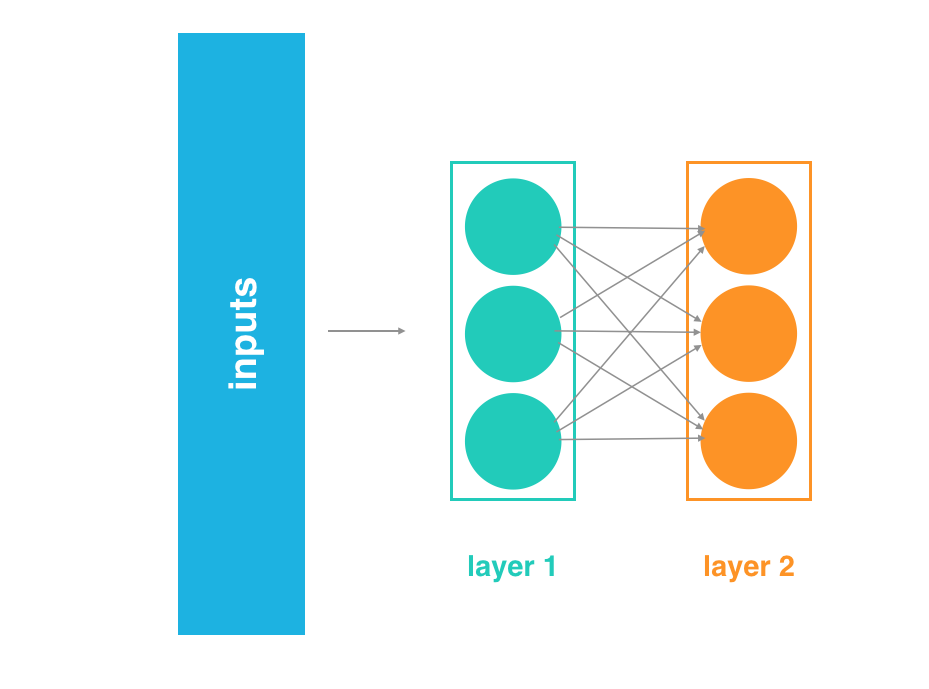
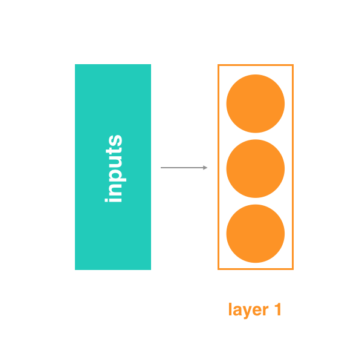
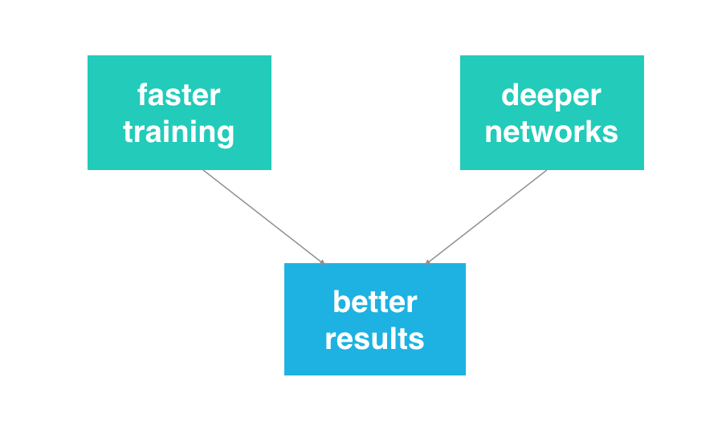
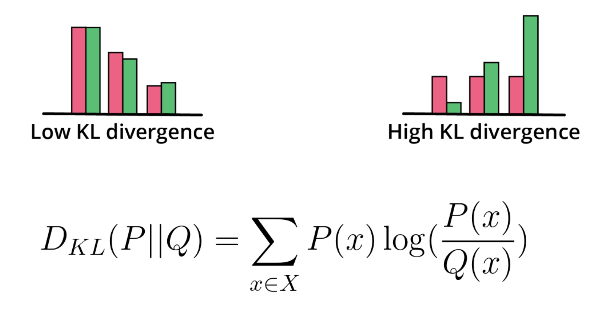
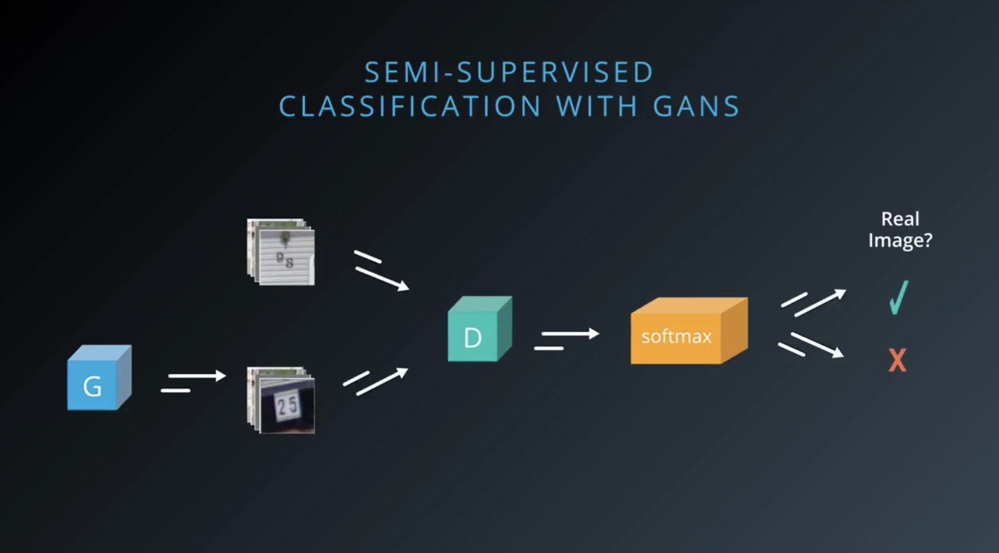

 
 

# C-3: Training a Deep Convolutional GANs

 
 

In this lesson on Deep Convolutional GANs (DCGANs) we will cover the following topics:

- Build DCGAN Discriminator and Generator
- Train a DCGAN Model
- Evaluate GANs using New Metrics

 

figure: DCGAN Architecture Overview

 

#### Understanding a DCGAN

In this lesson, you will be training a GAN on the CIFAR10 dataset, a labeled subset of the 80 million tiny images
dataset. To improve model performance, convolutional layers will be used to make a DCGAN.

- DCGANs have generator and discriminator networks, but the networks are made of convolutional layers that are designed
  to work with spatial data
- The discriminator will be a convolutional neural network (CNN) that classifies images are real or fake
- The generator will be a transpose CNN that upsamples a latent vector z and generates realistic images that can fool
  the discriminator.

### DCGAN Discriminator

The DCGAN Discriminator is:

- A convolutional neural network (CNN) with one fully connected layer at the end
- There are no max-pooling layers in the network
- Down-sampling is accomplished using convolutional layers that have a stride equal to 2
- Batch normalization and Leaky ReLU activations are applied to the outputs of all hidden layers
- After a series of downsampling convolutional layers, the final layer is flattened and connected to a single sigmoid
  unit
- The sigmoid unit output has a range from 0 to 1, indicating if an image is "real" or "fake"

 

figure: DCGAN Discriminator Structure

 

Leaky ReLu – a function that will reduce any negative values by multiplying those values by some small coefficient,
known as the negative slope.

Batch Normalization – scales the layer outputs to have a mean of 0 and variance of 1, to help the network train faster
and reduce problems due to poor parameter initialization.

**Quiz Question**: Which statements are true about the DCGAN discriminator?

**Answers**:

1. "It uses Leaky ReLU activation instead of ReLU"

- Answer: True
- Explanation: DCGAN discriminator uses Leaky ReLU to prevent dying ReLU problem and allow better gradient flow for
  negative values, which is crucial for the discriminator's learning process.

2. "It uses convolution layer to decrease the input spatial resolution"

- Answer: True
- Explanation: DCGAN discriminator uses strided convolutions to progressively decrease spatial dimensions of the input,
  allowing it to process and analyze images at different scales.

3. "It also uses pooling layers to decrease the input spatial resolution"

- Answer: False
- Explanation: DCGAN specifically avoids using pooling layers, instead relying on strided convolutions for downsampling.
  This architectural choice helps maintain spatial information and improve training stability.

**Key Points**:

- DCGAN discriminator uses an architecture optimized for image processing
- It relies on strided convolutions rather than pooling
- Leaky ReLU helps prevent the vanishing gradient problem
- The design choices aim to create a stable and effective discriminator for image generation tasks

### DCGAN Generator

The task of a DCGAN Generator is to understand patterns in the underlying structure and features of the training data,
in ways that allow it to create realistic generated images.

The DCGAN Generator:

1. Has an input, random vector z
2. Has an image output that can be sent to the discriminator
3. Up-samples the vector z until it is the same shape as the training images
4. Uses transposed convolutions
5. ReLU activations and batch normalization is used on all hidden layers
6. A tanh activation function is applied the outputs of the final layer

 

figure: DCGAN Generator Architecture

 

DCGAN Generator does NOT have direct access to the training data. Here's how it actually works:

**Generator's Learning Process**:

1. Never sees real training data directly
2. Learns indirectly through:
   - Discriminator's feedback
   - Backpropagation of gradients
   - Loss function signals

**How Generator Learns Patterns**:

1. **Input**: Takes random noise (latent vector)
2. **Process**:

   - Generates fake images
   - Gets feedback from discriminator about how "real" they look
   - Updates its parameters based on this feedback

3. **Learning Chain**:
   - Discriminator sees real training data
   - Discriminator learns what "real" looks like
   - Generator gets feedback from discriminator
   - Generator improves based on this indirect feedback

**Key Point**:

- The generator learns to understand patterns and features indirectly
- It's like an artist learning to paint without seeing real paintings, but getting feedback from an art critic who has
  seen them
- The discriminator acts as a "teacher" that has studied the real data and guides the generator's learning

This indirect learning process is a key characteristic of GANs, where the generator improves through adversarial
feedback rather than direct access to training data.

#### Generating Images

To generate an image, the generator:

- Connects the input vector z to a fully connected layer
- The fully connected layer is reshaped to a 4x4 XY shape of a given depth
- A stack of larger layers is built by upsampling with transpose convolution
- Each layer is doubled in XY size using strides of 2, and depth is reduced
- The final output is a generated image the same size as the training images

**Quiz Question**: Which statements are true about the DCGAN generator?

**Answers**:

1. "It only uses fully connected layers"

- Answer: False
- Explanation: DCGAN generator uses both convolutional layers and transpose convolutions (deconvolutions) to generate
  images, not just fully connected layers. This architecture is specifically designed for image generation.

2. "It outputs an RGB image in the -1/1 range"

- Answer: True
- Explanation: The DCGAN generator's final layer typically uses tanh activation, which outputs values in the range [-1,
  1], making it suitable for normalized RGB image generation.

3. "It uses transpose convolution layer to progressively increase the resolution"

- Answer: True
- Explanation: DCGAN generator uses transpose convolutions (sometimes called deconvolutions) to progressively upscale
  the spatial dimensions from the initial latent vector to the final image size.

4. "It uses Leaky ReLU activation instead of ReLU"

- Answer: False
- Explanation: DCGAN generator typically uses regular ReLU activations, not Leaky ReLU. Leaky ReLU is more commonly used
  in the discriminator. The generator benefits from the standard ReLU's properties.

**Key Points**:

- Uses a combination of layers, not just fully connected
- Outputs normalized images using tanh
- Uses transpose convolutions for upscaling
- Uses regular ReLU activations

### Batch Normalization

Batch normalization was introduced in Sergey Ioffe's and Christian Szegedy's 2015 paper Batch Normalization:
_Accelerating Deep Network Training by Reducing Internal Covariate Shift_. The idea is that, instead of just normalizing
the inputs to the network, we normalize the inputs to every layer within the network.

It's called "batch" normalization because, during training, we normalize each layer's inputs by using the mean and
standard deviation (or variance) of the values in the current batch. These are sometimes called the batch statistics.
Specifically, batch normalization normalizes the output of a previous layer by subtracting the batch mean and dividing
by the batch standard deviation. We know that normalizing the inputs to a network helps the network learn and converge
to a solution. However, a network is a series of layers, where the output of one layer becomes the input to another.
That means we can think of any layer in a neural network as the first layer of a smaller network.

 

figure: Batch Normalization Step 1

 

#### Normalization at Every Layer

For example, imagine a 3 layer network. Instead of just thinking of it as a single network with inputs, layers, and
outputs, think of the output of layer 1 as the input to a two layer network. This two layer network would consist of
layers 2 and 3 in our original network.

 

figure: Batch Normalization Step 2

 

Likewise, the output of layer 2 can be thought of as the input to a single layer network, consisting only of layer 3.

 

figure: Batch Normalization Step 3

 

When you think of it like this - as a series of neural networks feeding into each other - then it's easy to imagine how
normalizing the inputs to each layer would help. It's just like normalizing the inputs to any other neural network, but
you're doing it at every layer (subnetwork).

#### Internal Covariate Shift

Beyond the intuitive reasons, there are good mathematical reasons to motivate batch normalization. It helps combat what
the authors call internal covariate shift. In this case, internal covariate shift refers to the change in the
distribution of the inputs to different layers. It turns out that training a network is most efficient when the
distribution of inputs to each layer is similar!

And batch normalization is one method of standardizing the distribution of layer inputs. This discussion is best handled
the paper on Batch Normalization (ArXiv PDF) and in Deep Learning, a book you can read online written by Ian Goodfellow,
Yoshua Bengio, and Aaron Courville. In order to normalize the values, we first need to find the average value for the
batch. If you look at the code, you can see that this is not the average value of the batch inputs, but the average
value coming out of any particular layer before we pass it through its non-linear activation function and then feed it
as an input to the next layer.

We represent the average as $\mu_B$ which is simply the sum of all of the values, $x_i$ divided by the number of values,
$m$:

$\mu_B = \frac{1}{m}\sum_{i=1}^m x_i$

We then need to calculate the variance, or mean squared deviation, represented as $\sigma_B^2$. If you aren't familiar
with statistics, that simply means for each value $x_i$, we subtract the average value ( calculated earlier as $mu_B$),
which gives us what's called the "deviation" for that value. We square the result to get the squared deviation. Sum up
the results of doing that for each of the values, then divide by the number of values, again $m$, to get the average, or
mean, squared deviation.

$\sigma_B^2 = \frac{1}{m}\sum_{i=1}^m(x_i - \mu_B)^2$

#### Normalizing output values

Once we have the mean and variance, we can use them to normalize the values with the following equation. For each value,
it subtracts the mean and divides by the (almost) standard deviation. (You've probably heard of standard deviation many
times, but if you have not studied statistics you might not know that the standard deviation is actually the square root
of the mean squared deviation.)

$\hat{x}_i = \frac{x_i - \mu_B}{\sqrt{\sigma_B^2 + \epsilon}}$

Above, we said "(almost) standard deviation". That's because the real standard deviation for the batch is calculated
by$\sqrt{\sigma_B^2}$, but the above formula adds the term epsilon before taking the square root. The epsilon can be any
small, positive constant, ex. the value 0.001. It is there partially to make sure we don't try to divide by zero, but it
also acts to increase the variance slightly for each batch.

Why add this extra value and mimic an increase in variance? Statistically, this makes sense because even though we are
normalizing one batch at a time, we are also trying to estimate the population distribution – the total training set,
which itself an estimate of the larger population of inputs your network wants to handle. The variance of a population
is typically higher than the variance for any sample taken from that population, especially when you use a small sample
size (a small sample is more likely to include values near the peak of a population distribution), so increasing the
variance a little bit for each batch helps take that into account.

At this point, we have a normalized value, represented as $\hat{x}_i$. But rather than use it directly, we multiply it
by a gamma value, and then add a beta value. Both gamma and beta are learnable parameters of the network and serve to
scale and shift the normalized value, respectively. Because they are learnable just like weights, they give your network
some extra knobs to tweak during training to help it learn the function it is trying to approximate.

$y_i = \gamma\hat{x}_i + \beta$

We now have the final batch-normalized output of our layer, which we would then pass to a non-linear activation function
like sigmoid, tanh, ReLU, Leaky ReLU, etc. In the original batch normalization paper, they mention that there might be
cases when you'd want to perform the batch normalization after the non-linearity instead of before, but it is difficult
to find any uses like that in practice.

A model with batch normalization applied would reach a lower training loss and higher test accuracy. To add batch
normalization layers to a PyTorch model:

- You add batch normalization to layers inside the**init** function.
- Layers with batch normalization do not include a bias term. So, for linear or convolutional layers, you'll need to set
  bias=False if you plan to add batch normalization on the outputs.
- You can use PyTorch's BatchNorm1d function to handle the math on linear outputs or BatchNorm2d for 2D outputs, like
  filtered images from convolutional layers.
- You add the batch normalization layer before calling the activation function, so it always goes layer > batch norm >
  activation.

Finally, when you tested your model, you set it to .eval() mode, which ensures that the batch normalization layers use
the populationrather than the batch mean and variance (as they do during training).

 

figure: Complete Batch Normalization Process

 

By using batch normalization to normalize the inputs at each layer of a network, we can make these inputs more
consistent and thus reduce oscillations that may happen in gradient descent calculations. This helps us build deeper
models that also converge faster! Take a look at the PyTorch BatchNorm2d documentation to learn more about how to add
batch normalization to a model, and how data is transformed during training (and evaluation).

#### Benefits of Batch Normalization

Batch normalization optimizes network training. It has been shown to have several benefits:

- Networks train faster – Each training iteration will actually be slower because of the extra calculations during the
  forward pass and the additional hyperparameters to train during back propagation. However, it should converge much
  more quickly, so training should be faster overall.
- Allows higher learning rates – Gradient descent usually requires small learning rates for the network to converge. And
  as networks get deeper, their gradients get smaller during back propagation so they require even more iterations.
  Using batch normalization allows us to use much higher learning rates, which further increases the speed at which
  networks train.
- Makes weights easier to initialize – Weight initialization can be difficult, and it's even more difficult when
  creating deeper networks. Batch normalization seems to allow us to be much less careful about choosing our initial
  starting weights.
- Makes more activation functions viable – Some activation functions do not work well in some situations. Sigmoids lose
  their gradient pretty quickly, which means they can't be used in deep networks. And ReLUs often die out during
  training, where they stop learning completely, so we need to be careful about the range of values fed into them.
  Because batch normalization regulates the values going into each activation function, non-linearlities that don't seem
  to work well in deep networks actually become viable again.
- Simplifies the creation of deeper networks – Because of the first 4 items listed above, it is easier to build and
  faster to train deeper neural networks when using batch normalization. And it's been shown that deeper networks
  generally produce better results, so that's great.
- Provides a bit of regularization – Batch normalization adds a little noise to your network. In some cases, such as in
  Inception modules, batch normalization has been shown to work as well as dropout. But in general, consider batch
  normalization as a bit of extra regularization, possibly allowing you to reduce some of the dropout you might add to a
  network.
- May give better results overall – Some tests seem to show batch normalization actually improves the training results.
  However, it's really an optimization to help train faster, so you shouldn't think of it as a way to make your network
  better. But since it lets you train networks faster, that means you can iterate over more designs more quickly. It
  also lets you build deeper networks, which are usually better. So when you factor in everything, you're probably going
  to end up with better results if you build your networks with batch normalization.

 
 

#### Optimization Strategy / Hyperparameters

Another approach for better GAN convergence consists in using the Two Times Update Rule (TTUR). This approach consists
in running more update steps for the discriminator than for the generator. For example, for each update of the
generator, we run 3 updates of the discriminator.

Another way is to have a slightly higher learning rate for the discriminator. An example of TTUR can be found in the
official implementation by the Institute of Bioinformatics, Johannes Kepler University Linz.

**Question 1**: Why is training GAN hard? (Check all correct choices)

**Answers**:

1. "The discriminator's job is much easier and it can easily overcome the generator"

- Answer: True
- Explanation: Discriminator can often learn too quickly and provide insufficient feedback to the generator, leading to
  training imbalance.

2. "GANs are harder to monitor because fluctuating losses are not a sign that the sign is going poorly"

- Answer: True
- Explanation: Unlike traditional neural networks, loss values in GANs don't reliably indicate training progress since
  both networks are competing.

3. "The minimax game is inherently hard because the equilibrium between generator and discriminator requires solving a
   hard optimization problem"

- Answer: True
- Explanation: Finding the Nash equilibrium between two competing networks is a complex optimization problem that's
  mathematically challenging.

**Question 2**: Finish the sentence for each concept

**Matches**:

1. "Dropout" → Adds regularization to the discriminator
2. "Label smoothing" → Consists in multiplying the target label by factor < 1
3. "Increasing the generator complexity" → Is helpful if the generated samples are not realistic enough
4. "Starting with a low learning rate and the Adam optimizer" → Is a safe way to get started when training a new
   architecture

Training GAN is challenging, but regularization techniques and default optimizer values can go a long way.

**Explanation**:

- Dropout prevents discriminator from becoming too strong
- Label smoothing helps prevent overconfident predictions
- Complex generator architecture helps capture detailed patterns
- Conservative optimization approach helps stabilize initial training

### GAN Evaluation

The Inception Model The Inception Model is a concatenation of the outputs of layers of different filter sizes that
allows deeper networks. The Inception Score and the Frechet Inception use the Inception Model for their calculations.

 

figure: Inception Model Architecture

 

Kullback Leibler (KL) Divergence The KL divergence is a measure of distance between two probability distributions.

Low KL divergence means that the distributions are similar High KL divergence means that they are different

 

figure: Kullback-Leibler Divergence

 

### The Inception Score

The Inception Score leverages the KL divergence and the inception model to evaluate generated samples. To calculate the
inception score, build two probability distributions.

1. Conditional Distribution – feed a generated sample through the inception model pre-trained on the ImageNet dataset.
   The inception model will output a probability distribution with the last soft-max layer.
2. Marginal Distribution – the mean of all the p(y∣x) over all of the x values.
3. Use KL Divergence to measure the distance between the two distributions.

 

figure: Inception Score Calculation

 

The Inception Score is:

$e^{E[KL(p(y|x),p(y))]}$

where the exponent is the expected value of KL divergence between the marginal and the conditional label distribution
over all the generated samples.

Inception Score Limitations The inception score is a great tool to calculate a GAN performance but has some limitations:

1. It relies on a model pre-trained on the ImageNet dataset.
2. It does not take into account the real dataset, which can be limiting in some situations.

### Frechet Inception Distance

Task 1: **Quiz Question**: Which of the following statement are true? (Check all that apply)

**Answers**:

1. "The inception score only requires generated images"

- Answer: False
- Explanation: Inception Score requires both generated images and a pre-trained Inception model to calculate the
  conditional and marginal distributions.

2. "The inception score requires to calculate the KL divergence between the conditional label distribution and the
   marginal distribution"

- Answer: True
- Explanation: The Inception Score calculates the KL divergence between p(y|x) (conditional) and p(y) (marginal)
  distributions.

3. "The Frechet Inception Distance requires both the mean and covariance of the generated samples and the real samples"

- Answer: True
- Explanation: FID uses both statistical measures (mean and covariance) from both real and generated samples to compare
  distributions.

4. "The Frechet Inception Distance calculates the distance between two multivariate Gaussian distributions"

- Answer: True
- Explanation: FID measures the distance between two multivariate Gaussian distributions fitted to the real and
  generated data features.

Task 2: Correction: At 1:10, the description of the $m_f$ and $C_f$ should be

- $m_f$: mean of the fake distribution
- $C_f$: covariance of the fake distribution

Frechet Inception Distance or FID measures the distance between two multinomial Gaussian distributions, where the mean
and covariance are calculated from the real and the generated samples.

 

figure: Fréchet Inception Distance

 

The mathematical equation for determining FID is:

$d = ||m_r - m_f||_2^2 + \text{Tr}(C_r + C_f - 2(C_rC_f)^{1/2})$

where:

- $m_r$: mean of the real distribution
- $C_r$: covariance of the real distribution
- $m_f$: mean of the fake distribution
- $C_f$: covariance of the fake distribution
- Tr: trace

The Inception Score paper and the Frechet Inception Distance paper (which is also the TTUR paper, suprise!) contain a
lot more information about the implementation of both metrics.

Both official implementations are available:

- Inception Score Code
- Frechet Inception Distance code

### Other Applications of GANs

### Semi-Supervised Learning

 

figure: Semi-Supervised Learning Process

 

Semi-supervised models are used when you only have a few labeled data points. The motivation for this kind of model is
that, we increasingly have a lot of raw data, and the task of labelling data is tedious, time-consuming, and often,
sensitive to human error. Semi-supervised models give us a way to learn from a large set of data with only a few labels,
and they perform surprisingly well even though the amount of labeled data you have is relatively tiny. Ian Goodfellow
has put together a video on this top, which you can see, below.
