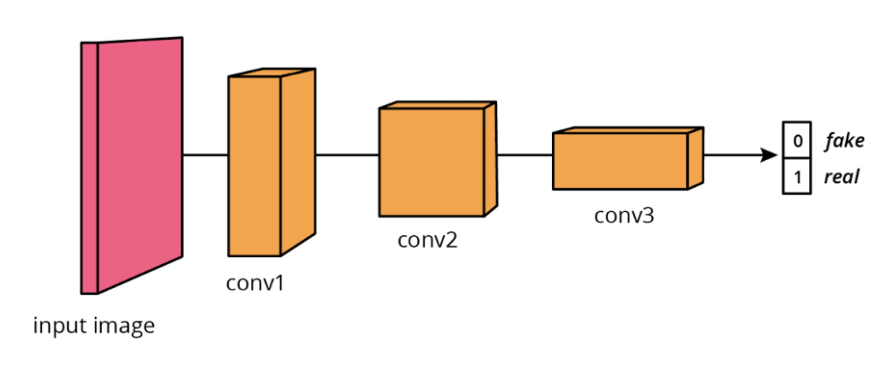
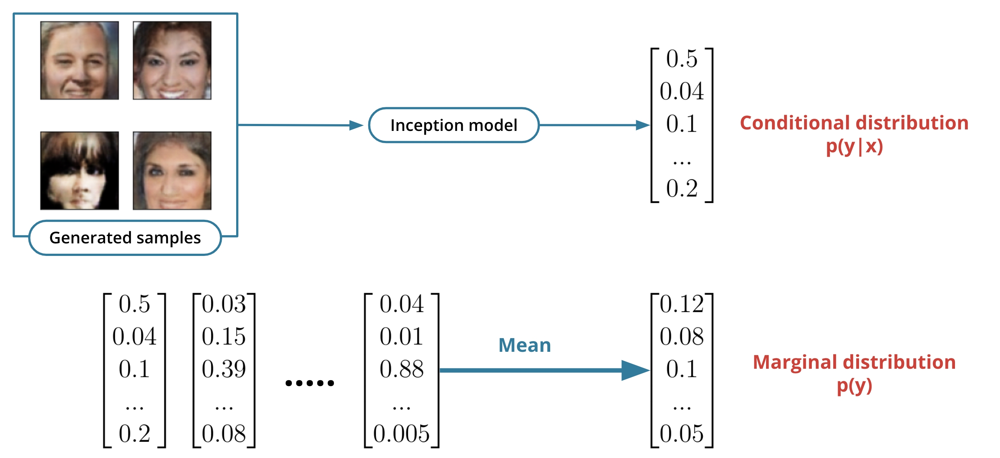
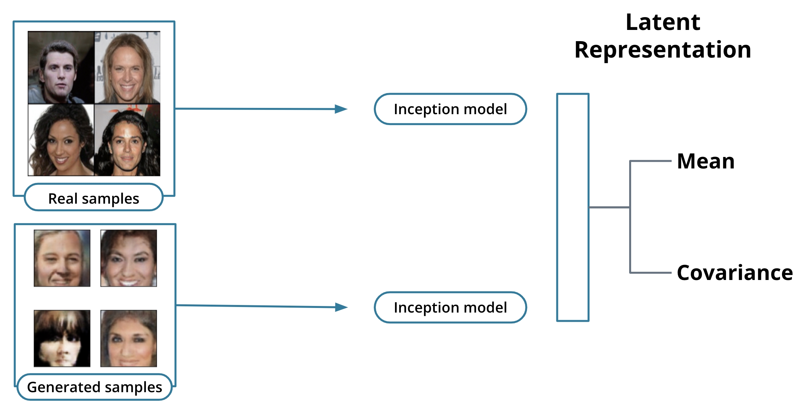

<br>
<br>

# S-3: Training a Deep Convolutional GANs

<br>
<br>

1. Deep Convolutional GAN Architecture
    - DCGAN Discriminator Design
    - DCGAN Generator Design
    - Architectural Innovations and Constraints
2. Batch Normalization in GANs
    - Fundamentals of Batch Normalization
    - Internal Covariate Shift
    - Mathematical Implementation
    - Benefits for GAN Training
3. GAN Training Strategies and Optimization
    - Hyperparameter Selection
    - Two Times Update Rule (TTUR)
    - Training Challenges and Solutions
    - Stability Techniques
4. Evaluating GAN Performance
    - Inception Score
    - Fréchet Inception Distance (FID)
    - Comparing Evaluation Metrics
    - Implementation Considerations
5. Advanced GAN Applications
    - Semi-Supervised Learning with GANs
    - Additional GAN Implementations

#### Deep Convolutional GAN Architecture

##### DCGAN Discriminator Design

The Deep Convolutional GAN (DCGAN) discriminator represents a significant architectural advancement over early GAN
designs, specifically optimized for processing image data. Unlike the original GAN implementations that relied heavily
on fully connected layers, the DCGAN discriminator leverages convolutional operations to effectively capture spatial
relationships within images.

The discriminator follows a carefully structured design that progressively processes and analyzes the input image:

1. **Input Layer**: The discriminator begins with the raw image input (such as a 32×32×3 color image from CIFAR-10).
   This unprocessed image is immediately fed into the convolutional pipeline without any batch normalization at this
   initial stage.
2. **Downsampling Convolutional Sequence**: Instead of traditional pooling operations, the DCGAN discriminator utilizes
   strided convolutions to simultaneously extract features and reduce spatial dimensions. This design choice offers two
   advantages:
    - The network learns its own spatial downsampling rather than using fixed operations like max pooling
    - All parameters in the downsampling process are learnable, allowing for more adaptive feature extraction
3. **Convolutional Layers**: Each convolutional layer follows a specific pattern:
    - Uses filters with small receptive fields (typically 3×3 or 5×5)
    - Applies a stride of 2 for downsampling, effectively halving the spatial dimensions
    - Increases the channel depth (feature maps) as spatial dimensions decrease
    - For example: 32×32×3 → 16×16×64 → 8×8×128 → 4×4×256
4. **Activation Function**: After each convolutional layer (except the final output), the discriminator applies Leaky
   ReLU activation with a small negative slope coefficient (typically 0.2). This choice is crucial because:
    - Traditional ReLU completely zeros out negative values, which can cause "dying ReLU" problems
    - Leaky ReLU allows a small gradient for negative values, ensuring better information flow
    - This helps prevent the discriminator from becoming too powerful too quickly
5. **Batch Normalization**: The output of each convolutional layer (except the first) undergoes batch normalization
   before activation. This normalizes the layer outputs to have zero mean and unit variance, which:
    - Stabilizes training by preventing internal covariate shift
    - Allows higher learning rates
    - Reduces the impact of poor weight initialization
6. **Final Classification**: After the series of convolutional layers:
    - The final feature map is flattened into a one-dimensional vector
    - A single fully connected layer transforms this vector to a scalar output
    - A sigmoid activation function squashes this output between 0 and 1, representing the probability that the input
      image is real

The overall flow of the DCGAN discriminator can be visualized as a pyramid-like structure that progressively condenses
spatial information while extracting increasingly abstract features, ultimately arriving at a single probability output.

The absence of pooling layers is particularly notable. In traditional CNNs, max or average pooling is commonly used to
reduce spatial dimensions, but the DCGAN architecture deliberately avoids these operations. Instead, it relies on
strided convolutions that allow the network to learn its own optimal downsampling operations, preserving more
information and improving gradient flow during training.

This architectural design creates a powerful image classifier specifically tailored to the GAN training process, capable
of making increasingly sophisticated distinctions between real and generated images as training progresses.

##### DCGAN Generator Design

The DCGAN generator represents the creative component of the GAN framework, transforming random noise vectors into
visually coherent images through a series of upsampling operations. Its architecture mirrors the discriminator in
reverse, forming a complementary relationship that facilitates the adversarial learning process.

The generator's architecture follows a structured pathway from latent space to image space:

1. **Input Layer**: The process begins with a random noise vector (typically 100 dimensions) sampled from a normal or
   uniform distribution. This latent vector represents the seed from which an image will be generated.
2. **Initial Projection**: Unlike the discriminator, which starts with a full-sized image, the generator must build an
   image from a simple vector:
    - The noise vector passes through a fully connected layer
    - This layer expands the vector to a small but deeply channeled feature map (e.g., 4×4×512)
    - The output is reshaped into this initial 3D structure, forming the foundation for the generation process
3. **Upsampling Pathway**: The generator progressively increases spatial dimensions while decreasing feature depth
   through a series of transposed convolution operations (sometimes called deconvolutions):
    - Each transposed convolution doubles the spatial dimensions
    - The channel depth decreases as spatial dimensions increase
    - For example: 4×4×512 → 8×8×256 → 16×16×128 → 32×32×3
4. **Transposed Convolutions**: These specialized layers perform upsampling by essentially reversing the convolution
   process:
    - They learn to expand each input value into a larger output pattern
    - This operation can be visualized as inserting zeros between input values and performing a standard convolution
    - The stride of 2 effectively doubles the resolution at each stage
5. **Activation Functions**: The generator uses different activations at different stages:
    - ReLU activations (not Leaky ReLU) in all hidden layers, which promote sparse activations and help with feature
      learning
    - Tanh activation in the final output layer, constraining values to the range [-1, 1]
6. **Batch Normalization**: Similar to the discriminator, batch normalization is applied after each transposed
   convolutional layer (except the final output layer). This:
    - Stabilizes training by normalizing the distribution of features
    - Prevents mode collapse by ensuring more diverse activations
    - Improves gradient flow through the deep architecture

The generator's architecture embodies several key principles that enable effective image generation:

1. **Progressive Structure Building**: The generator constructs images in a coarse-to-fine manner, first establishing
   basic structure and then adding increasingly fine details as the resolution increases.
2. **Learned Upsampling**: Rather than using fixed upsampling methods like nearest neighbor or bilinear interpolation,
   the transposed convolutions allow the network to learn its own optimal upsampling patterns.
3. **End-to-End Differentiability**: The entire generator network is differentiable, allowing gradients to flow from the
   discriminator's judgments all the way back to the initial noise vector.

The tanh activation in the final layer is particularly important, as it forces the generator's outputs into the same
normalized range (-1 to 1) as the preprocessed training images. This consistency ensures that the discriminator can
fairly compare real and generated samples without bias due to different value ranges.

A critical point about the DCGAN generator is that it never directly sees the training data. Instead, it must learn the
underlying data distribution solely through the discriminator's feedback. This creates a fascinating learning dynamic
where the generator gradually develops an implicit understanding of the target domain (e.g., what makes a valid image of
a cat or car) without ever having direct access to examples.

##### Architectural Innovations and Constraints

The DCGAN architecture introduced several key innovations and design constraints that dramatically improved GAN
stability and performance for image generation tasks. These architectural principles have become foundational guidelines
for many subsequent GAN implementations.

**Key Architectural Innovations:**

1. **Elimination of Fully Connected Layers**: Except for the generator's initial layer and the discriminator's final
   layer, DCGANs avoid fully connected layers entirely. This design choice:
    - Reduces the number of parameters
    - Enforces more efficient spatial feature learning
    - Maintains spatial information throughout the network
    - Improves gradient flow during backpropagation
2. **Strided Convolutions for Downsampling**: Rather than using pooling operations, DCGANs utilize strided convolutions
   in the discriminator. This innovation allows:
    - The network to learn its own optimal downsampling
    - All downsampling operations to be parameter-driven and trainable
    - Better preservation of spatial information compared to pooling
3. **Transposed Convolutions for Upsampling**: The generator uses transposed convolutions (sometimes called
   fractionally-strided convolutions) instead of simple upsampling followed by convolution. This approach:
    - Enables learnable upsampling operations
    - Produces smoother and more coherent spatial transitions
    - Gives the network more flexibility in how it increases resolution
4. **Strategic Batch Normalization Placement**: Batch normalization is applied to nearly all layers, with two specific
   exceptions:
    - Not applied to the discriminator's input layer to preserve the input distribution
    - Not applied to the generator's output layer to maintain the output range
5. **Specialized Activation Functions**: DCGANs employ different activation functions for different purposes:
    - Leaky ReLU in the discriminator to prevent vanishing gradients on negative values
    - Regular ReLU in the generator to encourage sparse feature maps
    - Tanh in the generator's output to constrain values to a normalized range

**Design Constraints and Principles:**

1. **Balanced Network Capacity**: The discriminator and generator must maintain a relatively balanced capacity to
   prevent one from overwhelming the other. If the discriminator becomes too powerful, it won't provide useful gradients
   to the generator.
2. **Consistent Feature Map Progression**: Both networks follow a structured pattern of doubling/halving spatial
   dimensions between layers while correspondingly halving/doubling feature channels. This creates a pyramidal structure
   that gradually transforms between image space and latent space.
3. **Architectural Symmetry**: The generator and discriminator mirror each other's structure, creating a natural
   adversarial relationship. The discriminator essentially attempts to reverse-engineer the generator's transformations.
4. **No Pooling Layers**: The deliberate avoidance of pooling layers ensures that the network learns its own spatial
   hierarchies rather than using fixed downsampling operations.
5. **Single Sigmoid Output**: The discriminator outputs a single probability value through a sigmoid activation,
   representing the likelihood that an input image is real rather than generated.

**Implementation Constraints and Practical Considerations:**

1. **Filter Size Standardization**: DCGAN typically uses small, uniform filter sizes (3×3 or 5×5) throughout the
   network, promoting consistency and efficient computation.
2. **Progressive Resolution Changes**: Each layer transition changes resolution by a factor of 2, creating a smooth
   progression of spatial dimensions from the smallest to the largest representation.
3. **Channel Depth Scaling**: As spatial dimensions decrease, channel depth increases proportionally, maintaining a
   relatively consistent total information capacity at each layer.
4. **Kernel Initialization**: Weights are typically initialized from a normal distribution with mean 0 and standard
   deviation 0.02, which empirically improves training stability.
5. **Optimization Parameters**: DCGANs often use specific optimizer settings, such as Adam with a learning rate of
   0.0002 and momentum parameter β₁ of 0.5 rather than the default 0.9.

These architectural innovations and constraints transformed GANs from interesting but unstable research concepts into
practical tools for high-quality image generation. The DCGAN architecture established a template that many subsequent
GAN variants have built upon, including Progressive GANs, StyleGAN, and others that have pushed the boundaries of image
synthesis quality.

#### Batch Normalization in GANs

##### Fundamentals of Batch Normalization

Batch normalization represents one of the most important innovations in deep learning, and it plays a particularly
crucial role in stabilizing GAN training. At its core, batch normalization addresses a fundamental problem in training
deep neural networks: the constantly changing distribution of inputs to each layer during training.

When we train a neural network, we typically normalize the initial inputs to have zero mean and unit variance. This
normalization helps the network learn more efficiently. However, as these inputs pass through multiple layers with
weights that are constantly updating during training, the distribution of values at each subsequent layer shifts
unpredictably. Batch normalization extends the concept of input normalization to every layer in the network.

The fundamental insight behind batch normalization is surprisingly simple yet powerful: normalize the outputs of each
layer before they become inputs to the next layer. This process ensures that each layer receives inputs with a
relatively consistent distribution throughout training, regardless of how the parameters of previous layers are
changing.

In the context of GANs, this normalization becomes especially important because we have two networks simultaneously
learning and adjusting their parameters. The generator is constantly changing how it creates images, and the
discriminator is constantly adapting to these changes. Without batch normalization, this dynamic adversarial process
often becomes unstable, with one network overwhelming the other or both networks failing to converge.

Batch normalization operates by taking a mini-batch of data (hence the "batch" in the name) and performing the following
steps:

1. Calculate the mean and variance of the activations across the batch for each feature
2. Normalize the activations using these statistics
3. Scale and shift the normalized values using learnable parameters

This process allows each layer to learn more independently, without being overly dependent on the specific distributions
produced by previous layers. It's like giving each layer in the network a fresh start with well-behaved inputs,
regardless of what changes are happening elsewhere in the network.

For GANs specifically, batch normalization serves as a kind of stabilizing force between the generator and
discriminator. It helps prevent situations where extreme values from one network cause the other network to receive
inputs that lead to vanishing or exploding gradients. This stabilization is critical for maintaining the delicate
balance necessary for successful adversarial training.

##### Internal Covariate Shift

Internal covariate shift is the technical term for the problem that batch normalization addresses. "Covariate shift"
typically refers to a change in the distribution of inputs between training and testing phases. "Internal covariate
shift" extends this concept to the hidden layers within a neural network.

During training, as the parameters of each layer update, the distribution of inputs to subsequent layers also changes.
This shifting distribution means that later layers must continuously adapt to new input distributions, which
significantly slows down the training process. It's as if these layers are trying to hit a moving target.

We can visualize this process by thinking about a deep neural network as a series of transformations. When the first
layer updates its weights, it changes the distribution of its outputs. This change then affects the second layer, which
is now receiving a different distribution of inputs than it was previously. This cascade continues throughout the
network, with each layer dealing with continually shifting input distributions.

This internal covariate shift causes several problems in deep network training:

1. Slower convergence, as each layer must adapt to the constantly changing input distributions
2. Requirement for lower learning rates to prevent instability
3. Greater sensitivity to initialization parameters
4. Difficulty in training very deep networks

In GANs, this problem is magnified because the generator and discriminator are both deep networks that are
simultaneously updating their parameters in an adversarial relationship. The discriminator is trying to distinguish
between real and fake images, while the generator is trying to produce images that fool the discriminator. This creates
a doubly dynamic environment where both networks are causing internal covariate shift for themselves while also changing
the inputs that the other network receives.

For example, when the generator improves and creates more realistic images, this changes the distribution of "fake"
examples that the discriminator sees. Similarly, as the discriminator becomes better at identifying subtle flaws, the
generator receives different feedback signals. Without batch normalization to stabilize these shifting distributions,
GAN training often collapses or fails to converge.

Batch normalization directly addresses internal covariate shift by ensuring that regardless of how the parameters of
earlier layers change, each layer receives inputs with a relatively consistent statistical distribution. This
consistency significantly improves the training dynamics, especially in the complex adversarial setting of GANs.

##### Mathematical Implementation

The mathematical implementation of batch normalization involves a series of straightforward but powerful operations.
Let's walk through the complete process step by step, explaining both the calculations and their purpose.

For a mini-batch of activations at a particular layer, batch normalization performs the following operations:

**Step 1: Calculate the batch mean**

The mean is calculated across the batch dimension for each feature:

$$\mu_B = \frac{1}{m} \sum_{i=1}^{m} x_i$$

Where:

- $x_i$ represents the activation value for a particular feature in a single example
- $m$ is the batch size (number of examples in the mini-batch)
- $\mu_B$ is the resulting mean for this feature across the batch

**Step 2: Calculate the batch variance**

The variance is calculated as the average squared deviation from the mean:

$$\sigma_B^2 = \frac{1}{m} \sum_{i=1}^{m} (x_i - \mu_B)^2$$

This value represents how spread out the activation values are from their mean.

**Step 3: Normalize the activations**

Using the calculated mean and variance, each activation is normalized:

$$\hat{x}_i = \frac{x_i - \mu_B}{\sqrt{\sigma_B^2 + \epsilon}}$$

Where:

- $\epsilon$ is a small constant (typically 10^-5) added for numerical stability to prevent division by zero
- $\hat{x}_i$ is the normalized activation

This normalization transforms the distribution of activations to have approximately zero mean and unit variance, similar
to standardizing a normal distribution in statistics.

**Step 4: Scale and shift (learnable parameters)**

The normalized values are then scaled and shifted using two learnable parameters:

$$y_i = \gamma \hat{x}_i + \beta$$

Where:

- $\gamma$ is a scaling factor (learnable)
- $\beta$ is a shifting factor (learnable)
- $y_i$ is the final output of the batch normalization operation

These learnable parameters allow the network to undo the normalization if necessary. This is crucial because sometimes
the raw, unnormalized values actually contain useful information. By learning $\gamma$ and $\beta$, the network can
decide how much normalization is beneficial for each feature.

**Training vs. Inference Behavior**

During training, batch normalization uses the statistics (mean and variance) calculated from the current mini-batch.
However, during inference (when the model is used to make predictions), we typically don't process data in mini-batches
in the same way. Instead, batch normalization layers use running estimates of the mean and variance calculated during
training:

$$\mu_{running} = \text{momentum} \times \mu_{running} + (1 - \text{momentum}) \times \mu_B$$
$$\sigma^2_{running} = \text{momentum} \times \sigma^2_{running} + (1 - \text{momentum}) \times \sigma_B^2$$

Where momentum is typically set to 0.9 or 0.99, creating an exponential moving average of the batch statistics.

**Implementation in GANs**

In the specific context of GANs, batch normalization is applied with two important exceptions:

1. It is not applied to the generator's output layer, as this would constrain the distribution of the generated images
2. It is not applied to the discriminator's input layer, as this would discard valuable information about the real data
   distribution

For both networks, batch normalization is typically applied after the linear or convolutional operation but before the
activation function:

```
Layer → Batch Normalization → Activation → Next Layer
```

This ordering ensures that the activation function receives normalized inputs, which helps prevent saturation in
functions like sigmoid or tanh and improves the effectiveness of ReLU variants.

##### Benefits for GAN Training

Batch normalization provides numerous benefits that are particularly valuable for GAN training, addressing many of the
challenges that make GANs notoriously difficult to train. These benefits transform GANs from unstable, temperamental
models into more practical tools for image generation and other applications.

**1. Training Stability**

Perhaps the most critical benefit of batch normalization for GANs is improved training stability. Without batch
normalization, GAN training often suffers from:

- The discriminator becoming too powerful too quickly, providing minimal useful gradient information to the generator
- Mode collapse, where the generator produces only a limited variety of outputs
- Oscillation between different failure modes rather than convergence

Batch normalization stabilizes training by:

- Preventing extreme activation values that can cause gradient problems
- Ensuring more consistent learning signals between the networks
- Moderating the speed at which either network can dominate the training process

This stability allows GANs to train for longer periods, reaching better quality outputs instead of collapsing or
diverging.

**2. Faster Convergence**

While each iteration might take slightly longer due to the additional computations, batch normalization typically leads
to faster overall convergence for several reasons:

- It reduces the internal covariate shift, allowing each layer to learn more independently
- It enables the use of higher learning rates without instability
- It makes the optimization landscape smoother and more navigable

For GANs, this faster convergence means we can achieve better results with fewer training iterations, making it
practical to train on larger datasets or at higher resolutions.

**3. Reduced Sensitivity to Initialization**

GAN training outcomes are often highly dependent on weight initialization, with slight variations leading to
dramatically different results. Batch normalization reduces this sensitivity by:

- Normalizing activations regardless of the initial weight values
- Preventing extreme activation values early in training
- Providing more consistent gradients across different initialization schemes

This reduced sensitivity makes GANs more reliable and reproducible, an important consideration for practical
applications.

**4. Preventing Mode Collapse**

Mode collapse occurs when the generator produces only a limited subset of possible outputs, ignoring the diversity
present in the training data. Batch normalization helps prevent mode collapse by:

- Ensuring more diverse activations throughout the network
- Normalizing features that might otherwise dominate and cause the generator to fixate
- Maintaining healthier gradient flow that encourages exploration of the full data distribution

This benefit is particularly important for ensuring that GANs produce diverse and representative outputs rather than a
small set of "safe" examples.

**5. Enabling Deeper Architectures**

Batch normalization makes it practical to train deeper network architectures, which is crucial for generating
high-quality, complex images:

- It helps gradients flow more effectively through many layers
- It prevents the vanishing and exploding gradient problems that often plague deep networks
- It reduces the compounding effect of problematic activations through deep sequences of layers

Deeper architectures generally have more capacity to model complex data distributions, allowing GANs to generate more
detailed and realistic outputs.

**6. Compatibility with Various Activation Functions**

Batch normalization makes a wider range of activation functions viable in deep networks:

- It prevents saturation in sigmoid and tanh functions
- It helps address the "dying ReLU" problem by normalizing inputs to the ReLU function
- It works well with Leaky ReLU, which is commonly used in the discriminator

This flexibility allows GAN designers to choose activation functions based on their properties rather than their
training stability.

**7. Mild Regularization Effect**

Batch normalization provides a form of regularization because:

- The normalization statistics vary slightly between mini-batches, adding a form of noise
- This stochasticity helps prevent overfitting to particular input patterns
- It encourages the network to be robust to small variations in feature distributions

For GANs, this regularization effect helps the discriminator avoid becoming too specialized to particular examples,
maintaining its ability to provide useful feedback to the generator throughout training.

**8. Balance Between Networks**

Successful GAN training requires maintaining a delicate balance between the generator and discriminator. Batch
normalization helps maintain this balance by:

- Preventing either network from becoming overwhelmingly strong
- Providing more consistent gradient information between networks
- Ensuring that improvements in one network don't destabilize the other

This balanced adversarial relationship is essential for the progressive improvement of both networks throughout
training.

In practice, these benefits combine to transform GAN training from a notoriously unstable process into a more
predictable and effective one. While batch normalization doesn't solve all the challenges of GAN training, it addresses
many of the fundamental issues that previously limited GAN performance and applicability.

#### GAN Training Strategies and Optimization

##### Hyperparameter Selection

Effective hyperparameter selection is critical for successful GAN training. Unlike many traditional neural networks
where default hyperparameters often work reasonably well, GANs require careful tuning to achieve stability and good
results. The adversarial nature of GAN training creates a delicate balance that can easily be disrupted by poor
hyperparameter choices.

The most important hyperparameters for GAN training include:

**Learning Rates**

Learning rates control how quickly the model parameters update in response to the calculated gradients. For GANs,
learning rate selection is particularly nuanced:

The standard practice is to use smaller learning rates than you might for other neural networks, typically in the range
of 0.0001 to 0.0005. These conservative values help prevent the rapid oscillations that can destabilize GAN training. If
we use learning rates that are too high, we might see:

- The discriminator becoming too good too quickly, preventing the generator from learning
- Parameter updates that are too large, causing overshooting and training instability
- Oscillating loss values that never converge

Importantly, many successful GAN implementations use different learning rates for the generator and discriminator. The
discriminator often benefits from a slightly higher learning rate than the generator (for example, 0.0004 for the
discriminator and 0.0002 for the generator). This small difference helps maintain the balance between the two networks,
preventing the discriminator from overwhelming the generator early in training.

**Optimizer Selection**

The choice of optimizer significantly impacts GAN training dynamics:

Adam optimizer is almost universally preferred for GAN training because it combines the benefits of adaptive learning
rates with momentum. However, the standard Adam parameters are often modified for GANs:

- Beta1 (the exponential decay rate for the first moment estimates) is typically reduced from the default 0.9 to 0.5
- Beta2 (the exponential decay rate for the second moment estimates) is usually kept at the default 0.999
- Weight decay is often added as a form of regularization, with values around 1e-5

This modified Adam configuration helps control the rapid changes in gradient direction that are common in adversarial
training. The lower Beta1 value makes the optimizer less dependent on the momentum of previous updates, allowing it to
adapt more quickly to the changing landscape of the adversarial game.

**Batch Size**

The batch size used during training affects both the quality of the gradient estimates and the statistical properties of
batch normalization:

- Larger batch sizes (64-128) provide more stable gradient estimates and batch normalization statistics
- Smaller batch sizes introduce more noise, which can sometimes help prevent mode collapse
- Very large batch sizes can lead to overfitting and less generalizable models

Most successful GAN implementations use batch sizes between 32 and 128, with 64 being a common starting point. The ideal
batch size often depends on the specific dataset and architecture.

**Latent Space Dimensionality**

The dimensionality of the latent space (the random input vector to the generator) influences the generator's capacity
and the diversity of outputs it can produce:

- Too few dimensions (e.g., less than 32) may constrain the generator's ability to represent complex data distributions
- Too many dimensions (e.g., more than 512) can make the space too sparse, complicating the learning process
- Most implementations use between 100-200 dimensions as a good balance

The distribution from which the latent vectors are sampled also matters. Standard normal distributions (mean 0,
variance 1) are most common, but uniform distributions in the range [-1, 1] are also used successfully in some
architectures.

**Architectural Parameters**

Beyond the basic hyperparameters, several architectural decisions significantly impact GAN performance:

- Number of layers: Deeper models have more capacity but are harder to train
- Feature map counts: More feature maps increase capacity but require more computation
- Kernel sizes: 3×3 or 5×5 kernels are standard for convolutional layers
- Leaky ReLU slope: The negative slope coefficient (alpha) is typically set to 0.2

Starting with the architectural guidelines established by the DCGAN paper provides a solid foundation, with
modifications made based on the specific requirements of the dataset and generation task.

**Initialization Strategies**

How the network weights are initialized can significantly impact early training dynamics:

- Normal distribution with mean 0 and standard deviation 0.02 is common for GAN weights
- Xavier/Glorot initialization can work well for deeper architectures
- Orthogonal initialization sometimes improves stability

Proper initialization prevents extreme activations in the early phases of training, giving both networks a fair starting
point in their adversarial relationship.

Finding the optimal hyperparameters for a specific GAN implementation often requires systematic experimentation.
Starting with conservative defaults (low learning rates, standard batch sizes, DCGAN-like architecture) and then
carefully adjusting one parameter at a time based on observed training behavior is a sound approach. Monitoring both the
loss values and the quality of generated samples provides complementary information about the training progress.

##### Two Times Update Rule (TTUR)

The Two Times Update Rule (TTUR) represents an important training strategy for addressing one of the fundamental
challenges of GAN training: maintaining the proper balance between the generator and discriminator. In standard GAN
training, both networks update their parameters once per batch, but this approach often leads to instability or
suboptimal results.

TTUR modifies the standard training procedure by allowing the discriminator and generator to update at different rates
or with different learning rates. This seemingly simple modification has profound effects on training dynamics and
convergence.

**The Core Principle**

The fundamental insight behind TTUR is that the discriminator and generator have inherently different learning tasks of
varying difficulty:

- The discriminator solves a relatively simpler classification problem: distinguishing real from fake images
- The generator tackles a more complex generation problem: creating images that match the real data distribution

Because of this asymmetry, using identical update schedules for both networks often leads to an imbalance where the
discriminator learns too quickly, becoming too powerful before the generator has a chance to improve. This imbalance
results in vanishing gradients for the generator, as the discriminator becomes confident in its classifications and
provides minimal useful feedback.

TTUR addresses this imbalance through two main approaches:

**1. Different Update Frequencies**

One implementation of TTUR involves updating the discriminator multiple times for each generator update:

```
for each batch:
    # Update discriminator n times (often n=2-5)
    for i in range(n):
        train_discriminator_on_batch()

    # Update generator once
    train_generator_on_batch()
```

This approach gives the discriminator more chances to learn from each batch, helping it maintain a slight advantage over
the generator. This advantage is crucial because:

- If the discriminator is too weak, it provides poor feedback to the generator
- If the discriminator is too strong, it overwhelms the generator and provides vanishing gradients
- The ideal balance is a discriminator that maintains a small edge, providing useful learning signals to the generator

The optimal value of n (the number of discriminator updates per generator update) varies depending on the dataset and
architecture. Values between 2 and 5 are common, with some implementations dynamically adjusting n based on the relative
performance of the two networks.

**2. Different Learning Rates**

An alternative or complementary approach is to use different learning rates for the two networks:

```
# Example learning rates
discriminator_optimizer = Adam(learning_rate=0.0004, beta1=0.5)
generator_optimizer = Adam(learning_rate=0.0001, beta1=0.5)
```

With this approach, the discriminator's higher learning rate allows it to adapt more quickly to changes in the
generator's output. Again, this maintains a slight advantage for the discriminator without allowing it to completely
overwhelm the generator.

**Theoretical Justification**

The TTUR approach is not merely an empirical hack but has theoretical grounding. Research has shown that using different
learning rates for the generator and discriminator can help GAN training converge to a Nash equilibrium more reliably.

The Fréchet Inception Distance (FID) paper, which also introduced TTUR, demonstrated that this approach leads to better
convergence properties and more stable training. Mathematically, different learning rates modify the dynamics of the
gradient descent process in the two-player game, helping to find a more stable path toward equilibrium.

**Practical Implementation Considerations**

When implementing TTUR, several practical considerations help maximize its effectiveness:

- Monitor both networks' losses to ensure neither becomes too dominant
- If the discriminator loss consistently approaches zero, reduce its update frequency or learning rate
- If the generator seems unable to improve, increase its update frequency or learning rate
- Consider a dynamic approach where the update ratio changes based on loss metrics

TTUR works particularly well when combined with other GAN stabilization techniques like batch normalization, spectral
normalization, or label smoothing.

**Variants and Extensions**

Several variants of TTUR have been proposed and used successfully:

- **Adaptive TTUR**: Dynamically adjusts the update ratio based on the relative performance of the networks
- **Progressive TTUR**: Changes the update ratio over the course of training, often starting with more discriminator
  updates and gradually equalizing
- **Loss-based TTUR**: Ties update decisions to specific thresholds in the loss functions

While TTUR doesn't solve all GAN training challenges, it addresses a fundamental imbalance in the learning process and
has become a standard technique in many successful GAN implementations. Combined with appropriate architecture and other
optimization strategies, it significantly improves the likelihood of successful GAN convergence.

##### Training Challenges and Solutions

GAN training presents unique challenges that distinguish it from other deep learning approaches. Understanding these
challenges and their corresponding solutions is essential for successful implementation. Let's explore the major
challenges and effective strategies to address them.

**Challenge 1: Vanishing Gradients**

When the discriminator becomes too effective too quickly, it can identify generated samples with high confidence. This
results in gradients that are nearly zero, providing minimal useful feedback to the generator.

**Solutions:**

- **Alternative Loss Functions**: The non-saturating generator loss (maximizing log D(G(z)) instead of minimizing
  log(1-D(G(z)))) provides stronger gradients when the discriminator confidently rejects generated samples.
- **Wasserstein Loss**: The Wasserstein GAN (WGAN) formulation replaces the standard loss with a distance metric that
  provides more consistent gradients throughout training.
- **Gradient Penalty**: Adding a gradient penalty term (as in WGAN-GP) helps maintain useful gradient information even
  when the discriminator becomes confident.

The non-saturating loss can be implemented with a simple modification to the generator's objective:

```python
# Standard GAN loss (can vanish when D is confident)
g_loss = -torch.mean(torch.log(1 - d_fake))

# Non-saturating loss (stronger gradients)
g_loss = -torch.mean(torch.log(d_fake))
```

**Challenge 2: Mode Collapse**

Mode collapse occurs when the generator produces only a limited subset of possible outputs, ignoring the diversity
present in the training data. For example, when generating digits, the generator might only produce convincing examples
of a few digits rather than all ten.

**Solutions:**

- **Minibatch Discrimination**: Adding a layer to the discriminator that compares samples within a minibatch, allowing
  it to detect lack of diversity.
- **Unrolled GANs**: Unrolling the discriminator updates to provide the generator with more information about how the
  discriminator will respond to its changes.
- **Experience Replay**: Maintaining a buffer of previously generated samples and occasionally training the
  discriminator on these older samples to prevent cycling behavior.

Example of minibatch discrimination concept:

```python
# Conceptual implementation
def minibatch_features(samples):
    # Compute distances between all pairs of samples in the batch
    differences = samples.unsqueeze(0) - samples.unsqueeze(1)
    distances = torch.exp(-torch.sum(torch.abs(differences), dim=2))
    return torch.sum(distances, dim=1)
```

**Challenge 3: Training Instability and Non-Convergence**

GAN training often exhibits oscillatory behavior rather than smooth convergence, with performance sometimes degrading
after initially promising results.

**Solutions:**

- **Gradient Clipping**: Limiting the magnitude of gradients to prevent extreme parameter updates.
- **Spectral Normalization**: Constraining the spectral norm of the weight matrices to ensure that the discriminator is
  a Lipschitz function.
- **Progressive Growing**: Starting with low-resolution images and gradually increasing resolution during training,
  establishing stable low-frequency structures before adding details.
- **Two Timescale Update Rule (TTUR)**: Using different learning rates or update frequencies for the generator and
  discriminator.

Implementation of gradient clipping:

```
# Apply gradient clipping during optimization
torch.nn.utils.clip_grad_norm_(model.parameters(), max_norm=1.0)
```

**Challenge 4: Evaluation Difficulty**

Unlike supervised learning with clear metrics, evaluating GAN performance is challenging because loss values often don't
correlate well with sample quality.

**Solutions:**

- **Inception Score (IS)**: Measures both the quality and diversity of generated samples using a pre-trained classifier.
- **Fréchet Inception Distance (FID)**: Compares the statistics of generated and real samples in feature space.
- **Visual Inspection**: Regular qualitative evaluation of generated samples by human observers.
- **Mode Coverage Metrics**: Custom metrics to evaluate how well the generator covers all modes in the data
  distribution.

**Challenge 5: Hyperparameter Sensitivity**

GAN performance can vary dramatically based on architectural choices, learning rates, and other hyperparameters.

**Solutions:**

- **Standardized Architectures**: Starting with proven architectures like DCGAN and modifying incrementally.
- **Learning Rate Schedulers**: Gradually reducing learning rates during training to stabilize later stages.
- **Hyperparameter Search**: Systematic exploration of hyperparameter space, often focusing on learning rates and batch
  sizes first.
- **Curriculum Learning**: Starting with easier generation tasks and progressively increasing difficulty.

Learning rate scheduling example:

```python
# Create a learning rate scheduler that reduces by factor of 0.1 every 100 epochs
scheduler = torch.optim.lr_scheduler.StepLR(optimizer, step_size=100, gamma=0.1)
```

**Challenge 6: Balancing Generator and Discriminator Strength**

Maintaining the right balance between generator and discriminator capabilities is crucial but difficult.

**Solutions:**

- **Adaptive Update Ratios**: Dynamically adjusting how frequently each network updates based on their relative
  performance.
- **Asymmetric Architectures**: Giving slightly different capacities to the generator and discriminator.
- **Soft Labels**: Using labels like 0.9 instead of 1.0 for real samples to prevent the discriminator from becoming too
  confident.
- **One-sided Label Smoothing**: Smoothing only the real labels while keeping fake labels at 0 to prevent the
  discriminator from assigning high confidence to areas without data.

Implementation of label smoothing:

```python
# Instead of training with hard labels
real_labels = torch.ones(batch_size, 1)
fake_labels = torch.zeros(batch_size, 1)

# Use smoothed labels
real_labels = torch.ones(batch_size, 1) * 0.9
fake_labels = torch.zeros(batch_size, 1)
```

**Challenge 7: Memorization vs. Generalization**

The discriminator may memorize training examples rather than learning the underlying distribution, limiting the
generator's ability to generalize.

**Solutions:**

- **Feature Matching**: Training the generator to match statistics of intermediate discriminator features rather than
  directly maximizing the final output.
- **Consistency Regularization**: Ensuring the discriminator gives similar outputs for slightly perturbed inputs.
- **Regularization Techniques**: Adding weight decay, dropout, or other regularization to the discriminator.

Example of feature matching concept:

```python
# Extract intermediate features from the discriminator
real_features = discriminator.extract_features(real_images)
fake_features = discriminator.extract_features(fake_images)

# Add feature matching loss (mean squared error between feature statistics)
feature_matching_loss = torch.mean((real_features.mean(0) - fake_features.mean(0))**2)
```

By systematically addressing these challenges with appropriate solutions, GAN training can be significantly stabilized,
leading to higher quality outputs and more reliable convergence. The field continues to evolve with new techniques and
refinements, but these foundational approaches provide a solid framework for successful GAN implementation.

##### Stability Techniques

Achieving stable GAN training is crucial for producing high-quality results consistently. Various techniques have been
developed specifically to enhance stability during the adversarial training process. These methods address different
aspects of instability and can be combined for cumulative benefits.

**Normalization Techniques**

Normalization methods help control the distribution of activations and gradients throughout the network, preventing
extreme values that can destabilize training.

1. **Batch Normalization**: Beyond its benefits for addressing internal covariate shift, batch normalization directly
   contributes to stability by preventing extreme activations. In GANs, it's applied with specific considerations:

    - Omitted from the generator's output layer to prevent constraining the output distribution
    - Omitted from the discriminator's input layer to preserve information about the real data distribution
    - Used with a lower momentum parameter (e.g., 0.8 instead of 0.9) to better handle the non-stationary nature of GAN
      training

2. **Layer Normalization**: An alternative to batch normalization that normalizes across the feature dimension rather
   than the batch dimension:

    - Less dependent on batch size, making it useful for small batches
    - Can be more stable when batch statistics vary significantly between batches
    - Particularly useful in sequence models or when batch size constraints exist

3. **Spectral Normalization**: A powerful technique that constrains the spectral norm (maximum singular value) of each
   weight matrix in the discriminator:

    - Enforces Lipschitz continuity, which is theoretically important for Wasserstein GANs
    - Prevents the discriminator from making extreme changes to its output based on small input changes
    - Implementation involves dividing each weight matrix by its largest singular value

    Example implementation:

    ```python
    def spectral_norm(weight, n_iterations=1):
        # Calculate maximum singular value using power iteration method
        u = torch.randn(1, weight.shape[0])
        for _ in range(n_iterations):
            v = torch.matmul(u, weight)
            v = v / v.norm()
            u = torch.matmul(v, weight.transpose(0, 1))
            u = u / u.norm()
        sigma = torch.matmul(torch.matmul(u, weight), v.transpose(0, 1))
        # Normalize weight by dividing with the spectral norm
        return weight / sigma
    ```

**Loss Function Modifications**

Standard GAN loss functions can contribute to instability. Several modifications address these issues:

1. **Non-saturating Generator Loss**: Replaces the original minimax loss with a formulation that provides stronger
   gradients:

    ```python
    # Original (saturating) loss
    g_loss = -torch.mean(torch.log(1 - d_fake))

    # Non-saturating alternative
    g_loss = -torch.mean(torch.log(d_fake))
    ```

    This change ensures the generator receives meaningful gradients even when the discriminator confidently rejects its
    outputs.

2. **Wasserstein Loss**: Replaces the Jensen-Shannon divergence implicit in the original GAN with the Wasserstein
   distance:

    ```python
    # Discriminator loss
    d_loss = -torch.mean(d_real) + torch.mean(d_fake)

    # Generator loss
    g_loss = -torch.mean(d_fake)
    ```

    This formulation provides more stable gradients throughout training and a more meaningful loss curve.

3. **Hinge Loss**: A margin-based loss function that has shown good stability properties:

    ```python
    # Discriminator loss
    d_loss_real = torch.mean(torch.relu(1.0 - d_real))
    d_loss_fake = torch.mean(torch.relu(1.0 + d_fake))
    d_loss = d_loss_real + d_loss_fake

    # Generator loss
    g_loss = -torch.mean(d_fake)
    ```

    The hinge loss encourages a margin between real and fake samples, helping the discriminator provide more consistent
    feedback.

**Regularization Approaches**

Various regularization techniques help prevent overfitting and improve stability:

1. **Gradient Penalty**: Adds a penalty term to the discriminator loss that enforces a constraint on the gradient norm:

    ```python
    # Sample points between real and fake data
    alpha = torch.rand(batch_size, 1, 1, 1)
    interpolates = alpha * real_data + (1 - alpha) * fake_data
    interpolates.requires_grad_(True)

    # Calculate gradients of discriminator output with respect to interpolates
    d_interpolates = discriminator(interpolates)
    gradients = torch.autograd.grad(outputs=d_interpolates, inputs=interpolates,
                                  grad_outputs=torch.ones_like(d_interpolates),
                                  create_graph=True)[0]

    # Calculate gradient penalty
    gradient_penalty = ((gradients.norm(2, dim=1) - 1) ** 2).mean()

    # Add to discriminator loss
    d_loss = d_loss + lambda_gp * gradient_penalty
    ```

    The gradient penalty encourages the discriminator to be a 1-Lipschitz function, stabilizing Wasserstein GAN
    training.

2. **R1 Regularization**: A simpler alternative to gradient penalty that penalizes the gradient magnitude only at real
   data points:

    ```python
    # Calculate gradients at real data points
    real_data.requires_grad_(True)
    d_real = discriminator(real_data)
    gradients = torch.autograd.grad(outputs=d_real, inputs=real_data,
                                  grad_outputs=torch.ones_like(d_real),
                                  create_graph=True)[0]

    # R1 penalty
    r1_penalty = 0.5 * torch.mean(gradients.pow(2).sum(dim=[1, 2, 3]))

    # Add to discriminator loss
    d_loss = d_loss + lambda_r1 * r1_penalty
    ```

    This approach is computationally more efficient than gradient penalty while still providing stability benefits.

3. **Label Smoothing**: Prevents the discriminator from becoming too confident by softening the target labels:

    ```python
    # Instead of hard labels
    real_labels = 0.9 * torch.ones(batch_size, 1)  # Instead of 1.0
    fake_labels = 0.0 * torch.ones(batch_size, 1)  # Keep at 0
    ```

    One-sided label smoothing (only smoothing real labels) helps prevent the discriminator from assigning high
    confidence to regions without data.

**Architectural Stability Techniques**

Certain architectural choices contribute significantly to training stability:

1. **Progressive Growing**: Trains the GAN by starting with low-resolution images and gradually adding layers to
   increase resolution:

    ```
    # Training stages
    # Stage 1: Train 4×4 resolution
    # Stage 2: Add layers for 8×8 and train
    # Stage 3: Add layers for 16×16 and train
    # And so on...
    ```

    This approach establishes stable low-frequency structures before adding high-frequency details, significantly
    improving training stability for high-resolution generation.

2. **Minibatch Standard Deviation**: Adds a layer to the discriminator that promotes diversity by measuring the standard
   deviation across the batch:

    ```python
    def minibatch_std_layer(x):
        # Calculate standard deviation for each feature across the batch
        std = torch.std(x, dim=0, keepdim=True)
        # Average over all features and replicate across batch
        mean_std = torch.mean(std).expand(x.size(0), 1, x.size(2), x.size(3))
        # Concatenate as an additional feature map
        return torch.cat([x, mean_std], dim=1)
    ```

    This technique helps prevent mode collapse by giving the discriminator information about sample diversity.

3. **Residual Connections**: Adding residual connections to both networks improves gradient flow:

    ```python
    class ResidualBlock(nn.Module):
        def forward(self, x):
            return x + self.conv_block(x)
    ```

    These connections help maintain information flow through deep networks, stabilizing training particularly in later
    stages.

**Training Process Modifications**

The training procedure itself can be modified to enhance stability:

1. **Experience Replay**: Maintains a buffer of previously generated samples and occasionally trains the discriminator
   on them:

    ```python
    # Store previously generated samples
    replay_buffer.append(fake_samples.detach())

    # Occasionally use samples from buffer for training
    if random.random() < replay_probability:
        fake_samples = random.choice(replay_buffer)
    ```

    This prevents the discriminator from forgetting previous generator behaviors, reducing oscillatory training
    dynamics.

2. **Consistency Regularization**: Ensures that the discriminator gives similar outputs for slightly perturbed inputs:

    ```python
    # Create augmented version of real samples
    augmented_real = augment(real_samples)

    # Penalize different discriminator outputs
    consistency_loss = ((discriminator(real_samples) - discriminator(augmented_real)) ** 2).mean()
    d_loss = d_loss + lambda_cr * consistency_loss
    ```

    This encourages the discriminator to learn meaningful features rather than superficial patterns.

3. **Adaptive Discriminator Augmentation (ADA)**: Dynamically adjusts the strength of augmentations applied to
   discriminator inputs based on training progress:

    ```python
    # Calculate discriminator overfitting measure
    r_t = discriminator_real_accuracy  # How often D correctly classifies real data

    # Adjust augmentation probability based on r_t
    p_aug = p_aug + (r_t - target) * step_size
    ```

    This technique prevents the discriminator from memorizing training data, especially useful when training data is
    limited.

By combining these stability techniques appropriately for a given dataset and architecture, GAN training can be
transformed from a notoriously difficult process into a more reliable and productive one. While not all techniques need
to be applied simultaneously, understanding their purpose and interactions allows practitioners to select the most
suitable approaches for their specific GAN implementation challenges.

#### Evaluating GAN Performance

##### Inception Score

The Inception Score (IS) represents one of the first widely adopted quantitative metrics for evaluating the quality of
images generated by GANs. Introduced in 2016, this metric attempts to capture two essential properties of good
generative models: image quality and diversity.

The fundamental insight behind the Inception Score is that high-quality generated images should produce confident
classifications when passed through a pre-trained image classifier, while a diverse set of images should produce a wide
variety of class predictions across the generated samples. The Inception Score cleverly combines these two desirable
properties into a single metric.

The Inception Score derives its name from the Inception network, a deep convolutional neural network pre-trained on the
ImageNet dataset that can classify images into 1,000 object categories. Here's how the score is calculated:

First, a set of generated images is passed through the Inception v3 model, which outputs a probability distribution over
the 1,000 ImageNet classes for each image. This gives us the conditional class distribution p(y|x) for each generated
image x, representing how confidently the Inception model can classify the generated image.

For high-quality samples, we expect p(y|x) to have low entropy, meaning the Inception model confidently assigns the
image to a specific class rather than being uncertain across many classes. This captures the quality aspect—realistic
images should look clearly like particular objects.

Next, we calculate the marginal class distribution p(y) by averaging all the conditional distributions:

p(y) = (1/N) ∑ p(y|x_i) for i=1 to N

For a diverse set of generated images, we want this marginal distribution to have high entropy, meaning the generator
produces a variety of different objects across all generated samples rather than focusing on just a few classes. This
captures the diversity aspect.

The Inception Score then measures the difference between these distributions using the Kullback-Leibler (KL) divergence,
which quantifies how one probability distribution differs from another:

IS = exp(E_x[KL(p(y|x) || p(y))])

Where E_x denotes the expected value over all generated images x. The exponential is applied to make the score more
interpretable, with higher values indicating better performance.

Mathematically, the score can be expanded as:

IS = exp(∑_x p(x) ∑_y p(y|x) log(p(y|x)/p(y)))

In practical terms, the Inception Score ranges from 1 to the number of classes (1,000 for ImageNet). A perfect score of
1,000 would theoretically occur if:

- Each generated image is classified with 100% confidence into a specific class (perfect quality)
- The generator produces an exactly equal number of images for each of the 1,000 classes (perfect diversity)

In practice, the Inception Score for real-world datasets is much lower. For comparison:

- Random noise typically gets a score close to 1
- The CIFAR-10 training set (real images) achieves a score around 11.24
- State-of-the-art GANs on CIFAR-10 achieve scores around 8-9

To calculate the Inception Score reliably:

1. Generate a large number of images (typically 50,000)
2. Process them through the pre-trained Inception v3 model
3. Calculate the conditional and marginal distributions
4. Compute the KL divergence and take the exponent

The score is often calculated multiple times with different batches of generated images, and the mean and standard
deviation are reported for robustness.

Despite its popularity, the Inception Score has several limitations. It doesn't directly compare generated images to
real data, making it possible for a GAN to achieve a high score without actually matching the target distribution. It
also inherits any biases present in the pre-trained Inception model and relies on ImageNet classes, which may not be
appropriate for all types of generated content. For instance, if your GAN generates faces, the Inception model (trained
on object categories) might not provide relevant classifications.

Nevertheless, the Inception Score remains a valuable tool in the evaluation toolkit, especially for comparing different
GAN models trained on the same dataset. It provides a single number that correlates reasonably well with human judgment
of image quality and diversity, making it useful for tracking improvements in GAN technology.

##### Fréchet Inception Distance (FID)

The Fréchet Inception Distance (FID) represents a more sophisticated approach to evaluating GAN performance that
addresses many limitations of the Inception Score. Introduced in 2017, FID has become the de facto standard metric for
assessing the quality of generated images because it directly compares statistical properties of generated images with
real images.

Unlike the Inception Score, which only evaluates properties of generated images in isolation, FID measures how similar
the distribution of generated images is to the distribution of real images. This makes it a more comprehensive and
reliable metric for assessing whether a GAN has successfully learned to model the target data distribution.

The calculation of FID begins similarly to the Inception Score by using a pre-trained Inception v3 model, but with a
crucial difference. Instead of using the final classification layer, FID uses the activations from an intermediate layer
(typically the pool_3 layer, just before the classification head) as feature representations of the images. This
2048-dimensional feature vector provides a rich representation of image content without forcing it into specific object
categories.

The FID calculation then proceeds as follows:

1. Pass a large batch of real images through the Inception v3 model and extract the 2048-dimensional feature vectors.
2. Pass an equally sized batch of generated images through the same model and extract their feature vectors.
3. Calculate the mean and covariance matrix of the feature vectors for both the real and generated distributions.
4. Compute the Fréchet distance (also known as the Wasserstein-2 distance) between these two multivariate Gaussian
   distributions.

The mathematical formula for FID is:

FID = ||μ_r - μ_g||^2 + Tr(Σ_r + Σ_g - 2(Σ_r Σ_g)^(1/2))

Where:

- μ_r and μ_g are the mean feature vectors for real and generated images, respectively
- Σ_r and Σ_g are the covariance matrices for real and generated images
- Tr denotes the trace operator (sum of the diagonal elements of a matrix)
- (Σ_r Σ_g)^(1/2) represents the matrix square root of the product of the covariance matrices

This formula comes from the analytical expression for the Fréchet distance (or 2-Wasserstein distance) between two
multivariate Gaussian distributions. The first term measures the difference between the means of the feature
distributions, while the second term captures differences in their covariance structures.

The interpretation of FID is straightforward: lower values indicate more similar distributions, with 0 being the
theoretical perfect score (achieved when the generated and real distributions are identical). In practice:

- FID scores around 1-5 typically indicate excellent quality generation
- Scores between 5-20 represent good quality
- Scores above 50 often indicate significant quality issues

Several important properties make FID particularly valuable:

1. **Direct Comparison to Real Data**: By directly comparing with real images, FID measures how well the generator
   matches the target distribution, not just whether it produces visually appealing images.
2. **Sensitivity to Mode Collapse**: If a GAN suffers from mode collapse (generating only a limited subset of possible
   outputs), the covariance term in FID will detect this lack of diversity, resulting in a higher score.
3. **Feature-Based Comparison**: By comparing image distributions in feature space rather than pixel space, FID captures
   perceptually relevant differences while being less sensitive to minor pixel-level variations.
4. **Robustness to Image Count**: FID can be calculated reliably with fewer images than the Inception Score, though
   larger sample sizes (10,000+ images) still provide more stable results.

When implementing FID in practice, several considerations are important:

- Consistent preprocessing: The same preprocessing (resizing, normalization) must be applied to both real and generated
  images.
- Sample size: At least 10,000 images are recommended for stable FID calculation, though 50,000 is often used.
- Computational resources: Computing the covariance matrices and their matrix square root can be computationally
  intensive for the 2048-dimensional feature vectors.

For these reasons, efficient implementations typically use GPU acceleration and mathematical optimizations when
calculating the matrix square root.

The FID has become the standard evaluation metric for GANs because it correlates well with human perception of image
quality and provides a more comprehensive assessment than previous metrics. It has been used to evaluate progress in GAN
research and is reported in most contemporary GAN papers, allowing for meaningful comparisons between different
approaches.

##### Comparing Evaluation Metrics

Evaluating generative models like GANs presents unique challenges compared to discriminative models. Unlike
classification tasks with clear right or wrong answers, the quality of generated images is inherently subjective and
multidimensional. Different evaluation metrics capture different aspects of generative performance, each with its own
strengths and limitations. Understanding these differences helps researchers select appropriate metrics for their
specific goals and interpret results meaningfully.

**Inception Score (IS) vs. Fréchet Inception Distance (FID)**

The Inception Score and FID are the two most widely used metrics, but they assess different aspects of generation
quality:

1. **What They Measure**:
    - IS measures the quality and diversity of generated images in isolation
    - FID directly compares the statistical similarity between generated and real image distributions
2. **Sensitivity to Different Issues**:
    - IS is less sensitive to mode collapse as long as the generated images are of high quality
    - FID explicitly captures distribution matching and is very sensitive to mode collapse
3. **Reference Data**:
    - IS doesn't require real data for comparison (only generated samples)
    - FID requires a representative set of real images as a reference
4. **Correlation with Human Judgment**:
    - FID generally correlates better with human perception of quality
    - IS can sometimes rate unrealistic images highly if they produce confident classifications
5. **Computational Requirements**:
    - IS is computationally lighter as it only processes generated images
    - FID requires processing both real and generated sets and computing matrix operations on covariance matrices

For most modern GAN evaluations, FID has become the preferred metric because of its stronger correlation with human
judgment and sensitivity to mode collapse. However, IS is still reported in many papers for historical comparability
with earlier work.

**Other Quantitative Metrics**

Beyond IS and FID, several other metrics offer complementary insights:

1. **Kernel Inception Distance (KID)**:
    - Similar to FID but uses a kernel-based statistical test instead of assuming Gaussian distributions
    - More computationally efficient for smaller sample sizes
    - Less prone to bias with limited samples
2. **Precision and Recall**:
    - Precision: Measures how many generated samples fall within the manifold of real data
    - Recall: Measures how much of the real data manifold is covered by generated samples
    - These provide a more nuanced view of the quality-diversity tradeoff
3. **Sliced Wasserstein Distance (SWD)**:
    - Projects high-dimensional distributions onto random 1D lines and computes multiple 1D Wasserstein distances
    - Less computationally intensive than FID for very high-dimensional data
    - Used in Progressive GAN to evaluate image quality at different scales
4. **Maximum Mean Discrepancy (MMD)**:
    - A kernel-based method measuring the distance between distributions in a reproducing kernel Hilbert space
    - Can detect subtle differences between distributions
    - Choice of kernel significantly impacts performance

**Task-Specific Metrics**

For specialized generation tasks, domain-specific metrics often provide more relevant evaluations:

1. **Face Generation**:
    - Face verification rate: How often generated faces are recognized as human faces by face detection systems
    - Identity preservation: For conditional face generation, how well identity features are maintained
2. **Image-to-Image Translation**:
    - Structural Similarity Index (SSIM): Measures preservation of structural information
    - LPIPS (Learned Perceptual Image Patch Similarity): Uses neural network features to measure perceptual differences
3. **Text Generation**:
    - BLEU, ROUGE, or METEOR scores for text quality
    - Perplexity measures for language model quality

**Hybrid Approaches**

Some of the most effective evaluation strategies combine multiple metrics:

1. **Combined FID and IS**:
    - Reports both metrics to capture different aspects of performance
    - Allows detection of cases where models optimize for one metric at the expense of the other
2. **Multi-scale Evaluation**:
    - Calculates FID at different image resolutions
    - Reveals whether a model performs well at capturing both global structure and fine details
3. **Feature Space Evaluation**:
    - Measures distances in multiple feature spaces (early, middle, and late layers of networks)
    - Provides insight into different levels of visual hierarchy from textures to objects

**Human Evaluation**

Despite advances in quantitative metrics, human evaluation remains crucial:

1. **Side-by-Side Comparisons**:
    - Human raters choose between images from different models
    - Provides direct comparison but can be influenced by subtle biases
2. **Absolute Quality Ratings**:
    - Human raters score images on scales (e.g., 1-10 for realism)
    - Allows absolute quality assessment but suffers from subjective interpretation of scales
3. **Turing Tests**:
    - Humans try to distinguish real from generated images
    - Provides a clear benchmark for generation quality at the frontier of capability
4. **Task-Based Evaluation**:
    - Using generated images for downstream tasks (e.g., training classifiers)
    - Measures functional quality rather than just perceptual quality

When comparing different evaluation approaches, it's important to recognize their complementary nature. Quantitative
metrics like FID provide objective, reproducible measurements that enable systematic comparison across research papers.
Human evaluations capture nuanced perceptual judgments that automated metrics might miss. The most comprehensive
evaluation strategies employ multiple metrics alongside targeted human studies to build a complete picture of generative
model performance.

In practice, the research community has increasingly standardized around FID as the primary metric, supplemented by
task-specific metrics and human evaluations for more detailed analysis. This convergence has facilitated more meaningful
comparisons across different GAN architectures and training approaches, accelerating progress in the field.

##### Implementation Considerations

Implementing GAN evaluation metrics correctly is crucial for obtaining meaningful results that allow fair comparisons
between models. Several practical considerations affect the implementation and interpretation of these metrics.

**Sample Size Requirements**

The number of images used for evaluation significantly impacts the reliability of metrics:

1. **For Inception Score (IS)**:
    - Typically 50,000 generated images are used
    - Using fewer images (e.g., 5,000) leads to higher variance in scores
    - For reliable comparisons, multiple calculations with different randomly generated sets are recommended, reporting
      mean and standard deviation
2. **For Fréchet Inception Distance (FID)**:
    - Requires both real and generated images
    - Minimum recommended sample size is 10,000 images for each set
    - Using fewer samples can introduce bias toward better (lower) scores
    - A consistent number of images should be used when comparing different models

Empirical studies have shown that FID calculations with too few samples can lead to misleading conclusions. A practical
approach is to use the largest feasible sample size given computational constraints, with a minimum of 10,000 images for
both real and generated sets.

**Feature Extraction Consistency**

Both IS and FID rely on feature extraction from pre-trained networks:

1. **Inception Model Version**:
    - Different implementations use different versions of Inception (v1, v3)
    - The specific pre-trained weights affect absolute score values
    - For example, TensorFlow's Inception v3 gives different scores than PyTorch's implementation
2. **Feature Layer Selection**:
    - For FID, features are typically extracted from the "pool_3" layer of Inception v3
    - Some implementations use different layers or even different base networks
    - Changing the feature extraction layer changes the absolute values of scores
3. **Preprocessing Pipeline**:
    - Images must be preprocessed consistently (resizing, normalization)
    - Inception expects images in the range [-1, 1] or [0, 1] depending on implementation
    - Different interpolation methods for resizing can affect results

To ensure reproducibility, evaluation code should explicitly document:

- The exact model version and weights used
- The layer from which features are extracted
- All preprocessing steps applied to images

**Computational Optimizations**

Calculating these metrics efficiently, especially FID, requires several optimizations:

1. **Batched Processing**:
    - Processing images in batches reduces memory requirements
    - Typical batch sizes range from 32 to 128 depending on GPU memory
2. **Matrix Operations**:
    - The matrix square root in FID calculation is computationally expensive
    - Efficient implementations use SVD (Singular Value Decomposition) for this calculation
    - GPU acceleration of linear algebra operations significantly speeds up computation
3. **Parallel Computation**:
    - Feature extraction can be parallelized across multiple GPUs
    - When evaluating multiple models, calculations can be distributed

Example optimization for the matrix square root in FID calculation:

```python
def matrix_sqrt(x):
    """Calculate matrix square root using SVD for stability."""
    U, s, V = np.linalg.svd(x)
    return U @ np.diag(np.sqrt(s)) @ V
```

**Standard Implementation Packages**

Several standard implementations have emerged to ensure consistency:

1. **Official Implementations**:
    - The original FID paper provided a TensorFlow implementation
    - These serve as reference implementations but may not be optimized
2. **Community Standards**:
    - Libraries like `torch-fidelity` for PyTorch
    - `tensorflow-gan` for TensorFlow
    - These packages implement optimized versions of various metrics
3. **Integrated Evaluation Frameworks**:
    - Frameworks like PyTorch Lightning include built-in GAN metrics
    - Ensure consistent evaluation during training

Using these standard implementations helps ensure comparability across research papers and reduces implementation
errors.

**Reporting Practices**

How metrics are reported significantly affects their interpretability:

1. **Context and Baselines**:
    - Always report FID/IS for real data as a reference point
    - Include scores for existing models using the same evaluation protocol
    - Report scores on standard datasets (CIFAR-10, ImageNet) when possible for comparison
2. **Distribution Information**:
    - Report both mean and standard deviation across multiple runs
    - Include confidence intervals when practical
    - Describe the distribution of generated samples used (e.g., truncation level for latent vectors)
3. **Full Evaluation Specification**:
    - Document the exact evaluation protocol including:
        - Number of generated and real samples
        - Preprocessing details
        - Model versions and implementations
        - Random seed information
4. **Multiple Metrics**:
    - Report complementary metrics (e.g., both FID and IS)
    - Include task-specific metrics when relevant
    - Complement with qualitative examples showing representative samples

**Common Pitfalls and Errors**

Several issues commonly affect metric implementation:

1. **Dataset Leakage**:
    - Using training data for both GAN training and FID calculation
    - Proper practice: use a held-out validation set for FID calculation
2. **Cherry-Picking**:
    - Selecting the best score from multiple runs
    - Proper practice: report average performance across runs with different seeds
3. **Inconsistent Comparison**:
    - Comparing FID scores calculated with different implementations
    - Proper practice: re-evaluate baseline models with the same implementation
4. **Resolution Mismatch**:
    - Evaluating at different resolutions than training
    - Proper practice: maintain consistent resolution throughout training and evaluation

To address these issues, many research communities have developed standardized evaluation protocols. For example, GANs
trained on FFHQ face dataset typically report FID scores at multiple resolutions (256×256, 1024×1024) using specified
implementation details.

By attending to these implementation considerations, researchers can ensure that their evaluation results are
meaningful, reproducible, and comparable with existing work. This careful approach to evaluation has been crucial for
tracking genuine progress in GAN research amid the rapid development of new architectures and training techniques.

#### Advanced GAN Applications

##### Semi-Supervised Learning with GANs

Semi-supervised learning represents a powerful middle ground between fully supervised and unsupervised learning
approaches. This methodology becomes particularly valuable when labeled data is scarce or expensive to obtain, which is
common in many real-world scenarios. GANs offer a unique and innovative framework for implementing semi-supervised
learning that leverages both labeled and unlabeled data effectively.

In traditional supervised learning, we require a large dataset where every example has a corresponding label. However,
in many domains—such as medical imaging, specialized scientific fields, or rare event detection—obtaining labeled
examples requires expensive expert annotation. Semi-supervised learning addresses this challenge by using a small set of
labeled examples alongside a much larger set of unlabeled examples to train more effective models than would be possible
with the labeled data alone.

The fundamental insight behind using GANs for semi-supervised learning stems from recognizing that the discriminator in
a GAN inherently learns to distinguish between different types of data distributions. We can extend this capability
beyond the binary real/fake classification to include specific class distinctions as well. Here's how this works in
practice:

In standard GAN training, the discriminator learns a binary classification task: determining whether an input image is
real (from the training data) or fake (generated by the generator). For semi-supervised learning, we modify this
approach by asking the discriminator to perform a multi-class classification task instead: identifying both the specific
class of real examples (e.g., digit 0-9 for MNIST) plus an additional "fake" class.

If we have K real classes, the discriminator now outputs K+1 classes:

- Classes 1 to K represent the actual categories in the dataset (e.g., digits 0-9)
- Class K+1 represents the "fake" category for generated images

This modification creates a powerful learning dynamic. The discriminator must now learn features that are not only
useful for distinguishing real from fake images but also for distinguishing between different real classes. This
encourages the network to learn more meaningful and structured representations of the data.

The training process involves several components working together:

1. **Supervised Component**: For labeled examples, we train the discriminator using standard supervised learning
   techniques, minimizing the cross-entropy loss for the K class classifications.
2. **Unsupervised Component (GAN)**: The discriminator must still identify generated images as belonging to the fake
   class (K+1), while the generator attempts to create images that the discriminator classifies as one of the real
   classes (1 to K).
3. **Feature Learning from Unlabeled Data**: Unlabeled real examples should be classified as one of the K real classes
   (not the fake class), which pushes the model to learn meaningful features even from unlabeled examples.

The detailed training procedure typically follows these steps:

1. Sample a batch of labeled examples, unlabeled examples, and generate fake examples using the current generator
2. For labeled examples, compute the supervised classification loss
3. For unlabeled examples, compute the unsupervised loss (they should be classified as any real class, not the fake
   class)
4. For generated examples, compute the adversarial loss (they should be classified as fake by the discriminator)
5. Update the discriminator by minimizing the combined loss
6. Update the generator by maximizing the probability that the discriminator classifies its outputs as real classes

This approach has shown remarkable effectiveness in practice. With just a small fraction of labeled examples (sometimes
as few as 100 labeled images), GAN-based semi-supervised learning can achieve classification performance approaching
that of fully supervised methods that use the entire labeled dataset.

For example, on the MNIST dataset, using only 100 labeled examples (out of 60,000 total) and the rest as unlabeled data,
GAN-based semi-supervised learning has achieved error rates below 1%, compared to error rates of 10-20% when using only
the 100 labeled examples in a supervised manner.

The effectiveness of this approach comes from several factors:

1. **Complementary Learning Signals**: The discriminator receives feedback from both classification accuracy on labeled
   data and its ability to distinguish real from generated examples.
2. **Feature Extraction from Unlabeled Data**: The adversarial training process forces the discriminator to learn
   meaningful feature representations even from unlabeled examples.
3. **Data Augmentation Effect**: The generator effectively creates additional training examples that help the
   discriminator learn decision boundaries between classes.
4. **Regularization Through Adversarial Training**: The adversarial component helps prevent overfitting to the small
   labeled dataset by ensuring the features generalize well to distinguishing real from fake examples.

Recent advancements have further improved GAN-based semi-supervised learning:

1. **Feature Matching**: Rather than directly maximizing the discriminator's confusion, the generator can be trained to
   match statistical properties of intermediate features in the discriminator, leading to more stable training.
2. **Virtual Adversarial Training**: Combining GANs with adversarial perturbations that encourage local smoothness in
   the classifier's decisions.
3. **Consistency Regularization**: Ensuring that the discriminator gives similar outputs for slightly modified versions
   of the same input, which helps improve generalization.
4. **Label Propagation**: Using the discriminator's confident predictions on unlabeled data as "pseudo-labels" for
   further training.

The implementation of GAN-based semi-supervised learning requires careful balancing of the different loss components and
appropriate architecture design. Typically, the discriminator needs sufficient capacity to perform both the
classification task and the real/fake distinction effectively. Batch normalization and dropout are important for
preventing overfitting to the small labeled dataset.

This approach represents one of the most practical and immediately applicable uses of GANs beyond image generation,
demonstrating how adversarial training can extract useful information from unlabeled data to enhance supervised learning
tasks. As labeled data remains a bottleneck in many machine learning applications, GAN-based semi-supervised learning
offers a valuable tool for maximizing the utility of limited labeled datasets by leveraging the much larger pools of
unlabeled data that are often readily available.

##### Additional GAN Implementations

The basic GAN framework has spawned numerous specialized implementations that address specific challenges or target
particular application domains. These advanced variants build on the core adversarial training principle while
introducing architectural innovations and training modifications that extend GAN capabilities in remarkable ways.

**Image-to-Image Translation**

Image-to-image translation represents one of the most successful extensions of GANs, allowing transformation between
different visual domains while preserving content structure. Several notable implementations have emerged:

1. **Pix2Pix**: This conditional GAN framework performs supervised image-to-image translation, requiring paired examples
   of corresponding images in the source and target domains. It has been successfully applied to translate between:

    - Sketches to photos
    - Daytime to nighttime scenes
    - Aerial photos to maps
    - Black and white photos to color

    The key innovation in Pix2Pix is the combination of an adversarial loss with a pixel-wise reconstruction loss (L1
    loss), which ensures the translated image maintains structural correspondence with the input image.

2. **CycleGAN**: Taking image translation a step further, CycleGAN enables unpaired translation between domains without
   requiring matched image pairs. This breakthrough allows translation between domains where paired data would be
   impossible to obtain (e.g., photos to Van Gogh paintings). CycleGAN achieves this through cycle consistency:

    - A photo translated to a painting should be translatable back to the original photo
    - This cycle-consistency constraint prevents the network from making arbitrary changes that aren't related to the
      domain translation

3. **UNIT and MUNIT**: These models establish shared latent spaces between domains, allowing more controlled
   translations. MUNIT (Multimodal Unsupervised Image-to-Image Translation) specifically separates content and style,
   enabling one input image to be translated into multiple outputs with different styles.

These image translation frameworks have found applications ranging from artistic style transfer to data augmentation for
autonomous vehicles (generating nighttime or rainy conditions from daytime imagery).

**Super-Resolution GANs**

Super-resolution aims to enhance the quality and resolution of low-resolution images, a task where GANs have
demonstrated remarkable capability:

1. **SRGAN (Super-Resolution GAN)**: The first GAN-based approach to super-resolution introduced perceptual loss
   functions based on high-level features extracted from pre-trained networks, rather than just pixel-wise differences.
   This allows SRGAN to generate more photorealistic textures that might not match the ground truth exactly but look
   more natural.
2. **ESRGAN (Enhanced SRGAN)**: Building on SRGAN, this improved architecture introduces a Residual-in-Residual Dense
   Block design that enhances detail recovery and removes artifacts. ESRGAN consistently produces more visually pleasing
   results with better texture rendering.

Super-resolution GANs have practical applications in:

- Enhancing surveillance footage
- Restoring old or degraded photos
- Improving medical imaging
- Upscaling video content for higher-resolution displays

**Text-to-Image Synthesis**

Perhaps one of the most fascinating GAN applications is generating images directly from textual descriptions:

1. **StackGAN**: This pioneering approach uses a two-stage process where the first stage generates a low-resolution
   image with basic shapes and colors based on text, and the second stage refines this into a higher-resolution image
   with more details.
2. **AttnGAN**: Incorporating attention mechanisms, AttnGAN generates more detailed images by focusing on different
   words in the description when creating different parts of the image. This allows for better alignment between
   specific text phrases and corresponding image regions.
3. **DALL-E and DALL-E 2**: While technically not pure GANs (they use transformer-based diffusion models), these systems
   represent the state of the art in text-to-image synthesis. They can generate remarkably accurate visualizations of
   complex, novel text descriptions never seen during training.

These systems demonstrate the potential for intuitive human-AI interfaces where users can describe what they want to see
rather than needing to create it manually.

**3D Object Generation**

Extending GANs to three-dimensional space has opened new possibilities for creating 3D content:

1. **3D-GAN**: This approach generates 3D objects represented as voxel grids (3D pixels). Using 3D convolutions, the
   network learns to create coherent 3D shapes from random noise vectors.
2. **PointGAN**: Rather than using voxels, this implementation generates point clouds, which can represent 3D shapes
   more efficiently for certain applications.
3. **NeRF (Neural Radiance Fields)**: While not strictly a GAN, this neural rendering approach has been combined with
   GANs to generate novel 3D scenes with consistent appearance from different viewpoints.

These 3D generation techniques have applications in:

- Virtual and augmented reality content creation
- Video game asset development
- Architectural visualization
- Product design and prototyping

**Video Generation and Prediction**

Extending GANs to the temporal dimension allows for video generation and prediction:

1. **VideoGAN**: This approach separates static background and dynamic foreground, allowing it to model simple video
   sequences like waves or cloud movement.
2. **MoCoGAN**: By decomposing motion and content, this model can generate videos with consistent identity but varying
   actions.
3. **Vid2Vid**: Similar to image-to-image translation but for video, this framework can translate semantic segmentation
   maps to photorealistic video or perform face reenactment.

Video GANs enable applications like:

- Weather visualization and prediction
- Human motion synthesis for animation
- Video style transfer
- Simulation for training autonomous systems

**Domain Adaptation**

GANs have proven particularly effective for domain adaptation, where knowledge learned in one domain is transferred to
another:

1. **DANN (Domain-Adversarial Neural Networks)**: These use adversarial training to learn domain-invariant features,
   allowing models trained on one domain to work well on another.
2. **CyCADA (Cycle-Consistent Adversarial Domain Adaptation)**: Combines cycle consistency with domain adaptation to
   ensure translated images retain the relevant content while adapting to the target domain's style.

These approaches help address the domain shift problem in machine learning, where models trained on one dataset often
perform poorly on related but visually different datasets, such as:

- Synthetic to real-world image classification
- Cross-modality medical imaging
- Adapting vision systems to different weather or lighting conditions

**Data Augmentation and Privacy**

Two particularly important practical applications of GANs involve data enhancement and privacy:

1. **Data Augmentation GANs**: These generate synthetic training examples to expand limited datasets, helping improve
   the performance of downstream models. This is especially valuable in domains like medical imaging where data is
   scarce.
2. **Differential Privacy GANs**: By incorporating differential privacy guarantees into GAN training, these models can
   generate synthetic data that preserves statistical properties of sensitive datasets without risking privacy breaches
   of individuals in the original data.

These approaches help address critical challenges in machine learning deployment:

- Limited training data in specialized domains
- Privacy regulations that restrict data sharing
- Need for diverse training examples to improve model robustness

**Artistic and Creative Applications**

Beyond purely technical applications, GANs have revolutionized computational creativity:

1. **StyleGAN**: This architecture separates high-level attributes from stochastic variation, enabling unprecedented
   control over generated images. It has been used for photorealistic face generation and artistic manipulation.
2. **Creative Adversarial Networks**: These extend GANs to generate art that doesn't follow established styles,
   encouraging novelty while maintaining recognizability as art.
3. **GauGAN (SPADE)**: This semantic image synthesis model allows users to create photorealistic landscapes from simple
   segmentation maps, effectively turning rough sketches into detailed scenes.

These creative applications have implications for:

- Digital art creation and new media
- Design ideation and concept visualization
- Interactive entertainment and gaming
- Educational visualizations

The remarkable diversity of these advanced GAN implementations demonstrates the flexibility and power of the adversarial
training concept. Each variant builds on the fundamental GAN framework while introducing specialized architectures, loss
functions, or training procedures tailored to specific problems. As research continues, we can expect even more
sophisticated GAN applications that further bridge the gap between human imagination and computational generation
capabilities.

The rapid evolution of GANs illustrates how a relatively simple core idea—two networks competing in an adversarial
game—can spark an explosion of innovation when applied to different domains with thoughtful modifications. Each new GAN
variant not only solves specific technical challenges but often reveals new insights about the nature of the data being
modeled, making GANs both powerful tools and valuable research instruments for understanding complex data distributions.

---

In this lesson on Deep Convolutional GANs (DCGANs) we will cover the following topics:

- Build DCGAN Discriminator and Generator
- Train a DCGAN Model
- Evaluate GANs using New Metrics

<br>

<div align="center">
<p>

</p>
<p>figure: DCGAN Architecture Overview</p>
</div>
<br>

In this lesson, you will be training a GAN on the CIFAR10 dataset, a labeled subset of the 80 million tiny images
dataset. To improve model performance, convolutional layers will be used to make a DCGAN.

- DCGANs have generator and discriminator networks, but the networks are made of convolutional layers that are designed
  to work with spatial data
- The discriminator will be a convolutional neural network (CNN) that classifies images are real or fake
- The generator will be a transpose CNN that upsamples a latent vector z and generates realistic images that can fool
  the discriminator.

#### DCGAN Discriminator

The DCGAN Discriminator is:

- A convolutional neural network (CNN) with one fully connected layer at the end
- There are no max-pooling layers in the network
- Down-sampling is accomplished using convolutional layers that have a stride equal to 2
- Batch normalization and Leaky ReLU activations are applied to the outputs of all hidden layers
- After a series of downsampling convolutional layers, the final layer is flattened and connected to a single sigmoid
  unit
- The sigmoid unit output has a range from 0 to 1, indicating if an image is "real" or "fake"

<br>

<div align="center">
<p>

</p>
<p>figure: DCGAN Discriminator Structure</p>
</div>
<br>

Leaky ReLu – a function that will reduce any negative values by multiplying those values by some small coefficient,
known as the negative slope.

Batch Normalization – scales the layer outputs to have a mean of 0 and variance of 1, to help the network train faster
and reduce problems due to poor parameter initialization.

##### **Quiz Question**: Which statements are true about the DCGAN discriminator?

**Answers**:

1. "It uses Leaky ReLU activation instead of ReLU"

- Answer: True
- Explanation: DCGAN discriminator uses Leaky ReLU to prevent dying ReLU problem and allow better gradient flow for
  negative values, which is crucial for the discriminator's learning process.

2. "It uses convolution layer to decrease the input spatial resolution"

- Answer: True
- Explanation: DCGAN discriminator uses strided convolutions to progressively decrease spatial dimensions of the input,
  allowing it to process and analyze images at different scales.

3. "It also uses pooling layers to decrease the input spatial resolution"

- Answer: False
- Explanation: DCGAN specifically avoids using pooling layers, instead relying on strided convolutions for downsampling.
  This architectural choice helps maintain spatial information and improve training stability.

**Key Points**:

- DCGAN discriminator uses an architecture optimized for image processing
- It relies on strided convolutions rather than pooling
- Leaky ReLU helps prevent the vanishing gradient problem
- The design choices aim to create a stable and effective discriminator for image generation tasks

#### DCGAN Generator

The task of a DCGAN Generator is to understand patterns in the underlying structure and features of the training data,
in ways that allow it to create realistic generated images.

The DCGAN Generator:

1. Has an input, random vector z
2. Has an image output that can be sent to the discriminator
3. Up-samples the vector z until it is the same shape as the training images
4. Uses transposed convolutions
5. ReLU activations and batch normalization is used on all hidden layers
6. A tanh activation function is applied the outputs of the final layer

<br>

<div align="center">
<p>

</p>
<p>figure: DCGAN Generator Architecture</p>
</div>
<br>

DCGAN Generator does NOT have direct access to the training data. Here's how it actually works:

**Generator's Learning Process**:

1. Never sees real training data directly
2. Learns indirectly through:
    - Discriminator's feedback
    - Backpropagation of gradients
    - Loss function signals

**How Generator Learns Patterns**:

1. **Input**: Takes random noise (latent vector)
2. **Process**:

    - Generates fake images
    - Gets feedback from discriminator about how "real" they look
    - Updates its parameters based on this feedback

3. **Learning Chain**:
    - Discriminator sees real training data
    - Discriminator learns what "real" looks like
    - Generator gets feedback from discriminator
    - Generator improves based on this indirect feedback

**Key Point**:

- The generator learns to understand patterns and features indirectly
- It's like an artist learning to paint without seeing real paintings, but getting feedback from an art critic who has
  seen them
- The discriminator acts as a "teacher" that has studied the real data and guides the generator's learning

This indirect learning process is a key characteristic of GANs, where the generator improves through adversarial
feedback rather than direct access to training data.

#### Generating Images

To generate an image, the generator:

- Connects the input vector z to a fully connected layer
- The fully connected layer is reshaped to a 4x4 XY shape of a given depth
- A stack of larger layers is built by upsampling with transpose convolution
- Each layer is doubled in XY size using strides of 2, and depth is reduced
- The final output is a generated image the same size as the training images

**Quiz Question**: Which statements are true about the DCGAN generator?

**Answers**:

1. "It only uses fully connected layers"

- Answer: False
- Explanation: DCGAN generator uses both convolutional layers and transpose convolutions (deconvolutions) to generate
  images, not just fully connected layers. This architecture is specifically designed for image generation.

2. "It outputs an RGB image in the -1/1 range"

- Answer: True
- Explanation: The DCGAN generator's final layer typically uses tanh activation, which outputs values in the range [-1,
  1], making it suitable for normalized RGB image generation.

3. "It uses transpose convolution layer to progressively increase the resolution"

- Answer: True
- Explanation: DCGAN generator uses transpose convolutions (sometimes called deconvolutions) to progressively upscale
  the spatial dimensions from the initial latent vector to the final image size.

4. "It uses Leaky ReLU activation instead of ReLU"

- Answer: False
- Explanation: DCGAN generator typically uses regular ReLU activations, not Leaky ReLU. Leaky ReLU is more commonly used
  in the discriminator. The generator benefits from the standard ReLU's properties.

**Key Points**:

- Uses a combination of layers, not just fully connected
- Outputs normalized images using tanh
- Uses transpose convolutions for upscaling
- Uses regular ReLU activations

#### Batch Normalization

Batch normalization was introduced in Sergey Ioffe's and Christian Szegedy's 2015 paper Batch Normalization:
_Accelerating Deep Network Training by Reducing Internal Covariate Shift_. The idea is that, instead of just normalizing
the inputs to the network, we normalize the inputs to every layer within the network.

It's called "batch" normalization because, during training, we normalize each layer's inputs by using the mean and
standard deviation (or variance) of the values in the current batch. These are sometimes called the batch statistics.
Specifically, batch normalization normalizes the output of a previous layer by subtracting the batch mean and dividing
by the batch standard deviation. We know that normalizing the inputs to a network helps the network learn and converge
to a solution. However, a network is a series of layers, where the output of one layer becomes the input to another.
That means we can think of any layer in a neural network as the first layer of a smaller network.

<br>

<div align="center">
<p>

</p>
<p>figure: Batch Normalization Step 1</p>
</div>
<br>

##### Normalization at Every Layer

For example, imagine a 3 layer network. Instead of just thinking of it as a single network with inputs, layers, and
outputs, think of the output of layer 1 as the input to a two layer network. This two layer network would consist of
layers 2 and 3 in our original network.

<br>

<div align="center">
<p>

</p>
<p>figure: Batch Normalization Step 2</p>
</div>
<br>

Likewise, the output of layer 2 can be thought of as the input to a single layer network, consisting only of layer 3.

<br>

<div align="center">
<p>

</p>
<p>figure: Batch Normalization Step 3</p>
</div>
<br>

When you think of it like this - as a series of neural networks feeding into each other - then it's easy to imagine how
normalizing the inputs to each layer would help. It's just like normalizing the inputs to any other neural network, but
you're doing it at every layer (subnetwork).

##### Internal Covariate Shift

Beyond the intuitive reasons, there are good mathematical reasons to motivate batch normalization. It helps combat what
the authors call internal covariate shift. In this case, internal covariate shift refers to the change in the
distribution of the inputs to different layers. It turns out that training a network is most efficient when the
distribution of inputs to each layer is similar!

And batch normalization is one method of standardizing the distribution of layer inputs. This discussion is best handled
the paper on Batch Normalization (ArXiv PDF) and in Deep Learning, a book you can read online written by Ian Goodfellow,
Yoshua Bengio, and Aaron Courville. In order to normalize the values, we first need to find the average value for the
batch. If you look at the code, you can see that this is not the average value of the batch inputs, but the average
value coming out of any particular layer before we pass it through its non-linear activation function and then feed it
as an input to the next layer.

We represent the average as $\mu_B$ which is simply the sum of all of the values, $x_i$ divided by the number of values,
$m$:

$\mu_B = \frac{1}{m}\sum_{i=1}^m x_i$

We then need to calculate the variance, or mean squared deviation, represented as $\sigma_B^2$. If you aren't familiar
with statistics, that simply means for each value $x_i$, we subtract the average value ( calculated earlier as $mu_B$),
which gives us what's called the "deviation" for that value. We square the result to get the squared deviation. Sum up
the results of doing that for each of the values, then divide by the number of values, again $m$, to get the average, or
mean, squared deviation.

$\sigma_B^2 = \frac{1}{m}\sum_{i=1}^m(x_i - \mu_B)^2$

##### Normalizing output values

Once we have the mean and variance, we can use them to normalize the values with the following equation. For each value,
it subtracts the mean and divides by the (almost) standard deviation. (You've probably heard of standard deviation many
times, but if you have not studied statistics you might not know that the standard deviation is actually the square root
of the mean squared deviation.)

$\hat{x}_i = \frac{x_i - \mu_B}{\sqrt{\sigma_B^2 + \epsilon}}$

Above, we said "(almost) standard deviation". That's because the real standard deviation for the batch is calculated
by$\sqrt{\sigma_B^2}$, but the above formula adds the term epsilon before taking the square root. The epsilon can be any
small, positive constant, ex. the value 0.001. It is there partially to make sure we don't try to divide by zero, but it
also acts to increase the variance slightly for each batch.

Why add this extra value and mimic an increase in variance? Statistically, this makes sense because even though we are
normalizing one batch at a time, we are also trying to estimate the population distribution – the total training set,
which itself an estimate of the larger population of inputs your network wants to handle. The variance of a population
is typically higher than the variance for any sample taken from that population, especially when you use a small sample
size (a small sample is more likely to include values near the peak of a population distribution), so increasing the
variance a little bit for each batch helps take that into account.

At this point, we have a normalized value, represented as $\hat{x}_i$. But rather than use it directly, we multiply it
by a gamma value, and then add a beta value. Both gamma and beta are learnable parameters of the network and serve to
scale and shift the normalized value, respectively. Because they are learnable just like weights, they give your network
some extra knobs to tweak during training to help it learn the function it is trying to approximate.

$y_i = \gamma\hat{x}_i + \beta$

We now have the final batch-normalized output of our layer, which we would then pass to a non-linear activation function
like sigmoid, tanh, ReLU, Leaky ReLU, etc. In the original batch normalization paper, they mention that there might be
cases when you'd want to perform the batch normalization after the non-linearity instead of before, but it is difficult
to find any uses like that in practice.

A model with batch normalization applied would reach a lower training loss and higher test accuracy. To add batch
normalization layers to a PyTorch model:

- You add batch normalization to layers inside the**init** function.
- Layers with batch normalization do not include a bias term. So, for linear or convolutional layers, you'll need to set
  bias=False if you plan to add batch normalization on the outputs.
- You can use PyTorch's BatchNorm1d function to handle the math on linear outputs or BatchNorm2d for 2D outputs, like
  filtered images from convolutional layers.
- You add the batch normalization layer before calling the activation function, so it always goes layer > batch norm >
  activation.

Finally, when you tested your model, you set it to .eval() mode, which ensures that the batch normalization layers use
the populationrather than the batch mean and variance (as they do during training).

<br>

<div align="center">
<p>

</p>
<p>figure: Complete Batch Normalization Process</p>
</div>
<br>

By using batch normalization to normalize the inputs at each layer of a network, we can make these inputs more
consistent and thus reduce oscillations that may happen in gradient descent calculations. This helps us build deeper
models that also converge faster! Take a look at the PyTorch BatchNorm2d documentation to learn more about how to add
batch normalization to a model, and how data is transformed during training (and evaluation).

#### Benefits of Batch Normalization

Batch normalization optimizes network training. It has been shown to have several benefits:

- Networks train faster – Each training iteration will actually be slower because of the extra calculations during the
  forward pass and the additional hyperparameters to train during back propagation. However, it should converge much
  more quickly, so training should be faster overall.
- Allows higher learning rates – Gradient descent usually requires small learning rates for the network to converge. And
  as networks get deeper, their gradients get smaller during back propagation so they require even more iterations.
  Using batch normalization allows us to use much higher learning rates, which further increases the speed at which
  networks train.
- Makes weights easier to initialize – Weight initialization can be difficult, and it's even more difficult when
  creating deeper networks. Batch normalization seems to allow us to be much less careful about choosing our initial
  starting weights.
- Makes more activation functions viable – Some activation functions do not work well in some situations. Sigmoids lose
  their gradient pretty quickly, which means they can't be used in deep networks. And ReLUs often die out during
  training, where they stop learning completely, so we need to be careful about the range of values fed into them.
  Because batch normalization regulates the values going into each activation function, non-linearlities that don't seem
  to work well in deep networks actually become viable again.
- Simplifies the creation of deeper networks – Because of the first 4 items listed above, it is easier to build and
  faster to train deeper neural networks when using batch normalization. And it's been shown that deeper networks
  generally produce better results, so that's great.
- Provides a bit of regularization – Batch normalization adds a little noise to your network. In some cases, such as in
  Inception modules, batch normalization has been shown to work as well as dropout. But in general, consider batch
  normalization as a bit of extra regularization, possibly allowing you to reduce some of the dropout you might add to a
  network.
- May give better results overall – Some tests seem to show batch normalization actually improves the training results.
  However, it's really an optimization to help train faster, so you shouldn't think of it as a way to make your network
  better. But since it lets you train networks faster, that means you can iterate over more designs more quickly. It
  also lets you build deeper networks, which are usually better. So when you factor in everything, you're probably going
  to end up with better results if you build your networks with batch normalization.

<br>
<br>

#### Optimization Strategy / Hyperparameters

Another approach for better GAN convergence consists in using the Two Times Update Rule (TTUR). This approach consists
in running more update steps for the discriminator than for the generator. For example, for each update of the
generator, we run 3 updates of the discriminator.

Another way is to have a slightly higher learning rate for the discriminator. An example of TTUR can be found in the
official implementation by the Institute of Bioinformatics, Johannes Kepler University Linz.

**Question 1**: Why is training GAN hard? (Check all correct choices)

**Answers**:

1. "The discriminator's job is much easier and it can easily overcome the generator"

- Answer: True
- Explanation: Discriminator can often learn too quickly and provide insufficient feedback to the generator, leading to
  training imbalance.

2. "GANs are harder to monitor because fluctuating losses are not a sign that the sign is going poorly"

- Answer: True
- Explanation: Unlike traditional neural networks, loss values in GANs don't reliably indicate training progress since
  both networks are competing.

3. "The minimax game is inherently hard because the equilibrium between generator and discriminator requires solving a
   hard optimization problem"

- Answer: True
- Explanation: Finding the Nash equilibrium between two competing networks is a complex optimization problem that's
  mathematically challenging.

**Question 2**: Finish the sentence for each concept

**Matches**:

1. "Dropout" → Adds regularization to the discriminator
2. "Label smoothing" → Consists in multiplying the target label by factor < 1
3. "Increasing the generator complexity" → Is helpful if the generated samples are not realistic enough
4. "Starting with a low learning rate and the Adam optimizer" → Is a safe way to get started when training a new
   architecture

Training GAN is challenging, but regularization techniques and default optimizer values can go a long way.

**Explanation**:

- Dropout prevents discriminator from becoming too strong
- Label smoothing helps prevent overconfident predictions
- Complex generator architecture helps capture detailed patterns
- Conservative optimization approach helps stabilize initial training

#### GAN Evaluation

The Inception Model The Inception Model is a concatenation of the outputs of layers of different filter sizes that
allows deeper networks. The Inception Score and the Frechet Inception use the Inception Model for their calculations.

<br>

<div align="center">
<p>

</p>
<p>figure: Inception Model Architecture</p>
</div>
<br>

Kullback Leibler (KL) Divergence The KL divergence is a measure of distance between two probability distributions.

Low KL divergence means that the distributions are similar High KL divergence means that they are different

<br>

<div align="center">
<p>

</p>
<p>figure: Kullback-Leibler Divergence</p>
</div>
<br>

##### The Inception Score

The Inception Score leverages the KL divergence and the inception model to evaluate generated samples. To calculate the
inception score, build two probability distributions.

1. Conditional Distribution – feed a generated sample through the inception model pre-trained on the ImageNet dataset.
   The inception model will output a probability distribution with the last soft-max layer.
2. Marginal Distribution – the mean of all the p(y∣x) over all of the x values.
3. Use KL Divergence to measure the distance between the two distributions.

<br>

<div align="center">
<p>

</p>
<p>figure: Inception Score Calculation</p>
</div>
<br>

The Inception Score is:

$e^{E[KL(p(y|x),p(y))]}$

where the exponent is the expected value of KL divergence between the marginal and the conditional label distribution
over all the generated samples.

Inception Score Limitations The inception score is a great tool to calculate a GAN performance but has some limitations:

1. It relies on a model pre-trained on the ImageNet dataset.
2. It does not take into account the real dataset, which can be limiting in some situations.

##### Frechet Inception Distance

Task 1: **Quiz Question**: Which of the following statement are true? (Check all that apply)

**Answers**:

1. "The inception score only requires generated images"

- Answer: False
- Explanation: Inception Score requires both generated images and a pre-trained Inception model to calculate the
  conditional and marginal distributions.

2. "The inception score requires to calculate the KL divergence between the conditional label distribution and the
   marginal distribution"

- Answer: True
- Explanation: The Inception Score calculates the KL divergence between p(y|x) (conditional) and p(y) (marginal)
  distributions.

3. "The Frechet Inception Distance requires both the mean and covariance of the generated samples and the real samples"

- Answer: True
- Explanation: FID uses both statistical measures (mean and covariance) from both real and generated samples to compare
  distributions.

4. "The Frechet Inception Distance calculates the distance between two multivariate Gaussian distributions"

- Answer: True
- Explanation: FID measures the distance between two multivariate Gaussian distributions fitted to the real and
  generated data features.

Task 2: Correction: At 1:10, the description of the $m_f$ and $C_f$ should be

- $m_f$: mean of the fake distribution
- $C_f$: covariance of the fake distribution

Frechet Inception Distance or FID measures the distance between two multinomial Gaussian distributions, where the mean
and covariance are calculated from the real and the generated samples.

<br>

<div align="center">
<p>

</p>
<p>figure: Fréchet Inception Distance</p>
</div>
<br>

The mathematical equation for determining FID is:

$d = ||m_r - m_f||_2^2 + \text{Tr}(C_r + C_f - 2(C_rC_f)^{1/2})$

where:

- $m_r$: mean of the real distribution
- $C_r$: covariance of the real distribution
- $m_f$: mean of the fake distribution
- $C_f$: covariance of the fake distribution
- Tr: trace

The Inception Score paper and the Frechet Inception Distance paper (which is also the TTUR paper, suprise!) contain a
lot more information about the implementation of both metrics.

Both official implementations are available:

- Inception Score Code
- Frechet Inception Distance code

#### Other Applications of GANs

##### Semi-Supervised Learning

<br>

<div align="center">
<p>

</p>
<p>figure: Semi-Supervised Learning Process</p>
</div>
<br>

Semi-supervised models are used when you only have a few labeled data points. The motivation for this kind of model is
that, we increasingly have a lot of raw data, and the task of labelling data is tedious, time-consuming, and often,
sensitive to human error. Semi-supervised models give us a way to learn from a large set of data with only a few labels,
and they perform surprisingly well even though the amount of labeled data you have is relatively tiny. Ian Goodfellow
has put together a video on this top, which you can see, below.
