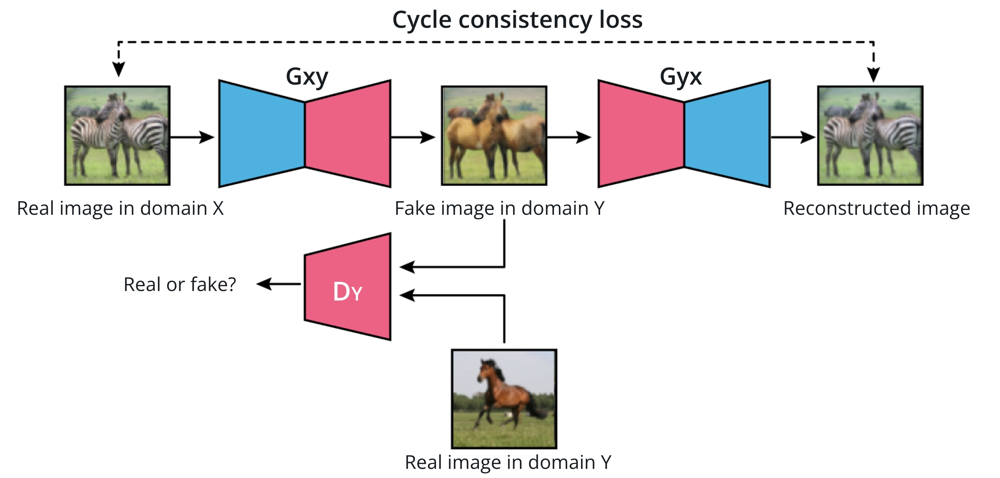

<br>
<br>

# C-4: Image to Image Translation

<br>
<br>

Image to Image Translation means using GANs to map from one type of image to another type, to create a new image. This
lesson will focus on a particular image-to-image translation architecture, known as the CycleGAN model. In this lesson
on Image to Image Translation, you will:

- Build Unpaired Images Dataloader
- Build the CycleGAN Generator
- Implement the CycleGAN Loss Function
- Train CycleGAN model

<br>

<div align="center">
<p>

</p>
<p>figure: CycleGAN Architecture</p>
</div>
<br>

Generating new data is a challenging task; however, GAN models can learn something about the underlying structure of
training data, to discern patterns that can be used to recreate images. GANs can also be applied to Image to Image
Translation. Image to Image Translation is a process that takes an input image and produces a transformed image as
output. Deep learning and computer vision applications of image to image translation include:

- Semantic Segmentation - every pixel in the input image is labeled and classified
- Translating an image into a new domain with a desired property or feature

Pix2Pix and CycleGAN are two formulations of image to image translation that learn to transform an input image into a
desired output and they can be applied to a variety of tasks.

#### Objective Loss Functions

An objective function is typically a loss function that you seek to minimize (or in some cases maximize) during training
a neural network. These are often expressed as a function that measures the difference between a prediction $\hat{y}$
and a true target $y$:

$$\mathcal{L}(y,\hat{y})$$

The objective function we've used the most in this program is cross entropy loss, which is a negative log loss applied
to the output of a softmax layer. For a binary classification problem, as in real or fake image data, we can calculate
the binary cross entropy loss as:

$$-[y\log(\hat{y}) + (1-y)\log(1-\hat{y})]$$

In other words, a sum of two log losses!

#### Latent Space

Latent means "hidden" or "concealed". In the context of neural networks, a latent space often means a feature space, and
a latent vector is just a compressed, feature-level representation of an image! For example, when you created a simple
autoencoder, the outputs that connected the encoder and decoder portion of a network made up a compressed representation
that could also be referred to as a latent vector. We can mathematically operate on vectors in vector space and with
latent vectors, we can perform a kind of feature-level transformation on an image! This manipulation of latent space has
even been used to create an interactive GAN, iGAN for interactive image generation!

#### Pix2Pix Image-to-Image Translation

## 1. Introduction

Pix2Pix is a conditional GAN (cGAN) framework for image-to-image translation tasks like:

- Sketches to photos
- Maps to satellite images
- Black & white to color
- Day to night scenes
- Edges to full images

## 2. Generator Architecture (U-Net)

### Structure:

- **Encoder-Decoder with Skip Connections**

  ```textmate
  Input Image → Encoder → Latent Space → Decoder → Output Image
        ↓         ↓                        ↑
        Skip Connections ------------------↑
  ```

### Key Components:

1. **Encoder**:

   - Downsampling blocks
   - Each block: Conv2D → BatchNorm → LeakyReLU
   - Progressively reduces spatial dimensions

2. **Decoder**:

   - Upsampling blocks
   - Each block: TransposeConv2D → BatchNorm → ReLU
   - Gradually recovers spatial dimensions

3. **Skip Connections**:
   - Connects encoder layers to decoder layers
   - Helps preserve fine details and spatial information
   - Combats information loss in bottleneck

## 3. Discriminator Architecture (PatchGAN)

### Design:

- Focuses on local image patches rather than entire image
- Classifies if each N×N patch is real or fake
- More efficient than full-image discrimination

### Structure:

```textmate
Input: Concatenated (Input Image, Output Image)
↓
Convolutional Layers (No pooling)
↓
Output: Grid of Real/Fake Predictions
```

### Features:

- Smaller receptive field
- Fewer parameters than full-image discriminator
- Better at capturing high-frequency details
- Penalizes structure at patch scale

## 4. Loss Functions

### Generator Loss:

1. **Adversarial Loss**:

   - Fool the discriminator
   - Make generated images look realistic

2. **L1 Loss**:
   - Pixel-wise difference between generated and target
   - Encourages output to match ground truth

Combined Loss = λ₁(Adversarial Loss) + λ₂(L1 Loss)

### Discriminator Loss:

- Standard GAN loss
- Binary cross-entropy for real/fake classification

## 5. Training Process

1. **Input Preparation**:

   - Paired images (source → target)
   - Normalize to [-1, 1]
   - Data augmentation if needed

2. **Training Steps**:

```textmate
For each batch:
   1. Generate fake images using G
   2. Update D using real and fake images
   3. Update G using combined loss
   4. Apply gradient penalties if needed
```

<br>

<div align="center">
<p>

</p>
<p>figure: Pix2Pix Network Structure</p>
</div>
<br>

## 6. Key Features & Improvements

1. **Conditional Input**:

   - Generator sees source image
   - Discriminator sees both source and output

2. **Noise Handling**:

   - Dropout in generator provides noise
   - Used during both training and testing

3. **Architecture Choices**:
   - No pooling layers
   - Instance normalization
   - Appropriate padding for size preservation

## 7. Common Applications

- Photo colorization
- Facade generation
- Street scene rendering
- Medical image synthesis
- Style transfer

## 8. Limitations

- Requires paired training data
- Mode collapse possible
- Limited to learned transformations
- Resolution constraints
- Training stability issues

This framework provides a powerful approach for supervised image-to-image translation tasks, with the flexibility to be
adapted for various applications.

Pix2Pix Discriminator

**Quiz Question**: Match each component of the Pix2Pix model with its function

**Answers**:

The Pix2Pix model required a paired dataloader that outputs the same observation in both domain. Using an
encoder-decoder generator and a discriminator, we can learn the mapping from one domain to another.

**Quiz Question**: Match each component of the Pix2Pix model with its function

| Component                 | Function                                                                         | Explanation                                                                                                               |
| ------------------------- | -------------------------------------------------------------------------------- | ------------------------------------------------------------------------------------------------------------------------- |
| Pix2Pix Generator         | has an encoder - decoder architecture                                            | - Uses U-Net architecture<br>- Contains skip connections<br>- Transforms input images between domains                     |
| Pix2Pix paired dataloader | outputs the same observation in both domains                                     | - Manages paired training data<br>- Ensures corresponding images from source/target domains<br>- Maintains data alignment |
| Pix2Pix discriminator     | - classifies images between the two domains<br>- classifies real from fake image | - Uses PatchGAN architecture<br>- Works on image patches<br>- Provides feedback on translation realism                    |

The table format makes it clearer to:

- Match components with functions
- See relationships between elements
- Understand the role of each part
- Get detailed explanations in an organized way

This format is especially useful for matching-type questions as it clearly shows the connections between different
elements.

1. **Pix2Pix Generator**:

- Function: "has an encoder - decoder architecture"
- Explanation: Uses U-Net architecture with encoder-decoder structure and skip connections to transform images between
  domains

2. **Pix2Pix paired dataloader**:

- Function: "outputs a the same observation in both domains"
- Explanation: Loads paired training data where each sample has corresponding images from both source and target domains

3. **Pix2Pix discriminator**:

- Functions:
  - "classifies images between the two domains"
  - "classifies real from fake image"
- Explanation: PatchGAN discriminator that:
  - Determines if image pairs are real or generated
  - Assesses if translations between domains are realistic
  - Works on patches rather than whole images

Key Points:

- Generator transforms while preserving structure
- Dataloader ensures paired training data
- Discriminator provides adversarial feedback for realistic translations

This setup enables supervised image-to-image translation by maintaining correspondence between domains through paired
data.

### CycleGANs & Unpaired Data

In practice, paired data is time-intensive and difficult to collect. In some cases, such as stylized images, paired data
is impossible to get.

With unpaired data, there is no longer the ability to look at real and fake pairs of data - but the model can be changed
to produce an output that belongs to the target domain.

Cycle Consistency Constraint uses inverse mapping to accomplish this task Many of the images in the video above are
collected in the Pix2Pix and CycleGAN Github repository developed by Jun-Yan.

### Cycle Consistency Loss

Importance of Cycle Consistency A really interesting place to check cycle consistency is in language translation.
Ideally, when you translate one word or phrase from, say, English to Spanish, if you translate it back (from Spanish to
English) you will get the same thing!

In fact, if you are interested in natural language processing, I suggest you look into this as an area of research; even
Google Translate has a tough time with this. In fact, as an exercise, I want you to see if Google Translate passes the
following cycle consistency test.

Model Shortcomings As with any new formulation, it's important not only to learn about its strengths and capabilities
but also, its weaknesses. A CycleGAN has a few shortcomings:

1. It will only show one version of a transformed output even if there are multiple, possible outputs.
2. A simple CycleGAN produces low-resolution images, though there is some research around high-resolution GANs
3. It occasionally fails!

### When to Use Image to Image Translation

One of the challenges with deep learning based solutions is the amount of required data. It takes a significant amount
effort and money to:

Capture real data Clean real data Annotate real data Alternative Data Sources Another source for data is computer
generated data or synthetic data. Synthetic data can be used to train models on tasks such as object detection or
classification.

However, because synthetic images are still quite different from real images and model performance is usually not on par
with models trained on real data.

The difference between the real and the synthetic domain is called domain gap.
