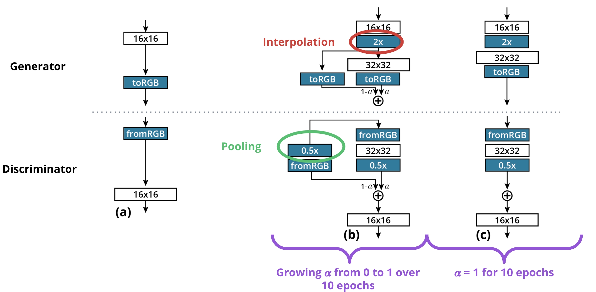
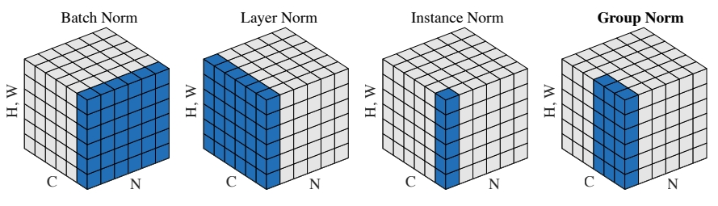
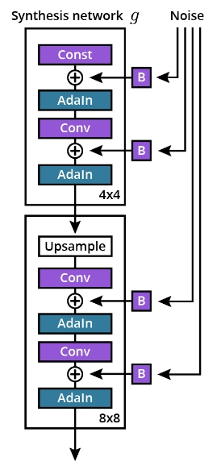
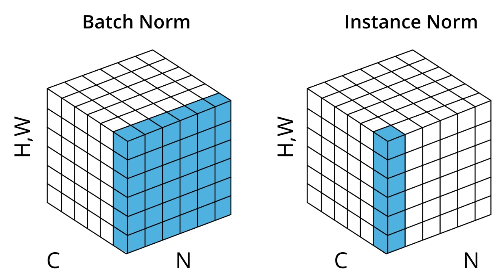

# C-4: Modern GANs

1. Advanced GAN Loss Functions

    - Limitations of Binary Cross-Entropy Loss
    - Wasserstein Distance as a Loss Function
    - Understanding Lipschitz Continuity
    - Gradient Penalty Implementation

2. Progressive Growing of GANs (ProGAN)

    - Incremental Resolution Enhancement
    - Layer Fading Methodology
    - Minibatch Discrimination Techniques
    - Normalization and Stabilization Strategies

3. StyleGAN Architecture

    - Mapping Network and Latent Space Disentanglement
    - Noise Injection for Stochastic Variation
    - Adaptive Instance Normalization (AdaIN)
    - Style Mixing and Transfer Capabilities

4. Practical Implementation Considerations
    - Choosing the Right GAN Architecture
    - Addressing Mode Collapse
    - Balancing Training Stability and Image Quality
    - Application-Specific Optimization Strategies

#### Advanced GAN Loss Functions

##### Limitations of Binary Cross-Entropy Loss

The Binary Cross-Entropy (BCE) loss function served as the foundation for the original GAN formulation, but it
introduces several significant challenges that make training unstable and often frustrating. Understanding these
limitations helps explain why researchers developed alternative loss functions for GANs.

At its core, the BCE loss creates a minimax game between the generator and discriminator:

$$\min_G \max_D V(D, G) = \mathbb{E}*{x \sim p*{data}}[\log D(x)] + \mathbb{E}_{z \sim p_z}[\log(1 - D(G(z)))]$$

This formulation leads to several problematic training dynamics. The first major issue is the vanishing gradient
problem. When the discriminator becomes too successful at its job—confidently identifying generated samples as fake—the
gradient of the loss with respect to the generator's parameters approaches zero:

$$\nabla_{\theta_G} \log(1 - D(G(z))) \approx 0 \text{ when } D(G(z)) \approx 0$$

This essentially means the generator stops receiving meaningful feedback about how to improve. It's like trying to learn
a skill when your teacher only says "that's wrong" without explaining why or how to fix it. The learning process stalls
because the generator has no direction for improvement.

To partially address this issue, many implementations use a non-saturating version of the loss where the generator tries
to maximize $\log(D(G(z)))$ instead of minimizing $\log(1 - D(G(z)))$. This provides stronger gradients when the
generator is performing poorly, but doesn't solve all the problems with BCE loss.

Another significant limitation is mode collapse. Real-world data distributions typically have multiple modes—distinct
clusters or types of examples. For instance, a dataset of handwritten digits contains ten different modes (one for each
digit). Mode collapse occurs when the generator produces only a limited subset of these modes, ignoring the full
diversity of the target distribution. This happens because BCE loss only rewards fooling the discriminator; if the
generator finds a few outputs that consistently work, it has no incentive to explore other possibilities.

<div align="center">
<p>

</p>
<p>figure: Modern GAN Architecture</p>
</div>

The instability of BCE loss also stems from its mathematical properties. When the distributions of real and generated
data have minimal overlap (as is often the case early in training), the discriminator can achieve near-perfect
separation. This creates a binary feedback signal that fluctuates dramatically as training progresses, resulting in
oscillating behavior rather than smooth convergence.

Furthermore, BCE loss doesn't provide a meaningful measure of distance between the real and generated distributions. It
only indicates whether the discriminator can distinguish between them, without quantifying how different they are. This
makes it difficult to track progress during training, as the loss values don't correlate well with the perceptual
quality of generated samples.

These limitations become especially problematic when generating high-resolution images or working with complex data
distributions. The training dynamics can lead to situations where:

1. The discriminator becomes too powerful too quickly, providing minimal guidance to the generator
2. The generator focuses on exploiting weaknesses in the discriminator rather than learning the true data distribution
3. Training becomes unstable, with performance oscillating or degrading after initial progress
4. Generated outputs lack diversity, failing to capture the full range of the target distribution

These issues motivated researchers to explore alternative loss functions that could provide more stable training
dynamics and better quality outputs. Among these alternatives, the Wasserstein distance emerged as a particularly
effective approach, addressing many of the core limitations of BCE loss.

##### Wasserstein Distance as a Loss Function

The Wasserstein distance, also known as the Earth Mover's Distance (EMD), represents a significant advancement in GAN
training methodology. Unlike BCE loss, which struggles to provide meaningful gradients when distributions have minimal
overlap, the Wasserstein distance offers a smooth measure of similarity between distributions even when they don't share
significant support.

To understand the Wasserstein distance intuitively, imagine each probability distribution as piles of earth, where the
height at each point represents the probability density. The Wasserstein distance measures the minimum amount of "work"
(earth × distance) needed to transform one pile into the other. This provides a meaningful metric even when
distributions don't overlap, as it considers how far apart they are, not just whether they're different.

Mathematically, the Wasserstein distance between two probability distributions P and Q is defined as:

$$W(P, Q) = \inf_{\gamma \in \Pi(P, Q)} \mathbb{E}_{(x,y) \sim \gamma}[||x - y||]$$

Where $\Pi(P, Q)$ is the set of all joint distributions whose marginals are P and Q. Computing this directly is
computationally intractable for high-dimensional distributions, but the Kantorovich-Rubinstein duality provides a more
practical formulation:

$$W(P, Q) = \sup_{||f||*L \leq 1} \mathbb{E}*{x \sim P}[f(x)] - \mathbb{E}_{x \sim Q}[f(x)]$$

Where the supremum is taken over all 1-Lipschitz functions f. This formulation leads directly to the Wasserstein GAN
objective:

$$\min_G \max_{C: ||C||*L \leq 1} \mathbb{E}*{x \sim p_{data}}[C(x)] - \mathbb{E}_{z \sim p_z}[C(G(z))]$$

In this formulation, the discriminator is replaced by a critic (C) that no longer classifies inputs as real or fake but
instead assigns scalar scores. The critic tries to maximize the difference between the scores assigned to real data and
generated data, while the generator tries to minimize this difference. Importantly, the critic must satisfy the
Lipschitz continuity constraint (which we'll explore in the next section).

The Wasserstein loss offers several substantial advantages over BCE:

1. **Meaningful gradients everywhere**: Even when the real and generated distributions don't overlap, the Wasserstein
   distance provides meaningful gradients that indicate how to improve the generator. This addresses the vanishing
   gradient problem that plagues standard GANs.
2. **Correlation with perceptual quality**: The Wasserstein distance correlates well with the perceived quality of
   generated samples. As the distance decreases, the generated samples typically become more realistic, providing a
   useful metric for tracking training progress.
3. **More stable training dynamics**: The smoother nature of the Wasserstein distance leads to more stable training,
   with less oscillation and mode collapse. The critic can be trained to optimality without crippling the generator,
   unlike in standard GANs where a perfect discriminator leads to vanishing gradients.
4. **Theoretical guarantees**: Under ideal conditions, minimizing the Wasserstein distance guarantees convergence to the
   true data distribution, providing stronger theoretical support than the original GAN formulation.

The practical implementation of Wasserstein GANs differs from standard GANs in several key ways:

- The critic outputs unbounded scalar values rather than probabilities, so there's no sigmoid activation at the output
- The loss functions are simpler, with no logarithms:
    - Critic loss: $\mathbb{E}[C(x)] - \mathbb{E}[C(G(z))]$
    - Generator loss: $-\mathbb{E}[C(G(z))]$
- The critic must satisfy the Lipschitz continuity constraint
- Training typically involves multiple critic updates per generator update to ensure the critic approximates the
  Wasserstein distance well

These changes result in more stable training and higher quality outputs, particularly for complex data distributions and
high-resolution images. The Wasserstein distance essentially provides a more informative and smoother "compass" that
guides the generator toward the true data distribution, even when starting from a point far from the target.

##### Understanding Lipschitz Continuity

Lipschitz continuity represents a crucial mathematical constraint in Wasserstein GANs that ensures the critic provides
meaningful and bounded feedback to the generator. This concept might initially seem abstract, but it plays a fundamental
role in the stability and effectiveness of WGAN training.

A function f is said to be K-Lipschitz continuous if there exists a real constant K ≥ 0 such that for all x₁ and x₂ in
the domain:

$$|f(x_1) - f(x_2)| \leq K|x_1 - x_2|$$

In simpler terms, this means the function cannot change too rapidly—the change in the output is bounded by K times the
change in the input. When K = 1, we call this 1-Lipschitz continuity, which is the constraint required for Wasserstein
GANs.

For the critic function C in a WGAN, the 1-Lipschitz constraint means:

$$|C(x_1) - C(x_2)| \leq |x_1 - x_2|$$

This constraint serves several essential purposes in the context of WGANs:

1. **Theoretical necessity**: The Kantorovich-Rubinstein duality, which allows the practical computation of the
   Wasserstein distance, requires the critic to be 1-Lipschitz. Without this constraint, the critic would not be
   computing a proper approximation of the Wasserstein distance.
2. **Preventing extreme gradients**: Without the Lipschitz constraint, the critic could assign arbitrarily large
   differences in scores between real and generated samples, leading to explosive gradients and unstable training.
3. **Enforcing a smooth critic landscape**: The constraint ensures that the critic's gradient with respect to its inputs
   has a norm bounded by 1, creating a smoother optimization landscape for the generator to navigate.

The 1-Lipschitz constraint can be understood geometrically as limiting the norm of the gradient of the critic function:

$$||\nabla_x C(x)||_2 \leq 1$$

This means that for any input, the gradient of the critic function cannot exceed a magnitude of 1. This constraint
ensures that small changes in the input lead to proportionally small changes in the output, preventing the critic from
creating "steep cliffs" in the function landscape that could lead to training instability.

In the original WGAN paper, the authors enforced this constraint through weight clipping—restricting all weights in the
critic network to a small range (e.g., [-0.01, 0.01]). While this approach works to some extent, it has significant
limitations:

1. Finding the appropriate clipping threshold requires careful tuning
2. Excessive clipping can cause the critic to learn oversimplified functions
3. Weight clipping can lead to vanishing or exploding gradients in deep networks
4. The constraint affects all directions equally, which may be too restrictive

The practical implementation of weight clipping involves a simple operation after each gradient update:

```python
for param in critic.parameters():
    param.data.clamp_(-c, c)  # Clip weights to range [-c, c]
```

Where `c` is the clipping threshold (typically a small value like 0.01).

However, weight clipping proved to be a somewhat crude approximation of Lipschitz continuity. It forces the critic to
learn functions that are often simpler than needed, potentially limiting its ability to approximate the Wasserstein
distance accurately. This limitation motivated the development of more sophisticated approaches to enforcing Lipschitz
continuity, most notably the gradient penalty method discussed in the next section.

Understanding Lipschitz continuity helps clarify why WGANs represent a theoretical improvement over standard GANs. By
constraining the critic to compute a proper distance metric between distributions, WGANs provide more stable and
informative training signals to the generator, allowing it to more effectively learn complex data distributions without
suffering from issues like mode collapse or vanishing gradients.

The Lipschitz constraint essentially creates a balanced playing field between the generator and critic, preventing
either from overwhelming the other while ensuring that their adversarial game leads to meaningful learning rather than
degenerate solutions or instability.

##### Gradient Penalty Implementation

The gradient penalty approach, introduced in the WGAN-GP paper, represents a more sophisticated and effective method for
enforcing the Lipschitz continuity constraint compared to weight clipping. This technique directly penalizes the
gradient norm of the critic, encouraging it to maintain 1-Lipschitz continuity without the limitations imposed by weight
clipping.

The core insight behind gradient penalty is to directly enforce the condition that the gradient norm of the critic
should be 1 for points sampled from the data distribution and the generator distribution. Since checking all possible
points is infeasible, the method samples points along straight lines between pairs of real and generated data points.
This sampling strategy is motivated by the observation that optimal critics will have gradients with norm 1 almost
everywhere along these lines.

Mathematically, the gradient penalty is formulated as:

$$\lambda \mathbb{E}*{\hat{x} \sim \mathbb{P}*{\hat{x}}}[(||\nabla_{\hat{x}} C(\hat{x})||_2 - 1)^2]$$

Where:

- $\hat{x}$ represents points sampled along straight lines between real and generated samples
- $\lambda$ is the penalty coefficient (typically set to 10)
- $||\nabla_{\hat{x}} C(\hat{x})||_2$ is the L2 norm of the gradient of the critic with respect to its input

The sampling of interpolated points follows:

$$\hat{x} = \alpha x + (1 - \alpha) G(z)$$

Where $\alpha$ is randomly sampled from a uniform distribution U[0,1] for each pair of real sample x and generated
sample G(z).

The complete WGAN-GP objective then becomes:

$$L = \mathbb{E}*{z \sim p_z}[C(G(z))] - \mathbb{E}*{x \sim p_{data}}[C(x)] + \lambda \mathbb{E}*{\hat{x} \sim \mathbb{P}*{\hat{x}}}[(||\nabla_{\hat{x}} C(\hat{x})||_2 - 1)^2]$$

For the critic to minimize, and:

$$L_G = -\mathbb{E}_{z \sim p_z}[C(G(z))]$$

For the generator to minimize.

Implementing the gradient penalty requires computing gradients of the critic's output with respect to its inputs, which
involves some specific technical considerations in deep learning frameworks. Here's how it's typically implemented in
PyTorch:

```python
def compute_gradient_penalty(critic, real_samples, fake_samples, device):
    # Random interpolation coefficient for each sample in the batch
    alpha = torch.rand(real_samples.size(0), 1, 1, 1, device=device)

    # Create interpolated samples
    interpolates = alpha * real_samples + (1 - alpha) * fake_samples
    interpolates.requires_grad_(True)  # Enable gradient computation

    # Forward pass through critic
    critic_interpolates = critic(interpolates)

    # Create dummy tensor of ones for gradient computation
    ones = torch.ones_like(critic_interpolates, device=device, requires_grad=False)

    # Compute gradients of critic output with respect to interpolated inputs
    gradients = torch.autograd.grad(
        outputs=critic_interpolates,
        inputs=interpolates,
        grad_outputs=ones,
        create_graph=True,
        retain_graph=True,
        only_inputs=True
    )[0]

    # Calculate gradient penalty: ((||∇C(x̂)||₂ - 1)²)
    gradient_penalty = ((gradients.norm(2, dim=1) - 1) ** 2).mean()

    return gradient_penalty
```

This implementation is then integrated into the critic's training loop:

```python
# Critic training iteration
for _ in range(n_critic):  # Typically 5 critic updates per generator update
    # Train with real samples
    real_output = critic(real_samples)

    # Train with fake samples
    with torch.no_grad():  # No need to compute generator gradients
        fake_samples = generator(noise)
    fake_output = critic(fake_samples)

    # Compute gradient penalty
    gp = compute_gradient_penalty(critic, real_samples, fake_samples, device)

    # Wasserstein distance estimate
    wasserstein_distance = fake_output.mean() - real_output.mean()

    # Critic loss with gradient penalty
    critic_loss = wasserstein_distance + lambda_gp * gp

    # Optimize critic
    critic_optimizer.zero_grad()
    critic_loss.backward()
    critic_optimizer.step()
```

The gradient penalty approach offers several advantages over weight clipping:

1. **More expressive critic functions**: The critic can learn more complex functions without the restrictive effect of
   weight clipping, allowing for better approximation of the Wasserstein distance.
2. **Improved stability**: Gradient penalty provides smoother training dynamics with fewer oscillations than weight
   clipping.
3. **Better performance**: WGANs with gradient penalty consistently produce higher quality outputs and show better
   convergence properties across a range of datasets and architectures.
4. **No hyperparameter search for clipping threshold**: While gradient penalty introduces its own hyperparameter
   $\lambda$, its optimal value (around 10) seems to work well across many different problems, unlike the clipping
   threshold which often requires task-specific tuning.
5. **Compatibility with normalization techniques**: Gradient penalty works well with batch normalization, layer
   normalization, and other techniques that might interact poorly with weight clipping.

One important implementation detail is that batch normalization should typically be avoided in the critic when using
gradient penalty. This is because batch normalization makes the critic's output dependent on other samples in the batch,
which complicates the gradient computation. Instance normalization or layer normalization serve as effective
alternatives.

The gradient penalty approach has become the standard method for enforcing Lipschitz continuity in Wasserstein GANs,
enabling more stable training and higher quality results across a wide range of applications. This innovation, combined
with the theoretical advantages of the Wasserstein distance, has made WGAN-GP a powerful and widely adopted framework
for generative modeling.

#### Progressive Growing of GANs (ProGAN)

##### Incremental Resolution Enhancement

Progressive Growing of GANs (ProGAN) represents a significant breakthrough in generating high-resolution images with
GANs. This approach, introduced by researchers at NVIDIA in 2017, addresses one of the fundamental challenges in GAN
training: the difficulty of directly generating high-resolution images from random noise in a stable manner.

The core insight behind ProGAN is remarkably intuitive. Rather than attempting to train a GAN to generate
high-resolution images immediately, ProGAN starts by generating low-resolution images and then gradually increases the
resolution throughout the training process. This progressive approach mimics the way an artist might create a
painting—starting with basic shapes and structure before adding finer details.

At the beginning of training, both the generator and discriminator work with tiny images, typically 4×4 or 8×8 pixels.
At this low resolution, the networks focus on learning the overall structure and basic distribution of the data. The
small image size means the networks have fewer parameters and simpler objectives, making the initial training phase more
stable and faster to converge.

<div align="center">
<p>

</p>
<p>figure: Progressive GAN Training</p>
</div>

Once the networks have reached a certain level of equilibrium at this resolution (typically measured by convergence in
the loss function or by visual quality metrics), new layers are gradually added to both the generator and discriminator.
These new layers increase the resolution of the images, for example from 8×8 to 16×16 pixels. The process continues
through several stages, commonly doubling the resolution at each step: 4×4 → 8×8 → 16×16 → 32×32 → 64×64 → 128×128 →
256×256 → 512×512 or even 1024×1024 in some implementations.

Think of this process like learning to paint portraits. You wouldn't immediately try to paint every eyelash and pore.
Instead, you'd first sketch the basic face shape, then refine the major features, and only at the end add the finest
details. ProGAN follows this same principle—first mastering the basic structure of faces (or whatever subject matter) at
low resolution before progressively adding more detail as resolution increases.

This incremental approach offers several significant advantages:

First, it creates a form of curriculum learning. The networks first master the easier task of generating low-resolution
images before tackling the more complex challenge of high-resolution details. This is analogous to how we might teach
students to solve simple problems before introducing more complex ones.

Second, it allows for more stable training dynamics. At lower resolutions, the discriminator has an easier time
distinguishing real from fake images, providing clearer feedback to the generator. As both networks improve and the
resolution increases, they maintain a balanced competition rather than one overwhelming the other. This balance is
crucial—in traditional GAN training, early instability often leads to a complete collapse of the learning process.

Third, it substantially reduces training time. Training times for GANs typically scale quadratically with image
resolution, making direct training at high resolutions prohibitively expensive. By spending most of the training time at
lower resolutions and only adding higher-resolution layers later in the process, ProGAN achieves significant efficiency
gains. In practice, this can reduce training time by an order of magnitude compared to training the full-resolution
network from scratch.

Fourth, the incremental approach allows for better feature hierarchy learning. The network naturally builds from coarse,
structural features at low resolutions to fine details at higher resolutions. This mimics how visual information is
processed in biological systems, which typically recognize shapes and structures before details.

The implementation of incremental resolution enhancement involves carefully designed architectures for both the
generator and discriminator. The generator typically starts with a fully connected layer that transforms the latent
vector into a small spatial representation (e.g., 4×4 with multiple channels). It then uses a series of upsampling and
convolutional layers to gradually increase the spatial dimensions while decreasing the channel depth.

The discriminator follows the reverse pattern, using downsampling and convolutional layers to reduce spatial dimensions
while increasing feature depth, ultimately ending with a fully connected layer that produces a single output value (real
or fake).

As new layers are added to increase resolution, special care must be taken to ensure smooth transitions. This leads us
to the concept of layer fading, which is a crucial component of ProGAN's success and will be explored in the next
section.

The progressive growing approach has enabled GANs to generate remarkably realistic high-resolution images that were
previously unattainable. It has become a foundational technique in modern GAN architectures, directly influencing
subsequent developments like StyleGAN. By addressing the core challenge of training stability at high resolutions,
ProGAN significantly expanded the practical applications of generative adversarial networks in areas requiring detailed,
high-quality image synthesis.

##### Layer Fading Methodology

Layer fading stands as one of the most innovative aspects of the ProGAN architecture, addressing a critical challenge in
progressive resolution enhancement: how to smoothly transition between different resolution stages without destabilizing
training. This methodology allows new layers to be integrated gradually, rather than abruptly, ensuring continuous
learning and stable training dynamics.

When a GAN is training at a particular resolution (let's say 16×16 pixels) and it's time to move to a higher resolution
(32×32 pixels), simply adding new layers would create a sudden change in the network's behavior. The newly added layers
have randomly initialized weights and would drastically alter the outputs, potentially destroying the delicate balance
achieved between the generator and discriminator. Layer fading provides an elegant solution to this problem.

Instead of immediately switching to the new layers, ProGAN implements a smooth transition period where the influence of
the new layers is gradually increased while the influence of the previous layers is decreased. This fading process
typically occurs over several thousand training iterations, allowing the network to adapt gradually to the higher
resolution.

<div align="center">
<p>

</p>
<p>figure: Layer Architecture</p>
</div>

To understand this concept better, imagine you're teaching someone to paint portraits in increasing detail. Rather than
suddenly asking them to paint every tiny wrinkle and pore after they've mastered the basic face structure, you might
gradually introduce more detailed techniques while still relying on their existing skills. Over time, they would shift
from broader strokes to finer details, but the transition would be smooth rather than abrupt.

The technical implementation of layer fading involves weighted connections between the old and new pathways in both the
generator and discriminator. Let's examine how this works in each network:

In the generator, when transitioning from resolution N×N to 2N×2N:

1. The existing pathway takes the N×N output and simply upsamples it to 2N×2N using a non-trainable method like
   nearest-neighbor upsampling.

2. The new pathway processes the N×N features through a new convolutional layer and upsampling to produce a 2N×2N
   output.

3. These two 2N×2N outputs are combined using a weighted sum:

    ```
    final_output = (1 - alpha) * upsampled_old_output + alpha * new_output
    ```

    Where alpha gradually increases from 0 to 1 during the fading period.

In the discriminator, the process works in reverse when transitioning from accepting 2N×2N inputs to 4N×4N:

1. The existing pathway downsizes the 4N×4N input to 2N×2N using average pooling.

2. The new pathway processes the 4N×4N input through a new convolutional layer and downsampling to produce 2N×2N
   features.

3. These two 2N×2N feature maps are combined using a weighted sum:

    ```
    combined_features = (1 - alpha) * downsized_input + alpha * new_features
    ```

    Where alpha increases from 0 to 1 during the fading period.

This fading mechanism creates several important benefits:

First, it provides stability during transitions. The network's behavior changes gradually rather than abruptly, allowing
both the generator and discriminator to adapt to the new resolution without catastrophic forgetting or training
collapse. When alpha is near zero, the new layers have minimal influence, and as alpha increases, they gradually take on
more responsibility.

Second, it allows the new layers to learn meaningful parameters before they're fully responsible for generation or
discrimination. Since they initially have only a small influence on the output (when alpha is close to 0), they can make
small adjustments without drastically changing the network's behavior. This is similar to how an apprentice might
practice new techniques with limited responsibility before taking on major work.

Third, it creates a form of knowledge transfer between resolutions. The lower-resolution knowledge is preserved and
gradually enhanced with higher-resolution details, rather than being discarded and relearned from scratch. This makes
the learning process much more efficient.

The complete training process with layer fading typically follows these steps:

1. Train the networks at the initial low resolution (e.g., 4×4) until convergence.
2. Add new layers for the next resolution (8×8) with alpha set to 0 (no influence).
3. Gradually increase alpha from 0 to 1 over a set number of iterations (the fading period).
4. Once alpha reaches 1, continue training at the current resolution until convergence.
5. Repeat steps 2-4 for each resolution increase until reaching the target resolution.

The duration of the fading period is an important hyperparameter. If it's too short, the transition may be too abrupt,
causing training instability. If it's too long, training becomes inefficient. In practice, fading periods of around
10,000 to 30,000 iterations have proven effective for most applications.

Layer fading represents a fundamental contribution to stable GAN training for high-resolution images. By enabling smooth
transitions between resolutions, it allows the networks to build upon previously learned features rather than discarding
them. This gradual approach to architectural changes has inspired similar techniques in other domains of deep learning,
demonstrating the broader applicability of this elegant solution to the challenge of evolving neural network
architectures during training.

##### Minibatch Discrimination Techniques

Minibatch discrimination represents a powerful technique in the ProGAN framework designed to combat one of the most
persistent challenges in GAN training: mode collapse. Mode collapse occurs when the generator produces only a limited
subset of possible outputs, ignoring the diversity present in the training data. This results in generated images that
may look realistic individually but lack variety as a collection.

To understand why this happens, consider what the standard GAN objective encourages. The generator only needs to fool
the discriminator, and if it finds a few types of outputs that consistently work, it has little incentive to explore
other possibilities. It's like a student who discovers they can get passing grades by memorizing just a few formulas
rather than understanding the full breadth of the subject.

The fundamental insight behind minibatch discrimination is that the discriminator should not only evaluate individual
samples in isolation but also consider the relationships between samples in a batch. By enabling the discriminator to
detect a lack of diversity across generated samples, it can provide feedback that encourages the generator to produce
more varied outputs.

In standard GAN training, the discriminator processes each image independently, making it unable to detect if the
generator is producing very similar images across different random inputs. Minibatch discrimination addresses this
limitation by allowing the discriminator to compare samples within a minibatch, detecting similarities that would
indicate mode collapse.

The original implementation of minibatch discrimination, introduced in the "Improved Techniques for Training GANs"
paper, involved a complex mechanism for comparing feature vectors between samples. ProGAN simplifies this approach with
a technique called "minibatch standard deviation," which is more computationally efficient while still providing the
benefits of cross-sample awareness.

Here's how minibatch standard deviation works in ProGAN:

1. Near the end of the discriminator network (typically after several convolutional layers have processed the input), a
   special layer is added that computes statistics across the batch dimension.
2. For each spatial location and feature, the standard deviation is calculated across all samples in the batch. This
   captures how much variation exists in each feature across different images.
3. These standard deviations are then averaged across features and spatial locations to produce a single value per
   batch.
4. This value is replicated to match the spatial dimensions of the feature maps and concatenated as an additional
   feature channel to the existing feature maps.
5. The augmented feature maps, now containing information about batch diversity, continue through the rest of the
   discriminator network.

In pseudocode, this process looks like:

```python
def minibatch_stddev_layer(x, group_size=4):
    # x has shape [batch_size, num_features, height, width]

    # Split batch into groups
    group_size = min(group_size, batch_size)
    y = x.reshape(group_size, -1, num_features, height, width)

    # Calculate standard deviation over group dimension
    y = y - y.mean(dim=0, keepdim=True)  # Subtract mean
    y = (y**2).mean(dim=0)  # Calculate variance
    y = torch.sqrt(y + 1e-8)  # Calculate standard deviation

    # Average over all features and spatial locations
    y = y.mean(dim=[1, 2, 3], keepdim=True)  # Single value per group

    # Replicate across all spatial locations
    y = y.repeat(group_size, 1, height, width)

    # Concatenate to input as new feature map
    return torch.cat([x, y], dim=1)
```

This mechanism has several important effects on GAN training:

First, it enables the discriminator to detect when the generator is producing samples with low diversity. If multiple
generated images in a batch are very similar, the computed standard deviation will be low, signaling to the
discriminator that these might be fake images from a collapsed generator. This works because real data batches typically
have higher variation across samples.

Second, it creates pressure for the generator to produce diverse outputs. To fool the discriminator, the generator must
now produce batches of images with similar statistical diversity to real data batches, encouraging exploration of the
full data distribution. The generator learns that creating varied outputs is just as important as creating realistic
individual images.

Third, it helps prevent the discriminator from focusing too much on specific features or patterns, which can lead to
overfitting. By considering batch-level statistics, the discriminator develops a more holistic understanding of what
makes images realistic.

The implementation of minibatch standard deviation is particularly elegant because it adds minimal computational
overhead while significantly improving training dynamics. It requires no additional parameters except for the channel
concatenation, making it an efficient addition to the architecture.

In practice, minibatch discrimination has proven highly effective at reducing mode collapse, especially when combined
with the progressive growing approach. The diversity of generated images improves noticeably, with the generator
capturing a wider range of the data distribution. This is particularly important for datasets with significant
variation, such as human faces with different ages, ethnicities, expressions, and accessories.

To understand the impact visually, imagine generating faces without minibatch discrimination—you might get realistic
faces, but they could all be young people with neutral expressions and similar features. With minibatch discrimination,
the generator is encouraged to produce a variety of ages, expressions, and features that better represents the full
diversity of human faces.

The concept of incorporating batch-level statistics into discriminator decisions has influenced subsequent GAN
architectures beyond ProGAN. By addressing the fundamental challenge of mode collapse, minibatch discrimination
techniques have helped make GANs more practical for applications requiring diverse and representative outputs, from
dataset augmentation to creative content generation.

##### Normalization and Stabilization Strategies

Beyond progressive growing and minibatch discrimination, ProGAN introduces several innovative normalization and
stabilization strategies that collectively transform GAN training from a notoriously unstable process into a more
reliable one. These techniques address different aspects of the training dynamics, creating a robust framework for
high-quality image generation.

<div align="center">
<p>

</p>
<p>figure: Group Normalization Process</p>
</div>

**Pixelwise Normalization**

One of the key innovations in ProGAN is pixelwise normalization, which prevents the escalation of feature magnitudes
during training. Unlike batch normalization, which normalizes across the batch dimension, pixelwise normalization
operates within each feature map individually:

For each pixel in a feature map, the normalization is applied across all channels (features) for that specific spatial
location:

$$b_{x,y} = \frac{a_{x,y}}{\sqrt{\frac{1}{N} \sum_{j=0}^{N-1} (a_{x,y}^j)^2 + \epsilon}}$$

Where:

- $a_{x,y}$ is the original vector of feature values at spatial location (x,y)
- $b_{x,y}$ is the normalized vector
- $N$ is the number of features (channels)
- $\epsilon$ is a small constant (typically 10^-8) to prevent division by zero

This normalization prevents any feature from becoming excessively dominant, ensuring that the generator doesn't exploit
specific features to fool the discriminator while ignoring others. It's particularly effective at preventing "feature
competition," where some features grow increasingly large while others are neglected.

Think of pixelwise normalization as ensuring balanced development of all aspects of the generated images. Without it,
the network might focus excessively on generating certain features (like eyes or hair in face generation) while
neglecting others, leading to unrealistic images. Pixelwise normalization keeps all features developing at a reasonable
pace.

In the generator, pixelwise normalization is typically applied after each convolutional layer, helping maintain balanced
feature activations throughout the network. This creates a more stable training environment and prevents the "runaway"
feature magnitudes that can occur in GANs without proper normalization.

**Equalized Learning Rate**

Another crucial stabilization technique in ProGAN is the equalized learning rate. This addresses a subtle but
significant issue in deep networks: different layers naturally tend to learn at different speeds based on their
initialization and position in the network.

The equalized learning rate technique ensures that all layers in the network have the same dynamic range and effective
learning rate by:

1. Initializing the weights from a normal distribution with a mean of 0 and variance of 1
2. Scaling the weights at runtime by a layer-specific constant based on the number of input connections
3. Absorbing any explicit weight scaling into the learning rate

The mathematical implementation involves scaling the weights during the forward pass:

$$\hat{w} = w \cdot \frac{c}{\sqrt{N}}$$

Where:

- $w$ is the stored weight value
- $N$ is the number of input features
- $c$ is a scaling constant (typically 1.0)
- $\hat{w}$ is the effective weight used during the forward pass

This technique eliminates the need for careful weight initialization schemes and ensures that all layers learn at
approximately the same rate, preventing some layers from dominating the training process while others barely update.
It's particularly valuable in the context of progressive growing, where new layers are continuously being added to the
network.

To understand the importance of equalized learning rates, imagine training a team where some members learn very quickly
while others learn slowly. The fast learners might dominate the process, while the slow learners never get a chance to
develop their skills. Equalized learning rates ensure that all parts of the network have a fair opportunity to learn,
resulting in more balanced and effective training.

**Historical Averaging**

ProGAN also employs a technique called historical averaging to stabilize training. This approach maintains a running
average of model parameters over time and penalizes the current parameters for deviating too far from this average:

$$L_{hist} = ||θ - \frac{1}{t}\sum_{i=0}^{t-1}θ_{i}||^2$$

Where:

- $θ$ is the current set of model parameters
- $θ_i$ are the historical parameters at iteration i
- $t$ is the current iteration

This regularization term discourages rapid oscillations in the model parameters, promoting more stable convergence. It's
particularly effective at dampening the adversarial "cat and mouse" dynamics that can occur in GAN training, where the
generator and discriminator might cycle through the same patterns repeatedly rather than making consistent progress.

Historical averaging functions like a stabilizing influence that prevents the training process from making dramatic,
possibly harmful changes. It's similar to how experienced mentors might temper the extreme ideas of newcomers by
providing context and historical perspective, guiding development in a more measured, stable direction.

**Adaptive Parameter Blending**

During the critical phase when new layers are being faded in, ProGAN implements adaptive parameter blending to ensure
smooth transitions. This technique adjusts the learning rates and momentum parameters for the newly added layers based
on their current contribution to the output:

When alpha (the fading parameter) is close to 0, the new layers' parameters are updated more aggressively since changes
have minimal impact on the overall output. As alpha increases and the new layers gain more influence, their learning
rates are gradually reduced to standard levels, preventing destabilization.

This adaptive approach ensures that new layers can learn efficiently when they're first introduced without risking
training collapse as they become more influential. It's like giving newcomers to a team more freedom to experiment when
their influence is limited, then gradually applying the same standards as they take on more responsibility.

**Multi-Scale Statistical Feedback**

Building on the concept of minibatch discrimination, ProGAN includes mechanisms for the discriminator to assess the
statistical properties of generated images at multiple scales. This helps ensure that the generator produces images with
realistic statistics not just at the pixel level but also in terms of local textures, shapes, and global structure.

The discriminator architecture is designed to extract and evaluate features at multiple resolutions, providing
comprehensive feedback to the generator about which aspects of the generated images match or differ from real data
statistics. This multi-scale approach ensures that realism is maintained across all levels of detail, from broad
structures to fine textures.

**Combined Impact and Practical Implementation**

The combination of these normalization and stabilization strategies creates a remarkably robust training framework.
While each technique addresses a specific aspect of GAN training instability, their collective effect is greater than
the sum of parts, enabling ProGAN to generate higher resolution images with better quality than previous approaches.

In practical implementation, these techniques require minimal computational overhead while providing substantial
benefits:

- Pixelwise normalization adds only a few operations per pixel
- Equalized learning rate is essentially free, requiring only a runtime scaling factor
- Historical averaging requires maintaining parameter averages but has minimal impact on forward or backward passes
- Adaptive parameter blending simply adjusts existing optimization parameters based on the fading coefficient

Together, these techniques transform GAN training from a process that often requires extensive hyperparameter tuning and
multiple restart attempts into a more deterministic and reliable procedure. This reliability has been crucial for the
adoption of GANs in production environments where consistent results are essential.

These normalization and stabilization strategies pioneered in ProGAN have influenced subsequent GAN architectures,
including StyleGAN, and have become standard practices in the field of generative modeling. By addressing the
fundamental challenges of GAN training stability, these techniques have expanded the practical applications of
generative adversarial networks across numerous domains requiring high-quality image synthesis.

#### StyleGAN Architecture

##### Mapping Network and Latent Space Disentanglement

StyleGAN, introduced by NVIDIA researchers in 2018, represents a fundamental reimagining of GAN architecture that
addresses one of the most persistent challenges in generative modeling: how to create controllable, disentangled
representations. At the heart of this innovation is the mapping network, a seemingly simple addition that profoundly
transforms how GANs generate images and how we can control this generation process.

In traditional GAN architectures, the generator directly transforms a random latent vector (z) into an image. This
approach creates a direct mapping between points in the latent space and generated outputs. While functional, this
direct mapping suffers from entanglement—changing one dimension of the latent vector typically affects multiple visual
features simultaneously in unpredictable ways. For example, when generating faces, moving along one dimension of the
latent space might simultaneously affect hair color, face shape, and expression rather than controlling a single
attribute.

To understand why this happens, consider the nature of the initial latent space. When we sample a random vector z from a
normal distribution, each dimension is independent. However, real-world visual attributes are rarely
independent—attributes like age and skin texture are naturally correlated. When directly mapping from the independent
dimensions of z to these correlated features, the generator must learn complex, non-linear transformations that often
lead to entangled representations.

<div align="center">
<p>

</p>
<p>figure: StyleGAN Architecture</p>
</div>

StyleGAN's fundamental innovation begins with separating the initial random input from the generation process through an
intermediate mapping network. Rather than feeding the random latent vector z directly into the generator, StyleGAN first
passes it through a sequence of fully connected layers to produce an intermediate latent vector w:

```
z (random latent vector) → Mapping Network → w (intermediate latent vector)
```

The mapping network is a relatively simple architecture—typically 8 fully connected layers with LeakyReLU activations.
Despite this simplicity, it serves a crucial function in reshaping the latent space. It transforms the standard normal
distribution of z into an intermediate latent space whose geometry better matches the underlying structure of the data.

This transformation enables what researchers call "disentanglement"—the separation of different visual attributes into
distinct, independently controllable dimensions in the latent space. The mapping network learns a non-linear
transformation from z to w that better aligns with the natural correlations in the data. It's like translating from a
language where words have rigid, independent meanings to one where related concepts can be expressed with more nuance
and appropriate interconnections.

One way to visualize this is to imagine the mapping network as "warping" the simple spherical distribution of z into a
more complex shape that better matches the inherent structure of the data manifold. In this warped space, moving in
certain directions tends to affect specific semantic attributes more predictably.

<div align="center">
<p>

</p>
<p>figure: Mapping Network Structure</p>
</div>

The effectiveness of this approach is evident in StyleGAN's ability to perform controlled image manipulation. By
identifying specific directions in the w space, we can adjust particular attributes while leaving others relatively
unchanged—something nearly impossible with the direct z-to-image mapping of traditional GANs. Researchers have
identified directions in the StyleGAN latent space that control age, gender, smile, glasses, and many other facial
attributes in a relatively isolated manner.

Another significant advantage of the mapping network appears in interpolation. When interpolating between two points in
the original z space and generating images, the transitions often show unrealistic intermediate states or abrupt
changes. In contrast, interpolation in the w space tends to produce much more natural, smooth transitions between
images, suggesting that the w space better captures the continuous nature of the visual data manifold.

The mapping network also helps prevent "feature entanglement" across different scales of the image. In StyleGAN, the
intermediate latent vector w isn't fed into the generator all at once. Instead, different copies of w control different
resolutions of the generation process through style modulation (which we'll explore in the AdaIN section). This
multi-scale control allows for even finer disentanglement, where coarse features (like face shape or pose) and fine
features (like skin texture or hair strands) can be controlled independently.

The mathematical principles behind why the mapping network promotes disentanglement are complex and still an active area
of research. However, empirical results clearly demonstrate its effectiveness. By transforming the simple, spherical
distribution of the initial latent space into a more structured intermediate representation, the mapping network
fundamentally changes how we can interact with and control generative models. This architectural innovation has enabled
unprecedented levels of control in image generation and editing, making StyleGAN not just a technical achievement but a
transformative tool for creative applications.

<div align="center">
<p>

</p>
<p>figure: Feature Entanglement Visualization</p>
</div>

##### Noise Injection for Stochastic Variation

One of StyleGAN's most innovative contributions is its approach to handling stochastic details in generated images. In
the real world, many visual elements contain random variations that don't affect the overall identity or structure of
what we're seeing. Think of how individual strands of hair might fall differently each time you take a photo of the same
person, or how skin pores and subtle texture patterns vary randomly across a face without changing who that person is.

Traditional GAN architectures struggle to capture this balance between consistent structure and random variation. They
either produce images with unrealistic uniformity (lacking natural randomness) or introduce uncontrolled variation that
affects both global structure and local details. StyleGAN addresses this limitation through its strategic noise
injection mechanism.

The core insight behind StyleGAN's noise injection is the separation of content and stochastic variation. Rather than
relying solely on the latent vector to control every aspect of the generated image, StyleGAN explicitly injects random
noise at multiple points in the generation process. This allows the network to learn which aspects of the image should
be controlled by the structured latent representation and which aspects should incorporate randomness.

<div align="center">
<p>

</p>
<p>figure: Noise Injection Process</p>
</div>

How does noise injection work in practice? At each resolution level in the generator, after each convolutional layer,
StyleGAN adds a layer of random noise. This noise is implemented as a single-channel random pattern (drawn from a
standard normal distribution) that gets scaled by learned per-feature scaling factors before being added to the
activations:

```
feature_maps = conv_layer(previous_activations)
scaled_noise = random_noise * learned_scale_factors
feature_maps = feature_maps + scaled_noise
```

The crucial aspect is that these scaling factors are learned during training. If a particular feature doesn't benefit
from stochasticity, the corresponding scale factor will become very small or zero, effectively turning off noise for
that feature. Conversely, features that naturally contain random variation will develop larger scale factors, allowing
the noise to influence those specific aspects.

This approach creates a natural separation between:

1. **Structural content**: Controlled by the latent representation through the style modulation (AdaIN) layers
2. **Stochastic details**: Influenced by the per-layer noise injection

To understand this benefit, imagine generating two images of the same person. Without noise injection, you might get
identical twins with every hair exactly the same. With noise injection, you get the same person but with natural
variations in hair arrangement, skin texture, and other fine details—just as you would see in two different photographs
of the same individual.

Let's consider the mathematical details of how noise is injected. For a given layer with feature maps F, the noise
injection can be represented as:

$$F'*{i,j,k} = F*{i,j,k} + \psi_i \cdot N_{j,k}$$

Where:

- F represents the original feature maps (after convolution)
- F' represents the feature maps after noise addition
- i is the feature channel index
- j,k are the spatial coordinates
- ψ represents the learned per-channel scaling factors
- N is the random noise (same across all channels but different for each spatial position)

This formulation shows that the same spatial noise pattern is applied to all feature channels, but with different
scaling factors for each channel. This allows the network to learn which features benefit from stochasticity and to what
degree.

The noise injection occurs at multiple resolutions throughout the generator, allowing different scales of stochastic
variation. Noise added at early, low-resolution layers affects broader patterns, while noise added at later,
high-resolution layers influences finer details. This multi-scale approach creates a natural hierarchy of randomness
that matches how visual variation appears in the real world.

The effectiveness of this approach is particularly evident in generating natural textures like hair, skin, grass, or
fabric. These elements contain complex patterns that aren't completely random but also aren't rigidly structured.
StyleGAN's noise injection provides just the right balance of control and variation to generate these textures
realistically.

Beyond its role in generating realistic textures, the noise injection mechanism offers practical benefits for creative
applications. Artists and designers using StyleGAN can now separately control the structural elements and stochastic
details of generated images. For example, when generating a portrait, one could keep the person's identity fixed while
exploring different variations of hair styling or skin texture simply by changing the noise inputs.

The noise injection technique has proven so effective that it has been adopted and refined in subsequent GAN
architectures. By explicitly modeling the distinction between structured content and random variation, StyleGAN's noise
injection mechanism represents a significant advancement in our ability to generate realistic images with the right
balance of consistency and natural randomness.

##### Adaptive Instance Normalization (AdaIN)

Adaptive Instance Normalization (AdaIN) forms the critical bridge between StyleGAN's intermediate latent space and the
actual generation process. This innovative technique enables the architecture to inject style information at multiple
resolution levels, creating a powerful mechanism for controlling both coarse and fine features in generated images.

To understand AdaIN, we need to first understand what instance normalization does. Standard instance normalization takes
each feature map in a convolutional network and normalizes it independently:

$$\text{IN}(x_i) = \gamma \cdot \frac{x_i - \mu(x_i)}{\sigma(x_i)} + \beta$$

Where:

- $x_i$ is the $i$-th feature map
- $\mu(x_i)$ and $\sigma(x_i)$ are the mean and standard deviation computed across the spatial dimensions of $x_i$
- $\gamma$ and $\beta$ are learnable scale and bias parameters

This normalization removes the original mean and variance of each feature map, neutralizing the "style" information they
contain. In standard networks, the $\gamma$ and $\beta$ parameters are learned constants that apply the same
transformation to all inputs.

What makes AdaIN "adaptive" is that instead of using fixed, learned parameters for $\gamma$ and $\beta$, these scaling
and bias factors are dynamically generated from the intermediate latent vector w:

$$\text{AdaIN}(x_i, y) = y_{s,i} \cdot \frac{x_i - \mu(x_i)}{\sigma(x_i)} + y_{b,i}$$

Where:

- $y_{s,i}$ and $y_{b,i}$ are the style scaling and bias for the $i$-th feature map
- These style parameters are computed from the latent vector w through specialized fully connected layers

This is similar to how an artist might apply different stylistic approaches to different aspects of a painting. Rather
than having fixed stylistic rules, the artist adapts their techniques based on the specific effect they want to achieve.

The brilliance of this approach is that it effectively decouples normalization from style application. First, the
feature maps are normalized to remove their original style information. Then, new style information is injected through
the adaptive parameters derived from the latent vector. This creates a clean mechanism for controlling style across
different levels of the generator.

<div align="center">
<p>

</p>
<p>figure: Normalization Layer Structure</p>
</div>

In StyleGAN's generator, the AdaIN operation occurs after each convolutional layer. The process follows these steps:

1. Apply a convolutional operation to the previous layer's activations
2. Normalize each feature map to zero mean and unit variance (instance normalization)
3. Transform the latent vector w into style scaling and bias parameters using specialized fully connected layers
4. Apply these style parameters to modulate the normalized feature maps
5. Add random noise (as discussed in the previous section)
6. Apply a non-linear activation function

This sequence is repeated at each resolution level of the generator, from the lowest (e.g., 4×4) to the highest (e.g.,
1024×1024). The latent vector w influences each level, but through different sets of style parameters, allowing for
scale-specific control.

The beauty of this design is how it naturally separates different aspects of the generation process:

1. **Content structure**: Determined by the earlier layers and coarse-level AdaIN operations
2. **Style and appearance**: Controlled by the style parameters across all levels
3. **Stochastic details**: Managed by the noise injection mechanism

The multi-resolution aspect of AdaIN in StyleGAN is particularly important. Styles applied at different resolutions
control different aspects of the generated image:

- Low-resolution styles (4×4 to 8×8): Control pose, general face shape, and overall composition
- Mid-resolution styles (16×16 to 32×32): Affect facial features, hair style, and expression
- High-resolution styles (64×64 and up): Determine fine details like skin texture, hair strands, and lighting effects

This multi-scale control creates a hierarchical representation that mirrors how we naturally perceive images—from
overall structure to fine details. It's similar to how an artist might first sketch the basic composition, then define
the major forms, and finally add detailed textures and highlights.

From a mathematical perspective, AdaIN performs a form of feature-wise modulation that can be seen as controlling the
distribution of features throughout the generator. After normalization removes the original mean and variance, the style
parameters reintroduce a specific, controlled distribution determined by the latent vector. This statistical control is
why AdaIN is so effective at transferring style characteristics.

AdaIN's heritage traces back to style transfer research, particularly the work on arbitrary style transfer using
adaptive instance normalization. StyleGAN adapted and refined this technique, integrating it deeply into the generative
process rather than using it as a post-processing step. This integration allows style to influence the generation from
the beginning rather than being applied to an already-formed image.

By replacing direct generation with style modulation through AdaIN, StyleGAN created a more controllable and
interpretable generative process. This architectural innovation enables more detailed manipulation of generated content,
opening new possibilities for creative applications and advancing our understanding of how to structure generative
models for fine-grained control.

##### Style Mixing and Transfer Capabilities

Style mixing represents one of the most remarkable capabilities enabled by StyleGAN's architecture, allowing
unprecedented control over the generation process and opening new creative possibilities for image synthesis. This
feature leverages the multi-resolution style injection mechanism to combine characteristics from different latent
vectors, creating hybrid images that blend attributes in controlled and predictable ways.

The fundamental insight behind style mixing is that different resolution levels in StyleGAN control different aspects of
the generated image. By applying the styles from different latent vectors at different resolution levels, we can create
images that combine characteristics in ways impossible with traditional GANs. This capability emerges naturally from
StyleGAN's architecture rather than requiring any additional mechanisms.

To understand how powerful this is, imagine you're creating portraits. Traditional GANs would only let you generate
complete faces from scratch. With style mixing, you could take the overall face shape and structure from one person, the
hair and eye color from another, and the fine details like skin texture from a third. This level of controlled blending
was simply not possible with earlier GAN architectures.

To implement style mixing, the process works as follows:

1. Generate two different latent vectors, w₁ and w₂, using the mapping network
2. Use w₁ to provide styles for certain resolution levels (e.g., coarse levels 4×4 to 8×8)
3. Use w₂ to provide styles for the remaining resolution levels (e.g., medium and fine levels 16×16 to 1024×1024)
4. Generate the image using this mixed style input

The result is an image that combines structural elements from the first latent vector with stylistic details from the
second. For example, when generating faces, this might create an image with the pose and face shape of one person but
the hair style, skin tone, and expression of another.

Style mixing can be applied with different splitting points between the resolution levels:

- **Coarse styles only (4×4 to 8×8)**: Transferring only the coarse styles from w₁ and using w₂ for everything else
  results in images that share the same general pose and face structure but differ in all other aspects. This is similar
  to having two different people strike the same pose.
- **Coarse and middle styles (4×4 to 32×32)**: This configuration transfers more characteristics from w₁, including
  facial features and expressions, while still taking fine details like skin texture and hair strands from w₂. The
  result might look like the same person with different makeup, lighting, or minor variations.
- **Fine styles only (64×64 and up)**: Using w₁ for all except the highest resolutions creates images that are
  essentially the same person but with different fine details and textures. This is like taking the same portrait but
  processing it with different photo filters that affect texture and fine details.

Beyond its creative applications, style mixing serves an important purpose during training as a regularization
technique. The StyleGAN authors introduced a "mixing regularization" where style mixing is randomly applied during
training. This prevents the network from assuming that adjacent style levels are correlated, encouraging better
disentanglement between different resolution levels.

The training procedure randomly decides, for each batch, whether to:

1. Use the same latent vector for all style levels (60% of batches)
2. Use two different latent vectors split at a random point (40% of batches)

This regularization ensures that the network doesn't learn to expect consistent styles across different resolutions,
improving its ability to perform controlled style mixing during inference. It's like teaching an artist to handle
situations where different aspects of a portrait might need to be rendered in different styles, rather than always
applying a single coherent style to everything.

Style mixing reveals one of the most profound aspects of StyleGAN's architecture: it doesn't just generate images; it
learns a decomposition of the image generation process into different levels of abstraction. This decomposition aligns
remarkably well with how humans perceive and describe images, from overall composition to specific details.

The effectiveness of style mixing extends beyond mere technical capability—it provides insight into how visual
information can be structured hierarchically. By separating generation into distinct resolution-based style controls,
StyleGAN implicitly learns a form of semantic factorization of the image space, where different visual attributes
naturally align with different resolution levels.

This factorization enables more sophisticated applications of style transfer compared to earlier approaches. Traditional
style transfer methods typically worked at a single scale, attempting to transfer all aspects of style simultaneously.
StyleGAN's multi-resolution approach allows for more nuanced transfers where only certain aspects of style are applied
while preserving others from the original.

In practical applications, style mixing has enabled numerous creative tools:

- Portrait editing applications that can maintain identity while changing attributes like age, expression, or hair style
- Design tools that combine elements from different sources in controlled ways
- Animation systems that smoothly interpolate between different styles at specific resolutions

The capability has also proven valuable for dataset augmentation, allowing researchers to create diverse variations of
training data by mixing styles from different examples. This can help address bias in datasets by generating more
diverse samples that maintain certain characteristics while varying others.

From a technical perspective, style mixing requires no additional training or fine-tuning—it's an inherent capability of
the StyleGAN architecture due to its style-based design. This makes it particularly valuable as a "free" feature that
emerges from the architectural choices rather than requiring explicit optimization.

The style mixing capability has been further refined in subsequent versions. StyleGAN2 improved the quality of mixed
results by addressing some artifacts in the original implementation, and StyleGAN3 enhanced the spatial consistency of
transferred styles, particularly for animation applications.

By enabling controlled combinations of attributes from different sources, style mixing represents one of the most
powerful demonstrations of StyleGAN's contribution to generative modeling. It transforms generation from a black-box
process to a controllable, interpretable one where specific aspects of the output can be selectively determined. This
level of control marks a significant step toward generative models that serve not just as autonomous image creators but
as sophisticated tools for human-guided creative expression.

<div align="center">
<p>

</p>
<p>figure: Adaptive Instance Normalization</p>
</div>

#### Practical Implementation Considerations

##### Choosing the Right GAN Architecture

Selecting the appropriate GAN architecture is a critical decision that significantly impacts the success of your
generative modeling project. With the rapid evolution of GAN architectures over the years, practitioners face important
tradeoffs between complexity, training requirements, and output quality.

When choosing a GAN architecture, begin by carefully assessing your project requirements and constraints. The resolution
of your target images should be one of your primary considerations. For lower-resolution images (32×32 or 64×64),
simpler architectures like DCGAN often provide a good balance between quality and training efficiency. These
architectures require fewer computational resources and can converge relatively quickly while still producing decent
results for smaller images.

As your target resolution increases, the complexity of the modeling challenge grows substantially. Think of it like
building increasingly detailed sculptures – small figurines might require basic tools, but life-sized statues demand
specialized equipment and techniques. For medium-resolution images (128×128 or 256×256), more sophisticated
architectures like WGAN-GP or ProGAN become necessary. These models incorporate additional stability mechanisms that
help maintain coherent structure across larger spatial dimensions. The progressive growing approach in ProGAN is
particularly valuable for resolutions in this range, as it establishes stable low-resolution features before gradually
adding higher-resolution details.

For high-resolution generation (512×512 or 1024×1024), state-of-the-art architectures like StyleGAN become practically
essential. The separation of global structure and local details, coupled with the hierarchical style injection
mechanism, enables StyleGAN to maintain coherence across large images in ways that simpler architectures cannot achieve
reliably. However, this capability comes with significantly increased computational requirements and longer training
times – often requiring multiple high-end GPUs and days or weeks of training.

Your dataset size and characteristics should also heavily influence your architectural choice. With smaller datasets (a
few thousand images), architectures with strong regularization and stability features like WGAN-GP may perform better
than more complex models that could overfit. This is similar to how simpler statistical models often outperform complex
neural networks when training data is limited. Conversely, with very large datasets (tens of thousands of images or
more), the advanced capabilities of models like StyleGAN can be fully leveraged without as much concern for overfitting.

The diversity and complexity of your training data represents another important consideration. For datasets with
significant variation (such as diverse human faces across different ages, ethnicities, and styles), architectures with
better mode coverage capabilities like StyleGAN are preferable. Its mapping network and style-based generation help
capture the full diversity of the data distribution. For more constrained domains with less variation (such as a
specific type of medical image), simpler architectures might perform adequately while requiring less training data and
computation.

Available computational resources inevitably constrain your choices. Training a full StyleGAN model at 1024×1024
resolution typically requires multiple high-end GPUs for several days or even weeks, depending on dataset size. If your
resources are limited, consider starting with a simpler architecture or reducing your target resolution. Alternatively,
you might explore transfer learning approaches, fine-tuning a pre-trained model on your specific domain rather than
training from scratch.

The specific application requirements also matter significantly. If interpretability and control are important—such as
being able to manipulate specific attributes in the generated images—architectures with more structured latent spaces
like StyleGAN offer significant advantages. Its disentangled representation allows for semantic manipulation of specific
attributes like age, lighting, or expression. If your primary goal is simply to generate diverse samples without
fine-grained control, simpler architectures might suffice.

A practical approach that many researchers and practitioners adopt is to start with the simplest architecture that might
reasonably solve the problem and progressively move to more complex architectures if needed:

1. Begin with DCGAN for an initial assessment of the problem – it's simple, fast to train, and gives a good baseline
2. If facing stability issues or mode collapse, transition to WGAN-GP for its improved training dynamics
3. For higher resolutions, consider ProGAN with its progressive growing methodology
4. For maximum quality and control, especially at high resolutions, use StyleGAN or its successors

This progressive approach allows you to gain insights about your specific dataset and generation task with relatively
quick experiments before committing to the more computationally intensive architectures. It's like starting with a rough
sketch before deciding to create a detailed painting – you can learn important information about composition and
structure without investing the time needed for a fully rendered work.

Implementation complexity represents another practical consideration. DCGAN and WGAN implementations are relatively
straightforward and widely available across deep learning frameworks. ProGAN introduces additional complexity with its
progressive growing scheme. StyleGAN incorporates numerous sophisticated components that require careful implementation.
Using established implementations from reputable sources (like the official NVIDIA implementations for ProGAN and
StyleGAN) can save considerable development time and avoid subtle bugs.

Finally, consider the maturity and community support for different architectures. More established architectures
typically have better documentation, more example implementations, and larger communities that can provide assistance
when issues arise. This support ecosystem can significantly impact development efficiency, especially when working with
complex architectures like StyleGAN.

By carefully evaluating these factors in the context of your specific project requirements, you can select a GAN
architecture that balances quality, training efficiency, and implementation complexity appropriately for your needs.
Remember that the "best" architecture isn't necessarily the most advanced one, but rather the one that most effectively
addresses your particular constraints and objectives.

##### Addressing Mode Collapse

Mode collapse represents one of the most persistent and frustrating challenges in GAN training. It occurs when the
generator produces only a limited subset of possible outputs rather than capturing the full diversity of the target
distribution. In practical terms, you might notice your GAN generating very similar images regardless of different
random inputs.

To understand why mode collapse happens, we need to consider the adversarial dynamics between the generator and
discriminator. In standard GAN training, the generator is rewarded for producing samples that fool the discriminator. If
the generator discovers a particular type of output that consistently succeeds in fooling the discriminator, it has
little incentive to explore other modes of the data distribution. It's similar to a student who discovers that a
particular answer consistently satisfies a teacher, so they keep repeating that answer regardless of the question.

Several factors contribute to mode collapse. The minimax formulation of the original GAN objective function doesn't
explicitly encourage diversity; it only rewards fooling the discriminator. Additionally, the non-convex nature of the
optimization problem and the complex dynamics between two simultaneously trained networks create an environment where
mode collapse can easily emerge. The training process can get stuck in local optima where the generator produces a
limited variety of outputs that the discriminator struggles to reject.

Fortunately, researchers have developed numerous techniques to address this challenge. When implementing GANs, consider
incorporating these approaches to mitigate mode collapse:

**Modified Loss Functions**: The choice of loss function significantly impacts mode coverage. Wasserstein GANs (WGANs)
with gradient penalty provide more stable gradients and better mode coverage than the original GAN formulation. The
Wasserstein distance measures distributional similarity in a way that better encourages the generator to cover the full
data distribution rather than just finding a few modes that fool the discriminator.

When implementing WGAN, you'll need to:

1. Remove the sigmoid activation from the discriminator's output layer
2. Use a linear loss function rather than binary cross-entropy
3. Enforce the Lipschitz constraint through gradient penalty or weight clipping
4. Use multiple discriminator updates per generator update

The improved training dynamics of WGAN help prevent the generator from getting stuck in a small subset of modes.

**Minibatch Discrimination**: This technique, incorporated in ProGAN, allows the discriminator to compare samples within
a batch rather than evaluating each sample in isolation. By detecting a lack of diversity across samples, the
discriminator can penalize the generator for producing too similar outputs.

As we explored earlier, the minibatch standard deviation layer adds minimal computational overhead while significantly
improving diversity. It works by calculating standard deviation statistics across the batch dimension and incorporating
this information into the discriminator's decision process. This effectively creates a direct signal that tells the
generator "you're producing too many similar images," guiding it toward greater diversity.

**Unrolled GANs**: This approach improves training dynamics by having the generator optimize against a discriminator
that has been updated several steps into the future. By "unrolling" the discriminator updates, the generator can better
anticipate and counteract the discriminator's responses, leading to more stable training and better mode coverage.

When implementing unrolled GANs, you:

1. Simulate multiple steps of discriminator updates during the generator's optimization
2. Compute the generator's loss with respect to these simulated future discriminator states
3. Backpropagate through this unrolled discriminator to update the generator

This technique helps the generator avoid getting trapped in patterns that might briefly fool the discriminator but would
quickly be detected after the discriminator updates.

**Experience Replay**: Similar to techniques used in reinforcement learning, experience replay maintains a buffer of
previously generated samples and occasionally trains the discriminator on these older samples along with the newest
ones. This prevents the generator from exploiting the discriminator's most recent weaknesses and encourages more
consistent learning across the data distribution.

Implementation requires:

1. Creating and maintaining a queue of previously generated samples
2. Randomly replacing samples in the buffer as new ones are generated
3. Occasionally (typically with 50% probability) using samples from the buffer instead of the most recently generated
   ones when training the discriminator

This approach helps the discriminator maintain a more consistent view of the generator's output distribution over time,
preventing the repeated cycles of exploitation that can lead to mode collapse.

**Spectral Normalization**: Applying spectral normalization to the discriminator's weights constrains their spectral
norm, which effectively limits the Lipschitz constant of the discriminator. This creates a more stable training
environment that discourages mode collapse.

Spectral normalization can be implemented as a wrapper around the discriminator's weight matrices, normalizing each
weight by its largest singular value. This technique is particularly effective because it:

1. Stabilizes the discriminator without severely limiting its expressive power
2. Provides more consistent gradients to the generator
3. Can be applied to any architecture with minimal modification

**Gradient Penalties**: Building on the WGAN framework, gradient penalties enforce the Lipschitz constraint by directly
penalizing the gradient norm of the discriminator. This approach leads to more stable training and better mode coverage
compared to weight clipping.

As we explored in detail earlier, implementation involves:

1. Sampling points along lines between real and generated samples
2. Computing the gradient of the discriminator with respect to these points
3. Penalizing the discriminator if the gradient norm at these points deviates from 1

This technique helps ensure that the discriminator provides smooth, meaningful gradients to the generator across the
entire data space, encouraging exploration of different modes.

**Packaged Solutions in Advanced Architectures**: More recent architectures like StyleGAN incorporate multiple
mechanisms that collectively address mode collapse. The mapping network transforms the latent space to better match the
complexity of the data distribution, while the style-based generator encourages diversity through separate controls for
different aspects of the generated images.

While implementing these architectures completely may be complex, using established implementations can provide access
to these benefits without reinventing them.

**Practical Monitoring and Intervention**: Beyond architectural choices, practical monitoring can help detect and
address mode collapse during training:

1. Regularly visualize diverse samples from the generator throughout training, arranging them in a grid to easily spot
   repeated patterns or limited variety.
2. Calculate diversity metrics such as:
    - Perceptual path length (measuring smoothness in the latent space)
    - Feature statistics over batches of generated images (comparing variance to real data)
    - Inception Score or FID (Fréchet Inception Distance), which can indirectly capture diversity
3. When mode collapse is detected, try interventions like:
    - Temporarily increasing the learning rate of the discriminator
    - Adding more regularization to the generator
    - Changing the batch size
    - Introducing additional data augmentation
4. Consider implementing curriculum learning, where you gradually increase the complexity of the task by:
    - Starting with a subset of the data distribution
    - Gradually introducing more diverse examples
    - Progressively increasing the resolution (as in ProGAN)

When implementing these techniques, consider the computational tradeoffs. Some approaches like unrolled GANs
significantly increase memory requirements, while others like minibatch discrimination add minimal overhead. For
resource-constrained environments, focus on the techniques with better efficiency-to-effectiveness ratios, such as
gradient penalties and minibatch standard deviation.

The effectiveness of different approaches varies based on the specific dataset and architecture. For facial image
generation, techniques that encourage feature diversity (like minibatch discrimination) tend to work particularly well.
For more structured data like text or music, architectural approaches that capture sequential dependencies (like
attention mechanisms) may better address mode collapse in those domains.

By incorporating these techniques thoughtfully and monitoring training progress carefully, you can significantly reduce
the risk of mode collapse and produce more diverse, representative samples from your trained GANs. The combination of
appropriate architectural choices, regularization techniques, and monitoring practices creates a robust foundation for
training GANs that effectively capture the full richness of complex data distributions.

##### Balancing Training Stability and Image Quality

Training GANs involves a delicate balancing act between achieving high image quality and maintaining training stability.
Without careful management, GAN training can easily diverge, oscillate, or collapse, resulting in poor results despite
significant computational investment. Conversely, overly conservative training approaches may stabilize the process but
limit the quality potential of the model.

The fundamental challenge stems from the adversarial nature of GAN training—two networks simultaneously learn in a
competitive environment where improvement in one network changes the learning landscape for the other. This creates an
inherently unstable dynamic that requires thoughtful management. Let's explore practical strategies to achieve this
balance.

**Learning Rate Management**

Learning rates play a critical role in GAN training stability. Finding the right learning rates requires understanding
the different roles of the generator and discriminator:

For most GAN architectures, the discriminator typically learns more quickly than the generator. To maintain balance,
many successful implementations use a slightly lower learning rate for the discriminator than the generator (typically
0.0001 - 0.0004 for the discriminator versus 0.0002 - 0.0005 for the generator). This prevents the discriminator from
becoming too powerful too quickly, which would leave the generator with vanishing gradients and little opportunity to
improve.

Think of this like a teaching relationship – if the teacher (discriminator) becomes too advanced too quickly, the
student (generator) gets overwhelmed and stops learning effectively. By slightly restraining the teacher's learning
rate, we ensure the student can keep up and continue to make progress.

Learning rate scheduling—dynamically adjusting learning rates during training—can significantly enhance stability while
preserving quality. A common approach is to start with relatively higher learning rates to make quick initial progress,
then gradually decrease them as training progresses to fine-tune details without destabilizing established patterns.
Linear decay schedules, where learning rates decrease linearly over the second half of training, have proven effective
in models like ProGAN and StyleGAN.

Adaptive learning rate methods like Adam provide another layer of learning rate management. However, the default
momentum parameters (β₁ = 0.9, β₂ = 0.999) may be too aggressive for GAN training. Many successful implementations
reduce β₁ to 0.5 for more stable training, as this reduces the influence of past gradients and makes the optimizer more
responsive to the current landscape.

**Balancing Network Updates**

The relative update frequency between the generator and discriminator significantly impacts training dynamics:

The Two Timescale Update Rule (TTUR) approach, where the discriminator is updated more frequently than the generator,
often improves stability. A common implementation performs 2-5 discriminator updates for each generator update. This
helps ensure the discriminator provides meaningful feedback without becoming too powerful. This approach is particularly
important in Wasserstein GANs, where a well-trained critic provides more accurate estimates of the Wasserstein distance.

Monitoring the relative losses of both networks helps identify imbalances. If the discriminator loss approaches zero,
it's becoming too strong and may need fewer updates or a lower learning rate. Conversely, if the generator loss grows
uncontrollably, it may need more focused updates or a higher learning rate. Regular visualization of both losses can
help you spot problematic patterns before they lead to training collapse.

Gradient accumulation offers another approach to balance, where gradients are accumulated over multiple batches before
applying updates. This effectively increases the batch size without increasing memory requirements, providing more
stable gradient estimates. For example, accumulating gradients over 4 batches of 16 images each provides the statistical
benefits of a batch size of 64, while only requiring memory for 16 images at a time.

**Architectural Stabilization Techniques**

Several architectural choices can significantly enhance training stability without compromising quality:

Spectral normalization applied to the discriminator's layers limits the impact of extreme weight values, creating a more
consistent training signal for the generator. This technique requires minimal additional computation but significantly
improves stability. It works by constraining the largest singular value of each weight matrix, effectively controlling
the Lipschitz constant of the discriminator without severely limiting its expressive power.

Gradient clipping prevents extreme gradient values from causing large, destabilizing updates. Implementing a global norm
constraint (typically between 1 and 10) on the gradients before applying updates helps maintain stable training even
when the loss landscape becomes steep. This is particularly useful when training with high learning rates or when the
loss function produces occasional extreme gradients.

Residual connections in both networks help gradient flow and stability, particularly in deeper architectures. Skip
connections allow the networks to preserve and utilize information from earlier layers, creating more robust learning
pathways. This is especially important for high-resolution generation where networks tend to be deeper to capture the
necessary hierarchical features.

Noise injection, as implemented in StyleGAN, not only improves image details but also helps stabilize training by
providing controlled randomness that prevents the networks from overfitting to specific patterns. By allowing the model
to learn which features benefit from stochasticity, noise injection creates a more robust generation process that can
better handle the inherent variability in real data.

**Batch Size and Normalization Considerations**

Batch size significantly impacts both stability and quality:

Larger batch sizes (32-64 for high-resolution images, 64-128 for lower resolutions) provide more stable gradient
estimates but require more memory. If memory constraints limit batch size, consider using gradient accumulation to
simulate larger batches. Larger batches provide more reliable estimates of the statistics needed for both training
updates and normalization layers.

The choice of normalization technique affects both stability and image quality. Instance normalization often produces
better stylistic results than batch normalization but may be less stable with very small batch sizes. Layer
normalization provides a good compromise when batch sizes must be small due to memory constraints. For StyleGAN and its
variants, adaptive instance normalization (AdaIN) offers both stability and stylistic control.

For high-resolution training, consider mixed-precision training (using float16 for most operations while keeping
critical accumulations in float32). This can nearly double the batch size possible on a given GPU while maintaining
numerical stability. Modern frameworks like PyTorch and TensorFlow make implementing mixed-precision training relatively
straightforward with built-in support.

**Regularization Strategies**

Appropriate regularization helps balance quality and stability:

Label smoothing, where target values for the discriminator are set to 0.9 (rather than 1.0) for real images, prevents
the discriminator from becoming overconfident and provides better gradients to the generator. This technique is easy to
implement but provides significant stability benefits by discouraging the discriminator from making extremely confident
predictions that lead to vanishing gradients.

R1 regularization, which penalizes the gradient norm of the discriminator at real data points, has proven effective in
stabilizing training while allowing high-quality results. This simpler alternative to the WGAN-GP approach adds minimal
computational overhead while providing many of the same benefits. The regularization term is simply:

$$R1 = \frac{\gamma}{2} \mathbb{E}*{x \sim p*{data}} [||\nabla D(x)||^2]$$

Where γ is typically set to 10.

Consistency regularization enforces that the discriminator gives similar outputs for slightly perturbed inputs, creating
a smoother decision boundary that benefits training stability. This can be implemented by:

1. Creating augmented versions of both real and generated images
2. Requiring the discriminator to produce similar outputs for the original and augmented versions
3. Adding a penalty term to the discriminator loss that measures inconsistency in these outputs

**Monitoring and Intervention**

Ongoing monitoring allows for timely interventions to maintain balance:

Tracking both quantitative metrics (FID, Inception Score) and qualitative assessments (visual inspection of generated
samples) at regular intervals helps identify when training begins to destabilize or quality begins to degrade.
Automating this monitoring process with regular checkpoints and evaluation runs can save significant time and help catch
problems early.

Implementing early stopping based on validation metrics rather than training duration prevents overfitting and catches
the model at its optimal point before potential deterioration. Unlike traditional neural networks, GANs often don't
monotonically improve – quality can degrade after initially improving, making early stopping particularly important.

Checkpointing models frequently (every few thousand iterations) provides recovery points if training later becomes
unstable. The best results often come not from the final model but from an earlier checkpoint with optimal
quality-stability balance. Many practitioners save models every 5,000-10,000 iterations and keep at least the last 5-10
checkpoints.

Learning rate annealing—temporarily reducing learning rates when instability is detected, then gradually returning to
normal—can help navigate difficult phases of training without completely restarting. This technique can rescue training
runs that begin to show signs of instability, saving considerable computation time compared to starting over.

**Practical Implementation Example**

Here's a concrete example of balancing stability and quality for a StyleGAN-like architecture training on 1024×1024
images:

1. Start with low resolution (4×4 or 8×8) and progressively increase, spending more iterations at lower resolutions
   where training is more stable.
2. Use different learning rates for generator (0.0003) and discriminator (0.0002) with the Adam optimizer (β₁ = 0.5, β₂
   = 0.99).
3. Implement a learning rate schedule that maintains constant rates during the first 50% of training at each resolution,
   then linearly decays to 50% of the initial rate by the end of that resolution's training phase.
4. Apply R1 gradient penalty with a coefficient of 10 to stabilize the discriminator without excessive regularization.
5. Use mixed-precision training to maximize batch size (typically 8-16 for 1024×1024 images on modern GPUs).
6. Implement minibatch standard deviation in the discriminator to improve diversity without destabilizing training.
7. Monitor FID scores every 1000 iterations and save checkpoints, using early stopping if FID doesn't improve for 10,000
   iterations.
8. If signs of instability appear (rapidly increasing losses, visual artifacts), temporarily reduce learning rates by
   50% for 5000 iterations before returning to the schedule.

By thoughtfully implementing these techniques and remaining vigilant during the training process, you can achieve a
favorable balance between stability and quality. Remember that this balance may differ depending on your specific
dataset, computational resources, and quality requirements. The art of GAN training involves not just implementing the
algorithms but developing an intuition for this delicate equilibrium and making appropriate adjustments throughout the
training process.

##### Application-Specific Optimization Strategies

Different applications of GANs require tailored optimization strategies to achieve optimal results. The techniques that
work well for face generation may not be ideal for medical image synthesis or artistic style transfer. Understanding
these domain-specific considerations can dramatically improve outcomes for particular applications.

**Face and Portrait Generation**

Face generation represents one of the most widely explored applications of GANs and demands specific optimizations:

Identity consistency poses a particular challenge in face generation. To improve identity preservation, consider
additional identity preservation losses that compare feature embeddings from face recognition networks for real and
generated images. This encourages the generator to maintain consistent identity features even when varying other
attributes.

For example, you might implement this by:

1. Using a pre-trained face recognition network like FaceNet or ArcFace
2. Extracting identity embeddings from both real and generated faces
3. Adding a loss term based on the cosine similarity between these embeddings
4. Weighting this loss appropriately alongside adversarial and other losses

Think of this as having an expert portrait artist review your generated faces specifically for identity consistency,
providing feedback that's separate from overall realism.

Attribute control is often desirable for face generation applications. For controlled manipulation, consider
implementing models with explicit attribute conditioning or identifying disentangled directions in the latent space. The
InterfaceGAN approach accomplishes this by:

1. Generating thousands of faces with a pre-trained GAN
2. Labeling these faces with attributes using off-the-shelf classifiers
3. Training simple SVM classifiers on the latent codes with these attribute labels
4. Using the normal vectors of the resulting SVM hyperplanes as directions for attribute manipulation

This creates interpretable controls where moving in specific latent space directions reliably changes attributes like
age, gender, or expression while preserving identity.

Facial symmetry represents an important aspect of realistic face generation. Consider incorporating explicit symmetry
losses that penalize differences between left and right sides of generated faces. A straightforward implementation
compares flipped and original versions of generated faces:

```python
def symmetry_loss(generated_faces):
    # Flip horizontally
    flipped_faces = torch.flip(generated_faces, [3])
    # Calculate difference between original and flipped
    diff = generated_faces - flipped_faces
    # L1 or L2 norm of the difference
    loss = torch.mean(torch.abs(diff))
    return loss
```

For applications requiring diverse demographic representation, ensure training data includes sufficient diversity and
consider techniques like adaptive discriminator augmentation (ADA) to improve performance on underrepresented groups.
This technique dynamically adjusts the strength of data augmentation based on the discriminator's ability to distinguish
real from fake images, which helps prevent overfitting to overrepresented groups in the training data.

**Medical Imaging Applications**

Medical image generation presents unique challenges and considerations that require specialized approaches:

Anatomical consistency is paramount in medical applications. Consider incorporating domain-specific loss functions that
enforce anatomical correctness, such as segmentation consistency losses. This can be implemented by:

1. Using a pre-trained medical image segmentation network
2. Applying it to both real and generated images
3. Requiring consistent segmentation maps between input and output images
4. Penalizing anatomically impossible configurations

Consulting with medical experts is crucial here – they can identify critical anatomical relationships that must be
preserved in generated images, which can then be explicitly encoded into your loss functions.

Privacy preservation becomes particularly important when working with patient data. Differential privacy techniques can
be incorporated into the training process to provide mathematical guarantees about privacy protection. The DP-GAN
approach adds carefully calibrated noise to gradients during training to prevent the model from memorizing specific
patient data. This ensures that generated images cannot be traced back to individual patients in the training set, which
is critical for medical applications where patient confidentiality is legally protected.

For cross-modality synthesis (e.g., MRI to CT), paired training data may be limited. CycleGAN approaches with additional
consistency constraints specific to the medical domain often perform better than general-purpose implementations.
Consider incorporating physical models of image formation that capture the relationship between modalities. For example,
when translating between MRI and CT, you might add constraints based on known tissue density relationships that should
be preserved across modalities.

Quantitative evaluation metrics should reflect clinical utility rather than just general image quality. Work with
medical experts to develop domain-specific evaluation criteria that align with diagnostic requirements. Standard metrics
like PSNR or SSIM may not capture clinically relevant features – instead, consider metrics that measure the preservation
of specific diagnostic markers or structures identified by medical professionals.

**Artistic Style Transfer and Creative Applications**

Creative applications require different optimization strategies focused on aesthetic quality rather than strict realism:

Style granularity control is often desirable in creative applications. Consider implementing multi-scale style transfer
where different aspects of style (color palette, brush strokes, composition) can be controlled independently. The
StyleGAN approach naturally supports this through its hierarchical style injection mechanism. By separating control of
coarse, medium, and fine styles, users can mix and match different stylistic elements from various sources.

For interactive creative applications, optimization for inference speed becomes crucial. Techniques like model pruning,
knowledge distillation, and architecture-specific optimizations can significantly reduce inference time:

1. Pruning removes less important connections in the network while maintaining quality
2. Knowledge distillation trains smaller, faster models to mimic the behavior of larger ones
3. Architecture optimizations like depthwise separable convolutions reduce computation

Some applications pre-compute a subset of the latent space to allow real-time interpolation between known points,
creating interactive "style maps" that users can navigate.

Custom perceptual losses based on features from networks trained on artistic content often outperform general-purpose
perceptual losses for artistic applications. Consider fine-tuning VGG or similar networks on artistic datasets before
using them for perceptual loss calculation. This helps the model better capture artistic qualities rather than just
photorealistic details.

User control interfaces greatly enhance creative applications. Consider implementing semantic latent space navigation
where users can control generation through intuitive parameters rather than raw latent vectors. The GauGAN approach
implements this effectively by allowing users to draw semantic segmentation maps that guide the generation process. This
transforms the interaction from manipulating abstract mathematical spaces to more intuitive creative controls.

**Environmental and Satellite Imagery**

Satellite and environmental image generation presents unique challenges related to spatial coherence and physical
plausibility:

Geospatial consistency is essential for realistic environmental imagery. Consider incorporating additional loss terms
that enforce proper spatial relationships and terrain consistency. You might implement this by:

1. Using digital elevation models or other geospatial data as conditioning information
2. Adding physics-based constraints that ensure water flows downhill and vegetation appears in plausible locations
3. Incorporating losses that maintain consistent scale and perspective across the image

These domain-specific constraints help ensure that generated environmental imagery isn't just visually realistic but
also physically plausible.

Temporal coherence becomes important for applications generating time series of environmental data. Recurrent
architectures or explicit temporal consistency constraints can significantly improve quality for applications like
weather forecasting or seasonal change prediction. Consider implementing:

1. Recurrent cells between generation steps to maintain state information
2. Explicit constraints on the rate of change between sequential frames
3. Physical models that capture how environments evolve over time

This ensures that generated sequences show realistic temporal dynamics rather than just individually plausible frames.

Multi-modal data integration often enhances environmental applications. Consider architectures that can incorporate
different data sources (optical imagery, radar, elevation data) as either inputs or conditioning information. The
SEN12MS-CR-GAN approach demonstrates how multiple satellite sensors can be integrated for more comprehensive image
generation. This multi-modal approach creates more information-rich outputs that better capture the complexities of
environmental systems.

###### Scale-specific optimization helps

Scale-specific optimization helps with the multi-scale nature of environmental data. Different phenomena operate at
different scales (from local texture to regional patterns), requiring architectures that can effectively capture this
hierarchy. For environmental and satellite imagery, this means:

1. Implementing pyramid-based approaches that process information at multiple resolutions simultaneously. These
   architectures extract and combine features across scales, recognizing that patterns like cloud formations, river
   networks, and urban development manifest at different spatial scales.
2. Incorporating attention mechanisms that operate across multiple scales. This allows the model to focus on relevant
   features regardless of their scale—from individual buildings to mountain ranges—ensuring comprehensive scene
   understanding.
3. Using conditional normalization techniques that adapt to the scale of features being processed. This helps the model
   maintain appropriate statistical properties at each resolution level, improving the realism of both fine details and
   broader patterns.
4. Developing loss functions that evaluate quality at multiple scales. For example, calculating perceptual loss at
   several resolutions ensures that both local texture (like water ripples) and regional patterns (like coastline
   shapes) are properly generated.

In practice, these scale-specific optimizations allow environmental GAN models to simultaneously capture small-scale
details like individual trees or buildings alongside large-scale patterns like mountain ranges or urban development—much
like how human perception integrates information across multiple scales when viewing natural scenes.

Many successful environmental image generation systems use explicit multi-resolution architectures where different
branches of the network focus on different spatial scales, with their outputs carefully integrated to produce the final
coherent image that maintains plausibility across all scales of observation.
