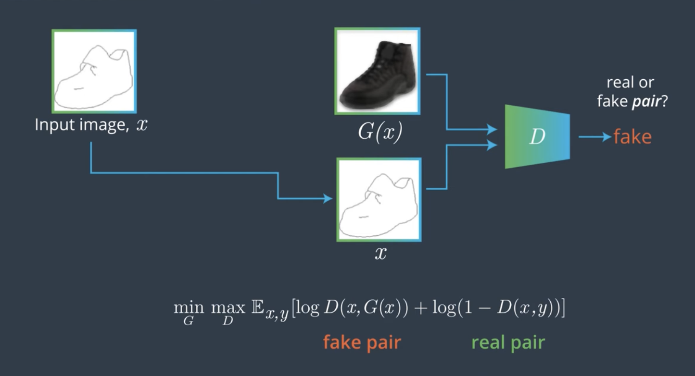

<br>
<br>

# S-4: Image to Image Translation

<br>
<br>

1. Fundamentals of Image-to-Image Translation
    - Definition and Applications
    - Objective Functions and Loss Formulations
    - Latent Space Representation and Manipulation
    - Paired vs. Unpaired Translation Approaches
2. Pix2Pix Architecture
    - Generator Design (U-Net Structure)
    - Discriminator Design (PatchGAN)
    - Loss Function Components
    - Training Methodology and Requirements
3. CycleGAN Framework
    - Unpaired Data Translation Challenge
    - Cycle Consistency Concept
    - Architecture Differences from Pix2Pix
    - Implementation Considerations
4. Applications and Limitations
    - Domain Adaptation Use Cases
    - Synthetic Data Generation
    - Failure Modes and Challenges
    - Practical Deployment Considerations

#### Fundamentals of Image-to-Image Translation

##### Definition and Applications

Image-to-Image Translation represents one of the most powerful and practical applications of Generative Adversarial
Networks. At its core, this technique involves transforming an input image from one domain into a corresponding output
image in another domain while preserving the essential structure and content. Unlike basic image generation which
creates images from random noise, image translation takes an existing image and performs a targeted transformation on
it.

The fundamental premise of image-to-image translation can be thought of as learning a mapping function between visual
domains. These domains could be as simple as different color spaces (like grayscale to color) or as complex as entirely
different visual styles (like photographs to paintings). What makes this approach particularly powerful is that the
network learns to understand the underlying structure of both domains and creates meaningful transformations rather than
just applying superficial filters.

Image-to-Image translation has found applications across numerous fields due to its versatility and effectiveness:

In computer vision and graphics, it enables transformations like:

- Converting sketches or outlines to photorealistic images
- Transforming daytime scenes to nighttime or changing seasons in landscape photos
- Colorizing black and white photographs with realistic colors
- Generating detailed images from simple semantic maps or layouts

In medical imaging, image translation has proven valuable for:

- Cross-modality synthesis (converting MRI scans to CT scans or vice versa)
- Enhancing low-quality scans to improve diagnostic capability
- Generating synthetic medical images for training when real data is limited
- Highlighting specific anatomical features for better visualization

For autonomous vehicles and robotics, these techniques allow:

- Simulating different weather or lighting conditions for training robust perception systems
- Converting semantic segmentation maps to realistic scenes for simulation
- Translating between synthetic training environments and real-world imagery
- Enhancing poor visibility conditions like fog or darkness

In artistic and creative applications, image translation enables:

- Style transfer between different artistic genres or specific artists
- Converting simple sketches to detailed artwork
- Aging or de-aging photographs of people or buildings
- Generating photorealistic images from simple drawings

The power of image-to-image translation comes from its ability to learn the relationship between visual domains without
requiring explicit rules or transformations to be programmed. Instead, the network discovers these relationships through
exposure to examples from both domains, allowing it to generalize and create transformations for new images it hasn't
seen before.

What makes these applications particularly compelling is that the translations preserve the underlying structure and
semantic content of the original image. When converting a sketch to a photograph, for instance, the spatial arrangement
and major components remain intact—it's not creating an entirely new image but rather a transformed version that
respects the original content while adopting the visual characteristics of the target domain.

This preservation of content while changing style is what distinguishes image-to-image translation from pure generation
tasks and makes it especially useful for practical applications where maintaining the core information of the original
image is essential.

##### Objective Functions and Loss Formulations

The success of image-to-image translation systems depends critically on their objective functions—the mathematical
formulations that guide the learning process. These functions define what constitutes a "good" translation and steer the
networks toward producing desirable results. In the context of GANs for image translation, several specialized loss
functions work together to achieve high-quality transformations.

**Adversarial Loss**

At the heart of GAN-based translation is the adversarial loss, which creates the fundamental game between generator and
discriminator:

$$\mathcal{L}*{adv}(G, D, X, Y) = \mathbb{E}*{y \sim p_{data}(y)}[\log D(y)] + \mathbb{E}*{x \sim p*{data}(x)}[\log(1 - D(G(x)))]$$

Where:

- $G$ is the generator that translates from domain X to domain Y
- $D$ is the discriminator that tries to distinguish real Y images from generated ones
- $x$ and $y$ are samples from domains X and Y respectively

The adversarial loss pushes the generator to create images that are indistinguishable from real images in the target
domain. However, this loss alone is insufficient for image translation, as it doesn't ensure the translated image
maintains the content of the input image—it only ensures the output looks realistic in the target domain.

**Pixel-wise Loss (L1/L2)**

To maintain content correspondence between input and output, pixel-wise losses measure direct differences between the
generated image and a target:

$$\mathcal{L}*{L1}(G) = \mathbb{E}*{x,y}[||y - G(x)||_1]$$

The L1 loss (absolute differences) is often preferred over L2 (squared differences) because L1 produces less blurry
results. These losses can only be directly applied in paired translation scenarios where we have corresponding target
images. They encourage the network to preserve spatial structure and content from the input while adopting the style of
the target domain.

**Cycle Consistency Loss**

For unpaired translation, where direct pixel-wise comparison isn't possible, cycle consistency loss enforces that
translations should be invertible:

$$\mathcal{L}*{cyc}(G, F) = \mathbb{E}*{x}[||F(G(x)) - x||*1] + \mathbb{E}*{y}[||G(F(y)) - y||_1]$$

Where:

- $G$ translates from domain X to domain Y
- $F$ translates from domain Y back to domain X

This loss ensures that if an image is translated to another domain and then back again, it should return to something
very close to the original. This constraint is crucial for preserving content when working with unpaired data.

**Identity Loss**

To further preserve color and structure, especially in cases where the input already belongs to the target domain, the
identity loss is sometimes used:

$$\mathcal{L}*{identity}(G, F) = \mathbb{E}*{y}[||G(y) - y||*1] + \mathbb{E}*{x}[||F(x) - x||_1]$$

This loss encourages the generator to act as an identity function when given an image already in its output domain,
which helps prevent unnecessary changes to already-correct elements.

**Perceptual Loss**

Moving beyond simple pixel comparisons, perceptual losses measure differences in feature representations extracted by a
pre-trained network (often VGG):

$$\mathcal{L}*{perceptual}(G) = \mathbb{E}*{x,y}[||\phi(y) - \phi(G(x))||_2^2]$$

Where $\phi$ represents feature extraction from specific layers of a pre-trained network. This loss encourages outputs
that match the target image in terms of higher-level features rather than just pixels, often resulting in more
perceptually pleasing results.

**Combined Objective Functions**

These losses are typically combined with weighting coefficients to form the final objective function:

$$\mathcal{L}*{total} = \lambda*{adv}\mathcal{L}*{adv} + \lambda*{pixel}\mathcal{L}*{pixel} + \lambda*{cyc}\mathcal{L}*{cyc} + \lambda*{identity}\mathcal{L}*{identity} + \lambda*{perceptual}\mathcal{L}_{perceptual}$$

The relative weights ($\lambda$ values) of these components significantly impact the translation quality and must be
carefully tuned for each application. For example, increasing the weight of the pixel loss will produce outputs that
more closely match targets pixel-by-pixel but might sacrifice some realism that the adversarial loss encourages.

The careful formulation of these objective functions represents one of the most important aspects of designing effective
image-to-image translation systems. Each component addresses specific aspects of the translation problem—realism,
content preservation, style transfer—and their balanced combination guides the networks toward producing translations
that are both realistic and faithful to the input content.

##### Latent Space Representation and Manipulation

The concept of latent space is fundamental to understanding how image-to-image translation works at a deeper level. In
the context of neural networks, "latent" refers to hidden or underlying representations that the network learns during
training. For image translation, these latent representations provide a bridge between different visual domains by
capturing the essential structure and content of images in a compressed, abstract form.

The latent space can be thought of as a multidimensional coordinate system where each point corresponds to a specific
image configuration. In this space, similar images cluster together, and the dimensions often correspond to meaningful
visual attributes. The power of latent space manipulation comes from the ability to perform operations in this compact,
abstract space rather than directly on high-dimensional pixel values.

In the context of image-to-image translation, there are several important ways that latent representations facilitate
effective transformations:

**Encoder-Decoder Architecture**

Many image translation models use an encoder-decoder structure:

- The encoder maps an input image to a latent representation (encoding)
- The decoder converts this latent representation back to an image (decoding)

This architecture inherently creates a bottleneck where the image must be compressed into a lower-dimensional latent
code. During this compression, the network learns to retain the most important structural information while discarding
details that aren't essential for reconstruction. This bottleneck forces the network to develop efficient internal
representations of images, which can then be manipulated for translation purposes.

In the U-Net architecture commonly used in Pix2Pix, skip connections help preserve spatial details that might otherwise
be lost in the latent bottleneck, allowing the network to focus the latent representation on capturing higher-level
content and style information.

**Domain-Invariant and Domain-Specific Features**

Advanced image translation models often decompose latent representations into:

- Content features that should be preserved across domains
- Style features that are specific to each domain

By separating these aspects in latent space, networks can perform more controlled translations. For example, in methods
like MUNIT (Multimodal Unsupervised Image-to-Image Translation), images are encoded into:

- A content code that captures domain-invariant properties
- A style code that captures domain-specific properties

This decomposition allows for more flexible translations. By combining content codes from one image with style codes
from another domain, the network can generate varied outputs that preserve the structural content while adopting
different styles.

**Latent Space Arithmetic**

One of the most powerful aspects of latent space is that it often supports meaningful vector arithmetic. For example:

- Adding or subtracting vectors in latent space can add or remove specific attributes
- Interpolating between points creates smooth transitions between different images
- Linear operations in latent space often correspond to semantically meaningful image transformations

In image translation, this property allows for operations like style blending, where the style of a translation can be
gradually adjusted by interpolating between different points in the style latent space.

**Consistency in Latent Space**

For unpaired translation methods like CycleGANs, consistency in latent space is crucial. When an image is translated to
another domain and back again, the original and reconstructed images should ideally have similar latent representations,
even if they don't match exactly pixel-by-pixel. This latent consistency helps ensure that the essential content and
structure of the image are preserved through multiple transformations.

Some advanced models explicitly enforce this consistency with additional loss terms that operate directly in latent
space rather than pixel space, ensuring that translations maintain the fundamental structure of the input even when the
pixel-level appearance changes significantly.

**Disentanglement and Controlled Manipulation**

The most sophisticated image translation systems aim to disentangle different attributes in latent space, creating
representations where specific dimensions correspond to interpretable visual features. This disentanglement allows for
more controlled editing and translation:

- Modifying specific dimensions can change targeted aspects of an image
- Transferring only certain dimensions between domains allows for partial style transfer
- Constraining modifications to specific regions of latent space can prevent unwanted changes

Understanding and leveraging the properties of latent space representations has been key to advancing image-to-image
translation beyond simple mappings to more flexible, controllable, and diverse transformations. By operating in this
abstract feature space rather than directly on pixels, translation models can capture and transform the essential
qualities of images while maintaining their fundamental structure and content.

##### Paired vs. Unpaired Translation Approaches

Image-to-image translation approaches can be broadly categorized into paired and unpaired methods, each with distinct
characteristics, challenges, and applications. Understanding the difference between these approaches is crucial for
selecting the appropriate technique for a specific translation task.

**Paired Translation**

Paired translation, exemplified by models like Pix2Pix, requires datasets where each input image has a corresponding
target image in the desired domain. These image pairs represent the same underlying content rendered in two different
styles or domains.

The key characteristics of paired translation include:

1. **Supervised Learning**: The model can directly compare its output against the ground truth target image, receiving
   explicit supervision about what the correct translation should look like.
2. **Direct Loss Calculation**: Because corresponding targets exist, the model can use pixel-wise losses (L1/L2) that
   measure direct differences between generated and target images.
3. **Deterministic Mapping**: Paired approaches typically learn a more deterministic mapping from input to output,
   producing a specific translation based on the paired examples seen during training.
4. **Higher Fidelity**: With explicit targets to guide the learning process, paired methods often achieve higher
   fidelity translations that more closely match the expected output.

The primary limitation of paired translation is the requirement for paired data, which is:

- Expensive and time-consuming to collect
- Impossible to obtain for many domains (e.g., photos to Van Gogh paintings)
- Limited in quantity, potentially restricting the model's generalization capacity

Paired translation is ideal for applications like:

- Semantic map to photo generation (where maps can be created from photos)
- Sketch to photo conversion (where sketches can be traced from photos)
- Day to night transformation (where the same scene can be photographed at different times)
- Medical cross-modality synthesis (where the same patient can be scanned with different imaging techniques)

**Unpaired Translation**

Unpaired translation, represented by frameworks like CycleGAN, removes the requirement for corresponding image pairs.
Instead, it works with two separate collections of images from different domains, without any explicit pairing between
them.

The defining features of unpaired translation include:

1. **Unsupervised Learning**: The model must learn the relationship between domains without explicit examples of correct
   translations, making this an unsupervised or self-supervised learning task.
2. **Cycle Consistency**: In the absence of direct targets, cycle consistency becomes crucial—translating an image to
   another domain and back again should recover the original image.
3. **Adversarial Guidance**: With no direct pixel comparisons possible, the realism of translations is primarily guided
   by adversarial losses that ensure outputs match the distribution of images in the target domain.
4. **Multiple Possible Outputs**: Unpaired methods often allow for greater diversity in potential translations, as
   there's no single "correct" output defined by the training data.

The advantages of unpaired translation include:

- No need for paired data collection, dramatically expanding applicable domains
- Ability to learn from larger, more diverse datasets
- Potential for more creative and varied translations

However, unpaired approaches face challenges like:

- Less precise control over specific translation details
- Potential for content distortion when cycle consistency isn't perfectly maintained
- More complex training dynamics due to multiple interacting networks and loss components

Unpaired translation excels in scenarios such as:

- Style transfer between artistic genres
- Animal-to-animal transformations (e.g., horses to zebras)
- Season transfer in landscapes (summer to winter)
- Photo-to-painting conversion
- Any application where collecting paired examples is impractical

**Hybrid and Advanced Approaches**

Recent research has explored approaches that bridge the gap between purely paired and unpaired methods:

1. **Few-Shot Translation**: Using a small number of paired examples to guide an otherwise unpaired training process,
   combining the flexibility of unpaired methods with some of the control of paired approaches.
2. **Semi-Supervised Translation**: Leveraging both paired and unpaired data, where the paired examples provide direct
   supervision while the unpaired data helps improve generalization.
3. **Contrastive Learning**: Using contrastive objectives that pull positive pairs (same content, different domain)
   closer in feature space while pushing negative pairs apart, providing a form of supervision without explicit
   pixel-wise pairing.
4. **Reference-Guided Translation**: Allowing users to provide reference images that guide specific aspects of the
   translation, combining the flexibility of unpaired methods with more user control.

The choice between paired and unpaired approaches ultimately depends on:

- Data availability and collection feasibility
- Required precision and control over translation outcomes
- Acceptable level of content distortion
- Need for diversity in generated outputs

While paired translation generally produces more accurate results when suitable data is available, unpaired translation
has opened up image-to-image translation to a vastly wider range of applications by removing the paired data
requirement. Each approach represents a different point on the spectrum of trade-offs between translation accuracy, data
requirements, and application flexibility.

#### Pix2Pix Architecture

##### Generator Design (U-Net Structure)

The generator in the Pix2Pix framework employs a specialized architecture called U-Net, which has proven remarkably
effective for image-to-image translation tasks. The U-Net design represents a significant advancement over standard
encoder-decoder networks by introducing skip connections that preserve crucial spatial information throughout the
translation process.

At its core, the U-Net generator consists of two main pathways: a contracting path (encoder) that captures context and a
symmetric expanding path (decoder) that enables precise localization. What makes this architecture particularly powerful
for image translation is how these two pathways are connected.

The encoder portion follows a typical convolutional neural network pattern, progressively reducing spatial dimensions
while increasing the feature channel depth. Each step in the contracting path consists of:

1. A convolutional layer with a stride of 2 (which halves the spatial dimensions)
2. Batch normalization to stabilize training
3. Leaky ReLU activation to prevent "dying ReLU" problems

This downsampling process continues through multiple levels, creating a hierarchical representation of the input image.
At each level, the spatial resolution decreases while the number of feature channels increases. For example, in a
typical implementation:

- Input: 256×256×3 (original image)
- First encoding layer: 128×128×64
- Second encoding layer: 64×64×128
- Third encoding layer: 32×32×256
- Fourth encoding layer: 16×16×512
- Fifth encoding layer: 8×8×512
- Bottleneck: 4×4×512

This progressive compression forces the network to learn increasingly abstract representations of the image content. At
the bottleneck, the network has compressed the image into a compact, high-dimensional feature representation that
captures the essential content while discarding less important details.

The decoder portion then reverses this process, progressively increasing spatial dimensions while decreasing feature
depth. Each step in the expanding path consists of:

1. A transposed convolutional layer (sometimes called a deconvolution) with a stride of 2 (which doubles the spatial
   dimensions)
2. Batch normalization
3. ReLU activation (regular, not leaky)
4. Dropout during training for regularization (typically with a rate of 0.5)

The most distinctive feature of the U-Net architecture is the skip connections that link each encoder layer directly to
its corresponding decoder layer. These connections concatenate the feature maps from the encoder with those of the
decoder at the same resolution level, allowing the decoder to access the high-resolution spatial information that would
otherwise be lost during downsampling.

For example, the feature maps from the first encoding layer (128×128×64) are concatenated with the feature maps in the
decoder right after the spatial dimensions reach 128×128 again. This creates a rich combination of high-level abstract
features and low-level spatial details.

The skip connections serve multiple crucial purposes:

1. They provide direct paths for gradients to flow during backpropagation, helping to address the vanishing gradient
   problem in deep networks.
2. They allow the network to preserve fine spatial details that would otherwise be lost in the bottleneck compression.
3. They enable the decoder to focus on reconstructing the transformed version of the input rather than having to relearn
   spatial structures from scratch.
4. They facilitate the translation of local patterns while maintaining global structure, which is essential for coherent
   image-to-image translation.

The final layer of the U-Net generator typically uses a Tanh activation function to produce output values in the range
[-1, 1], matching the normalized range of the training images. This ensures that the generator produces properly scaled
outputs that can be directly compared with real images.

The U-Net architecture is particularly well-suited for image translation tasks because it maintains a strong
correspondence between input and output spatial structures. This architectural property aligns perfectly with the goal
of image-to-image translation: to transform the style or appearance of an image while preserving its underlying
structure and content.

The effectiveness of U-Net for Pix2Pix comes from its ability to handle this seemingly contradictory
requirement—changing an image's appearance dramatically while simultaneously preserving its essential structure. The
encoder captures the content and context, the decoder reconstructs the spatial details in the new domain, and the skip
connections ensure that the fine details and global structure remain coherent throughout the transformation process.

##### Discriminator Design (PatchGAN)

The discriminator in the Pix2Pix framework utilizes an innovative design called PatchGAN, which represents a departure
from traditional GAN discriminators. Rather than assessing entire images holistically, PatchGAN focuses on evaluating
image quality at the patch level, bringing several advantages that are particularly valuable for image translation
tasks.

Traditional GAN discriminators output a single scalar value indicating whether an entire image is real or fake. In
contrast, the PatchGAN discriminator outputs a matrix of predictions, where each element corresponds to the reality
assessment of a particular patch in the input image. This design shift fundamentally changes how the discriminator
evaluates images and provides feedback to the generator.

The PatchGAN architecture consists of a series of convolutional layers that progressively reduce the spatial dimensions
while increasing the feature depth, similar to the encoder portion of the generator but with a crucial difference: the
discriminator continues until the output is a grid of predictions rather than a single value. For example, a typical
PatchGAN discriminator might produce a 30×30 output grid when given a 256×256 input image.

Each value in this output grid represents the discriminator's assessment of whether a specific receptive field in the
input image looks real or fake. The receptive field for each output element typically covers a patch of the input image,
with the patch size determined by the network architecture. Common implementations use receptive fields that cover 70×70
pixel patches of the input image, though the exact size can vary based on the specific architectural choices.

The detailed structure of the PatchGAN discriminator includes:

1. Input layer that receives either:
    - A concatenated pair of input and real target images (for real examples)
    - A concatenated pair of input and generated output images (for fake examples)
2. A series of convolutional layers with:
    - Stride of 2 for initial layers to downsample
    - No explicit pooling layers
    - Leaky ReLU activations (typically with a slope of 0.2 for negative values)
    - Increasing channel depths (e.g., 64, 128, 256, 512)
    - Batch normalization after most layers (except the first and last)
3. A final convolutional layer that produces the patch-wise predictions, followed by a sigmoid activation to convert
   values to probabilities

This patch-based approach offers several significant advantages for image translation tasks:

1. **Efficiency**: The fully convolutional design requires fewer parameters than a discriminator that processes the
   entire image at once, reducing memory requirements and computation time.
2. **Focus on local textures and patterns**: By operating at the patch level, the discriminator becomes particularly
   sensitive to local textures, patterns, and details rather than global composition. This aligns well with image
   translation tasks, where local texture quality is often more important than global structure (which is largely
   determined by the input image).
3. **Shift invariance**: The convolutional nature of PatchGAN makes it shift-invariant, meaning it applies the same
   criteria across the entire image regardless of position. This creates a uniform quality assessment across the image.
4. **More detailed feedback**: The patch-wise predictions provide the generator with more granular feedback about which
   regions of the image look realistic and which need improvement, rather than a single scalar for the entire image.
5. **Architectural flexibility**: The PatchGAN can be applied to images of different sizes without architectural
   changes, since the convolutional operations function independently of input dimensions.

The PatchGAN discriminator's focus on local realism rather than global coherence complements the generator's U-Net
architecture perfectly. While the U-Net with its skip connections ensures that the global structure and correspondence
between input and output are maintained, the PatchGAN discriminator pushes the generator to produce locally realistic
textures and details that match the target domain.

In practice, the PatchGAN discriminator receives pairs of images—either real pairs from the training data or pairs
consisting of an input image and its corresponding generated output. For real pairs, the discriminator learns to output
high values (close to 1) across its prediction grid. For generated pairs, it learns to output low values (close to 0).
This trains the discriminator to distinguish between real and generated image pairs based on the local characteristics
of the translations.

The size of the patches that the discriminator evaluates represents an important hyperparameter in the PatchGAN design.
Larger patches allow the discriminator to consider more context but require more parameters and computation. Smaller
patches focus more exclusively on texture quality but might miss medium-scale structures. The choice of patch size thus
creates a tradeoff between detail assessment and contextual understanding.

The innovation of the PatchGAN discriminator has proven so effective that it has been adopted in numerous other
image-to-image translation frameworks beyond Pix2Pix, demonstrating its value as a design pattern for translation tasks
where local texture quality is an important factor in the perceived realism of generated images.

##### Loss Function Components

The Pix2Pix framework employs a carefully designed combination of loss functions that work together to guide the
training process toward high-quality image translations. This hybrid loss formulation addresses different aspects of the
translation quality, creating a balanced objective that produces results that are both visually realistic and faithful
to the input content.

The total loss function for Pix2Pix combines two primary components:

1. **Adversarial Loss**: Ensures the generated images appear realistic according to the discriminator
2. **L1 Loss**: Ensures the generated images align closely with the ground truth targets

Let's examine each component in detail:

**Adversarial Loss**

The adversarial loss follows the standard GAN formulation, creating the game-theoretic dynamic between generator and
discriminator:

$$\mathcal{L}*{GAN}(G, D) = \mathbb{E}*{x,y}[\log D(x, y)] + \mathbb{E}_{x}[\log(1 - D(x, G(x)))]$$

Where:

- $x$ is the input image
- $y$ is the real target image
- $G(x)$ is the generated output from the generator
- $D(x, y)$ is the discriminator's assessment of the input-output pair

An important distinction in Pix2Pix is that the discriminator sees both the input image and either the real target or
generated output (concatenated along the channel dimension). This makes the discriminator conditional—it doesn't just
evaluate whether an image looks realistic in isolation but whether it represents a realistic translation of the specific
input image.

For the generator, the objective is to minimize:

$$\mathcal{L}*{GAN}^G(G, D) = \mathbb{E}*{x}[\log(1 - D(x, G(x)))]$$

Or alternatively, to avoid vanishing gradients early in training, the non-saturating version is often used:

$$\mathcal{L}*{GAN}^G(G, D) = -\mathbb{E}*{x}[\log(D(x, G(x)))]$$

This adversarial component pushes the generator to create images that look realistic according to the discriminator's
learned criteria. However, adversarial loss alone would not ensure that the generated image maintains correspondence
with the target—it would only ensure that it looks realistic.

**L1 Loss (Reconstruction Loss)**

To address the need for content correspondence, Pix2Pix introduces a direct pixel-wise loss between the generated output
and the ground truth target:

$$\mathcal{L}*{L1}(G) = \mathbb{E}*{x,y}[||y - G(x)||_1]$$

This L1 (absolute difference) loss penalizes the generator when its output differs from the target image. The choice of
L1 rather than L2 (squared difference) is significant—L1 loss tends to preserve more sharpness and detail in the
generated images, whereas L2 loss often results in blurrier outputs.

The L1 loss serves several crucial purposes:

1. It ensures that the generated image corresponds structurally to the ground truth target
2. It provides a direct learning signal about where the output should improve
3. It stabilizes training by giving the generator a consistent objective alongside the potentially volatile adversarial
   signal

**Combined Loss**

The full objective function for the generator combines these components with a weighting parameter λ:

$$\mathcal{L}(G, D) = \mathcal{L}*{GAN}(G, D) + \lambda \mathcal{L}*{L1}(G)$$

The parameter λ controls the relative importance of the L1 loss compared to the adversarial loss. In the original
Pix2Pix implementation, λ = 100 was used, placing substantial emphasis on the reconstruction quality. This high
weighting makes sense because:

1. The L1 loss provides more stable gradients than the adversarial loss
2. Maintaining structural correspondence with the target is particularly important for translation tasks
3. The adversarial component only needs to contribute enough to improve texture quality and avoid blurriness

**PatchGAN Influence on Loss**

The PatchGAN discriminator architecture directly influences how the adversarial loss operates. Rather than producing a
single scalar output, the discriminator outputs a grid of predictions. The adversarial loss is computed by averaging
across all these patch-level predictions:

$$\mathcal{L}*{GAN}(G, D) = \mathbb{E}*{x,y}\left[\frac{1}{N} \sum_{i=1}^{N} \log D(x, y)*i\right] + \mathbb{E}*{x}\left[\frac{1}{N} \sum_{i=1}^{N} \log(1 - D(x, G(x))_i)\right]$$

Where $N$ is the number of patches and $D(x,y)_i$ is the discriminator's prediction for the i-th patch. This formulation
encourages the generator to focus on making each local patch look realistic rather than just the image as a whole.

**Training Dynamics**

The interaction between these loss components creates an effective training dynamic:

- The L1 loss quickly guides the generator toward outputs that broadly match the target images
- The adversarial loss refines the textures and details to make them more realistic
- Together, they push the generator to create outputs that are both structurally accurate and visually convincing

This hybrid loss formulation addresses one of the fundamental challenges in image-to-image translation: balancing the
preservation of input content with the adoption of target domain characteristics. The L1 component ensures content
preservation, while the adversarial component ensures the stylistic properties of the target domain are captured
effectively.

The success of this combined approach has influenced many subsequent image translation frameworks, demonstrating the
value of hybrid objectives that address different aspects of translation quality simultaneously.

##### Training Methodology and Requirements

Successfully training a Pix2Pix model requires careful attention to methodological details and specific data
requirements. The training process for this paired image-to-image translation approach involves several key
considerations that directly impact the quality and applicability of the resulting model.

**Data Requirements**

Pix2Pix is a supervised approach that requires paired training data, which presents both constraints and opportunities:

1. **Paired Images**: Each training example must consist of a corresponding input-output pair that represents the same
   content in both source and target domains. For example:
    - Sketch and corresponding photograph
    - Semantic map and corresponding realistic image
    - Daytime scene and same scene at night
    - Black and white photo and its colorized version
2. **Alignment**: The paired images must be well-aligned, typically pixel-to-pixel. Misalignments can cause the model to
   learn incorrect correspondences or produce blurred results in areas of uncertainty.
3. **Dataset Size**: While GANs generally benefit from large datasets, Pix2Pix can produce reasonable results with
   relatively modest dataset sizes—often a few hundred to a few thousand pairs. This is partly because the paired
   supervision provides a strong learning signal.
4. **Data Augmentation**: To maximize the utility of limited paired data, augmentation techniques like random cropping,
   flipping, and slight rotations are commonly employed. However, these must be applied identically to both images in
   each pair to maintain alignment.
5. **Preprocessing**: Images are typically resized to powers of 2 (e.g., 256×256 or 512×512) and normalized to the range
   [-1, 1] to match the Tanh output activation of the generator.

**Training Process**

The training procedure for Pix2Pix follows a structured approach that balances the updates between generator and
discriminator:

1. **Initialization**: Both networks are initialized with weights sampled from a normal distribution with mean 0 and
   standard deviation 0.02, which empirically provides good starting points for GAN training.
2. **Alternating Updates**: The discriminator and generator are trained in an alternating fashion:
    - Update the discriminator using both real and generated pairs
    - Update the generator to fool the discriminator and minimize the L1 loss
3. **Mini-batch Training**: Typically, small mini-batch sizes (1-16) are used due to memory constraints and to provide
   stable gradients. The original implementation used batch sizes of 1 or 4.
4. **Optimization Parameters**:
    - Adam optimizer with learning rate of 0.0002
    - Momentum parameters β₁ = 0.5 and β₂ = 0.999
    - Linear learning rate decay during the latter half of training
5. **Training Duration**: Pix2Pix models typically train for 100-200 epochs, with convergence often visible after about
   100 epochs for many tasks.

**Special Training Techniques**

Pix2Pix incorporates several specialized techniques that improve training stability and generation quality:

1. **Noise Handling**: Unlike many GAN applications, Pix2Pix doesn't use an explicit noise input to the generator.
   Instead, dropout layers in the generator serve as a source of randomness during both training and inference, which
   helps prevent the generator from learning to simply memorize the training examples.
2. **One-sided Label Smoothing**: To stabilize discriminator training, the target for real examples is set to 0.9 rather
   than 1.0. This prevents the discriminator from becoming overconfident and provides better gradients to the generator.
3. **Instance Normalization**: For certain applications, instance normalization (normalizing each feature map
   independently for each example) can perform better than batch normalization, particularly for style transfer-like
   applications.
4. **Jittering**: Random jitter is applied during training by resizing images to a larger size (e.g., 286×286) and then
   randomly cropping back to the target size (e.g., 256×256). This provides additional augmentation and helps prevent
   overfitting.

**Implementation Considerations**

Several practical considerations impact the successful implementation of Pix2Pix:

1. **Memory Requirements**: The U-Net generator with skip connections and the PatchGAN discriminator can be
   memory-intensive, particularly for high-resolution images. Training typically requires a GPU with at least 8-12GB of
   memory for 256×256 images.
2. **Conditional Input**: The discriminator receives both the input image and either the real target or generated
   output. These are concatenated along the channel dimension before being fed to the discriminator.
3. **Test-Time Behavior**: Unlike many GANs, Pix2Pix keeps dropout enabled during testing, which introduces variability
   in the outputs. Multiple runs with the same input can produce slightly different results.
4. **Evaluation Metrics**: While visual assessment is critical, quantitative evaluation often uses:
    - Fréchet Inception Distance (FID) to measure realism
    - Structural Similarity Index (SSIM) to measure preservation of content
    - User studies for subjective quality assessment
5. **Edge Cases**: Pix2Pix may struggle with:
    - Extreme transformations that dramatically alter content
    - Very high-resolution images (beyond 512×512) without architectural modifications
    - Domains with high variability where one-to-many mappings are possible

**Data Collection Strategies**

Given the requirement for paired data, several approaches have been developed to create appropriate datasets:

1. **Automated Pairing**: For some domains, automated methods can create pairs:
    - Rendering engines can generate semantic maps and corresponding photorealistic images
    - Filters or algorithms can create one domain from another (e.g., edges from photos)
    - Time-lapse photography can capture the same scene under different conditions
2. **Manual Creation**: For domains without automated options, manual creation may be necessary:
    - Artists creating corresponding pairs (e.g., sketches of photographs)
    - Controlled photography of the same subject with different settings
    - Manual annotation and segmentation of images
3. **Crowd-sourcing**: For large-scale paired data needs, crowd-sourcing with careful quality control can be effective.

The requirement for paired training data represents both Pix2Pix's greatest strength and its primary limitation. The
direct supervision enables high-quality, consistent translations with relatively efficient training, but the need for
aligned pairs restricts its application to domains where such data can be reasonably obtained. This limitation inspired
subsequent developments like CycleGAN, which removed the paired data requirement at the cost of some translation
precision.

Understanding these methodological requirements and training considerations is essential for successfully implementing
Pix2Pix for specific image translation tasks and for recognizing when alternative approaches might be more appropriate
based on available data and application requirements.

#### CycleGAN Framework

##### Unpaired Data Translation Challenge

The requirement for paired training data represents a significant limitation in image-to-image translation. While
Pix2Pix demonstrates impressive results, it can only be applied to domains where corresponding image pairs are
available. This constraint severely restricts the applicability of paired translation approaches, as many interesting
and valuable translation tasks involve domains where paired data is either impossible to collect or prohibitively
expensive to create.

Consider some compelling translation scenarios where paired data simply cannot exist:

1. Translating photographs to the style of artists who are no longer living, such as Van Gogh or Monet. Since these
   artists never saw most modern photographic subjects, no true paired data can ever exist.
2. Converting between zebras and horses. We cannot have the exact same animal exist simultaneously as both a zebra and a
   horse to create perfect pairs.
3. Transforming summer landscapes to winter landscapes. Even photographing the same location in different seasons
   produces images with differences in lighting, vegetation changes, and other temporal variations that make them
   imperfectly paired.

The challenge extends beyond mere availability to practical concerns about data collection:

1. **Time and Resource Intensity**: Even when theoretically possible, collecting paired data often requires excessive
   resources. For medical imaging, getting multiple scan types for the same patient may be impractical or ethically
   questionable.
2. **Alignment Difficulties**: Many potentially paired images suffer from alignment issues. For example, photographs of
   the same scene from slightly different angles or with different camera parameters create imperfect pairs that can
   lead to blurry or inconsistent results in paired training.
3. **Subjective Interpretations**: For artistic translations, there may be multiple valid interpretations of how an
   image should be transformed, making a single paired "ground truth" inadequate.
4. **Ethical and Privacy Concerns**: In domains like facial imagery or medical data, collecting paired examples may
   raise privacy issues or require special consent that limits dataset size.

Given these challenges, researchers faced a fundamental question: Could the success of GANs for image translation be
extended to scenarios without paired training data? This question led to the development of unpaired translation
approaches, with CycleGAN emerging as one of the most influential solutions.

Unpaired translation requires solving several key technical challenges:

1. **Defining the Objective**: Without paired examples to provide direct supervision, how do we define what makes a good
   translation? The network needs to learn the characteristics of both domains and how to transform between them without
   explicit examples of correct translations.
2. **Preserving Content**: Ensuring that the semantic content and structure of the input image is preserved during
   translation becomes more difficult without a direct target for comparison. The system must learn to change only the
   stylistic aspects while maintaining the core content.
3. **Preventing Mode Collapse**: GANs are prone to mode collapse, where they produce a limited variety of outputs. This
   risk increases in unpaired settings where there's less direct guidance about what outputs should look like.
4. **Handling Ambiguity**: Many translations are inherently one-to-many (an input could have multiple valid
   translations). Without paired examples to resolve this ambiguity, the model must either choose a single mapping or
   find ways to model the diversity of possible outputs.
5. **Evaluation Difficulties**: Assessing the quality of unpaired translations becomes more subjective without ground
   truth targets for comparison, making quantitative evaluation more challenging.

The CycleGAN framework addresses these challenges through a creative formulation that leverages cycle consistency as a
form of self-supervision. By requiring that translations be invertible—that an image translated to another domain and
back should return to something close to the original—CycleGAN provides a powerful constraint that enables effective
unpaired translation.

This approach opened up image-to-image translation to a vast array of previously inaccessible applications,
demonstrating that with the right constraints and training methodology, GANs could learn meaningful translations even in
the absence of explicitly paired examples. The development of unpaired translation methods like CycleGAN represents one
of the most significant advances in generative modeling, enabling creative applications and practical solutions across
numerous domains that were previously beyond reach.

##### Cycle Consistency Concept

The cycle consistency concept represents the cornerstone of CycleGAN's approach to unpaired image translation. This
elegant and intuitive principle provides the critical constraint that makes learning from unpaired data possible. At its
heart, cycle consistency embodies a simple idea: if we translate an image from domain A to domain B and then translate
it back to domain A, we should recover the original image.

To understand why this concept is so powerful, we can draw an analogy to language translation. Imagine translating a
sentence from English to French and then back to English. If the translation is accurate and preserves meaning, the
final English sentence should closely match the original. This "round-trip" translation serves as a form of validation
that the meaning was preserved, even if we don't have a direct parallel between the English and French versions.

Mathematically, the cycle consistency constraint is expressed through two mapping functions:

1. $G: A \rightarrow B$ (translates images from domain A to domain B)
2. $F: B \rightarrow A$ (translates images from domain B to domain A)

For these functions, cycle consistency requires that:

For every image $a$ from domain A: $F(G(a)) \approx a$ For every image $b$ from domain B: $G(F(b)) \approx b$

These constraints are enforced through the cycle consistency loss, which measures how closely the reconstructed images
match the originals:

$$\mathcal{L}*{cyc}(G, F) = \mathbb{E}*{a \sim p_{data}(a)}[||F(G(a)) - a||*1] + \mathbb{E}*{b \sim p_{data}(b)}[||G(F(b)) - b||_1]$$

This L1 loss penalizes differences between the original images and their reconstructions after the full cycle of
translations.

The cycle consistency concept provides several crucial benefits for unpaired translation:

1. **Content Preservation**: By requiring that translations be reversible, the cycle consistency constraint implicitly
   forces the networks to preserve the core content and structure of the images. Features that are lost during the
   forward translation cannot be recovered during the backward translation, resulting in a high cycle consistency loss.
2. **Preventing Mode Collapse**: Cycle consistency discourages the degenerate solution where all images from domain A
   are mapped to a single or small set of images in domain B. Such a mapping would make it impossible to recover the
   original diversity when translating back to domain A.
3. **Handling Unpaired Data**: Most importantly, cycle consistency provides a form of supervision that doesn't require
   paired examples. The networks learn from the relationship between the domains as a whole rather than from specific
   paired instances.

The power of cycle consistency can be understood through several conceptual frameworks:

**Information Preservation View**: The cycle consistency constraint ensures that the translation preserves all the
information necessary to reconstruct the original image. This prevents the translation from discarding important content
details while allowing style and domain-specific characteristics to change.

**Bijective Mapping View**: Ideally, the translations $G$ and $F$ would form bijective mappings between domains, where
each image in one domain corresponds to exactly one image in the other domain. The cycle consistency loss pushes the
networks toward learning such bijective mappings.

**Latent Space View**: We can think of the translations as first encoding the content of an image into a latent
representation (implicitly) and then decoding it with the style of the target domain. The cycle consistency ensures that
this latent representation captures the essential structure that remains invariant across domains.

Cycle consistency also has interesting connections to other fields:

1. **Autoencoders**: The cycle $F(G(a))$ can be viewed as a form of autoencoder, where $G$ encodes the image into
   another domain and $F$ decodes it back. The cycle consistency loss is analogous to the reconstruction loss in
   autoencoders.
2. **Dual Learning**: The concept relates to dual learning in natural language processing, where forward and backward
   translations mutually enhance each other.
3. **Invertible Neural Networks**: CycleGAN's approach has connections to invertible neural network architectures, which
   explicitly design networks to be reversible.

Limitations of cycle consistency do exist. The constraint is necessary but not sufficient for meaningful translations—a
trivial solution would be for $G$ and $F$ to act as identity functions, perfectly preserving cycle consistency but not
performing any meaningful translation. This is why CycleGAN combines cycle consistency with adversarial losses that push
the translated images to match the distribution of the target domain.

Additionally, in cases where one domain contains more information than the other (like translating from maps to aerial
photos, where the aerial photos contain details not captured in maps), perfect cycle consistency becomes theoretically
impossible. CycleGAN handles this by balancing the cycle consistency loss with other objectives, allowing some
information loss when necessary.

Despite these limitations, the cycle consistency concept provides a remarkably effective constraint that enables
unpaired image translation across a wide variety of domains. Its intuitive nature, mathematical elegance, and practical
effectiveness have made it a foundational concept in the field of unpaired image translation.

##### Architecture Differences from Pix2Pix

While CycleGAN builds upon many of the architectural innovations introduced in Pix2Pix, it features several important
differences that specifically address the challenges of unpaired image translation. These architectural modifications
enable CycleGAN to learn effective translations without paired supervision, expanding the potential applications of
image-to-image translation significantly.

**Dual Generator-Discriminator Pairs**

The most fundamental architectural difference in CycleGAN is the use of two complete generator-discriminator pairs:

1. **Generator G: A → B** with corresponding **Discriminator D_B**
    - G translates images from domain A to domain B
    - D_B distinguishes between real domain B images and translated images from G
2. **Generator F: B → A** with corresponding **Discriminator D_A**
    - F translates images from domain B to domain A
    - D_A distinguishes between real domain A images and translated images from F

This dual structure creates a bidirectional translation system that enables the cycle consistency constraint. In
contrast, Pix2Pix uses only a single generator-discriminator pair, as it only needs to learn a unidirectional mapping
from the source to target domain.

The two generators in CycleGAN share a similar architecture, but they're trained independently with separate parameters.
This allows each generator to specialize in its specific translation direction, which is important because the
transformation from A to B may involve different operations than the transformation from B to A.

**Generator Architecture**

The generator architecture in CycleGAN differs from Pix2Pix's U-Net in several important ways:

1. **Residual Blocks**: Instead of the U-Net with skip connections, CycleGAN uses a architecture with residual blocks:

    - Initial downsampling through strided convolutions
    - Several residual blocks that maintain the spatial dimensions
    - Final upsampling through transposed convolutions

    This design choice is based on the insight that for many image translation tasks, the core structure of the image
    should remain largely unchanged, with modifications primarily to style and texture. Residual blocks excel at this
    type of transformation, as they allow the network to learn residual functions (modifications) relative to the
    identity mapping.

2. **No Skip Connections**: Unlike U-Net, the CycleGAN generator does not use long skip connections between
   corresponding encoder and decoder layers. This design choice reflects the different nature of the translation
   task—without paired data, there's less emphasis on preserving exact spatial correspondence between input and output.

3. **Instance Normalization**: CycleGAN typically uses instance normalization rather than batch normalization. Instance
   normalization normalizes each feature map independently for each example, which has been shown to work better for
   style transfer tasks as it removes instance-specific mean and variance that may be tied to the source domain's style.

The typical CycleGAN generator consists of:

- Two downsampling convolutional layers with stride 2
- Nine residual blocks for 256×256 images (or six blocks for 128×128 images)
- Two upsampling transposed convolutional layers

This architecture enables the generator to maintain the structural integrity of the input image while transforming its
style to match the target domain.

**Discriminator Architecture**

The discriminator architecture in CycleGAN is similar to the PatchGAN used in Pix2Pix, with a few differences:

1. **Unconditional Discriminator**: Unlike in Pix2Pix, where the discriminator receives both the input and output images
   concatenated together (making it conditional), CycleGAN's discriminators only see individual images—either real
   images from the target domain or translated images. This is because there are no paired examples to condition on.
2. **70×70 Receptive Field**: CycleGAN typically uses a PatchGAN discriminator with a 70×70 receptive field, which has
   been found empirically to offer a good balance between capturing local textures and broader patterns without
   requiring excessive computational resources.
3. **Separate Discriminators**: Having two separate discriminators allows each to specialize in its respective domain,
   potentially capturing more domain-specific nuances than a single shared discriminator could.

**Training Process Differences**

Beyond the architectural differences, CycleGAN involves several training process modifications:

1. **Identity Loss**: In addition to the adversarial and cycle consistency losses, CycleGAN incorporates an identity
   loss:

    $$\mathcal{L}*{identity}(G, F) = \mathbb{E}*{a \sim p_{data}(a)}[||G(a) - a||*1] + \mathbb{E}*{b \sim p_{data}(b)}[||F(b) - b||_1]$$

    This loss encourages the generators to act as identity functions when given images already from their target domain.
    For example, when G (which translates A → B) is given an image already from domain B, it should return that image
    unchanged. This helps preserve color and composition, especially for translations where these aspects should remain
    consistent.

2. **Historical Buffer**: CycleGAN uses a history of generated images to update the discriminators, rather than only
   using the most recently generated images. This technique, borrowed from SimGAN, helps stabilize training by
   preventing oscillatory behavior between the generators and discriminators.

3. **Weighting of Losses**: The relative weighting of the different loss components differs from Pix2Pix, reflecting the
   different objectives:

    - The cycle consistency loss typically receives a high weight (λ=10)
    - The identity loss receives a lower weight (λ=0.5 × cycle consistency weight)
    - The adversarial losses receive a weight of 1

**Input-Output Handling**

A subtle but important architectural difference relates to how CycleGAN handles inputs and outputs:

1. **No Explicit Noise Input**: Like Pix2Pix, CycleGAN does not use an explicit noise input vector. However, the absence
   of paired data means there's less risk of the generator simply learning to reproduce target examples, so CycleGAN
   typically doesn't need to use dropout during testing as Pix2Pix does.
2. **Deterministic Mapping**: CycleGAN learns a more deterministic mapping between domains. Without the paired
   supervision that might encourage diversity in Pix2Pix, CycleGAN tends to learn a single mode of translation for each
   input.

These architectural differences collectively enable CycleGAN to tackle the unpaired translation problem effectively. The
dual generator-discriminator setup creates the bidirectional mapping necessary for cycle consistency, while the
residual-based generator architecture and specialized training techniques help maintain image quality and training
stability in the absence of paired supervision.

The success of these architectural choices is evident in CycleGAN's ability to perform convincing translations across a
wide range of domains, from artistic styles to animal species, seasonal changes, and object transfigurations—all without
requiring any paired training examples.

##### Implementation Considerations

Implementing CycleGAN effectively requires attention to several important details that significantly impact training
stability and the quality of the resulting translations. These considerations address the unique challenges of unpaired
translation and the complexities of the CycleGAN architecture.

**Data Preparation and Processing**

1. **Dataset Balance**: Unlike in paired translation, the balance between domains can significantly affect training
   dynamics. Ideally, both domains should have a similar number of images and cover a comparable diversity of content.
   Significant imbalances may bias the translation toward certain styles or patterns.
2. **Data Augmentation**: CycleGAN benefits from data augmentation techniques such as random cropping, flipping, and
   slight color jittering. These augmentations increase the effective dataset size and improve generalization. However,
   extreme augmentations that might alter the domain characteristics should be avoided.
3. **Resolution Considerations**: Most CycleGAN implementations work with fixed-size images, typically 256×256 pixels.
   For larger images, memory constraints often necessitate either:
    - Training on random crops and testing with a sliding window approach
    - Architectural modifications to handle higher resolutions
    - Progressive training strategies starting at lower resolutions
4. **Preprocessing Consistency**: Consistent preprocessing across both domains is crucial. Images are typically:
    - Resized to a standard size (often 286×286)
    - Randomly cropped to the training size (e.g., 256×256)
    - Normalized to the range [-1, 1]

**Loss Function Implementation**

The careful implementation and balancing of CycleGAN's multiple loss components is crucial:

1. **Adversarial Loss Formulation**: CycleGAN typically uses either the standard GAN loss or the least squares GAN
   (LSGAN) variant:

    - Standard: $\mathcal{L}*{adv}(G, D_B) = \mathbb{E}*{b}[\log D_B(b)] + \mathbb{E}_{a}[\log(1 - D_B(G(a)))]$
    - LSGAN: $\mathcal{L}*{adv}(G, D_B) = \mathbb{E}*{b}[(D_B(b) - 1)^2] + \mathbb{E}_{a}[D_B(G(a))^2]$

    The LSGAN formulation often provides more stable gradients and helps prevent the vanishing gradient problem.

2. **Cycle Consistency Implementation**: The cycle consistency loss should use L1 (absolute difference) rather than L2
   (squared difference) to preserve sharper details:

    ```python
    # Forward cycle consistency
    forward_cycle_loss = torch.mean(torch.abs(F(G(real_A)) - real_A))
    # Backward cycle consistency
    backward_cycle_loss = torch.mean(torch.abs(G(F(real_B)) - real_B))
    # Combined cycle consistency loss
    cycle_loss = forward_cycle_loss + backward_cycle_loss
    ```

3. **Identity Loss Implementation**: The identity loss should be selectively applied and typically weighted less than
   the cycle consistency loss:

    ```python
    # Identity loss for generator G
    identity_loss_G = torch.mean(torch.abs(G(real_B) - real_B))
    # Identity loss for generator F
    identity_loss_F = torch.mean(torch.abs(F(real_A) - real_A))
    # Combined identity loss
    identity_loss = identity_loss_G + identity_loss_F
    ```

4. **Loss Weighting**: The typical loss weights are:

    - Adversarial losses: λ_adv = 1.0
    - Cycle consistency loss: λ_cyc = 10.0
    - Identity loss: λ_id = 0.5 × λ_cyc = 5.0

    These weights balance the competing objectives, with the high weight on cycle consistency ensuring content
    preservation.

**Training Dynamics and Stability**

Managing the complex training dynamics of dual generator-discriminator pairs requires special attention:

1. **Update Schedule**: CycleGAN typically updates all networks simultaneously rather than using an alternating scheme.
   Each training iteration involves:

    - Forward pass through both generators
    - Computing all loss components
    - Updating all discriminators and generators together

2. **Learning Rate Schedule**: A consistent finding is that CycleGAN benefits from learning rate scheduling:

    - Initial learning rate of 0.0002 for the first 100 epochs
    - Linear decay of learning rate to zero over the next 100 epochs
    - This schedule helps stabilize training in the early stages and refine details in later stages

3. **Buffer of Generated Images**: To prevent oscillatory behavior, CycleGAN uses a buffer of previously generated
   images when updating the discriminators:

    ```python
    def update_image_buffer(buffer, images, max_size=50):
        if len(buffer) < max_size:
            buffer.append(images)
            return images
        else:
            if random.random() > 0.5:
                idx = random.randint(0, len(buffer) - 1)
                temp = buffer[idx].clone()
                buffer[idx] = images
                return temp
            else:
                return images
    ```

    This technique helps prevent the generators and discriminators from entering destructive feedback loops.

4. **Monitoring Both Translation Directions**: It's important to monitor both A→B and B→A translations during training,
   as they may progress at different rates or face different challenges. Imbalances might indicate issues with the loss
   weighting or dataset characteristics.

**Computational Requirements**

CycleGAN is computationally demanding due to its dual architecture and complex loss calculations:

1. **Memory Considerations**: Training CycleGAN requires significant GPU memory—typically at least 12GB for 256×256
   images with reasonable batch sizes. Memory requirements increase with:
    - Higher resolution images
    - Larger batch sizes
    - Deeper generator architectures
2. **Batch Size Trade-offs**: Smaller batch sizes (1-4) are common due to memory constraints, which affects
   normalization layers:
    - Instance normalization becomes particularly important with small batches
    - Group normalization can be an effective alternative
3. **Training Time**: Complete training typically requires:
    - 200-300 epochs for most applications
    - 1-3 days on a modern GPU depending on dataset size and complexity
    - Significant speedups are possible with mixed-precision training

**Testing and Deployment**

Several considerations affect how CycleGAN models are used after training:

1. **Full-Image Translation**: While training typically uses crops, testing often requires translating full images. Two
   common approaches are:
    - Resize the image to the training resolution, translate, then resize back
    - Use a sliding window approach for higher-quality translations of large images
2. **Edge Handling**: To avoid edge artifacts when using a sliding window, overlapping windows with blended outputs can
   be used.
3. **Model Export and Optimization**: For deployment, only a single generator (either G or F, depending on the desired
   translation direction) is needed, which reduces the model size by more than half.
4. **Failure Cases Awareness**: CycleGAN has known limitations that implementers should be aware of:
    - Difficulty with geometric changes (e.g., changing a dog's pose significantly)
    - Challenges with global color shifts that require coordinated changes
    - Occasional attribute leakage between domains

**Evaluation Methods**

Without paired data, evaluation requires carefully chosen metrics and processes:

1. **Fréchet Inception Distance (FID)**: Measures the distance between the feature distributions of real and translated
   images.
2. **User Studies**: Human evaluation of translation quality and realism remains important, especially for subjective
   aspects like artistic style transfer.
3. **Task-Based Evaluation**: For some applications, evaluating how well the translated images perform on downstream
   tasks (like classification) can provide an objective measure of translation quality.
4. **Cycle Consistency Measurement**: While used as a training constraint, measuring the cycle consistency error on test
   images can also serve as an evaluation metric.

By addressing these implementation considerations, researchers and practitioners can effectively train CycleGAN models
that produce high-quality unpaired translations. The success of this framework across diverse applications demonstrates
that careful implementation can overcome many of the inherent challenges of unpaired image translation, opening up this
powerful technique to domains where paired data is unavailable.

#### Applications and Limitations

##### Domain Adaptation Use Cases

Image-to-image translation techniques like Pix2Pix and CycleGAN have opened up remarkable possibilities for domain
adaptation—the process of transferring knowledge learned in one domain to improve performance in another. This
capability addresses a fundamental challenge in machine learning: models trained on data from one domain often perform
poorly when applied to a different but related domain.

Domain adaptation through image translation works by transforming images from a source domain to match the visual
characteristics of a target domain while preserving the essential content and semantic information. This approach has
proven valuable across numerous fields, with several particularly impactful use cases:

**Medical Imaging Cross-Modality Synthesis**

Medical imaging represents one of the most promising applications of domain adaptation. Different imaging modalities
(CT, MRI, PET, ultrasound) provide complementary information, but acquiring all modalities for every patient is often
impractical due to cost, time constraints, or radiation exposure concerns. Image translation enables cross-modality
synthesis, offering several benefits:

Medical researchers can use CycleGAN to translate between MRI and CT scans, allowing radiologists to leverage
information from both modalities while only physically acquiring one. For example, a model trained to convert
T1-weighted MRI scans to T2-weighted MRI can help clinicians access the diagnostic benefits of both sequences while
reducing scan time for patients. This not only improves patient comfort but can be crucial in emergency situations where
time is limited.

Beyond diagnosis, these translations assist in treatment planning. In radiation therapy planning, CT scans provide
necessary electron density information, while MRIs offer superior soft tissue contrast. By translating between these
modalities, oncologists can develop more precise treatment plans with reduced imaging burden on patients. Studies have
shown that synthetic CT images generated from MRIs can be accurate enough for dose calculations in radiotherapy
planning, potentially eliminating the need for separate CT scans for some patients.

**Autonomous Vehicle Perception**

Autonomous vehicles face significant challenges when environmental conditions differ from their training data. Domain
adaptation helps address this problem by enabling systems to function reliably across varying conditions:

Weather adaptation represents a critical safety application. Autonomous vehicles typically perform best in clear
daylight conditions, but must function reliably in rain, fog, snow, or at night. Translation models can transform images
collected in adverse conditions to match the characteristics of clear weather, allowing perception systems trained
primarily on good-weather data to maintain their performance. Alternatively, translation can be used to generate
synthetic adverse weather data from clear weather images, expanding the training set to include challenging conditions
that might be difficult to collect naturally.

Simulation-to-reality transfer helps bridge the "reality gap" between synthetic training environments and real-world
deployment. Companies developing autonomous systems often rely heavily on simulated environments for training, as they
can generate unlimited data with perfect annotations. However, the visual disparity between simulated and real imagery
creates performance issues. Image translation can transform synthetic images to appear more realistic, helping
perception models transfer more effectively to real-world scenarios. This not only improves safety but also reduces the
need for expensive real-world data collection.

**Agriculture and Environmental Monitoring**

In agriculture and environmental science, domain adaptation through image translation offers valuable tools for
monitoring and analysis:

Multisensor fusion allows integration of data from different imaging sensors. Farms and environmental monitoring
stations deploy various sensors—RGB cameras, multispectral cameras, thermal imagers, and LiDAR—each capturing different
aspects of crops or landscapes. Image translation can transform data between these modalities, enabling more
comprehensive analysis even when certain sensors are unavailable or malfunctioning. For example, translation models can
generate synthetic near-infrared views from RGB images, expanding the information available for crop health assessment.

Temporal domain adaptation helps address seasonal changes. Environmental monitoring systems must function year-round
despite dramatic visual changes between seasons. Translation techniques can normalize imagery across seasons, allowing
consistent application of analysis algorithms. Researchers have used CycleGAN to translate summer forest imagery to
winter and vice versa, enabling continuous monitoring of forest health and detection of anomalies regardless of season.

**Augmented Reality and 3D Reconstruction**

Domain adaptation plays a crucial role in creating realistic augmented reality experiences and accurate 3D
reconstructions:

Style consistency in AR applications ensures inserted virtual elements match the visual style of their surroundings.
When virtual objects appear in AR environments, visual inconsistencies can break immersion. Translation models can adapt
virtual elements to match the lighting, color grading, and visual characteristics of the real environment. For
architectural visualization, this might mean transforming a generic 3D building model to match the specific lighting
conditions and visual style of its intended location, creating a more convincing preview.

Cross-domain 3D reconstruction enhances the ability to create 3D models from limited or diverse data sources.
Researchers have used domain adaptation to combine information from different sources like sketches, photographs, and
lidar scans to create more complete 3D reconstructions. In historic preservation, translation techniques have been used
to generate color information for black and white archival photographs, improving the quality of 3D reconstructions of
historical sites or artifacts.

**Scientific Visualization and Analysis**

Domain adaptation significantly enhances scientific visualization and analysis capabilities:

Microscopy image translation helps scientists extract more information from biological samples. Different microscopy
techniques reveal different cellular structures and processes, but samples may degrade during repeated imaging or when
preparing for different microscopy methods. Translation models can convert between phase contrast, fluorescence, and
electron microscopy images, allowing scientists to simulate different imaging modalities from a single acquisition. This
reduces sample damage and provides complementary information that might otherwise be inaccessible.

Astronomical image enhancement addresses the challenges of limited observational data. Telescopes capture different
wavelengths of light, each revealing different aspects of celestial objects. Domain adaptation techniques can translate
between these different wavelengths, helping astronomers predict how objects might appear in spectral ranges they
haven't directly observed. This capability extends our understanding of distant astronomical phenomena without requiring
additional expensive observation time on specialized telescopes.

**Practical Deployment Examples**

Beyond these general use cases, several specific implementations demonstrate the practical impact of domain adaptation
through image translation:

A company specializing in infrastructure inspection uses domain adaptation to normalize drone imagery of bridges,
buildings, and pipelines across different lighting conditions, weather, and camera systems. By translating all
inspection images to a standardized visual domain, their damage detection algorithms achieve more consistent performance
regardless of when or how the images were captured. This standardization has improved defect detection rates by over 30%
in challenging visual conditions.

In fashion e-commerce, domain adaptation helps overcome inconsistencies in product photography. Retailers use
translation models to standardize product images from different manufacturers, creating a visually consistent catalog
despite varying photography styles, lighting setups, and camera systems. Some companies even use these techniques to
generate virtual try-on images, translating product photos to show how clothing would look on different body types
without requiring additional photography.

Medical researchers at a leading hospital developed a domain adaptation system that translates between images from
different MRI machines. This addresses the challenge of scanner variability—MRI images from different manufacturers or
models can have slightly different characteristics, affecting diagnosis and treatment planning. By translating images to
a standard reference domain, they've enabled more consistent analysis across their hospital network and improved the
performance of their automated diagnostic tools.

These diverse applications demonstrate how domain adaptation through image-to-image translation has evolved from an
interesting technical capability to a practical solution addressing real-world challenges across numerous fields. By
bridging visual domains while preserving semantic content, these techniques enable more robust systems, expanded
capabilities, and new possibilities for leveraging visual data across domain boundaries.

##### Synthetic Data Generation

The ability to generate realistic synthetic data represents one of the most powerful and practical applications of
image-to-image translation. As machine learning applications grow increasingly data-hungry, the need for large, diverse,
and properly annotated datasets has become a significant bottleneck. Synthetic data generation through image translation
offers a promising solution to this challenge, enabling researchers and developers to create custom datasets with
specific characteristics.

**Addressing Data Scarcity**

Many specialized domains suffer from data scarcity, making it difficult to train robust machine learning models. Image
translation provides several approaches to alleviate this problem:

Medical imaging datasets are often limited by privacy concerns, rarity of certain conditions, and the expense of data
collection and annotation. Translation techniques can expand these limited datasets by generating variations of existing
images with different characteristics. For example, researchers have used CycleGAN to generate synthetic images of rare
pathologies by translating normal tissue images to show specific abnormalities. In one study focusing on brain tumors, a
model trained with a combination of real and synthetically generated tumor images outperformed models trained only on
the limited real data, improving detection accuracy by 18%.

Industrial defect detection systems need examples of rare or dangerous defects, which might be difficult to collect in
sufficient quantities. Manufacturing companies have employed image translation to generate synthetic defects on
otherwise normal product images, creating comprehensive training sets for quality control systems. A automotive parts
manufacturer implemented this approach to generate thousands of synthetic images showing different types of surface
defects on metal components, allowing them to train a defect detection system that identified 95% of real
defects—including several types that had been too rare to include in significant numbers in the original training data.

**Data Augmentation and Variation**

Beyond addressing scarcity, image translation enables sophisticated data augmentation that goes well beyond traditional
techniques like rotation and flipping:

Environmental variation augmentation helps train more robust computer vision systems. Traditional data augmentation
focuses on geometric and color transformations, but doesn't capture the full range of real-world variations. Image
translation can generate more substantial variations by changing lighting conditions, weather effects, or time of day.
Autonomous vehicle developers use translation models to transform clear daytime driving footage into synthetic rainy,
foggy, nighttime, or snowy conditions. This approach has been shown to improve object detection performance in adverse
conditions by up to 40% compared to systems trained only on standard augmentation techniques.

Style diversity enrichment creates more generalizable models. When machine learning systems encounter visual styles not
represented in their training data, performance typically degrades. Image translation can generate stylistic variations
of existing data, helping models learn more style-invariant features. Researchers training OCR (Optical Character
Recognition) systems have used translation techniques to render text in various fonts, handwriting styles, paper
textures, and degradation patterns. This synthetic diversity helps the systems maintain performance across documents
with widely varying visual characteristics, from clean digital printouts to aged historical manuscripts.

**Privacy and Ethics in Synthetic Data**

Synthetic data generation offers significant advantages for privacy-sensitive applications:

Patient privacy protection in medical research is enhanced through synthetic medical images. Healthcare researchers can
generate realistic but artificial patient data that preserves statistical properties without corresponding to any real
individual. This approach allows sharing of "representative" medical data for algorithm development without risking
patient privacy. A research hospital implemented this technique to create a shareable dataset of synthetic chest X-rays
showing various pulmonary conditions, enabling wider collaboration without violating privacy regulations.

Demographic representation can be improved through controlled synthetic data generation. Many existing datasets suffer
from demographic biases that lead to performance disparities across different population groups. Image translation
techniques can help expand dataset diversity by generating synthetic data that represents underrepresented groups.
Computer vision researchers have used this approach to balance facial recognition datasets, reducing error rate
disparities between demographic groups by up to 45%.

**Annotation and Labeling Efficiency**

One of the most practical applications of synthetic data generation is reducing the enormous cost and effort of data
annotation:

Automatic annotation generation becomes possible when translating from domains with inherent or easy-to-create
annotations. For example, translating from synthetic 3D renderings (where perfect ground truth is available) to
photorealistic images creates annotated realistic data without manual labeling. Robotics researchers use this technique
to generate perfectly labeled datasets for tasks like robotic grasping, where manually annotating 3D positions and grasp
points would be extremely time-consuming.

Semantic segmentation datasets, which require pixel-level labeling, are particularly expensive to create manually. Image
translation offers a solution by converting semantic maps (which are relatively straightforward to generate) into
photorealistic images. This process can be reversed as well—using models like CycleGAN to translate from real photos to
semantic segmentation maps provides a semi-automated approach to dataset labeling. A company developing precision
agriculture systems used this technique to generate thousands of synthetic overhead crop images with perfect pixel-level
segmentation of different plant types, soil conditions, and growth stages, reducing their annotation costs by
approximately 80%.

**Domain-Specific Applications**

Several specific domains have particularly benefited from synthetic data generation through image translation:

Retail and e-commerce companies use image translation to generate product visualizations in different contexts without
expensive photo shoots. By translating product images to different backgrounds, lighting conditions, or display
arrangements, they create diverse visual content for their websites and marketing materials. Some advanced systems can
even translate simple product photos into lifestyle images showing the products in use, dramatically reducing
photography costs.

Security and surveillance applications leverage synthetic data to train systems on scenarios that are rare but critical
to detect. Translation techniques can generate synthetic images of suspicious activities or prohibited items in various
environments and viewing conditions. This approach helps security systems recognize potential threats even when real
examples are limited or impossible to obtain for training purposes.

Cultural heritage preservation efforts use image translation to reconstruct damaged or faded artwork and documents. By
training on paired examples of deteriorated and restored works, translation models can generate visualizations of how
damaged artifacts might have originally appeared. Museums have employed these techniques to create interactive displays
showing reconstructed versions of deteriorated frescoes, manuscripts, and paintings, enhancing public engagement while
supporting scholarly research.

**Integration with Simulation Pipelines**

The most sophisticated synthetic data applications combine image translation with other simulation techniques:

Sim-to-real pipelines address the "domain gap" between simulated and real-world imagery. Physics-based simulators can
generate unlimited data with perfect annotations, but their visual fidelity often falls short of real-world complexity.
Image translation bridges this gap by converting visually simple simulated images into more realistic renderings that
better match real-world data distributions. Robotics researchers use this approach to train robotic vision systems
primarily in simulation, then apply translation models to make the simulated imagery more realistic, resulting in better
real-world performance without extensive real-world data collection.

Multi-stage generation pipelines combine the strengths of different generative approaches. Rather than using image
translation in isolation, advanced systems may use other techniques like procedural generation or physics simulation to
create base content, then apply translation models to enhance realism or adapt to specific visual domains. Game
developers employ this approach to generate large virtual environments, using procedural techniques to create the basic
structure and image translation to add realistic textures and lighting that would be too complex to simulate directly.

The ability to generate synthetic data through image translation has transformed how many organizations approach data
collection and model training. By enabling the creation of customized, diverse, and automatically annotated datasets,
these techniques address fundamental challenges in machine learning deployment. From addressing data scarcity to
enhancing privacy protection, synthetic data generation continues to expand the possibilities for applying computer
vision systems across industries and research domains.

##### Failure Modes and Challenges

Despite the impressive capabilities of image-to-image translation models, they exhibit several characteristic failure
modes and face significant challenges that limit their application in certain contexts. Understanding these limitations
is crucial for researchers and practitioners to set appropriate expectations, interpret results cautiously, and develop
mitigation strategies.

**Content Distortion and Semantic Inconsistency**

One of the most common failure modes in image translation involves distortions or inconsistencies in the semantic
content of transformed images:

Geometric transformation limitations represent a fundamental constraint. Current image translation frameworks struggle
with significant geometric changes between domains. For example, CycleGAN can successfully change the color and texture
when converting horses to zebras but often fails when attempting more structural changes like transforming a dog into a
cat with a different pose. This limitation stems from the cycle consistency constraint, which penalizes spatial
rearrangements that cannot be reliably inverted. Researchers observed that when attempting to translate between
significantly different shapes (e.g., apples to oranges), models often preserve the original shape and only modify
surface appearance.

Multi-object handling often leads to inconsistent treatment across an image. Translation models may process different
objects in the same scene differently, leading to partial or incomplete translations. In urban scene translations, for
example, a model converting day to night might successfully darken buildings and streets while failing to turn on street
lights or illuminate windows. These inconsistencies arise because the models lack explicit object understanding and
instead operate on pixel patterns, which may be recognized and transformed inconsistently across the image.

Attribute entanglement causes unwanted changes to co-occur with desired transformations. Image translation models often
struggle to isolate specific attributes for transformation, inadvertently modifying other characteristics. When
translating summer landscapes to winter, models typically add snow appropriately but might also incorrectly change
deciduous trees to evergreens because they frequently co-occur in training data. This entanglement stems from the
model's inability to separate correlated attributes in the training distribution.

**Domain-Specific Artifacts and Quality Issues**

Image translation models often produce characteristic artifacts that vary based on the specific domains and
architectural choices:

Texture artifacts frequently appear when the target domain contains complex textures not easily synthesized from the
source domain's features. When translating simplified maps to satellite imagery, models often generate blurry or
repetitive patterns in areas that should contain fine details like trees or complex building textures. These artifacts
occur because generating realistic, non-repetitive textures requires understanding the statistical properties of natural
textures, which current translation models capture incompletely.

Boundary artifacts commonly appear along the edges of distinct regions or objects. These manifest as visible seams,
color inconsistencies, or blurring where different elements meet. In medical image translation, for example, the
boundaries between different tissue types often show unrealistic transitions or ghosting effects. This issue arises
because the receptive field of the network at these locations captures conflicting contextual information from both
sides of the boundary, leading to uncertain predictions.

Hallucination of domain-specific elements occurs when models add features that weren't present in the input image. When
translating aerial photographs to maps, models occasionally add roads or other infrastructure that don't exist in the
original scene but are common in the target domain. Similarly, when converting sketches to photorealistic images, models
might add textures or details that weren't indicated in the original drawing. These hallucinations occur because the
model attempts to match the statistical distribution of the target domain, sometimes at the expense of fidelity to the
input.

**Training and Convergence Challenges**

Beyond the quality issues in resulting translations, several challenges affect the training process itself:

Mode collapse represents a serious failure case where generators produce limited variations regardless of input
diversity. In extreme cases, the generator might transform all inputs to a single output that successfully fools the
discriminator. More commonly, it collapses to a small subset of possible outputs. This problem is particularly prevalent
in unpaired translation, where cycle consistency alone may not provide sufficient constraint on the mapping. Researchers
working with facial attribute translation observed that models would sometimes map diverse input faces to outputs with
very similar features, effectively "averaging" across the target domain.

Training instability manifests as oscillating quality, sudden degradation, or failure to converge. The adversarial
training dynamics in image translation models are inherently unstable, with the generator and discriminator constantly
adapting to each other. This can lead to situations where previously well-performing models suddenly produce lower
quality outputs as training progresses. In one documented case, a CycleGAN translating between architectural photographs
and sketches showed promising results at epoch 100 but degraded significantly by epoch 200, requiring careful monitoring
and early stopping.

Sensitivity to hyperparameters makes reliable training difficult. Image translation models require careful balancing of
multiple loss components (adversarial, cycle consistency, identity) through weighting hyperparameters. Small changes to
these weights can dramatically affect the trade-off between content preservation and style transfer. Organizations
implementing CycleGAN for industrial applications have reported needing extensive hyperparameter tuning for each new
domain pair, with settings that worked well for one translation task performing poorly on others.

**Dataset and Domain Relationship Limitations**

The relationship between source and target domains significantly impacts translation quality and feasibility:

Extreme domain gaps cause translation failure when the source and target domains are too dissimilar in content or
structure. For example, attempting to translate between human faces and car images simply doesn't work—the domains lack
sufficient shared structure for meaningful mapping. More subtly, translating between architectural styles from
dramatically different periods and cultures (like medieval European castles to modern Asian skyscrapers) produces poor
results because the fundamental structures and elements don't align well. These failures occur because image translation
assumes some level of shared content or structure between domains.

Imbalanced complexity between domains creates asymmetric translation quality. When one domain contains significantly
more information or detail than the other, the translation quality often differs by direction. Converting photorealistic
images to line drawings typically works better than the reverse, as the simplification process discards information in a
relatively straightforward way, while convincingly hallucinating missing details requires more complex inference.
Researchers at a computer graphics company found that when translating between 3D rendered images and hand-drawn concept
art, the photorealistic-to-sketch direction consistently achieved higher quality ratings than the inverse.

Dataset biases get embedded and amplified in translations. If training data for either domain contains biases in terms
of content, style, or representation, these biases typically manifest in the translations. For example, if a collection
of landscape paintings primarily depicts certain types of scenes or employs particular color palettes, translations from
photographs to this painting style will inherit these biases, potentially applying them inappropriately to photographs
with different content. These effects can be particularly problematic when models are trained on datasets with
demographic or cultural biases.

**Practical Implementation Barriers**

Several practical challenges affect the deployment of image translation systems in production environments:

Computational requirements limit application in resource-constrained settings. High-quality image translation typically
requires substantial GPU resources both for training and inference. Training CycleGAN models on high-resolution images
can require days on modern GPUs, while real-time inference on video streams may exceed the capabilities of edge devices
or consumer hardware. A company developing an AR application that translated architectural designs to photorealistic
visualizations found that achieving acceptable frame rates required downscaling images substantially, compromising on
output quality.

Resolution limitations affect detail preservation in larger images. Most image translation frameworks are trained and
operate on relatively small images (256×256 or 512×512 pixels) due to memory constraints. When applied to
higher-resolution images, these models must either downsample the input (losing detail) or process patches independently
(risking inconsistency between patches). Engineering teams working on medical imaging applications have reported
significant challenges in scaling translation models to handle the full resolution of diagnostic scans, requiring
complex patchwork approaches with custom blending to avoid visible seams.

Temporal inconsistency becomes apparent when applying translation to video. Frame-by-frame application of image
translation models often results in flickering or inconsistent elements between frames, as the translation doesn't
account for temporal coherence. This issue particularly affects applications like style transfer for video content or
virtual reality environments. Researchers have found that even small, imperceptible variations in input frames can lead
to noticeably different translations, creating distracting temporal artifacts.

Understanding these failure modes and challenges is essential for both the advancement of the field and the responsible
application of these technologies. Researchers continue to develop techniques to address these limitations, such as
attention mechanisms to improve object consistency, temporal constraints for video applications, and regularization
approaches to reduce mode collapse. Meanwhile, practitioners can mitigate these issues through careful domain selection,
dataset curation, model monitoring, and appropriate expectation setting when deploying image translation systems.

##### Practical Deployment Considerations

Deploying image-to-image translation systems in real-world applications involves numerous practical considerations
beyond the core technology itself. Successfully moving from research prototypes to production systems requires
addressing challenges related to performance optimization, integration, sustainability, and responsible use. Here I'll
explore the key considerations that organizations should evaluate when implementing these technologies.

**System Architecture and Performance Optimization**

Efficient deployment requires careful attention to system architecture and optimization techniques:

Model compression techniques have become essential for practical deployment. Full-sized translation models often exceed
100MB and require significant computational resources. Practical deployments typically employ techniques like knowledge
distillation, where a smaller "student" model learns to mimic the behavior of the larger "teacher" model, or
quantization, which reduces the precision of model weights. A mobile app developer successfully reduced their style
transfer model from 120MB to just 8MB through a combination of pruning unnecessary parameters and 8-bit quantization,
enabling on-device processing with minimal quality loss.

Inference optimization frameworks significantly improve performance across different hardware targets. Tools like ONNX
Runtime, TensorRT, or CoreML allow translation models to be optimized for specific hardware architectures. Cloud service
providers offering image translation APIs have reported 3-5x throughput improvements by converting models to optimized
formats and leveraging hardware-specific acceleration. For example, a web service providing real-time photo stylization
achieved sub-100ms latency by optimizing their models with TensorRT for GPU deployment, allowing interactive use with
immediate visual feedback.

Batch processing increases throughput for non-interactive applications. Many real-world use cases don't require
immediate results for individual images but benefit from high throughput. Processing images in batches amortizes
overhead costs and maximizes hardware utilization. A media production company processing archival footage for
restoration found that batch sizes of 16-32 frames optimized their throughput, processing over 100,000 frames per hour
compared to just 30,000 when processing frames individually.

Progressive loading strategies improve user experience for web and mobile applications. Rather than waiting for
full-resolution translations, applications can first display lower-resolution results that are refined progressively.
E-commerce platforms using virtual try-on technology implement this approach to show customers an initial preview within
milliseconds while higher-quality results load in the background, reducing perceived latency and improving conversion
rates.

**Integration with Existing Systems and Workflows**

Successful deployment depends on seamless integration with existing technologies and processes:

API design significantly impacts usability and adoption. Well-designed APIs for image translation services should handle
various input formats, provide appropriate error handling, and offer control parameters for translation characteristics.
Cloud providers offering image translation as a service have found that supporting both synchronous requests for
interactive applications and asynchronous batch processing for larger workloads maximizes usefulness across different
use cases. The most successful implementations provide simple defaults for casual users while exposing advanced
parameters for fine-grained control.

Preprocessing and postprocessing pipelines often require as much attention as the translation model itself. Real-world
images may need resizing, cropping, normalization, or artifact removal before translation, while outputs may require
color correction, sharpening, or composition with the original image. A company offering architectural visualization
found that 40% of their engineering effort went into developing robust pre/post-processing pipelines that could handle
varied input qualities and deliver consistent results, including techniques to maintain proper exposure and color
balance across the translation process.

Human-in-the-loop systems combine automated translation with human oversight and editing. For applications where perfect
quality is essential, hybrid approaches allow the model to handle most of the transformation while humans review and
refine the results. Design agencies using AI-powered style transfer for client work implement review stages where
artists can selectively adjust or override the model's output in specific regions, combining the efficiency of
automation with the judgment of human experts.

Versioning and reproducibility become critical in production environments. As models improve over time, maintaining
consistent outputs for existing applications or allowing users to access previous versions may be necessary. Companies
offering image translation as a product component typically maintain multiple model versions simultaneously, with
careful strategies for migration and backward compatibility to prevent disrupting user workflows when updates are
deployed.

**Cost and Resource Considerations**

Understanding the full cost profile helps organizations make informed deployment decisions:

Training versus inference cost trade-offs influence architectural choices. Some model architectures offer faster
inference at the cost of more expensive training, while others prioritize training efficiency. For continuously improved
models that serve millions of requests, investing in architectures optimized for inference speed typically proves more
economical despite higher initial training costs. A social media filter company found that spending an additional week
optimizing their model reduced their cloud computing costs by 65% over the first year of deployment.

Edge versus cloud deployment presents different cost structures. Edge deployment eliminates ongoing cloud processing
costs and network transfer but requires more aggressive optimization and may limit model size and quality. Cloud
deployment offers more computational resources but incurs ongoing operational costs. A security company implementing
translation for enhancing low-light surveillance footage initially deployed in the cloud but later moved to edge
processing on specialized hardware, reducing their total cost of ownership by 40% while eliminating privacy concerns
about sending video to external servers.

Scaling strategies must account for variable load patterns. Image translation workloads often experience significant
variation in demand, particularly for consumer-facing applications. Effective cost management requires elastic
infrastructure that can scale with demand. An online retail platform using virtual try-on technology experienced 5x
traffic during sales events and holidays; implementing auto-scaling container orchestration allowed them to maintain
performance during peaks while reducing costs during quieter periods.

Incremental update approaches can reduce retraining costs. Rather than fully retraining models on all data when new
examples become available, techniques like fine-tuning or continual learning allow models to be updated more
efficiently. A medical imaging company implemented a staged fine-tuning process that allowed them to incorporate new
scanner types into their cross-modality synthesis system with just 8 hours of additional training instead of the 5 days
required for full retraining.

**Quality Assurance and Monitoring**

Maintaining translation quality in production requires systematic approaches to quality assurance:

Automated quality metrics provide ongoing monitoring capabilities. While FID and other technical metrics may not
perfectly align with human perception, they offer valuable signals for detecting quality degradation. Production systems
typically implement automated evaluation pipelines that regularly assess model performance on representative test sets,
triggering alerts when metrics fall below established thresholds. A company providing AI-enhanced real estate
photography automatically evaluates every processed image batch against reference quality standards, flagging potential
issues for human review.

A/B testing frameworks help evaluate model improvements. Before broadly deploying updated translation models, comparing
their performance against current production models using randomized trials provides empirical validation of
improvements. E-commerce platforms using image enhancement for product photos have implemented sophisticated A/B testing
systems that measure not just technical quality metrics but also business outcomes like click-through rates and
conversion, ensuring that model "improvements" actually benefit business objectives.

Feedback collection mechanisms enable continuous improvement. Systematic collection of user feedback on translation
results provides valuable data for identifying specific failure modes and prioritizing improvements. Applications with
direct user interaction often incorporate simple feedback mechanisms like thumbs up/down buttons or more detailed
reporting options for problematic translations. This feedback loop has helped companies identify domain-specific issues
that weren't apparent during development but significantly impacted user satisfaction.

Drift detection becomes important for long-running systems. As the distribution of input images changes over time due to
evolving user behavior or image characteristics, translation quality may degrade even without changes to the model.
Monitoring statistical properties of inputs and detecting distribution shifts helps identify when retraining might be
necessary. A company providing image enhancement for a photo-sharing platform implemented distribution monitoring that
alerted them when users began uploading significantly more night photography, prompting them to enhance their training
data for low-light conditions.

**Ethical and Responsible Implementation**

Responsible deployment requires consideration of several ethical dimensions:

Transparency about AI-generated or enhanced content is increasingly important. Users should understand when they're
viewing content that has been transformed by AI systems. Some jurisdictions are beginning to require disclosure when
synthetic or AI-modified images are presented, particularly in contexts like news or advertising. Forward-thinking
organizations are implementing clear labeling of translated images, especially in contexts where realism might be
assumed, to maintain trust and comply with emerging regulations.

Bias assessment and mitigation should be standard practice. Image translation systems can inherit or amplify biases
present in training data. For example, a medical imaging translation system trained primarily on data from certain
demographics might perform worse for others. Organizations implementing these systems should evaluate performance across
different subgroups and contexts, identifying potential disparities before deployment. Healthcare organizations have
implemented comprehensive bias testing for translation systems, comparing performance across different patient
demographics and adjusting training data or model parameters to ensure equitable performance.

Privacy considerations are particularly relevant for certain applications. Image translation often involves processing
potentially sensitive content, from personal photos to medical imagery. Implementing appropriate data handling
procedures, minimizing data retention, and considering edge deployment for sensitive applications helps protect privacy.
A company offering photo enhancement for personal memories implemented a fully on-device processing pipeline, ensuring
that user photos never left their devices for translation, differentiating their offering in a privacy-conscious market
segment.

Potential for misuse requires proactive mitigation strategies. Image translation technologies can enable sophisticated
image manipulation that might be used for misinformation or impersonation. Organizations developing these technologies
increasingly implement safeguards like watermarking, detection systems for translated content, or restrictions on
certain types of transformations. Research labs developing face-related translation models have implemented facial
recognition blockers that prevent their systems from being applied to images containing recognizable individuals without
explicit consent.

**Long-term Maintenance and Evolution**

Sustaining image translation systems over time presents unique challenges:

Documentation of model characteristics and limitations becomes crucial for long-term maintenance. As team members change
and institutional knowledge fades, comprehensive documentation ensures that future developers understand the system's
behavior, constraints, and design decisions. The most successful organizations maintain detailed documentation covering
not just code but also training data characteristics, hyperparameter choices, evaluation methodologies, and known
limitations.

Retraining strategies must account for evolving requirements and data distributions. As user needs change and new data
becomes available, having established procedures for updating models maintains their relevance and performance.
Organizations typically develop incremental retraining pipelines that incorporate new data while preserving performance
on existing tasks, often using techniques like knowledge distillation or elastic weight consolidation to prevent
catastrophic forgetting.

Legacy support planning addresses the reality that some applications may depend on specific model behaviors. Even as
newer, "better" models become available, maintaining access to previous versions may be necessary for certain use cases
or users. Companies offering image translation as a service typically establish clear policies for model deprecation,
providing ample notice and migration paths when older models will no longer be supported.

Community and ecosystem engagement can sustain long-term development. For open-source translation frameworks, fostering
an active community contributes to ongoing improvement, bug fixes, and adaptation to new requirements. Organizations
that actively engage with research communities, contribute improvements back to open-source projects, and participate in
standards development often benefit from collective knowledge and resources that extend beyond their internal
capabilities.

The practical deployment of image-to-image translation systems involves navigating this complex landscape of technical,
organizational, and ethical considerations. By thoughtfully addressing these aspects, organizations can successfully
implement these powerful technologies in ways that deliver sustainable value while managing risks and limitations
appropriately. As the field continues to evolve, the organizations that thrive will be those that develop comprehensive
approaches spanning the entire lifecycle from initial development through ongoing operation and responsible evolution.

---

Image to Image Translation means using GANs to map from one type of image to another type, to create a new image. This
lesson will focus on a particular image-to-image translation architecture, known as the CycleGAN model. In this lesson
on Image to Image Translation, you will:

- Build Unpaired Images Dataloader
- Build the CycleGAN Generator
- Implement the CycleGAN Loss Function
- Train CycleGAN model

<br>

<div align="center">
<p>

</p>
<p>figure: CycleGAN Architecture</p>
</div>
<br>

Generating new data is a challenging task; however, GAN models can learn something about the underlying structure of
training data, to discern patterns that can be used to recreate images. GANs can also be applied to Image to Image
Translation. Image to Image Translation is a process that takes an input image and produces a transformed image as
output. Deep learning and computer vision applications of image to image translation include:

- Semantic Segmentation - every pixel in the input image is labeled and classified
- Translating an image into a new domain with a desired property or feature

Pix2Pix and CycleGAN are two formulations of image to image translation that learn to transform an input image into a
desired output and they can be applied to a variety of tasks.

#### Objective Loss Functions

An objective function is typically a loss function that you seek to minimize (or in some cases maximize) during training
a neural network. These are often expressed as a function that measures the difference between a prediction $\hat{y}$
and a true target $y$:

$$\mathcal{L}(y,\hat{y})$$

The objective function we've used the most in this program is cross entropy loss, which is a negative log loss applied
to the output of a softmax layer. For a binary classification problem, as in real or fake image data, we can calculate
the binary cross entropy loss as:

$$-[y\log(\hat{y}) + (1-y)\log(1-\hat{y})]$$

In other words, a sum of two log losses!

#### Latent Space

Latent means "hidden" or "concealed". In the context of neural networks, a latent space often means a feature space, and
a latent vector is just a compressed, feature-level representation of an image! For example, when you created a simple
autoencoder, the outputs that connected the encoder and decoder portion of a network made up a compressed representation
that could also be referred to as a latent vector. We can mathematically operate on vectors in vector space and with
latent vectors, we can perform a kind of feature-level transformation on an image! This manipulation of latent space has
even been used to create an interactive GAN, iGAN for interactive image generation!

#### Pix2Pix Image-to-Image Translation

Pix2Pix is a conditional GAN (cGAN) framework for image-to-image translation tasks like:

- Sketches to photos
- Maps to satellite images
- Black & white to color
- Day to night scenes
- Edges to full images

#### Generator Architecture (U-Net)

##### Structure:

- **Encoder-Decoder with Skip Connections**

    ```textmate
    Input Image → Encoder → Latent Space → Decoder → Output Image
          ↓         ↓                        ↑
          Skip Connections ------------------↑
    ```

##### Key Components:

1. **Encoder**:

    - Downsampling blocks
    - Each block: Conv2D → BatchNorm → LeakyReLU
    - Progressively reduces spatial dimensions

2. **Decoder**:

    - Upsampling blocks
    - Each block: TransposeConv2D → BatchNorm → ReLU
    - Gradually recovers spatial dimensions

3. **Skip Connections**:
    - Connects encoder layers to decoder layers
    - Helps preserve fine details and spatial information
    - Combats information loss in bottleneck

#### Discriminator Architecture (PatchGAN)

##### Design:

- Focuses on local image patches rather than entire image
- Classifies if each N×N patch is real or fake
- More efficient than full-image discrimination

##### Structure:

```textmate
Input: Concatenated (Input Image, Output Image)
↓
Convolutional Layers (No pooling)
↓
Output: Grid of Real/Fake Predictions
```

##### Features:

- Smaller receptive field
- Fewer parameters than full-image discriminator
- Better at capturing high-frequency details
- Penalizes structure at patch scale

#### Loss Functions

##### Generator Loss:

1. **Adversarial Loss**:

    - Fool the discriminator
    - Make generated images look realistic

2. **L1 Loss**:
    - Pixel-wise difference between generated and target
    - Encourages output to match ground truth

Combined Loss = λ₁(Adversarial Loss) + λ₂(L1 Loss)

##### Discriminator Loss:

- Standard GAN loss
- Binary cross-entropy for real/fake classification

#### Training Process

1. **Input Preparation**:

    - Paired images (source → target)
    - Normalize to [-1, 1]
    - Data augmentation if needed

2. **Training Steps**:

```textmate
For each batch:
   1. Generate fake images using G
   2. Update D using real and fake images
   3. Update G using combined loss
   4. Apply gradient penalties if needed
```

<br>

<div align="center">
<p>

</p>
<p>figure: Pix2Pix Network Structure</p>
</div>
<br>

#### Key Features & Improvements

1. **Conditional Input**:

    - Generator sees source image
    - Discriminator sees both source and output

2. **Noise Handling**:

    - Dropout in generator provides noise
    - Used during both training and testing

3. **Architecture Choices**:
    - No pooling layers
    - Instance normalization
    - Appropriate padding for size preservation

#### Common Applications

- Photo colorization
- Facade generation
- Street scene rendering
- Medical image synthesis
- Style transfer

#### Limitations

- Requires paired training data
- Mode collapse possible
- Limited to learned transformations
- Resolution constraints
- Training stability issues

This framework provides a powerful approach for supervised image-to-image translation tasks, with the flexibility to be
adapted for various applications.

Pix2Pix Discriminator

##### Quiz Question: Match each component of the Pix2Pix model with its function

**Answers**:

The Pix2Pix model required a paired dataloader that outputs the same observation in both domain. Using an
encoder-decoder generator and a discriminator, we can learn the mapping from one domain to another.

**Quiz Question**: Match each component of the Pix2Pix model with its function

| Component                 | Function                                                                         | Explanation                                                                                                               |
| ------------------------- | -------------------------------------------------------------------------------- | ------------------------------------------------------------------------------------------------------------------------- |
| Pix2Pix Generator         | has an encoder - decoder architecture                                            | - Uses U-Net architecture<br>- Contains skip connections<br>- Transforms input images between domains                     |
| Pix2Pix paired dataloader | outputs the same observation in both domains                                     | - Manages paired training data<br>- Ensures corresponding images from source/target domains<br>- Maintains data alignment |
| Pix2Pix discriminator     | - classifies images between the two domains<br>- classifies real from fake image | - Uses PatchGAN architecture<br>- Works on image patches<br>- Provides feedback on translation realism                    |

The table format makes it clearer to:

- Match components with functions
- See relationships between elements
- Understand the role of each part
- Get detailed explanations in an organized way

This format is especially useful for matching-type questions as it clearly shows the connections between different
elements.

1. **Pix2Pix Generator**:

- Function: "has an encoder - decoder architecture"
- Explanation: Uses U-Net architecture with encoder-decoder structure and skip connections to transform images between
  domains

2. **Pix2Pix paired dataloader**:

- Function: "outputs a the same observation in both domains"
- Explanation: Loads paired training data where each sample has corresponding images from both source and target domains

3. **Pix2Pix discriminator**:

- Functions:
    - "classifies images between the two domains"
    - "classifies real from fake image"
- Explanation: PatchGAN discriminator that:
    - Determines if image pairs are real or generated
    - Assesses if translations between domains are realistic
    - Works on patches rather than whole images

Key Points:

- Generator transforms while preserving structure
- Dataloader ensures paired training data
- Discriminator provides adversarial feedback for realistic translations

This setup enables supervised image-to-image translation by maintaining correspondence between domains through paired
data.

#### CycleGANs & Unpaired Data

In practice, paired data is time-intensive and difficult to collect. In some cases, such as stylized images, paired data
is impossible to get.

With unpaired data, there is no longer the ability to look at real and fake pairs of data - but the model can be changed
to produce an output that belongs to the target domain.

Cycle Consistency Constraint uses inverse mapping to accomplish this task Many of the images in the video above are
collected in the Pix2Pix and CycleGAN Github repository developed by Jun-Yan.

#### Cycle Consistency Loss

Importance of Cycle Consistency A really interesting place to check cycle consistency is in language translation.
Ideally, when you translate one word or phrase from, say, English to Spanish, if you translate it back (from Spanish to
English) you will get the same thing!

In fact, if you are interested in natural language processing, I suggest you look into this as an area of research; even
Google Translate has a tough time with this. In fact, as an exercise, I want you to see if Google Translate passes the
following cycle consistency test.

Model Shortcomings As with any new formulation, it's important not only to learn about its strengths and capabilities
but also, its weaknesses. A CycleGAN has a few shortcomings:

1. It will only show one version of a transformed output even if there are multiple, possible outputs.
2. A simple CycleGAN produces low-resolution images, though there is some research around high-resolution GANs
3. It occasionally fails!

#### When to Use Image to Image Translation

One of the challenges with deep learning based solutions is the amount of required data. It takes a significant amount
effort and money to:

Capture real data Clean real data Annotate real data Alternative Data Sources Another source for data is computer
generated data or synthetic data. Synthetic data can be used to train models on tasks such as object detection or
classification.

However, because synthetic images are still quite different from real images and model performance is usually not on par
with models trained on real data.

The difference between the real and the synthetic domain is called domain gap.
