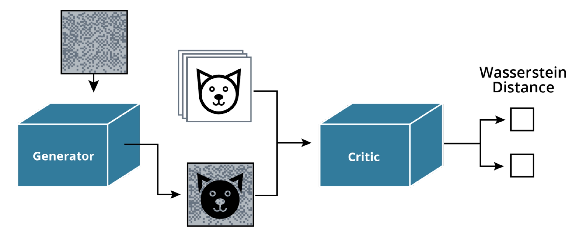
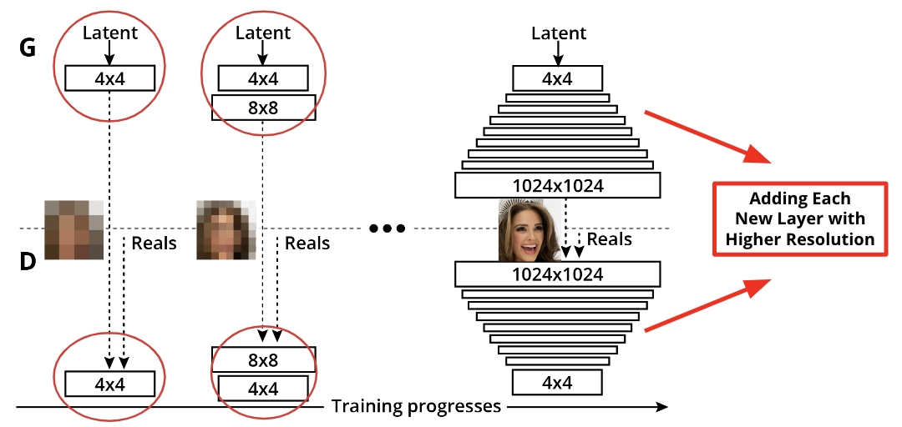
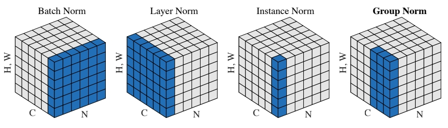
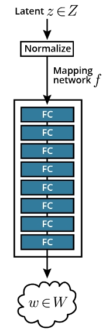
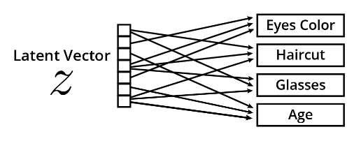

<br>
<br>

# C-5: Modern GANs

<br>
<br>

In this lesson, we will cover how the GAN architectural paradigm has been rethought over the last few years. We will
cover topics such as the:

1. Wasserstein GAN architecture
2. Gradients to improve GAN training stability
3. Growing architectures generators and discriminators
4. StyleGAN model

<br>

<div align="center">
<p>

</p>
<p>figure: Modern GAN Architecture</p>
</div>
<br>

In this lesson on Modern GANs, you will:

1. Use the Wasserstein Distance as a Loss Function for Training GANs
2. Leverage Gradient Penalties to Stabilize GAN Model Training
3. Build a ProGAN Model
4. Build Components of a StyleGAN Model

#### Limitations of the BCE Loss

The original GAN paper [1] already mentions some of the limitations of the BCE Loss, in the section 6 'Advantages and
disadvantages'.

The MiniMax game

This is the minimax game that you should be familiar with.

$$\mathbb{E}[\log(D(x))] + \mathbb{E}[\log(1-D(G(z)))]$$

- We have $x$, a sample from our real distribution, $z$ the latent vector, our discriminator $D$, and our generator $G$.

- The discriminator tries to maximize this expression, which means maximizing the log probability of $x$ being real and
  maximizing the log of the inverse probability of $G(z)$ being real.

- The generator tries to minimize the log of the inverse probability of $G(z)$ being real.

- It is more stable for the generator to maximize the log probability of $G(z)$ being fake.

Challenges of Training GANs The common problems with GANs are:

1. Mode Collapse occurs when the generator only creates some of the modes of the real distribution.
2. Vanishing Gradient occurs when the discriminator loss reaches zero and the generator is not learning anymore.

Addressing Vanishing Gradients Least squares (LSGANs) can partly address the vanishing gradient problem for training
deep GANs.

The problem is as follows:

For negative log-likelihood loss, when an input x is quite big, the gradient can get close to zero and become
meaningless for training purposes. However, with a squared loss term, the gradient will actually increase with a larger
x, as shown below.

Least square loss is just one variant of a GAN loss. There are many more variants such as a Wasserstein GAN loss and
others.

These loss variants sometimes can help stabilize training and produce better results. As you write your own code, you're
encouraged to hypothesize, try out different loss functions, and see which works best in your case!

#### Wasserstein Loss

Here's the OCR text with LaTeX equations:

To prevent mode collapse and vanishing gradient there is another loss function to train GANs:

- The Earth Mover Distance or Wasserstein Metric also referred to as Wasserstein Loss and Wasserstein Distance

The Wasserstein Loss is mathematically represented as follows:

$$\mathbb{E}[C(x)] - \mathbb{E}[C(G(z))]$$

Similar to the BCE Loss, note that the logs have disappeared. Indeed the Wasserstein distance gets rid of the log
function and only considers the probabilities.

With the Wasserstein distance the discriminator is called Critic.

The Critic:

Does not discriminate between real and fake anymore but instead measures the distance between both distributions. Will
try to maximize this expression. Wants to maximize the score of the real distribution and minimize the score of the fake
distribution, which is similar to maximizing its inverse. The generator will try to maximize the critic score of the
fake distribution, which is similar to minimizing it with the flipped label.

The WGAN minimax game is described by the formula above.

When training the critic $C$, we want to maximize the critic score on the real images $x$ and minimize the critic score
on the fake images $G(z)$ which is similar to maximizing the inverse of $C(G(z))$.

When training the generator $G$, we want to maximize the score of the critic for the fake images.

#### Lipschitz continuous

The 1-Lipschitz continuous is a new constraint on the discriminator or critic when using the Wasserstein distance as a
loss function.

Defined mathematically:

For a function $f$, the following condition must be fulfilled: $|\frac{df(x)}{dx}| \leq 1$

Note: For the rest of the class, Critic and Discriminator will be used interchangeably to designate the Discriminator
network.

**Quiz Question**: Which ones of the following are true about the BCE Loss?

| Statement                                                                             | Answer | Explanation                                                                                                                                              |
| ------------------------------------------------------------------------------------- | ------ | -------------------------------------------------------------------------------------------------------------------------------------------------------- |
| The output of the discriminator is bounded between 0 and 1                            | TRUE   | - Uses sigmoid activation for binary classification<br>- Outputs represent probability distribution<br>- Essential for binary cross-entropy calculations |
| Requires the discriminator to be 1-Lipschitz continuous                               | FALSE  | - This is a requirement for Wasserstein GANs (WGAN)<br>- Not needed for standard BCE loss<br>- BCE uses different constraints                            |
| Can lead to vanishing gradients when the real and fake distributions are very similar | TRUE   | - When distributions overlap significantly<br>- Gradient information becomes too small<br>- Makes training unstable                                      |
| Can lead to mode collapse                                                             | TRUE   | - Generator might focus on a single mode to fool discriminator<br>- Loses diversity in generated samples<br>- Common problem with BCE loss               |

**Key Points**:

- BCE Loss has both mathematical limitations (vanishing gradients) and training issues (mode collapse)
- Unlike Wasserstein loss, doesn't require Lipschitz continuity
- Output constraints are fundamental to how BCE works
- These limitations led to development of alternative losses like Wasserstein

WGAN Training Algorithm To train the GAN:

Sample from the real data and generate some fake samples Then calculate the Wasserstein Distance and the gradients at
line 5. Line 6, we perform backpropagation using RMSprop, an optimization algorithm similar to stochastic gradient
descent or Adam Enforce the weights to stay within a threshold of -0.01 and 0.01

#### WGAN algorithm

1 while GAN has not converged: 2 # for each iteration 3 Sample a batch of real data 4 Sample a batch of fake data 5
Calculate the gradient gw 6 Backpropagation w ← w + ɑ RMSProp 7 w ← clip(w, -c, c) In short, weight clipping works, but
is not the best approach to enforce the Lipschitz constraint.

#### Gradient Penalties

The WGAN-GP paper introduced the concept of gradient penalty. In this paper, the authors add a new term to the new loss
function that will penalize high gradients and help enforce the1-Lipschitz constraint. Added to the Wasserstein Loss
formula was the gradient penalty:

$$\lambda \mathbb{E}[(||\nabla_{\hat{x}}C(\hat{x})||_2 - 1)^2]$$

$$\mathbb{E}[C(X)] - \mathbb{E}[C(G(z))] + \lambda \mathbb{E}[(||\nabla_{\hat{x}}C(\hat{x})||_2 - 1)^2]$$

Wasserstein Loss Gradient penalty

$$\lambda$$: penalty coefficient $$\hat{x}$$: uniformly sampled data point between the real and fake distributions

Mathematical representation of gradient penalty

Calculating the gradient penalty also includes a bit of interpolation of the real and fake distribution:

1. Randomly sample a coefficient $$\alpha$$ of between 0 and 1
2. Calculate the interpolation as: $$\hat{x} = \alpha x + (1-\alpha)G(z)$$

#### Gradient Penalties

The WGAN-GP paper introduced the concept of gradient penalty. In this paper, the authors add a new term to the new loss
function that will penalize high gradients and help enforce the1-Lipschitz constraint. Added to the Wasserstein Loss
formula was the gradient penalty:

$$\lambda \mathbb{E}[(||\nabla_{\hat{x}}C(\hat{x})||_2 - 1)^2]$$

$$\mathbb{E}[C(X)] - \mathbb{E}[C(G(z))] + \lambda \mathbb{E}[(||\nabla_{\hat{x}}C(\hat{x})||_2 - 1)^2]$$

Wasserstein Loss Gradient penalty

$$\lambda$$: penalty coefficient $$\hat{x}$$: uniformly sampled data point between the real and fake distributions

Mathematical representation of gradient penalty

Calculating the gradient penalty also includes a bit of interpolation of the real and fake distribution:

1. Randomly sample a coefficient $$\alpha$$ of between 0 and 1
2. Calculate the interpolation as: $$\hat{x} = \alpha x + (1-\alpha)G(z)$$

#### Progressive Growing of GANS

To make training even more stable, the ProGAN model was developed and the current resolution is 16x16.

How ProGAN works

1. It adds a new layer to the generator and a new layer to the discriminator by fading the layers in smoothly.
2. In the generator, the resolution of the 16x16 layer is doubled using an interpolation method such as nearest
   neighbor. The output of the 32x32 layer is then fused with this interpolated output.
3. In the discriminator, the output of the 32x32 layer is fused with a downsampled image.
4. A pooling method such as average pooling is used for downsampling.

<br>

<div align="center">
<p>

</p>
<p>figure: Progressive GAN Training</p>
</div>
<br>

In both cases, perform a weighted sum of the learned output of the new layer with the non-parametric output of the
previous layer.

Slowly increase the weight of the output of the new layer over 10 epochs to reach a stage where there is no need to fade
that layer anymore.

Then train the network at the 32x32 resolution for another 10 epochs.

Layer Fading For more stable training, layer fading is a way to incorporate new layers. Consider the following example:

<br>

<div align="center">
<p>

</p>
<p>figure: Layer Architecture</p>
</div>
<br>

1. Training a ProGAN model and the current resolution is 16x16. The toRGB layer maps the output of the last convolution
   to an RGB image and the from RGB layer takes a RGB image as input and feeds it into the next convolution layer.
2. To increase the resolution to 32x32 use layer fading. Add a new layer to the generator and the discriminator by
   doubling the resolution of the 16x16 layer using an interpolation method such as nearest neighbor.
3. In the generator, fuse the output of the 32x32 layer with the interpolated output.
4. In the discriminator, fuse the output of the 32x32 layer with a downsampled image and use a pooling method such as
   average pooling for downsampling.
5. For both cases, perform a weighted sum of the learned output of the new layer with the non parametric output of the
   previous layer. Slowly increase the weight of the output of the new layer over 10 epochs to reach a stage where a
   fade is not needed in that layer.
6. Train the network at the 32x32 resolution for another 10 epochs

ProGAN Tricks

1. Progressive Growing – Progressively train layers and increase resolution
2. Minibatch Discrimination – Enforce fake and real batches to have similar statistics
3. Equalized Learning Rates – Scale the weights of each layer by a different constant to make sure the layers are
   learning at the same speed
4. Pixelwise Normalization – Normalize each pixel of a feature map along the channel axis

Pixelwise normalization You are familiar with batch normalization and you may be familiar with other type of
normalization, as described in the figure below.

<br>

<div align="center">
<p>

</p>
<p>figure: Group Normalization Process</p>
</div>
<br>

C is the channel dimensions, N the batch dimension and H, W the spatial dimensions. For example, for a batch
normalization layer, we calculate mean and variance over the batch and spatial dimensions, so we have a pair of (mean,
variance) values for each channel.

With pixel normalization, we normalize each pixel of the input volume as follow:

y = x.pow(2.0).mean(dim=1, keepdim=True).add(alpha).sqrt() x = x / y where x is the input volume of dimensions (NCHW).
We square the input volume, calculate the mean over the channel dimension, add a very small factor alpha and calculate
the square root.

Minibatch Standard Deviation The paper, Improved Techniques for Training GANs [3], introduced the concept of minibatch
discrimination, to enforce similarities between batches of real and fake images.

In the ProGAN paper, the authors simplify this idea by introducing minibatch standard deviation. They create a new layer
that adds a feature map to the input. This layer does the following:

calculate the standard deviation for each feature and spatials locations replicate the value and concatenate it over all
spatial locations

```python
def minibatch_stddev_layer(x, group_size=4):
    with tf.variable_scope('MinibatchStddev'):
        group_size = tf.minimum(group_size, tf.shape(x)[0])     # Minibatch must be divisible by (or smaller than) group_size.
        s = x.shape # [NCHW]  Input shape.
        y = tf.reshape(x, [group_size, -1, s[1], s[2], s[3]])   # [GMCHW] Split minibatch into M groups of size G.
        y = tf.cast(y, tf.float32)                              # [GMCHW] Cast to FP32.
        y -= tf.reduce_mean(y, axis=0, keepdims=True)           # [GMCHW] Subtract mean over group.
        y = tf.reduce_mean(tf.square(y), axis=0)                # [MCHW]  Calc variance over group.
        y = tf.sqrt(y + 1e-8)                                   # [MCHW]  Calc stddev over group.
        y = tf.reduce_mean(y, axis=[1,2,3], keepdims=True)      # [M111]  Take average over fmaps and pixels.
        y = tf.cast(y, x.dtype)                                 # [M111]  Cast back to original data type.
        y = tf.tile(y, [group_size, 1, s[2], s[3]])             # [N1HW]  Replicate over group and pixels.
        return tf.concat([x, y], axis=1)                        # [NCHW]  Append as new fmap.
```

The code above is taken from the original implementation in TensorFlow but the PyTorch version is very similar.

Note how the authors are calculating the standard deviation per group of 4 pixels here.

This new layer is added only in the discriminator obviously and towards the end of the network.

#### StyleGAN

Deep learning is a somewhat recent field and many consider the 2012 AlexNet paper as the starting point of the deep
learning revolution. The progress in creating realistic generated images is most exemplified by the StyleGAN paper in
2019 as it was the first architecture to produce very high-quality samples.

The Traditional Generator For a traditional generator:

We input a latent vector z. Run it through a bunch of fully connected, convolution and normalization layers. Get a
generated RGB image. The StyleGAN Generator For the StyleGAN generator :

There is a new network, only made of fully connected layer, the mapping network, and it is taking the latent vector and
outputs a new latent vector w. Add noise at multiple places in the network, always after the convolution layers.
StyleGAN uses a new type of normalization layer, the adaptive instance normalization layer, or AdaIn. Next, we will
dissect each one of these new components and understand how they were leveraged to create such high quality images.

<br>

<div align="center">
<p>

</p>
<p>figure: StyleGAN Architecture</p>
</div>
<br>

#### Components

**StyleGAN in Simple Terms:** Think of StyleGAN as an AI artist that can:

- Create images with specific styles (like painting portraits)
- Control different aspects separately (like hair color, age, facial features)
- Add realistic details (like skin texture, wrinkles)
- Mix different styles together (like combining two faces)

**StyleGAN Technical Definition:** A generative adversarial network architecture that:

- Separates high-level attributes through style mapping
- Uses adaptive normalization for feature manipulation
- Implements stochastic variation for detail generation
- Enables disentangled style control at different scales

**StyleGAN Components Table:**

| Component                               | Function                                                                                    | Technical Details                                                                                                  | Real-World Analogy                                                                 |
| --------------------------------------- | ------------------------------------------------------------------------------------------- | ------------------------------------------------------------------------------------------------------------------ | ---------------------------------------------------------------------------------- |
| Mapping Network                         | Fully connected layers that map latent vector z to latent vector w. Helps with entanglement | - Transforms random noise (z) into style vectors (w)<br>- Multiple FC layers<br>- Improves feature disentanglement | Like a translator converting raw ideas into specific style instructions            |
| Noise Injection                         | Adding Gaussian noise at multiple places in the generator helps with stochastic variation   | - Adds random noise at different resolutions<br>- Controls fine detail generation<br>- Creates natural variations  | Like adding random texture details to make images more realistic (pores, wrinkles) |
| AdaIN (Adaptive Instance Normalization) | Projects the latent vector w to styles and injects them into the generator                  | - Normalizes feature maps<br>- Applies style-based transformations<br>- Controls specific attributes               | Like an artist's tool that applies specific styles to different parts of the image |

##### Key Features:

1. **Progressive Generation:**

   - Builds images from low to high resolution
   - Maintains consistency across scales

2. **Style Control:**

   - Separate control over different features
   - Ability to mix styles at different levels

3. **Quality Improvements:**
   - Better feature disentanglement
   - More realistic detail generation
   - Improved style control

This architecture revolutionized GAN-based image generation by providing better control and quality in generated images.

Controllable Generation Conditional Generation indicates that the training set must be labeled and conditioning is
limited to examples from the training set.

Conditional Generation – each image is conditioned with a label (e.g. MNIST dataset). For example, fake 11s can not be
generated with a conditional GAN trained on the MNIST dataset because the data set only includes digits in the range of
0 to 9.

Conditional Generative Adversarial Nets [1] introduced the conditional GAN. An example of conditional implementation in
PyTorch can be viewed in the PyTorch-GAN CGAN implementation on GitHub. Conditional GANs have an extra input from the
discriminator and generator networks.

For controllable generation, instead of inputting a label to condition the output, the latent vector z is modified to
control the aspect of the output. This makes the assumption that the components of z each control a different aspect of
the output image.

Controllable Generation – does not require labels. The Mapping Network The mapping network is a new component of the
StyleGAN generator. A mapping network:

1. Takes the latent vector z as input
2. Outputs a new latent vector w
3. Helps to disentangle the latent vector z for controllable generation.

<br>

<div align="center">
<p>

</p>
<p>figure: Mapping Network Structure</p>
</div>

<br>

The Entanglement Problem When modifying some components, we impact more than one feature. This is the entanglement
problem.

For example in trying to generate faces, features could include:

1. Haircut
2. Eye color
3. Glasses
4. Age

<br>

<div align="center">
<p>

</p>
<p>figure: Feature Entanglement Visualization</p>
</div>

<br>

If the features are entangled, putting glasses on a person could also make them older.

Mapping network to the rescue! By mapping the vector z to another vector w, the generator gets the capacity to
disentangle features.

Noise Injection Another new component of StyleGAN is the injection of noise at different locations in the generator.
This noise injection will:

Help with stochastic variation! Injecting noise in the network will help create more diverse features. Happen at
different locations in the network and impacts the variability of the images at different levels. To add noise:

1. A random feature map is sampled from a gaussian distribution
2. The map is multiplied by a learned scaling factor
3. This noise is applied to the output of the convolutional layers

<br>

<div align="center">
<p>

</p>
<p>figure: Noise Injection Process</p>
</div>

<br>

All Normalization Layers calculate the mean and the variance of a certain subset and normalize the input.

Remember, for Batch Normalization, we:

1. Calculate the mean and variance of the batch and spatial dimensions
2. For each channel of the inputs, there are different values of means and variance

Instance Normalization Layer The Instance Normalization Layer – only normalizes over the spatial dimensions and each
input has a number of channels times the batch size values of means and variance.

<br>

<div align="center">
<p>

</p>
<p>figure: Normalization Layer Structure</p>
</div>
<br>

Adaptive Instance Normalization Layer The Adaptive Instance Normalization Layer (Adaln):

1. Takes the latent vector, w, as input and using a fully connected layer, projects that vector into two vectors of
   style, $y_{s}^{y_{s}^{}}$ and $y_{b}^{y_{b}^{}}$
2. The output of the previous layer goes through an Instance Normalization Layer.
3. Use the styles $y_{s}^{y_{s}^{}}$ and $y_{b}^{y_{b}^{}}$ to scale and bias the output of the Instance Normalization Layer.
4. Allows one to project the latent vector w into the styles and inject the styles into the generator.

Style Mixing injects a different vector w at different places in the network and provides a regularization effect. This
prevents the network from assuming that adjacent styles are correlated.

<br>

<div align="center">
<p>

</p>
<p>figure: Adaptive Instance Normalization</p>
</div>

<br>

Style Transfer In practice, Adaln layers allow for the creation of a new image (c) by taking a first image (a) and
modifying it in the style of a second image (b). A popular example is taking the image of the Mona Lisa (a) and the
style of a Picasso painting (b) and creating a new Mona Lisa in Picasso style image (c). This image can be seen here and
this process is known as style transfer.

The initial process of style transfer was time consuming; however, check out the paper, Arbitrary Style Transfer in
Real-time with Adaptive Instance Normalization, which details a use case for how Adaln layers may be implemented to
create fast style transfers based on arbitrary styles.

### When to Use Modern GAN Techniques

Starting with a simpler architecture is always an easy and fast way to get started on a new problem.

DCGAN is great starting point ProGAN or StyleGAN are practical when training on high resolution images Wasserstein Loss
and Gradient Penalties experimentation is recommended when mode collapse or vanishing gradient are observed

<br>

<div align="center">
<p>

</p>
<p>figure: AdaIN Layer Operation</p>
</div>

<br>

