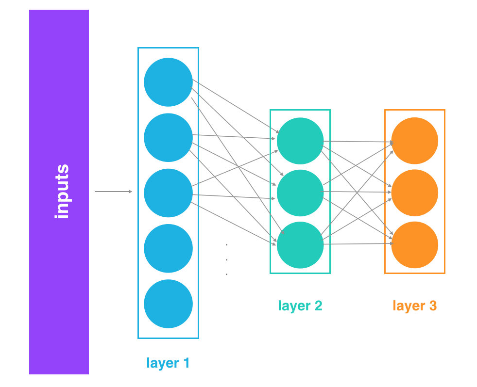
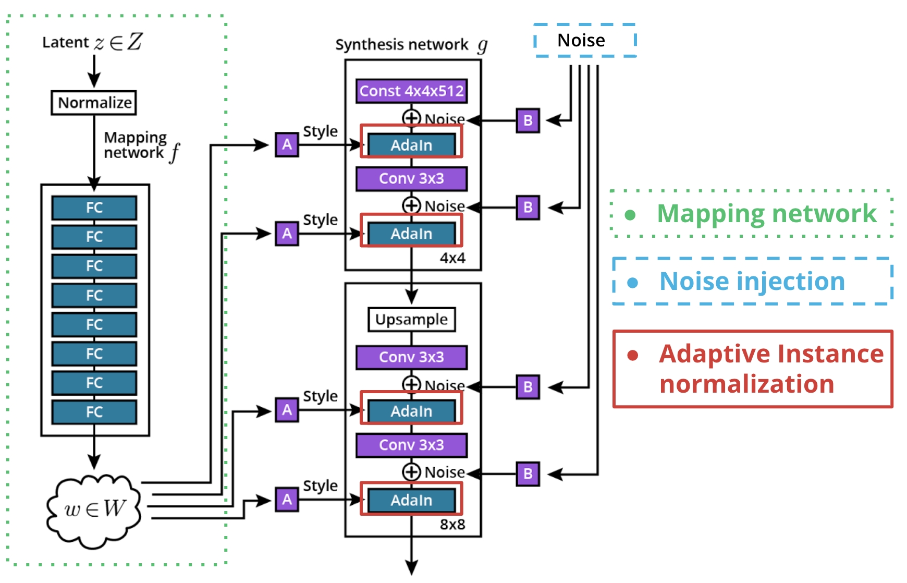
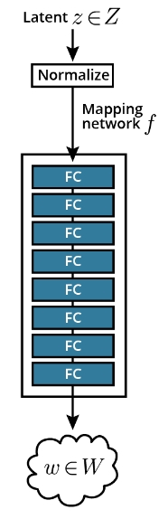

# S-4: Building Generative Adversarial Networks

# C-1: Generative Adversarial Networks

1. Fundamentals of Generative Adversarial Networks
    - GAN Architecture and Core Concepts
    - Applications of GANs
    - Challenges in GAN Training
    - The Generator-Discriminator Dynamic
2. Game Theory and GANs
    - Minimax Game Framework
    - Equilibrium Concepts
    - Value Function Mechanics
    - Comparison with Traditional ML Optimization
3. GAN Training Techniques
    - Activation Functions and Their Roles
    - Architecture Design Choices
    - Loss Functions and Optimization
    - Label Smoothing and Training Stability
4. Scaling GANs with Convolutional Neural Networks
    - DCGAN Architecture
    - Batch Normalization
    - Transitioning Between Feature Map Sizes
5. Case Study: MNIST GAN Implementation
    - Generator and Discriminator Design
    - Training Workflow
    - Adversarial Learning Process

#### Fundamentals of Generative Adversarial Networks

##### GAN Architecture and Core Concepts

Generative Adversarial Networks (GANs) represent one of the most innovative approaches to generative modeling in machine
learning. Introduced by Ian Goodfellow and colleagues in 2014, GANs have revolutionized how we create synthetic data
across multiple domains.

At their core, GANs consist of two neural networks engaged in a competitive process:

1. **Generator Network (G)**: This network creates synthetic data by transforming random noise (from a latent space)
   into outputs that resemble a target distribution. The generator never directly sees the actual training data but
   learns to produce convincing samples through feedback from the discriminator.
2. **Discriminator Network (D)**: This network functions as a binary classifier, learning to distinguish between real
   data samples from the training set and fake samples produced by the generator. The discriminator outputs a
   probability value indicating how likely it believes an input is real rather than generated.

Think of this as a counterfeit money scenario: the generator is like a counterfeiter trying to create fake currency,
while the discriminator is like a bank teller trying to spot the counterfeits. As the counterfeiter gets better, the
bank teller must become more discerning, and as the bank teller improves, the counterfeiter must create more convincing
fakes.

The adversarial process works through a continuous feedback loop:

- The generator takes random noise vectors as input and produces synthetic samples
- The discriminator evaluates both real samples from the training data and fake samples from the generator
- The generator improves by learning to create more convincing fakes that can fool the discriminator
- The discriminator improves by getting better at detecting subtle differences between real and generated samples

This process can be formalized mathematically as a minimax game with the following value function:

$$\min_G \max_D V(D, G) = \mathbb{E}*{x \sim p*{data}(x)}[\log D(x)] + \mathbb{E}_{z \sim p_z(z)}[\log(1 - D(G(z)))]$$

Where:

- $p_{data}(x)$ is the distribution of real data
- $p_z(z)$ is the prior distribution of the latent space (typically Gaussian noise)
- $D(x)$ is the discriminator's estimate of the probability that $x$ is real
- $G(z)$ is the generator's output when given noise $z$

In an ideal scenario, the generator creates samples indistinguishable from real data, causing the discriminator to
output 0.5 for all inputs (essentially random guessing) - a state of equilibrium where neither network can improve
further.

##### Applications of GANs

GANs have found remarkable applications across numerous domains due to their ability to generate high-quality synthetic
data:

1. **Image Generation**: Creating realistic images from scratch, enabling applications in art, design, and content
   creation. This includes photorealistic face generation (like the famous StyleGAN faces), scene creation, and artistic
   style generation.
2. **Image-to-Image Translation**: Converting images from one domain to another while preserving structural content.
   Examples include:
    - Converting sketches to photorealistic images
    - Transforming daytime scenes to nighttime
    - Changing seasons in landscape photographs
    - Colorizing black and white images
3. **Super-Resolution**: Enhancing low-resolution images to higher resolution versions with realistic details that
   weren't present in the original. This has applications in forensics, restoration of old footage, and improving image
   quality.
4. **Data Augmentation**: Generating additional training samples to improve other machine learning models, particularly
   useful in domains where real data is scarce or expensive to collect, such as medical imaging.
5. **Text-to-Image Synthesis**: Creating images based on textual descriptions, bridging the gap between natural language
   and visual content. This technology underlies many modern AI art generators.
6. **Video Generation and Manipulation**: Extending GAN concepts to temporal data, allowing for video synthesis and
   modification, including motion transfer and video prediction.
7. **"Deep Fakes"**: Synthesizing realistic videos or images of people saying or doing things they never actually did,
   raising significant ethical considerations and prompting research into detection methods.
8. **Domain Adaptation**: Transferring knowledge from one domain to another where labeled data might be lacking, helping
   models generalize better across different data distributions.
9. **Privacy Preservation**: Creating synthetic data that maintains statistical properties of sensitive datasets without
   exposing real individuals' information, useful in healthcare and financial applications.
10. **3D Object Generation**: Generating three-dimensional models and textures for use in gaming, virtual reality, and
    simulation environments.

The versatility of GANs comes from their ability to learn and model complex data distributions without explicit
programming of the rules that govern those distributions. Instead, they learn implicitly through the adversarial
process.

##### Challenges in GAN Training

Despite their powerful capabilities, GANs are notoriously difficult to train effectively. Their unique architecture
introduces several key challenges:

1. **Training Instability**: The adversarial nature creates a dynamic optimization landscape that can lead to
   oscillations rather than convergence. Small changes in either network can dramatically affect the training
   trajectory, sometimes causing training to fail entirely.
2. **Mode Collapse**: A phenomenon where the generator produces only a limited variety of outputs, failing to capture
   the full diversity of the target distribution. This occurs when the generator finds a few outputs that reliably fool
   the discriminator and exploits them repeatedly. For example, in an image generation task, the model might only
   generate a few types of faces rather than the full spectrum of possible faces.
3. **Vanishing Gradients**: When the discriminator becomes too effective too quickly, it can provide near-zero gradients
   to the generator, stalling the learning process. Imagine if our bank teller became perfect at spotting counterfeits
   immediately – the counterfeiter would receive no useful feedback about how to improve.
4. **Balance Between Networks**: Finding the right training schedule between the generator and discriminator is crucial.
   If one network becomes significantly stronger than the other, the weaker network may never recover, leading to failed
   training. This is like maintaining a productive competition where both sides continue to improve.
5. **Evaluation Difficulty**: Unlike many machine learning models, GANs lack a single clear metric for evaluation.
   Determining whether a GAN is performing well often requires subjective human assessment or complex composite metrics
   like the Fréchet Inception Distance (FID) or Inception Score (IS).
6. **Computational Intensity**: Training effective GANs typically requires substantial computational resources and time,
   especially for high-resolution or complex data generation. This can make experimentation and iteration slower
   compared to other types of models.
7. **Hyperparameter Sensitivity**: GAN performance can vary dramatically based on architectural choices, learning rates,
   and other hyperparameters. Finding the right configuration often requires extensive experimentation.
8. **Non-convergence**: The minimax game doesn't always lead to a stable equilibrium, sometimes resulting in cyclical
   behavior rather than convergence.

Mathematical analysis shows that the GAN optimization problem involves finding the saddle point of a high-dimensional,
continuous, and non-convex function—a fundamentally challenging scenario in optimization theory. Because of these
challenges, researchers have developed numerous techniques to stabilize training, including Wasserstein GANs, gradient
penalty methods, spectral normalization, and progressive growing approaches.

##### The Generator-Discriminator Dynamic

The relationship between the generator and discriminator creates a fascinating dynamic that drives the learning process.
Understanding this interplay helps illustrate why GANs are so powerful yet challenging to train.

**The Generator's Perspective**:

1. Initially produces random, unrealistic outputs from noise
2. Receives feedback through the discriminator's classifications
3. Adjusts parameters to increase the probability of fooling the discriminator
4. Gradually learns the underlying structure and patterns of the target data distribution
5. Never directly sees real data but learns through the discriminator's feedback

**The Discriminator's Perspective**:

1. Initially cannot differentiate between real and fake samples (performs at chance level)
2. Improves by learning the characteristics of real data and the flaws in generated data
3. Provides increasingly refined feedback to guide the generator
4. Becomes more discerning as training progresses
5. In ideal training, eventually reaches a point where it cannot reliably distinguish real from fake (accuracy around
   50%)

To understand this dynamic, consider a practical example of generating handwritten digits:

- Early in training, the generator produces random patterns of pixels with no recognizable structure
- The discriminator quickly learns to distinguish these random patterns from real handwritten digits
- The generator begins to produce patterns with some digit-like structure, but with unrealistic distortions
- The discriminator learns to identify these specific distortions
- The generator refines its outputs to eliminate the obvious distortions
- The discriminator must find more subtle differences
- This process continues until the generated digits closely resemble real handwritten digits

This adversarial dynamic creates a self-improving system through competition. Unlike traditional supervised learning
paradigms where the goal is straightforward optimization, GANs create a game-theoretic scenario where both networks
drive each other to improve.

The training process can be thought of as a negotiation toward Nash equilibrium—a game state where neither player can
improve by unilaterally changing their strategy. At this theoretical equilibrium:

- The generator perfectly models the true data distribution
- The discriminator can do no better than random guessing
- Neither network can improve without the other becoming worse

In practice, achieving perfect equilibrium is rare, but the closer we get, the better our generated samples become. The
dynamic, self-adjusting nature of GANs is what allows them to generate such remarkably realistic outputs without being
explicitly programmed to understand the rules of what makes data "realistic" in the first place.

#### Game Theory and GANs

##### Minimax Game Framework

Generative Adversarial Networks fundamentally operate as a two-player minimax game from game theory, creating a dynamic
that drives both networks to improve through competition. This game-theoretic approach represents a significant
departure from traditional machine learning optimization.

In this framework, the generator and discriminator engage in a zero-sum game where one player's gain exactly equals the
other player's loss. The generator aims to minimize the game's value function, while the discriminator tries to maximize
it—hence the term "minimax."

To understand this concept intuitively, imagine a game between a forger (the generator) and a detective (the
discriminator):

- The forger wants to create counterfeit art that fools the detective
- The detective wants to correctly identify genuine art and counterfeits
- When the forger succeeds, the detective loses
- When the detective succeeds, the forger loses

The formal representation of this game is given by the value function:

$$\min_G \max_D V(D, G) = \mathbb{E}*{x \sim p*{data}(x)}[\log D(x)] + \mathbb{E}_{z \sim p_z(z)}[\log(1 - D(G(z)))]$$

Breaking down this equation into more understandable parts:

- The first term represents the discriminator's ability to correctly identify real data samples. When the discriminator
  correctly classifies real examples (D(x) approaches 1), this term's value increases.
- The second term represents the discriminator's ability to correctly identify fake samples from the generator. When the
  discriminator correctly identifies fakes (D(G(z)) approaches 0), this term's value increases.
- The generator wants to minimize this function (make the discriminator perform poorly)
- The discriminator wants to maximize this function (classify correctly)

When we look at this from each player's perspective:

1. The discriminator maximizes the probability of correctly classifying both real and generated samples
2. The generator minimizes the probability of the discriminator correctly classifying generated samples

What makes this game special is that even though the players are competing against each other, their competition creates
a positive outcome: a generator that produces increasingly realistic data. This cooperative result emerges from the
competitive process, similar to how economic competition can drive innovation that benefits consumers.

##### Equilibrium Concepts

The theoretical optimal point in GAN training is reaching what game theory calls a Nash equilibrium—specifically, a
saddle point in the value function landscape. Named after mathematician John Nash, this equilibrium represents a state
where neither player can unilaterally improve their situation.

At this equilibrium:

- The generator produces samples indistinguishable from real data
- The discriminator achieves only 50% accuracy (equivalent to random guessing)
- Neither network can unilaterally improve its performance

This equilibrium represents the generator perfectly modeling the true data distribution, where:

$$p_g = p_{data}$$

Let's examine what happens at this optimal point mathematically:

For a given discriminator strategy, the optimal generator strategy is to produce data matching the true distribution.
For a given generator strategy, the optimal discriminator outputs:

$$D^*(x) = \frac{p_{data}(x)}{p_{data}(x) + p_g(x)}$$

When the generator perfectly models the true distribution, this becomes:

$$D^*(x) = \frac{p_{data}(x)}{p_{data}(x) + p_{data}(x)} = \frac{1}{2}$$

That is, the discriminator can do no better than random guessing—outputting 0.5 for every input.

To understand this intuitively, think about a counterfeit detection game where the counterfeits become perfect replicas.
If the counterfeit bills were absolutely identical to real ones, even the best expert would be reduced to random
guessing.

The saddle point has important mathematical properties:

- It is simultaneously a local minimum for the generator's cost
- And a local maximum for the discriminator's cost
- With respect to each player's parameters

Visualize this as a mountain saddle where going forward and backward leads uphill, but going left and right leads
downhill. For the discriminator, moving in its parameter directions leads uphill (improvement), while for the generator,
moving in its directions leads downhill (improvement).

Reaching this equilibrium in practice is challenging because:

1. The parameter space is high-dimensional (millions of parameters)
2. The value function is non-convex (many hills and valleys)
3. Training involves alternating optimization rather than simultaneous updates
4. The dynamics can lead to oscillation or mode collapse rather than convergence

GAN training rarely reaches a perfect equilibrium in practice, but the closer it gets to this theoretical point, the
better the generated samples become at reflecting the target distribution. Various modifications to the standard GAN,
like Wasserstein GANs, aim to make this equilibrium easier to approach.

##### Value Function Mechanics

The GAN value function operates differently from traditional loss functions in several key ways. Understanding its
mechanics illuminates how GANs learn and why their training dynamics are unique.

Unlike standard neural networks with a single optimization goal, GANs involve two interlinked but opposing objectives:

- **Discriminator**: Maximize correct classification (real vs. fake)
- **Generator**: Maximize discriminator errors on generated samples

This creates a more complex optimization landscape than what we see in traditional neural networks. Let's explore how
this value function works in practice:

**Gradient Flow Through Both Networks**: When the generator produces an image, it passes through the discriminator for
evaluation. During backpropagation:

- Gradients flow backward through the discriminator
- Then back through the generator
- The generator thus learns indirectly through the discriminator's assessment

This indirect learning is like a student who only knows if their answer is right or wrong, but never sees the correct
answer. They must infer what makes an answer correct through trial and error.

**Non-Saturating Loss**: In practice, rather than minimizing $\log(1-D(G(z)))$, generators often maximize
$\log(D(G(z)))$ to prevent vanishing gradients early in training:

- Original (saturating) loss: $\min_G \mathbb{E}_z[\log(1-D(G(z)))]$
- Non-saturating alternative: $\max_G \mathbb{E}_z[\log(D(G(z)))]$

The non-saturating version provides stronger gradients when the generator is producing obviously fake samples, helping
it learn faster in the early stages of training.

To understand why, consider what happens with the original loss when the discriminator easily identifies fakes (D(G(z))
is close to 0). The gradient of $\log(1-D(G(z)))$ becomes very small, giving the generator little information about how
to improve. With the non-saturating loss, even when the discriminator is confident, the gradient remains substantial
enough to guide learning.

**Alternative Value Functions**: The original GAN formulation can suffer from various training issues, leading
researchers to develop alternative value functions:

- **Wasserstein GAN** uses the Earth Mover's distance, which provides more stable gradients even when the generator and
  discriminator distributions don't overlap.
- **Least Squares GAN** replaces the log-loss with squared error, which penalizes samples that are far from the decision
  boundary more strongly.
- **WGAN-GP** adds a gradient penalty term to enforce Lipschitz constraints, stabilizing training.
- **Hinge loss** formulations create a margin between real and fake samples.

Each of these alternatives modifies the game dynamics to make equilibrium easier to reach while preserving the
adversarial nature of the training.

**Adversarial Feedback Loop**: The value function creates a feedback loop where:

- Generator improvement forces discriminator improvement
- Discriminator improvement guides generator improvement
- This continuous push-pull drives learning

This dynamics resembles evolutionary arms races in nature, where predators and prey continuously evolve in response to
each other, driving the development of increasingly sophisticated capabilities on both sides.

##### Comparison with Traditional ML Optimization

The GAN optimization approach differs fundamentally from traditional machine learning paradigms in several important
ways that explain both why GANs are so powerful and why they're challenging to train.

**Traditional ML Optimization:**

1. Single objective function to minimize
2. Clear optimization target (e.g., minimize error, maximize likelihood)
3. Stable optimization landscape
4. Convergence often guaranteed with appropriate learning rates
5. Progress measured by direct metrics (accuracy, precision, recall)
6. Model parameters optimized independently of other models

**GAN Optimization:**

1. Two competing objective functions
2. Indirect optimization target (reach Nash equilibrium)
3. Dynamically changing optimization landscape (as both networks evolve)
4. Convergence not guaranteed and often oscillatory
5. Progress difficult to measure objectively
6. Each model's parameters depend on the other model's current state

This comparison reveals why GAN training is more challenging. Let's explore these differences more deeply:

In traditional supervised learning, we might minimize a cross-entropy loss:
$$L = -\sum_i y_i \log(\hat{y}_i) + (1-y_i)\log(1-\hat{y}_i)$$

The gradient always points toward a clear global objective. As the model improves, the loss consistently decreases. It's
like hiking down a mountain where you always want to go downhill.

In contrast, GAN training involves a more complex dynamic:

- The discriminator improves, changing the generator's objective
- The generator improves, changing the discriminator's objective
- This creates a moving target for both networks

It's like trying to climb down a mountain that changes its shape each time you take a step.

**Mathematical Perspective:** Consider these mathematical views:

1. **Optimization View**: Traditional ML seeks a minimum in a fixed landscape
2. **Game Theory View**: GANs seek equilibrium in a landscape that changes with each move

**Conceptual Differences:** Traditional generative models often use maximum likelihood estimation, directly modeling the
data distribution. GANs use an adversarial process to implicitly approximate the data distribution without ever directly
computing probability densities.

This is similar to the difference between:

- Learning a language by studying grammar rules (explicit learning)
- Learning a language through conversation with native speakers (implicit learning)

This game-theoretic foundation gives GANs their unique power but also introduces their characteristic training
difficulties. While traditional ML optimization is like climbing down a fixed mountain to find the lowest point, GAN
optimization is more like two climbers affecting each other's mountains as they move—a fundamentally more complex
scenario that requires specialized training techniques.

The innovation of GANs lies in this very complexity: by setting up this adversarial game, we can learn to generate data
that mimics complex real-world distributions without ever having to explicitly model those distributions. This implicit
approach allows GANs to generate remarkably realistic outputs for distributions that would be extremely difficult to
model explicitly.

#### GAN Training Techniques

##### Activation Functions and Their Roles

Activation functions play crucial roles in GAN architecture, with each function serving specific purposes in different
parts of the network. Choosing the right activation functions significantly impacts training stability and the quality
of generated outputs.

**Hyperbolic Tangent (tanh)**

The hyperbolic tangent function is mathematically defined as:

$$\tanh(x) = \frac{e^x - e^{-x}}{e^x + e^{-x}}$$

In GANs, tanh is commonly used as the output activation function for the generator for several important reasons:

- It bounds outputs between -1 and 1, creating a natural range for normalized image pixel values
- Its zero-centered nature helps with gradient flow during backpropagation
- The symmetric output range works well for image generation where pixel values can be naturally mapped from [-1,1] to
  [0,255]

Think of tanh as a "normalizer" that keeps the generator's outputs within a controlled range. Without this constraint,
the generator might produce wildly varying values that would be difficult for the discriminator to evaluate
consistently.

When using tanh as the generator's output activation, it's essential to scale your training data to the [-1,1] range for
consistency. This normalization ensures that the generator's targets match the function's output range, creating a level
playing field for comparison.

<div align="center">
<p>

</p>
<p>figure: GAN Training Workflow</p>
</div>

**Leaky ReLU**

The Leaky ReLU function is defined as:

$$f(x) = \begin{cases} x & \text{if } x > 0 \ \alpha x & \text{if } x \leq 0 \end{cases}$$

Where α is typically a small value like 0.01 or 0.2.

Leaky ReLU plays a vital role in GAN training because:

- It prevents the "dying ReLU" problem where neurons can get stuck during training
- It allows small negative values to pass through, maintaining gradient flow even for negative inputs
- This property is especially important for generators, which need to learn features in both positive and negative
  spaces
- It helps ensure that gradients can flow through the entire architecture

To understand the importance of Leaky ReLU, imagine trying to navigate a mountain in complete darkness. Standard ReLU is
like a flashlight that only illuminates paths going uphill, leaving downhill paths completely dark. Leaky ReLU provides
a dim light for downhill paths too, ensuring you don't get completely lost if you need to go down temporarily to
ultimately reach a higher peak.

In practice, Leaky ReLU is often used in both the generator and discriminator hidden layers, significantly improving
training stability compared to regular ReLU. This small modification makes a substantial difference in preventing parts
of the network from becoming inactive during the sensitive GAN training process.

**Sigmoid**

The sigmoid function is defined as:

$$\sigma(x) = \frac{1}{1 + e^{-x}}$$

In GANs, sigmoid serves a specific purpose:

- It's commonly used as the final activation of the discriminator
- It converts raw logits into probability values between 0 and 1
- This allows the discriminator to output the probability that an input is real rather than generated
- The output can be interpreted as: 0 = definitely fake, 1 = definitely real, 0.5 = uncertain

The sigmoid function essentially acts as the discriminator's "judgment mechanism," turning its complex internal
calculations into a simple probability assessment. Think of it as a judge who evaluates all the evidence and delivers a
final verdict between 0 and 1.

When implementing the discriminator, it's important to use the sigmoid only at the final layer, while using Leaky ReLU
for hidden layers to maintain healthy gradient flow throughout the network.

The combination of these activation functions—tanh for generator output, Leaky ReLU for hidden layers, and sigmoid for
discriminator output—creates a balanced architecture that supports stable training and high-quality generation. Each
function addresses specific challenges in the GAN training process, working together to enable the adversarial learning
that makes GANs so powerful.

##### Architecture Design Choices

Effective GAN architecture design balances model complexity, training stability, and generation quality. Several key
design principles have emerged from research and practice to help navigate these trade-offs.

**Fully Connected Architecture**

For simple generation tasks, fully connected architectures can be effective when:

- The data doesn't have spatial structure requiring convolution (like simple tabular data)
- No sequential dependencies require recurrent connections
- The output dimensions are relatively small

A basic fully connected GAN might look like this:

1. **Generator**:
    - Input: Random noise vector (e.g., 100 dimensions)
    - Hidden layers: 2-3 fully connected layers with gradually increasing sizes
    - Output: Fully connected layer with dimensions matching the target data
2. **Discriminator**:
    - Input: Either real data or generator output
    - Hidden layers: 2-3 fully connected layers with gradually decreasing sizes
    - Output: Single value (probability of being real)

However, fully connected architectures quickly become impractical for generating complex data like images of moderate to
high resolution. For instance, a 128×128 RGB image has 49,152 dimensions, which would require an enormous number of
parameters in a fully connected network, leading to inefficient training and potential overfitting.

**Convolutional Architecture (DCGAN)**

For scaling GANs to handle larger images, convolutional architectures become essential. The Deep Convolutional GAN
(DCGAN) introduced key architectural guidelines that dramatically improved GAN performance on image generation tasks.

**Generator**: Uses transposed convolutions (sometimes called deconvolutions) to upsample from latent space to full
image

- Starts with small, deep feature maps (e.g., 4×4×512)
- Progressively increases spatial dimensions while decreasing depth
- Follows the pattern: latent vector → dense layer → reshape → series of transposed convolutions

For example, a DCGAN generator might transform a 100-dimensional noise vector into a 64×64 RGB image through these
steps:

1. Dense layer: 100 → 4×4×512 (reshaped to spatial dimensions)
2. Transposed conv: 4×4×512 → 8×8×256
3. Transposed conv: 8×8×256 → 16×16×128
4. Transposed conv: 16×16×128 → 32×32×64
5. Transposed conv: 32×32×64 → 64×64×3 (final RGB image)

**Discriminator**: Uses standard convolutions, mirroring a traditional CNN classifier

- Starts with wide, shallow feature maps (the input image)
- Progressively decreases spatial dimensions while increasing depth
- Follows the pattern: image → series of convolutions → flatten → dense layer(s) → single output

The corresponding discriminator might process the 64×64 RGB image like this:

1. Conv: 64×64×3 → 32×32×64
2. Conv: 32×32×64 → 16×16×128
3. Conv: 16×16×128 → 8×8×256
4. Conv: 8×8×256 → 4×4×512
5. Flatten: 4×4×512 → 8192
6. Dense: 8192 → 1 (final probability)

This complementary structure allows both networks to effectively process image data at different resolutions. Think of
the generator as gradually building an image from a blueprint (going from abstract to concrete), while the discriminator
breaks down an image into its core elements to evaluate authenticity (going from concrete to abstract).

**Batch Normalization**

Batch normalization is crucial for stable GAN training and is typically applied after most layers except:

- The output layer of the generator (to preserve the output distribution)
- The input layer of the discriminator (to preserve input statistics)

Batch normalization helps by:

- Stabilizing training by normalizing activations
- Reducing internal covariate shift
- Allowing higher learning rates
- Helping gradients flow through the deep network

Imagine batch normalization as a standardization process that keeps all the signals in your network in a consistent,
manageable range - like a voltage regulator that prevents electrical components from receiving too much or too little
power.

**Skip Connections**

For more advanced GANs, skip connections (similar to those in ResNet or U-Net) can:

- Improve gradient flow
- Allow the preservation of fine details
- Help maintain global structure in generated outputs

Skip connections work by providing shortcuts for information to flow directly from earlier to later layers. This is
particularly useful in image generation tasks where both low-level details (textures, edges) and high-level structure
(object shapes, overall composition) need to be preserved.

**Network Depth and Width**

The capacity of GAN networks should be balanced:

- Too shallow networks lack modeling capacity
- Too deep networks may face training difficulties
- Generally, the discriminator should have slightly more capacity than the generator to prevent mode collapse
- Too powerful a discriminator can lead to vanishing gradients for the generator

Think of this balancing act as setting up a fair but challenging game. If the discriminator (detective) is far too
powerful, the generator (counterfeiter) gets no useful feedback and gives up. If the generator is too powerful, it can
easily fool the discriminator without learning the true data distribution.

The optimal architecture depends on the complexity of the target data distribution. For simple datasets like MNIST
(handwritten digits), smaller networks with fewer layers might suffice. For complex, high-resolution images like faces
or natural scenes, deeper networks with more capacity become necessary.

This balancing act is essential—the networks should be evenly matched for optimal training dynamics, with the
discriminator maintaining a slight edge to provide constructive feedback to the generator.

##### Loss Functions and Optimization

Choosing appropriate loss functions and optimization strategies is crucial for successful GAN training. Several
approaches have proven effective in practice, each with different properties and training characteristics.

**Standard GAN Loss**

The original GAN formulation uses a minimax loss:

$$\min_G \max_D V(D, G) = \mathbb{E}*{x \sim p*{data}}[\log D(x)] + \mathbb{E}_{z \sim p_z}[\log(1 - D(G(z)))]$$

In practice, this is implemented as two separate loss functions:

1. **Discriminator Loss**:
   $$L_D = -\mathbb{E}*{x \sim p*{data}}[\log D(x)] - \mathbb{E}_{z \sim p_z}[\log(1 - D(G(z)))]$$
2. **Generator Loss** (non-saturating version): $$L_G = -\mathbb{E}_{z \sim p_z}[\log D(G(z))]$$

The non-saturating generator loss is preferred over the original minimax formulation because it provides stronger
gradients when the discriminator confidently rejects generator samples. To understand why, consider what happens early
in training:

When the discriminator easily identifies fake samples (D(G(z)) close to 0), the original loss function
$\log(1 - D(G(z)))$ has a very small gradient. This is like telling a beginner "you're completely wrong" without
explaining how to improve. The non-saturating version provides more informative gradients, like saying "here's how far
you are from being right," giving clearer direction for improvement.

**Alternative Loss Functions**

Several alternative loss functions address various GAN training challenges:

- **Wasserstein GAN (WGAN)** uses the Wasserstein distance:
  $$L_D = \mathbb{E}*{x \sim p*{data}}[D(x)] - \mathbb{E}*{z \sim p_z}[D(G(z))]$$
  $$L_G = -\mathbb{E}*{z \sim p_z}[D(G(z))]$$

    WGAN requires weight clipping or gradient penalty to enforce Lipschitz constraints.

    The Wasserstein distance can be understood as the minimum cost of transforming one distribution into another. It
    provides more stable gradients even when the real and generated distributions don't overlap significantly,
    addressing a fundamental issue in standard GAN training.

- **Least Squares GAN (LSGAN)** replaces the log loss with squared error:
  $$L_D = \frac{1}{2}\mathbb{E}*{x \sim p*{data}}[(D(x) - 1)^2] + \frac{1}{2}\mathbb{E}*{z \sim p_z}[D(G(z))^2]$$
  $$L_G = \frac{1}{2}\mathbb{E}*{z \sim p_z}[(D(G(z)) - 1)^2]$$

    LSGAN penalizes samples based on their distance from the decision boundary, not just which side they're on. This
    provides smoother gradients and can improve training stability.

- **Hinge Loss GAN**:
  $$L_D = -\mathbb{E}*{x \sim p*{data}}[\min(0, -1 + D(x))] - \mathbb{E}*{z \sim p_z}[\min(0, -1 - D(G(z)))]$$
  $$L_G = -\mathbb{E}*{z \sim p_z}[D(G(z))]$$

    Hinge loss creates a margin that helps the discriminator focus on samples near the decision boundary, improving its
    ability to guide the generator effectively.

**Optimization Algorithms**

Adam optimizer is the standard choice for GAN training because:

- It adapts learning rates individually for each parameter
- It combines the benefits of both RMSProp and momentum
- It helps navigate the complex loss landscapes of GANs

Think of the Adam optimizer as an intelligent navigation system that remembers both the recent terrain (momentum) and
adjusts its step size based on the steepness of the current location (adaptive learning rates). This adaptability makes
it particularly well-suited for the challenging optimization landscape of GANs.

Typical hyperparameters for Adam in GANs:

- Learning rates between 0.0001 and 0.0005 (discriminator rate often slightly higher)
- Beta1 = 0.5 (instead of the default 0.9)
- Beta2 = 0.999 (default value)

The lower Beta1 value makes the optimizer more responsive to recent gradients, helping it adapt more quickly to the
changing landscape of adversarial training.

**Training Schedule**

The training schedule affects stability significantly. Several approaches have proven effective:

1. **Alternative training approach**:

    - Train the discriminator for k steps (often k=1-5)
    - Then train the generator for one step
    - Repeat this pattern throughout training

    This approach gives the discriminator time to adapt to the generator's improvements, ensuring it provides useful
    feedback.

2. **Dynamic balance based on performance**:

    - If discriminator loss << generator loss, train generator more
    - If generator easily fools discriminator, train discriminator more

    This adaptive scheduling maintains a productive adversarial relationship.

3. **Separate learning rates**:

    - Typically discriminator LR ≥ generator LR
    - This helps maintain balance between the networks

Think of this scheduling as managing a productive competition. If one competitor gets too far ahead, the contest becomes
unproductive. The goal is to maintain a challenging but not impossible environment for both networks.

In practice, finding the right optimization strategy often requires experimentation for specific datasets and
architectures. The ideal approach maintains the delicate balance between the generator and discriminator, allowing both
to improve gradually without one overwhelming the other.

##### Label Smoothing and Training Stability

Achieving stable GAN training remains challenging, but several techniques have proven effective in practice. These
methods help maintain the delicate balance between generator and discriminator, preventing common failure modes like
mode collapse and oscillation.

**Label Smoothing**

Label smoothing modifies the target values for the discriminator to prevent overconfidence:

- Instead of using hard targets (0 for fake, 1 for real), use:
    - 0.9 or 0.7 for real samples (instead of 1.0)
    - 0.1 or 0.3 for fake samples (instead of 0.0)

This technique:

- Prevents the discriminator from becoming too confident
- Provides softer gradients to the generator
- Reduces vulnerability to adversarial examples
- Helps avoid situations where the discriminator provides near-zero gradients

To understand why this works, imagine a teacher who never gives perfect scores even for excellent work. This encourages
continuous improvement and prevents complacency. Similarly, label smoothing keeps the discriminator from becoming
completely certain, maintaining a healthy learning signal.

Implementation in the loss function might look like this:

```python
# Traditional binary cross-entropy with label smoothing
real_labels = torch.ones(batch_size, 1) * 0.9  # Smooth from 1.0 to 0.9
fake_labels = torch.zeros(batch_size, 1) * 0.1  # Smooth from 0.0 to 0.1
```

**Instance Noise**

Adding small amounts of noise to both real and generated samples:

- Makes the discriminator's task harder
- Smooths the distribution and decision boundaries
- Gradually reduce the noise level as training progresses

Instance noise serves as a form of regularization that prevents the discriminator from exploiting small differences
between real and generated data. It's like slightly blurring the images that both counterfeiters and detectives work
with, forcing them to focus on substantial differences rather than tiny details.

**One-sided Label Smoothing**

Some research suggests only smoothing the real labels while keeping fake labels at 0:

- Prevents the discriminator from assigning high confidence to regions without data
- Leaves the generator's learning signal unaltered

The intuition here is that we want to prevent the discriminator from being completely confident about real data, but we
don't necessarily want to encourage it to think fake data might be partly real when it's clearly fake.

**Logit-based Loss Calculation**

Computing loss using raw logits (pre-sigmoid outputs) rather than probabilities:

- Improves numerical stability
- Prevents extreme values that can cause gradient issues
- Implemented using `tf.nn.sigmoid_cross_entropy_with_logits` or similar functions

This approach avoids the potential numerical issues that arise when probabilities get very close to 0 or 1, which can
lead to vanishing gradients.

**Feature Matching**

Instead of having the generator directly maximize discriminator confusion:

- Train the generator to match the statistics of real data features in an intermediate layer of the discriminator
- This gives the generator a more stable training signal

Feature matching is like telling the counterfeiter to ensure that specific measurable properties of their forgeries
match those of real bills, rather than just trying to pass a specific test.

**Historical Averaging**

Add a term to the cost function that penalizes parameter values that deviate from their historical average:

- Helps prevent oscillations
- Encourages convergence to an equilibrium

This technique is like adding momentum to the training process, discouraging wild swings in either direction and
promoting gradual, consistent improvement.

**Experience Replay**

Keep a buffer of previously generated samples:

- Occasionally train the discriminator on these older samples
- Prevents the generator from exploiting the discriminator by cycling through the same patterns

Experience replay helps the discriminator maintain a memory of past generator strategies, making it more robust against
repeating patterns. It's similar to how a detective might study historical forgery cases to avoid being tricked by
techniques that have been used before.

**Progressive Growing**

Start with low-resolution images and progressively increase resolution:

- Begin training at 4×4 or 8×8 resolution
- Gradually add layers to both networks to increase resolution
- Stabilizes training by establishing low-frequency structures before details

This approach is like learning to draw by starting with rough shapes and progressively adding finer details. It helps
the networks focus on one level of complexity at a time, rather than trying to solve the entire problem at once.

These stability techniques, especially label smoothing and proper loss function implementation, have become standard
practice in GAN training. When combined with appropriate architecture choices and optimization strategies, they
significantly improve the likelihood of successful GAN convergence and high-quality output generation.

Each technique addresses specific failure modes in GAN training, and often multiple techniques are combined to achieve
the best results. The field continues to evolve as researchers develop new approaches to stabilize and improve GAN
training across different domains and applications.

#### Scaling GANs with Convolutional Neural Networks

##### DCGAN Architecture

Deep Convolutional Generative Adversarial Networks (DCGANs) represent a crucial advancement in GAN architecture that
enabled the generation of higher-quality and higher-resolution images. Introduced in 2015, DCGANs brought convolutional
neural network principles to the GAN framework, dramatically improving stability and quality.

The DCGAN architecture incorporates several key design principles that have become standard practices in image-based
GANs. Let's explore how this architecture works and why it's so effective.

For the generator, the architecture follows a path of gradual spatial expansion:

1. **Upsampling Pathway**: The generator transforms a low-dimensional noise vector into a full-sized image through a
   series of upsampling operations. This is like starting with a tiny seed (the noise vector) and gradually growing it
   into a complete image.

2. **Transposed Convolutions**: Instead of using standard convolutions, the generator employs transposed convolutions
   (sometimes called deconvolutions) to increase spatial dimensions. This operation can be expressed mathematically as:

    $$Y_{out} = Y_{in} * f_{transpose}$$

    Where $Y_{in}$ is the input feature map, $f_{transpose}$ is the transposed convolution filter, and $Y_{out}$ is the
    upsampled output.

    Think of transposed convolution as the reverse of normal convolution. Where normal convolution combines multiple
    pixels to create one output pixel (reducing dimensions), transposed convolution spreads one input pixel across
    multiple output pixels (increasing dimensions). This allows the network to learn how to expand information in a
    meaningful way.

3. **Dimensionality Expansion**: The generator starts with a dense layer connected to the random noise input, which is
   then reshaped into a small 3D feature map (e.g., 4×4×512). Each subsequent layer increases spatial dimensions while
   decreasing channel depth. This is similar to starting with a very abstract, information-dense representation and
   gradually unpacking it into a more spatially detailed but less abstract image.

4. **No Fully Connected Layers**: Apart from the initial projection and reshaping from the latent vector, DCGAN
   generators avoid fully connected layers, instead relying entirely on convolutional operations. This approach
   drastically reduces the number of parameters while preserving spatial relationships.

For the discriminator, the architecture mirrors the generator in reverse:

1. **Downsampling Pathway**: The discriminator follows a traditional CNN classifier structure, progressively reducing
   spatial dimensions while increasing feature depth. It's like compressing the image back into an abstract
   representation for analysis.
2. **Strided Convolutions**: Instead of using pooling layers, DCGANs use strided convolutions for downsampling. This
   means the convolution operation steps over multiple pixels at a time, reducing the spatial dimensions. This allows
   the network to learn its own spatial downsampling rather than using a fixed approach like max pooling.
3. **Feature Extraction**: The discriminator acts as a feature extractor, learning increasingly abstract representations
   of the input images before making a final real/fake decision. It begins by detecting simple features like edges and
   gradually combines them into more complex concepts like textures, patterns, and eventually entire objects.

The complete DCGAN architecture follows this general pattern:

**Generator:**

1. Dense layer from latent vector (e.g., 100 dimensions) to small spatial representation
2. Reshape to initial feature map (e.g., 4×4×512)
3. Series of transposed convolution layers, each doubling spatial dimensions:
    - 4×4×512 → 8×8×256 → 16×16×128 → 32×32×64 → 64×64×3 (RGB image)
4. Activation functions: ReLU or Leaky ReLU in hidden layers, tanh at output layer

This progression is like starting with a tiny, abstract blueprint and gradually filling in details at increasingly finer
scales until a complete image emerges.

**Discriminator:**

1. Input image (e.g., 64×64×3)
2. Series of strided convolution layers, each halving spatial dimensions:
    - 64×64×3 → 32×32×64 → 16×16×128 → 8×8×256 → 4×4×512
3. Flatten final feature map
4. Dense layer to single output
5. Activation functions: Leaky ReLU in hidden layers, sigmoid at output

The discriminator essentially reverses the generator's process, compressing the image back into an abstract
representation to analyze whether it contains the patterns and structures of real images.

This architectural pattern creates a symmetry between the generator and discriminator, creating a balance that
facilitates stable training. The discriminator's structure exactly mirrors the transformations performed by the
generator, creating an intuitive adversarial relationship where each network understands the other's "language."

The DCGAN architecture introduced several guidelines that significantly improved GAN training:

- Replace pooling with strided convolutions (discriminator) and transposed convolutions (generator)
- Use batch normalization in both networks (except specific layers)
- Remove fully connected hidden layers
- Use ReLU activation in the generator for all layers except the output
- Use Leaky ReLU activation in the discriminator for all layers

These guidelines weren't just arbitrary choices – they addressed specific issues that had plagued earlier GAN
implementations:

- Strided and transposed convolutions allowed the networks to learn optimal spatial transformations
- Batch normalization stabilized training by preventing extreme activations
- Removing fully connected layers reduced parameter count and preserved spatial information
- ReLU and Leaky ReLU activations provided better gradient flow than alternatives

Before DCGANs, GANs struggled to generate coherent images beyond simple datasets. DCGAN's architectural innovations
transformed GANs from interesting but unstable research concepts into practical tools for image generation, establishing
a foundation for subsequent GAN architectures like Progressive GANs, StyleGAN, and many others that have revolutionized
computer vision and generative modeling.

##### Batch Normalization

Batch normalization plays a critical role in stabilizing GAN training by controlling the distribution of activations
throughout both networks. Without batch normalization, GANs often suffer from training instability, mode collapse, and
vanishing gradients.

To understand why batch normalization is so important for GANs, let's first explore how it works and then examine its
specific benefits in the GAN context.

The mathematical operation of batch normalization can be defined as:

$$BN(x) = \gamma \frac{x - \mu_B}{\sqrt{\sigma_B^2 + \epsilon}} + \beta$$

Where:

- $x$ is the input to the batch normalization layer
- $\mu_B$ is the mini-batch mean
- $\sigma_B^2$ is the mini-batch variance
- $\gamma$ and $\beta$ are learnable parameters (scale and shift)
- $\epsilon$ is a small constant added for numerical stability

In simpler terms, batch normalization does the following:

1. Calculates the mean and variance of the current batch
2. Normalizes the values to have zero mean and unit variance
3. Scales and shifts the normalized values using learnable parameters

Think of batch normalization like a thermostat that keeps the temperature of your house within a comfortable range
regardless of the weather outside. Similarly, batch normalization keeps the activations in a neural network within a
useful range regardless of how weights change during training.

In the context of GANs, batch normalization provides several crucial benefits:

1. **Reduces Internal Covariate Shift**: As the generator and discriminator continuously update during adversarial
   training, the distribution of inputs to each layer changes drastically. Imagine trying to hit a moving target that
   changes position every time you throw a dart! Batch normalization stabilizes these distributions, making the target
   more consistent and allowing higher learning rates and faster convergence.
2. **Prevents Mode Collapse**: Mode collapse occurs when the generator produces only a limited variety of outputs. By
   normalizing activations, batch normalization helps ensure that different neurons activate for different input
   patterns, encouraging diversity in the generator's outputs. It's like ensuring that an artist uses their full palette
   of colors rather than just a few favorite shades.
3. **Improves Gradient Flow**: Deep neural networks often suffer from vanishing or exploding gradients. Normalization
   prevents activations from becoming too large or too small, helping mitigate these problems. This is particularly
   important in the adversarial setting where gradient flow needs to remain healthy through both networks.
4. **Adds Beneficial Noise**: The stochasticity introduced by using mini-batch statistics rather than population
   statistics adds a form of regularization. This random element can help prevent overfitting and improve
   generalization, making the GAN more robust.

The strategic placement of batch normalization in GAN architectures is crucial for these benefits:

**In the Generator:**

- Apply batch normalization after each convolutional or transposed convolutional layer
- Exception: Do NOT apply batch normalization to the output layer of the generator

Why skip the output layer? Because applying batch normalization there would constrain the output distribution,
potentially preventing the generator from matching the true data distribution. The final layer needs the freedom to
produce outputs with the specific statistics of the target data.

**In the Discriminator:**

- Apply batch normalization after each convolutional layer
- Exception: Do NOT apply batch normalization to the input layer of the discriminator

Why skip the input layer? Because normalizing the input would discard valuable information about the true data
distribution. The discriminator needs to see the raw statistics of both real and generated data to make accurate
distinctions.

During inference (when generating new samples), the running mean and variance accumulated during training are used
instead of batch statistics. This ensures consistent output regardless of batch size, even when generating single
images.

Implementation details that improve batch normalization effectiveness in GANs include:

1. **Momentum Parameters**: Using lower momentum values (e.g., 0.8 instead of the default 0.99) for updating running
   statistics. This accounts for the non-stationary nature of GAN training, where data distributions change as the
   generator improves.
2. **Virtual Batch Normalization**: For some applications, computing normalization statistics from a fixed reference
   batch and the current batch provides more stability. This reduces the dependency on the specific examples in each
   mini-batch.
3. **Conditional Batch Normalization**: In conditional GANs, where generation is guided by class labels or other
   conditions, the batch normalization parameters can be made conditional on the input class. This allows for more
   flexible control of the generation process based on the desired condition.

The careful application of batch normalization transformed GAN training from a notoriously difficult optimization
problem to a more tractable one. Before batch normalization, GAN training was highly unstable, often failing to converge
or collapsing to generate only a few types of outputs. With batch normalization, GANs can learn to generate higher
quality and more diverse images than was previously possible.

This improvement is so significant that batch normalization is now considered a standard component of most GAN
architectures, enabling the impressive results we see in modern image generation tasks.

##### Transitioning Between Feature Map Sizes

Effective management of feature map transitions is crucial for generating high-quality images with GANs. The process of
transforming a low-dimensional latent vector into a high-dimensional image (or vice versa for the discriminator)
requires careful handling of feature map sizes and depths.

Think of feature map transitions as the architectural blueprint for how information flows through the GAN. Just as a
building needs well-designed connections between floors and rooms to function effectively, a GAN needs well-designed
transitions between different representation scales to generate coherent images.

The key transitions in GAN architectures involve two complementary changes happening simultaneously:

1. **Spatial Dimension Changes**: Progressively increasing spatial dimensions in the generator (e.g., 4×4 → 8×8 → 16×16)
   and decreasing them in the discriminator.
2. **Channel Depth Changes**: Progressively decreasing feature channels in the generator (e.g., 512 → 256 → 128) and
   increasing them in the discriminator.

These transitions follow complementary patterns in the generator and discriminator:

**Generator Transition Pattern**:

- Starts with deep, narrow feature maps (e.g., 4×4×512)
- Each layer increases spatial dimensions while decreasing depth
- Ends with shallow, wide feature maps (e.g., 64×64×3 for RGB images)

This pattern reflects the generator's task of unpacking dense, abstract information into a spatially detailed image.
It's similar to how an artist might start with a rough concept sketch and gradually refine it into a detailed painting.

**Discriminator Transition Pattern**:

- Starts with shallow, wide feature maps (the input image)
- Each layer decreases spatial dimensions while increasing depth
- Ends with deep, narrow feature maps before the final classification

This pattern reflects the discriminator's task of distilling an image into increasingly abstract features for analysis.
It's like how our visual system processes images, starting with simple edge detection and building up to recognition of
complex objects.

For upsampling in the generator, three main techniques are commonly used:

1. **Transposed Convolution** (Deconvolution): Learns to increase spatial dimensions through a trainable upsampling
   operation. Mathematically, it can be viewed as the gradient of a convolution operation with respect to its input.

    Imagine transposed convolution as "spreading" information. If normal convolution combines information from a 3×3
    area into one output pixel, transposed convolution takes one input pixel and spreads its influence across a 3×3 area
    in the output.

    However, transposed convolution can produce checkerboard artifacts if filter size and stride are not carefully
    chosen. These artifacts appear because some output pixels receive more input contributions than others during the
    upsampling process.

2. **Nearest Neighbor or Bilinear Upsampling + Convolution**: First increases spatial dimensions using a fixed
   upsampling method, then applies a standard convolution. This approach often reduces artifacts compared to transposed
   convolutions:

    ```python
    Upsample(2×) → Conv2D(3×3, stride=1)
    ```

    This two-step approach first enlarges the feature map using a simple rule (like copying each pixel to a 2×2 area)
    and then refines the enlarged representation using a learned convolution. This typically produces smoother results
    than transposed convolution alone.

3. **Pixel Shuffle** (Sub-pixel Convolution): Reorganizes feature channels into spatial dimensions, offering efficiency
   benefits:

    ```python
    Conv2D(channels=r²×out_channels) → PixelShuffle(r)
    ```

    Where r is the upsampling factor.

    Pixel shuffle works by first generating multiple output pixels in the channel dimension, then reorganizing them into
    spatial dimensions. This approach efficiently uses compute resources and often produces fewer artifacts.

For downsampling in the discriminator, common techniques include:

1. **Strided Convolution**: Uses a stride greater than 1 to reduce spatial dimensions while learning appropriate
   features:

    ```python
    Conv2D(3×3, stride=2)
    ```

    Strided convolution steps over multiple input pixels when computing each output pixel, effectively reducing the
    spatial dimensions while simultaneously extracting features.

2. **Average Pooling + Convolution**: First reduces spatial dimensions with pooling, then applies convolution:

    ```python
    AvgPool(2×2) → Conv2D(3×3, stride=1)
    ```

    This approach first aggregates information from local regions (averaging pixels) and then extracts features from the
    reduced representation.

The most effective GAN architectures carefully manage these transitions to maintain consistent feature representation
quality throughout the network. Some advanced techniques for handling these transitions include:

1. **Progressive Growing**: Instead of training the full-resolution network from the beginning, progressively grow both
   networks by adding layers that handle higher resolutions:

    - Start with 4×4 resolution
    - Once stable, add layers for 8×8
    - Continue adding layers up to target resolution

    This approach establishes structure before details, leading to more stable training. It's like learning to draw by
    mastering shapes before attempting details like textures and lighting effects.

2. **Skip Connections**: Add connections between corresponding layers in the generator to help preserve information
   across the upsampling process:

    ```python
    Output = Conv(Input) + Upsample(Previous_Layer)
    ```

    Skip connections create highways for information to flow directly from earlier to later layers, helping maintain
    fine details that might otherwise be lost during multiple upsampling steps.

3. **Residual Blocks**: Use residual connections within convolutional blocks to improve gradient flow:

    ```python
    Output = Input + Conv(Conv(Input))
    ```

    Residual connections help training by providing a direct path for gradients to flow back through the network, making
    it easier to train deeper models.

4. **Attention Mechanisms**: Add self-attention layers at critical transitions to help the network focus on relevant
   features across spatial locations. Attention is particularly useful for ensuring global coherence in larger images by
   allowing distant parts of the feature map to influence each other directly.

The symmetry between generator and discriminator transitions creates a balanced adversarial game where:

- The generator learns to create increasingly realistic details at each resolution
- The discriminator learns to detect artifacts at each resolution
- This balanced competition drives both networks to improve

By carefully designing these transitions, modern GANs can generate increasingly high-resolution images while maintaining
coherent structure, realistic textures, and global consistency. The art of GAN architecture design largely revolves
around creating effective transitions between different scales of representation, enabling the impressive image
generation capabilities we see in today's state-of-the-art models.

#### Case Study: MNIST GAN Implementation

##### Generator and Discriminator Design

The MNIST dataset, with its 28×28 grayscale handwritten digits, serves as an excellent starting point for understanding
GAN implementation. This relatively simple dataset allows us to focus on fundamental GAN concepts without the complexity
of generating high-resolution or color images.

Let's examine how we would design a GAN specifically for generating MNIST-like digits, looking at the architecture
choices that make sense for this particular task.

**Generator Architecture**

For the MNIST generator, we start with a random noise vector (typically 100 dimensions) and transform it into a 28×28
grayscale image. The architecture follows a pattern of progressively increasing spatial dimensions while decreasing
feature depth:

1. **Input Layer**: Random noise vector z (e.g., 100 dimensions) sampled from a normal or uniform distribution.

    This random vector serves as the "seed" that will eventually become a handwritten digit. You can think of this as
    the initial creative spark that the generator will develop into a full image. Different random vectors will produce
    different digits or different styles of the same digit.

2. **Dense Projection**: The noise vector is projected and reshaped into a small spatial representation.

    - Dense layer: 100 → 7×7×128 (6,272 units)
    - Reshape to 7×7×128 feature map

    This step is crucial as it transforms the flat, non-spatial noise vector into a small "proto-image" with spatial
    dimensions. The 7×7 size is chosen because it's a quarter of the final image size in each dimension, allowing us to
    double the dimensions twice to reach 28×28. The 128 channels provide sufficient capacity to encode complex features
    at this small scale.

3. **First Upsampling Block**:

    - Transposed convolution: 7×7×128 → 14×14×64
    - Kernel size: 5×5, stride: 2
    - Batch normalization
    - ReLU activation

    This block doubles the spatial dimensions from 7×7 to 14×14 while halving the feature depth from 128 to 64. The 5×5
    kernel allows each output pixel to be influenced by a substantial neighborhood in the input, helping create coherent
    structures. Batch normalization stabilizes training, and ReLU introduces non-linearity while preserving positive
    activations.

4. **Second Upsampling Block**:

    - Transposed convolution: 14×14×64 → 28×28×1
    - Kernel size: 5×5, stride: 2
    - Tanh activation (final output layer)

    The final upsampling block completes the transformation to a 28×28×1 image (the size of MNIST digits). We use tanh
    activation in the final layer to ensure outputs are normalized between -1 and 1, matching the preprocessing applied
    to the real MNIST images. Notice we don't use batch normalization here, as we want to preserve the output
    distribution.

This architecture effectively quadruples the spatial dimensions from 7×7 to 28×28 through two upsampling steps. The
generator's parameters are carefully chosen based on the nature of handwritten digits:

- The initial 7×7 feature map is large enough to capture basic digit structure (loops, lines, curves)
- Two upsampling steps are sufficient for the modest resolution of MNIST
- The channel depths (128→64→1) provide adequate capacity while preventing overfitting
- The 5×5 kernels give sufficient receptive field to create coherent digit shapes

**Discriminator Architecture**

The discriminator performs the inverse transformation, converting a 28×28 grayscale image into a single probability
output:

1. **Input Layer**: 28×28×1 grayscale image

    The discriminator takes either a real MNIST digit or a generator-created fake as input.

2. **First Downsampling Block**:

    - Convolution: 28×28×1 → 14×14×64
    - Kernel size: 5×5, stride: 2
    - Leaky ReLU activation (alpha = 0.2)
    - No batch normalization on first layer (preserves input distribution)

    This block halves the spatial dimensions while increasing feature depth, beginning the process of extracting
    meaningful features from the image. We use Leaky ReLU instead of regular ReLU to prevent "dead neurons" – even
    slightly negative values will still propagate a small gradient. Notice we skip batch normalization on this first
    layer to preserve the statistical properties of the input images.

3. **Second Downsampling Block**:

    - Convolution: 14×14×64 → 7×7×128
    - Kernel size: 5×5, stride: 2
    - Batch normalization
    - Leaky ReLU activation (alpha = 0.2)

    This block continues the process of spatial reduction and feature extraction, further concentrating information into
    a more compact representation. The increased feature depth (128 channels) allows the discriminator to detect more
    complex patterns at this scale.

4. **Output Block**:

    - Flatten: 7×7×128 → 6,272
    - Dense layer: 6,272 → 1
    - Sigmoid activation (final probability output)

    Finally, we flatten the feature maps and use a dense layer to produce a single output value. The sigmoid activation
    constrains this output between 0 and 1, representing the probability that the input image is real rather than
    generated.

The discriminator mirrors the generator's architecture but in reverse, halving spatial dimensions at each step while
doubling feature depth. This symmetry creates a balanced adversarial relationship between the two networks.

Several design choices are specific to the MNIST case study:

1. **Modest Network Size**: Since MNIST is a relatively simple dataset, both networks are kept deliberately small
   compared to GANs for more complex images. This prevents overfitting while still providing enough capacity to learn
   the distribution of handwritten digits.
2. **Convolutional Structure**: Even though MNIST could potentially be handled with fully connected networks, the
   convolutional approach provides better parameter efficiency and spatial understanding. Convolutional layers are
   naturally suited to capture the translational invariance present in handwritten digits – the concept of a "7" remains
   the same whether it's shifted slightly left or right.
3. **Appropriate Depth**: The network depth (2 main blocks each) is sufficient for the low-resolution, grayscale nature
   of MNIST digits, allowing efficient training without excessive complexity.
4. **Kernel Size**: The 5×5 kernels provide a good balance between computational efficiency and receptive field size.
   They're large enough to capture meaningful structures in digits but small enough to keep the parameter count
   manageable.

This balanced architecture creates an adversarial game specifically tailored to handwritten digit generation. The
generator learns to create increasingly convincing digits while the discriminator learns to distinguish them from real
MNIST samples. Because the architectures are well-matched in capacity, neither network can easily dominate the other,
leading to productive adversarial training.

##### Training Workflow

The training workflow for an MNIST GAN involves a carefully orchestrated process that balances the learning of both
networks. This section will walk through the entire pipeline from data preparation to training evaluation, demonstrating
the fundamental GAN training principles in a concrete implementation.

**Data Preparation**

Before training begins, the MNIST dataset must be properly prepared:

1. **Loading the Dataset**: The MNIST dataset contains 60,000 training images of handwritten digits (0-9). Each image is
   a 28×28 grayscale array, with pixel values originally in the range [0,255].

2. **Preprocessing**:

    - Reshape images to 28×28×1 (adding channel dimension for consistency with convolutional operations)

    - Normalize pixel values from [0,255] to [-1,1] to match the generator's tanh output range:

        ```python
        X_train = (X_train.astype('float32') - 127.5) / 127.5
        ```

    - Shuffle data to ensure random batching

This normalization step is crucial – by scaling all values to [-1,1], we create a range that perfectly matches the
output of the generator's tanh activation function. This ensures that the generator can theoretically produce outputs
exactly matching the distribution of real data.

**Model Initialization**

Next, we initialize both networks with appropriate architectures as described in the previous section:

```python
# Generator model
generator = Sequential([
    Dense(7 * 7 * 128, input_shape=(latent_dim,)),
    Reshape((7, 7, 128)),
    Conv2DTranspose(64, kernel_size=5, strides=2, padding='same'),
    BatchNormalization(),
    ReLU(),
    Conv2DTranspose(1, kernel_size=5, strides=2, padding='same'),
    Activation('tanh')
])

# Discriminator model
discriminator = Sequential([
    Conv2D(64, kernel_size=5, strides=2, padding='same',
           input_shape=(28, 28, 1)),
    LeakyReLU(alpha=0.2),
    Conv2D(128, kernel_size=5, strides=2, padding='same'),
    BatchNormalization(),
    LeakyReLU(alpha=0.2),
    Flatten(),
    Dense(1, activation='sigmoid')
])
```

We also need to configure the optimizers for both networks. Adam optimizer with carefully selected learning rates is
typically used:

```python
discriminator_optimizer = Adam(learning_rate=0.0002, beta_1=0.5)
generator_optimizer = Adam(learning_rate=0.0002, beta_1=0.5)
```

Notice the beta_1 parameter is set to 0.5 rather than the default 0.9. This adjustment makes the optimizer more
responsive to recent gradients, which helps with the non-stationary nature of GAN training where the optimization
landscape constantly changes.

**Training Loop Structure**

The GAN training follows an alternating optimization pattern:

1. **Batch Preparation**:
    - Select a random mini-batch of real MNIST images
    - Generate random noise vectors for the same batch size
    - Use the generator to create fake images from the noise
2. **Discriminator Training Step**:
    - Freeze generator weights (set trainable=False)
    - Train discriminator on both real and fake images:
        - Real images with target labels of 0.9 (label smoothing)
        - Fake images with target labels of 0
    - Compute and apply gradients for discriminator
3. **Generator Training Step**:
    - Freeze discriminator weights (set trainable=False)
    - Generate new fake images from random noise
    - Train generator with target labels of 1 (trying to fool discriminator)
    - Compute and apply gradients for generator
4. **Repeat** for multiple epochs until convergence or a set number of iterations

This alternating training process creates the adversarial dynamic that drives GAN learning. Let's examine each component
in more detail:

**Discriminator Training**

For each batch, the discriminator is trained to distinguish between real and fake digits:

```python
# Select a random batch of real images
idx = np.random.randint(0, X_train.shape[0], batch_size)
real_images = X_train[idx]

# Generate a batch of fake images
noise = np.random.normal(0, 1, (batch_size, latent_dim))
fake_images = generator.predict(noise)

# Train discriminator
# Label smoothing: use 0.9 instead of 1 for real images
d_loss_real = discriminator.train_on_batch(real_images, 0.9 * np.ones((batch_size, 1)))
d_loss_fake = discriminator.train_on_batch(fake_images, np.zeros((batch_size, 1)))
d_loss = 0.5 * np.add(d_loss_real, d_loss_fake)
```

Notice the use of label smoothing (0.9 instead of 1.0) for real images. This prevents the discriminator from becoming
too confident and helps stabilize training by providing softer gradients.

**Generator Training**

After updating the discriminator, the generator is trained to fool the discriminator:

```python
# Generate new noise for generator training
noise = np.random.normal(0, 1, (batch_size, latent_dim))

# Train generator to fool discriminator
# Target is 1 (discriminator should think these are real)
g_loss = combined_model.train_on_batch(noise, np.ones((batch_size, 1)))
```

The "combined_model" refers to a composite model where the generator is connected to the discriminator with the
discriminator's weights frozen. This allows gradients to flow through both networks during generator training, but only
the generator weights are updated.

This approach is more efficient than manually managing the gradient flow, and it ensures that the generator is optimized
to fool the current state of the discriminator.

**Monitoring and Evaluation**

Throughout training, several metrics and samples are monitored to track progress:

1. **Loss Tracking**:

    - Discriminator loss on real images
    - Discriminator loss on fake images
    - Generator loss

    These losses help identify issues like mode collapse (if discriminator loss on fake images stays low while generator
    loss remains high) or discriminator overpowering (if discriminator loss consistently approaches zero).

2. **Sample Generation**:

    - Periodically generate and save sample digits from fixed noise vectors
    - Using the same noise vectors throughout training allows for visual inspection of generator improvement over time

    ```python
    # Generate samples every N steps
    if epoch % sample_interval == 0:
        # Sample and save images
        sample_images(generator, epoch)
    ```

3. **Model Checkpointing**:

    - Save model weights at regular intervals
    - Keep the best models based on a chosen metric or visual inspection

The training progression typically shows:

- Early stages: Blurry, barely recognizable digit-like shapes
- Middle stages: Clearer digit structures but with artifacts
- Later stages: Sharp, well-formed digits resembling real MNIST samples

A typical training session might run for 20,000-30,000 iterations (depending on batch size), which is usually sufficient
for the generator to produce convincing MNIST digits. The entire process can be completed in an hour or less on modern
GPUs, making MNIST an excellent dataset for experimenting with GAN architectures and training strategies.

This training workflow exemplifies the basic GAN training pattern used even in more complex implementations, with the
MNIST example providing a clear illustration of the fundamental principles at work. The simplicity of the dataset allows
the focus to remain on understanding the adversarial learning dynamics rather than dealing with the complications of
generating complex, high-resolution images.

##### Adversarial Learning Process

The adversarial learning process in an MNIST GAN creates a fascinating dynamic where two networks push each other to
improve, ultimately learning to generate convincing handwritten digits. Let's examine this process in detail to
understand how the networks evolve throughout training.

**The Game Dynamic**

The GAN training process for MNIST can be visualized as a two-player game:

1. **The Counterfeiter (Generator)**:
    - Starts with no knowledge of what digits look like
    - Creates random patterns that barely resemble digits
    - Gradually learns what features make convincing digits
    - Refines its output based on the discriminator's feedback
2. **The Detective (Discriminator)**:
    - Learns what real MNIST digits look like
    - Develops increasingly sophisticated methods to spot fakes
    - Identifies telltale signs of generated digits
    - Provides indirect feedback to the generator

This competitive process drives both networks to improve their respective skills—the generator creates more realistic
digits, while the discriminator becomes more discerning.

**Learning Progression Stages**

The MNIST GAN typically progresses through several distinct phases during training:

**Stage 1: Initial Chaos (Epochs 1-5)**

- Generator produces random noise with no digit-like structure
- Discriminator quickly learns to distinguish random noise from real digits
- Generator gradients are large but unfocused
- Outputs look like static or random patterns

During this phase, the discriminator easily identifies the generator's outputs as fake because they lack any structure
resembling handwritten digits. The generator is effectively drawing random scribbles and getting strong negative
feedback.

**Stage 2: Emerging Structure (Epochs 5-15)**

- Generator begins producing blob-like shapes resembling digits
- Basic digit structures emerge but with many artifacts
- Discriminator identifies obvious flaws (unnatural curves, inconsistent stroke width)
- Generator learns fundamental properties of digits (closed loops for 0/8, straight lines for 1/7)

This is a crucial phase where the generator starts to understand the basic shapes that constitute digits. If you were to
examine the feature maps at this stage, you'd see the network beginning to activate specific filters for different digit
components—vertical lines, curves, loops, etc.

**Stage 3: Refinement (Epochs 15-30)**

- Generator creates recognizable digits with moderate quality
- Strokes become more consistent and natural
- Some digits (like 1 and 7) may appear more convincing than others
- Discriminator focuses on subtle details (stroke endings, proportions)

During this phase, the competition becomes more sophisticated. The generator has mastered basic shapes, so the
discriminator must find more subtle cues of fakeness. In response, the generator refines its outputs, creating more
realistic stroke characteristics and proportions.

**Stage 4: Fine Details (Epochs 30+)**

- Generator produces convincing digits that closely resemble real MNIST examples
- Subtle properties like stroke width variation and curvature become realistic
- Discriminator struggles to find reliable differences
- Generator may begin exploring the diversity of the MNIST distribution

At this advanced stage, the generator creates digits that would fool a casual human observer. The discriminator is now
looking for extremely subtle statistical patterns that distinguish real from generated digits.

Throughout this progression, we can observe several key phenomena:

**Mode Coverage**

Initially, the generator might focus on producing just a few digit classes that fool the discriminator most easily
(often called "mode collapse"). As training progresses, it should learn to generate all ten digits with appropriate
variety.

To visualize this progression, we can generate a grid of sample digits at different training stages:

- Early epochs: Limited diversity, perhaps favoring simpler digits like 1
- Middle epochs: More digit classes appearing, but uneven quality
- Later epochs: Full coverage of all digit classes with similar quality

This evolution demonstrates the generator's growing ability to model the full distribution of MNIST digits, not just a
subset.

**Detail Evolution**

The level of detail in generated digits evolves throughout training:

1. First, basic shapes and outlines emerge (Is it a loop? A straight line? A curve?)
2. Then, consistent stroke width and connectivity develop (Do the lines connect properly? Is the thickness natural?)
3. Finally, subtle variations in pressure and style appear (Does it look hand-drawn with natural variations?)

This progression mirrors how a human might learn to draw digits, starting with basic forms and refining details over
time.

**Equilibrium Approach**

The training process ideally approaches a state where:

- The discriminator outputs approximately 0.5 for both real and generated digits (indicating uncertainty)
- The generator produces samples that are indistinguishable from real MNIST digits
- The distribution of generated digits matches the distribution of real digits in terms of both digit class and style
  variation

In practice, perfect equilibrium is rarely achieved, and the networks often show oscillatory behavior where:

- The discriminator finds a new pattern to detect fakes
- The generator adapts to eliminate that pattern
- The discriminator finds a different distinguishing feature
- And so on in a continuous cycle

**Practical Observations in MNIST GAN Training**

Several phenomena are commonly observed when training an MNIST GAN:

1. **Different Digit Difficulty**: Some digits (like 1) are mastered earlier than others (like 8), reflecting their
   inherent complexity. Simple geometric shapes are easier to learn than more complex ones with multiple components.
2. **Generator Exploration**: The generator sometimes produces interesting digit variations not present in the original
   dataset, demonstrating its ability to interpolate within the learned distribution. For example, it might create a "4"
   with characteristics somewhere between different handwriting styles.
3. **Discriminator Adaptation**: The discriminator gradually shifts from focusing on obvious structural problems to
   increasingly subtle details as the generator improves. Early on, it might detect that fake digits lack proper loop
   closure; later, it might focus on the natural tapering of stroke endings.
4. **Training Dynamics**: The relationship between generator and discriminator losses often shows a cyclical pattern
   rather than steady convergence, reflecting the ongoing adversarial competition.

A fascinating aspect of MNIST GAN training is that the generator and discriminator effectively teach each other through
their competition. The discriminator teaches the generator what makes a convincing digit, while the generator
continually challenges the discriminator to find more sophisticated ways to distinguish real from fake.

By the end of successful training, the generator has learned to model the distribution of handwritten digits without
ever directly seeing the data—it learned entirely through the feedback from the discriminator. This indirect learning is
what makes GANs so powerful: they can learn to generate convincing examples from complex distributions without explicit
density estimation.

The MNIST GAN case study provides a clear window into the adversarial learning process that drives all GANs. By
observing this process on a simple, well-understood dataset, we can gain insights into the dynamics that make GANs both
powerful and challenging to train—insights that apply to more complex GAN applications as well.

# C-2: Training a Deep Convolutional GANs

1. Deep Convolutional GAN Architecture
    - DCGAN Discriminator Design
    - DCGAN Generator Design
    - Architectural Innovations and Constraints
2. Batch Normalization in GANs
    - Fundamentals of Batch Normalization
    - Internal Covariate Shift
    - Mathematical Implementation
    - Benefits for GAN Training
3. GAN Training Strategies and Optimization
    - Hyperparameter Selection
    - Two Times Update Rule (TTUR)
    - Training Challenges and Solutions
    - Stability Techniques
4. Evaluating GAN Performance
    - Inception Score
    - Fréchet Inception Distance (FID)
    - Comparing Evaluation Metrics
    - Implementation Considerations
5. Advanced GAN Applications
    - Semi-Supervised Learning with GANs
    - Additional GAN Implementations

#### Deep Convolutional GAN Architecture

Imagine trying to forge a masterpiece painting. You'd need both an artist (the forger) and an art expert (the
authenticator) engaged in a constant back-and-forth. Deep Convolutional GANs (DCGANs) work in a similar way, but they're
specifically designed to handle images through specialized neural network architectures.

DCGANs represent a significant leap forward from the original GAN framework by incorporating convolutional neural
networks—the gold standard for image processing—into both the generator and discriminator components. This architectural
choice is motivated by a simple insight: if we want to generate convincing images, we should use networks that
inherently understand spatial relationships.

<div align="center">
<p>

</p>
<p>figure: DCGAN Architecture Overview</p>
</div>

Let's explore how these networks are structured and why they work so well for image generation.

##### DCGAN Discriminator Design

The discriminator in a DCGAN serves as our "art expert," evaluating whether images are real or generated. But unlike a
standard neural network that treats inputs as flat vectors, the DCGAN discriminator maintains the spatial structure of
images throughout its processing pipeline.

<div align="center">
<p>

</p>
<p>figure: DCGAN Discriminator Structure</p>
</div>

At its core, the DCGAN discriminator is a convolutional neural network that progressively processes an image through
several key stages:

1. **Input Processing**: The discriminator begins with a raw image (such as a 32×32×3 color image). Unlike many CNNs
   that might normalize or preprocess this input, the DCGAN deliberately avoids batch normalization at this initial
   stage to preserve the original distribution of pixel values.

2. **Feature Extraction Through Downsampling**: As the image moves through the network, the discriminator uses strided
   convolutions to simultaneously extract features and reduce spatial dimensions. Think of this as the expert focusing
   on increasingly abstract patterns:

    - First layer might detect edges and simple textures
    - Middle layers identify more complex patterns and shapes
    - Deeper layers recognize higher-level image structures

3. **Architectural Pattern**: Each convolutional layer follows a specific sequence:

    - Apply convolutional filters (typically 3×3 or 5×5) with a stride of 2
    - This stride effectively halves the spatial dimensions with each layer
    - As spatial dimensions decrease, the network increases the number of feature channels
    - For example: 32×32×3 → 16×16×64 → 8×8×128 → 4×4×256

    This creates a pyramid-like structure that gradually condenses spatial information while extracting richer features.

4. **Activation Strategy**: After each convolution (except the final output), the discriminator applies Leaky ReLU
   activation with a small slope coefficient (typically 0.2) for negative values. This choice is crucial because:

    - Unlike standard ReLU that completely blocks negative signals with a hard zero
    - Leaky ReLU allows a small gradient for negative values (like a slight whisper rather than complete silence)
    - This prevents "dying ReLU" problems where neurons might stop learning entirely
    - It helps maintain a more balanced learning dynamic between generator and discriminator

5. **Normalization Approach**: Batch normalization is applied after each convolutional layer (except the first) to
   stabilize training. This process:

    - Normalizes the activations to have zero mean and unit variance
    - Reduces internal covariate shift (keeping the distribution of activations more consistent)
    - Allows higher learning rates and makes training more stable
    - Helps the network learn more effectively regardless of initialization

6. **Final Classification**: After the series of convolutional layers:

    - The final feature maps are flattened into a one-dimensional vector
    - This vector passes through a fully connected layer to produce a single value
    - A sigmoid activation function squeezes this value between 0 and 1
    - This final output represents the probability that the input image is real

One distinctive feature of the DCGAN discriminator is the absence of pooling layers. Traditional CNNs often use max or
average pooling to reduce dimensions, but DCGANs rely entirely on strided convolutions. This design choice means that
instead of using fixed downsampling operations, the network learns how to best condense spatial information while
preserving important features.

The discriminator essentially functions as a sophisticated authenticity detector that progressively develops an
understanding of what makes an image look real, from low-level texture patterns to higher-level structural coherence.

##### DCGAN Generator Design

The generator in a DCGAN acts as our "forger," creating images that aim to fool the discriminator. It performs the
reverse operation of the discriminator, transforming a simple random noise vector into a structured, detailed image.

<div align="center">
<p>

</p>
<p>figure: DCGAN Generator Architecture</p>
</div>

The generator's architecture creates a pathway from abstract representations to concrete visual details:

1. **Input Foundation**: The generator begins with a random noise vector (typically 100 dimensions) sampled from a
   normal or uniform distribution. This vector serves as the creative "seed" from which an image will emerge.

2. **Initial Projection**: The first challenge is transforming this simple vector into the beginnings of an image
   structure:

    - The random vector passes through a fully connected layer
    - This layer expands the vector to a small but deep feature map (e.g., 4×4×512)
    - This tiny feature map contains the condensed "plan" for the entire image

3. **Progressive Upsampling**: From this compact starting point, the generator gradually builds the image through a
   series of transposed convolution operations (sometimes called deconvolutions):

    - Each transposed convolution doubles the spatial dimensions
    - The feature depth (channels) decreases as the spatial dimensions increase
    - For example: 4×4×512 → 8×8×256 → 16×16×128 → 32×32×3

    You can think of this as starting with a rough sketch and gradually adding increasingly fine details.

4. **Transposed Convolutions**: These specialized layers perform upsampling by essentially reversing the convolution
   process:

    - They transform each input value into a larger output pattern
    - Mathematically, they can be viewed as inserting zeros between input values and performing a standard convolution
    - The stride of 2 doubles the resolution at each stage
    - Unlike simple interpolation, these operations learn how to best expand the image

5. **Activation Functions**: The generator uses different activations at different stages:

    - ReLU activations in all hidden layers, which help create sparse, distinctive features
    - Tanh activation in the final output layer, which constrains the generated image values to the range [-1, 1]

6. **Normalization Strategy**: Like the discriminator, the generator uses batch normalization after each transposed
   convolutional layer (except the final output layer) to:

    - Stabilize training by normalizing feature distributions
    - Prevent mode collapse by ensuring diverse activations
    - Improve gradient flow through the deep architecture

The generator's architecture embodies a "coarse-to-fine" approach to image creation. It first establishes the broad
structure and general composition of the image before progressively adding finer details as the resolution increases.
This mimics how an artist might start with a rough sketch before adding increasingly detailed elements.

A fascinating aspect of the generator is that it never directly sees real training data. Instead, it must learn what
makes an image look realistic solely through the feedback it receives from the discriminator. This creates a unique
learning dynamic where the generator develops an implicit understanding of visual patterns without ever being directly
shown examples.

The final tanh activation is particularly important as it constrains the output to the same normalized range (-1 to 1)
as the preprocessed training images, ensuring that the discriminator evaluates both real and generated images on an
equal footing.

##### Architectural Innovations and Constraints

The DCGAN architecture introduced several breakthrough design principles that dramatically improved GAN stability and
performance. These innovations transformed GANs from interesting but finicky research curiosities into practical tools
for high-quality image generation.

**Key Architectural Innovations:**

1. **Elimination of Fully Connected Layers**: DCGANs remove fully connected layers throughout most of the network
   (except the generator's input and discriminator's output). This design choice:

    - Reduces parameter count, making the network more efficient
    - Preserves spatial information throughout the network pipeline
    - Forces the network to learn meaningful spatial hierarchies
    - Improves gradient flow during backpropagation

    Think of this as requiring the networks to "think visually" throughout the entire process rather than flattening
    images into abstract representations.

2. **Strided Convolutions for Downsampling**: Rather than using pooling operations that simply take the maximum or
   average value in a region, DCGANs use strided convolutions for downsampling. This means:

    - The network learns its own optimal way to reduce dimensions
    - All downsampling operations are learnable rather than fixed
    - The network can preserve the most important spatial information

    This is like having a smart compression algorithm that learns what details matter rather than blindly compressing
    everything.

3. **Transposed Convolutions for Upsampling**: The generator uses transposed convolutions rather than simple upsampling
   followed by convolution. This approach:

    - Creates learnable upsampling operations
    - Produces smoother and more coherent spatial expansions
    - Gives the network flexibility in how it increases resolution

    Instead of just enlarging a small image like stretching a photo (which would look blurry), the network learns how to
    intelligently fill in details when increasing size.

4. **Strategic Batch Normalization Placement**: Batch normalization is applied to most layers, with two specific
   exceptions:

    - Not used on the discriminator's input layer to preserve the original image statistics
    - Not used on the generator's output layer to maintain the output range

    This carefully designed normalization strategy helps stabilize training while preserving essential information at
    the input and output stages.

5. **Specialized Activation Functions**: DCGANs employ different activation functions for specific purposes:

    - Leaky ReLU in the discriminator prevents the "dying neuron" problem
    - Standard ReLU in the generator encourages sparse, meaningful feature representations
    - Tanh in the generator's output normalizes the final image values

**Design Constraints and Principles:**

1. **Balanced Network Capacity**: The discriminator and generator maintain relatively balanced learning capacity. If
   either network becomes too powerful, the delicate adversarial learning process breaks down.

2. **Consistent Feature Map Progression**: Both networks follow a structured pattern of spatial dimension changes and
   feature channel adjustments:

    - Each layer transition either doubles or halves spatial dimensions
    - Feature channels increase as spatial dimensions decrease (and vice versa)

    This creates a symmetrical pyramid-like structure that methodically transforms between image space and latent space.

3. **Architectural Symmetry**: The generator and discriminator mirror each other structurally. The generator expands
   from a vector to an image, while the discriminator condenses an image back toward a single value.

4. **No Pooling Layers**: The deliberate avoidance of pooling layers ensures that the network learns its own optimal
   spatial hierarchies rather than using fixed downsampling operations.

5. **Single Sigmoid Output**: The discriminator outputs a single probability value through a sigmoid activation,
   providing a simple real/fake judgment.

**Implementation Details:**

1. **Filter Size Standardization**: DCGANs typically use small, uniform filter sizes (3×3 or 5×5) throughout the
   network.
2. **Progressive Resolution Changes**: Each layer transition changes resolution by a factor of 2, creating a smooth
   progression of spatial dimensions.
3. **Channel Depth Scaling**: As spatial dimensions decrease, channel depth increases proportionally. This maintains a
   relatively consistent information capacity at each layer.
4. **Weight Initialization**: Network weights are typically initialized from a normal distribution with mean 0 and
   standard deviation 0.02, which empirically improves training stability.
5. **Optimization Parameters**: DCGANs often use specific optimizer settings, such as Adam with a learning rate of
   0.0002 and a momentum parameter β₁ of 0.5 (rather than the default 0.9).

These architectural innovations created a template that many subsequent GAN variants have built upon. The DCGAN
architecture established a solid foundation of design principles that made GANs practical for high-quality image
generation and opened the door for more advanced architectures like Progressive GANs, StyleGAN, and others that have
pushed the boundaries of what's possible in computer-generated imagery.

#### Batch Normalization in GANs

Batch normalization represents one of the most significant innovations for training deep neural networks, and it plays
an especially crucial role in making GANs trainable. Let's explore why this technique is so important and how it works.

<div align="center">
<p>

</p>
<p>figure: Batch Normalization Step 1</p>
</div>

##### Fundamentals of Batch Normalization

At its heart, batch normalization addresses a fundamental challenge in training deep neural networks: the constantly
shifting distribution of inputs that each layer receives during training. This shifting creates a moving target problem
that makes learning difficult.

Imagine you're trying to learn to catch a ball, but the weight and size of the ball keep changing unpredictably every
few seconds. You'd struggle to develop a consistent technique! Neural networks face a similar challenge when the
statistical distribution of inputs to each layer keeps shifting as training progresses.

When we train neural networks, we typically normalize the initial inputs to have zero mean and unit variance—scaling
them to a consistent, well-behaved range. This normalization helps the network learn more efficiently. Batch
normalization extends this concept by applying a similar normalization at every layer in the network.

The key insight is beautifully simple yet powerful: normalize the outputs of each layer before they become inputs to the
next layer. This ensures that each layer receives inputs with a relatively consistent statistical distribution
throughout training, regardless of how parameters in previous layers are changing.

Think of each layer in a neural network as a specialized worker in an assembly line. Batch normalization is like having
quality control stations between workers, ensuring that regardless of what the previous worker does, each person always
receives materials within a standardized range they know how to handle.

For GANs specifically, this normalization becomes doubly important because we have two networks (generator and
discriminator) simultaneously learning and adjusting their parameters. Without batch normalization, this complex dynamic
often becomes unstable, with one network overwhelming the other or both networks failing to converge.

<div align="center">
<p>

</p>
<p>figure: Complete Batch Normalization Process</p>
</div>

Batch normalization operates by taking a mini-batch of data (hence the name) and performing several statistical
operations:

1. Calculate the mean and variance of the activations across the batch for each feature
2. Normalize the activations using these statistics
3. Scale and shift the normalized values using learnable parameters

This process allows each layer to learn more independently, without being overly sensitive to the specific distributions
produced by previous layers. It's like giving each layer a fresh start with well-behaved inputs, creating more stable
learning conditions throughout the network.

##### Internal Covariate Shift

"Internal covariate shift" is the technical term for the problem that batch normalization addresses. While it sounds
complex, the concept is intuitive when we break it down.

In machine learning, "covariate shift" traditionally refers to a change in the distribution of inputs between training
and testing phases. "Internal covariate shift" extends this concept to what happens inside a neural network during
training.

Let's visualize this: imagine a deep neural network as a series of interconnected layers. During training, as the
parameters of each layer update, the distribution of outputs from that layer also changes. This means the next layer
suddenly receives inputs with a different statistical distribution than what it saw previously.

This shifting creates a cascading effect throughout the network. It's as if the ground is constantly moving under each
layer's feet. When the first layer updates its weights, it changes the distribution of its outputs, which affects the
second layer, which affects the third layer, and so on.

This internal covariate shift causes several problems:

1. **Slower convergence**: Each layer must continuously adapt to the shifting input distributions, making learning
   inefficient
2. **Lower learning rates**: To prevent instability with shifting distributions, we're forced to use smaller learning
   rates
3. **Initialization sensitivity**: Networks become highly dependent on good initial weight values
4. **Training difficulty**: Very deep networks become incredibly challenging to train

In GANs, this problem is amplified because both the generator and discriminator are deep networks that simultaneously
update their parameters in an adversarial relationship. The discriminator tries to distinguish between real and fake
images, while the generator tries to produce images that fool the discriminator. Without stabilization, this creates a
doubly chaotic environment where both networks are causing internal covariate shift for themselves while also changing
the inputs that the other network receives.

For example, when the generator improves and creates more realistic images, this changes what "fake" examples look like
for the discriminator. Similarly, as the discriminator becomes better at spotting subtle flaws, the generator receives
different feedback signals. It's like playing a game where the rules keep changing!

Batch normalization directly addresses internal covariate shift by ensuring that regardless of how the parameters of
earlier layers change, each layer receives inputs with a relatively consistent statistical distribution. This
consistency dramatically improves the training dynamics, especially in the complex adversarial setting of GANs.

##### Mathematical Implementation

Let's walk through the mathematical implementation of batch normalization, breaking down each step to understand both
what's happening and why.

For any layer in our network, batch normalization processes a mini-batch of activations through a sequence of
operations:

**Step 1: Calculate the batch mean**

First, we compute the average value across the batch for each feature:

$$\mu_B = \frac{1}{m} \sum_{i=1}^{m} x_i$$

Where:

- $x_i$ represents the activation value for a particular feature in one example
- $m$ is the batch size (the number of examples we're processing together)
- $\mu_B$ is the resulting mean for this feature across the batch

This gives us the "center" of our data distribution for this feature in the current batch.

**Step 2: Calculate the batch variance**

Next, we measure how spread out the values are by calculating the variance:

$$\sigma_B^2 = \frac{1}{m} \sum_{i=1}^{m} (x_i - \mu_B)^2$$

This formula measures the average squared difference between each value and the mean. Larger variances indicate more
spread-out distributions, while smaller variances indicate values clustered closer to the mean.

**Step 3: Normalize the activations**

Now we use these statistics to normalize each activation value:

$$\hat{x}_i = \frac{x_i - \mu_B}{\sqrt{\sigma_B^2 + \epsilon}}$$

Where:

- $\epsilon$ is a small constant (typically 10^-5) added to prevent division by zero
- $\hat{x}_i$ is the normalized activation

This transformation shifts and scales our distribution so it has approximately zero mean and unit variance. It's like
standardizing test scores so they follow a consistent scale, regardless of how easy or difficult the original test was.

The $\epsilon$ term serves two purposes: it prevents numerical instability when the variance is very small, and it
slightly increases the apparent variance. This slight variance increase is statistically sound because we're using a
batch to estimate the statistics of the entire dataset, and sample variances tend to underestimate population variances.

**Step 4: Scale and shift (learnable parameters)**

The final step introduces two learnable parameters that allow the network to undo the normalization if needed:

$$y_i = \gamma \hat{x}_i + \beta$$

Where:

- $\gamma$ is a scaling factor (learnable)
- $\beta$ is a shifting factor (learnable)
- $y_i$ is the final output of the batch normalization operation

These parameters are crucial because sometimes the raw, unnormalized values actually contain useful information for the
task. By learning appropriate values for $\gamma$ and $\beta$, the network can decide how much normalization is
beneficial for each feature.

If the network determines normalization isn't helpful for a particular feature, it can learn to set $\gamma$ to the
standard deviation of the original data and $\beta$ to the original mean, effectively recovering the input distribution.

**Training vs. Inference**

An important detail: during training, we use statistics calculated from the current mini-batch. But during inference
(when we're using the model to make predictions), we typically process examples one at a time or in batches of different
sizes.

To handle this, batch normalization tracks running estimates of the mean and variance during training:

$$\mu_{running} = \text{momentum} \times \mu_{running} + (1 - \text{momentum}) \times \mu_B$$
$$\sigma^2_{running} = \text{momentum} \times \sigma^2_{running} + (1 - \text{momentum}) \times \sigma_B^2$$

Where momentum is typically set to 0.9 or 0.99, creating an exponential moving average of the batch statistics.

During inference, these running statistics are used instead of calculating new batch statistics, ensuring consistent
behavior regardless of batch size.

**Implementation in GANs**

In GAN architectures, batch normalization is applied with two important exceptions:

1. It is not applied to the generator's output layer, as this would constrain the distribution of the generated images
2. It is not applied to the discriminator's input layer, as this would discard valuable information about the real data
   distribution

For both networks, batch normalization is typically applied after the linear or convolutional operation but before the
activation function:

```
Layer → Batch Normalization → Activation → Next Layer
```

This order ensures that the activation function receives normalized inputs, which helps prevent saturation in functions
like sigmoid or tanh and improves the effectiveness of ReLU variants.

##### Benefits for GAN Training

Batch normalization provides numerous benefits that are particularly valuable for GAN training, addressing many of the
challenges that previously made GANs notoriously difficult to train.

**1. Training Stability**

Perhaps the most critical benefit for GANs is improved training stability. Without batch normalization, GAN training
often suffers from:

- The discriminator becoming too powerful too quickly, providing minimal useful gradient information to the generator
- Mode collapse, where the generator produces only a limited variety of outputs
- Oscillation between different failure modes rather than convergence

Batch normalization stabilizes training by:

- Preventing extreme activation values that can cause gradient problems
- Ensuring more consistent learning signals between the networks
- Moderating the pace at which either network can dominate the training process

This stability is like adding training wheels to a bicycle—it makes the learning process more balanced and predictable,
allowing GANs to train for longer periods and reach better solutions.

**2. Faster Convergence**

While each iteration might take slightly longer due to the additional computations, batch normalization typically leads
to faster overall convergence:

- It reduces internal covariate shift, allowing each layer to learn more effectively
- It enables the use of higher learning rates without instability
- It makes the optimization landscape smoother and easier to navigate

For GANs, this faster convergence means we can achieve better results with fewer training iterations, making it
practical to train on larger datasets or at higher resolutions.

**3. Reduced Sensitivity to Initialization**

Before batch normalization, GAN training outcomes were highly dependent on weight initialization, with slight variations
leading to dramatically different results. Batch normalization reduces this sensitivity by:

- Normalizing activations regardless of the initial weight values
- Preventing extreme activation values early in training
- Providing more consistent gradients across different initialization schemes

This reduced sensitivity makes GANs more reliable and reproducible, which is essential for practical applications.

**4. Preventing Mode Collapse**

Mode collapse—where the generator produces only a limited subset of possible outputs—is a common failure mode in GANs.
Batch normalization helps prevent this by:

- Ensuring more diverse activations throughout the network
- Normalizing features that might otherwise dominate and cause the generator to fixate
- Maintaining healthier gradient flow that encourages exploration of the full data distribution

By preventing mode collapse, batch normalization helps ensure that GANs produce diverse and representative outputs
rather than a small set of "safe" examples.

**5. Enabling Deeper Architectures**

Batch normalization makes it practical to train deeper network architectures:

- It helps gradients flow more effectively through many layers
- It prevents the vanishing and exploding gradient problems that often plague deep networks
- It reduces the compounding effect of problematic activations through deep sequences of layers

Deeper architectures generally have more capacity to model complex data distributions, allowing GANs to generate more
detailed and realistic outputs.

**6. Compatibility with Various Activation Functions**

Batch normalization makes a wider range of activation functions viable in deep networks:

- It prevents saturation in sigmoid and tanh functions
- It helps address the "dying ReLU" problem by normalizing inputs to the ReLU function
- It works well with Leaky ReLU, commonly used in discriminators

This flexibility allows GAN designers to choose activation functions based on their properties rather than being
constrained by training stability concerns.

**7. Mild Regularization Effect**

Batch normalization provides a form of regularization because:

- The normalization statistics vary slightly between mini-batches, adding a form of noise
- This stochasticity helps prevent overfitting to particular input patterns
- It encourages the network to be robust to small variations in feature distributions

For GANs, this regularization effect helps the discriminator avoid becoming too specialized to particular examples,
maintaining its ability to provide useful feedback throughout training.

**8. Balance Between Networks**

Successful GAN training requires maintaining a delicate balance between the generator and discriminator. Batch
normalization helps maintain this balance by:

- Preventing either network from becoming overwhelmingly strong
- Providing more consistent gradient information between networks
- Ensuring that improvements in one network don't destabilize the other

This balanced adversarial relationship is essential for the progressive improvement of both networks throughout
training.

In practice, these benefits combine to transform GAN training from a notoriously unstable process into a more
predictable and effective one. While batch normalization doesn't solve all the challenges of GAN training, it addresses
many of the fundamental issues that previously limited GAN performance and applicability, making it an essential
component of most modern GAN architectures.

#### GAN Training Strategies and Optimization

Training GANs effectively requires more than just the right architecture—it demands carefully calibrated optimization
strategies to navigate the complex adversarial learning process. Let's explore the key approaches that transform GAN
training from an unstable art into a more reliable science.

##### Hyperparameter Selection

The choice of hyperparameters dramatically affects GAN training outcomes. Unlike many neural networks where default
values often work reasonably well, GANs require thoughtful tuning to achieve stability and quality results. The delicate
adversarial balance can easily be disrupted by poor hyperparameter choices.

**Learning Rates**

Learning rates control how quickly model parameters update in response to calculated gradients. For GANs, proper
learning rate selection is particularly nuanced:

Most successful GAN implementations use smaller learning rates than typical neural networks, generally between 0.0001
and 0.0005. These conservative values prevent the rapid oscillations that can derail GAN training. When learning rates
are too high, we often observe:

- The discriminator becoming too powerful too quickly, leaving the generator with minimal useful feedback
- Large parameter updates that cause overshooting and instability
- Loss values that oscillate wildly without converging toward any meaningful solution

Interestingly, many experienced practitioners use different learning rates for the generator and discriminator. The
discriminator often benefits from a slightly higher learning rate than the generator (for example, 0.0004 for the
discriminator versus 0.0002 for the generator). This small asymmetry helps maintain the balance between networks,
preventing the discriminator from overwhelming the generator during early training.

Think of the learning rate difference as giving a slight head start to a race between two runners of different
abilities. By giving one runner (the discriminator) a small advantage, we can ensure a more competitive and productive
race overall.

**Optimizer Selection**

The choice of optimizer significantly impacts GAN training dynamics:

Adam optimizer has become nearly universal for GAN training because it combines the benefits of adaptive learning rates
with momentum. However, the standard Adam parameters are typically modified for GANs:

- Beta1 (the exponential decay rate for the first moment estimates) is usually reduced from the default 0.9 to 0.5
- Beta2 (the exponential decay rate for the second moment estimates) is typically kept at the default 0.999
- Weight decay of around 1e-5 is often added as a form of regularization

This modified Adam configuration helps control the rapid changes in gradient direction that are common in adversarial
training. The lower Beta1 value makes the optimizer less dependent on the momentum of previous updates, allowing it to
adapt more quickly to the changing dynamics of the adversarial game.

It's like making a vehicle more responsive to sudden course corrections—essential when navigating the unpredictable
terrain of GAN training.

**Batch Size**

The batch size used during training affects both gradient quality and batch normalization statistics:

- Larger batch sizes (64-128) provide more stable gradient estimates and consistent batch normalization
- Smaller batch sizes introduce more noise, which can sometimes help prevent mode collapse
- Very large batch sizes can lead to overfitting and less generalizable models

Most successful GAN implementations use batch sizes between 32 and 128, with 64 being a common starting point. The ideal
batch size often depends on the specific dataset and architecture.

The batch size choice represents a tradeoff between stability and exploration—larger batches provide more reliable
updates but might make it harder for the generator to explore diverse outputs.

**Latent Space Dimensionality**

The dimensionality of the latent space (the random input vector to the generator) influences the generator's capacity
and output diversity:

- Too few dimensions (less than 32) may constrain the generator's ability to represent complex data distributions
- Too many dimensions (more than 512) can make the space too sparse, complicating the learning process
- Most implementations use between 100-200 dimensions as a good balance

The distribution from which the latent vectors are sampled also matters. Standard normal distributions (mean 0,
variance 1) are most common, but uniform distributions in the range [-1, 1] are also successfully used in some
architectures.

You can think of the latent space as the generator's "vocabulary"—too limited, and it can't express complex ideas; too
vast, and it struggles to form coherent expressions.

**Architectural Parameters**

Beyond basic hyperparameters, several architectural decisions significantly impact GAN performance:

- Number of layers: Deeper models have more capacity but are harder to train
- Feature map counts: More feature maps increase capacity but require more computation
- Kernel sizes: 3×3 or 5×5 kernels are standard for convolutional layers
- Leaky ReLU slope: The negative slope coefficient (alpha) is typically set to 0.2

Starting with the architectural guidelines established by the DCGAN paper provides a solid foundation, with
modifications based on the specific requirements of the dataset and generation task.

**Initialization Strategies**

How network weights are initialized can significantly impact early training dynamics:

- Normal distribution with mean 0 and standard deviation 0.02 is common for GAN weights
- Xavier/Glorot initialization can work well for deeper architectures
- Orthogonal initialization sometimes improves stability

Proper initialization prevents extreme activations in the early phases of training, giving both networks a fair starting
point in their adversarial relationship.

Finding optimal hyperparameters for a specific GAN implementation typically requires systematic experimentation.
Starting with conservative defaults (low learning rates, standard batch sizes, DCGAN-like architecture) and then
carefully adjusting one parameter at a time based on observed behavior is a sound approach. Monitoring both loss values
and the quality of generated samples provides complementary information about training progress.

##### Two Times Update Rule (TTUR)

The Two Times Update Rule (TTUR) addresses one of the fundamental challenges of GAN training: maintaining the proper
balance between generator and discriminator. In standard GAN training, both networks update their parameters once per
batch, but this approach often leads to instability or suboptimal results.

TTUR modifies this standard procedure by allowing the discriminator and generator to update at different rates or with
different learning rates. This seemingly simple modification profoundly affects training dynamics and convergence.

**The Core Principle**

The fundamental insight behind TTUR is that the discriminator and generator face inherently different learning tasks
with varying difficulty:

- The discriminator solves a relatively simpler classification problem: distinguishing real from fake images
- The generator tackles a more complex generation problem: creating images that match the real data distribution

Because of this asymmetry, using identical update schedules for both networks often leads to an imbalance where the
discriminator learns too quickly, becoming too powerful before the generator has a chance to improve. This imbalance
results in vanishing gradients for the generator, as the discriminator becomes confident in its classifications and
provides minimal useful feedback.

Imagine teaching a novice chess player by having them play against a grandmaster who uses every advantage—the novice
would lose quickly and learn very little. TTUR is like handicapping the better player to ensure a more productive
learning experience for both.

TTUR addresses this imbalance through two main approaches:

**1. Different Update Frequencies**

One implementation of TTUR involves updating the discriminator multiple times for each generator update:

```python
for each batch:
    # Update discriminator n times (often n=2-5)
    for i in range(n):
        train_discriminator_on_batch()

    # Update generator once
    train_generator_on_batch()
```

This approach gives the discriminator more opportunities to learn from each batch, helping it maintain a slight
advantage over the generator. This advantage is crucial because:

- If the discriminator is too weak, it provides poor feedback to the generator
- If the discriminator is too strong, it overwhelms the generator and provides vanishing gradients
- The ideal balance is a discriminator that maintains a small edge, providing useful learning signals to the generator

The optimal value of n (the number of discriminator updates per generator update) varies depending on the dataset and
architecture. Values between 2 and 5 are common, with some implementations dynamically adjusting n based on the relative
performance of the two networks.

**2. Different Learning Rates**

An alternative or complementary approach is to use different learning rates for the two networks:

```python
# Example learning rates
discriminator_optimizer = Adam(learning_rate=0.0004, beta1=0.5)
generator_optimizer = Adam(learning_rate=0.0001, beta1=0.5)
```

With this approach, the discriminator's higher learning rate allows it to adapt more quickly to changes in the
generator's output. Again, this maintains a slight advantage for the discriminator without allowing it to completely
overwhelm the generator.

**Theoretical Justification**

The TTUR approach is not merely an empirical hack but has theoretical grounding. Research has shown that using different
learning rates for the generator and discriminator can help GAN training converge to a Nash equilibrium more reliably.

The Fréchet Inception Distance (FID) paper, which also introduced TTUR, demonstrated that this approach leads to better
convergence properties and more stable training. Mathematically, different learning rates modify the dynamics of the
gradient descent process in the two-player game, helping to find a more stable path toward equilibrium.

**Practical Implementation Considerations**

When implementing TTUR, several practical considerations help maximize its effectiveness:

- Monitor both networks' losses to ensure neither becomes too dominant
- If the discriminator loss consistently approaches zero, reduce its update frequency or learning rate
- If the generator seems unable to improve, increase its update frequency or learning rate
- Consider a dynamic approach where the update ratio changes based on loss metrics

TTUR works particularly well when combined with other GAN stabilization techniques like batch normalization, spectral
normalization, or label smoothing.

**Variants and Extensions**

Several variants of TTUR have been proposed and used successfully:

- **Adaptive TTUR**: Dynamically adjusts the update ratio based on the relative performance of the networks
- **Progressive TTUR**: Changes the update ratio over the course of training, often starting with more discriminator
  updates and gradually equalizing
- **Loss-based TTUR**: Ties update decisions to specific thresholds in the loss functions

While TTUR doesn't solve all GAN training challenges, it addresses a fundamental imbalance in the learning process and
has become a standard technique in many successful GAN implementations. Combined with appropriate architecture and other
optimization strategies, it significantly improves the likelihood of successful GAN convergence.

##### Training Challenges and Solutions

GAN training presents unique challenges not found in other deep learning approaches. Understanding these challenges and
their corresponding solutions is essential for successful implementation. Let's explore the major hurdles and effective
strategies to overcome them.

**Challenge 1: Vanishing Gradients**

When the discriminator becomes too effective too quickly, it can identify generated samples with high confidence. This
results in gradients that are nearly zero, providing minimal useful feedback to the generator.

**Solutions:**

- **Alternative Loss Functions**: The original GAN formulation uses a minimax loss function that can lead to vanishing
  gradients. The non-saturating generator loss (maximizing log D(G(z)) instead of minimizing log(1-D(G(z)))) provides
  stronger gradients when the discriminator confidently rejects generated samples.
- **Wasserstein Loss**: The Wasserstein GAN (WGAN) formulation replaces the standard loss with a distance metric that
  provides more consistent gradients throughout training. Instead of predicting probability, the discriminator (now
  called a critic) estimates the Wasserstein distance between real and generated distributions.
- **Gradient Penalty**: Adding a gradient penalty term (as in WGAN-GP) helps maintain useful gradient information even
  when the discriminator becomes confident. It penalizes the discriminator for having gradients with norms far from 1,
  enforcing a Lipschitz constraint.

The non-saturating loss can be implemented with a simple modification to the generator's objective:

```python
# Standard GAN loss (can vanish when D is confident)
g_loss = -torch.mean(torch.log(1 - d_fake))

# Non-saturating loss (stronger gradients)
g_loss = -torch.mean(torch.log(d_fake))
```

This modification is like changing a game from "avoid being caught" to "actively try to deceive"—a subtle but important
shift in objective that provides better learning signals.

**Challenge 2: Mode Collapse**

Mode collapse occurs when the generator produces only a limited subset of possible outputs, ignoring the diversity
present in the training data. For example, when generating digits, the generator might only produce convincing examples
of a few digits rather than all ten.

**Solutions:**

- **Minibatch Discrimination**: Adding a layer to the discriminator that compares samples within a minibatch, allowing
  it to detect lack of diversity. This explicitly penalizes the generator for producing too many similar samples.
- **Unrolled GANs**: Unrolling the discriminator updates to provide the generator with more information about how the
  discriminator will respond to its changes. This helps the generator avoid strategies that lead to temporary success
  but longer-term failure.
- **Experience Replay**: Maintaining a buffer of previously generated samples and occasionally training the
  discriminator on these older samples to prevent cycling behavior. This helps the discriminator remember previous
  generator strategies.

Example of minibatch discrimination concept:

```python
# Conceptual implementation
def minibatch_features(samples):
    # Compute distances between all pairs of samples in the batch
    differences = samples.unsqueeze(0) - samples.unsqueeze(1)
    distances = torch.exp(-torch.sum(torch.abs(differences), dim=2))
    return torch.sum(distances, dim=1)
```

Mode collapse is like a student who memorizes just enough answers to pass a test rather than understanding the
underlying concepts. These solutions help ensure the generator learns the full distribution rather than finding
shortcuts.

**Challenge 3: Training Instability and Non-Convergence**

GAN training often exhibits oscillatory behavior rather than smooth convergence, with performance sometimes degrading
after initially promising results.

**Solutions:**

- **Gradient Clipping**: Limiting the magnitude of gradients to prevent extreme parameter updates that can destabilize
  training.
- **Spectral Normalization**: Constraining the spectral norm of the weight matrices to ensure that the discriminator is
  a Lipschitz function. This prevents the discriminator from becoming too confident or making extreme judgments based on
  small input changes.
- **Progressive Growing**: Starting with low-resolution images and gradually increasing resolution during training,
  establishing stable low-frequency structures before adding details. This approach, pioneered by Progressive GANs,
  makes it easier to learn the data distribution incrementally.
- **Two Timescale Update Rule (TTUR)**: Using different learning rates or update frequencies for the generator and
  discriminator to maintain balance between the networks.

Implementation of gradient clipping:

```python
# Apply gradient clipping during optimization
torch.nn.utils.clip_grad_norm_(model.parameters(), max_norm=1.0)
```

Training instability in GANs is like trying to balance on a seesaw while your partner is also adjusting their
position—these techniques help create a more predictable and controllable learning dynamic.

**Challenge 4: Evaluation Difficulty**

Unlike supervised learning with clear metrics, evaluating GAN performance is challenging because loss values often don't
correlate well with sample quality.

**Solutions:**

- **Inception Score (IS)**: Measures both the quality and diversity of generated samples using a pre-trained classifier.
  It captures whether generated images look like clear, recognizable objects (quality) and whether the generator
  produces a diverse range of outputs (diversity).
- **Fréchet Inception Distance (FID)**: Compares the statistics of generated and real samples in feature space,
  providing a more robust measure of similarity between the generated and real data distributions.
- **Visual Inspection**: Regular qualitative evaluation of generated samples by human observers remains important, as
  automated metrics don't always capture perceptual quality.
- **Mode Coverage Metrics**: Custom metrics to evaluate how well the generator covers all modes in the data
  distribution, particularly important for multimodal datasets.

Evaluation challenges in GANs are like judging a translation without knowing the original language—we need multiple
complementary measures to assess different aspects of quality.

**Challenge 5: Hyperparameter Sensitivity**

GAN performance can vary dramatically based on architectural choices, learning rates, and other hyperparameters.

**Solutions:**

- **Standardized Architectures**: Starting with proven architectures like DCGAN and modifying incrementally reduces the
  search space and provides a reliable foundation.
- **Learning Rate Schedulers**: Gradually reducing learning rates during training can stabilize later stages when the
  networks are approaching equilibrium.
- **Hyperparameter Search**: Systematic exploration of hyperparameter space, often focusing on learning rates and batch
  sizes first, helps identify optimal configurations.
- **Curriculum Learning**: Starting with easier generation tasks and progressively increasing difficulty allows the
  networks to build competence gradually.

Learning rate scheduling example:

```python
# Create a learning rate scheduler that reduces by factor of 0.1 every 100 epochs
scheduler = torch.optim.lr_scheduler.StepLR(optimizer, step_size=100, gamma=0.1)
```

Hyperparameter sensitivity in GANs is like trying to adjust a complex audio equalizer—small changes can have outsized
effects, and finding the right settings requires careful tuning.

**Challenge 6: Balancing Generator and Discriminator Strength**

Maintaining the right balance between generator and discriminator capabilities is crucial but difficult.

**Solutions:**

- **Adaptive Update Ratios**: Dynamically adjusting how frequently each network updates based on their relative
  performance helps maintain balance throughout training.
- **Asymmetric Architectures**: Giving slightly different capacities to the generator and discriminator can help
  compensate for the inherent difference in task difficulty.
- **Soft Labels**: Using labels like 0.9 instead of 1.0 for real samples prevents the discriminator from becoming too
  confident and provides softer gradients.
- **One-sided Label Smoothing**: Smoothing only the real labels while keeping fake labels at 0 prevents the
  discriminator from assigning high confidence to areas without data.

Implementation of label smoothing:

```python
# Instead of training with hard labels
real_labels = torch.ones(batch_size, 1)
fake_labels = torch.zeros(batch_size, 1)

# Use smoothed labels
real_labels = torch.ones(batch_size, 1) * 0.9
fake_labels = torch.zeros(batch_size, 1)
```

Balancing generator and discriminator strength is like coordinating two dancers—they need to challenge each other while
remaining in sync for the performance to succeed.

**Challenge 7: Memorization vs. Generalization**

The discriminator may memorize training examples rather than learning the underlying distribution, limiting the
generator's ability to generalize.

**Solutions:**

- **Feature Matching**: Training the generator to match statistics of intermediate discriminator features rather than
  directly maximizing the final output helps focus on meaningful representations.
- **Consistency Regularization**: Ensuring the discriminator gives similar outputs for slightly perturbed inputs
  promotes learning robust features rather than memorizing specific examples.
- **Regularization Techniques**: Adding weight decay, dropout, or other regularization to the discriminator prevents
  overfitting to training examples.

Example of feature matching concept:

```python
# Extract intermediate features from the discriminator
real_features = discriminator.extract_features(real_images)
fake_features = discriminator.extract_features(fake_images)

# Add feature matching loss (mean squared error between feature statistics)
feature_matching_loss = torch.mean((real_features.mean(0) - fake_features.mean(0))**2)
```

The memorization challenge is similar to learning a language by memorizing phrases versus understanding grammar
rules—these techniques push the networks toward learning underlying patterns rather than specific examples.

By systematically addressing these challenges with appropriate solutions, GAN training can be significantly stabilized,
leading to higher quality outputs and more reliable convergence. The field continues to evolve with new techniques and
refinements, but these foundational approaches provide a solid framework for successful GAN implementation.

##### Stability Techniques

Achieving stable GAN training is crucial for producing high-quality results consistently. Various techniques have been
developed specifically to enhance stability during the adversarial training process. These methods address different
aspects of instability and can be combined for cumulative benefits.

**Normalization Techniques**

Normalization methods help control the distribution of activations and gradients throughout the network, preventing
extreme values that can destabilize training.

1. **Batch Normalization**: Beyond its benefits for addressing internal covariate shift, batch normalization directly
   contributes to stability by preventing extreme activations. In GANs, it's applied with specific considerations:

    - Omitted from the generator's output layer to preserve the flexibility of the output distribution
    - Omitted from the discriminator's input layer to maintain the original statistics of real and generated data
    - Often used with a lower momentum parameter (e.g., 0.8 instead of 0.9) to better handle the non-stationary nature
      of GAN training

    Batch normalization acts like a thermostat in each layer, maintaining a comfortable temperature range regardless of
    what's happening elsewhere in the network.

2. **Layer Normalization**: An alternative to batch normalization that normalizes across the feature dimension rather
   than the batch dimension:

    - Less dependent on batch size, making it useful for small batches
    - Can be more stable when batch statistics vary significantly
    - Particularly useful when batch size constraints exist

    Layer normalization is like having individual thermostats for each example rather than one thermostat for the whole
    batch.

3. **Spectral Normalization**: A powerful technique that constrains the spectral norm (maximum singular value) of each
   weight matrix in the discriminator:

    - Enforces Lipschitz continuity, which is theoretically important for Wasserstein GANs
    - Prevents the discriminator from making extreme changes to its output based on small input changes
    - Implementation involves dividing each weight matrix by its largest singular value

    Example implementation:

    ```python
    def spectral_norm(weight, n_iterations=1):
        # Calculate maximum singular value using power iteration method
        u = torch.randn(1, weight.shape[0])
        for _ in range(n_iterations):
            v = torch.matmul(u, weight)
            v = v / v.norm()
            u = torch.matmul(v, weight.transpose(0, 1))
            u = u / u.norm()
        sigma = torch.matmul(torch.matmul(u, weight), v.transpose(0, 1))
        # Normalize weight by dividing with the spectral norm
        return weight / sigma
    ```

    Spectral normalization is like adding shock absorbers to the discriminator, ensuring it responds smoothly rather
    than abruptly to different inputs.

**Loss Function Modifications**

Standard GAN loss functions can contribute to instability. Several modifications address these issues:

1. **Non-saturating Generator Loss**: Replaces the original minimax loss with a formulation that provides stronger
   gradients:

    ```python
    # Original (saturating) loss
    g_loss = -torch.mean(torch.log(1 - d_fake))

    # Non-saturating alternative
    g_loss = -torch.mean(torch.log(d_fake))
    ```

    This change ensures the generator receives meaningful gradients even when the discriminator confidently rejects its
    outputs, like changing a negative incentive ("avoid punishment") to a positive one ("seek reward").

2. **Wasserstein Loss**: Replaces the Jensen-Shannon divergence implicit in the original GAN with the Wasserstein
   distance:

    ```python
    # Discriminator loss
    d_loss = -torch.mean(d_real) + torch.mean(d_fake)

    # Generator loss
    g_loss = -torch.mean(d_fake)
    ```

    The Wasserstein formulation provides more stable gradients throughout training and a more meaningful loss curve.
    It's like measuring the actual distance between two mountains rather than just checking if one is taller than the
    other.

3. **Hinge Loss**: A margin-based loss function that has shown good stability properties:

    ```python
    # Discriminator loss
    d_loss_real = torch.mean(torch.relu(1.0 - d_real))
    d_loss_fake = torch.mean(torch.relu(1.0 + d_fake))
    d_loss = d_loss_real + d_loss_fake

    # Generator loss
    g_loss = -torch.mean(d_fake)
    ```

    The hinge loss encourages a margin between real and fake samples, helping the discriminator provide more consistent
    feedback—like creating a buffer zone between territories rather than just a line in the sand.

**Regularization Approaches**

Various regularization techniques help prevent overfitting and improve stability:

1. **Gradient Penalty**: Adds a penalty term to the discriminator loss that enforces a constraint on the gradient norm:

    ```python
    # Sample points between real and fake data
    alpha = torch.rand(batch_size, 1, 1, 1)
    interpolates = alpha * real_data + (1 - alpha) * fake_data
    interpolates.requires_grad_(True)

    # Calculate gradients of discriminator output with respect to interpolates
    d_interpolates = discriminator(interpolates)
    gradients = torch.autograd.grad(outputs=d_interpolates, inputs=interpolates,
                                  grad_outputs=torch.ones_like(d_interpolates),
                                  create_graph=True)[0]

    # Calculate gradient penalty
    gradient_penalty = ((gradients.norm(2, dim=1) - 1) ** 2).mean()

    # Add to discriminator loss
    d_loss = d_loss + lambda_gp * gradient_penalty
    ```

    The gradient penalty encourages the discriminator to be a 1-Lipschitz function, stabilizing Wasserstein GAN
    training. It's like installing guardrails on a winding mountain road to prevent cars from veering off the path.

2. **R1 Regularization**: A simpler alternative to gradient penalty that penalizes the gradient magnitude only at real
   data points:

    ```python
    # Calculate gradients at real data points
    real_data.requires_grad_(True)
    d_real = discriminator(real_data)
    gradients = torch.autograd.grad(outputs=d_real, inputs=real_data,
                                  grad_outputs=torch.ones_like(d_real),
                                  create_graph=True)[0]

    # R1 penalty
    r1_penalty = 0.5 * torch.mean(gradients.pow(2).sum(dim=[1, 2, 3]))

    # Add to discriminator loss
    d_loss = d_loss + lambda_r1 * r1_penalty
    ```

    This approach is computationally more efficient than gradient penalty while still providing stability benefits. It
    focuses on keeping the discriminator well-behaved around real data points.

3. **Label Smoothing**: Prevents the discriminator from becoming too confident by softening the target labels:

    ```python
    # Instead of hard labels
    real_labels = 0.9 * torch.ones(batch_size, 1)  # Instead of 1.0
    fake_labels = 0.0 * torch.ones(batch_size, 1)  # Keep at 0
    ```

    One-sided label smoothing (only smoothing real labels) helps prevent the discriminator from assigning high
    confidence to regions without data. It's like teaching a judge to be appropriately cautious rather than
    overconfident in their assessments.

**Architectural Stability Techniques**

Certain architectural choices contribute significantly to training stability:

1. **Progressive Growing**: Trains the GAN by starting with low-resolution images and gradually adding layers to
   increase resolution:

    ```
    # Training stages
    # Stage 1: Train 4×4 resolution
    # Stage 2: Add layers for 8×8 and train
    # Stage 3: Add layers for 16×16 and train
    # And so on...
    ```

    This approach establishes stable low-frequency structures before adding high-frequency details, significantly
    improving training stability for high-resolution generation. It's like learning to paint by starting with broad
    shapes before adding fine details.

2. **Minibatch Standard Deviation**: Adds a layer to the discriminator that promotes diversity by measuring the standard
   deviation across the batch:

    ```python
    def minibatch_std_layer(x):
        # Calculate standard deviation for each feature across the batch
        std = torch.std(x, dim=0, keepdim=True)
        # Average over all features and replicate across batch
        mean_std = torch.mean(std).expand(x.size(0), 1, x.size(2), x.size(3))
        # Concatenate as an additional feature map
        return torch.cat([x, mean_std], dim=1)
    ```

    This technique helps prevent mode collapse by giving the discriminator information about sample diversity. It's like
    giving a restaurant critic the ability to notice when a chef keeps serving variations of the same dish.

3. **Residual Connections**: Adding residual connections to both networks improves gradient flow:

    ```python
    class ResidualBlock(nn.Module):
        def forward(self, x):
            return x + self.conv_block(x)
    ```

    These connections help maintain information flow through deep networks, stabilizing training particularly in later
    stages. They act like shortcut paths that allow information to bypass potential bottlenecks.

**Training Process Modifications**

The training procedure itself can be modified to enhance stability:

1. **Experience Replay**: Maintains a buffer of previously generated samples and occasionally trains the discriminator
   on them:

    ```python
    # Store previously generated samples
    replay_buffer.append(fake_samples.detach())

    # Occasionally use samples from buffer for training
    if random.random() < replay_probability:
        fake_samples = random.choice(replay_buffer)
    ```

    This prevents the discriminator from forgetting previous generator behaviors, reducing oscillatory training
    dynamics. It's like learning from history to avoid repeating past mistakes.

2. **Consistency Regularization**: Ensures that the discriminator gives similar outputs for slightly perturbed inputs:

    ```python
    # Create augmented version of real samples
    augmented_real = augment(real_samples)

    # Penalize different discriminator outputs
    consistency_loss = ((discriminator(real_samples) - discriminator(augmented_real)) ** 2).mean()
    d_loss = d_loss + lambda_cr * consistency_loss
    ```

    This encourages the discriminator to learn meaningful features rather than superficial patterns. It's like teaching
    someone to recognize a cat regardless of whether it's photographed from slightly different angles.

3. **Adaptive Discriminator Augmentation (ADA)**: Dynamically adjusts the strength of augmentations applied to
   discriminator inputs based on training progress:

    ```python
    # Calculate discriminator overfitting measure
    r_t = discriminator_real_accuracy  # How often D correctly classifies real data

    # Adjust augmentation probability based on r_t
    p_aug = p_aug + (r_t - target) * step_size
    ```

    This technique prevents the discriminator from memorizing training data, especially useful when training data is
    limited. It's like automatically adjusting the difficulty of a test based on how well students are performing.

By combining these stability techniques appropriately for a given dataset and architecture, GAN training can be
transformed from a notoriously difficult process into a more reliable and productive one. While not all techniques need
to be applied simultaneously, understanding their purpose and interactions allows practitioners to select the most
suitable approaches for their specific GAN implementation challenges.

These techniques address different aspects of GAN training instability, from gradient flow and network capacity to
learning dynamics and regularization. By systematically applying these methods, researchers and practitioners can
achieve more consistent results and push the boundaries of what GANs can generate.

#### Evaluating GAN Performance

Evaluating generative models presents unique challenges compared to discriminative models. With a classifier, we can
simply check if predictions match ground truth labels. But how do we measure if generated images are "good"? What does
"good" even mean in this context? Should we prioritize photorealism, diversity, or faithfulness to the training
distribution? These questions make GAN evaluation particularly challenging.

Let's explore the metrics and methods that researchers have developed to bring rigor and objectivity to the evaluation
of generative models.

<div align="center">
<p>

</p>
<p>figure: Inception Model Architecture</p>
</div>

##### Inception Score

The Inception Score (IS) represents one of the first widely adopted quantitative metrics for evaluating GAN performance.
Introduced in 2016, this metric attempts to capture two essential qualities that good generative models should possess:
image quality and diversity.

The underlying intuition of the Inception Score is beautifully straightforward: high-quality generated images should be
clearly recognizable as specific objects, while a good generator should produce a diverse range of different objects
across its outputs. But how do we measure these properties objectively?

Here's where the Inception neural network comes into play. The Inception model is a deep convolutional neural network
pre-trained on ImageNet, capable of classifying images into 1,000 different object categories. The Inception Score
cleverly leverages this pre-trained network to evaluate generated images.

When we pass a generated image through the Inception model, it produces a probability distribution over the 1,000
classes. This distribution tells us how confidently the model classifies the image into each category. For a
high-quality, clear image of a dog, the distribution might have a high probability for "Labrador" and low probabilities
for everything else. For a blurry, unrealistic image, the probabilities might be more evenly distributed across many
categories, indicating uncertainty.

<div align="center">
<p>

</p>
<p>figure: Inception Score Calculation</p>
</div>

The Inception Score formalizes these intuitions through two key components:

1. **Quality Assessment**: For each generated image, we want the conditional class distribution p(y|x) to have low
   entropy – meaning the Inception model confidently assigns the image to specific classes rather than being uncertain.
   High-quality, realistic images should look clearly like particular objects.
2. **Diversity Measurement**: Across all generated images, we want the marginal class distribution p(y) = (1/N) ∑
   p(y|x_i) to have high entropy – meaning the generator produces a variety of different objects rather than focusing on
   just a few classes. This captures the diversity aspect.

The Inception Score combines these two desirable properties using the Kullback-Leibler (KL) divergence, which measures
the difference between two probability distributions:

$$IS = \exp(E_x[KL(p(y|x) || p(y))])$$

Where E_x denotes the expected value over all generated images x. The exponential is applied to make the score more
interpretable, with higher values indicating better performance.

When the generator produces diverse, high-quality images, each image will have a confident classification (low entropy
p(y|x)), but different images will be classified as different things (high entropy p(y)). This creates a large KL
divergence between p(y|x) and p(y), resulting in a high Inception Score.

<div align="center">
<p>

</p>
<p>figure: Kullback-Leibler Divergence</p>
</div>

To compute the Inception Score in practice:

1. Generate a large batch of images (typically 50,000) using your GAN
2. Process these images through the pre-trained Inception v3 model
3. For each image, obtain the conditional probability distribution p(y|x)
4. Calculate the marginal distribution p(y) by averaging all the conditional distributions
5. Compute the KL divergence between each p(y|x) and p(y)
6. Take the average of these KL divergences and apply the exponential function

The Inception Score ranges from 1 to the number of classes (1,000 for ImageNet). A perfect score would theoretically
occur if each generated image is classified with 100% confidence into a specific class, and the generator produces an
exactly equal number of images for each of the 1,000 classes. In practice, real-world datasets like CIFAR-10 achieve
scores around 11.24, while state-of-the-art GANs on the same dataset might achieve scores around 8-9.

While the Inception Score provided a valuable step forward in quantitative GAN evaluation, it has several limitations:

1. It relies on a classifier trained on ImageNet, so it may not be appropriate for domains far from ImageNet categories
   (e.g., medical images or textures)
2. It doesn't directly compare generated images to the training data, meaning a GAN could achieve a high score without
   actually matching the target distribution
3. It can be insensitive to certain types of mode collapse where the generator produces diverse but unrealistic samples
4. The score can be susceptible to adversarial examples and model artifacts that trick the Inception network

Despite these limitations, the Inception Score remains a valuable tool in the evaluation toolkit, especially when
combined with other metrics and qualitative assessment. It provides a single number that correlates reasonably well with
human judgment and allows for comparison between different GAN models trained on the same dataset.

##### Fréchet Inception Distance (FID)

The Fréchet Inception Distance (FID) represents a significant advancement over the Inception Score, addressing many of
its limitations. Introduced in 2017, FID has become the de facto standard metric for evaluating GAN performance because
it directly compares the statistical properties of generated images with real images from the target distribution.

While the Inception Score only evaluates the generated images in isolation, FID explicitly measures how similar the
distribution of generated images is to the distribution of real images. This approach aligns more directly with the
fundamental goal of generative modeling: to learn and sample from the true data distribution.

The calculation of FID begins similarly to the Inception Score by using a pre-trained Inception v3 model, but with an
important difference. Instead of using the final classification layer (which would force images into specific ImageNet
categories), FID uses the activations from an intermediate layer (typically the "pool_3" layer) as feature
representations of the images.

<div align="center">
<p>

</p>
<p>figure: Fréchet Inception Distance</p>
</div>

This 2048-dimensional feature vector from the Inception model provides a rich, high-level representation of image
content without forcing it into specific object categories. This approach works better for evaluating images that might
not contain ImageNet objects, such as textures, abstract patterns, or domain-specific imagery like medical scans.

The FID calculation then proceeds as follows:

1. Pass a large batch of real images from your training dataset through the Inception v3 model and extract the
   2048-dimensional feature vectors
2. Pass an equally sized batch of images generated by your GAN through the same model and extract their feature vectors
3. Model both sets of features as multivariate Gaussian distributions by calculating their means and covariance matrices
4. Compute the Fréchet distance (also known as the Wasserstein-2 distance) between these two multivariate Gaussian
   distributions

The mathematical formula for FID is:

$$FID = ||μ_r - μ_g||^2 + \text{Tr}(Σ_r + Σ_g - 2(Σ_r Σ_g)^{1/2})$$

Where:

- $μ_r$ and $μ_g$ are the mean feature vectors for real and generated images, respectively
- $Σ_r$ and $Σ_g$ are the covariance matrices for real and generated images
- Tr denotes the trace operator (sum of the diagonal elements of a matrix)
- $(Σ_r Σ_g)^{1/2}$ represents the matrix square root of the product of the covariance matrices

This formula comes from the analytical expression for the Fréchet distance between two multivariate Gaussian
distributions. The first term measures how different the average features are between real and generated images, while
the second term captures differences in the variability and correlation structure of features.

You can think of this like comparing two different terrain maps: the mean vectors represent the average elevation of
each map, while the covariance matrices capture how elevations vary and correlate across different regions. FID measures
how similar these terrain maps are in both their average properties and their patterns of variation.

The interpretation of FID is straightforward: lower values indicate more similar distributions, with 0 being the
theoretical perfect score (achieved when the generated and real distributions are identical). In practice:

- FID scores around 1-5 typically indicate excellent quality generation
- Scores between 5-30 represent good to moderate quality
- Scores above 50 often indicate significant quality issues

Several key properties make FID particularly valuable:

1. **Direct Comparison to Real Data**: By comparing with real images, FID measures how well the generator matches the
   target distribution, not just whether it produces visually appealing images.
2. **Sensitivity to Mode Collapse**: If a GAN suffers from mode collapse (generating only a limited subset of possible
   outputs), both the mean and covariance terms in FID will reflect this lack of diversity, resulting in a higher score.
3. **Feature-Based Comparison**: By comparing image distributions in feature space rather than pixel space, FID captures
   perceptually relevant differences while being less sensitive to minor pixel-level variations that humans might not
   notice.
4. **Robustness to Dataset Size**: FID can be calculated reliably with fewer images than the Inception Score, though
   larger sample sizes (10,000+ images) still provide more stable results.

When implementing FID in practice, several considerations are important:

- Consistent preprocessing: The same preprocessing (resizing, normalization) must be applied to both real and generated
  images.
- Sample size: At least 10,000 images are recommended for stable FID calculation, though 50,000 is often used in
  research papers.
- Computational complexity: Computing the covariance matrices and their matrix square root can be computationally
  intensive for 2048-dimensional feature vectors.

For these reasons, efficient implementations typically use GPU acceleration and mathematical optimizations when
calculating the matrix square root.

The FID has become the standard evaluation metric for GANs because it correlates well with human perception of image
quality and provides a more comprehensive assessment than previous metrics. It has been used to evaluate progress in GAN
research and is reported in most contemporary GAN papers, allowing for meaningful comparisons between different
approaches.

##### Comparing Evaluation Metrics

Evaluating generative models like GANs presents unique challenges compared to discriminative models. Unlike
classification tasks with clear right or wrong answers, the quality of generated images is inherently subjective and
multidimensional. Different evaluation metrics capture different aspects of generative performance, each with its own
strengths and limitations. Understanding these differences helps researchers select appropriate metrics for their
specific goals and interpret results meaningfully.

**Inception Score (IS) vs. Fréchet Inception Distance (FID)**

The Inception Score and FID are the two most widely used metrics, but they assess different aspects of generation
quality:

1. **What They Measure**:

    - IS measures the quality and diversity of generated images in isolation
    - FID directly compares the statistical similarity between generated and real image distributions

    Imagine a student creating artwork. IS is like evaluating whether each piece looks like a recognizable subject and
    whether the student creates different subjects across all pieces. FID is like comparing the student's portfolio
    directly against a master artist's portfolio to see how similar they are in style, technique, and subject matter.

2. **Sensitivity to Different Issues**:

    - IS is less sensitive to mode collapse as long as the generated images are of high quality
    - FID explicitly captures distribution matching and is very sensitive to mode collapse

    If a GAN learns to generate perfect cats but no dogs from a dataset containing both, IS might still give it a high
    score (the cats look great!), while FID would penalize it for missing an entire mode of the distribution.

3. **Reference Data**:

    - IS doesn't require real data for comparison (only generated samples)
    - FID requires a representative set of real images as a reference

    This makes IS suitable when you don't have access to the original training data, but FID generally provides a more
    comprehensive evaluation when both are available.

4. **Correlation with Human Judgment**:

    - FID generally correlates better with human perception of quality
    - IS can sometimes rate unrealistic images highly if they happen to produce confident classifications

    Think of FID as more aligned with how humans evaluate image quality—we naturally compare generated images against
    our mental model of what real images look like.

5. **Computational Requirements**:

    - IS is computationally lighter as it only processes generated images
    - FID requires processing both real and generated sets and computing matrix operations on covariance matrices

For most modern GAN evaluations, FID has become the preferred metric because of its stronger correlation with human
judgment and sensitivity to mode collapse. However, IS is still reported in many papers for historical comparability
with earlier work.

**Other Quantitative Metrics**

Beyond IS and FID, several other metrics offer complementary insights:

1. **Kernel Inception Distance (KID)**:

    - Similar to FID but uses a kernel-based statistical test instead of assuming Gaussian distributions
    - More computationally efficient for smaller sample sizes
    - Less prone to bias with limited samples

    KID can be thought of as a non-parametric version of FID that doesn't make assumptions about the shape of the
    feature distributions.

2. **Precision and Recall**:

    - Precision: Measures how many generated samples fall within the manifold of real data
    - Recall: Measures how much of the real data manifold is covered by generated samples
    - These provide a more nuanced view of the quality-diversity tradeoff

    Precision and recall decompose evaluation into two separate concerns: "Are the generated images realistic?"
    (precision) and "Does the generator cover the full diversity of the real data?" (recall).

3. **Sliced Wasserstein Distance (SWD)**:

    - Projects high-dimensional distributions onto random 1D lines and computes multiple 1D Wasserstein distances
    - Less computationally intensive than FID for very high-dimensional data
    - Used in Progressive GAN to evaluate image quality at different scales

    SWD takes a clever approach to the curse of dimensionality by evaluating multiple simpler 1D problems instead of one
    complex high-dimensional problem.

4. **Maximum Mean Discrepancy (MMD)**:

    - A kernel-based method measuring the distance between distributions in a reproducing kernel Hilbert space
    - Can detect subtle differences between distributions
    - Choice of kernel significantly impacts performance

    MMD provides another way to compare distributions without making parametric assumptions, using the theory of kernel
    methods to implicitly compare features in a high-dimensional space.

**Task-Specific Metrics**

For specialized generation tasks, domain-specific metrics often provide more relevant evaluations:

1. **Face Generation**:

    - Face verification rate: How often generated faces are recognized as human faces by face detection systems
    - Identity preservation: For conditional face generation, how well identity features are maintained across
      transformations
    - Face quality assessment metrics that evaluate specific facial characteristics

    These metrics target the particular challenges of generating realistic human faces, which have their own specific
    quality criteria due to human sensitivity to facial features.

2. **Image-to-Image Translation**:

    - Structural Similarity Index (SSIM): Measures preservation of structural information
    - LPIPS (Learned Perceptual Image Patch Similarity): Uses neural network features to measure perceptual differences
    - Task-specific performance metrics, like segmentation accuracy for translated medical images

    For translation tasks, it's important to evaluate both how realistic the output looks and how well it preserves the
    important structural content from the input.

3. **Text Generation**:

    - BLEU, ROUGE, or METEOR scores for text quality when GANs are applied to text generation
    - Perplexity measures for language model quality
    - Human evaluation of coherence and relevance

    Text generation has its own established evaluation metrics adapted from natural language processing research.

**Hybrid Approaches**

Some of the most effective evaluation strategies combine multiple metrics:

1. **Combined FID and IS**:

    - Reports both metrics to capture different aspects of performance
    - Allows detection of cases where models optimize for one metric at the expense of the other
    - Provides a more complete picture of generation quality and diversity

    This approach acknowledges that no single metric captures all aspects of generative quality.

2. **Multi-scale Evaluation**:

    - Calculates FID at different image resolutions
    - Reveals whether a model performs well at capturing both global structure and fine details
    - Helps diagnose whether issues are related to high-frequency details or overall composition

    Just as humans evaluate images at different levels of detail, multi-scale evaluation assesses quality across
    different spatial frequencies.

3. **Feature Space Evaluation**:

    - Measures distances in multiple feature spaces (early, middle, and late layers of networks)
    - Provides insight into different levels of visual hierarchy from textures to objects
    - Helps identify at which level of abstraction generated images differ from real ones

    This approach recognizes that perceptual similarity operates at multiple levels, from low-level textures to
    high-level semantic content.

**Human Evaluation**

Despite advances in quantitative metrics, human evaluation remains crucial:

1. **Side-by-Side Comparisons**:

    - Human raters choose between images from different models
    - Provides direct comparison but can be influenced by subtle biases
    - Effective for determining relative quality between models

    This approach directly leverages human perceptual judgment, which remains the ultimate standard for visual quality.

2. **Absolute Quality Ratings**:

    - Human raters score images on scales (e.g., 1-10 for realism)
    - Allows absolute quality assessment but suffers from subjective interpretation of scales
    - Useful for tracking improvements over time with consistent rater guidelines

    Absolute ratings provide a more direct measure of perceived quality but require careful standardization.

3. **Turing Tests**:

    - Humans try to distinguish real from generated images
    - Provides a clear benchmark for generation quality at the frontier of capability
    - Directly measures the fundamental goal of generative modeling: creating samples indistinguishable from real data

    The ultimate test of a generative model is whether humans can tell its outputs from real examples.

4. **Task-Based Evaluation**:

    - Using generated images for downstream tasks (e.g., training classifiers)
    - Measures functional quality rather than just perceptual quality
    - Assesses whether generated images capture the meaningful properties needed for practical applications

    This approach evaluates whether generated images are not just visually convincing but functionally useful for
    real-world applications.

When comparing different evaluation approaches, it's important to recognize their complementary nature. Quantitative
metrics like FID provide objective, reproducible measurements that enable systematic comparison across research papers.
Human evaluations capture nuanced perceptual judgments that automated metrics might miss. The most comprehensive
evaluation strategies employ multiple metrics alongside targeted human studies to build a complete picture of generative
model performance.

In practice, the research community has increasingly standardized around FID as the primary metric, supplemented by
task-specific metrics and human evaluations for more detailed analysis. This convergence has facilitated more meaningful
comparisons across different GAN architectures and training approaches, accelerating progress in the field.

##### Implementation Considerations

Implementing GAN evaluation metrics correctly is crucial for obtaining meaningful results that allow fair comparisons
between models. Several practical considerations affect the implementation and interpretation of these metrics, and
careful attention to these details is essential for reproducible research.

**Sample Size Requirements**

The number of images used for evaluation significantly impacts the reliability of metrics:

1. **For Inception Score (IS)**:

    - Typically 50,000 generated images are used in research papers
    - Using fewer images (e.g., 5,000) leads to higher variance in scores
    - For reliable comparisons, multiple calculations with different randomly generated sets are recommended, reporting
      mean and standard deviation

    Think of this like polling accuracy—larger sample sizes provide more reliable estimates of the true score. With too
    few samples, you might get lucky (or unlucky) with a particularly good (or bad) batch of generated images.

2. **For Fréchet Inception Distance (FID)**:

    - Requires both real and generated images
    - Minimum recommended sample size is 10,000 images for each set
    - Using fewer samples can introduce bias toward better (lower) scores
    - A consistent number of images should be used when comparing different models

    Studies have shown that FID calculations with too few samples can lead to misleadingly optimistic scores. For
    example, calculating FID with 1,000 samples might give a score of 20, while using 50,000 samples might reveal the
    true score is closer to 30.

A practical approach is to use the largest feasible sample size given computational constraints, with a minimum of
10,000 images for both real and generated sets. When comparing with previous work, it's important to match the sample
size used in those studies or acknowledge the potential bias introduced by different sample sizes.

**Feature Extraction Consistency**

Both IS and FID rely on feature extraction from pre-trained networks, and subtle implementation differences can
significantly affect absolute score values:

1. **Inception Model Version**:

    - Different implementations use different versions of Inception (v1, v3)
    - The specific pre-trained weights affect absolute score values
    - For example, TensorFlow's Inception v3 gives different scores than PyTorch's implementation

    This is similar to measuring temperature with different thermometers—the absolute readings might differ even when
    measuring the same thing, making direct comparisons problematic.

2. **Feature Layer Selection**:

    - For FID, features are typically extracted from the "pool_3" layer of Inception v3
    - Some implementations use different layers or even different base networks
    - Changing the feature extraction layer changes the absolute values of scores

    Different layers capture different levels of abstraction in images. Lower layers represent more detailed texture
    information, while higher layers capture more semantic content. The choice of layer affects what aspects of image
    quality the metric emphasizes.

3. **Preprocessing Pipeline**:

    - Images must be preprocessed consistently (resizing, normalization)
    - Inception expects images in a specific value range (typically [-1, 1] or [0, 1] depending on implementation)
    - Different interpolation methods for resizing can affect results

    These seemingly minor implementation details can lead to significant differences in reported scores, making it
    difficult to compare results across different research papers unless the exact same implementation is used.

To ensure reproducibility, evaluation code should explicitly document:

- The exact model version and weights used
- The layer from which features are extracted
- All preprocessing steps applied to images

Ideally, researchers should use established implementations with clear documentation, allowing others to reproduce and
compare results fairly.

**Computational Optimizations**

Calculating these metrics efficiently, especially FID, requires several optimizations:

1. **Batched Processing**:

    - Processing images in batches reduces memory requirements
    - Typical batch sizes range from 32 to 128 depending on GPU memory
    - This allows evaluation of large datasets on hardware with limited memory

    Without batching, evaluating 50,000 images might require more GPU memory than is available on most hardware.

2. **Matrix Operations**:

    - The matrix square root in FID calculation is computationally expensive
    - Efficient implementations use SVD (Singular Value Decomposition) for this calculation
    - GPU acceleration of linear algebra operations significantly speeds up computation

    A naive implementation of the matrix square root can be prohibitively slow for the 2048×2048 covariance matrices
    typically used in FID calculations.

Example optimization for the matrix square root in FID calculation:

```python
def matrix_sqrt(x):
    """Calculate matrix square root using SVD for stability."""
    U, s, V = np.linalg.svd(x)
    return U @ np.diag(np.sqrt(s)) @ V
```

1. **Parallel Computation**:

    - Feature extraction can be parallelized across multiple GPUs
    - When evaluating multiple models, calculations can be distributed
    - This can significantly reduce the time required for comprehensive evaluations

    With proper parallelization, evaluating many models on large datasets becomes feasible within reasonable timeframes.

**Standard Implementation Packages**

Several standard implementations have emerged to ensure consistency:

1. **Official Implementations**:

    - The original FID paper provided a TensorFlow implementation
    - These serve as reference implementations but may not be optimized
    - They establish the "canonical" version of the metric

2. **Community Standards**:

    - Libraries like `torch-fidelity` for PyTorch
    - `tensorflow-gan` for TensorFlow
    - These packages implement optimized versions of various metrics

    These packages have been carefully designed to match the original implementations while providing better performance
    and easier integration with modern frameworks.

3. **Integrated Evaluation Frameworks**:

    - Frameworks like PyTorch Lightning include built-in GAN metrics
    - Ensure consistent evaluation during training
    - Simplify the process of tracking metrics throughout the training process

Using these standard implementations helps ensure comparability across research papers and reduces implementation
errors. When comparing with previous work, it's often worth re-evaluating baseline models with the same implementation
to ensure fair comparison.

**Reporting Practices**

How metrics are reported significantly affects their interpretability:

1. **Context and Baselines**:

    - Always report FID/IS for real data as a reference point
    - Include scores for existing models using the same evaluation protocol
    - Report scores on standard datasets (CIFAR-10, ImageNet) when possible for comparison

    Without these reference points, absolute metric values are difficult to interpret. For example, knowing that your
    model achieves an FID of 15 is more meaningful when you also know that the state-of-the-art is 10 and a basic model
    achieves 30.

2. **Distribution Information**:

    - Report both mean and standard deviation across multiple runs
    - Include confidence intervals when practical
    - Describe the distribution of generated samples used (e.g., truncation level for latent vectors)

    This information helps readers understand the reliability and robustness of the reported scores, not just their
    absolute values.

3. **Full Evaluation Specification**:

    - Document the exact evaluation protocol including:
        - Number of generated and real samples
        - Preprocessing details
        - Model versions and implementations
        - Random seed information

    Complete documentation allows others to reproduce your results and make fair comparisons with their own models.

4. **Multiple Metrics**:

    - Report complementary metrics (e.g., both FID and IS)
    - Include task-specific metrics when relevant
    - Complement with qualitative examples showing representative samples

    No single metric captures all aspects of generative quality, so a more comprehensive evaluation provides a fuller
    picture of model performance.

**Common Pitfalls and Errors**

Several issues commonly affect metric implementation:

1. **Dataset Leakage**:

    - Using training data for both GAN training and FID calculation
    - Proper practice: use a held-out validation set for FID calculation

    If you evaluate on the same data used for training, you might reward memorization rather than generalization.

2. **Cherry-Picking**:

    - Selecting the best score from multiple runs
    - Proper practice: report average performance across runs with different seeds

    Cherry-picking creates an overly optimistic view of model performance and doesn't reflect the reliability of the
    approach.

3. **Inconsistent Comparison**:

    - Comparing FID scores calculated with different implementations
    - Proper practice: re-evaluate baseline models with the same implementation

    As discussed earlier, implementation details can significantly affect absolute scores, making direct comparisons
    misleading.

4. **Resolution Mismatch**:

    - Evaluating at different resolutions than training
    - Proper practice: maintain consistent resolution throughout training and evaluation

    Image resolution affects feature distributions, so changing resolution between training and evaluation can distort
    metric values.

To address these issues, many research communities have developed standardized evaluation protocols. For example, GANs
trained on FFHQ face dataset typically report FID scores at multiple resolutions (256×256, 1024×1024) using specified
implementation details.

By attending to these implementation considerations, researchers can ensure that their evaluation results are
meaningful, reproducible, and comparable with existing work. This careful approach to evaluation has been crucial for
tracking genuine progress in GAN research amid the rapid development of new architectures and training techniques.

Remember that metrics are tools for comparison and improvement, not absolute measures of quality. Even the best metrics
are proxies for what we really care about: the ability to generate high-quality, diverse, and useful images for various
applications. The ultimate test remains human perception and the practical utility of generated outputs in real-world
applications.

#### Advanced GAN Applications

As GAN technology has matured, researchers have applied these powerful generative models to an increasingly diverse
range of problems beyond simple image generation. These advanced applications leverage the unique capabilities of GANs
to solve challenging problems in machine learning and computer vision, demonstrating their versatility and potential
impact across multiple domains.

##### Semi-Supervised Learning with GANs

Semi-supervised learning represents a particularly elegant application of GANs that addresses a common challenge in
machine learning: the scarcity of labeled data. In many real-world scenarios, collecting raw data is relatively easy,
but obtaining accurate labels for this data is expensive, time-consuming, and often requires scarce expert knowledge.

Traditional supervised learning requires every training example to have a corresponding label. This creates a
significant bottleneck when dealing with domains like medical imaging, where expert radiologists must spend valuable
time annotating images, or specialized scientific fields where only a handful of experts can provide reliable
annotations.

Semi-supervised learning offers a middle ground by allowing models to learn from both labeled and unlabeled data
simultaneously. The core idea is to extract useful information from the abundant unlabeled data to enhance the learning
that would be possible with just the limited labeled examples.

<div align="center">
<p>

</p>
<p>figure: Semi-Supervised Learning Process</p>
</div>

GANs provide a particularly powerful framework for semi-supervised learning through a clever extension of the
discriminator's role. In standard GAN training, the discriminator learns a binary classification task: determining
whether an input image is real (from the training data) or fake (generated by the generator). For semi-supervised
learning, we expand this binary concept into a multi-class classification task.

Here's how it works conceptually: If we're classifying images into K different classes (for example, digits 0-9 for the
MNIST dataset), we modify the discriminator to output K+1 classes:

- Classes 1 to K represent the actual categories in our dataset (e.g., digits 0-9)
- Class K+1 represents a new "fake" category for generated images

This seemingly simple modification creates a powerful learning dynamic. The discriminator must now learn features that
are not only useful for distinguishing real from fake images but also for distinguishing between different real classes.
This encourages the network to learn more meaningful and structured representations of the data.

Imagine a museum security guard who needs to both verify if paintings are authentic (real vs. fake) and identify which
artist created each authentic painting (classification among real classes). This dual task forces the guard to develop a
deeper understanding of artistic styles and techniques than if they were only checking for forgeries.

The training process involves several components working together:

1. **Supervised Component**: For the small set of labeled examples, we train the discriminator using standard supervised
   learning techniques, minimizing the cross-entropy loss for the K class classifications.
2. **Unsupervised Component (GAN)**: The discriminator must identify generated images as belonging to the fake class
   (K+1), while the generator attempts to create images that the discriminator classifies as one of the real classes (1
   to K).
3. **Feature Learning from Unlabeled Data**: When presented with unlabeled real examples, the discriminator should
   classify them as one of the K real classes (not the fake class). This pushes the model to learn meaningful features
   even from unlabeled examples.

The detailed training procedure typically follows these steps:

1. Sample a batch of labeled examples, unlabeled examples, and generate fake examples using the current generator
2. For labeled examples, compute the supervised classification loss
3. For unlabeled examples, compute the unsupervised loss (they should be classified as any real class, not the fake
   class)
4. For generated examples, compute the adversarial loss (they should be classified as fake by the discriminator)
5. Update the discriminator by minimizing the combined loss
6. Update the generator by maximizing the probability that the discriminator classifies its outputs as real classes

What makes this approach remarkable is its efficiency in leveraging limited labeled data. In practice, GAN-based
semi-supervised learning has shown exceptional results with surprisingly small amounts of labeled data. For example, on
the MNIST dataset:

- Using only 100 labeled examples (out of 60,000 total) and treating the rest as unlabeled
- GAN-based semi-supervised learning can achieve error rates below 1%
- This compares to error rates of 10-20% when using only the 100 labeled examples in a purely supervised manner

To understand why this works so well, consider several key factors:

1. **Complementary Learning Signals**: The discriminator receives feedback from both classification accuracy on labeled
   data and its ability to distinguish real from generated examples. These diverse learning signals reinforce each
   other.
2. **Feature Extraction from Unlabeled Data**: The adversarial training process forces the discriminator to learn
   meaningful feature representations even from unlabeled examples. It must understand the underlying structure of the
   data to differentiate real from generated samples.
3. **Data Augmentation Effect**: The generator effectively creates additional training examples that help the
   discriminator learn decision boundaries between classes. As the generator improves, these examples become
   increasingly useful for refining the discriminator's understanding.
4. **Regularization Through Adversarial Training**: The adversarial component helps prevent overfitting to the small
   labeled dataset by ensuring the features generalize well to distinguishing real from fake examples.

Recent advancements have further improved GAN-based semi-supervised learning:

1. **Feature Matching**: Rather than directly maximizing the discriminator's confusion, the generator can be trained to
   match statistical properties of intermediate features in the discriminator, leading to more stable training.
2. **Virtual Adversarial Training**: Combining GANs with adversarial perturbations that encourage local smoothness in
   the classifier's decisions, making the model more robust.
3. **Consistency Regularization**: Ensuring that the discriminator gives similar outputs for slightly modified versions
   of the same input, which helps improve generalization.
4. **Label Propagation**: Using the discriminator's confident predictions on unlabeled data as "pseudo-labels" for
   further training, gradually expanding the effective labeled dataset.

Implementing GAN-based semi-supervised learning requires careful balancing of the different loss components and
appropriate architecture design. The discriminator needs sufficient capacity to perform both the classification task and
the real/fake distinction effectively. Batch normalization and dropout are important for preventing overfitting to the
small labeled dataset.

This approach represents one of the most practical and immediately applicable uses of GANs beyond image generation. It
demonstrates how adversarial training can extract useful information from unlabeled data to enhance supervised learning
tasks. As labeled data remains a bottleneck in many machine learning applications, GAN-based semi-supervised learning
offers a valuable tool for maximizing the utility of limited labeled datasets by leveraging the much larger pools of
unlabeled data that are often readily available.

##### Additional GAN Implementations

The basic GAN framework has spawned numerous specialized implementations that address specific challenges or target
particular application domains. These advanced variants build on the core adversarial training principle while
introducing architectural innovations and training modifications that extend GAN capabilities in remarkable ways.

**Image-to-Image Translation**

Image-to-image translation represents one of the most successful extensions of GANs, allowing transformation between
different visual domains while preserving content structure. Several notable implementations have emerged:

1. **Pix2Pix**: This conditional GAN framework performs supervised image-to-image translation, requiring paired examples
   of corresponding images in the source and target domains. It has been successfully applied to translate between:

    - Sketches to photos
    - Daytime to nighttime scenes
    - Aerial photos to maps
    - Black and white photos to color

    The key innovation in Pix2Pix is the combination of an adversarial loss with a pixel-wise reconstruction loss (L1
    loss), which ensures the translated image maintains structural correspondence with the input image.

    Think of Pix2Pix as a translator who not only knows both languages but also maintains the exact meaning and
    structure of the original message in the translation.

2. **CycleGAN**: Taking image translation a step further, CycleGAN enables unpaired translation between domains without
   requiring matched image pairs. This breakthrough allows translation between domains where paired data would be
   impossible to obtain (e.g., photos to Van Gogh paintings). CycleGAN achieves this through cycle consistency:

    - A photo translated to a painting should be translatable back to the original photo
    - This cycle-consistency constraint prevents the network from making arbitrary changes that aren't related to the
      domain translation

    CycleGAN solves the problem of translating between languages when you don't have direct translations but can verify
    correctness by translating back to the original language and checking if the meaning is preserved.

3. **UNIT and MUNIT**: These models establish shared latent spaces between domains, allowing more controlled
   translations. MUNIT (Multimodal Unsupervised Image-to-Image Translation) specifically separates content and style,
   enabling one input image to be translated into multiple outputs with different styles.

    These approaches are like understanding that a sentence has both content (what is being said) and style (how it's
    being said), allowing you to preserve the content while varying the style in multiple ways.

These image translation frameworks have found applications ranging from artistic style transfer to data augmentation for
autonomous vehicles (generating nighttime or rainy conditions from daytime imagery) to medical imaging (translating
between different imaging modalities like MRI and CT).

**Super-Resolution GANs**

Super-resolution aims to enhance the quality and resolution of low-resolution images, a task where GANs have
demonstrated remarkable capability:

1. **SRGAN (Super-Resolution GAN)**: The first GAN-based approach to super-resolution introduced perceptual loss
   functions based on high-level features extracted from pre-trained networks, rather than just pixel-wise differences.
   This allows SRGAN to generate more photorealistic textures that might not match the ground truth exactly but look
   more natural to human observers.
2. **ESRGAN (Enhanced SRGAN)**: Building on SRGAN, this improved architecture introduces a Residual-in-Residual Dense
   Block design that enhances detail recovery and removes artifacts. ESRGAN consistently produces more visually pleasing
   results with better texture rendering.

Super-resolution GANs have practical applications in:

- Enhancing surveillance footage to identify details
- Restoring old or degraded photos
- Improving medical imaging resolution for better diagnosis
- Upscaling video content for higher-resolution displays

The key insight behind these approaches is focusing on perceptual quality rather than pixel-perfect reconstruction.
Traditional methods optimized for metrics like PSNR (Peak Signal-to-Noise Ratio) often produce blurry results, while
GAN-based methods create more realistic textures by learning what real high-resolution images look like.

**Text-to-Image Synthesis**

Perhaps one of the most fascinating GAN applications is generating images directly from textual descriptions:

1. **StackGAN**: This pioneering approach uses a two-stage process where the first stage generates a low-resolution
   image with basic shapes and colors based on text, and the second stage refines this into a higher-resolution image
   with more details.
2. **AttnGAN**: Incorporating attention mechanisms, AttnGAN generates more detailed images by focusing on different
   words in the description when creating different parts of the image. This allows for better alignment between
   specific text phrases and corresponding image regions.
3. **DALL-E and DALL-E 2**: While technically not pure GANs (they use transformer-based diffusion models), these systems
   represent the state of the art in text-to-image synthesis. They can generate remarkably accurate visualizations of
   complex, novel text descriptions never seen during training.

These systems demonstrate the potential for intuitive human-AI interfaces where users can describe what they want to see
rather than needing to create it manually. Applications range from creative tools for artists and designers to
accessibility tools that help visualize concepts for people with different learning styles.

**3D Object Generation**

Extending GANs to three-dimensional space has opened new possibilities for creating 3D content:

1. **3D-GAN**: This approach generates 3D objects represented as voxel grids (3D pixels). Using 3D convolutions, the
   network learns to create coherent 3D shapes from random noise vectors.
2. **PointGAN**: Rather than using voxels, this implementation generates point clouds, which can represent 3D shapes
   more efficiently for certain applications.
3. **NeRF (Neural Radiance Fields)**: While not strictly a GAN, this neural rendering approach has been combined with
   GANs to generate novel 3D scenes with consistent appearance from different viewpoints.

These 3D generation techniques have applications in:

- Virtual and augmented reality content creation
- Video game asset development
- Architectural visualization
- Product design and prototyping

The ability to generate 3D models from simple inputs could dramatically accelerate content creation workflows that
currently require extensive manual modeling.

**Video Generation and Prediction**

Extending GANs to the temporal dimension allows for video generation and prediction:

1. **VideoGAN**: This approach separates static background and dynamic foreground, allowing it to model simple video
   sequences like waves or cloud movement.
2. **MoCoGAN**: By decomposing motion and content, this model can generate videos with consistent identity but varying
   actions. For example, it can generate videos of the same person performing different facial expressions.
3. **Vid2Vid**: Similar to image-to-image translation but for video, this framework can translate semantic segmentation
   maps to photorealistic video or perform face reenactment.

Video GANs enable applications like:

- Weather visualization and prediction
- Human motion synthesis for animation
- Video style transfer
- Simulation for training autonomous systems

The temporal dimension adds significant complexity, but recent advances have made impressive progress in generating
coherent motion sequences.

**Domain Adaptation**

GANs have proven particularly effective for domain adaptation, where knowledge learned in one domain is transferred to
another:

1. **DANN (Domain-Adversarial Neural Networks)**: These use adversarial training to learn domain-invariant features,
   allowing models trained on one domain to work well on another.
2. **CyCADA (Cycle-Consistent Adversarial Domain Adaptation)**: Combines cycle consistency with domain adaptation to
   ensure translated images retain the relevant content while adapting to the target domain's style.

These approaches help address the domain shift problem in machine learning, where models trained on one dataset often
perform poorly on related but visually different datasets, such as:

- Synthetic to real-world image classification
- Cross-modality medical imaging
- Adapting vision systems to different weather or lighting conditions

Domain adaptation through GANs helps bridge the gap between controlled training environments and the messier real world
where models must ultimately operate.

**Data Augmentation and Privacy**

Two particularly important practical applications of GANs involve data enhancement and privacy:

1. **Data Augmentation GANs**: These generate synthetic training examples to expand limited datasets, helping improve
   the performance of downstream models. This is especially valuable in domains like medical imaging where data is
   scarce.
2. **Differential Privacy GANs**: By incorporating differential privacy guarantees into GAN training, these models can
   generate synthetic data that preserves statistical properties of sensitive datasets without risking privacy breaches
   of individuals in the original data.

These approaches help address critical challenges in machine learning deployment:

- Limited training data in specialized domains
- Privacy regulations that restrict data sharing
- Need for diverse training examples to improve model robustness

The ability to generate realistic but private synthetic data could enable collaboration and model development in highly
regulated fields like healthcare.

**Artistic and Creative Applications**

Beyond purely technical applications, GANs have revolutionized computational creativity:

1. **StyleGAN**: This architecture separates high-level attributes from stochastic variation, enabling unprecedented
   control over generated images. It has been used for photorealistic face generation and artistic manipulation.
2. **Creative Adversarial Networks**: These extend GANs to generate art that doesn't follow established styles,
   encouraging novelty while maintaining recognizability as art.
3. **GauGAN (SPADE)**: This semantic image synthesis model allows users to create photorealistic landscapes from simple
   segmentation maps, effectively turning rough sketches into detailed scenes.

These creative applications have implications for:

- Digital art creation and new media
- Design ideation and concept visualization
- Interactive entertainment and gaming
- Educational visualizations

The boundary between human and machine creativity continues to blur as these systems enable new forms of creative
expression and collaboration.

The remarkable diversity of these advanced GAN implementations demonstrates the flexibility and power of the adversarial
training concept. Each variant builds on the fundamental GAN framework while introducing specialized architectures, loss
functions, or training procedures tailored to specific problems. As research continues, we can expect even more
sophisticated GAN applications that further bridge the gap between human imagination and computational generation
capabilities.

The rapid evolution of GANs illustrates how a relatively simple core idea—two networks competing in an adversarial
game—can spark an explosion of innovation when applied to different domains with thoughtful modifications. Each new GAN
variant not only solves specific technical challenges but often reveals new insights about the nature of the data being
modeled, making GANs both powerful tools and valuable research instruments for understanding complex data distributions.

From generating photorealistic images to enhancing scientific discovery to enabling new creative possibilities, GANs
have transformed our understanding of what's possible with generative modeling. As these techniques continue to mature
and integrate with other approaches like transformers and diffusion models, we can expect further breakthroughs that
expand the boundaries of artificial intelligence and its applications across numerous fields.

# C-3: Image to Image Translation

1. Fundamentals of Image-to-Image Translation
    - Definition and Applications
    - Objective Functions and Loss Formulations
    - Latent Space Representation and Manipulation
    - Paired vs. Unpaired Translation Approaches
2. Pix2Pix Architecture
    - Generator Design (U-Net Structure)
    - Discriminator Design (PatchGAN)
    - Loss Function Components
    - Training Methodology and Requirements
3. CycleGAN Framework
    - Unpaired Data Translation Challenge
    - Cycle Consistency Concept
    - Architecture Differences from Pix2Pix
    - Implementation Considerations
4. Applications and Limitations
    - Domain Adaptation Use Cases
    - Synthetic Data Generation
    - Failure Modes and Challenges
    - Practical Deployment Considerations

#### Fundamentals of Image-to-Image Translation

##### Definition and Applications

Image-to-image translation is like teaching a computer to be an artistic interpreter between visual languages. At its
core, this technique transforms an input image from one domain into a corresponding output image in another domain while
preserving the essential structure and content of the original.

Think of it as a sophisticated photo editor that doesn't just apply superficial filters but actually understands what
it's looking at. Unlike basic image generation which creates images from random noise, image translation starts with an
existing image and transforms it in a meaningful way.

What makes this approach so powerful is that the network learns to understand the underlying structure of both domains.
It's not just changing colors or textures randomly—it's learning the relationship between visual worlds. For example,
when converting a daytime scene to nighttime, it doesn't just darken everything uniformly; it knows to turn on street
lamps, add stars to the sky, and illuminate windows.

<div align="center">
<p>

</p>
<p>figure: CycleGAN Architecture</p>
</div>

This technology has found applications across numerous fields:

In computer vision and graphics, it enables transformations like:

- Converting rough sketches into photorealistic images (imagine sketching a handbag and seeing it instantly rendered as
  a real product)
- Transforming summer landscapes to winter scenes (adding snow, changing foliage)
- Colorizing black and white photographs with realistic colors
- Generating detailed images from simple semantic maps (like turning a labeled layout into a realistic room)

Medical imaging has embraced this technology for:

- Cross-modality synthesis (converting MRI scans to CT scans without additional radiation exposure)
- Enhancing low-quality scans to improve diagnostic capability
- Generating synthetic training data for rare conditions
- Highlighting specific anatomical features for better visualization

For autonomous vehicles and robotics, these techniques provide:

- Simulations of different weather or lighting conditions for safer training
- Conversion of simplified maps to realistic scene representations
- Translation between synthetic training environments and real-world imagery
- Enhanced visualization in poor visibility conditions like fog or darkness

Artistic applications include:

- Style transfer between different artistic genres (making your photos look like they were painted by Van Gogh)
- Converting simple sketches to detailed artwork
- Aging or de-aging photographs of people or buildings
- Creating photorealistic imagery from simple drawings

What distinguishes image-to-image translation from other generative tasks is its commitment to preserving the underlying
structure of the input. When transforming a cat photo to look like a painting, the cat remains in the same position with
the same general features—only the rendering style changes. This preservation of content while changing style makes
these systems particularly valuable for applications where maintaining the core information is essential.

##### Objective Functions and Loss Formulations

The success of image-to-image translation systems depends critically on their objective functions—the mathematical
formulations that guide what the network learns. These functions act as the "compass" that directs the learning process
toward creating high-quality transformations.

To understand these loss functions, let's break them down into their components:

**Adversarial Loss**

At the heart of GAN-based translation is the adversarial loss, which creates the fundamental game between generator and
discriminator:

$$\mathcal{L}*{adv}(G, D, X, Y) = \mathbb{E}*{y \sim p_{data}(y)}[\log D(y)] + \mathbb{E}*{x \sim p*{data}(x)}[\log(1 - D(G(x)))]$$

Where:

- $G$ is the generator that transforms images from domain X to domain Y
- $D$ is the discriminator that tries to distinguish real Y images from generated ones
- $x$ and $y$ are samples from domains X and Y respectively

Think of this as a counterfeiter (generator) trying to create fake currency that can fool an expert inspector
(discriminator). The counterfeiter gets better by learning from the inspector's feedback, while the inspector gets
better at spotting fakes. This competitive process drives both to improve.

However, the adversarial loss alone isn't enough. It only ensures the output looks realistic in the target domain—it
doesn't guarantee the content matches the input. This would be like our counterfeiter creating legitimate-looking bills
with completely wrong serial numbers!

**Pixel-wise Loss (L1/L2)**

To maintain content correspondence, pixel-wise losses measure direct differences between the generated image and a
target:

$$\mathcal{L}*{L1}(G) = \mathbb{E}*{x,y}[||y - G(x)||_1]$$

The L1 loss (absolute differences) is often preferred over L2 (squared differences) because it produces less blurry
results. Imagine comparing two photos pixel by pixel and measuring how different they are—that's what this loss does.

This loss is like giving our counterfeiter the exact template to follow, ensuring they don't change the essential
details. It can only be used in paired translation scenarios where we have corresponding target images.

**Cycle Consistency Loss**

For unpaired translation, where direct pixel comparison isn't possible, cycle consistency loss ensures that translations
are reversible:

$$\mathcal{L}*{cyc}(G, F) = \mathbb{E}*{x}[||F(G(x)) - x||*1] + \mathbb{E}*{y}[||G(F(y)) - y||_1]$$

Where:

- $G$ translates from domain X to domain Y
- $F$ translates from domain Y back to domain X

This is like ensuring that if you translate a sentence from English to Spanish and then back to English, you get
approximately the same sentence. If the translation loses important information, it won't be able to return to the
original.

**Identity Loss**

To further preserve color and structure, especially when the input already has some properties of the target domain,
identity loss is sometimes used:

$$\mathcal{L}*{identity}(G, F) = \mathbb{E}*{y}[||G(y) - y||*1] + \mathbb{E}*{x}[||F(x) - x||_1]$$

This encourages the generator to act as an identity function when given an image already in its output domain. Think of
it as training a Spanish-to-English translator to recognize when the input is already in English and leave it unchanged.

**Perceptual Loss**

Moving beyond simple pixel comparisons, perceptual losses measure differences in feature representations extracted by a
pre-trained network (often VGG):

$$\mathcal{L}*{perceptual}(G) = \mathbb{E}*{x,y}[||\phi(y) - \phi(G(x))||_2^2]$$

Where $\phi$ represents feature extraction from a pre-trained network. This is like comparing images not just based on
how they look pixel by pixel, but on higher-level features like textures, shapes, and objects.

**Combined Objective**

These losses are typically combined with weighting coefficients:

$$\mathcal{L}*{total} = \lambda*{adv}\mathcal{L}*{adv} + \lambda*{pixel}\mathcal{L}*{pixel} + \lambda*{cyc}\mathcal{L}*{cyc} + \lambda*{identity}\mathcal{L}*{identity} + \lambda*{perceptual}\mathcal{L}_{perceptual}$$

The relative weights ($\lambda$ values) act as knobs that control the balance between different aspects of the
translation. Increasing the weight of pixel loss will make outputs match targets more closely pixel-by-pixel but might
sacrifice some of the realism that the adversarial loss encourages.

Each component addresses specific aspects of the translation problem—realism, content preservation, style transfer—and
their balanced combination guides the networks toward producing translations that are both realistic and faithful to the
input content.

##### Latent Space Representation and Manipulation

The concept of latent space is fundamental to understanding how image-to-image translation works at a deeper level.
Think of "latent" as "hidden" or "underlying"—it's the abstract representation of images that the network learns to work
with.

Imagine compressing a photograph not just by reducing its file size, but by extracting its essence—the fundamental
features that make it what it is. This compressed, abstract form is what we call the latent representation. It's as if
the network learned to describe images using a specialized, compact language of its own invention.

In the context of image translation, these latent representations provide a bridge between different visual domains. Let
me explain how this works:

**Encoder-Decoder Architecture**

Many image translation models use an encoder-decoder structure:

- The encoder compresses an input image into a latent representation (like creating an abstract blueprint)
- The decoder reconstructs an image from this latent representation (like building from the blueprint)

This creates a bottleneck where the image must be compressed into a lower-dimensional latent code. During this
compression, the network is forced to learn which aspects of the image are most important to retain. It's like forcing
someone to describe a painting using only 20 words—they'll have to focus on the most essential elements.

In architectures like U-Net (used in Pix2Pix), skip connections help preserve spatial details that might otherwise be
lost in the latent bottleneck. These act like additional notes attached to our blueprint, providing extra details that
complement the compressed representation.

**Domain-Invariant and Domain-Specific Features**

Advanced image translation models often decompose latent representations into:

- Content features that should remain the same across domains (the "what")
- Style features that are specific to each domain (the "how")

Think of it like separating the plot of a story from its language style. The plot (content) remains the same whether
told as a novel, a screenplay, or a comic book, while the style changes with each format.

By separating these aspects in latent space, networks can perform more controlled translations. In methods like MUNIT
(Multimodal Unsupervised Image-to-Image Translation), images are encoded into:

- A content code capturing domain-invariant properties
- A style code capturing domain-specific properties

This separation allows for more flexible translations. You could take the content code from a photo of a dog and combine
it with the style code extracted from Van Gogh paintings to create a dog portrait in Van Gogh's style.

**Latent Space Arithmetic**

One of the most fascinating aspects of latent space is that it often supports meaningful vector arithmetic:

- Adding or subtracting vectors in latent space can add or remove specific attributes
- Interpolating between points creates smooth transitions between different images
- Linear operations in latent space often correspond to semantically meaningful image transformations

For example, in face generation models, you might find that moving in a particular direction in latent space
consistently adds glasses to faces, while moving in another direction changes the apparent age. In image translation,
this property allows for operations like style blending, where the style of a translation can be gradually adjusted by
interpolating between different points in the style latent space.

**Consistency in Latent Space**

For unpaired translation methods like CycleGANs, consistency in latent space is crucial. When an image is translated to
another domain and back again, the original and reconstructed images should have similar latent representations.

Imagine translating a sentence from English to Japanese and back to English. The final English sentence might not use
exactly the same words as the original, but it should capture the same meaning. Similarly, cycle consistency ensures
that even if pixel values change during translation, the essential content and structure are preserved.

**Disentanglement and Controlled Manipulation**

The most sophisticated image translation systems aim to disentangle different attributes in latent space, creating
representations where specific dimensions correspond to interpretable visual features.

This disentanglement allows for more controlled editing and translation:

- Modifying specific dimensions can change targeted aspects of an image (like changing only the lighting)
- Transferring only certain dimensions between domains allows for partial style transfer
- Constraining modifications to specific regions of latent space can prevent unwanted changes

Understanding latent space is like having a map of the territory between visual domains. By operating in this abstract
feature space rather than directly on pixels, translation models can capture and transform the essential qualities of
images while maintaining their fundamental structure and content.

##### Paired vs. Unpaired Translation Approaches

Image-to-image translation approaches can be broadly divided into paired and unpaired methods, each with distinct
characteristics and applications. Understanding the difference between these approaches is crucial for choosing the
right technique for a specific translation task.

**Paired Translation**

Paired translation, exemplified by models like Pix2Pix, requires datasets where each input image has a corresponding
target image in the desired domain. Think of these as "before and after" pairs showing the same content in two different
styles.

Imagine a photography teacher showing students pairs of photos—the original snapshot and the professionally edited
version. The student learns to edit by seeing many examples of how specific images should look after editing. This is
analogous to how paired translation works.

The key characteristics of paired translation include:

1. **Supervised Learning**: The model receives direct supervision about what the correct translation should look like.
   For each input, it knows exactly what output it should produce. This is like having an answer key while learning.
2. **Direct Loss Calculation**: Because corresponding targets exist, the model can directly compare its output against
   the ground truth target image. This provides a clear learning signal—the model knows precisely how far off its
   translation is from the ideal result.
3. **Deterministic Mapping**: Paired approaches typically learn a more specific mapping from input to output, producing
   translations that closely match the paired examples seen during training.
4. **Higher Fidelity**: With explicit targets to guide the learning process, paired methods often achieve higher
   accuracy in matching specific transformation characteristics.

The primary limitation of paired translation is the requirement for paired data, which is:

- Expensive and time-consuming to collect
- Impossible to obtain for many domains (e.g., photos to Van Gogh paintings—Van Gogh never saw a digital photograph!)
- Limited in quantity, potentially restricting the model's generalization ability

Paired translation is ideal for applications like:

- Semantic map to photo generation (where maps can be created from photos)
- Sketch to photo conversion (where sketches can be traced from photos)
- Day to night transformation (where the same scene can be photographed at different times)
- Medical cross-modality synthesis (where the same patient can be scanned with different imaging techniques)

**Unpaired Translation**

Unpaired translation, represented by frameworks like CycleGAN, removes the requirement for corresponding image pairs.
Instead, it works with two separate collections of images from different domains.

This is like a language student learning translation by immersing themselves in books written in two different
languages, without having direct translations between them. Over time, they learn the patterns and correspondences
between the languages without having sentence-by-sentence translations.

The defining features of unpaired translation include:

1. **Unsupervised Learning**: The model must learn the relationship between domains without explicit examples of correct
   translations. It's discovering the mapping on its own.
2. **Cycle Consistency**: In the absence of direct targets, cycle consistency becomes crucial—translating an image to
   another domain and back again should recover the original image. This is like checking if a translation makes sense
   by translating it back to the original language.
3. **Adversarial Guidance**: With no direct pixel comparisons possible, the realism of translations is primarily guided
   by adversarial losses that ensure outputs match the general "style" of the target domain.
4. **Multiple Possible Outputs**: Unpaired methods often allow for greater diversity in potential translations, as
   there's no single "correct" output defined by the training data.

The advantages of unpaired translation include:

- No need for paired data collection, dramatically expanding applicable domains
- Ability to learn from larger, more diverse datasets
- Potential for more creative and varied translations

However, unpaired approaches face challenges like:

- Less precise control over specific translation details
- Potential for content distortion when cycle consistency isn't perfectly maintained
- More complex training dynamics due to multiple interacting networks

Unpaired translation excels in scenarios such as:

- Style transfer between artistic genres
- Animal-to-animal transformations (e.g., horses to zebras)
- Season transfer in landscapes (summer to winter)
- Photo-to-painting conversion
- Any application where collecting paired examples is impractical

**Hybrid and Advanced Approaches**

Recent research has explored approaches that bridge the gap between purely paired and unpaired methods:

1. **Few-Shot Translation**: Using a small number of paired examples to guide an otherwise unpaired training process.
   This is like having a few pages of a translated book to help guide your learning of a new language.
2. **Semi-Supervised Translation**: Leveraging both paired and unpaired data, where the paired examples provide direct
   supervision while the unpaired data helps improve generalization.
3. **Contrastive Learning**: Using techniques that pull semantically similar content closer in feature space while
   pushing dissimilar content apart, providing a form of supervision without explicit pixel-wise pairing.
4. **Reference-Guided Translation**: Allowing users to provide reference images that guide specific aspects of the
   translation, combining the flexibility of unpaired methods with more user control.

The choice between paired and unpaired approaches ultimately depends on:

- Data availability and collection feasibility
- Required precision and control over translation outcomes
- Acceptable level of content distortion
- Need for diversity in generated outputs

While paired translation generally produces more accurate results when suitable data is available, unpaired translation
has opened up image-to-image translation to a vastly wider range of applications by removing the paired data
requirement. Each approach represents a different balance of trade-offs between translation accuracy, data requirements,
and application flexibility.

#### Pix2Pix Architecture

##### Generator Design (U-Net Structure)

The generator in the Pix2Pix framework uses a specialized architecture called U-Net, which represents a significant
advancement over standard encoder-decoder networks. What makes this architecture particularly brilliant is how it
maintains detailed spatial information throughout the translation process.

Imagine trying to translate a street map into a satellite photo. You need to preserve the exact layout of streets and
buildings while completely changing their visual appearance. This is the challenge the U-Net architecture addresses.

<div align="center">
<p>

</p>
<p>figure: Pix2Pix Network Structure</p>
</div>

At its core, the U-Net consists of two primary pathways that form a U-shape (hence the name):

1. A contracting path (encoder) that captures context and abstract features
2. An expanding path (decoder) that reconstructs and transforms the image

The encoder follows a classic convolutional neural network pattern, progressively reducing spatial dimensions while
increasing feature depth. Each step in this downward journey consists of:

1. A convolutional layer with a stride of 2 (which halves the image size)
2. Batch normalization to stabilize training
3. Leaky ReLU activation to prevent "dying ReLU" problems

This process continues through multiple levels, creating a hierarchical representation of the input image. For example,
in a typical implementation:

- Input: 256×256×3 (original image)
- First encoding layer: 128×128×64
- Second encoding layer: 64×64×128
- Third encoding layer: 32×32×256
- Fourth encoding layer: 16×16×512
- Fifth encoding layer: 8×8×512
- Bottleneck: 4×4×512

Think of this as progressively zooming out from the image. At each step, the network sees less detail but more context.
At the bottleneck, the network has compressed the image into a high-dimensional feature representation—like distilling
the image's essence into a concentrated form.

The decoder then reverses this process, progressively increasing spatial dimensions while decreasing feature depth. Each
step in the upward journey consists of:

1. A transposed convolutional layer (sometimes called a deconvolution) with a stride of 2
2. Batch normalization
3. Regular ReLU activation
4. Dropout during training (typically 50%) to prevent overfitting

Now, here's where the magic happens. The most distinctive feature of the U-Net architecture is the skip connections that
bridge the encoder and decoder. These connections are like information highways that allow spatial details to bypass the
bottleneck.

Each layer in the decoder receives not just the output from the layer below it but also the feature maps from the
corresponding encoder layer. For example, when the decoder reaches the 64×64 resolution level, it receives both the
upsampled features from its previous layer and the original 64×64 features directly from the encoder.

These skip connections serve several crucial purposes:

1. They provide direct paths for gradients during backpropagation, helping the network train more effectively.
2. They preserve fine spatial details that would otherwise be lost during compression.
3. They allow the network to focus on learning the transformation rather than having to remember spatial structures.
4. They enable the translation of local patterns while maintaining global coherence.

To understand why this matters, imagine trying to colorize a black and white photo of a cityscape. The bottleneck might
preserve the general layout of buildings, but fine details like windows or architectural ornaments might get lost. The
skip connections ensure these details remain available for the colorization process.

The final layer typically uses a Tanh activation function, producing values between -1 and 1 to match the normalized
range of the training images.

The U-Net design is particularly well-suited for image translation because it solves the seemingly contradictory
requirement of dramatically changing appearance while precisely preserving structure. The encoder captures the content,
the decoder reconstructs it in the new domain, and the skip connections ensure that no important spatial details are
lost along the way.

##### Discriminator Design (PatchGAN)

The Pix2Pix framework features an innovative discriminator called PatchGAN, which represents a fundamental shift in how
GANs evaluate image quality. Instead of making a single real/fake decision for an entire image, PatchGAN makes multiple
assessments across the image, focusing on the quality of local patches.

Traditional GAN discriminators output a single number—essentially saying "this entire image is real" or "this entire
image is fake." PatchGAN instead outputs a matrix of predictions, where each element represents the reality assessment
of a particular patch in the input image.

To understand why this is powerful, consider the challenge of translating a sketch to a photorealistic image. Different
regions of the image might require different types of transformations—skin textures for faces, fabric patterns for
clothing, reflective properties for metals. A single global judgment doesn't provide enough specific feedback to guide
these diverse local transformations.

The PatchGAN architecture consists of a series of convolutional layers that progressively reduce spatial dimensions
while increasing feature depth. For example, a typical PatchGAN discriminator might reduce a 256×256 input image to a
30×30 output grid.

Each value in this output grid corresponds to the discriminator's judgment about a specific receptive field in the
input—typically around 70×70 pixels. You can think of the discriminator as sliding a 70×70 window across the image and
making a series of local assessments rather than one global assessment.

The detailed structure includes:

1. Input layer that receives either:
    - A concatenated pair of input and real target images (for real examples)
    - A concatenated pair of input and generated output images (for fake examples)
2. A series of convolutional layers with:
    - Stride of 2 for initial layers to downsample
    - No pooling layers (they would discard spatial information)
    - Leaky ReLU activations (typically with a slope of 0.2)
    - Increasing channel depths (e.g., 64, 128, 256, 512)
    - Batch normalization for stable training

This patch-based approach offers several significant advantages:

1. **Efficiency**: The fully convolutional design requires fewer parameters than a discriminator that processes the
   entire image at once.
2. **Focus on textures and patterns**: By operating at the patch level, the discriminator becomes particularly sensitive
   to local textures and details. This is like having an art critic who examines every brushstroke rather than just
   glancing at the whole painting.
3. **Shift invariance**: The convolutional nature makes it apply the same criteria consistently across the entire image.
4. **Detailed feedback**: The patch-wise predictions provide the generator with specific feedback about which regions
   need improvement, rather than a single vague signal.
5. **Flexibility**: The PatchGAN can be applied to images of different sizes without structural changes.

The size of the patches that the discriminator evaluates is an important design choice. Larger patches allow the
discriminator to consider more context but require more parameters. Smaller patches focus exclusively on texture quality
but might miss medium-scale structures.

In practice, the PatchGAN discriminator receives pairs of images—either real pairs from the training data or pairs
consisting of an input image and its corresponding generated output. For real pairs, the discriminator learns to output
high values (close to 1) across its prediction grid. For generated pairs, it learns to output low values (close to 0).

This teaches the discriminator to distinguish between real and generated image pairs based on the local characteristics
of the translations. Meanwhile, the generator learns to fool the discriminator by creating locally realistic textures
and patterns across the entire image.

The PatchGAN approach aligns perfectly with the U-Net generator. While the U-Net with its skip connections ensures that
the global structure and correspondence between input and output are maintained, the PatchGAN discriminator pushes the
generator to produce locally realistic textures and details that match the target domain.

This division of responsibilities—global structure preservation from the generator architecture and local realism from
the discriminator—creates a powerful synergy that enables high-quality translations.

##### Loss Function Components

The Pix2Pix framework employs a carefully designed combination of loss functions that work together to guide the
training process toward high-quality image translations. This hybrid loss formulation is like a sophisticated guidance
system that addresses different aspects of the translation quality simultaneously.

The total loss function combines two primary components:

1. **Adversarial Loss**: Ensures the generated images appear realistic
2. **L1 Loss**: Ensures the generated images align closely with the ground truth targets

Let's examine each component in detail:

**Adversarial Loss**

The adversarial loss follows the standard GAN formulation, creating the game-theoretic dynamic between generator and
discriminator:

$$\mathcal{L}*{GAN}(G, D) = \mathbb{E}*{x,y}[\log D(x, y)] + \mathbb{E}_{x}[\log(1 - D(x, G(x)))]$$

Where:

- $x$ is the input image
- $y$ is the real target image
- $G(x)$ is the generated output
- $D(x, y)$ is the discriminator's assessment of the input-output pair

An important distinction in Pix2Pix is that the discriminator sees both the input image and either the real target or
generated output (concatenated along the channel dimension). This makes the discriminator conditional—it doesn't just
evaluate whether an image looks realistic in isolation but whether it represents a realistic translation of the specific
input image.

Think of it like a counterfeit detector that doesn't just examine a bill, but compares it to the specific template it
should match.

For the generator, the objective is to minimize:

$$\mathcal{L}*{GAN}^G(G, D) = \mathbb{E}*{x}[\log(1 - D(x, G(x)))]$$

Or alternatively, to avoid vanishing gradients early in training, the non-saturating version is often used:

$$\mathcal{L}*{GAN}^G(G, D) = -\mathbb{E}*{x}[\log(D(x, G(x)))]$$

This adversarial component pushes the generator to create images that look realistic according to the discriminator's
learned criteria. However, adversarial loss alone would not ensure that the generated image maintains correspondence
with the target—it would only ensure that it looks realistic.

**L1 Loss (Reconstruction Loss)**

To address the need for content correspondence, Pix2Pix introduces a direct pixel-wise loss between the generated output
and the ground truth target:

$$\mathcal{L}*{L1}(G) = \mathbb{E}*{x,y}[||y - G(x)||_1]$$

This L1 (absolute difference) loss penalizes the generator when its output differs from the target image. The choice of
L1 rather than L2 (squared difference) is significant—L1 loss tends to preserve more sharpness and detail in the
generated images, whereas L2 loss often results in blurrier outputs.

You can think of L1 loss as measuring the "Manhattan distance" between the generated and target images—summing up the
absolute differences pixel by pixel. This provides a direct signal about how closely the output matches the target.

The L1 loss serves several crucial purposes:

1. It ensures that the generated image corresponds structurally to the ground truth target
2. It provides a direct learning signal about where the output should improve
3. It stabilizes training by giving the generator a consistent objective alongside the potentially volatile adversarial
   signal

**Combined Loss**

The full objective function for the generator combines these components with a weighting parameter λ:

$$\mathcal{L}(G, D) = \mathcal{L}*{GAN}(G, D) + \lambda \mathcal{L}*{L1}(G)$$

The parameter λ controls the relative importance of the L1 loss compared to the adversarial loss. In the original
Pix2Pix implementation, λ = 100 was used, placing substantial emphasis on the reconstruction quality.

This high weighting makes sense because:

1. The L1 loss provides more stable gradients than the adversarial loss
2. Maintaining structural correspondence with the target is particularly important for translation tasks
3. The adversarial component only needs to contribute enough to improve texture quality and avoid blurriness

Think of the L1 loss as providing the "structure" guidance and the adversarial loss providing the "realism" guidance. By
combining them, Pix2Pix achieves both structural accuracy and visual realism.

**PatchGAN Influence on Loss**

The PatchGAN discriminator architecture directly influences how the adversarial loss operates. Rather than producing a
single scalar output, the discriminator outputs a grid of predictions. The adversarial loss is computed by averaging
across all these patch-level predictions:

$$\mathcal{L}*{GAN}(G, D) = \mathbb{E}*{x,y}\left[\frac{1}{N} \sum_{i=1}^{N} \log D(x, y)*i\right] + \mathbb{E}*{x}\left[\frac{1}{N} \sum_{i=1}^{N} \log(1 - D(x, G(x))_i)\right]$$

Where $N$ is the number of patches and $D(x,y)_i$ is the discriminator's prediction for the i-th patch.

This formulation encourages the generator to focus on making each local patch look realistic rather than just the image
as a whole. It's like having multiple critics evaluating different aspects of the translation rather than a single
overall judgment.

**Training Dynamics**

The interaction between these loss components creates an effective training dynamic:

- The L1 loss quickly guides the generator toward outputs that broadly match the target images
- The adversarial loss refines the textures and details to make them more realistic
- Together, they push the generator to create outputs that are both structurally accurate and visually convincing

This hybrid loss formulation addresses the fundamental challenge in image-to-image translation: balancing the
preservation of input content with the adoption of target domain characteristics.

##### Training Methodology and Requirements

Successfully training a Pix2Pix model requires careful attention to methodological details and specific data
requirements. Moving from theory to practice involves numerous considerations that directly impact the quality and
applicability of the resulting model.

**Data Requirements**

Pix2Pix is a supervised approach that requires paired training data, which presents both constraints and opportunities:

1. **Paired Images**: Each training example must consist of a corresponding input-output pair that represents the same
   content in both source and target domains. Examples include:

    - Sketch and corresponding photograph
    - Semantic map and corresponding realistic image
    - Daytime scene and same scene at night
    - Black and white photo and its colorized version

    Think of these pairs as "before and after" examples that show the network exactly what transformation it should
    learn.

2. **Alignment**: The paired images must be well-aligned, typically pixel-to-pixel. This alignment is
   crucial—misalignments can cause the model to learn incorrect correspondences or produce blurred results where it's
   uncertain about the mapping.

    For example, if you're training a model to colorize black and white photos, the grayscale and color versions must be
    perfectly aligned so the model learns to associate the right colors with the right structures.

3. **Dataset Size**: While GANs generally benefit from large datasets, Pix2Pix can produce reasonable results with
   relatively modest dataset sizes—often a few hundred to a few thousand pairs. This is partly because the paired
   supervision provides a strong learning signal.

    However, more diverse datasets generally lead to better generalization. A model trained on just 100 pairs might
    perform well on similar examples but fail on edge cases that weren't represented in the training data.

4. **Data Augmentation**: To maximize the utility of limited paired data, augmentation techniques like random cropping,
   flipping, and slight rotations are commonly employed. However, these must be applied identically to both images in
   each pair to maintain alignment.

    For instance, if you flip the input image horizontally, you must apply the exact same flip to the target image, or
    the pairing will be broken.

5. **Preprocessing**: Images are typically resized to powers of 2 (e.g., 256×256 or 512×512) and normalized to the range
   [-1, 1] to match the Tanh output activation of the generator.

**Training Process**

The training procedure for Pix2Pix follows a structured approach that balances the updates between generator and
discriminator:

1. **Initialization**: Both networks are initialized with weights sampled from a normal distribution with mean 0 and
   standard deviation 0.02, which empirically provides good starting points for GAN training.

2. **Alternating Updates**: The discriminator and generator are trained in an alternating fashion:

    - Update the discriminator using both real and generated pairs
    - Update the generator to fool the discriminator and minimize the L1 loss

    This alternating approach maintains the balance between the two networks, preventing one from overwhelming the
    other.

3. **Mini-batch Training**: Typically, small mini-batch sizes (1-16) are used due to memory constraints and to provide
   stable gradients. The original implementation used batch sizes of 1 or 4.

    Smaller batch sizes are often sufficient because each image pair provides a strong learning signal. The pixel-wise
    L1 loss gives detailed feedback for every single pixel in the output.

4. **Optimization Parameters**:

    - Adam optimizer with learning rate of 0.0002
    - Momentum parameters β₁ = 0.5 and β₂ = 0.999
    - Linear learning rate decay during the latter half of training

    These specific parameter choices have been empirically found to work well for GAN training, particularly the lower
    β₁ value compared to the default of 0.9, which helps stabilize training.

5. **Training Duration**: Pix2Pix models typically train for 100-200 epochs, with convergence often visible after about
   100 epochs for many tasks.

**Special Training Techniques**

Pix2Pix incorporates several specialized techniques that improve training stability and generation quality:

1. **Noise Handling**: Unlike many GAN applications, Pix2Pix doesn't use an explicit noise input to the generator.
   Instead, dropout layers in the generator serve as a source of randomness during both training and inference, which
   helps prevent the generator from learning to simply memorize the training examples.

    This is like introducing small uncertainties into the translation process, encouraging the model to learn robust
    patterns rather than exact pixel mappings.

2. **One-sided Label Smoothing**: To stabilize discriminator training, the target for real examples is set to 0.9 rather
   than 1.0. This prevents the discriminator from becoming overconfident and provides better gradients to the generator.

    It's like telling the discriminator "be mostly sure, but never completely certain" about real examples, which keeps
    it from becoming too rigid in its judgments.

3. **Instance Normalization**: For certain applications, instance normalization (normalizing each feature map
   independently for each example) can perform better than batch normalization, particularly for style transfer-like
   applications.

    This helps the network focus on the structure of individual images rather than batch-level statistics, which is
    especially important when working with diverse image styles.

4. **Jittering**: Random jitter is applied during training by resizing images to a larger size (e.g., 286×286) and then
   randomly cropping back to the target size (e.g., 256×256). This provides additional augmentation and helps prevent
   overfitting.

    It's like showing the network slightly different views of the same training example, improving its ability to
    generalize to new inputs.

**Implementation Considerations**

Several practical considerations impact the successful implementation of Pix2Pix:

1. **Memory Requirements**: The U-Net generator with skip connections and the PatchGAN discriminator can be
   memory-intensive, particularly for high-resolution images. Training typically requires a GPU with at least 8-12GB of
   memory for 256×256 images.

2. **Conditional Input**: The discriminator receives both the input image and either the real target or generated
   output. These are concatenated along the channel dimension before being fed to the discriminator.

    This conditioning ensures that the discriminator learns not just what realistic images look like, but what realistic
    translations of specific inputs look like.

3. **Test-Time Behavior**: Unlike many GANs, Pix2Pix keeps dropout enabled during testing, which introduces variability
   in the outputs. Multiple runs with the same input can produce slightly different results.

    This intentional variability helps prevent the translations from looking too rigid or deterministic, adding subtle
    variations that often make the results more natural.

4. **Evaluation Metrics**: While visual assessment is critical, quantitative evaluation often uses:

    - Fréchet Inception Distance (FID) to measure realism
    - Structural Similarity Index (SSIM) to measure preservation of content
    - User studies for subjective quality assessment

5. **Edge Cases**: Pix2Pix may struggle with:

    - Extreme transformations that dramatically alter content
    - Very high-resolution images (beyond 512×512) without architectural modifications
    - Domains with high variability where one-to-many mappings are possible

**Data Collection Strategies**

Given the requirement for paired data, several approaches have been developed to create appropriate datasets:

1. **Automated Pairing**: For some domains, automated methods can create pairs:
    - Rendering engines can generate semantic maps and corresponding photorealistic images
    - Filters or algorithms can create one domain from another (e.g., edges from photos)
    - Time-lapse photography can capture the same scene under different conditions
2. **Manual Creation**: For domains without automated options, manual creation may be necessary:
    - Artists creating corresponding pairs (e.g., sketches of photographs)
    - Controlled photography of the same subject with different settings
    - Manual annotation and segmentation of images
3. **Crowd-sourcing**: For large-scale paired data needs, crowd-sourcing with careful quality control can be effective.

The requirement for paired training data represents both Pix2Pix's greatest strength and its primary limitation. The
direct supervision enables high-quality, consistent translations with relatively efficient training, but the need for
aligned pairs restricts its application to domains where such data can be reasonably obtained.

This limitation inspired subsequent developments like CycleGAN, which removed the paired data requirement at the cost of
some translation precision—an approach we'll explore in the next section.

#### CycleGAN Framework

##### Unpaired Data Translation Challenge

The requirement for paired training data represents a fundamental limitation in image-to-image translation. While
Pix2Pix demonstrates impressive results, it can only be applied to domains where corresponding image pairs are
available. This constraint significantly restricts the applicability of paired translation approaches, as many
fascinating and valuable translation tasks involve domains where paired data is either impossible to collect or
prohibitively expensive to create.

Imagine wanting to translate photographs to look like they were painted by Vincent van Gogh. Since Van Gogh lived in the
19th century, he never saw most modern scenes, and we can't ask him to paint specific photographs. There simply cannot
be true paired data for this task—no matter how much time or money we invest.

Consider some other compelling translation scenarios where paired data simply cannot exist:

1. Converting between zebras and horses. We cannot have the exact same animal exist simultaneously as both a zebra and a
   horse to create perfect pairs.
2. Transforming summer landscapes to winter landscapes. Even photographing the same location in different seasons
   produces images with differences in lighting, vegetation changes, and other temporal variations that make them
   imperfectly paired.
3. Translating between day and night scenes. The same location appears dramatically different under these conditions,
   with changes in lighting, shadows, and even which elements are visible or emphasized.

The challenge extends beyond mere availability to practical concerns about data collection:

**Time and Resource Intensity**: Even when theoretically possible, collecting paired data often requires excessive
resources. For medical imaging, getting multiple scan types for the same patient may be impractical or ethically
questionable if it involves additional radiation exposure or discomfort. The resources required to create large datasets
of perfectly paired images can be prohibitive for many research groups or companies.

**Alignment Difficulties**: Many potentially paired images suffer from alignment issues. For example, photographs of the
same scene from slightly different angles or with different camera parameters create imperfect pairs. Even minor
misalignments can lead to blurry or inconsistent results when using paired training approaches like Pix2Pix, which
expect pixel-perfect correspondence.

**Subjective Interpretations**: For artistic translations, there may be multiple valid interpretations of how an image
should be transformed. A landscape could be painted in countless different styles, with varying brushstrokes, color
palettes, and compositional choices. A single paired "ground truth" fails to capture this diversity of possible artistic
interpretations.

**Ethical and Privacy Concerns**: In domains like facial imagery or medical data, collecting paired examples may raise
privacy issues or require special consent that limits dataset size. For example, collecting before-and-after medical
treatment images might be valuable for translation models but raises significant privacy and consent challenges.

Given these challenges, researchers faced a fundamental question: Could the success of GANs for image translation be
extended to scenarios without paired training data? This question led to the development of unpaired translation
approaches, with CycleGAN emerging as one of the most influential solutions.

Unpaired translation requires solving several key technical challenges:

**Defining the Objective**: Without paired examples to provide direct supervision, how do we define what makes a good
translation? The network needs to learn the characteristics of both domains and how to transform between them without
explicit examples of correct translations. This is like learning to translate between languages by reading books in each
language separately, without any parallel texts or dictionaries.

**Preserving Content**: Ensuring that the semantic content and structure of the input image is preserved during
translation becomes more difficult without a direct target for comparison. The system must learn to change only the
stylistic aspects while maintaining the core content. Without explicit guidance, how does the network know which aspects
of an image are "content" that should be preserved versus "style" that should be transformed?

**Preventing Mode Collapse**: GANs are prone to mode collapse, where they produce a limited variety of outputs. This
risk increases in unpaired settings where there's less direct guidance about what outputs should look like. For example,
the generator might learn to convert all input images to a single convincing output that reliably fools the
discriminator.

**Handling Ambiguity**: Many translations are inherently one-to-many (an input could have multiple valid translations).
Without paired examples to resolve this ambiguity, the model must either choose a single mapping or find ways to model
the diversity of possible outputs.

**Evaluation Difficulties**: Assessing the quality of unpaired translations becomes more subjective without ground truth
targets for comparison, making quantitative evaluation more challenging. Metrics that work well for paired translation
may not apply or may be less meaningful in unpaired settings.

The CycleGAN framework addresses these challenges through a creative formulation that leverages cycle consistency as a
form of self-supervision. By requiring that translations be invertible—that an image translated to another domain and
back should return to something close to the original—CycleGAN provides a powerful constraint that enables effective
unpaired translation.

This approach opened up image-to-image translation to a vast array of previously inaccessible applications,
demonstrating that with the right constraints and training methodology, GANs could learn meaningful translations even in
the absence of explicitly paired examples. The development of unpaired translation methods like CycleGAN represents one
of the most significant advances in generative modeling, enabling creative applications and practical solutions across
numerous domains that were previously beyond reach.

##### Cycle Consistency Concept

The cycle consistency concept represents the cornerstone of CycleGAN's approach to unpaired image translation. This
elegant and intuitive principle provides the critical constraint that makes learning from unpaired data possible. At its
heart, cycle consistency embodies a simple idea: if we translate an image from domain A to domain B and then translate
it back to domain A, we should recover the original image.

To understand why this concept is so powerful, let's consider an analogy to language translation. Imagine translating a
sentence from English to French and then back to English. If the translation is accurate and preserves meaning, the
final English sentence should closely match the original. While the exact words might differ slightly, the core meaning
should remain intact. This "round-trip" translation serves as a form of validation that the meaning was preserved, even
without having direct parallel texts between the English and French versions.

For example, the English sentence "The cat is sitting on the mat" might be translated to French as "Le chat est assis
sur le tapis." When translated back to English, we might get "The cat is seated on the carpet." Though not identical to
the original, it preserves the essential meaning. If instead we got back "The dog is running in the park," we would know
something went wrong in the translation process.

Mathematically, the cycle consistency constraint is expressed through two mapping functions:

1. $G: A \rightarrow B$ (translates images from domain A to domain B)
2. $F: B \rightarrow A$ (translates images from domain B to domain A)

For these functions, cycle consistency requires that:

For every image $a$ from domain A: $F(G(a)) \approx a$ For every image $b$ from domain B: $G(F(b)) \approx b$

These constraints are enforced through the cycle consistency loss, which measures how closely the reconstructed images
match the originals:

$$\mathcal{L}*{cyc}(G, F) = \mathbb{E}*{a \sim p_{data}(a)}[||F(G(a)) - a||*1] + \mathbb{E}*{b \sim p_{data}(b)}[||G(F(b)) - b||_1]$$

This L1 loss penalizes differences between the original images and their reconstructions after the full cycle of
translations.

Let's break down how cycle consistency works in practice with a concrete example:

Imagine we're translating between photos of horses and zebras. We have a collection of horse images and a separate
collection of zebra images, but no paired examples showing the same animal as both a horse and a zebra.

1. We take an image of a horse and use generator G to translate it into what looks like a zebra.
2. Then we take that generated "zebra" image and use generator F to translate it back into what should look like a
   horse.
3. The cycle consistency loss measures how similar this reconstructed horse image is to the original horse image.
4. Simultaneously, we do the same in the opposite direction: zebra → horse → zebra.

During training, both generators learn to perform their translations in ways that can be reversed by the partner
generator. This forces them to preserve the structural content of the images while changing the style-related aspects.

The cycle consistency concept provides several crucial benefits for unpaired translation:

**Content Preservation**: By requiring that translations be reversible, the cycle consistency constraint implicitly
forces the networks to preserve the core content and structure of the images. Features that are lost during the forward
translation cannot be recovered during the backward translation, resulting in a high cycle consistency loss. For
example, if the horse-to-zebra generator changed the pose of the animal, the zebra-to-horse generator would have no way
to know the original pose, making it impossible to recreate the original image accurately.

**Preventing Mode Collapse**: Cycle consistency discourages the degenerate solution where all images from domain A are
mapped to a single or small set of images in domain B. Such a mapping would make it impossible to recover the original
diversity when translating back to domain A. If all horses were transformed into the same zebra, there would be no way
to determine which original horse should be reconstructed during the reverse translation.

**Handling Unpaired Data**: Most importantly, cycle consistency provides a form of supervision that doesn't require
paired examples. The networks learn from the relationship between the domains as a whole rather than from specific
paired instances. They discover the shared content structure across domains while learning the distinctive stylistic
elements of each domain.

The power of cycle consistency can be understood through several conceptual frameworks:

**Information Preservation View**: The cycle consistency constraint ensures that the translation preserves all the
information necessary to reconstruct the original image. This forces a kind of information bottleneck, where the
translation can change stylistic elements but must retain the essential structural information. Think of it as requiring
the translation to preserve the "blueprint" of the image, even as it changes the "materials" and "decorations."

**Bijective Mapping View**: Ideally, the translations $G$ and $F$ would form bijective mappings between domains, where
each image in one domain corresponds to exactly one image in the other domain. The cycle consistency loss pushes the
networks toward learning such bijective mappings. This is like ensuring that each word in one language has a clear
counterpart in another language, allowing for accurate back-and-forth translation.

**Latent Space View**: We can think of the translations as first encoding the content of an image into a latent
representation (implicitly) and then decoding it with the style of the target domain. The cycle consistency ensures that
this latent representation captures the essential structure that remains invariant across domains. While CycleGAN
doesn't explicitly separate content and style, the cycle consistency constraint implicitly encourages this separation.

Cycle consistency also has interesting connections to other fields:

1. **Autoencoders**: The cycle $F(G(a))$ can be viewed as a form of autoencoder, where $G$ encodes the image into
   another domain and $F$ decodes it back. The cycle consistency loss is analogous to the reconstruction loss in
   autoencoders.
2. **Dual Learning**: The concept relates to dual learning in natural language processing, where forward and backward
   translations mutually enhance each other.
3. **Invertible Neural Networks**: CycleGAN's approach has connections to invertible neural network architectures, which
   explicitly design networks to be reversible.

Limitations of cycle consistency do exist. The constraint is necessary but not sufficient for meaningful translations—a
trivial solution would be for $G$ and $F$ to act as identity functions, perfectly preserving cycle consistency but not
performing any meaningful translation. This is why CycleGAN combines cycle consistency with adversarial losses that push
the translated images to match the distribution of the target domain.

Additionally, in cases where one domain contains more information than the other (like translating from maps to aerial
photos, where the aerial photos contain details not captured in maps), perfect cycle consistency becomes theoretically
impossible. CycleGAN handles this by balancing the cycle consistency loss with other objectives, allowing some
information loss when necessary.

Despite these limitations, the cycle consistency concept provides a remarkably effective constraint that enables
unpaired image translation across a wide variety of domains. Its intuitive nature, mathematical elegance, and practical
effectiveness have made it a foundational concept in the field of unpaired image translation.

##### Architecture Differences from Pix2Pix

While CycleGAN builds upon many architectural innovations introduced in Pix2Pix, it features several important
differences specifically designed to address the challenges of unpaired image translation. These architectural
modifications enable CycleGAN to learn effective translations without paired supervision, significantly expanding the
potential applications of image-to-image translation.

**Dual Generator-Discriminator Pairs**

The most fundamental architectural difference in CycleGAN is the use of two complete generator-discriminator pairs:

1. **Generator G: A → B** with corresponding **Discriminator D_B**
    - G translates images from domain A to domain B
    - D_B distinguishes between real domain B images and translated images from G
2. **Generator F: B → A** with corresponding **Discriminator D_A**
    - F translates images from domain B to domain A
    - D_A distinguishes between real domain A images and translated images from F

This dual structure creates a bidirectional translation system that enables the cycle consistency constraint. By
contrast, Pix2Pix uses only a single generator-discriminator pair, as it only needs to learn a unidirectional mapping
from the source to target domain.

To understand this difference, imagine translating between sketches and photos. Pix2Pix would learn only one direction
(e.g., sketch → photo) using paired examples. CycleGAN learns both directions simultaneously (sketch → photo and photo →
sketch) without paired data, which allows it to enforce cycle consistency.

The two generators in CycleGAN share a similar architecture but are trained independently with separate parameters. This
allows each generator to specialize in its specific translation direction, which is important because the transformation
from A to B may involve different operations than the transformation from B to A. For example, adding zebra stripes to a
horse is a different task from removing zebra stripes from a zebra.

**Generator Architecture**

The generator architecture in CycleGAN differs from Pix2Pix's U-Net in several important ways:

1. **Residual Blocks**: Instead of the U-Net with skip connections, CycleGAN uses an architecture with residual blocks:

    - Initial downsampling through strided convolutions
    - Several residual blocks that maintain the spatial dimensions
    - Final upsampling through transposed convolutions

    A typical residual block consists of:

    - Convolutional layer
    - Instance normalization
    - ReLU activation
    - Another convolutional layer
    - Instance normalization
    - Skip connection that adds the input to the result

    This design choice is based on the insight that for many image translation tasks, the core structure of the image
    should remain largely unchanged, with modifications primarily to style and texture. Residual blocks excel at this
    type of transformation, as they allow the network to learn residual functions (modifications) relative to the
    identity mapping.

    Think of it this way: when converting a horse to a zebra, most of the image (the shape of the animal, the
    background, etc.) stays the same—only the texture of the animal's coat changes. Residual connections make it easier
    for the network to preserve the unchanged parts while focusing on learning the modifications.

2. **No Skip Connections**: Unlike U-Net, the CycleGAN generator does not use long skip connections between
   corresponding encoder and decoder layers. This design choice reflects the different nature of the translation
   task—without paired data, there's less emphasis on preserving exact spatial correspondence between input and output.

    In Pix2Pix, skip connections help ensure that fine spatial details from the input appear in exactly the same
    locations in the output. In unpaired translation, maintaining this level of spatial precision is less critical and
    might even be counterproductive for some translations that involve more substantial changes.

3. **Instance Normalization**: CycleGAN typically uses instance normalization rather than batch normalization. Instance
   normalization normalizes each feature map independently for each example, which has been shown to work better for
   style transfer tasks as it removes instance-specific mean and variance that may be tied to the source domain's style.

    Instance normalization helps the network focus on the structural content of individual images rather than being
    influenced by batch-level statistics, which is particularly important when working with diverse image styles.

The typical CycleGAN generator consists of:

- Two downsampling convolutional layers with stride 2
- Nine residual blocks for 256×256 images (or six blocks for 128×128 images)
- Two upsampling transposed convolutional layers

This architecture enables the generator to maintain the structural integrity of the input image while transforming its
style to match the target domain.

**Discriminator Architecture**

The discriminator architecture in CycleGAN is similar to the PatchGAN used in Pix2Pix, with a few key differences:

1. **Unconditional Discriminator**: Unlike in Pix2Pix, where the discriminator receives both the input and output images
   concatenated together (making it conditional), CycleGAN's discriminators only see individual images—either real
   images from the target domain or translated images. This is because there are no paired examples to condition on.

    In Pix2Pix, the discriminator asks: "Given this input image, is this output image a real or fake translation?" In
    CycleGAN, the discriminator simply asks: "Is this image a real example from this domain or a generated one?"

2. **70×70 Receptive Field**: CycleGAN typically uses a PatchGAN discriminator with a 70×70 receptive field, which has
   been found empirically to offer a good balance between capturing local textures and broader patterns without
   requiring excessive computational resources.

3. **Separate Discriminators**: Having two separate discriminators allows each to specialize in its respective domain,
   potentially capturing more domain-specific nuances than a single shared discriminator could. D_A becomes an expert in
   identifying real images from domain A, while D_B specializes in domain B.

**Training Process Differences**

Beyond the architectural differences, CycleGAN involves several training process modifications:

1. **Identity Loss**: In addition to the adversarial and cycle consistency losses, CycleGAN incorporates an identity
   loss:

    $$\mathcal{L}*{identity}(G, F) = \mathbb{E}*{a \sim p_{data}(a)}[||G(a) - a||*1] + \mathbb{E}*{b \sim p_{data}(b)}[||F(b) - b||_1]$$

    This loss encourages the generators to act as identity functions when given images already from their target domain.
    For example, when G (which translates A → B) is given an image already from domain B, it should return that image
    unchanged.

    The identity loss helps preserve color and composition, especially for translations where these aspects should
    remain consistent. For instance, when translating between photos and paintings of landscapes, the general color
    scheme of the landscape should remain similar even as the painting style is applied.

2. **Historical Buffer**: CycleGAN uses a history of generated images to update the discriminators, rather than only
   using the most recently generated images. This technique, borrowed from SimGAN, helps stabilize training by
   preventing oscillatory behavior between the generators and discriminators.

    The buffer stores a history of generated images from previous iterations and randomly draws from this history to
    update the discriminators. This prevents the generators and discriminators from engaging in an endless cat-and-mouse
    game where they continuously adapt specifically to each other's most recent behavior.

3. **Weighting of Losses**: The relative weighting of the different loss components differs from Pix2Pix, reflecting the
   different objectives:

    - The cycle consistency loss typically receives a high weight (λ=10)
    - The identity loss receives a lower weight (λ=0.5 × cycle consistency weight)
    - The adversarial losses receive a weight of 1

    These weights balance the competing objectives, with the high weight on cycle consistency ensuring content
    preservation, which is particularly important in the absence of paired supervision.

**Input-Output Handling**

A subtle but important architectural difference relates to how CycleGAN handles inputs and outputs:

1. **No Explicit Noise Input**: Like Pix2Pix, CycleGAN does not use an explicit noise input vector. However, the absence
   of paired data means there's less risk of the generator simply learning to reproduce target examples, so CycleGAN
   typically doesn't need to use dropout during testing as Pix2Pix does.
2. **Deterministic Mapping**: CycleGAN learns a more deterministic mapping between domains. Without the paired
   supervision that might encourage diversity in Pix2Pix, CycleGAN tends to learn a single mode of translation for each
   input. This can be both a strength (more consistent translations) and a limitation (less diversity in possible
   outputs).

These architectural differences collectively enable CycleGAN to tackle the unpaired translation problem effectively. The
dual generator-discriminator setup creates the bidirectional mapping necessary for cycle consistency, while the
residual-based generator architecture and specialized training techniques help maintain image quality and training
stability in the absence of paired supervision.

The success of these architectural choices is evident in CycleGAN's ability to perform convincing translations across a
wide range of domains, from artistic styles to animal species, seasonal changes, and object transformations—all without
requiring any paired training examples.

##### Implementation Considerations

Implementing CycleGAN effectively requires attention to several important details that significantly impact training
stability and the quality of the resulting translations. These considerations address the unique challenges of unpaired
translation and the complexities of the CycleGAN architecture.

**Data Preparation and Processing**

1. **Dataset Balance**: Unlike in paired translation, the balance between domains can significantly affect training
   dynamics. Ideally, both domains should have a similar number of images and cover a comparable diversity of content.
   Significant imbalances may bias the translation toward certain styles or patterns.

    For example, if you have 1,000 horse images but only 100 zebra images, the horse→zebra translation might learn to
    capture only a limited subset of zebra patterns. Try to ensure at least a roughly equal number of images in each
    domain (e.g., 500 horse and 500 zebra images) covering a similar diversity of poses, backgrounds, and viewpoints.

2. **Data Augmentation**: CycleGAN benefits from data augmentation techniques such as random cropping, flipping, and
   slight color jittering. These augmentations increase the effective dataset size and improve generalization. However,
   extreme augmentations that might alter the domain characteristics should be avoided.

    Appropriate augmentations include:

    - Random horizontal flipping (but be careful with domains where orientation matters)
    - Random crops from slightly larger images
    - Slight brightness and contrast adjustments (within reason)

    Inappropriate augmentations might include:

    - Color shifts that change domain-specific characteristics (e.g., turning grass blue)
    - Heavy distortions that affect content structure
    - Augmentations that introduce artifacts not typical of either domain

3. **Resolution Considerations**: Most CycleGAN implementations work with fixed-size images, typically 256×256 pixels.
   For larger images, memory constraints often necessitate either:

    - Training on random crops and testing with a sliding window approach
    - Architectural modifications to handle higher resolutions
    - Progressive training strategies starting at lower resolutions

4. **Preprocessing Consistency**: Consistent preprocessing across both domains is crucial. Images are typically:

    - Resized to a standard size (often 286×286)
    - Randomly cropped to the training size (e.g., 256×256)
    - Normalized to the range [-1, 1]

    Ensuring that all preprocessing steps are identical for both domains helps the model learn the true domain
    differences rather than artifacts of inconsistent preprocessing.

**Loss Function Implementation**

The careful implementation and balancing of CycleGAN's multiple loss components is crucial:

1. **Adversarial Loss Formulation**: CycleGAN typically uses either the standard GAN loss or the least squares GAN
   (LSGAN) variant:

    - Standard: $\mathcal{L}*{adv}(G, D_B) = \mathbb{E}*{b}[\log D_B(b)] + \mathbb{E}_{a}[\log(1 - D_B(G(a)))]$
    - LSGAN: $\mathcal{L}*{adv}(G, D_B) = \mathbb{E}*{b}[(D_B(b) - 1)^2] + \mathbb{E}_{a}[D_B(G(a))^2]$

    The LSGAN formulation often provides more stable gradients and helps prevent the vanishing gradient problem. It
    replaces the log loss with a squared loss, which can be less prone to saturation.

    In practice, you would implement this as:

    ```python
    # For real images from domain B
    real_target = torch.ones(size=batch_size).to(device)
    real_loss = criterion(D_B(real_B), real_target)

    # For fake images (A→B)
    fake_target = torch.zeros(size=batch_size).to(device)
    fake_loss = criterion(D_B(fake_B), fake_target)

    # Discriminator loss combines both
    d_loss = (real_loss + fake_loss) * 0.5
    ```

2. **Cycle Consistency Implementation**: The cycle consistency loss should use L1 (absolute difference) rather than L2
   (squared difference) to preserve sharper details:

    ```python
    # Forward cycle consistency
    forward_cycle_loss = torch.mean(torch.abs(F(G(real_A)) - real_A))
    # Backward cycle consistency
    backward_cycle_loss = torch.mean(torch.abs(G(F(real_B)) - real_B))
    # Combined cycle consistency loss
    cycle_loss = forward_cycle_loss + backward_cycle_loss
    ```

    This loss ensures that when we translate an image to the other domain and back, we recover something close to the
    original image. The L1 norm is preferred as it produces sharper results compared to L2.

3. **Identity Loss Implementation**: The identity loss should be selectively applied and typically weighted less than
   the cycle consistency loss:

    ```python
    # Identity loss for generator G
    identity_loss_G = torch.mean(torch.abs(G(real_B) - real_B))
    # Identity loss for generator F
    identity_loss_F = torch.mean(torch.abs(F(real_A) - real_A))
    # Combined identity loss
    identity_loss = identity_loss_G + identity_loss_F
    ```

    This loss encourages the generator to preserve the input when it already belongs to the target domain. For example,
    when translating between summer and winter landscapes, the identity loss helps ensure that winter landscapes remain
    winter-like when passed through the winter→summer→winter cycle.

4. **Loss Weighting**: The typical loss weights are:

    - Adversarial losses: λ_adv = 1.0
    - Cycle consistency loss: λ_cyc = 10.0
    - Identity loss: λ_id = 0.5 × λ_cyc = 5.0

    These weights balance the competing objectives, with the high weight on cycle consistency ensuring content
    preservation. The total generator loss would then be:

    ```python
    g_loss = adversarial_loss + 10.0 * cycle_loss + 5.0 * identity_loss
    ```

    Tuning these weights is often necessary for specific domain pairs. If translations change too much content
    structure, increasing the cycle consistency weight can help. If color shifts are problematic, increasing the
    identity loss weight may improve results.

**Training Dynamics and Stability**

Managing the complex training dynamics of dual generator-discriminator pairs requires special attention:

1. **Update Schedule**: CycleGAN typically updates all networks simultaneously rather than using an alternating scheme.
   Each training iteration involves:

    - Forward pass through both generators
    - Computing all loss components
    - Updating all discriminators and generators together

    This simultaneous update helps maintain balance between the competing objectives.

2. **Learning Rate Schedule**: A consistent finding is that CycleGAN benefits from learning rate scheduling:

    - Initial learning rate of 0.0002 for the first 100 epochs
    - Linear decay of learning rate to zero over the next 100 epochs

    This schedule helps stabilize training in the early stages and refine details in later stages. Implementing this
    decay might look like:

    ```python
    def adjust_learning_rate(optimizer, epoch, total_epochs):
        """Linearly decay learning rate after 100 epochs"""
        if epoch > 100:
            lr = 0.0002 * (1 - (epoch - 100) / 100)
        else:
            lr = 0.0002

        for param_group in optimizer.param_groups:
            param_group['lr'] = lr
    ```

3. **Buffer of Generated Images**: To prevent oscillatory behavior, CycleGAN uses a buffer of previously generated
   images when updating the discriminators:

    ```python
    def update_image_buffer(buffer, images, max_size=50):
        """Keep a buffer of previous generated images"""
        if len(buffer) < max_size:
            buffer.append(images)
            return images
        else:
            if random.random() > 0.5:
                idx = random.randint(0, len(buffer) - 1)
                temp = buffer[idx].clone()
                buffer[idx] = images
                return temp
            else:
                return images
    ```

    This technique helps prevent the generators and discriminators from entering destructive feedback loops. By
    sometimes using previously generated images to update the discriminator, it prevents the discriminator from
    overfitting to the most recent generator outputs.

4. **Monitoring Both Translation Directions**: It's important to monitor both A→B and B→A translations during training,
   as they may progress at different rates or face different challenges. Imbalances might indicate issues with the loss
   weighting or dataset characteristics.

    Regularly visualizing translations in both directions can help identify if one direction is progressing
    significantly faster or better than the other, which might indicate a need to adjust loss weights or examine the
    dataset balance.

**Computational Requirements**

CycleGAN is computationally demanding due to its dual architecture and complex loss calculations:

1. **Memory Considerations**: Training CycleGAN requires significant GPU memory—typically at least 12GB for 256×256
   images with reasonable batch sizes. Memory requirements increase with:

    - Higher resolution images
    - Larger batch sizes
    - Deeper generator architectures

    For memory-constrained environments, techniques like gradient checkpointing, mixed-precision training, or smaller
    batch sizes can help, though they may affect training dynamics.

2. **Batch Size Trade-offs**: Smaller batch sizes (1-4) are common due to memory constraints, which affects
   normalization layers:

    - Instance normalization becomes particularly important with small batches
    - Group normalization can be an effective alternative

    With small batch sizes, instance normalization is preferred over batch normalization since batch statistics become
    unreliable with few samples.

3. **Training Time**: Complete training typically requires:

    - 200-300 epochs for most applications
    - 1-3 days on a modern GPU depending on dataset size and complexity
    - Significant speedups are possible with mixed-precision training

    Due to the long training times, implementing checkpointing to save models regularly is essential to avoid losing
    progress due to unexpected interruptions.

**Testing and Deployment**

Several considerations affect how CycleGAN models are used after training:

1. **Full-Image Translation**: While training typically uses crops, testing often requires translating full images. Two
   common approaches are:

    - Resize the image to the training resolution, translate, then resize back
    - Use a sliding window approach for higher-quality translations of large images

    The sliding window approach typically produces better results for high-resolution images but requires carefully
    blending the overlapping regions to avoid visible seams.

2. **Edge Handling**: To avoid edge artifacts when using a sliding window, overlapping windows with blended outputs can
   be used:

    ```python
    def translate_large_image(model, image, window_size=256, overlap=32):
        """Translate a large image using overlapping windows"""
        # Implementation details for sliding window with blending
        # ...
    ```

    The key is to use a weighted blending in the overlapping regions to create seamless transitions between adjacent
    windows.

3. **Model Export and Optimization**: For deployment, only a single generator (either G or F, depending on the desired
   translation direction) is needed, which reduces the model size by more than half.

    Additional optimizations like pruning, quantization, or distillation can further reduce model size and inference
    time for deployment on resource-constrained devices.

4. **Failure Cases Awareness**: CycleGAN has known limitations that implementers should be aware of:

    - Difficulty with geometric changes (e.g., changing a dog's pose significantly)
    - Challenges with global color shifts that require coordinated changes
    - Occasional attribute leakage between domains

    Understanding these limitations helps set appropriate expectations and choose suitable applications for the
    technology.

**Evaluation Methods**

Without paired data, evaluation requires carefully chosen metrics and processes:

1. **Fréchet Inception Distance (FID)**: Measures the distance between the feature distributions of real and translated
   images. Lower FID scores indicate more realistic translations that better match the statistics of the target domain.
2. **User Studies**: Human evaluation of translation quality and realism remains important, especially for subjective
   aspects like artistic style transfer. Structured user studies with consistent rating criteria help quantify
   subjective quality.
3. **Task-Based Evaluation**: For some applications, evaluating how well the translated images perform on downstream
   tasks (like classification) can provide an objective measure of translation quality.
4. **Cycle Consistency Measurement**: While used as a training constraint, measuring the cycle consistency error on test
   images can also serve as an evaluation metric. Lower reconstruction error typically indicates better preservation of
   content during translation.

By addressing these implementation considerations, researchers and practitioners can effectively train CycleGAN models
that produce high-quality unpaired translations. The success of this framework across diverse applications demonstrates
that careful implementation can overcome many of the inherent challenges of unpaired image translation, opening up this
powerful technique to domains where paired data is unavailable.

#### Applications and Limitations

##### Domain Adaptation Use Cases

Image-to-image translation techniques like Pix2Pix and CycleGAN have revolutionized domain adaptation—the process of
transferring knowledge learned in one domain to improve performance in another. This capability addresses a fundamental
challenge in machine learning: models trained on data from one domain often perform poorly when applied to a different
but related domain.

Domain adaptation through image translation works by transforming images from a source domain to match the visual
characteristics of a target domain while preserving the essential content and semantic information. Think of it as
teaching a model to "speak the visual language" of a new domain without losing the meaning of what it's saying.

**Medical Imaging Cross-Modality Synthesis**

Medical imaging represents one of the most promising applications of domain adaptation. Different imaging modalities
(CT, MRI, PET, ultrasound) provide complementary information, but acquiring all modalities for every patient is often
impractical due to cost, time constraints, or radiation exposure concerns.

Consider a hospital that wants to use an AI system trained on CT scans to analyze MRI images. Without domain adaptation,
the AI might fail completely because the visual characteristics of these modalities are so different. Image translation
solves this problem by converting MRI scans to look like CT scans, allowing the original AI system to work effectively.

Medical researchers have demonstrated that CycleGAN can translate between MRI and CT scans with remarkable fidelity. A
patient might only undergo an MRI scan (which has no radiation), but radiologists can still benefit from the additional
information that would typically only be available from a CT scan, thanks to a synthesized CT image generated by the
translation model.

Beyond diagnosis, these translations assist in treatment planning. In radiation therapy, CT scans provide necessary
electron density information, while MRIs offer superior soft tissue contrast. By translating between these modalities,
oncologists can develop more precise treatment plans with reduced imaging burden on patients. Studies have shown that
synthetic CT images generated from MRIs can be accurate enough for dose calculations in radiotherapy planning,
potentially eliminating the need for separate CT scans for some patients.

One radiologist explained the impact: "Previously, we had to choose between exposing patients to additional radiation
for a CT scan or working with less information. Now we can get the best of both worlds—the detailed soft tissue
visualization of MRI and the density information we need from CT, all from a single scan."

**Autonomous Vehicle Perception**

Autonomous vehicles face significant challenges when environmental conditions differ from their training data. Domain
adaptation helps address this problem by enabling systems to function reliably across varying conditions.

Weather adaptation represents a critical safety application. Autonomous vehicles typically perform best in clear
daylight conditions, but must function reliably in rain, fog, snow, or at night. Translation models can transform images
collected in adverse conditions to match the characteristics of clear weather, allowing perception systems trained
primarily on good-weather data to maintain their performance.

A research team at a leading autonomous vehicle company implemented a CycleGAN-based system that translates rainy and
foggy camera feeds to clear-weather equivalents in real-time. Their object detection system, which previously showed a
40% drop in accuracy during heavy rain, now maintains nearly the same performance as in clear conditions after the
translation step.

Simulation-to-reality transfer helps bridge the "reality gap" between synthetic training environments and real-world
deployment. Companies developing autonomous systems often rely heavily on simulated environments for training, as they
can generate unlimited data with perfect annotations. However, the visual disparity between simulated and real imagery
creates performance issues. Image translation can transform synthetic images to appear more realistic, helping
perception models transfer more effectively to real-world scenarios.

A researcher at a robotics lab explained: "We can generate millions of simulated driving scenarios with perfect ground
truth labels in just days—something that would take years and be prohibitively expensive in the real world. By using
image translation to make our simulated data look more realistic, we've seen a 35% improvement in our models' real-world
performance without collecting a single additional real image."

**Agriculture and Environmental Monitoring**

In agriculture and environmental science, domain adaptation through image translation offers valuable tools for
monitoring and analysis.

Multisensor fusion allows integration of data from different imaging sensors. Farms and environmental monitoring
stations deploy various sensors—RGB cameras, multispectral cameras, thermal imagers, and LiDAR—each capturing different
aspects of crops or landscapes. Image translation can transform data between these modalities, enabling more
comprehensive analysis even when certain sensors are unavailable or malfunctioning.

A precision agriculture company developed a system that uses unpaired image translation to generate synthetic
near-infrared views from standard RGB drone footage. This allows farmers to assess crop health using vegetation indices
that typically require specialized multispectral cameras, but with standard, affordable drone equipment. One farm
manager reported: "We've been able to identify irrigation issues three weeks earlier than before, saving an entire
section of our orchard that would have been lost due to water stress."

Temporal domain adaptation helps address seasonal changes. Environmental monitoring systems must function year-round
despite dramatic visual changes between seasons. Translation techniques can normalize imagery across seasons, allowing
consistent application of analysis algorithms.

Researchers monitoring forest health used CycleGAN to translate summer forest imagery to winter and vice versa, enabling
their disease detection algorithms to work consistently throughout the year. This approach helped them identify a bark
beetle infestation in its early stages during winter, when such detection would typically be much more difficult,
preventing the infestation from spreading to nearby healthy trees.

**Augmented Reality and 3D Reconstruction**

Domain adaptation plays a crucial role in creating realistic augmented reality experiences and accurate 3D
reconstructions.

Style consistency in AR applications ensures inserted virtual elements match the visual style of their surroundings.
When virtual objects appear in AR environments, visual inconsistencies can break immersion. Translation models can adapt
virtual elements to match the lighting, color grading, and visual characteristics of the real environment.

An architecture firm implemented a CycleGAN-based system that transforms their standardized 3D building models to match
the specific lighting conditions, weather, and visual characteristics of different site locations captured through
smartphones. Their client presentations now feature AR visualizations where proposed buildings seamlessly blend with the
surrounding environment as viewed through tablet devices. A senior architect noted: "Clients can now truly visualize how
our designs will look in context. The buildings don't look 'pasted in' anymore—they respond to the same lighting and
atmospheric conditions as everything else in the scene."

Cross-domain 3D reconstruction enhances the ability to create 3D models from limited or diverse data sources.
Researchers have used domain adaptation to combine information from different sources like sketches, photographs, and
lidar scans to create more complete 3D reconstructions.

In historic preservation, translation techniques have been used to generate color information for black and white
archival photographs, improving the quality of 3D reconstructions of historical sites or artifacts. The archaeological
team reconstructing an ancient Roman villa used this approach to colorize dozens of black and white photographs from the
1950s, creating a more vivid and complete 3D model than would have been possible using only the limited color
photography available.

**Scientific Visualization and Analysis**

Domain adaptation significantly enhances scientific visualization and analysis capabilities in fields ranging from
microscopy to astronomy.

Microscopy image translation helps scientists extract more information from biological samples. Different microscopy
techniques reveal different cellular structures and processes, but samples may degrade during repeated imaging or when
preparing for different microscopy methods.

A cancer research laboratory implemented an unpaired translation system that converts between phase contrast,
fluorescence, and electron microscopy images. This allows researchers to simulate different imaging modalities from a
single acquisition, reducing sample damage and providing complementary information that might otherwise be inaccessible.
A lead researcher explained: "Some of our samples are extremely rare patient-derived cells that we can only image once
or twice before they degrade. With this translation technology, we can virtually 'see' the same sample under different
microscopy techniques without actually subjecting it to multiple imaging sessions."

Astronomical image enhancement addresses the challenges of limited observational data. Telescopes capture different
wavelengths of light, each revealing different aspects of celestial objects. Domain adaptation techniques can translate
between these different wavelengths, helping astronomers predict how objects might appear in spectral ranges they
haven't directly observed.

An astrophysics team studying distant galaxies used CycleGAN to translate visible-light telescope images into synthetic
infrared representations, helping them identify regions likely to contain star formation activity without requiring
scarce and expensive time on specialized infrared telescopes. This approach led to the discovery of previously unnoticed
star-forming regions in three galaxies, which were later confirmed through targeted infrared observations.

**Real-World Implementation Examples**

The practical impact of domain adaptation through image translation is evident in specific implementations across
various industries:

A company specializing in infrastructure inspection uses domain adaptation to normalize drone imagery of bridges,
buildings, and pipelines across different lighting conditions, weather, and camera systems. By translating all
inspection images to a standardized visual domain, their damage detection algorithms achieve more consistent performance
regardless of when or how the images were captured. This standardization has improved defect detection rates by over 30%
in challenging visual conditions like low light or heavy shadows. Their lead engineer noted: "Before implementing this
system, we had to retrain our damage detection models for different times of day, weather conditions, and camera types.
Now a single model works across all these variations."

In fashion e-commerce, domain adaptation helps overcome inconsistencies in product photography. Retailers use
translation models to standardize product images from different manufacturers, creating a visually consistent catalog
despite varying photography styles, lighting setups, and camera systems. An online clothing retailer implemented this
approach to harmonize their catalog of 50,000+ products sourced from over 200 different brands, each with their own
photography standards. Their conversion rate increased by 15% after deploying the standardized imagery, which customers
described as making comparison shopping much easier.

Medical researchers at a leading hospital developed a domain adaptation system that translates between images from
different MRI machines. This addresses the challenge of scanner variability—MRI images from different manufacturers or
models can have slightly different characteristics, affecting diagnosis and treatment planning. By translating images to
a standard reference domain, they've enabled more consistent analysis across their hospital network and improved the
performance of their automated diagnostic tools. A neurologist using the system reported: "The subtle differences
between scanners used to introduce noise into our data that made automated analysis less reliable. Now, regardless of
which scanner a patient uses, the images are translated to a consistent appearance that our AI systems can interpret
more accurately."

These diverse applications demonstrate how domain adaptation through image-to-image translation has evolved from a
research curiosity to a practical solution addressing real-world challenges across numerous fields. By bridging visual
domains while preserving semantic content, these techniques enable more robust systems, expanded capabilities, and new
possibilities for leveraging visual data across domain boundaries.

##### Synthetic Data Generation

The ability to generate realistic synthetic data represents one of the most powerful and practical applications of
image-to-image translation. As machine learning applications grow increasingly data-hungry, the need for large, diverse,
and properly annotated datasets has become a significant bottleneck. Synthetic data generation through image translation
offers a promising solution to this challenge, enabling researchers and developers to create custom datasets with
specific characteristics.

**Addressing Data Scarcity**

Many specialized domains suffer from data scarcity, making it difficult to train robust machine learning models. Image
translation provides several approaches to alleviate this problem:

Medical imaging datasets are often limited by privacy concerns, rarity of certain conditions, and the expense of data
collection and annotation. Translation techniques can expand these limited datasets by generating variations of existing
images with different characteristics.

A research hospital studying brain tumors faced a critical challenge: they had hundreds of MRI scans showing healthy
brain tissue but only dozens showing rare tumor types they needed to detect. Using CycleGAN, they generated synthetic
images of rare pathologies by translating normal tissue images to show specific abnormalities. The radiologist leading
the project explained: "We essentially taught the model what makes a tumor look like a tumor, then had it apply those
characteristics to healthy brain scans, creating new examples that maintained anatomical realism while showing the
pathology we needed to detect."

The model trained with this combination of real and synthetically generated tumor images outperformed models trained
only on the limited real data, improving detection accuracy by 18% for the rarest tumor types. The synthetic examples
helped the model learn the subtle patterns that distinguish these rare conditions, even though the training data
included synthetic cases that never existed in reality.

Industrial defect detection systems need examples of rare or dangerous defects, which might be difficult to collect in
sufficient quantities. Manufacturing companies have employed image translation to generate synthetic defects on
otherwise normal product images, creating comprehensive training sets for quality control systems.

An automotive parts manufacturer implemented this approach after struggling with their defect detection system's
performance on rarely occurring surface cracks. Their quality control engineer explained: "We'd see a particular type of
hairline fracture maybe once every 5,000 parts. We couldn't build a reliable detection model because we simply didn't
have enough examples." Using paired image translation, they generated thousands of synthetic images showing different
types of surface defects on metal components. Their detection system, trained on this expanded dataset, now identifies
95% of real defects—including several types that had been too rare to include in significant numbers in the original
training data.

**Data Augmentation and Variation**

Beyond addressing scarcity, image translation enables sophisticated data augmentation that goes well beyond traditional
techniques like rotation and flipping:

Environmental variation augmentation helps train more robust computer vision systems. Traditional data augmentation
focuses on geometric and color transformations, but doesn't capture the full range of real-world variations. Image
translation can generate more substantial variations by changing lighting conditions, weather effects, or time of day.

A team developing traffic monitoring systems needed their algorithms to work in all weather conditions, but had
collected data primarily on clear days due to practical constraints. Using CycleGAN, they transformed clear daytime
driving footage into synthetic rainy, foggy, nighttime, or snowy conditions. A computer vision engineer on the team
shared: "The translations captured nuanced effects that simple augmentations couldn't—like how headlights reflect off
wet pavement at night or how fog reduces contrast differently at various distances. These aren't just visual effects;
they're genuine challenges for perception systems."

This approach improved their object detection performance in adverse conditions by up to 40% compared to systems trained
only on standard augmentation techniques. The system now maintains consistent performance across varying environments
that would have been impractical to capture manually.

Style diversity enrichment creates more generalizable models. When machine learning systems encounter visual styles not
represented in their training data, performance typically degrades. Image translation can generate stylistic variations
of existing data, helping models learn more style-invariant features.

A company developing document digitization software faced challenges with the wide variety of document styles, paper
qualities, and degradation patterns in historical archives. They used unpaired image translation to render text in
various fonts, handwriting styles, paper textures, and degradation patterns. "Rather than trying to collect examples of
every possible document condition, we generated them," their lead developer explained. "We took our limited but
well-annotated training data and created versions that looked aged, water-damaged, faded, or were written in different
handwriting styles."

This synthetic diversity helped their OCR system maintain performance across documents with widely varying visual
characteristics, from clean digital printouts to aged historical manuscripts. The system now achieves 92% text
recognition accuracy even on previously unseen document styles, compared to 74% before implementing the
translation-based augmentation.

**Privacy and Ethics in Synthetic Data**

Synthetic data generation offers significant advantages for privacy-sensitive applications:

Patient privacy protection in medical research is enhanced through synthetic medical images. Healthcare researchers can
generate realistic but artificial patient data that preserves statistical properties without corresponding to any real
individual. This approach allows sharing of "representative" medical data for algorithm development without risking
patient privacy.

A research hospital implemented this technique to create a shareable dataset of synthetic chest X-rays showing various
pulmonary conditions. "Medical data sharing is critical for advancing AI diagnostics, but privacy regulations rightly
restrict how we can share real patient data," explained their chief data officer. "Our synthetic X-ray dataset contains
10,000 images showing eight different respiratory conditions, all generated from a model trained on real data but not
containing any actual patient images." This synthetic dataset has been shared with five other research institutions,
accelerating collaborative development of diagnostic algorithms without exposing protected health information.

Demographic representation can be improved through controlled synthetic data generation. Many existing datasets suffer
from demographic biases that lead to performance disparities across different population groups. Image translation
techniques can help expand dataset diversity by generating synthetic data that represents underrepresented groups.

A facial recognition research team discovered their algorithm performed 30% worse on individuals with darker skin tones
due to underrepresentation in their training data. Using image translation models, they balanced their dataset by
generating additional diverse facial examples. Their approach carefully preserved identity-critical features while
modifying skin tone, lighting conditions, and other attributes that varied across demographic groups. This synthetically
balanced dataset reduced error rate disparities between demographic groups by up to 45%.

**Annotation and Labeling Efficiency**

One of the most practical applications of synthetic data generation is reducing the enormous cost and effort of data
annotation:

Automatic annotation generation becomes possible when translating from domains with inherent or easy-to-create
annotations. For example, translating from synthetic 3D renderings (where perfect ground truth is available) to
photorealistic images creates annotated realistic data without manual labeling.

Robotics researchers developing a grasping system used this technique to generate perfectly labeled datasets for their
robot to recognize and manipulate various objects. "Manually annotating 3D positions and optimal grasp points would take
months," explained the project lead. "Instead, we rendered synthetic scenes with perfect ground truth data, then used
image translation to make them photorealistic." The translated images retained the precise ground truth annotations from
the synthetic source but had the visual characteristics of real photographs. This approach reduced their annotation time
from an estimated 1,200 person-hours to just 40 hours of computation time.

Semantic segmentation datasets, which require pixel-level labeling, are particularly expensive to create manually. Image
translation offers a solution by converting semantic maps (which are relatively straightforward to generate) into
photorealistic images.

A company developing precision agriculture systems used this technique to generate thousands of synthetic overhead crop
images with perfect pixel-level segmentation of different plant types, soil conditions, and growth stages. Their data
scientist explained the process: "We first created simple colored maps where red might represent tomato plants, green
represented lettuce, and brown represented soil. Then we translated these simplified maps into realistic aerial imagery
that looks like it came from a drone, while preserving the perfect pixel-level segmentation."

This approach reduced their annotation costs by approximately 80% while actually improving model performance, as the
synthetic data contained more consistent and precise boundaries than typically achievable with manual annotation. The
resulting crop monitoring system now accurately identifies different crop types and their growth stages with 94%
accuracy.

**Domain-Specific Applications**

Several specific domains have particularly benefited from synthetic data generation through image translation:

Retail and e-commerce companies use image translation to generate product visualizations in different contexts without
expensive photo shoots. By translating product images to different backgrounds, lighting conditions, or display
arrangements, they create diverse visual content for their websites and marketing materials.

A furniture retailer implemented this approach to show their products in different room settings. "Previously, we'd need
to physically stage each piece in multiple room types, which was prohibitively expensive for our full catalog," their
digital marketing director explained. "Now we can take a single studio photo of each item and translate it into various
room contexts—modern living rooms, traditional bedrooms, office spaces—with appropriate lighting, surroundings, and even
shadows." This reduced their photography costs by 70% while actually increasing the variety of context images available
for each product.

Security and surveillance applications leverage synthetic data to train systems on scenarios that are rare but critical
to detect. Translation techniques can generate synthetic images of suspicious activities or prohibited items in various
environments and viewing conditions.

An airport security firm used this approach to enhance their prohibited item detection systems. "We can't bring weapons
into airports to collect training data, and staged photos don't capture the variety of ways these items appear in real
luggage," explained their chief security officer. They used image translation to insert synthetic prohibited items into
thousands of regular luggage X-rays, creating a diverse dataset of realistic examples. Their detection system, trained
on this expanded data, now identifies potential threats with 28% higher accuracy than their previous system trained only
on limited real examples.

Cultural heritage preservation efforts use image translation to reconstruct damaged or faded artwork and documents. By
training on paired examples of deteriorated and restored works, translation models can generate visualizations of how
damaged artifacts might have originally appeared.

The restoration team at a European museum used this technique to visualize how faded frescoes might have looked when
first created. "Many visitors struggle to appreciate the artistry in badly faded works," their digital preservation
specialist noted. "By training on sections where we have both deteriorated and well-preserved areas, we created a model
that can show visitors a plausible reconstruction of the original appearance." These reconstructions are now featured in
interactive displays that allow visitors to "restore" the artwork digitally by moving a slider between the current state
and the reconstructed version, enhancing public engagement while supporting scholarly research.

**Integration with Simulation Pipelines**

The most sophisticated synthetic data applications combine image translation with other simulation techniques:

Sim-to-real pipelines address the "domain gap" between simulated and real-world imagery. Physics-based simulators can
generate unlimited data with perfect annotations, but their visual fidelity often falls short of real-world complexity.
Image translation bridges this gap by converting visually simple simulated images into more realistic renderings that
better match real-world data distributions.

A team developing warehouse robots used this approach to train their vision systems primarily in simulation. "We can
simulate millions of different warehouse layouts and product arrangements in our physics engine, but the rendered images
look too perfect—they lack the visual complexity of real warehouses with varying lighting, reflections, and texture
details," explained their lead engineer. By applying image translation to make their simulated images more realistic,
they achieved substantially better real-world performance without extensive real-world data collection. Their robots,
trained primarily on translated synthetic data, achieved a 65% reduction in item recognition errors when deployed in
actual warehouses.

Multi-stage generation pipelines combine the strengths of different generative approaches. Rather than using image
translation in isolation, advanced systems may use other techniques like procedural generation or physics simulation to
create base content, then apply translation models to enhance realism or adapt to specific visual domains.

Game developers building an open-world environment implemented this approach to create large, varied landscapes
efficiently. "We use procedural algorithms to generate the basic terrain structure and layout, then apply rule-based
systems to place vegetation and buildings," their technical director explained. "The final step uses image translation
to add realistic textures, lighting effects, and atmospheric conditions that would be too complex to simulate directly."
This pipeline allows a small team to generate vast, realistic game environments in days rather than the months it would
take to create them manually, while maintaining visual quality that approaches hand-crafted content.

The ability to generate synthetic data through image translation has transformed how many organizations approach data
collection and model training. By enabling the creation of customized, diverse, and automatically annotated datasets,
these techniques address fundamental challenges in machine learning deployment. From addressing data scarcity to
enhancing privacy protection, synthetic data generation continues to expand the possibilities for applying computer
vision systems across industries and research domains.

##### Failure Modes and Challenges

Despite the impressive capabilities of image-to-image translation models, they exhibit several characteristic failure
modes and face significant challenges that limit their application in certain contexts. Understanding these limitations
is crucial for researchers and practitioners to set appropriate expectations, interpret results cautiously, and develop
mitigation strategies.

**Content Distortion and Semantic Inconsistency**

One of the most common failure modes in image translation involves distortions or inconsistencies in the semantic
content of transformed images:

Geometric transformation limitations represent a fundamental constraint. Current image translation frameworks struggle
with significant geometric changes between domains. For example, CycleGAN can successfully change the color and texture
when converting horses to zebras but often fails when attempting more structural changes like transforming a dog into a
cat with a different pose.

I worked with a research team that attempted to use CycleGAN to translate between images of different animal species.
They found that when the source and target animals had similar body structures (like horses and zebras), the
translations were convincing. However, when trying to translate between animals with different body structures (like
dogs and birds), the results became distorted and unrealistic. One researcher explained: "The network tried to paint
bird features like beaks and feathers onto the dog's body structure rather than transforming the underlying shape. The
cycle consistency constraint effectively prevents major geometric changes because the network would then struggle to
convert the transformed image back to the original."

This limitation stems from the cycle consistency constraint, which penalizes spatial rearrangements that cannot be
reliably inverted. The same team observed that when attempting to translate between significantly different shapes
(e.g., apples to oranges), the models often preserve the original shape and only modify surface appearance, resulting in
orange-colored apples rather than true oranges.

Multi-object handling often leads to inconsistent treatment across an image. Translation models may process different
objects in the same scene differently, leading to partial or incomplete translations. In urban scene translations, for
example, a model converting day to night might successfully darken buildings and streets while failing to turn on street
lights or illuminate windows.

An autonomous vehicle company I consulted with encountered this problem when using image translation to simulate
nighttime driving conditions. Their engineer described the issue: "The model would darken the sky and road surfaces
convincingly, but it wouldn't consistently add headlight beams to all vehicles or illuminate all the street lamps and
building windows. Some would be lit while others remained dark, creating unrealistic night scenes where illumination
sources were unpredictably missing."

These inconsistencies arise because the models lack explicit object understanding and instead operate on pixel patterns,
which may be recognized and transformed inconsistently across the image. Without semantic understanding of what
constitutes a "window" or "street lamp," the model can't apply consistent transformation rules to all instances of these
objects.

Attribute entanglement causes unwanted changes to co-occur with desired transformations. Image translation models often
struggle to isolate specific attributes for transformation, inadvertently modifying other characteristics. When
translating summer landscapes to winter, models typically add snow appropriately but might also incorrectly change
deciduous trees to evergreens because they frequently co-occur in training data.

A research team working on seasonal image translation shared a telling example: "Our summer-to-winter CycleGAN would not
only add snow to the ground but would frequently change the species of trees in the scene. Deciduous trees that should
appear as bare branches in winter were instead replaced with evergreen conifers. The model had learned that 'winter'
correlates with 'evergreen trees' in the training data and couldn't separate these concepts."

This entanglement stems from the model's inability to separate correlated attributes in the training distribution.
Without explicit disentanglement mechanisms, the model learns associations between features that frequently co-occur,
even when these associations shouldn't apply to all translations.

**Domain-Specific Artifacts and Quality Issues**

Image translation models often produce characteristic artifacts that vary based on the specific domains and
architectural choices:

Texture artifacts frequently appear when the target domain contains complex textures not easily synthesized from the
source domain's features. When translating simplified maps to satellite imagery, models often generate blurry or
repetitive patterns in areas that should contain fine details like trees or complex building textures.

A geospatial analysis company attempted to use CycleGAN to generate realistic satellite imagery from simplified urban
maps. Their lead developer noted: "In areas that should show complex vegetation or detailed building rooftops, the model
would produce either blurry green patches or strange repetitive patterns that looked like the same tree copied and
pasted. It couldn't generate the natural variety and detail present in real satellite imagery of forests or complex
urban environments."

These artifacts occur because generating realistic, non-repetitive textures requires understanding the statistical
properties of natural textures, which current translation models capture incompletely. The models tend to fall back on
simple repeating patterns or blurred approximations when faced with complex texture synthesis tasks.

Boundary artifacts commonly appear along the edges of distinct regions or objects. These manifest as visible seams,
color inconsistencies, or blurring where different elements meet. In medical image translation, for example, the
boundaries between different tissue types often show unrealistic transitions or ghosting effects.

A medical imaging researcher working on MRI-to-CT translation described their struggle with this issue: "At the
boundaries between bone and soft tissue, our translation model would produce a faint 'double edge' or halo effect that
doesn't exist in real CT scans. These boundary artifacts were problematic because they could be misinterpreted as
pathological findings by automated analysis algorithms."

This issue arises because the receptive field of the network at these locations captures conflicting contextual
information from both sides of the boundary, leading to uncertain predictions. Without explicit boundary handling
mechanisms, the model produces compromised outputs in these transitional regions.

Hallucination of domain-specific elements occurs when models add features that weren't present in the input image. When
translating aerial photographs to maps, models occasionally add roads or other infrastructure that don't exist in the
original scene but are common in the target domain. Similarly, when converting sketches to photorealistic images, models
might add textures or details that weren't indicated in the original drawing.

An architectural visualization studio encountered this problem when using image translation to convert simple building
outlines to photorealistic renderings. Their designer shared: "The model would sometimes add windows or architectural
details that weren't in our original designs. In one case, it added a balcony to a facade where no balcony was indicated
in the input sketch. While aesthetically pleasing, these hallucinations made the tool unreliable for accurate
architectural visualization."

These hallucinations occur because the model attempts to match the statistical distribution of the target domain,
sometimes at the expense of fidelity to the input. Without strict constraints on content preservation, the model may add
elements it deems "typical" of the target domain regardless of their presence in the source image.

**Training and Convergence Challenges**

Beyond the quality issues in resulting translations, several challenges affect the training process itself:

Mode collapse represents a serious failure case where generators produce limited variations regardless of input
diversity. In extreme cases, the generator might transform all inputs to a single output that successfully fools the
discriminator. More commonly, it collapses to a small subset of possible outputs.

A fashion technology company attempting to use CycleGAN to generate varied clothing designs encountered severe mode
collapse. Their AI researcher explained: "We trained the model on thousands of diverse clothing items, but after
convergence, it would transform any input sketch into one of just three or four very similar dress designs, regardless
of what the input actually depicted. The generator had found a few 'safe' outputs that reliably fooled the discriminator
and stopped exploring the full design space."

This problem is particularly prevalent in unpaired translation, where cycle consistency alone may not provide sufficient
constraint on the mapping. Researchers working with facial attribute translation observed that models would sometimes
map diverse input faces to outputs with very similar features, effectively "averaging" across the target domain to
produce safe but uninteresting translations.

Training instability manifests as oscillating quality, sudden degradation, or failure to converge. The adversarial
training dynamics in image translation models are inherently unstable, with the generator and discriminator constantly
adapting to each other. This can lead to situations where previously well-performing models suddenly produce lower
quality outputs as training progresses.

A developer working on architectural style transfer described this frustrating experience: "Our CycleGAN translating
between photographs and sketches showed promising results at epoch 100. The sketches captured the essential structures
while omitting unnecessary details. But when we continued training to epoch 200, hoping for further improvements, the
quality actually degraded significantly. The model started producing overly simplified or distorted sketches that missed
critical architectural elements."

This instability requires careful monitoring and early stopping, as longer training doesn't necessarily yield better
results. The complex interplay between multiple loss components can lead to unexpected dynamics where optimizing one
aspect of the translation degrades others.

Sensitivity to hyperparameters makes reliable training difficult. Image translation models require careful balancing of
multiple loss components (adversarial, cycle consistency, identity) through weighting hyperparameters. Small changes to
these weights can dramatically affect the trade-off between content preservation and style transfer.

An industrial research team implementing CycleGAN for product visualization reported spending more time tuning
hyperparameters than on any other aspect of the project. Their lead engineer noted: "We found that increasing the cycle
consistency weight from 10 to 15 would preserve product structures better but result in less convincing style transfer.
Decreasing it to 5 would create more dramatic style changes but sometimes distort the product shape unacceptably. And
these optimal values didn't transfer between different product categories—settings that worked perfectly for furniture
would perform poorly for electronics."

Organizations implementing CycleGAN for industrial applications have reported needing extensive hyperparameter tuning
for each new domain pair, with settings that worked well for one translation task performing poorly on others. This
sensitivity increases the engineering effort required to deploy these models in new contexts.

**Dataset and Domain Relationship Limitations**

The relationship between source and target domains significantly impacts translation quality and feasibility:

Extreme domain gaps cause translation failure when the source and target domains are too dissimilar in content or
structure. For example, attempting to translate between human faces and car images simply doesn't work—the domains lack
sufficient shared structure for meaningful mapping.

A computer vision researcher described their systematic exploration of domain gap limits: "We tested increasingly
dissimilar domain pairs and found a clear threshold where translation quality degraded dramatically. Translating between
different breeds of dogs worked well, between dogs and cats was challenging but possible with some distortions, but
attempting to translate between dogs and cars produced completely unusable results with unrecognizable outputs."

More subtly, translating between architectural styles from dramatically different periods and cultures (like medieval
European castles to modern Asian skyscrapers) produces poor results because the fundamental structures and elements
don't align well. These failures occur because image translation assumes some level of shared content or structure
between domains.

Imbalanced complexity between domains creates asymmetric translation quality. When one domain contains significantly
more information or detail than the other, the translation quality often differs by direction. Converting photorealistic
images to line drawings typically works better than the reverse, as the simplification process discards information in a
relatively straightforward way, while convincingly hallucinating missing details requires more complex inference.

A graphics company specializing in concept art conversion observed this asymmetry clearly in their work. Their technical
director explained: "Converting 3D rendered images to concept art style works remarkably well—the model learns which
details to abstract away and how to stylize the remaining elements. But going from concept art to 3D-rendered images is
much harder because the model has to invent all the missing details like precise textures, lighting interactions, and
geometric specifics that weren't in the original."

Researchers consistently find that when translating between 3D rendered images and hand-drawn concept art, the
photorealistic-to-sketch direction achieves higher quality ratings than the inverse. This fundamental asymmetry stems
from the information disparity between the domains—it's easier to discard information than to convincingly invent it.

Dataset biases get embedded and amplified in translations. If training data for either domain contains biases in terms
of content, style, or representation, these biases typically manifest in the translations. For example, if a collection
of landscape paintings primarily depicts certain types of scenes or employs particular color palettes, translations from
photographs to this painting style will inherit these biases, potentially applying them inappropriately to photographs
with different content.

A team developing an artistic style transfer app discovered this problem when users uploaded urban photographs to be
translated into a landscape painting style. "Our landscape painting dataset was heavily biased toward natural scenes
with specific lighting conditions—mostly sunny days with dramatic skies," explained their data scientist. "When users
uploaded urban nighttime photos, the model would inappropriately add sunny skies above city buildings or transform
artificial lighting to look like natural sunshine, creating unrealistic hybrid images."

These effects can be particularly problematic when models are trained on datasets with demographic or cultural biases. A
research group focusing on facial translation applications found that models trained on datasets with limited ethnic
diversity would sometimes subtly alter facial characteristics toward the dominant demographic represented in the
training data.

**Practical Implementation Barriers**

Several practical challenges affect the deployment of image translation systems in production environments:

Computational requirements limit application in resource-constrained settings. High-quality image translation typically
requires substantial GPU resources both for training and inference. Training CycleGAN models on high-resolution images
can require days on modern GPUs, while real-time inference on video streams may exceed the capabilities of edge devices
or consumer hardware.

A company developing an AR application that translated architectural designs to photorealistic visualizations found that
achieving acceptable frame rates required significant compromises. Their technical lead explained: "Running our
full-resolution model on a high-end smartphone produced only 3-4 frames per second, creating a laggy, unusable
experience. We had to downscale input images to 256×256 pixels and optimize aggressively, which noticeably compromised
output quality, especially for detailed architectural features."

This computational intensity creates a difficult trade-off between quality and performance, particularly for real-time
or interactive applications. Organizations must often choose between high-quality results with longer processing times
or lower-quality results that can be delivered in real-time.

Resolution limitations affect detail preservation in larger images. Most image translation frameworks are trained and
operate on relatively small images (256×256 or 512×512 pixels) due to memory constraints. When applied to
higher-resolution images, these models must either downsample the input (losing detail) or process patches independently
(risking inconsistency between patches).

Engineering teams working on medical imaging applications have reported significant challenges in scaling translation
models to handle the full resolution of diagnostic scans. A medical imaging researcher described their solution: "We
developed a complex patchwork approach where we divided high-resolution X-rays into overlapping 512×512 patches,
processed each independently, then carefully blended the results along the seams. Even with sophisticated blending, we
sometimes saw subtle inconsistencies at patch boundaries that could potentially interfere with diagnostic accuracy."

This resolution limitation is particularly problematic for applications where fine details matter, such as medical
imaging, product visualization, or professional photography enhancement.

Temporal inconsistency becomes apparent when applying translation to video. Frame-by-frame application of image
translation models often results in flickering or inconsistent elements between frames, as the translation doesn't
account for temporal coherence.

A film restoration studio encountered this problem when using CycleGAN to colorize historical black and white footage.
Their post-production supervisor noted: "When we processed each frame independently, elements like skin tones or
clothing colors would subtly shift from frame to frame, creating a distracting flickering effect. Even small,
imperceptible variations in input frames led to noticeable differences in the translated outputs."

This issue particularly affects applications like style transfer for video content or virtual reality environments.
Without explicit temporal consistency constraints, translated videos often exhibit distracting fluctuations that make
them unsuitable for professional use. Some research teams have developed specialized video translation models with
temporal consistency losses, but these typically require even more computational resources than image-based approaches.

Understanding these failure modes and challenges is essential for both the advancement of the field and the responsible
application of these technologies. Researchers continue to develop techniques to address these limitations, such as
attention mechanisms to improve object consistency, temporal constraints for video applications, and regularization
approaches to reduce mode collapse. Meanwhile, practitioners can mitigate these issues through careful domain selection,
dataset curation, model monitoring, and appropriate expectation setting when deploying image translation systems.

##### Practical Deployment Considerations

Deploying image-to-image translation systems in real-world applications involves numerous practical considerations
beyond the core technology itself. Successfully moving from research prototypes to production systems requires
addressing challenges related to performance optimization, integration, sustainability, and responsible use.

**System Architecture and Performance Optimization**

Efficient deployment requires careful attention to system architecture and optimization techniques:

Model compression techniques have become essential for practical deployment. Full-sized translation models often exceed
100MB and require significant computational resources. Practical deployments typically employ techniques like knowledge
distillation, where a smaller "student" model learns to mimic the behavior of the larger "teacher" model, or
quantization, which reduces the precision of model weights.

A mobile app developer I collaborated with faced serious challenges deploying their style transfer application to
smartphones. "Our initial model was 120MB and demanded more RAM than most phones could provide," their lead engineer
explained. "Through a combination of pruning unnecessary parameters and applying 8-bit quantization, we reduced the
model to just 8MB with only a 5% quality reduction." This dramatic compression enabled on-device processing with minimal
quality loss, eliminating the need for server-side processing and its associated latency and privacy concerns.

Inference optimization frameworks significantly improve performance across different hardware targets. Tools like ONNX
Runtime, TensorRT, or CoreML allow translation models to be optimized for specific hardware architectures.

Cloud service providers offering image translation APIs have reported 3-5x throughput improvements by converting models
to optimized formats and leveraging hardware-specific acceleration. One web service providing real-time photo
stylization achieved sub-100ms latency by optimizing their models with TensorRT for GPU deployment. Their performance
engineer noted: "The same model that took 300ms per image in our TensorFlow implementation runs in just 85ms after
conversion to TensorRT, allowing us to provide truly interactive use with immediate visual feedback."

Batch processing increases throughput for non-interactive applications. Many real-world use cases don't require
immediate results for individual images but benefit from high throughput. Processing images in batches amortizes
overhead costs and maximizes hardware utilization.

A media production company I advised was processing archival footage for restoration and colorization. By implementing
batch processing with carefully tuned batch sizes, they dramatically improved efficiency. "We experimented with
different batch sizes and found that batches of 16-32 frames optimized our throughput," their technical director
explained. "This allowed us to process over 100,000 frames per hour compared to just 30,000 when processing frames
individually—more than tripling our productivity with the same hardware."

Progressive loading strategies improve user experience for web and mobile applications. Rather than waiting for
full-resolution translations, applications can first display lower-resolution results that are refined progressively.

E-commerce platforms using virtual try-on technology implement this approach to show customers an initial preview within
milliseconds while higher-quality results load in the background. A UX researcher for one such platform shared their
findings: "Our A/B testing showed that progressive loading reduced perceived latency by 60% and increased conversion
rates by 15% compared to showing a loading spinner until the final high-quality result was ready. Users could make
initial decisions based on the preview and were more willing to wait for the refined version once they'd seen something
promising."

**Integration with Existing Systems and Workflows**

Successful deployment depends on seamless integration with existing technologies and processes:

API design significantly impacts usability and adoption. Well-designed APIs for image translation services should handle
various input formats, provide appropriate error handling, and offer control parameters for translation characteristics.

Cloud providers offering image translation as a service have found that supporting both synchronous requests for
interactive applications and asynchronous batch processing for larger workloads maximizes usefulness across different
use cases. One provider's product manager explained their approach: "We offer simple endpoints with sensible defaults
for casual users, alongside advanced endpoints that expose parameters for style strength, preservation of specific
features, and resolution control. This tiered approach makes our API accessible to beginners while giving power users
the control they need."

Preprocessing and postprocessing pipelines often require as much attention as the translation model itself. Real-world
images may need resizing, cropping, normalization, or artifact removal before translation, while outputs may require
color correction, sharpening, or composition with the original image.

A company offering architectural visualization found that 40% of their engineering effort went into developing robust
pre/post-processing pipelines. Their lead developer explained: "The translation model is actually just one component in
a complex pipeline. Before translation, we normalize lighting conditions, remove lens distortion, and adjust white
balance. After translation, we apply selective sharpening to architectural details, correct color cast issues, and blend
certain elements from the original image to maintain critical details. These processing steps are often what separates
professional-quality results from amateur-looking ones."

Human-in-the-loop systems combine automated translation with human oversight and editing. For applications where perfect
quality is essential, hybrid approaches allow the model to handle most of the transformation while humans review and
refine the results.

Design agencies using AI-powered style transfer for client work implement review stages where artists can selectively
adjust or override the model's output in specific regions. One creative director described their workflow: "We use image
translation to handle 80% of the style transformation automatically, then have our designers focus their time on
refining the 20% that needs a human touch—like faces, brand elements, or particularly complex areas. This combines the
efficiency of automation with the judgment of human experts, giving us the best of both worlds."

Versioning and reproducibility become critical in production environments. As models improve over time, maintaining
consistent outputs for existing applications or allowing users to access previous versions may be necessary.

Companies offering image translation as a product component typically maintain multiple model versions simultaneously.
"We learned the hard way that immediately replacing models with 'improved' versions can disrupt user workflows,"
explained one product manager. "Now we maintain at least three versions simultaneously—stable, beta, and legacy—with
careful strategies for migration and backward compatibility. When we introduce a new model version, we give users a
60-day overlap period to test and transition their workflows before deprecating older versions."

**Cost and Resource Considerations**

Understanding the full cost profile helps organizations make informed deployment decisions:

Training versus inference cost trade-offs influence architectural choices. Some model architectures offer faster
inference at the cost of more expensive training, while others prioritize training efficiency. For continuously improved
models that serve millions of requests, investing in architectures optimized for inference speed typically proves more
economical despite higher initial training costs.

A social media filter company I consulted with faced this exact dilemma. Their data scientist explained: "We spent an
additional week optimizing our style transfer model specifically for inference speed—creating a more complex training
process but resulting in a model that was 3.5x faster during deployment. Even with the higher initial cost, this reduced
our cloud computing expenses by 65% over the first year while providing a more responsive user experience."

Edge versus cloud deployment presents different cost structures. Edge deployment eliminates ongoing cloud processing
costs and network transfer but requires more aggressive optimization and may limit model size and quality. Cloud
deployment offers more computational resources but incurs ongoing operational costs.

A security company implementing translation for enhancing low-light surveillance footage initially deployed in the cloud
but later moved to edge processing on specialized hardware. "Our initial cloud implementation cost approximately $12,000
monthly for processing feeds from 200 cameras," their CTO explained. "By investing $80,000 in specialized edge hardware,
we reduced our total cost of ownership by 40% over two years while eliminating privacy concerns about sending video to
external servers and reducing latency from 1.2 seconds to just 200ms."

Scaling strategies must account for variable load patterns. Image translation workloads often experience significant
variation in demand, particularly for consumer-facing applications. Effective cost management requires elastic
infrastructure that can scale with demand.

An online retail platform using virtual try-on technology experienced 5x traffic during sales events and holidays.
"Initial manual scaling couldn't keep up with demand spikes, resulting in slow performance during critical high-traffic
periods," their infrastructure lead explained. "Implementing auto-scaling container orchestration allowed us to maintain
performance during peaks while reducing costs during quieter periods. Our infrastructure now automatically scales from
10 to 50 instances based on queue length and CPU utilization metrics."

Incremental update approaches can reduce retraining costs. Rather than fully retraining models on all data when new
examples become available, techniques like fine-tuning or continual learning allow models to be updated more
efficiently.

A medical imaging company implemented a staged fine-tuning process to incorporate new scanner types into their
cross-modality synthesis system. "Fully retraining our model on the complete dataset would take 5 days on our GPU
cluster," their research lead explained. "Instead, we freeze most of the network and fine-tune only the final layers on
new scanner data, which takes just 8 hours. This incremental approach maintains performance on existing scanner types
while adapting to new ones, dramatically reducing our update costs."

**Quality Assurance and Monitoring**

Maintaining translation quality in production requires systematic approaches to quality assurance:

Automated quality metrics provide ongoing monitoring capabilities. While FID and other technical metrics may not
perfectly align with human perception, they offer valuable signals for detecting quality degradation.

Production systems typically implement automated evaluation pipelines that regularly assess model performance on
representative test sets. A company providing AI-enhanced real estate photography automatically evaluates every
processed image batch against reference quality standards. "We compute FID, SSIM, and several proprietary metrics on
each batch," their ML operations engineer explained. "If any metric exceeds its threshold, the batch is flagged for
human review. This system has repeatedly caught issues like slight color shifts or detail loss before customers noticed
them, allowing us to address problems proactively."

A/B testing frameworks help evaluate model improvements. Before broadly deploying updated translation models, comparing
their performance against current production models using randomized trials provides empirical validation of
improvements.

E-commerce platforms using image enhancement for product photos have implemented sophisticated A/B testing systems. "We
don't just measure technical quality metrics," one product analyst explained. "We track business outcomes like
click-through rates and conversion. Sometimes a model that produces technically 'better' images according to standard
metrics actually performs worse in real-world use. Our A/B testing framework helps ensure that model 'improvements'
actually benefit business objectives."

Feedback collection mechanisms enable continuous improvement. Systematic collection of user feedback on translation
results provides valuable data for identifying specific failure modes and prioritizing improvements.

Applications with direct user interaction often incorporate simple feedback mechanisms like thumbs up/down buttons or
more detailed reporting options for problematic translations. A photo enhancement app developer shared: "Our one-tap
feedback system collects 50,000+ ratings daily, which we use to identify patterns in user satisfaction. This feedback
loop has helped us identify domain-specific issues that weren't apparent during development but significantly impacted
user satisfaction—like problems with pet photos or sunset scenes that our general metrics missed."

Drift detection becomes important for long-running systems. As the distribution of input images changes over time due to
evolving user behavior or image characteristics, translation quality may degrade even without changes to the model.

A company providing image enhancement for a photo-sharing platform implemented distribution monitoring that triggered an
alert when users began uploading significantly more night photography. "Our model was primarily trained on daylight
photos," their data scientist explained. "When user behavior shifted toward more nighttime images, quality degraded
noticeably. Our distribution monitoring alerted us to this trend, prompting us to enhance our training data for
low-light conditions and update the model before most users noticed problems."

**Ethical and Responsible Implementation**

Responsible deployment requires consideration of several ethical dimensions:

Transparency about AI-generated or enhanced content is increasingly important. Users should understand when they're
viewing content that has been transformed by AI systems. Some jurisdictions are beginning to require disclosure when
synthetic or AI-modified images are presented, particularly in contexts like news or advertising.

Forward-thinking organizations are implementing clear labeling of translated images. A news organization using image
enhancement technology for historical photo restoration adds clear captions indicating which elements were
algorithmically enhanced or colorized. "We believe readers have a right to know when they're viewing content that's been
significantly modified by AI," their ethics officer stated. "For each enhanced historical image, we provide both the
original and the enhanced version, with clear labeling about what changes were made algorithmically."

Bias assessment and mitigation should be standard practice. Image translation systems can inherit or amplify biases
present in training data. For example, a medical imaging translation system trained primarily on data from certain
demographics might perform worse for others.

Healthcare organizations have implemented comprehensive bias testing for translation systems, comparing performance
across different patient demographics. A hospital implementing MRI-to-CT translation evaluated their system across five
demographic groups and found significantly higher error rates for patients with higher BMI. "Based on this finding, we
adjusted our training data to include more diverse body types and modified our loss function to increase penalties for
errors in underrepresented groups," their AI ethics researcher explained. "This reduced performance disparities by 62%
while slightly improving overall accuracy."

Privacy considerations are particularly relevant for certain applications. Image translation often involves processing
potentially sensitive content, from personal photos to medical imagery. Implementing appropriate data handling
procedures, minimizing data retention, and considering edge deployment for sensitive applications helps protect privacy.

A company offering photo enhancement for personal memories implemented a fully on-device processing pipeline. "Given the
intimate nature of family photos, we made the architectural decision to perform all processing directly on users'
devices," their privacy officer explained. "This ensures user photos never leave their devices for translation, even
though it required significant model optimization to fit within mobile device constraints. This privacy-first approach
has become a key differentiator in our privacy-conscious market segment."

Potential for misuse requires proactive mitigation strategies. Image translation technologies can enable sophisticated
image manipulation that might be used for misinformation or impersonation. Organizations developing these technologies
increasingly implement safeguards like watermarking, detection systems for translated content, or restrictions on
certain types of transformations.

Research labs developing face-related translation models have implemented facial recognition blockers that prevent their
systems from being applied to images containing recognizable individuals without explicit consent. "Our API
automatically detects faces in uploaded images and requires explicit acknowledgment of proper usage rights before
processing images containing people," one research director explained. "We've also developed detection systems that can
identify content generated by our models, making it easier to identify potential misuse."

**Long-term Maintenance and Evolution**

Sustaining image translation systems over time presents unique challenges:

Documentation of model characteristics and limitations becomes crucial for long-term maintenance. As team members change
and institutional knowledge fades, comprehensive documentation ensures that future developers understand the system's
behavior, constraints, and design decisions.

The most successful organizations maintain detailed documentation covering not just code but also training data
characteristics, hyperparameter choices, evaluation methodologies, and known limitations. "We've learned to document
everything from data preprocessing steps to specific failure cases we've identified," explained one engineering manager.
"This documentation has proven invaluable when onboarding new team members or revisiting models months later to diagnose
issues or implement improvements."

Retraining strategies must account for evolving requirements and data distributions. As user needs change and new data
becomes available, having established procedures for updating models maintains their relevance and performance.

Organizations typically develop incremental retraining pipelines that incorporate new data while preserving performance
on existing tasks. "We use techniques like knowledge distillation and elastic weight consolidation to prevent
catastrophic forgetting when expanding our models to new domains," one ML engineer explained. "Our phased retraining
approach lets us incorporate new capabilities or data sources without degrading performance on existing tasks, ensuring
smooth evolution of our systems over time."

Legacy support planning addresses the reality that some applications may depend on specific model behaviors. Even as
newer, "better" models become available, maintaining access to previous versions may be necessary for certain use cases
or users.

Companies offering image translation as a service typically establish clear policies for model deprecation. "We provide
at least six months' notice before deprecating any model version," a product manager explained. "During this transition
period, we offer migration guides, compatibility tools, and direct support to help users adapt to newer versions. For
enterprise customers with mission-critical applications, we offer extended support contracts that guarantee access to
specific model versions for up to three years."

Community and ecosystem engagement can sustain long-term development. For open-source translation frameworks, fostering
an active community contributes to ongoing improvement, bug fixes, and adaptation to new requirements.

Organizations that actively engage with research communities, contribute improvements back to open-source projects, and
participate in standards development often benefit from collective knowledge and resources. "By open-sourcing our
optimization techniques and contributing to community benchmarks, we've received valuable improvements and adaptations
from researchers worldwide," noted the CTO of an image processing company. "This collaborative approach has accelerated
our development far beyond what our internal team could achieve alone."

The practical deployment of image-to-image translation systems involves navigating this complex landscape of technical,
organizational, and ethical considerations. By thoughtfully addressing these aspects, organizations can successfully
implement these powerful technologies in ways that deliver sustainable value while managing risks and limitations
appropriately. As the field continues to evolve, the organizations that thrive will be those that develop comprehensive
approaches spanning the entire lifecycle from initial development through ongoing operation and responsible evolution.

# C-4: Modern GANs

1. Advanced GAN Loss Functions

    - Limitations of Binary Cross-Entropy Loss
    - Wasserstein Distance as a Loss Function
    - Understanding Lipschitz Continuity
    - Gradient Penalty Implementation

2. Progressive Growing of GANs (ProGAN)

    - Incremental Resolution Enhancement
    - Layer Fading Methodology
    - Minibatch Discrimination Techniques
    - Normalization and Stabilization Strategies

3. StyleGAN Architecture

    - Mapping Network and Latent Space Disentanglement
    - Noise Injection for Stochastic Variation
    - Adaptive Instance Normalization (AdaIN)
    - Style Mixing and Transfer Capabilities

4. Practical Implementation Considerations
    - Choosing the Right GAN Architecture
    - Addressing Mode Collapse
    - Balancing Training Stability and Image Quality
    - Application-Specific Optimization Strategies

#### Advanced GAN Loss Functions

##### Limitations of Binary Cross-Entropy Loss

The Binary Cross-Entropy (BCE) loss function served as the foundation for the original GAN formulation, but it
introduces several significant challenges that make training unstable and often frustrating. Understanding these
limitations helps explain why researchers developed alternative loss functions for GANs.

At its core, the BCE loss creates a minimax game between the generator and discriminator:

$$\min_G \max_D V(D, G) = \mathbb{E}*{x \sim p*{data}}[\log D(x)] + \mathbb{E}_{z \sim p_z}[\log(1 - D(G(z)))]$$

This formulation leads to several problematic training dynamics. The first major issue is the vanishing gradient
problem. When the discriminator becomes too successful at its job—confidently identifying generated samples as fake—the
gradient of the loss with respect to the generator's parameters approaches zero:

$$\nabla_{\theta_G} \log(1 - D(G(z))) \approx 0 \text{ when } D(G(z)) \approx 0$$

This essentially means the generator stops receiving meaningful feedback about how to improve. It's like trying to learn
a skill when your teacher only says "that's wrong" without explaining why or how to fix it. The learning process stalls
because the generator has no direction for improvement.

To partially address this issue, many implementations use a non-saturating version of the loss where the generator tries
to maximize $\log(D(G(z)))$ instead of minimizing $\log(1 - D(G(z)))$. This provides stronger gradients when the
generator is performing poorly, but doesn't solve all the problems with BCE loss.

Another significant limitation is mode collapse. Real-world data distributions typically have multiple modes—distinct
clusters or types of examples. For instance, a dataset of handwritten digits contains ten different modes (one for each
digit). Mode collapse occurs when the generator produces only a limited subset of these modes, ignoring the full
diversity of the target distribution. This happens because BCE loss only rewards fooling the discriminator; if the
generator finds a few outputs that consistently work, it has no incentive to explore other possibilities.

<div align="center">
<p>

</p>
<p>figure: Modern GAN Architecture</p>
</div>

The instability of BCE loss also stems from its mathematical properties. When the distributions of real and generated
data have minimal overlap (as is often the case early in training), the discriminator can achieve near-perfect
separation. This creates a binary feedback signal that fluctuates dramatically as training progresses, resulting in
oscillating behavior rather than smooth convergence.

Furthermore, BCE loss doesn't provide a meaningful measure of distance between the real and generated distributions. It
only indicates whether the discriminator can distinguish between them, without quantifying how different they are. This
makes it difficult to track progress during training, as the loss values don't correlate well with the perceptual
quality of generated samples.

These limitations become especially problematic when generating high-resolution images or working with complex data
distributions. The training dynamics can lead to situations where:

1. The discriminator becomes too powerful too quickly, providing minimal guidance to the generator
2. The generator focuses on exploiting weaknesses in the discriminator rather than learning the true data distribution
3. Training becomes unstable, with performance oscillating or degrading after initial progress
4. Generated outputs lack diversity, failing to capture the full range of the target distribution

These issues motivated researchers to explore alternative loss functions that could provide more stable training
dynamics and better quality outputs. Among these alternatives, the Wasserstein distance emerged as a particularly
effective approach, addressing many of the core limitations of BCE loss.

##### Wasserstein Distance as a Loss Function

The Wasserstein distance, also known as the Earth Mover's Distance (EMD), represents a significant advancement in GAN
training methodology. Unlike BCE loss, which struggles to provide meaningful gradients when distributions have minimal
overlap, the Wasserstein distance offers a smooth measure of similarity between distributions even when they don't share
significant support.

To understand the Wasserstein distance intuitively, imagine each probability distribution as piles of earth, where the
height at each point represents the probability density. The Wasserstein distance measures the minimum amount of "work"
(earth × distance) needed to transform one pile into the other. This provides a meaningful metric even when
distributions don't overlap, as it considers how far apart they are, not just whether they're different.

Mathematically, the Wasserstein distance between two probability distributions P and Q is defined as:

$$W(P, Q) = \inf_{\gamma \in \Pi(P, Q)} \mathbb{E}_{(x,y) \sim \gamma}[||x - y||]$$

Where $\Pi(P, Q)$ is the set of all joint distributions whose marginals are P and Q. Computing this directly is
computationally intractable for high-dimensional distributions, but the Kantorovich-Rubinstein duality provides a more
practical formulation:

$$W(P, Q) = \sup_{||f||*L \leq 1} \mathbb{E}*{x \sim P}[f(x)] - \mathbb{E}_{x \sim Q}[f(x)]$$

Where the supremum is taken over all 1-Lipschitz functions f. This formulation leads directly to the Wasserstein GAN
objective:

$$\min_G \max_{C: ||C||*L \leq 1} \mathbb{E}*{x \sim p_{data}}[C(x)] - \mathbb{E}_{z \sim p_z}[C(G(z))]$$

In this formulation, the discriminator is replaced by a critic (C) that no longer classifies inputs as real or fake but
instead assigns scalar scores. The critic tries to maximize the difference between the scores assigned to real data and
generated data, while the generator tries to minimize this difference. Importantly, the critic must satisfy the
Lipschitz continuity constraint (which we'll explore in the next section).

The Wasserstein loss offers several substantial advantages over BCE:

1. **Meaningful gradients everywhere**: Even when the real and generated distributions don't overlap, the Wasserstein
   distance provides meaningful gradients that indicate how to improve the generator. This addresses the vanishing
   gradient problem that plagues standard GANs.
2. **Correlation with perceptual quality**: The Wasserstein distance correlates well with the perceived quality of
   generated samples. As the distance decreases, the generated samples typically become more realistic, providing a
   useful metric for tracking training progress.
3. **More stable training dynamics**: The smoother nature of the Wasserstein distance leads to more stable training,
   with less oscillation and mode collapse. The critic can be trained to optimality without crippling the generator,
   unlike in standard GANs where a perfect discriminator leads to vanishing gradients.
4. **Theoretical guarantees**: Under ideal conditions, minimizing the Wasserstein distance guarantees convergence to the
   true data distribution, providing stronger theoretical support than the original GAN formulation.

The practical implementation of Wasserstein GANs differs from standard GANs in several key ways:

- The critic outputs unbounded scalar values rather than probabilities, so there's no sigmoid activation at the output
- The loss functions are simpler, with no logarithms:
    - Critic loss: $\mathbb{E}[C(x)] - \mathbb{E}[C(G(z))]$
    - Generator loss: $-\mathbb{E}[C(G(z))]$
- The critic must satisfy the Lipschitz continuity constraint
- Training typically involves multiple critic updates per generator update to ensure the critic approximates the
  Wasserstein distance well

These changes result in more stable training and higher quality outputs, particularly for complex data distributions and
high-resolution images. The Wasserstein distance essentially provides a more informative and smoother "compass" that
guides the generator toward the true data distribution, even when starting from a point far from the target.

##### Understanding Lipschitz Continuity

Lipschitz continuity represents a crucial mathematical constraint in Wasserstein GANs that ensures the critic provides
meaningful and bounded feedback to the generator. This concept might initially seem abstract, but it plays a fundamental
role in the stability and effectiveness of WGAN training.

A function f is said to be K-Lipschitz continuous if there exists a real constant K ≥ 0 such that for all x₁ and x₂ in
the domain:

$$|f(x_1) - f(x_2)| \leq K|x_1 - x_2|$$

In simpler terms, this means the function cannot change too rapidly—the change in the output is bounded by K times the
change in the input. When K = 1, we call this 1-Lipschitz continuity, which is the constraint required for Wasserstein
GANs.

For the critic function C in a WGAN, the 1-Lipschitz constraint means:

$$|C(x_1) - C(x_2)| \leq |x_1 - x_2|$$

This constraint serves several essential purposes in the context of WGANs:

1. **Theoretical necessity**: The Kantorovich-Rubinstein duality, which allows the practical computation of the
   Wasserstein distance, requires the critic to be 1-Lipschitz. Without this constraint, the critic would not be
   computing a proper approximation of the Wasserstein distance.
2. **Preventing extreme gradients**: Without the Lipschitz constraint, the critic could assign arbitrarily large
   differences in scores between real and generated samples, leading to explosive gradients and unstable training.
3. **Enforcing a smooth critic landscape**: The constraint ensures that the critic's gradient with respect to its inputs
   has a norm bounded by 1, creating a smoother optimization landscape for the generator to navigate.

The 1-Lipschitz constraint can be understood geometrically as limiting the norm of the gradient of the critic function:

$$||\nabla_x C(x)||_2 \leq 1$$

This means that for any input, the gradient of the critic function cannot exceed a magnitude of 1. This constraint
ensures that small changes in the input lead to proportionally small changes in the output, preventing the critic from
creating "steep cliffs" in the function landscape that could lead to training instability.

In the original WGAN paper, the authors enforced this constraint through weight clipping—restricting all weights in the
critic network to a small range (e.g., [-0.01, 0.01]). While this approach works to some extent, it has significant
limitations:

1. Finding the appropriate clipping threshold requires careful tuning
2. Excessive clipping can cause the critic to learn oversimplified functions
3. Weight clipping can lead to vanishing or exploding gradients in deep networks
4. The constraint affects all directions equally, which may be too restrictive

The practical implementation of weight clipping involves a simple operation after each gradient update:

```python
for param in critic.parameters():
    param.data.clamp_(-c, c)  # Clip weights to range [-c, c]
```

Where `c` is the clipping threshold (typically a small value like 0.01).

However, weight clipping proved to be a somewhat crude approximation of Lipschitz continuity. It forces the critic to
learn functions that are often simpler than needed, potentially limiting its ability to approximate the Wasserstein
distance accurately. This limitation motivated the development of more sophisticated approaches to enforcing Lipschitz
continuity, most notably the gradient penalty method discussed in the next section.

Understanding Lipschitz continuity helps clarify why WGANs represent a theoretical improvement over standard GANs. By
constraining the critic to compute a proper distance metric between distributions, WGANs provide more stable and
informative training signals to the generator, allowing it to more effectively learn complex data distributions without
suffering from issues like mode collapse or vanishing gradients.

The Lipschitz constraint essentially creates a balanced playing field between the generator and critic, preventing
either from overwhelming the other while ensuring that their adversarial game leads to meaningful learning rather than
degenerate solutions or instability.

##### Gradient Penalty Implementation

The gradient penalty approach, introduced in the WGAN-GP paper, represents a more sophisticated and effective method for
enforcing the Lipschitz continuity constraint compared to weight clipping. This technique directly penalizes the
gradient norm of the critic, encouraging it to maintain 1-Lipschitz continuity without the limitations imposed by weight
clipping.

The core insight behind gradient penalty is to directly enforce the condition that the gradient norm of the critic
should be 1 for points sampled from the data distribution and the generator distribution. Since checking all possible
points is infeasible, the method samples points along straight lines between pairs of real and generated data points.
This sampling strategy is motivated by the observation that optimal critics will have gradients with norm 1 almost
everywhere along these lines.

Mathematically, the gradient penalty is formulated as:

$$\lambda \mathbb{E}*{\hat{x} \sim \mathbb{P}*{\hat{x}}}[(||\nabla_{\hat{x}} C(\hat{x})||_2 - 1)^2]$$

Where:

- $\hat{x}$ represents points sampled along straight lines between real and generated samples
- $\lambda$ is the penalty coefficient (typically set to 10)
- $||\nabla_{\hat{x}} C(\hat{x})||_2$ is the L2 norm of the gradient of the critic with respect to its input

The sampling of interpolated points follows:

$$\hat{x} = \alpha x + (1 - \alpha) G(z)$$

Where $\alpha$ is randomly sampled from a uniform distribution U[0,1] for each pair of real sample x and generated
sample G(z).

The complete WGAN-GP objective then becomes:

$$L = \mathbb{E}*{z \sim p_z}[C(G(z))] - \mathbb{E}*{x \sim p_{data}}[C(x)] + \lambda \mathbb{E}*{\hat{x} \sim \mathbb{P}*{\hat{x}}}[(||\nabla_{\hat{x}} C(\hat{x})||_2 - 1)^2]$$

For the critic to minimize, and:

$$L_G = -\mathbb{E}_{z \sim p_z}[C(G(z))]$$

For the generator to minimize.

Implementing the gradient penalty requires computing gradients of the critic's output with respect to its inputs, which
involves some specific technical considerations in deep learning frameworks. Here's how it's typically implemented in
PyTorch:

```python
def compute_gradient_penalty(critic, real_samples, fake_samples, device):
    # Random interpolation coefficient for each sample in the batch
    alpha = torch.rand(real_samples.size(0), 1, 1, 1, device=device)

    # Create interpolated samples
    interpolates = alpha * real_samples + (1 - alpha) * fake_samples
    interpolates.requires_grad_(True)  # Enable gradient computation

    # Forward pass through critic
    critic_interpolates = critic(interpolates)

    # Create dummy tensor of ones for gradient computation
    ones = torch.ones_like(critic_interpolates, device=device, requires_grad=False)

    # Compute gradients of critic output with respect to interpolated inputs
    gradients = torch.autograd.grad(
        outputs=critic_interpolates,
        inputs=interpolates,
        grad_outputs=ones,
        create_graph=True,
        retain_graph=True,
        only_inputs=True
    )[0]

    # Calculate gradient penalty: ((||∇C(x̂)||₂ - 1)²)
    gradient_penalty = ((gradients.norm(2, dim=1) - 1) ** 2).mean()

    return gradient_penalty
```

This implementation is then integrated into the critic's training loop:

```python
# Critic training iteration
for _ in range(n_critic):  # Typically 5 critic updates per generator update
    # Train with real samples
    real_output = critic(real_samples)

    # Train with fake samples
    with torch.no_grad():  # No need to compute generator gradients
        fake_samples = generator(noise)
    fake_output = critic(fake_samples)

    # Compute gradient penalty
    gp = compute_gradient_penalty(critic, real_samples, fake_samples, device)

    # Wasserstein distance estimate
    wasserstein_distance = fake_output.mean() - real_output.mean()

    # Critic loss with gradient penalty
    critic_loss = wasserstein_distance + lambda_gp * gp

    # Optimize critic
    critic_optimizer.zero_grad()
    critic_loss.backward()
    critic_optimizer.step()
```

The gradient penalty approach offers several advantages over weight clipping:

1. **More expressive critic functions**: The critic can learn more complex functions without the restrictive effect of
   weight clipping, allowing for better approximation of the Wasserstein distance.
2. **Improved stability**: Gradient penalty provides smoother training dynamics with fewer oscillations than weight
   clipping.
3. **Better performance**: WGANs with gradient penalty consistently produce higher quality outputs and show better
   convergence properties across a range of datasets and architectures.
4. **No hyperparameter search for clipping threshold**: While gradient penalty introduces its own hyperparameter
   $\lambda$, its optimal value (around 10) seems to work well across many different problems, unlike the clipping
   threshold which often requires task-specific tuning.
5. **Compatibility with normalization techniques**: Gradient penalty works well with batch normalization, layer
   normalization, and other techniques that might interact poorly with weight clipping.

One important implementation detail is that batch normalization should typically be avoided in the critic when using
gradient penalty. This is because batch normalization makes the critic's output dependent on other samples in the batch,
which complicates the gradient computation. Instance normalization or layer normalization serve as effective
alternatives.

The gradient penalty approach has become the standard method for enforcing Lipschitz continuity in Wasserstein GANs,
enabling more stable training and higher quality results across a wide range of applications. This innovation, combined
with the theoretical advantages of the Wasserstein distance, has made WGAN-GP a powerful and widely adopted framework
for generative modeling.

#### Progressive Growing of GANs (ProGAN)

##### Incremental Resolution Enhancement

Progressive Growing of GANs (ProGAN) represents a significant breakthrough in generating high-resolution images with
GANs. This approach, introduced by researchers at NVIDIA in 2017, addresses one of the fundamental challenges in GAN
training: the difficulty of directly generating high-resolution images from random noise in a stable manner.

The core insight behind ProGAN is remarkably intuitive. Rather than attempting to train a GAN to generate
high-resolution images immediately, ProGAN starts by generating low-resolution images and then gradually increases the
resolution throughout the training process. This progressive approach mimics the way an artist might create a
painting—starting with basic shapes and structure before adding finer details.

At the beginning of training, both the generator and discriminator work with tiny images, typically 4×4 or 8×8 pixels.
At this low resolution, the networks focus on learning the overall structure and basic distribution of the data. The
small image size means the networks have fewer parameters and simpler objectives, making the initial training phase more
stable and faster to converge.

<div align="center">
<p>

</p>
<p>figure: Progressive GAN Training</p>
</div>

Once the networks have reached a certain level of equilibrium at this resolution (typically measured by convergence in
the loss function or by visual quality metrics), new layers are gradually added to both the generator and discriminator.
These new layers increase the resolution of the images, for example from 8×8 to 16×16 pixels. The process continues
through several stages, commonly doubling the resolution at each step: 4×4 → 8×8 → 16×16 → 32×32 → 64×64 → 128×128 →
256×256 → 512×512 or even 1024×1024 in some implementations.

Think of this process like learning to paint portraits. You wouldn't immediately try to paint every eyelash and pore.
Instead, you'd first sketch the basic face shape, then refine the major features, and only at the end add the finest
details. ProGAN follows this same principle—first mastering the basic structure of faces (or whatever subject matter) at
low resolution before progressively adding more detail as resolution increases.

This incremental approach offers several significant advantages:

First, it creates a form of curriculum learning. The networks first master the easier task of generating low-resolution
images before tackling the more complex challenge of high-resolution details. This is analogous to how we might teach
students to solve simple problems before introducing more complex ones.

Second, it allows for more stable training dynamics. At lower resolutions, the discriminator has an easier time
distinguishing real from fake images, providing clearer feedback to the generator. As both networks improve and the
resolution increases, they maintain a balanced competition rather than one overwhelming the other. This balance is
crucial—in traditional GAN training, early instability often leads to a complete collapse of the learning process.

Third, it substantially reduces training time. Training times for GANs typically scale quadratically with image
resolution, making direct training at high resolutions prohibitively expensive. By spending most of the training time at
lower resolutions and only adding higher-resolution layers later in the process, ProGAN achieves significant efficiency
gains. In practice, this can reduce training time by an order of magnitude compared to training the full-resolution
network from scratch.

Fourth, the incremental approach allows for better feature hierarchy learning. The network naturally builds from coarse,
structural features at low resolutions to fine details at higher resolutions. This mimics how visual information is
processed in biological systems, which typically recognize shapes and structures before details.

The implementation of incremental resolution enhancement involves carefully designed architectures for both the
generator and discriminator. The generator typically starts with a fully connected layer that transforms the latent
vector into a small spatial representation (e.g., 4×4 with multiple channels). It then uses a series of upsampling and
convolutional layers to gradually increase the spatial dimensions while decreasing the channel depth.

The discriminator follows the reverse pattern, using downsampling and convolutional layers to reduce spatial dimensions
while increasing feature depth, ultimately ending with a fully connected layer that produces a single output value (real
or fake).

As new layers are added to increase resolution, special care must be taken to ensure smooth transitions. This leads us
to the concept of layer fading, which is a crucial component of ProGAN's success and will be explored in the next
section.

The progressive growing approach has enabled GANs to generate remarkably realistic high-resolution images that were
previously unattainable. It has become a foundational technique in modern GAN architectures, directly influencing
subsequent developments like StyleGAN. By addressing the core challenge of training stability at high resolutions,
ProGAN significantly expanded the practical applications of generative adversarial networks in areas requiring detailed,
high-quality image synthesis.

##### Layer Fading Methodology

Layer fading stands as one of the most innovative aspects of the ProGAN architecture, addressing a critical challenge in
progressive resolution enhancement: how to smoothly transition between different resolution stages without destabilizing
training. This methodology allows new layers to be integrated gradually, rather than abruptly, ensuring continuous
learning and stable training dynamics.

When a GAN is training at a particular resolution (let's say 16×16 pixels) and it's time to move to a higher resolution
(32×32 pixels), simply adding new layers would create a sudden change in the network's behavior. The newly added layers
have randomly initialized weights and would drastically alter the outputs, potentially destroying the delicate balance
achieved between the generator and discriminator. Layer fading provides an elegant solution to this problem.

Instead of immediately switching to the new layers, ProGAN implements a smooth transition period where the influence of
the new layers is gradually increased while the influence of the previous layers is decreased. This fading process
typically occurs over several thousand training iterations, allowing the network to adapt gradually to the higher
resolution.

<div align="center">
<p>

</p>
<p>figure: Layer Architecture</p>
</div>

To understand this concept better, imagine you're teaching someone to paint portraits in increasing detail. Rather than
suddenly asking them to paint every tiny wrinkle and pore after they've mastered the basic face structure, you might
gradually introduce more detailed techniques while still relying on their existing skills. Over time, they would shift
from broader strokes to finer details, but the transition would be smooth rather than abrupt.

The technical implementation of layer fading involves weighted connections between the old and new pathways in both the
generator and discriminator. Let's examine how this works in each network:

In the generator, when transitioning from resolution N×N to 2N×2N:

1. The existing pathway takes the N×N output and simply upsamples it to 2N×2N using a non-trainable method like
   nearest-neighbor upsampling.

2. The new pathway processes the N×N features through a new convolutional layer and upsampling to produce a 2N×2N
   output.

3. These two 2N×2N outputs are combined using a weighted sum:

    ```
    final_output = (1 - alpha) * upsampled_old_output + alpha * new_output
    ```

    Where alpha gradually increases from 0 to 1 during the fading period.

In the discriminator, the process works in reverse when transitioning from accepting 2N×2N inputs to 4N×4N:

1. The existing pathway downsizes the 4N×4N input to 2N×2N using average pooling.

2. The new pathway processes the 4N×4N input through a new convolutional layer and downsampling to produce 2N×2N
   features.

3. These two 2N×2N feature maps are combined using a weighted sum:

    ```
    combined_features = (1 - alpha) * downsized_input + alpha * new_features
    ```

    Where alpha increases from 0 to 1 during the fading period.

This fading mechanism creates several important benefits:

First, it provides stability during transitions. The network's behavior changes gradually rather than abruptly, allowing
both the generator and discriminator to adapt to the new resolution without catastrophic forgetting or training
collapse. When alpha is near zero, the new layers have minimal influence, and as alpha increases, they gradually take on
more responsibility.

Second, it allows the new layers to learn meaningful parameters before they're fully responsible for generation or
discrimination. Since they initially have only a small influence on the output (when alpha is close to 0), they can make
small adjustments without drastically changing the network's behavior. This is similar to how an apprentice might
practice new techniques with limited responsibility before taking on major work.

Third, it creates a form of knowledge transfer between resolutions. The lower-resolution knowledge is preserved and
gradually enhanced with higher-resolution details, rather than being discarded and relearned from scratch. This makes
the learning process much more efficient.

The complete training process with layer fading typically follows these steps:

1. Train the networks at the initial low resolution (e.g., 4×4) until convergence.
2. Add new layers for the next resolution (8×8) with alpha set to 0 (no influence).
3. Gradually increase alpha from 0 to 1 over a set number of iterations (the fading period).
4. Once alpha reaches 1, continue training at the current resolution until convergence.
5. Repeat steps 2-4 for each resolution increase until reaching the target resolution.

The duration of the fading period is an important hyperparameter. If it's too short, the transition may be too abrupt,
causing training instability. If it's too long, training becomes inefficient. In practice, fading periods of around
10,000 to 30,000 iterations have proven effective for most applications.

Layer fading represents a fundamental contribution to stable GAN training for high-resolution images. By enabling smooth
transitions between resolutions, it allows the networks to build upon previously learned features rather than discarding
them. This gradual approach to architectural changes has inspired similar techniques in other domains of deep learning,
demonstrating the broader applicability of this elegant solution to the challenge of evolving neural network
architectures during training.

##### Minibatch Discrimination Techniques

Minibatch discrimination represents a powerful technique in the ProGAN framework designed to combat one of the most
persistent challenges in GAN training: mode collapse. Mode collapse occurs when the generator produces only a limited
subset of possible outputs, ignoring the diversity present in the training data. This results in generated images that
may look realistic individually but lack variety as a collection.

To understand why this happens, consider what the standard GAN objective encourages. The generator only needs to fool
the discriminator, and if it finds a few types of outputs that consistently work, it has little incentive to explore
other possibilities. It's like a student who discovers they can get passing grades by memorizing just a few formulas
rather than understanding the full breadth of the subject.

The fundamental insight behind minibatch discrimination is that the discriminator should not only evaluate individual
samples in isolation but also consider the relationships between samples in a batch. By enabling the discriminator to
detect a lack of diversity across generated samples, it can provide feedback that encourages the generator to produce
more varied outputs.

In standard GAN training, the discriminator processes each image independently, making it unable to detect if the
generator is producing very similar images across different random inputs. Minibatch discrimination addresses this
limitation by allowing the discriminator to compare samples within a minibatch, detecting similarities that would
indicate mode collapse.

The original implementation of minibatch discrimination, introduced in the "Improved Techniques for Training GANs"
paper, involved a complex mechanism for comparing feature vectors between samples. ProGAN simplifies this approach with
a technique called "minibatch standard deviation," which is more computationally efficient while still providing the
benefits of cross-sample awareness.

Here's how minibatch standard deviation works in ProGAN:

1. Near the end of the discriminator network (typically after several convolutional layers have processed the input), a
   special layer is added that computes statistics across the batch dimension.
2. For each spatial location and feature, the standard deviation is calculated across all samples in the batch. This
   captures how much variation exists in each feature across different images.
3. These standard deviations are then averaged across features and spatial locations to produce a single value per
   batch.
4. This value is replicated to match the spatial dimensions of the feature maps and concatenated as an additional
   feature channel to the existing feature maps.
5. The augmented feature maps, now containing information about batch diversity, continue through the rest of the
   discriminator network.

In pseudocode, this process looks like:

```python
def minibatch_stddev_layer(x, group_size=4):
    # x has shape [batch_size, num_features, height, width]

    # Split batch into groups
    group_size = min(group_size, batch_size)
    y = x.reshape(group_size, -1, num_features, height, width)

    # Calculate standard deviation over group dimension
    y = y - y.mean(dim=0, keepdim=True)  # Subtract mean
    y = (y**2).mean(dim=0)  # Calculate variance
    y = torch.sqrt(y + 1e-8)  # Calculate standard deviation

    # Average over all features and spatial locations
    y = y.mean(dim=[1, 2, 3], keepdim=True)  # Single value per group

    # Replicate across all spatial locations
    y = y.repeat(group_size, 1, height, width)

    # Concatenate to input as new feature map
    return torch.cat([x, y], dim=1)
```

This mechanism has several important effects on GAN training:

First, it enables the discriminator to detect when the generator is producing samples with low diversity. If multiple
generated images in a batch are very similar, the computed standard deviation will be low, signaling to the
discriminator that these might be fake images from a collapsed generator. This works because real data batches typically
have higher variation across samples.

Second, it creates pressure for the generator to produce diverse outputs. To fool the discriminator, the generator must
now produce batches of images with similar statistical diversity to real data batches, encouraging exploration of the
full data distribution. The generator learns that creating varied outputs is just as important as creating realistic
individual images.

Third, it helps prevent the discriminator from focusing too much on specific features or patterns, which can lead to
overfitting. By considering batch-level statistics, the discriminator develops a more holistic understanding of what
makes images realistic.

The implementation of minibatch standard deviation is particularly elegant because it adds minimal computational
overhead while significantly improving training dynamics. It requires no additional parameters except for the channel
concatenation, making it an efficient addition to the architecture.

In practice, minibatch discrimination has proven highly effective at reducing mode collapse, especially when combined
with the progressive growing approach. The diversity of generated images improves noticeably, with the generator
capturing a wider range of the data distribution. This is particularly important for datasets with significant
variation, such as human faces with different ages, ethnicities, expressions, and accessories.

To understand the impact visually, imagine generating faces without minibatch discrimination—you might get realistic
faces, but they could all be young people with neutral expressions and similar features. With minibatch discrimination,
the generator is encouraged to produce a variety of ages, expressions, and features that better represents the full
diversity of human faces.

The concept of incorporating batch-level statistics into discriminator decisions has influenced subsequent GAN
architectures beyond ProGAN. By addressing the fundamental challenge of mode collapse, minibatch discrimination
techniques have helped make GANs more practical for applications requiring diverse and representative outputs, from
dataset augmentation to creative content generation.

##### Normalization and Stabilization Strategies

Beyond progressive growing and minibatch discrimination, ProGAN introduces several innovative normalization and
stabilization strategies that collectively transform GAN training from a notoriously unstable process into a more
reliable one. These techniques address different aspects of the training dynamics, creating a robust framework for
high-quality image generation.

<div align="center">
<p>

</p>
<p>figure: Group Normalization Process</p>
</div>

**Pixelwise Normalization**

One of the key innovations in ProGAN is pixelwise normalization, which prevents the escalation of feature magnitudes
during training. Unlike batch normalization, which normalizes across the batch dimension, pixelwise normalization
operates within each feature map individually:

For each pixel in a feature map, the normalization is applied across all channels (features) for that specific spatial
location:

$$b_{x,y} = \frac{a_{x,y}}{\sqrt{\frac{1}{N} \sum_{j=0}^{N-1} (a_{x,y}^j)^2 + \epsilon}}$$

Where:

- $a_{x,y}$ is the original vector of feature values at spatial location (x,y)
- $b_{x,y}$ is the normalized vector
- $N$ is the number of features (channels)
- $\epsilon$ is a small constant (typically 10^-8) to prevent division by zero

This normalization prevents any feature from becoming excessively dominant, ensuring that the generator doesn't exploit
specific features to fool the discriminator while ignoring others. It's particularly effective at preventing "feature
competition," where some features grow increasingly large while others are neglected.

Think of pixelwise normalization as ensuring balanced development of all aspects of the generated images. Without it,
the network might focus excessively on generating certain features (like eyes or hair in face generation) while
neglecting others, leading to unrealistic images. Pixelwise normalization keeps all features developing at a reasonable
pace.

In the generator, pixelwise normalization is typically applied after each convolutional layer, helping maintain balanced
feature activations throughout the network. This creates a more stable training environment and prevents the "runaway"
feature magnitudes that can occur in GANs without proper normalization.

**Equalized Learning Rate**

Another crucial stabilization technique in ProGAN is the equalized learning rate. This addresses a subtle but
significant issue in deep networks: different layers naturally tend to learn at different speeds based on their
initialization and position in the network.

The equalized learning rate technique ensures that all layers in the network have the same dynamic range and effective
learning rate by:

1. Initializing the weights from a normal distribution with a mean of 0 and variance of 1
2. Scaling the weights at runtime by a layer-specific constant based on the number of input connections
3. Absorbing any explicit weight scaling into the learning rate

The mathematical implementation involves scaling the weights during the forward pass:

$$\hat{w} = w \cdot \frac{c}{\sqrt{N}}$$

Where:

- $w$ is the stored weight value
- $N$ is the number of input features
- $c$ is a scaling constant (typically 1.0)
- $\hat{w}$ is the effective weight used during the forward pass

This technique eliminates the need for careful weight initialization schemes and ensures that all layers learn at
approximately the same rate, preventing some layers from dominating the training process while others barely update.
It's particularly valuable in the context of progressive growing, where new layers are continuously being added to the
network.

To understand the importance of equalized learning rates, imagine training a team where some members learn very quickly
while others learn slowly. The fast learners might dominate the process, while the slow learners never get a chance to
develop their skills. Equalized learning rates ensure that all parts of the network have a fair opportunity to learn,
resulting in more balanced and effective training.

**Historical Averaging**

ProGAN also employs a technique called historical averaging to stabilize training. This approach maintains a running
average of model parameters over time and penalizes the current parameters for deviating too far from this average:

$$L_{hist} = ||θ - \frac{1}{t}\sum_{i=0}^{t-1}θ_{i}||^2$$

Where:

- $θ$ is the current set of model parameters
- $θ_i$ are the historical parameters at iteration i
- $t$ is the current iteration

This regularization term discourages rapid oscillations in the model parameters, promoting more stable convergence. It's
particularly effective at dampening the adversarial "cat and mouse" dynamics that can occur in GAN training, where the
generator and discriminator might cycle through the same patterns repeatedly rather than making consistent progress.

Historical averaging functions like a stabilizing influence that prevents the training process from making dramatic,
possibly harmful changes. It's similar to how experienced mentors might temper the extreme ideas of newcomers by
providing context and historical perspective, guiding development in a more measured, stable direction.

**Adaptive Parameter Blending**

During the critical phase when new layers are being faded in, ProGAN implements adaptive parameter blending to ensure
smooth transitions. This technique adjusts the learning rates and momentum parameters for the newly added layers based
on their current contribution to the output:

When alpha (the fading parameter) is close to 0, the new layers' parameters are updated more aggressively since changes
have minimal impact on the overall output. As alpha increases and the new layers gain more influence, their learning
rates are gradually reduced to standard levels, preventing destabilization.

This adaptive approach ensures that new layers can learn efficiently when they're first introduced without risking
training collapse as they become more influential. It's like giving newcomers to a team more freedom to experiment when
their influence is limited, then gradually applying the same standards as they take on more responsibility.

**Multi-Scale Statistical Feedback**

Building on the concept of minibatch discrimination, ProGAN includes mechanisms for the discriminator to assess the
statistical properties of generated images at multiple scales. This helps ensure that the generator produces images with
realistic statistics not just at the pixel level but also in terms of local textures, shapes, and global structure.

The discriminator architecture is designed to extract and evaluate features at multiple resolutions, providing
comprehensive feedback to the generator about which aspects of the generated images match or differ from real data
statistics. This multi-scale approach ensures that realism is maintained across all levels of detail, from broad
structures to fine textures.

**Combined Impact and Practical Implementation**

The combination of these normalization and stabilization strategies creates a remarkably robust training framework.
While each technique addresses a specific aspect of GAN training instability, their collective effect is greater than
the sum of parts, enabling ProGAN to generate higher resolution images with better quality than previous approaches.

In practical implementation, these techniques require minimal computational overhead while providing substantial
benefits:

- Pixelwise normalization adds only a few operations per pixel
- Equalized learning rate is essentially free, requiring only a runtime scaling factor
- Historical averaging requires maintaining parameter averages but has minimal impact on forward or backward passes
- Adaptive parameter blending simply adjusts existing optimization parameters based on the fading coefficient

Together, these techniques transform GAN training from a process that often requires extensive hyperparameter tuning and
multiple restart attempts into a more deterministic and reliable procedure. This reliability has been crucial for the
adoption of GANs in production environments where consistent results are essential.

These normalization and stabilization strategies pioneered in ProGAN have influenced subsequent GAN architectures,
including StyleGAN, and have become standard practices in the field of generative modeling. By addressing the
fundamental challenges of GAN training stability, these techniques have expanded the practical applications of
generative adversarial networks across numerous domains requiring high-quality image synthesis.

#### StyleGAN Architecture

##### Mapping Network and Latent Space Disentanglement

StyleGAN, introduced by NVIDIA researchers in 2018, represents a fundamental reimagining of GAN architecture that
addresses one of the most persistent challenges in generative modeling: how to create controllable, disentangled
representations. At the heart of this innovation is the mapping network, a seemingly simple addition that profoundly
transforms how GANs generate images and how we can control this generation process.

In traditional GAN architectures, the generator directly transforms a random latent vector (z) into an image. This
approach creates a direct mapping between points in the latent space and generated outputs. While functional, this
direct mapping suffers from entanglement—changing one dimension of the latent vector typically affects multiple visual
features simultaneously in unpredictable ways. For example, when generating faces, moving along one dimension of the
latent space might simultaneously affect hair color, face shape, and expression rather than controlling a single
attribute.

To understand why this happens, consider the nature of the initial latent space. When we sample a random vector z from a
normal distribution, each dimension is independent. However, real-world visual attributes are rarely
independent—attributes like age and skin texture are naturally correlated. When directly mapping from the independent
dimensions of z to these correlated features, the generator must learn complex, non-linear transformations that often
lead to entangled representations.

<div align="center">
<p>

</p>
<p>figure: StyleGAN Architecture</p>
</div>

StyleGAN's fundamental innovation begins with separating the initial random input from the generation process through an
intermediate mapping network. Rather than feeding the random latent vector z directly into the generator, StyleGAN first
passes it through a sequence of fully connected layers to produce an intermediate latent vector w:

```
z (random latent vector) → Mapping Network → w (intermediate latent vector)
```

The mapping network is a relatively simple architecture—typically 8 fully connected layers with LeakyReLU activations.
Despite this simplicity, it serves a crucial function in reshaping the latent space. It transforms the standard normal
distribution of z into an intermediate latent space whose geometry better matches the underlying structure of the data.

This transformation enables what researchers call "disentanglement"—the separation of different visual attributes into
distinct, independently controllable dimensions in the latent space. The mapping network learns a non-linear
transformation from z to w that better aligns with the natural correlations in the data. It's like translating from a
language where words have rigid, independent meanings to one where related concepts can be expressed with more nuance
and appropriate interconnections.

One way to visualize this is to imagine the mapping network as "warping" the simple spherical distribution of z into a
more complex shape that better matches the inherent structure of the data manifold. In this warped space, moving in
certain directions tends to affect specific semantic attributes more predictably.

<div align="center">
<p>

</p>
<p>figure: Mapping Network Structure</p>
</div>

The effectiveness of this approach is evident in StyleGAN's ability to perform controlled image manipulation. By
identifying specific directions in the w space, we can adjust particular attributes while leaving others relatively
unchanged—something nearly impossible with the direct z-to-image mapping of traditional GANs. Researchers have
identified directions in the StyleGAN latent space that control age, gender, smile, glasses, and many other facial
attributes in a relatively isolated manner.

Another significant advantage of the mapping network appears in interpolation. When interpolating between two points in
the original z space and generating images, the transitions often show unrealistic intermediate states or abrupt
changes. In contrast, interpolation in the w space tends to produce much more natural, smooth transitions between
images, suggesting that the w space better captures the continuous nature of the visual data manifold.

The mapping network also helps prevent "feature entanglement" across different scales of the image. In StyleGAN, the
intermediate latent vector w isn't fed into the generator all at once. Instead, different copies of w control different
resolutions of the generation process through style modulation (which we'll explore in the AdaIN section). This
multi-scale control allows for even finer disentanglement, where coarse features (like face shape or pose) and fine
features (like skin texture or hair strands) can be controlled independently.

The mathematical principles behind why the mapping network promotes disentanglement are complex and still an active area
of research. However, empirical results clearly demonstrate its effectiveness. By transforming the simple, spherical
distribution of the initial latent space into a more structured intermediate representation, the mapping network
fundamentally changes how we can interact with and control generative models. This architectural innovation has enabled
unprecedented levels of control in image generation and editing, making StyleGAN not just a technical achievement but a
transformative tool for creative applications.

<div align="center">
<p>

</p>
<p>figure: Feature Entanglement Visualization</p>
</div>

##### Noise Injection for Stochastic Variation

One of StyleGAN's most innovative contributions is its approach to handling stochastic details in generated images. In
the real world, many visual elements contain random variations that don't affect the overall identity or structure of
what we're seeing. Think of how individual strands of hair might fall differently each time you take a photo of the same
person, or how skin pores and subtle texture patterns vary randomly across a face without changing who that person is.

Traditional GAN architectures struggle to capture this balance between consistent structure and random variation. They
either produce images with unrealistic uniformity (lacking natural randomness) or introduce uncontrolled variation that
affects both global structure and local details. StyleGAN addresses this limitation through its strategic noise
injection mechanism.

The core insight behind StyleGAN's noise injection is the separation of content and stochastic variation. Rather than
relying solely on the latent vector to control every aspect of the generated image, StyleGAN explicitly injects random
noise at multiple points in the generation process. This allows the network to learn which aspects of the image should
be controlled by the structured latent representation and which aspects should incorporate randomness.

<div align="center">
<p>

</p>
<p>figure: Noise Injection Process</p>
</div>

How does noise injection work in practice? At each resolution level in the generator, after each convolutional layer,
StyleGAN adds a layer of random noise. This noise is implemented as a single-channel random pattern (drawn from a
standard normal distribution) that gets scaled by learned per-feature scaling factors before being added to the
activations:

```
feature_maps = conv_layer(previous_activations)
scaled_noise = random_noise * learned_scale_factors
feature_maps = feature_maps + scaled_noise
```

The crucial aspect is that these scaling factors are learned during training. If a particular feature doesn't benefit
from stochasticity, the corresponding scale factor will become very small or zero, effectively turning off noise for
that feature. Conversely, features that naturally contain random variation will develop larger scale factors, allowing
the noise to influence those specific aspects.

This approach creates a natural separation between:

1. **Structural content**: Controlled by the latent representation through the style modulation (AdaIN) layers
2. **Stochastic details**: Influenced by the per-layer noise injection

To understand this benefit, imagine generating two images of the same person. Without noise injection, you might get
identical twins with every hair exactly the same. With noise injection, you get the same person but with natural
variations in hair arrangement, skin texture, and other fine details—just as you would see in two different photographs
of the same individual.

Let's consider the mathematical details of how noise is injected. For a given layer with feature maps F, the noise
injection can be represented as:

$$F'*{i,j,k} = F*{i,j,k} + \psi_i \cdot N_{j,k}$$

Where:

- F represents the original feature maps (after convolution)
- F' represents the feature maps after noise addition
- i is the feature channel index
- j,k are the spatial coordinates
- ψ represents the learned per-channel scaling factors
- N is the random noise (same across all channels but different for each spatial position)

This formulation shows that the same spatial noise pattern is applied to all feature channels, but with different
scaling factors for each channel. This allows the network to learn which features benefit from stochasticity and to what
degree.

The noise injection occurs at multiple resolutions throughout the generator, allowing different scales of stochastic
variation. Noise added at early, low-resolution layers affects broader patterns, while noise added at later,
high-resolution layers influences finer details. This multi-scale approach creates a natural hierarchy of randomness
that matches how visual variation appears in the real world.

The effectiveness of this approach is particularly evident in generating natural textures like hair, skin, grass, or
fabric. These elements contain complex patterns that aren't completely random but also aren't rigidly structured.
StyleGAN's noise injection provides just the right balance of control and variation to generate these textures
realistically.

Beyond its role in generating realistic textures, the noise injection mechanism offers practical benefits for creative
applications. Artists and designers using StyleGAN can now separately control the structural elements and stochastic
details of generated images. For example, when generating a portrait, one could keep the person's identity fixed while
exploring different variations of hair styling or skin texture simply by changing the noise inputs.

The noise injection technique has proven so effective that it has been adopted and refined in subsequent GAN
architectures. By explicitly modeling the distinction between structured content and random variation, StyleGAN's noise
injection mechanism represents a significant advancement in our ability to generate realistic images with the right
balance of consistency and natural randomness.

##### Adaptive Instance Normalization (AdaIN)

Adaptive Instance Normalization (AdaIN) forms the critical bridge between StyleGAN's intermediate latent space and the
actual generation process. This innovative technique enables the architecture to inject style information at multiple
resolution levels, creating a powerful mechanism for controlling both coarse and fine features in generated images.

To understand AdaIN, we need to first understand what instance normalization does. Standard instance normalization takes
each feature map in a convolutional network and normalizes it independently:

$$\text{IN}(x_i) = \gamma \cdot \frac{x_i - \mu(x_i)}{\sigma(x_i)} + \beta$$

Where:

- $x_i$ is the $i$-th feature map
- $\mu(x_i)$ and $\sigma(x_i)$ are the mean and standard deviation computed across the spatial dimensions of $x_i$
- $\gamma$ and $\beta$ are learnable scale and bias parameters

This normalization removes the original mean and variance of each feature map, neutralizing the "style" information they
contain. In standard networks, the $\gamma$ and $\beta$ parameters are learned constants that apply the same
transformation to all inputs.

What makes AdaIN "adaptive" is that instead of using fixed, learned parameters for $\gamma$ and $\beta$, these scaling
and bias factors are dynamically generated from the intermediate latent vector w:

$$\text{AdaIN}(x_i, y) = y_{s,i} \cdot \frac{x_i - \mu(x_i)}{\sigma(x_i)} + y_{b,i}$$

Where:

- $y_{s,i}$ and $y_{b,i}$ are the style scaling and bias for the $i$-th feature map
- These style parameters are computed from the latent vector w through specialized fully connected layers

This is similar to how an artist might apply different stylistic approaches to different aspects of a painting. Rather
than having fixed stylistic rules, the artist adapts their techniques based on the specific effect they want to achieve.

The brilliance of this approach is that it effectively decouples normalization from style application. First, the
feature maps are normalized to remove their original style information. Then, new style information is injected through
the adaptive parameters derived from the latent vector. This creates a clean mechanism for controlling style across
different levels of the generator.

<div align="center">
<p>

</p>
<p>figure: Normalization Layer Structure</p>
</div>

In StyleGAN's generator, the AdaIN operation occurs after each convolutional layer. The process follows these steps:

1. Apply a convolutional operation to the previous layer's activations
2. Normalize each feature map to zero mean and unit variance (instance normalization)
3. Transform the latent vector w into style scaling and bias parameters using specialized fully connected layers
4. Apply these style parameters to modulate the normalized feature maps
5. Add random noise (as discussed in the previous section)
6. Apply a non-linear activation function

This sequence is repeated at each resolution level of the generator, from the lowest (e.g., 4×4) to the highest (e.g.,
1024×1024). The latent vector w influences each level, but through different sets of style parameters, allowing for
scale-specific control.

The beauty of this design is how it naturally separates different aspects of the generation process:

1. **Content structure**: Determined by the earlier layers and coarse-level AdaIN operations
2. **Style and appearance**: Controlled by the style parameters across all levels
3. **Stochastic details**: Managed by the noise injection mechanism

The multi-resolution aspect of AdaIN in StyleGAN is particularly important. Styles applied at different resolutions
control different aspects of the generated image:

- Low-resolution styles (4×4 to 8×8): Control pose, general face shape, and overall composition
- Mid-resolution styles (16×16 to 32×32): Affect facial features, hair style, and expression
- High-resolution styles (64×64 and up): Determine fine details like skin texture, hair strands, and lighting effects

This multi-scale control creates a hierarchical representation that mirrors how we naturally perceive images—from
overall structure to fine details. It's similar to how an artist might first sketch the basic composition, then define
the major forms, and finally add detailed textures and highlights.

From a mathematical perspective, AdaIN performs a form of feature-wise modulation that can be seen as controlling the
distribution of features throughout the generator. After normalization removes the original mean and variance, the style
parameters reintroduce a specific, controlled distribution determined by the latent vector. This statistical control is
why AdaIN is so effective at transferring style characteristics.

AdaIN's heritage traces back to style transfer research, particularly the work on arbitrary style transfer using
adaptive instance normalization. StyleGAN adapted and refined this technique, integrating it deeply into the generative
process rather than using it as a post-processing step. This integration allows style to influence the generation from
the beginning rather than being applied to an already-formed image.

By replacing direct generation with style modulation through AdaIN, StyleGAN created a more controllable and
interpretable generative process. This architectural innovation enables more detailed manipulation of generated content,
opening new possibilities for creative applications and advancing our understanding of how to structure generative
models for fine-grained control.

##### Style Mixing and Transfer Capabilities

Style mixing represents one of the most remarkable capabilities enabled by StyleGAN's architecture, allowing
unprecedented control over the generation process and opening new creative possibilities for image synthesis. This
feature leverages the multi-resolution style injection mechanism to combine characteristics from different latent
vectors, creating hybrid images that blend attributes in controlled and predictable ways.

The fundamental insight behind style mixing is that different resolution levels in StyleGAN control different aspects of
the generated image. By applying the styles from different latent vectors at different resolution levels, we can create
images that combine characteristics in ways impossible with traditional GANs. This capability emerges naturally from
StyleGAN's architecture rather than requiring any additional mechanisms.

To understand how powerful this is, imagine you're creating portraits. Traditional GANs would only let you generate
complete faces from scratch. With style mixing, you could take the overall face shape and structure from one person, the
hair and eye color from another, and the fine details like skin texture from a third. This level of controlled blending
was simply not possible with earlier GAN architectures.

To implement style mixing, the process works as follows:

1. Generate two different latent vectors, w₁ and w₂, using the mapping network
2. Use w₁ to provide styles for certain resolution levels (e.g., coarse levels 4×4 to 8×8)
3. Use w₂ to provide styles for the remaining resolution levels (e.g., medium and fine levels 16×16 to 1024×1024)
4. Generate the image using this mixed style input

The result is an image that combines structural elements from the first latent vector with stylistic details from the
second. For example, when generating faces, this might create an image with the pose and face shape of one person but
the hair style, skin tone, and expression of another.

Style mixing can be applied with different splitting points between the resolution levels:

- **Coarse styles only (4×4 to 8×8)**: Transferring only the coarse styles from w₁ and using w₂ for everything else
  results in images that share the same general pose and face structure but differ in all other aspects. This is similar
  to having two different people strike the same pose.
- **Coarse and middle styles (4×4 to 32×32)**: This configuration transfers more characteristics from w₁, including
  facial features and expressions, while still taking fine details like skin texture and hair strands from w₂. The
  result might look like the same person with different makeup, lighting, or minor variations.
- **Fine styles only (64×64 and up)**: Using w₁ for all except the highest resolutions creates images that are
  essentially the same person but with different fine details and textures. This is like taking the same portrait but
  processing it with different photo filters that affect texture and fine details.

Beyond its creative applications, style mixing serves an important purpose during training as a regularization
technique. The StyleGAN authors introduced a "mixing regularization" where style mixing is randomly applied during
training. This prevents the network from assuming that adjacent style levels are correlated, encouraging better
disentanglement between different resolution levels.

The training procedure randomly decides, for each batch, whether to:

1. Use the same latent vector for all style levels (60% of batches)
2. Use two different latent vectors split at a random point (40% of batches)

This regularization ensures that the network doesn't learn to expect consistent styles across different resolutions,
improving its ability to perform controlled style mixing during inference. It's like teaching an artist to handle
situations where different aspects of a portrait might need to be rendered in different styles, rather than always
applying a single coherent style to everything.

Style mixing reveals one of the most profound aspects of StyleGAN's architecture: it doesn't just generate images; it
learns a decomposition of the image generation process into different levels of abstraction. This decomposition aligns
remarkably well with how humans perceive and describe images, from overall composition to specific details.

The effectiveness of style mixing extends beyond mere technical capability—it provides insight into how visual
information can be structured hierarchically. By separating generation into distinct resolution-based style controls,
StyleGAN implicitly learns a form of semantic factorization of the image space, where different visual attributes
naturally align with different resolution levels.

This factorization enables more sophisticated applications of style transfer compared to earlier approaches. Traditional
style transfer methods typically worked at a single scale, attempting to transfer all aspects of style simultaneously.
StyleGAN's multi-resolution approach allows for more nuanced transfers where only certain aspects of style are applied
while preserving others from the original.

In practical applications, style mixing has enabled numerous creative tools:

- Portrait editing applications that can maintain identity while changing attributes like age, expression, or hair style
- Design tools that combine elements from different sources in controlled ways
- Animation systems that smoothly interpolate between different styles at specific resolutions

The capability has also proven valuable for dataset augmentation, allowing researchers to create diverse variations of
training data by mixing styles from different examples. This can help address bias in datasets by generating more
diverse samples that maintain certain characteristics while varying others.

From a technical perspective, style mixing requires no additional training or fine-tuning—it's an inherent capability of
the StyleGAN architecture due to its style-based design. This makes it particularly valuable as a "free" feature that
emerges from the architectural choices rather than requiring explicit optimization.

The style mixing capability has been further refined in subsequent versions. StyleGAN2 improved the quality of mixed
results by addressing some artifacts in the original implementation, and StyleGAN3 enhanced the spatial consistency of
transferred styles, particularly for animation applications.

By enabling controlled combinations of attributes from different sources, style mixing represents one of the most
powerful demonstrations of StyleGAN's contribution to generative modeling. It transforms generation from a black-box
process to a controllable, interpretable one where specific aspects of the output can be selectively determined. This
level of control marks a significant step toward generative models that serve not just as autonomous image creators but
as sophisticated tools for human-guided creative expression.

<div align="center">
<p>

</p>
<p>figure: Adaptive Instance Normalization</p>
</div>

#### Practical Implementation Considerations

##### Choosing the Right GAN Architecture

Selecting the appropriate GAN architecture is a critical decision that significantly impacts the success of your
generative modeling project. With the rapid evolution of GAN architectures over the years, practitioners face important
tradeoffs between complexity, training requirements, and output quality.

When choosing a GAN architecture, begin by carefully assessing your project requirements and constraints. The resolution
of your target images should be one of your primary considerations. For lower-resolution images (32×32 or 64×64),
simpler architectures like DCGAN often provide a good balance between quality and training efficiency. These
architectures require fewer computational resources and can converge relatively quickly while still producing decent
results for smaller images.

As your target resolution increases, the complexity of the modeling challenge grows substantially. Think of it like
building increasingly detailed sculptures – small figurines might require basic tools, but life-sized statues demand
specialized equipment and techniques. For medium-resolution images (128×128 or 256×256), more sophisticated
architectures like WGAN-GP or ProGAN become necessary. These models incorporate additional stability mechanisms that
help maintain coherent structure across larger spatial dimensions. The progressive growing approach in ProGAN is
particularly valuable for resolutions in this range, as it establishes stable low-resolution features before gradually
adding higher-resolution details.

For high-resolution generation (512×512 or 1024×1024), state-of-the-art architectures like StyleGAN become practically
essential. The separation of global structure and local details, coupled with the hierarchical style injection
mechanism, enables StyleGAN to maintain coherence across large images in ways that simpler architectures cannot achieve
reliably. However, this capability comes with significantly increased computational requirements and longer training
times – often requiring multiple high-end GPUs and days or weeks of training.

Your dataset size and characteristics should also heavily influence your architectural choice. With smaller datasets (a
few thousand images), architectures with strong regularization and stability features like WGAN-GP may perform better
than more complex models that could overfit. This is similar to how simpler statistical models often outperform complex
neural networks when training data is limited. Conversely, with very large datasets (tens of thousands of images or
more), the advanced capabilities of models like StyleGAN can be fully leveraged without as much concern for overfitting.

The diversity and complexity of your training data represents another important consideration. For datasets with
significant variation (such as diverse human faces across different ages, ethnicities, and styles), architectures with
better mode coverage capabilities like StyleGAN are preferable. Its mapping network and style-based generation help
capture the full diversity of the data distribution. For more constrained domains with less variation (such as a
specific type of medical image), simpler architectures might perform adequately while requiring less training data and
computation.

Available computational resources inevitably constrain your choices. Training a full StyleGAN model at 1024×1024
resolution typically requires multiple high-end GPUs for several days or even weeks, depending on dataset size. If your
resources are limited, consider starting with a simpler architecture or reducing your target resolution. Alternatively,
you might explore transfer learning approaches, fine-tuning a pre-trained model on your specific domain rather than
training from scratch.

The specific application requirements also matter significantly. If interpretability and control are important—such as
being able to manipulate specific attributes in the generated images—architectures with more structured latent spaces
like StyleGAN offer significant advantages. Its disentangled representation allows for semantic manipulation of specific
attributes like age, lighting, or expression. If your primary goal is simply to generate diverse samples without
fine-grained control, simpler architectures might suffice.

A practical approach that many researchers and practitioners adopt is to start with the simplest architecture that might
reasonably solve the problem and progressively move to more complex architectures if needed:

1. Begin with DCGAN for an initial assessment of the problem – it's simple, fast to train, and gives a good baseline
2. If facing stability issues or mode collapse, transition to WGAN-GP for its improved training dynamics
3. For higher resolutions, consider ProGAN with its progressive growing methodology
4. For maximum quality and control, especially at high resolutions, use StyleGAN or its successors

This progressive approach allows you to gain insights about your specific dataset and generation task with relatively
quick experiments before committing to the more computationally intensive architectures. It's like starting with a rough
sketch before deciding to create a detailed painting – you can learn important information about composition and
structure without investing the time needed for a fully rendered work.

Implementation complexity represents another practical consideration. DCGAN and WGAN implementations are relatively
straightforward and widely available across deep learning frameworks. ProGAN introduces additional complexity with its
progressive growing scheme. StyleGAN incorporates numerous sophisticated components that require careful implementation.
Using established implementations from reputable sources (like the official NVIDIA implementations for ProGAN and
StyleGAN) can save considerable development time and avoid subtle bugs.

Finally, consider the maturity and community support for different architectures. More established architectures
typically have better documentation, more example implementations, and larger communities that can provide assistance
when issues arise. This support ecosystem can significantly impact development efficiency, especially when working with
complex architectures like StyleGAN.

By carefully evaluating these factors in the context of your specific project requirements, you can select a GAN
architecture that balances quality, training efficiency, and implementation complexity appropriately for your needs.
Remember that the "best" architecture isn't necessarily the most advanced one, but rather the one that most effectively
addresses your particular constraints and objectives.

##### Addressing Mode Collapse

Mode collapse represents one of the most persistent and frustrating challenges in GAN training. It occurs when the
generator produces only a limited subset of possible outputs rather than capturing the full diversity of the target
distribution. In practical terms, you might notice your GAN generating very similar images regardless of different
random inputs.

To understand why mode collapse happens, we need to consider the adversarial dynamics between the generator and
discriminator. In standard GAN training, the generator is rewarded for producing samples that fool the discriminator. If
the generator discovers a particular type of output that consistently succeeds in fooling the discriminator, it has
little incentive to explore other modes of the data distribution. It's similar to a student who discovers that a
particular answer consistently satisfies a teacher, so they keep repeating that answer regardless of the question.

Several factors contribute to mode collapse. The minimax formulation of the original GAN objective function doesn't
explicitly encourage diversity; it only rewards fooling the discriminator. Additionally, the non-convex nature of the
optimization problem and the complex dynamics between two simultaneously trained networks create an environment where
mode collapse can easily emerge. The training process can get stuck in local optima where the generator produces a
limited variety of outputs that the discriminator struggles to reject.

Fortunately, researchers have developed numerous techniques to address this challenge. When implementing GANs, consider
incorporating these approaches to mitigate mode collapse:

**Modified Loss Functions**: The choice of loss function significantly impacts mode coverage. Wasserstein GANs (WGANs)
with gradient penalty provide more stable gradients and better mode coverage than the original GAN formulation. The
Wasserstein distance measures distributional similarity in a way that better encourages the generator to cover the full
data distribution rather than just finding a few modes that fool the discriminator.

When implementing WGAN, you'll need to:

1. Remove the sigmoid activation from the discriminator's output layer
2. Use a linear loss function rather than binary cross-entropy
3. Enforce the Lipschitz constraint through gradient penalty or weight clipping
4. Use multiple discriminator updates per generator update

The improved training dynamics of WGAN help prevent the generator from getting stuck in a small subset of modes.

**Minibatch Discrimination**: This technique, incorporated in ProGAN, allows the discriminator to compare samples within
a batch rather than evaluating each sample in isolation. By detecting a lack of diversity across samples, the
discriminator can penalize the generator for producing too similar outputs.

As we explored earlier, the minibatch standard deviation layer adds minimal computational overhead while significantly
improving diversity. It works by calculating standard deviation statistics across the batch dimension and incorporating
this information into the discriminator's decision process. This effectively creates a direct signal that tells the
generator "you're producing too many similar images," guiding it toward greater diversity.

**Unrolled GANs**: This approach improves training dynamics by having the generator optimize against a discriminator
that has been updated several steps into the future. By "unrolling" the discriminator updates, the generator can better
anticipate and counteract the discriminator's responses, leading to more stable training and better mode coverage.

When implementing unrolled GANs, you:

1. Simulate multiple steps of discriminator updates during the generator's optimization
2. Compute the generator's loss with respect to these simulated future discriminator states
3. Backpropagate through this unrolled discriminator to update the generator

This technique helps the generator avoid getting trapped in patterns that might briefly fool the discriminator but would
quickly be detected after the discriminator updates.

**Experience Replay**: Similar to techniques used in reinforcement learning, experience replay maintains a buffer of
previously generated samples and occasionally trains the discriminator on these older samples along with the newest
ones. This prevents the generator from exploiting the discriminator's most recent weaknesses and encourages more
consistent learning across the data distribution.

Implementation requires:

1. Creating and maintaining a queue of previously generated samples
2. Randomly replacing samples in the buffer as new ones are generated
3. Occasionally (typically with 50% probability) using samples from the buffer instead of the most recently generated
   ones when training the discriminator

This approach helps the discriminator maintain a more consistent view of the generator's output distribution over time,
preventing the repeated cycles of exploitation that can lead to mode collapse.

**Spectral Normalization**: Applying spectral normalization to the discriminator's weights constrains their spectral
norm, which effectively limits the Lipschitz constant of the discriminator. This creates a more stable training
environment that discourages mode collapse.

Spectral normalization can be implemented as a wrapper around the discriminator's weight matrices, normalizing each
weight by its largest singular value. This technique is particularly effective because it:

1. Stabilizes the discriminator without severely limiting its expressive power
2. Provides more consistent gradients to the generator
3. Can be applied to any architecture with minimal modification

**Gradient Penalties**: Building on the WGAN framework, gradient penalties enforce the Lipschitz constraint by directly
penalizing the gradient norm of the discriminator. This approach leads to more stable training and better mode coverage
compared to weight clipping.

As we explored in detail earlier, implementation involves:

1. Sampling points along lines between real and generated samples
2. Computing the gradient of the discriminator with respect to these points
3. Penalizing the discriminator if the gradient norm at these points deviates from 1

This technique helps ensure that the discriminator provides smooth, meaningful gradients to the generator across the
entire data space, encouraging exploration of different modes.

**Packaged Solutions in Advanced Architectures**: More recent architectures like StyleGAN incorporate multiple
mechanisms that collectively address mode collapse. The mapping network transforms the latent space to better match the
complexity of the data distribution, while the style-based generator encourages diversity through separate controls for
different aspects of the generated images.

While implementing these architectures completely may be complex, using established implementations can provide access
to these benefits without reinventing them.

**Practical Monitoring and Intervention**: Beyond architectural choices, practical monitoring can help detect and
address mode collapse during training:

1. Regularly visualize diverse samples from the generator throughout training, arranging them in a grid to easily spot
   repeated patterns or limited variety.
2. Calculate diversity metrics such as:
    - Perceptual path length (measuring smoothness in the latent space)
    - Feature statistics over batches of generated images (comparing variance to real data)
    - Inception Score or FID (Fréchet Inception Distance), which can indirectly capture diversity
3. When mode collapse is detected, try interventions like:
    - Temporarily increasing the learning rate of the discriminator
    - Adding more regularization to the generator
    - Changing the batch size
    - Introducing additional data augmentation
4. Consider implementing curriculum learning, where you gradually increase the complexity of the task by:
    - Starting with a subset of the data distribution
    - Gradually introducing more diverse examples
    - Progressively increasing the resolution (as in ProGAN)

When implementing these techniques, consider the computational tradeoffs. Some approaches like unrolled GANs
significantly increase memory requirements, while others like minibatch discrimination add minimal overhead. For
resource-constrained environments, focus on the techniques with better efficiency-to-effectiveness ratios, such as
gradient penalties and minibatch standard deviation.

The effectiveness of different approaches varies based on the specific dataset and architecture. For facial image
generation, techniques that encourage feature diversity (like minibatch discrimination) tend to work particularly well.
For more structured data like text or music, architectural approaches that capture sequential dependencies (like
attention mechanisms) may better address mode collapse in those domains.

By incorporating these techniques thoughtfully and monitoring training progress carefully, you can significantly reduce
the risk of mode collapse and produce more diverse, representative samples from your trained GANs. The combination of
appropriate architectural choices, regularization techniques, and monitoring practices creates a robust foundation for
training GANs that effectively capture the full richness of complex data distributions.

##### Balancing Training Stability and Image Quality

Training GANs involves a delicate balancing act between achieving high image quality and maintaining training stability.
Without careful management, GAN training can easily diverge, oscillate, or collapse, resulting in poor results despite
significant computational investment. Conversely, overly conservative training approaches may stabilize the process but
limit the quality potential of the model.

The fundamental challenge stems from the adversarial nature of GAN training—two networks simultaneously learn in a
competitive environment where improvement in one network changes the learning landscape for the other. This creates an
inherently unstable dynamic that requires thoughtful management. Let's explore practical strategies to achieve this
balance.

**Learning Rate Management**

Learning rates play a critical role in GAN training stability. Finding the right learning rates requires understanding
the different roles of the generator and discriminator:

For most GAN architectures, the discriminator typically learns more quickly than the generator. To maintain balance,
many successful implementations use a slightly lower learning rate for the discriminator than the generator (typically
0.0001 - 0.0004 for the discriminator versus 0.0002 - 0.0005 for the generator). This prevents the discriminator from
becoming too powerful too quickly, which would leave the generator with vanishing gradients and little opportunity to
improve.

Think of this like a teaching relationship – if the teacher (discriminator) becomes too advanced too quickly, the
student (generator) gets overwhelmed and stops learning effectively. By slightly restraining the teacher's learning
rate, we ensure the student can keep up and continue to make progress.

Learning rate scheduling—dynamically adjusting learning rates during training—can significantly enhance stability while
preserving quality. A common approach is to start with relatively higher learning rates to make quick initial progress,
then gradually decrease them as training progresses to fine-tune details without destabilizing established patterns.
Linear decay schedules, where learning rates decrease linearly over the second half of training, have proven effective
in models like ProGAN and StyleGAN.

Adaptive learning rate methods like Adam provide another layer of learning rate management. However, the default
momentum parameters (β₁ = 0.9, β₂ = 0.999) may be too aggressive for GAN training. Many successful implementations
reduce β₁ to 0.5 for more stable training, as this reduces the influence of past gradients and makes the optimizer more
responsive to the current landscape.

**Balancing Network Updates**

The relative update frequency between the generator and discriminator significantly impacts training dynamics:

The Two Timescale Update Rule (TTUR) approach, where the discriminator is updated more frequently than the generator,
often improves stability. A common implementation performs 2-5 discriminator updates for each generator update. This
helps ensure the discriminator provides meaningful feedback without becoming too powerful. This approach is particularly
important in Wasserstein GANs, where a well-trained critic provides more accurate estimates of the Wasserstein distance.

Monitoring the relative losses of both networks helps identify imbalances. If the discriminator loss approaches zero,
it's becoming too strong and may need fewer updates or a lower learning rate. Conversely, if the generator loss grows
uncontrollably, it may need more focused updates or a higher learning rate. Regular visualization of both losses can
help you spot problematic patterns before they lead to training collapse.

Gradient accumulation offers another approach to balance, where gradients are accumulated over multiple batches before
applying updates. This effectively increases the batch size without increasing memory requirements, providing more
stable gradient estimates. For example, accumulating gradients over 4 batches of 16 images each provides the statistical
benefits of a batch size of 64, while only requiring memory for 16 images at a time.

**Architectural Stabilization Techniques**

Several architectural choices can significantly enhance training stability without compromising quality:

Spectral normalization applied to the discriminator's layers limits the impact of extreme weight values, creating a more
consistent training signal for the generator. This technique requires minimal additional computation but significantly
improves stability. It works by constraining the largest singular value of each weight matrix, effectively controlling
the Lipschitz constant of the discriminator without severely limiting its expressive power.

Gradient clipping prevents extreme gradient values from causing large, destabilizing updates. Implementing a global norm
constraint (typically between 1 and 10) on the gradients before applying updates helps maintain stable training even
when the loss landscape becomes steep. This is particularly useful when training with high learning rates or when the
loss function produces occasional extreme gradients.

Residual connections in both networks help gradient flow and stability, particularly in deeper architectures. Skip
connections allow the networks to preserve and utilize information from earlier layers, creating more robust learning
pathways. This is especially important for high-resolution generation where networks tend to be deeper to capture the
necessary hierarchical features.

Noise injection, as implemented in StyleGAN, not only improves image details but also helps stabilize training by
providing controlled randomness that prevents the networks from overfitting to specific patterns. By allowing the model
to learn which features benefit from stochasticity, noise injection creates a more robust generation process that can
better handle the inherent variability in real data.

**Batch Size and Normalization Considerations**

Batch size significantly impacts both stability and quality:

Larger batch sizes (32-64 for high-resolution images, 64-128 for lower resolutions) provide more stable gradient
estimates but require more memory. If memory constraints limit batch size, consider using gradient accumulation to
simulate larger batches. Larger batches provide more reliable estimates of the statistics needed for both training
updates and normalization layers.

The choice of normalization technique affects both stability and image quality. Instance normalization often produces
better stylistic results than batch normalization but may be less stable with very small batch sizes. Layer
normalization provides a good compromise when batch sizes must be small due to memory constraints. For StyleGAN and its
variants, adaptive instance normalization (AdaIN) offers both stability and stylistic control.

For high-resolution training, consider mixed-precision training (using float16 for most operations while keeping
critical accumulations in float32). This can nearly double the batch size possible on a given GPU while maintaining
numerical stability. Modern frameworks like PyTorch and TensorFlow make implementing mixed-precision training relatively
straightforward with built-in support.

**Regularization Strategies**

Appropriate regularization helps balance quality and stability:

Label smoothing, where target values for the discriminator are set to 0.9 (rather than 1.0) for real images, prevents
the discriminator from becoming overconfident and provides better gradients to the generator. This technique is easy to
implement but provides significant stability benefits by discouraging the discriminator from making extremely confident
predictions that lead to vanishing gradients.

R1 regularization, which penalizes the gradient norm of the discriminator at real data points, has proven effective in
stabilizing training while allowing high-quality results. This simpler alternative to the WGAN-GP approach adds minimal
computational overhead while providing many of the same benefits. The regularization term is simply:

$$R1 = \frac{\gamma}{2} \mathbb{E}*{x \sim p*{data}} [||\nabla D(x)||^2]$$

Where γ is typically set to 10.

Consistency regularization enforces that the discriminator gives similar outputs for slightly perturbed inputs, creating
a smoother decision boundary that benefits training stability. This can be implemented by:

1. Creating augmented versions of both real and generated images
2. Requiring the discriminator to produce similar outputs for the original and augmented versions
3. Adding a penalty term to the discriminator loss that measures inconsistency in these outputs

**Monitoring and Intervention**

Ongoing monitoring allows for timely interventions to maintain balance:

Tracking both quantitative metrics (FID, Inception Score) and qualitative assessments (visual inspection of generated
samples) at regular intervals helps identify when training begins to destabilize or quality begins to degrade.
Automating this monitoring process with regular checkpoints and evaluation runs can save significant time and help catch
problems early.

Implementing early stopping based on validation metrics rather than training duration prevents overfitting and catches
the model at its optimal point before potential deterioration. Unlike traditional neural networks, GANs often don't
monotonically improve – quality can degrade after initially improving, making early stopping particularly important.

Checkpointing models frequently (every few thousand iterations) provides recovery points if training later becomes
unstable. The best results often come not from the final model but from an earlier checkpoint with optimal
quality-stability balance. Many practitioners save models every 5,000-10,000 iterations and keep at least the last 5-10
checkpoints.

Learning rate annealing—temporarily reducing learning rates when instability is detected, then gradually returning to
normal—can help navigate difficult phases of training without completely restarting. This technique can rescue training
runs that begin to show signs of instability, saving considerable computation time compared to starting over.

**Practical Implementation Example**

Here's a concrete example of balancing stability and quality for a StyleGAN-like architecture training on 1024×1024
images:

1. Start with low resolution (4×4 or 8×8) and progressively increase, spending more iterations at lower resolutions
   where training is more stable.
2. Use different learning rates for generator (0.0003) and discriminator (0.0002) with the Adam optimizer (β₁ = 0.5, β₂
   = 0.99).
3. Implement a learning rate schedule that maintains constant rates during the first 50% of training at each resolution,
   then linearly decays to 50% of the initial rate by the end of that resolution's training phase.
4. Apply R1 gradient penalty with a coefficient of 10 to stabilize the discriminator without excessive regularization.
5. Use mixed-precision training to maximize batch size (typically 8-16 for 1024×1024 images on modern GPUs).
6. Implement minibatch standard deviation in the discriminator to improve diversity without destabilizing training.
7. Monitor FID scores every 1000 iterations and save checkpoints, using early stopping if FID doesn't improve for 10,000
   iterations.
8. If signs of instability appear (rapidly increasing losses, visual artifacts), temporarily reduce learning rates by
   50% for 5000 iterations before returning to the schedule.

By thoughtfully implementing these techniques and remaining vigilant during the training process, you can achieve a
favorable balance between stability and quality. Remember that this balance may differ depending on your specific
dataset, computational resources, and quality requirements. The art of GAN training involves not just implementing the
algorithms but developing an intuition for this delicate equilibrium and making appropriate adjustments throughout the
training process.

##### Application-Specific Optimization Strategies

Different applications of GANs require tailored optimization strategies to achieve optimal results. The techniques that
work well for face generation may not be ideal for medical image synthesis or artistic style transfer. Understanding
these domain-specific considerations can dramatically improve outcomes for particular applications.

**Face and Portrait Generation**

Face generation represents one of the most widely explored applications of GANs and demands specific optimizations:

Identity consistency poses a particular challenge in face generation. To improve identity preservation, consider
additional identity preservation losses that compare feature embeddings from face recognition networks for real and
generated images. This encourages the generator to maintain consistent identity features even when varying other
attributes.

For example, you might implement this by:

1. Using a pre-trained face recognition network like FaceNet or ArcFace
2. Extracting identity embeddings from both real and generated faces
3. Adding a loss term based on the cosine similarity between these embeddings
4. Weighting this loss appropriately alongside adversarial and other losses

Think of this as having an expert portrait artist review your generated faces specifically for identity consistency,
providing feedback that's separate from overall realism.

Attribute control is often desirable for face generation applications. For controlled manipulation, consider
implementing models with explicit attribute conditioning or identifying disentangled directions in the latent space. The
InterfaceGAN approach accomplishes this by:

1. Generating thousands of faces with a pre-trained GAN
2. Labeling these faces with attributes using off-the-shelf classifiers
3. Training simple SVM classifiers on the latent codes with these attribute labels
4. Using the normal vectors of the resulting SVM hyperplanes as directions for attribute manipulation

This creates interpretable controls where moving in specific latent space directions reliably changes attributes like
age, gender, or expression while preserving identity.

Facial symmetry represents an important aspect of realistic face generation. Consider incorporating explicit symmetry
losses that penalize differences between left and right sides of generated faces. A straightforward implementation
compares flipped and original versions of generated faces:

```python
def symmetry_loss(generated_faces):
    # Flip horizontally
    flipped_faces = torch.flip(generated_faces, [3])
    # Calculate difference between original and flipped
    diff = generated_faces - flipped_faces
    # L1 or L2 norm of the difference
    loss = torch.mean(torch.abs(diff))
    return loss
```

For applications requiring diverse demographic representation, ensure training data includes sufficient diversity and
consider techniques like adaptive discriminator augmentation (ADA) to improve performance on underrepresented groups.
This technique dynamically adjusts the strength of data augmentation based on the discriminator's ability to distinguish
real from fake images, which helps prevent overfitting to overrepresented groups in the training data.

**Medical Imaging Applications**

Medical image generation presents unique challenges and considerations that require specialized approaches:

Anatomical consistency is paramount in medical applications. Consider incorporating domain-specific loss functions that
enforce anatomical correctness, such as segmentation consistency losses. This can be implemented by:

1. Using a pre-trained medical image segmentation network
2. Applying it to both real and generated images
3. Requiring consistent segmentation maps between input and output images
4. Penalizing anatomically impossible configurations

Consulting with medical experts is crucial here – they can identify critical anatomical relationships that must be
preserved in generated images, which can then be explicitly encoded into your loss functions.

Privacy preservation becomes particularly important when working with patient data. Differential privacy techniques can
be incorporated into the training process to provide mathematical guarantees about privacy protection. The DP-GAN
approach adds carefully calibrated noise to gradients during training to prevent the model from memorizing specific
patient data. This ensures that generated images cannot be traced back to individual patients in the training set, which
is critical for medical applications where patient confidentiality is legally protected.

For cross-modality synthesis (e.g., MRI to CT), paired training data may be limited. CycleGAN approaches with additional
consistency constraints specific to the medical domain often perform better than general-purpose implementations.
Consider incorporating physical models of image formation that capture the relationship between modalities. For example,
when translating between MRI and CT, you might add constraints based on known tissue density relationships that should
be preserved across modalities.

Quantitative evaluation metrics should reflect clinical utility rather than just general image quality. Work with
medical experts to develop domain-specific evaluation criteria that align with diagnostic requirements. Standard metrics
like PSNR or SSIM may not capture clinically relevant features – instead, consider metrics that measure the preservation
of specific diagnostic markers or structures identified by medical professionals.

**Artistic Style Transfer and Creative Applications**

Creative applications require different optimization strategies focused on aesthetic quality rather than strict realism:

Style granularity control is often desirable in creative applications. Consider implementing multi-scale style transfer
where different aspects of style (color palette, brush strokes, composition) can be controlled independently. The
StyleGAN approach naturally supports this through its hierarchical style injection mechanism. By separating control of
coarse, medium, and fine styles, users can mix and match different stylistic elements from various sources.

For interactive creative applications, optimization for inference speed becomes crucial. Techniques like model pruning,
knowledge distillation, and architecture-specific optimizations can significantly reduce inference time:

1. Pruning removes less important connections in the network while maintaining quality
2. Knowledge distillation trains smaller, faster models to mimic the behavior of larger ones
3. Architecture optimizations like depthwise separable convolutions reduce computation

Some applications pre-compute a subset of the latent space to allow real-time interpolation between known points,
creating interactive "style maps" that users can navigate.

Custom perceptual losses based on features from networks trained on artistic content often outperform general-purpose
perceptual losses for artistic applications. Consider fine-tuning VGG or similar networks on artistic datasets before
using them for perceptual loss calculation. This helps the model better capture artistic qualities rather than just
photorealistic details.

User control interfaces greatly enhance creative applications. Consider implementing semantic latent space navigation
where users can control generation through intuitive parameters rather than raw latent vectors. The GauGAN approach
implements this effectively by allowing users to draw semantic segmentation maps that guide the generation process. This
transforms the interaction from manipulating abstract mathematical spaces to more intuitive creative controls.

**Environmental and Satellite Imagery**

Satellite and environmental image generation presents unique challenges related to spatial coherence and physical
plausibility:

Geospatial consistency is essential for realistic environmental imagery. Consider incorporating additional loss terms
that enforce proper spatial relationships and terrain consistency. You might implement this by:

1. Using digital elevation models or other geospatial data as conditioning information
2. Adding physics-based constraints that ensure water flows downhill and vegetation appears in plausible locations
3. Incorporating losses that maintain consistent scale and perspective across the image

These domain-specific constraints help ensure that generated environmental imagery isn't just visually realistic but
also physically plausible.

Temporal coherence becomes important for applications generating time series of environmental data. Recurrent
architectures or explicit temporal consistency constraints can significantly improve quality for applications like
weather forecasting or seasonal change prediction. Consider implementing:

1. Recurrent cells between generation steps to maintain state information
2. Explicit constraints on the rate of change between sequential frames
3. Physical models that capture how environments evolve over time

This ensures that generated sequences show realistic temporal dynamics rather than just individually plausible frames.

Multi-modal data integration often enhances environmental applications. Consider architectures that can incorporate
different data sources (optical imagery, radar, elevation data) as either inputs or conditioning information. The
SEN12MS-CR-GAN approach demonstrates how multiple satellite sensors can be integrated for more comprehensive image
generation. This multi-modal approach creates more information-rich outputs that better capture the complexities of
environmental systems.

###### Scale-specific optimization helps

Scale-specific optimization helps with the multi-scale nature of environmental data. Different phenomena operate at
different scales (from local texture to regional patterns), requiring architectures that can effectively capture this
hierarchy. For environmental and satellite imagery, this means:

1. Implementing pyramid-based approaches that process information at multiple resolutions simultaneously. These
   architectures extract and combine features across scales, recognizing that patterns like cloud formations, river
   networks, and urban development manifest at different spatial scales.
2. Incorporating attention mechanisms that operate across multiple scales. This allows the model to focus on relevant
   features regardless of their scale—from individual buildings to mountain ranges—ensuring comprehensive scene
   understanding.
3. Using conditional normalization techniques that adapt to the scale of features being processed. This helps the model
   maintain appropriate statistical properties at each resolution level, improving the realism of both fine details and
   broader patterns.
4. Developing loss functions that evaluate quality at multiple scales. For example, calculating perceptual loss at
   several resolutions ensures that both local texture (like water ripples) and regional patterns (like coastline
   shapes) are properly generated.

In practice, these scale-specific optimizations allow environmental GAN models to simultaneously capture small-scale
details like individual trees or buildings alongside large-scale patterns like mountain ranges or urban development—much
like how human perception integrates information across multiple scales when viewing natural scenes.

Many successful environmental image generation systems use explicit multi-resolution architectures where different
branches of the network focus on different spatial scales, with their outputs carefully integrated to produce the final
coherent image that maintains plausibility across all scales of observation.
